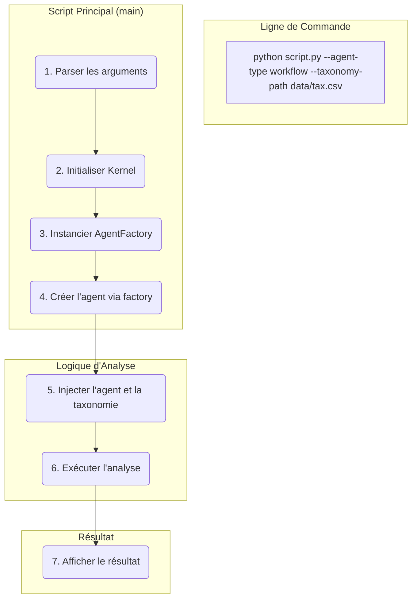

# Analyse et Plan de Paramétrisation

Rapport d'analyse des scripts et composants pour préparer la paramétrisation des tests de la démo EPITA.

---

### **1. Localisation des Fichiers de Taxonomie**

Les fichiers de taxonomie `.csv` ont été localisés dans le répertoire `argumentation_analysis/data/`:
*   `argumentum_fallacies_taxonomy.csv` (Fichier principal)
*   `mock_taxonomy.csv` (Fichier de test)
*   `mock_taxonomy_cards.csv` (Fichier de test)

---

### **2. Analyse de l'Existant**

**a. Comment les agents d'analyse informelle sont-ils actuellement instanciés ?**

*   **Dans `demos/validation_complete_epita.py`:** L'instanciation est directe et codée en dur (`TaxonomySophismDetector`) ou masquée et non configurable (via `OrchestrationServiceManager`).
*   **Dans `examples/scripts_demonstration/demonstration_epita.py`:** Le script n'instancie aucun agent ; il délègue à des sous-modules où l'instanciation est entièrement codée en dur.

**b. Le chargement de la taxonomie est-il codé en dur ?**

*   **Dans `demos/validation_complete_epita.py`:** Partiellement. Un argument `--taxonomy` existe mais n'est pas utilisé de manière cohérente par tous les composants.
*   **Dans `examples/scripts_demonstration/demonstration_epita.py`:** Oui, totalement. Le chargement est implicite et réalisé dans les sous-modules.

**c. L'`agent_factory` est-elle déjà utilisée ?**

*   Non, elle n'est utilisée dans aucun des deux scripts. Son intégration est la clé de la flexibilité recherchée.

---

### **3. Plan de Modification Proposé**

L'objectif est d'unifier le comportement des scripts en ajoutant des arguments en ligne de commande (`--agent-type`, `--taxonomy-path`) et en centralisant la création d'agents via la `AgentFactory`.

#### **Diagramme du Flux Cible**

#### **Modifications Détaillées**

1.  **Pour `demos/validation_complete_epita.py`:**
    *   Ajouter un argument `--agent-type` avec `argparse`.
    *   Modifier la classe `ValidationEpitaComplete` pour initialiser un `Kernel` et une `AgentFactory`.
    *   Remplacer les instanciations directes (`TaxonomySophismDetector`, `OrchestrationServiceManager`) par un appel à la factory en utilisant `args.agent_type`.
    *   Refactoriser `validate_informal_analysis_scenarios` pour utiliser l'agent unique créé.

2.  **Pour `examples/scripts_demonstration/demonstration_epita.py`:**
    *   Ajouter les arguments `--agent-type` et `--taxonomy-path` avec `argparse`.
    *   Modifier la fonction `charger_et_executer_module` pour qu'elle propage ces nouveaux paramètres aux sous-modules via `**kwargs`.
    *   Mettre à jour tous les appels à `charger_et_executer_module` pour passer les options.
    *   Modifier les modules de démonstration cibles (ex: `demo_analyse_argumentation.py`) pour qu'ils acceptent `agent_type` et `taxonomy_path`, et instancient l'agent via la `AgentFactory` au lieu de coder en dur la création.