# RAPPORT D'ANALYSE ARCHITECTURALE ET PLAN D'INTÉGRATION JTMS

**Projet Intelligence Symbolique EPITA**  
**Date:** 10/06/2025  
**Version:** 1.0  
**Auteur:** Architecture Team

---

## EXECUTIVE SUMMARY

Ce rapport présente l'analyse architecturale complète du projet d'intelligence symbolique EPITA et propose un plan détaillé d'intégration du système JTMS (Justification-based Truth Maintenance System) selon trois axes prioritaires :

1. **Intégration Agents Sherlock/Watson** - Enrichissement du raisonnement d'enquête
2. **Plugin Semantic Kernel Natif** - Interface standardisée pour manipulation LLM
3. **Interface Web Interactive** - Visualisation et manipulation temps réel

---

## PHASE 1 : ANALYSE ARCHITECTURALE APPROFONDIE

### 1.1 Architecture Agentique Hiérarchique (3 Niveaux)

L'architecture existante présente une structure hiérarchique mature et bien organisée :

```
┌─────────────────────────────────────────────────────────────┐
│                    NIVEAU STRATÉGIQUE                       │
│  • Planification globale et allocation de ressources       │
│  • Décisions de haut niveau et objectifs                   │
│  • StrategicManager + StrategicState                       │
└─────────────────────┬───────────────────────────────────────┘
                      │ StrategicTacticalInterface
┌─────────────────────▼───────────────────────────────────────┐
│                     NIVEAU TACTIQUE                        │
│  • Coordination des tâches et résolution de conflits       │
│  • TaskCoordinator + TacticalState                         │
│  • Orchestrateurs spécialisés (Cluedo, Einstein, etc.)     │
└─────────────────────┬───────────────────────────────────────┘
                      │ TacticalOperationalInterface
┌─────────────────────▼───────────────────────────────────────┐
│                   NIVEAU OPÉRATIONNEL                      │
│  • Exécution directe des tâches spécifiques               │
│  • Agents Sherlock/Watson + OperationalManager             │
│  • Adaptateurs vers outils d'analyse rhétorique           │
└─────────────────────────────────────────────────────────────┘
```

**Points Forts :**
- Séparation claire des responsabilités
- Interfaces bien définies entre niveaux
- Architecture modulaire et extensible
- Support pour orchestration distribué

### 1.2 Système JTMS Existant

**Analyse du module `1.4.1-JTMS/` :**

#### Architecture JTMS Core

```python
# Classes principales identifiées
class Belief:
    - name: str
    - valid: Optional[bool]  # True/False/None
    - non_monotonic: bool    # Détection de boucles
    - justifications: List[Justification]
    - implications: List[Justification]

class Justification:
    - in_list: List[Belief]    # Prémisses positives
    - out_list: List[Belief]   # Prémisses négatives  
    - conclusion: Belief       # Croyance résultante

class JTMS:
    - beliefs: Dict[str, Belief]
    - strict: bool             # Mode validation stricte
```

**Capacités Actuelles :**
- ✅ Maintenance de croyances avec justifications
- ✅ Propagation automatique de vérité
- ✅ Détection de cycles non-monotoniques (NetworkX)
- ✅ Visualisation interactive (PyVis -> HTML)
- ✅ Chargement depuis JSON structuré
- ✅ Explication de croyances avec traçabilité

**Limitations Identifiées :**
- ❌ Pas d'interface API standardisée
- ❌ Pas d'intégration avec agents existants
- ❌ Pas de persistance distribuée
- ❌ Pas de versioning des états
- ❌ Interface utilisateur basique

### 1.3 Agents Sherlock/Watson Existants

**Architecture Actuelle :**

```python
# Agents identifiés dans argumentation_analysis/agents/core/
SherlockEnqueteAgent:
    - Spécialisation: déduction logique, enquêtes
    - Utilisé dans: CluedoOrchestrator, EinsteinDemo
    - Gestion: belief_set_initial_watson dans enquete_states

WatsonLogicAssistant:
    - Spécialisation: analyse formelle, vérification consistance
    - Capacités: step-by-step reasoning, validation logique
    - Intégration: constants management, formal analysis
```

**Flux de Raisonnement Actuel :**
1. Sherlock analyse problème et formule hypothèses
2. Watson effectue analyse formelle et vérifications
3. Sherlock interprète résultats de Watson
4. Watson valide solutions proposées

**Opportunités d'Intégration JTMS :**
- Traçabilité complète des déductions Sherlock
- Gestion de croyances contradictoires par Watson
- Propagation automatique lors de nouvelles évidences
- Explication de chaînes de raisonnement

### 1.4 Pipeline d'Orchestration Unifié

**Architecture Pipeline :**

```python
# Fichier: argumentation_analysis/pipelines/unified_orchestration_pipeline.py
UnifiedOrchestrationPipeline:
    - Architecture hiérarchique intégrée (3 niveaux)
    - OrchestrationServiceManager centralisé
    - Support multi-modes (Cluedo, Einstein, Rhetorical)
    - Compatibilité API existante
```

**Points d'Intégration JTMS Identifiés :**
1. **Service Manager** - Gestion centralisée des croyances
2. **Pipeline States** - Persistance des états JTMS
3. **Agent Communication** - Propagation inter-agents
4. **Results Aggregation** - Consolidation des inférences

### 1.5 Infrastructure Web/API

**Architecture Actuelle :**
- **Flask Interface** (`interface_web/app.py`) - Interface utilisateur
- **FastAPI Backend** (`api/`) - Services REST
- **Templates Web** - Interface responsive
- **Tests Playwright** - Validation automatisée

**État des Services :**
- ✅ Flask actif sur port par défaut
- ✅ FastAPI actif sur port 8000
- ✅ Tests d'intégration fonctionnels

---

## PHASE 2 : PLAN D'INTÉGRATION DÉTAILLÉ

### 2.1 AXE A : INTÉGRATION AGENTS SHERLOCK/WATSON 

#### 2.1.1 Architecture Proposée

```
┌─────────────────────────────────────────────────────────────┐
│               SHERLOCK ENRICHI AVEC JTMS                   │
│                                                             │
│ ┌─────────────────┐    ┌─────────────────┐                │
│ │ Hypothesis      │    │ Evidence        │                │
│ │ Generator       │    │ Tracker         │                │
│ │                 │    │                 │                │
│ │ • Formule       │    │ • Collecte      │                │
│ │   hypothèses    │    │   évidences     │                │
│ │ • Crée beliefs  │    │ • Met à jour    │                │
│ │   JTMS          │    │   JTMS          │                │
│ └─────────────────┘    └─────────────────┘                │
│           │                      │                        │
│           └──────────┬───────────┘                        │
│                      ▼                                     │
│ ┌─────────────────────────────────────────────────────────│
│ │           JTMS INSTANCE SHERLOCK                        │
│ │                                                         │
│ │ • Beliefs: hypothèses, évidences, déductions           │
│ │ • Justifications: chaînes de raisonnement              │
│ │ • Non-monotonic: gestion contradictions                │
│ └─────────────────────────────────────────────────────────│
└─────────────────────────────────────────────────────────────┘
                              │
                              ▼
┌─────────────────────────────────────────────────────────────┐
│                WATSON ENRICHI AVEC JTMS                    │
│                                                             │
│ ┌─────────────────┐    ┌─────────────────┐                │
│ │ Consistency     │    │ Formal          │                │
│ │ Checker         │    │ Validator       │                │
│ │                 │    │                 │                │
│ │ • Vérifie       │    │ • Valide        │                │
│ │   cohérence     │    │   inférences    │                │
│ │ • Détecte       │    │ • Prouve        │                │
│ │   conflits      │    │   théorèmes     │                │
│ └─────────────────┘    └─────────────────┘                │
│           │                      │                        │
│           └──────────┬───────────┘                        │
│                      ▼                                     │
│ ┌─────────────────────────────────────────────────────────│
│ │            JTMS INSTANCE WATSON                         │
│ │                                                         │
│ │ • Beliefs: validations, preuves, cohérences            │
│ │ • Justifications: étapes de validation                 │
│ │ • Meta-reasoning: raisonnement sur le raisonnement     │
│ └─────────────────────────────────────────────────────────│
└─────────────────────────────────────────────────────────────┘
```

#### 2.1.2 Spécifications Techniques

**A.1 - Extension SherlockEnqueteAgent**

```python
class SherlockJTMSAgent(SherlockEnqueteAgent):
    def __init__(self, kernel, agent_name, system_prompt):
        super().__init__(kernel, agent_name, system_prompt)
        self.jtms = JTMS(strict=False)
        self.hypothesis_tracker = HypothesisTracker(self.jtms)
        self.evidence_manager = EvidenceManager(self.jtms)
    
    async def formulate_hypothesis(self, context: str) -> Dict:
        """Formule hypothèse et l'enregistre dans JTMS"""
        hypothesis = await self.generate_hypothesis(context)
        
        # Créer belief dans JTMS
        belief_name = f"hypothesis_{len(self.jtms.beliefs)}"
        self.jtms.add_belief(belief_name)
        
        # Ajouter justification basée sur évidences
        evidence_beliefs = self.evidence_manager.get_supporting_evidence()
        if evidence_beliefs:
            self.jtms.add_justification(
                in_list=evidence_beliefs,
                out_list=[],
                conclusion_name=belief_name
            )
        
        return {
            "hypothesis": hypothesis,
            "belief_id": belief_name,
            "justification_chain": self.jtms.explain_belief(belief_name),
            "confidence": self._calculate_confidence(belief_name)
        }
    
    async def update_with_evidence(self, evidence: Dict) -> Dict:
        """Met à jour JTMS avec nouvelles évidences"""
        evidence_belief = self.evidence_manager.add_evidence(evidence)
        
        # Propagation automatique vers hypothèses
        affected_beliefs = self._find_affected_beliefs(evidence_belief)
        
        return {
            "evidence_added": evidence_belief,
            "affected_hypotheses": affected_beliefs,
            "new_inferences": self._extract_new_inferences()
        }
```

**A.2 - Extension WatsonLogicAssistant**

```python
class WatsonJTMSAgent(WatsonLogicAssistant):
    def __init__(self, kernel, agent_name, system_prompt, constants=None):
        super().__init__(kernel, agent_name, system_prompt, constants)
        self.jtms = JTMS(strict=True)  # Mode strict pour validation
        self.consistency_checker = ConsistencyChecker(self.jtms)
        self.formal_validator = FormalValidator(self.jtms)
    
    async def validate_sherlock_reasoning(self, sherlock_jtms: JTMS) -> Dict:
        """Valide le raisonnement de Sherlock via JTMS"""
        validation_results = {}
        
        # Import des croyances de Sherlock pour validation
        for belief_name, belief in sherlock_jtms.beliefs.items():
            if belief.valid:
                self._import_belief_for_validation(belief_name, belief)
        
        # Vérification de cohérence
        consistency_report = self.consistency_checker.check_global_consistency()
        validation_results["consistency"] = consistency_report
        
        # Validation formelle des inférences
        for belief_name in sherlock_jtms.beliefs:
            if sherlock_jtms.beliefs[belief_name].valid:
                formal_proof = await self.formal_validator.prove_belief(belief_name)
                validation_results[f"proof_{belief_name}"] = formal_proof
        
        return validation_results
    
    async def suggest_additional_justifications(self, target_belief: str) -> List[Dict]:
        """Suggère justifications additionnelles pour renforcer croyance"""
        current_justifications = self.jtms.beliefs[target_belief].justifications
        
        # Analyse des justifications manquantes
        missing_supports = self._analyze_justification_gaps(target_belief)
        
        suggestions = []
        for gap in missing_supports:
            suggestion = await self._generate_justification_suggestion(gap)
            suggestions.append(suggestion)
        
        return suggestions
```

#### 2.1.3 Interfaces API

**A.3 - API Communication Sherlock/Watson**

```python
# Interface pour communication JTMS entre agents
class JTMSAgentCommunication:
    def __init__(self, sherlock_agent: SherlockJTMSAgent, watson_agent: WatsonJTMSAgent):
        self.sherlock = sherlock_agent
        self.watson = watson_agent
        self.shared_beliefs = SharedBeliefSpace()
    
    async def sherlock_to_watson_handoff(self) -> Dict:
        """Transfert du raisonnement Sherlock vers Watson pour validation"""
        sherlock_state = self.sherlock.export_jtms_state()
        validation_result = await self.watson.validate_sherlock_reasoning(self.sherlock.jtms)
        
        # Mise à jour des croyances partagées
        validated_beliefs = self._extract_validated_beliefs(validation_result)
        self.shared_beliefs.update(validated_beliefs)
        
        return {
            "transfer_success": True,
            "validation_report": validation_result,
            "shared_beliefs_count": len(self.shared_beliefs.beliefs)
        }
    
    async def watson_to_sherlock_feedback(self) -> Dict:
        """Retour de Watson vers Sherlock avec suggestions"""
        suggestions = await self.watson.suggest_additional_justifications("main_hypothesis")
        
        # Application des suggestions dans JTMS Sherlock
        for suggestion in suggestions:
            await self.sherlock.apply_watson_suggestion(suggestion)
        
        return {
            "suggestions_applied": len(suggestions),
            "sherlock_jtms_updated": True,
            "new_confidence_scores": self.sherlock.get_confidence_scores()
        }
```

### 2.2 AXE B : PLUGIN SEMANTIC KERNEL NATIF

#### 2.2.1 Architecture Plugin

```python
# Fichier: argumentation_analysis/plugins/jtms_plugin.py
from semantic_kernel.plugin_definition import sk_function, sk_function_context_parameter

class JTMSPlugin:
    """Plugin Semantic Kernel pour manipulation JTMS native par LLMs"""
    
    def __init__(self, jtms_service: JTMSService):
        self.jtms_service = jtms_service
        self.current_session = None
    
    @sk_function(
        description="Crée une nouvelle croyance dans le système JTMS",
        name="create_belief"
    )
    @sk_function_context_parameter(
        name="belief_name",
        description="Nom unique de la croyance à créer"
    )
    async def create_belief(self, belief_name: str) -> str:
        """Crée une nouvelle croyance dans JTMS"""
        try:
            self.jtms_service.add_belief(belief_name)
            return f"✅ Croyance '{belief_name}' créée avec succès"
        except Exception as e:
            return f"❌ Erreur création croyance: {str(e)}"
    
    @sk_function(
        description="Ajoute une justification pour soutenir une croyance",
        name="add_justification"
    )
    @sk_function_context_parameter(name="premises", description="Prémisses positives (séparées par virgules)")
    @sk_function_context_parameter(name="negatives", description="Prémisses négatives (séparées par virgules)")
    @sk_function_context_parameter(name="conclusion", description="Croyance conclusion")
    async def add_justification(self, premises: str, negatives: str, conclusion: str) -> str:
        """Ajoute justification dans JTMS"""
        try:
            in_list = [p.strip() for p in premises.split(",") if p.strip()]
            out_list = [n.strip() for n in negatives.split(",") if n.strip()]
            
            self.jtms_service.add_justification(in_list, out_list, conclusion)
            
            return f"✅ Justification ajoutée: {in_list} ⊢ {conclusion} (¬{out_list})"
        except Exception as e:
            return f"❌ Erreur justification: {str(e)}"
    
    @sk_function(
        description="Explique pourquoi une croyance est vraie ou fausse",
        name="explain_belief"
    )
    @sk_function_context_parameter(name="belief_name", description="Nom de la croyance à expliquer")
    async def explain_belief(self, belief_name: str) -> str:
        """Fournit explication détaillée d'une croyance"""
        try:
            explanation = self.jtms_service.explain_belief(belief_name)
            belief = self.jtms_service.get_belief(belief_name)
            
            status = "✅ VRAIE" if belief.valid else "❌ FAUSSE" if belief.valid is False else "❓ INCONNUE"
            
            return f"Croyance '{belief_name}': {status}\n\n{explanation}"
        except Exception as e:
            return f"❌ Erreur explication: {str(e)}"
    
    @sk_function(
        description="Vérifie la cohérence du système de croyances",
        name="check_consistency"
    )
    async def check_consistency(self) -> str:
        """Vérifie cohérence globale du JTMS"""
        try:
            consistency_report = self.jtms_service.check_consistency()
            
            if consistency_report["is_consistent"]:
                return f"✅ Système cohérent ({consistency_report['total_beliefs']} croyances)"
            else:
                conflicts = "\n".join(consistency_report["conflicts"])
                return f"❌ Incohérences détectées:\n{conflicts}"
        except Exception as e:
            return f"❌ Erreur vérification: {str(e)}"
    
    @sk_function(
        description="Génère une visualisation du graphe de croyances",
        name="visualize_beliefs"
    )
    @sk_function_context_parameter(name="output_file", description="Nom du fichier HTML de sortie")
    async def visualize_beliefs(self, output_file: str = "jtms_visualization.html") -> str:
        """Génère visualisation interactive"""
        try:
            self.jtms_service.visualize(output_file)
            return f"✅ Visualisation générée: {output_file}"
        except Exception as e:
            return f"❌ Erreur visualisation: {str(e)}"
```

#### 2.2.2 Service JTMS Centralisé

```python
# Fichier: argumentation_analysis/services/jtms_service.py
class JTMSService:
    """Service centralisé pour gestion JTMS distribué"""
    
    def __init__(self):
        self.sessions: Dict[str, JTMS] = {}
        self.global_jtms = JTMS(strict=False)
        self.belief_versioning = BeliefVersioning()
        self.event_bus = JTMSEventBus()
    
    def create_session(self, session_id: str) -> str:
        """Crée nouvelle session JTMS isolée"""
        if session_id in self.sessions:
            raise ValueError(f"Session {session_id} déjà existante")
        
        self.sessions[session_id] = JTMS(strict=False)
        self.event_bus.emit("session_created", {"session_id": session_id})
        
        return session_id
    
    def get_session(self, session_id: str) -> JTMS:
        """Récupère session JTMS"""
        if session_id not in self.sessions:
            raise ValueError(f"Session {session_id} introuvable")
        return self.sessions[session_id]
    
    def merge_sessions(self, source_session: str, target_session: str) -> Dict:
        """Fusionne deux sessions JTMS"""
        source_jtms = self.get_session(source_session)
        target_jtms = self.get_session(target_session)
        
        merge_conflicts = []
        merged_beliefs = 0
        
        for belief_name, belief in source_jtms.beliefs.items():
            if belief_name in target_jtms.beliefs:
                # Gestion des conflits de fusion
                conflict = self._resolve_merge_conflict(belief_name, belief, target_jtms.beliefs[belief_name])
                if conflict:
                    merge_conflicts.append(conflict)
            else:
                # Import direct de la croyance
                target_jtms.beliefs[belief_name] = belief
                merged_beliefs += 1
        
        self.event_bus.emit("sessions_merged", {
            "source": source_session,
            "target": target_session,
            "merged_beliefs": merged_beliefs,
            "conflicts": len(merge_conflicts)
        })
        
        return {
            "success": True,
            "merged_beliefs": merged_beliefs,
            "conflicts": merge_conflicts
        }
    
    def add_belief(self, belief_name: str, session_id: str = "global") -> None:
        """Ajoute croyance dans session spécifiée"""
        jtms = self.get_session(session_id) if session_id != "global" else self.global_jtms
        jtms.add_belief(belief_name)
        
        # Versioning
        self.belief_versioning.record_change("add_belief", belief_name, session_id)
        
        # Événement
        self.event_bus.emit("belief_added", {
            "belief_name": belief_name,
            "session_id": session_id
        })
    
    def add_justification(self, in_list: List[str], out_list: List[str], 
                         conclusion: str, session_id: str = "global") -> None:
        """Ajoute justification dans session"""
        jtms = self.get_session(session_id) if session_id != "global" else self.global_jtms
        jtms.add_justification(in_list, out_list, conclusion)
        
        # Versioning
        self.belief_versioning.record_change("add_justification", {
            "in_list": in_list,
            "out_list": out_list,
            "conclusion": conclusion
        }, session_id)
        
        # Événement
        self.event_bus.emit("justification_added", {
            "in_list": in_list,
            "out_list": out_list,
            "conclusion": conclusion,
            "session_id": session_id
        })
```

### 2.3 AXE D : INTERFACE WEB INTERACTIVE

#### 2.3.1 Architecture Interface Web

```html
<!-- Fichier: interface_web/templates/jtms_dashboard.html -->
<!DOCTYPE html>
<html lang="fr">
<head>
    <meta charset="UTF-8">
    <meta name="viewport" content="width=device-width, initial-scale=1.0">
    <title>JTMS Dashboard - Intelligence Symbolique EPITA</title>
    <link href="https://cdn.jsdelivr.net/npm/bootstrap@5.1.3/dist/css/bootstrap.min.css" rel="stylesheet">
    <script src="https://unpkg.com/vis-network/standalone/umd/vis-network.min.js"></script>
    <script src="https://cdn.socket.io/4.0.0/socket.io.min.js"></script>
    <style>
        #network-container {
            height: 600px;
            border: 1px solid #ddd;
            background: #f9f9f9;
        }
        .belief-panel {
            background: white;
            border-radius: 8px;
            padding: 20px;
            box-shadow: 0 2px 4px rgba(0,0,0,0.1);
        }
        .justified { color: #28a745; }
        .unjustified { color: #dc3545; }
        .unknown { color: #ffc107; }
        .non-monotonic { color: #fd7e14; }
    </style>
</head>
<body>
    <div class="container-fluid">
        <div class="row">
            <!-- Panneau de contrôle -->
            <div class="col-md-3">
                <div class="belief-panel">
                    <h4>Contrôles JTMS</h4>
                    
                    <!-- Création de croyances -->
                    <div class="mb-3">
                        <label class="form-label">Nouvelle Croyance</label>
                        <div class="input-group">
                            <input type="text" id="new-belief" class="form-control" placeholder="Nom de la croyance">
                            <button class="btn btn-primary" onclick="addBelief()">Créer</button>
                        </div>
                    </div>
                    
                    <!-- Ajout de justifications -->
                    <div class="mb-3">
                        <label class="form-label">Justification</label>
                        <input type="text" id="premises" class="form-control mb-2" placeholder="Prémisses (séparées par virgules)">
                        <input type="text" id="negatives" class="form-control mb-2" placeholder="Négations (séparées par virgules)">
                        <input type="text" id="conclusion" class="form-control mb-2" placeholder="Conclusion">
                        <button class="btn btn-success" onclick="addJustification()">Ajouter</button>
                    </div>
                    
                    <!-- Sessions -->
                    <div class="mb-3">
                        <label class="form-label">Sessions</label>
                        <select id="session-select" class="form-select" onchange="switchSession()">
                            <option value="global">Session Globale</option>
                        </select>
                        <div class="mt-2">
                            <input type="text" id="new-session" class="form-control" placeholder="Nouvelle session">
                            <button class="btn btn-outline-primary btn-sm mt-1" onclick="createSession()">Créer Session</button>
                        </div>
                    </div>
                    
                    <!-- Actions -->
                    <div class="d-grid gap-2">
                        <button class="btn btn-info" onclick="checkConsistency()">Vérifier Cohérence</button>
                        <button class="btn btn-warning" onclick="exportJTMS()">Exporter JSON</button>
                        <button class="btn btn-secondary" onclick="resetJTMS()">Réinitialiser</button>
                    </div>
                </div>
                
                <!-- Panneau détails croyance sélectionnée -->
                <div class="belief-panel mt-3">
                    <h5>Détails Croyance</h5>
                    <div id="belief-details">
                        <p class="text-muted">Sélectionnez une croyance dans le graphe</p>
                    </div>
                </div>
            </div>
            
            <!-- Visualisation graphique -->
            <div class="col-md-6">
                <div class="belief-panel">
                    <h4>Graphe de Croyances</h4>
                    <div id="network-container"></div>
                </div>
            </div>
            
            <!-- Panneau d'informations -->
            <div class="col-md-3">
                <div class="belief-panel">
                    <h4>Statistiques</h4>
                    <div id="stats-panel">
                        <div class="row">
                            <div class="col-6">
                                <div class="text-center">
                                    <h3 id="total-beliefs" class="mb-0">0</h3>
                                    <small class="text-muted">Croyances</small>
                                </div>
                            </div>
                            <div class="col-6">
                                <div class="text-center">
                                    <h3 id="total-justifications" class="mb-0">0</h3>
                                    <small class="text-muted">Justifications</small>
                                </div>
                            </div>
                        </div>
                        
                        <hr>
                        
                        <div class="row">
                            <div class="col-6">
                                <div class="text-center">
                                    <h5 id="valid-beliefs" class="justified mb-0">0</h5>
                                    <small class="text-muted">Validées</small>
                                </div>
                            </div>
                            <div class="col-6">
                                <div class="text-center">
                                    <h5 id="invalid-beliefs" class="unjustified mb-0">0</h5>
                                    <small class="text-muted">Invalides</small>
                                </div>
                            </div>
                        </div>
                        
                        <div class="row mt-2">
                            <div class="col-6">
                                <div class="text-center">
                                    <h5 id="unknown-beliefs" class="unknown mb-0">0</h5>
                                    <small class="text-muted">Inconnues</small>
                                </div>
                            </div>
                            <div class="col-6">
                                <div class="text-center">
                                    <h5 id="nonmonotonic-beliefs" class="non-monotonic mb-0">0</h5>
                                    <small class="text-muted">Non-mon.</small>
                                </div>
                            </div>
                        </div>
                    </div>
                </div>
                
                <!-- Log d'activité -->
                <div class="belief-panel mt-3">
                    <h5>Log d'Activité</h5>
                    <div id="activity-log" style="height: 300px; overflow-y: auto;">
                        <!-- Les logs s'affichent ici -->
                    </div>
                </div>
            </div>
        </div>
    </div>

    <script src="{{ url_for('static', filename='js/jtms_dashboard.js') }}"></script>
</body>
</html>
```

#### 2.3.2 JavaScript Frontend

```javascript
// Fichier: interface_web/static/js/jtms_dashboard.js
class JTMSDashboard {
    constructor() {
        this.network = null;
        this.nodes = new vis.DataSet([]);
        this.edges = new vis.DataSet([]);
        this.socket = io();
        this.currentSession = 'global';
        
        this.initializeNetwork();
        this.setupSocketListeners();
        this.loadInitialData();
    }
    
    initializeNetwork() {
        const container = document.getElementById('network-container');
        const data = {
            nodes: this.nodes,
            edges: this.edges
        };
        
        const options = {
            nodes: {
                shape: 'box',
                margin: 10,
                font: { size: 14 },
                borderWidth: 2,
                shadow: true
            },
            edges: {
                arrows: { to: { enabled: true, scaleFactor: 1 } },
                color: { inherit: false },
                width: 2,
                shadow: true
            },
            physics: {
                stabilization: { iterations: 200 },
                barnesHut: { gravitationalConstant: -2000, springConstant: 0.001 }
            },
            interaction: {
                hover: true,
                selectConnectedEdges: false
            }
        };
        
        this.network = new vis.Network(container, data, options);
        
        // Event listeners
        this.network.on('selectNode', (params) => {
            if (params.nodes.length > 0) {
                const nodeId = params.nodes[0];
                this.showBeliefDetails(nodeId);
            }
        });
        
        this.network.on('hoverNode', (params) => {
            const nodeId = params.node;
            this.highlightBeliefPath(nodeId);
        });
    }
    
    setupSocketListeners() {
        this.socket.on('belief_added', (data) => {
            this.addBeliefToGraph(data.belief_name, data.belief_data);
            this.logActivity(`✅ Croyance ajoutée: ${data.belief_name}`);
        });
        
        this.socket.on('justification_added', (data) => {
            this.addJustificationToGraph(data);
            this.logActivity(`🔗 Justification: ${data.in_list.join(', ')} ⊢ ${data.conclusion}`);
        });
        
        this.socket.on('belief_updated', (data) => {
            this.updateBeliefInGraph(data.belief_name, data.belief_data);
            this.logActivity(`📝 Croyance mise à jour: ${data.belief_name}`);
        });
        
        this.socket.on('consistency_check', (data) => {
            this.handleConsistencyResult(data);
        });
    }
    
    async loadInitialData() {
        try {
            const response = await fetch(`/api/jtms/session/${this.currentSession}`);
            const data = await response.json();
            
            this.loadJTMSData(data);
            this.updateStatistics(data.statistics);
        } catch (error) {
            console.error('Erreur chargement données:', error);
            this.logActivity('❌ Erreur chargement des données initiales');
        }
    }
    
    loadJTMSData(data) {
        // Clear existing data
        this.nodes.clear();
        this.edges.clear();
        
        // Add beliefs as nodes
        for (const [beliefName, beliefData] of Object.entries(data.beliefs)) {
            this.addBeliefToGraph(beliefName, beliefData);
        }
        
        // Add justifications as edges
        for (const justification of data.justifications) {
            this.addJustificationToGraph(justification);
        }
        
        this.network.fit();
    }
    
    addBeliefToGraph(beliefName, beliefData) {
        const color = this.getBeliefColor(beliefData);
        const node = {
            id: beliefName,
            label: beliefName,
            color: color,
            title: this.getBeliefTooltip(beliefData),
            font: { 
                color: color.border === '#fd7e14' ? '#000' : '#fff' // Contraste pour non-monotonic
            }
        };
        
        this.nodes.update(node);
    }
    
    getBeliefColor(beliefData) {
        if (beliefData.non_monotonic) {
            return { background: '#fd7e14', border: '#fd7e14' }; // Orange pour non-monotonic
        } else if (beliefData.valid === true) {
            return { background: '#28a745', border: '#1e7e34' }; // Vert pour valide
        } else if (beliefData.valid === false) {
            return { background: '#dc3545', border: '#bd2130' }; // Rouge pour invalide
        } else {
            return { background: '#ffc107', border: '#e0a800' }; // Jaune pour inconnu
        }
    }
    
    getBeliefTooltip(beliefData) {
        const status = beliefData.non_monotonic ? 'Non-monotonic' :
                      beliefData.valid === true ? 'Valide' :
                      beliefData.valid === false ? 'Invalide' : 'Inconnu';
        
        let tooltip = `Statut: ${status}\n`;
        if (beliefData.justifications.length > 0) {
            tooltip += `Justifications: ${beliefData.justifications.length}\n`;
        }
        if (beliefData.implications.length > 0) {
            tooltip += `Implications: ${beliefData.implications.length}`;
        }
        
        return tooltip;
    }
    
    addJustificationToGraph(justificationData) {
        const { in_list, out_list, conclusion } = justificationData;
        
        // Add edges from premises to conclusion
        for (const premise of in_list) {
            this.edges.update({
                id: `${premise}->${conclusion}`,
                from: premise,
                to: conclusion,
                color: { color: '#28a745' }, // Vert pour prémisses positives
                title: 'Prémisse positive',
                dashes: false
            });
        }
        
        // Add edges from negations to conclusion
        for (const negation of out_list) {
            this.edges.update({
                id: `¬${negation}->${conclusion}`,
                from: negation,
                to: conclusion,
                color: { color: '#dc3545' }, // Rouge pour prémisses négatives
                title: 'Prémisse négative',
                dashes: true
            });
        }
    }
    
    async showBeliefDetails(beliefName) {
        try {
            const response = await fetch(`/api/jtms/belief/${beliefName}?session=${this.currentSession}`);
            const data = await response.json();
            
            const detailsHtml = `
                <h6>${beliefName}</h6>
                <p><strong>Statut:</strong> <span class="${this.getStatusClass(data)}">${this.getStatusText(data)}</span></p>
                
                ${data.justifications.length > 0 ? `
                    <h6>Justifications:</h6>
                    <ul class="list-unstyled">
                        ${data.justifications.map(j => `
                            <li class="mb-2">
                                <strong>IN:</strong> ${j.in_list.join(', ') || '-'}<br>
                                <strong>OUT:</strong> ${j.out_list.join(', ') || '-'}<br>
                                <small class="text-muted">→ ${j.valid ? '✅ Valide' : '❌ Invalide'}</small>
                            </li>
                        `).join('')}
                    </ul>
                ` : '<p><em>Aucune justification</em></p>'}
                
                ${data.implications.length > 0 ? `
                    <h6>Implications:</h6>
                    <ul class="list-unstyled">
                        ${data.implications.map(imp => `<li>${imp}</li>`).join('')}
                    </ul>
                ` : ''}
                
                <div class="mt-3">
                    <button class="btn btn-sm btn-outline-danger" onclick="removeBelief('${beliefName}')">
                        Supprimer
                    </button>
                </div>
            `;
            
            document.getElementById('belief-details').innerHTML = detailsHtml;
        } catch (error) {
            console.error('Erreur détails croyance:', error);
        }
    }
    
    getStatusClass(beliefData) {
        if (beliefData.non_monotonic) return 'non-monotonic';
        if (beliefData.valid === true) return 'justified';
        if (beliefData.valid === false) return 'unjustified';
        return 'unknown';
    }
    
    getStatusText(beliefData) {
        if (beliefData.non_monotonic) return 'Non-monotonic';
        if (beliefData.valid === true) return 'Valide';
        if (beliefData.valid === false) return 'Invalide';
        return 'Inconnu';
    }
    
    logActivity(message) {
        const timestamp = new Date().toLocaleTimeString();
        const logHtml = `<div class="mb-1"><small class="text-muted">${timestamp}</small> ${message}</div>`;
        
        const logContainer = document.getElementById('activity-log');
        logContainer.insertAdjacentHTML('afterbegin', logHtml);
        
        // Limiter à 100 entrées
        const logs = logContainer.children;
        if (logs.length > 100) {
            logContainer.removeChild(logs[logs.length - 1]);
        }
    }
}

// Fonctions globales pour interface
async function addBelief() {
    const beliefName = document.getElementById('new-belief').value.trim();
    if (!beliefName) return;
    
    try {
        const response = await fetch('/api/jtms/belief', {
            method: 'POST',
            headers: { 'Content-Type': 'application/json' },
            body: JSON.stringify({
                belief_name: beliefName,
                session_id: dashboard.currentSession
            })
        });
        
        if (response.ok) {
            document.getElementById('new-belief').value = '';
        } else {
            const error = await response.json();
            dashboard.logActivity(`❌ Erreur: ${error.message}`);
        }
    } catch (error) {
        console.error('Erreur ajout croyance:', error);
        dashboard.logActivity('❌ Erreur réseau lors de l\'ajout');
    }
}

async function addJustification() {
    const premises = document.getElementById('premises').value.trim();
    const negatives = document.getElementById('negatives').value.trim();
    const conclusion = document.getElementById('conclusion').value.trim();
    
    if (!conclusion) {
        alert('La conclusion est obligatoire');
        return;
    }
    
    try {
        const response = await fetch('/api/jtms/justification', {
            method: 'POST',
            headers: { 'Content-Type': 'application/json' },
            body: JSON.stringify({
                in_list: premises ? premises.split(',').map(s => s.trim()) : [],
                out_list: negatives ? negatives.split(',').map(s => s.trim()) : [],
                conclusion: conclusion,
                session_id: dashboard.currentSession
            })
        });
        
        if (response.ok) {
            document.getElementById('premises').value = '';
            document.getElementById('negatives').value = '';
            document.getElementById('conclusion').value = '';
        } else {
            const error = await response.json();
            dashboard.logActivity(`❌ Erreur: ${error.message}`);
        }
    } catch (error) {
        console.error('Erreur ajout justification:', error);
        dashboard.logActivity('❌ Erreur réseau lors de l\'ajout de justification');
    }
}

// Initialisation
let dashboard;
document.addEventListener('DOMContentLoaded', () => {
    dashboard = new JTMSDashboard();
});
```

#### 2.3.3 Backend Flask Intégration

```python
# Fichier: interface_web/routes/jtms_routes.py
from flask import Blueprint, request, jsonify, render_template
from flask_socketio import emit, join_room, leave_room
from argumentation_analysis.services.jtms_service import JTMSService

jtms_bp = Blueprint('jtms', __name__, url_prefix='/jtms')
jtms_service = JTMSService()

@jtms_bp.route('/dashboard')
def dashboard():
    """Interface dashboard JTMS"""
    return render_template('jtms_dashboard.html')

@jtms_bp.route('/api/session/<session_id>')
def get_session_data(session_id):
    """Récupère données complètes d'une session JTMS"""
    try:
        jtms = jtms_service.get_session(session_id) if session_id != 'global' else jtms_service.global_jtms
        
        # Conversion JTMS vers JSON
        beliefs_data = {}
        justifications_data = []
        
        for belief_name, belief in jtms.beliefs.items():
            beliefs_data[belief_name] = {
                'valid': belief.valid,
                'non_monotonic': belief.non_monotonic,
                'justifications': [
                    {
                        'in_list': [str(b) for b in j.in_list],
                        'out_list': [str(b) for b in j.out_list],
                        'valid': all(b.valid for b in j.in_list) and not any(b.valid for b in j.out_list)
                    }
                    for j in belief.justifications
                ],
                'implications': [str(j.conclusion) for j in belief.implications]
            }
            
            # Collecte des justifications pour le graphe
            for j in belief.justifications:
                justifications_data.append({
                    'in_list': [str(b) for b in j.in_list],
                    'out_list': [str(b) for b in j.out_list],
                    'conclusion': belief_name
                })
        
        # Statistiques
        total_beliefs = len(jtms.beliefs)
        valid_count = sum(1 for b in jtms.beliefs.values() if b.valid is True)
        invalid_count = sum(1 for b in jtms.beliefs.values() if b.valid is False)
        unknown_count = sum(1 for b in jtms.beliefs.values() if b.valid is None and not b.non_monotonic)
        nonmonotonic_count = sum(1 for b in jtms.beliefs.values() if b.non_monotonic)
        
        return jsonify({
            'beliefs': beliefs_data,
            'justifications': justifications_data,
            'statistics': {
                'total_beliefs': total_beliefs,
                'total_justifications': len(justifications_data),
                'valid_beliefs': valid_count,
                'invalid_beliefs': invalid_count,
                'unknown_beliefs': unknown_count,
                'nonmonotonic_beliefs': nonmonotonic_count
            }
        })
        
    except Exception as e:
        return jsonify({'error': str(e)}), 400

@jtms_bp.route('/api/belief', methods=['POST'])
def add_belief():
    """Ajoute nouvelle croyance"""
    try:
        data = request.get_json()
        belief_name = data['belief_name']
        session_id = data.get('session_id', 'global')
        
        jtms_service.add_belief(belief_name, session_id)
        
        # Notification temps réel
        emit('belief_added', {
            'belief_name': belief_name,
            'session_id': session_id,
            'belief_data': {
                'valid': None,
                'non_monotonic': False,
                'justifications': [],
                'implications': []
            }
        }, broadcast=True)
        
        return jsonify({'success': True, 'message': f'Croyance {belief_name} ajoutée'})
        
    except Exception as e:
        return jsonify({'error': str(e)}), 400

@jtms_bp.route('/api/justification', methods=['POST'])
def add_justification():
    """Ajoute nouvelle justification"""
    try:
        data = request.get_json()
        in_list = data['in_list']
        out_list = data['out_list']
        conclusion = data['conclusion']
        session_id = data.get('session_id', 'global')
        
        jtms_service.add_justification(in_list, out_list, conclusion, session_id)
        
        # Notification temps réel
        emit('justification_added', {
            'in_list': in_list,
            'out_list': out_list,
            'conclusion': conclusion,
            'session_id': session_id
        }, broadcast=True)
        
        return jsonify({'success': True, 'message': 'Justification ajoutée'})
        
    except Exception as e:
        return jsonify({'error': str(e)}), 400

@jtms_bp.route('/api/belief/<belief_name>')
def get_belief_details(belief_name):
    """Récupère détails d'une croyance spécifique"""
    try:
        session_id = request.args.get('session', 'global')
        jtms = jtms_service.get_session(session_id) if session_id != 'global' else jtms_service.global_jtms
        
        if belief_name not in jtms.beliefs:
            return jsonify({'error': 'Croyance introuvable'}), 404
        
        belief = jtms.beliefs[belief_name]
        
        return jsonify({
            'name': belief_name,
            'valid': belief.valid,
            'non_monotonic': belief.non_monotonic,
            'justifications': [
                {
                    'in_list': [str(b) for b in j.in_list],
                    'out_list': [str(b) for b in j.out_list],
                    'valid': all(b.valid for b in j.in_list) and not any(b.valid for b in j.out_list)
                }
                for j in belief.justifications
            ],
            'implications': [str(j.conclusion) for j in belief.implications],
            'explanation': jtms.explain_belief(belief_name)
        })
        
    except Exception as e:
        return jsonify({'error': str(e)}), 400

@jtms_bp.route('/api/consistency/<session_id>')
def check_session_consistency(session_id):
    """Vérifie cohérence d'une session"""
    try:
        consistency_report = jtms_service.check_consistency(session_id)
        
        # Notification temps réel
        emit('consistency_check', {
            'session_id': session_id,
            'is_consistent': consistency_report['is_consistent'],
            'conflicts': consistency_report.get('conflicts', []),
            'timestamp': datetime.now().isoformat()
        }, broadcast=True)
        
        return jsonify(consistency_report)
        
    except Exception as e:
        return jsonify({'error': str(e)}), 400
```

---

## PHASE 3 : SPÉCIFICATIONS D'IMPLÉMENTATION

### 3.1 Modèles de Données

#### 3.1.1 Modèle Belief Étendu

```python
# Fichier: argumentation_analysis/models/extended_belief.py
from dataclasses import dataclass, field
from typing import List, Dict, Optional, Any
from datetime import datetime
from enum import Enum

class BeliefStatus(Enum):
    UNKNOWN = None
    VALID = True
    INVALID = False

class BeliefOrigin(Enum):
    USER_INPUT = "user_input"
    AGENT_DEDUCTION = "agent_deduction"
    SYSTEM_INFERENCE = "system_inference"
    IMPORTED = "imported"

@dataclass
class ExtendedBelief:
    """Modèle de croyance étendu pour intégration agents"""
    name: str
    status: BeliefStatus = BeliefStatus.UNKNOWN
    non_monotonic: bool = False
    
    # Métadonnées d'origine
    origin: BeliefOrigin = BeliefOrigin.USER_INPUT
    creator_agent: Optional[str] = None
    creation_timestamp: datetime = field(default_factory=datetime.now)
    
    # Contexte et annotations
    context: Dict[str, Any] = field(default_factory=dict)
    confidence_score: float = 0.0
    tags: List[str] = field(default_factory=list)
    
    # Relations JTMS
    justifications: List['ExtendedJustification'] = field(default_factory=list)
    implications: List['ExtendedJustification'] = field(default_factory=list)
    
    # Traçabilité
    modification_history: List[Dict] = field(default_factory=list)
    
    def add_justification(self, justification: 'ExtendedJustification'):
        """Ajoute justification avec traçabilité"""
        self.justifications.append(justification)
        self.record_modification("add_justification", {
            "justification_id": id(justification),
            "premises": [str(b) for b in justification.in_list],
            "negatives": [str(b) for b in justification.out_list]
        })
        self.compute_truth_statement()
    
    def record_modification(self, action: str, details: Dict):
        """Enregistre modification pour traçabilité"""
        self.modification_history.append({
            "action": action,
            "timestamp": datetime.now(),
            "details": details
        })
    
    def compute_confidence(self) -> float:
        """Calcule score de confiance basé sur justifications"""
        if not self.justifications:
            return 0.0
        
        valid_justifications = sum(1 for j in self.justifications if j.is_valid())
        return valid_justifications / len(self.justifications)

@dataclass
class ExtendedJustification:
    """Justification étendue avec métadonnées"""
    in_list: List[ExtendedBelief]
    out_list: List[ExtendedBelief]
    conclusion: ExtendedBelief
    
    # Métadonnées
    rule_type: str = "modus_ponens"
    strength: float = 1.0
    creator_agent: Optional[str] = None
    creation_timestamp: datetime = field(default_factory=datetime.now)
    
    def is_valid(self) -> bool:
        """Détermine si justification est valide"""
        return (all(b.status == BeliefStatus.VALID for b in self.in_list) and 
                all(b.status != BeliefStatus.VALID for b in self.out_list))
```

#### 3.1.2 Modèle Session JTMS

```python
# Fichier: argumentation_analysis/models/jtms_session.py
@dataclass
class JTMSSession:
    """Session JTMS avec gestion d'état avancée"""
    session_id: str
    name: str
    description: str = ""
    
    # État JTMS
    beliefs: Dict[str, ExtendedBelief] = field(default_factory=dict)
    strict_mode: bool = False
    
    # Métadonnées session
    created_at: datetime = field(default_factory=datetime.now)
    last_modified: datetime = field(default_factory=datetime.now)
    owner_agent: Optional[str] = None
    
    # Versioning
    version: int = 1
    parent_session: Optional[str] = None
    checkpoints: List[Dict] = field(default_factory=list)
    
    # Statistiques
    total_inferences: int = 0
    consistency_checks: int = 0
    last_consistency_status: bool = True
    
    def create_checkpoint(self, name: str) -> str:
        """Crée point de sauvegarde de l'état"""
        checkpoint_id = f"checkpoint_{len(self.checkpoints)}_{int(datetime.now().timestamp())}"
        
        # Sérialisation état actuel
        state_snapshot = {
            "checkpoint_id": checkpoint_id,
            "name": name,
            "timestamp": datetime.now(),
            "version": self.version,
            "beliefs_count": len(self.beliefs),
            "beliefs_state": {
                name: {
                    "status": belief.status.value,
                    "non_monotonic": belief.non_monotonic,
                    "justifications_count": len(belief.justifications)
                }
                for name, belief in self.beliefs.items()
            }
        }
        
        self.checkpoints.append(state_snapshot)
        return checkpoint_id
    
    def rollback_to_checkpoint(self, checkpoint_id: str) -> bool:
        """Revient à un point de sauvegarde"""
        checkpoint = next((cp for cp in self.checkpoints if cp["checkpoint_id"] == checkpoint_id), None)
        if not checkpoint:
            return False
        
        # Implémentation du rollback
        # Note: Nécessite sérialisation/désérialisation complète
        self.record_modification("rollback", {"target_checkpoint": checkpoint_id})
        return True
    
    def merge_with_session(self, other_session: 'JTMSSession') -> 'MergeReport':
        """Fusionne avec autre session"""
        merge_report = MergeReport(
            source_session=other_session.session_id,
            target_session=self.session_id
        )
        
        for belief_name, belief in other_session.beliefs.items():
            if belief_name in self.beliefs:
                # Conflit - nécessite résolution
                conflict = self._resolve_belief_conflict(belief_name, belief, self.beliefs[belief_name])
                merge_report.add_conflict(conflict)
            else:
                # Import direct
                self.beliefs[belief_name] = belief
                merge_report.add_merged_belief(belief_name)
        
        self.version += 1
        self.last_modified = datetime.now()
        
        return merge_report

@dataclass
class MergeReport:
    """Rapport de fusion de sessions"""
    source_session: str
    target_session: str
    timestamp: datetime = field(default_factory=datetime.now)
    
    merged_beliefs: List[str] = field(default_factory=list)
    conflicts: List[Dict] = field(default_factory=list)
    resolutions: List[Dict] = field(default_factory=list)
    
    def add_conflict(self, conflict: Dict):
        self.conflicts.append(conflict)
    
    def add_merged_belief(self, belief_name: str):
        self.merged_beliefs.append(belief_name)
    
    def get_summary(self) -> Dict:
        return {
            "total_merged": len(self.merged_beliefs),
            "total_conflicts": len(self.conflicts),
            "success_rate": len(self.merged_beliefs) / (len(self.merged_beliefs) + len(self.conflicts)) if (len(self.merged_beliefs) + len(self.conflicts)) > 0 else 1.0
        }
```

### 3.2 Interfaces API

#### 3.2.1 API REST pour JTMS Service

```python
# Fichier: api/routers/jtms_router.py
from fastapi import APIRouter, HTTPException, Depends
from typing import List, Dict, Optional
from pydantic import BaseModel

router = APIRouter(prefix="/jtms", tags=["JTMS"])

class BeliefCreateRequest(BaseModel):
    name: str
    session_id: str = "global"
    context: Dict = {}
    tags: List[str] = []

class JustificationCreateRequest(BaseModel):
    in_list: List[str]
    out_list: List[str]
    conclusion: str
    session_id: str = "global"
    rule_type: str = "modus_ponens"
    strength: float = 1.0

class SessionCreateRequest(BaseModel):
    session_id: str
    name: str
    description: str = ""
    strict_mode: bool = False

@router.post("/sessions")
async def create_session(request: SessionCreateRequest):
    """Crée nouvelle session JTMS"""
    try:
        session_id = jtms_service.create_session(
            session_id=request.session_id,
            name=request.name,
            description=request.description,
            strict_mode=request.strict_mode
        )
        return {"success": True, "session_id": session_id}
    except Exception as e:
        raise HTTPException(status_code=400, detail=str(e))

@router.get("/sessions")
async def list_sessions():
    """Liste toutes les sessions JTMS"""
    sessions = jtms_service.list_sessions()
    return {"sessions": sessions}

@router.get("/sessions/{session_id}")
async def get_session(session_id: str):
    """Récupère état complet d'une session"""
    try:
        session_data = jtms_service.get_session_data(session_id)
        return session_data
    except Exception as e:
        raise HTTPException(status_code=404, detail=str(e))

@router.post("/beliefs")
async def create_belief(request: BeliefCreateRequest):
    """Crée nouvelle croyance"""
    try:
        belief_data = jtms_service.create_belief(
            name=request.name,
            session_id=request.session_id,
            context=request.context,
            tags=request.tags
        )
        return {"success": True, "belief": belief_data}
    except Exception as e:
        raise HTTPException(status_code=400, detail=str(e))

@router.post("/justifications")
async def create_justification(request: JustificationCreateRequest):
    """Ajoute justification"""
    try:
        justification_data = jtms_service.create_justification(
            in_list=request.in_list,
            out_list=request.out_list,
            conclusion=request.conclusion,
            session_id=request.session_id,
            rule_type=request.rule_type,
            strength=request.strength
        )
        return {"success": True, "justification": justification_data}
    except Exception as e:
        raise HTTPException(status_code=400, detail=str(e))

@router.get("/beliefs/{belief_name}/explain")
async def explain_belief(belief_name: str, session_id: str = "global"):
    """Explique une croyance"""
    try:
        explanation = jtms_service.explain_belief(belief_name, session_id)
        return {"explanation": explanation}
    except Exception as e:
        raise HTTPException(status_code=404, detail=str(e))

@router.post("/sessions/{session_id}/consistency-check")
async def check_consistency(session_id: str):
    """Vérifie cohérence d'une session"""
    try:
        consistency_report = jtms_service.check_consistency(session_id)
        return consistency_report
    except Exception as e:
        raise HTTPException(status_code=400, detail=str(e))

@router.post("/sessions/{session_id}/checkpoints")
async def create_checkpoint(session_id: str, name: str):
    """Crée point de sauvegarde"""
    try:
        checkpoint_id = jtms_service.create_checkpoint(session_id, name)
        return {"success": True, "checkpoint_id": checkpoint_id}
    except Exception as e:
        raise HTTPException(status_code=400, detail=str(e))

@router.post("/sessions/{session_id}/rollback/{checkpoint_id}")
async def rollback_session(session_id: str, checkpoint_id: str):
    """Revient à un point de sauvegarde"""
    try:
        success = jtms_service.rollback_to_checkpoint(session_id, checkpoint_id)
        return {"success": success}
    except Exception as e:
        raise HTTPException(status_code=400, detail=str(e))
```

### 3.3 Tests et Validation

#### 3.3.1 Tests Unitaires JTMS

```python
# Fichier: tests/unit/jtms/test_extended_jtms.py
import pytest
from datetime import datetime
from argumentation_analysis.services.jtms_service import JTMSService
from argumentation_analysis.models.extended_belief import ExtendedBelief, BeliefStatus, BeliefOrigin

class TestJTMSIntegration:
    
    def setup_method(self):
        """Setup pour chaque test"""
        self.jtms_service = JTMSService()
        self.test_session = self.jtms_service.create_session("test_session", "Test Session")
    
    def test_create_belief_with_metadata(self):
        """Test création croyance avec métadonnées"""
        belief_data = self.jtms_service.create_belief(
            name="test_belief",
            session_id="test_session",
            context={"source": "test", "priority": "high"},
            tags=["important", "test"]
        )
        
        assert belief_data["name"] == "test_belief"
        assert belief_data["context"]["source"] == "test"
        assert "important" in belief_data["tags"]
        assert belief_data["origin"] == BeliefOrigin.USER_INPUT.value
    
    def test_sherlock_watson_communication(self):
        """Test communication entre agents Sherlock/Watson via JTMS"""
        # Simulation Sherlock créant hypothèse
        sherlock_session = self.jtms_service.create_session("sherlock_test", "Sherlock Session")
        
        # Sherlock ajoute hypothèse
        self.jtms_service.create_belief(
            name="suspect_is_guilty",
            session_id="sherlock_test",
            context={"agent": "sherlock", "hypothesis_type": "main"}
        )
        
        # Sherlock ajoute évidence
        self.jtms_service.create_belief("evidence_weapon", "sherlock_test")
        self.jtms_service.create_belief("evidence_location", "sherlock_test")
        
        # Justification de l'hypothèse
        justification = self.jtms_service.create_justification(
            in_list=["evidence_weapon", "evidence_location"],
            out_list=[],
            conclusion="suspect_is_guilty",
            session_id="sherlock_test"
        )
        
        # Watson valide via nouvelle session
        watson_session = self.jtms_service.create_session("watson_test", "Watson Validation")
        
        # Import des croyances Sherlock dans Watson
        merge_report = self.jtms_service.merge_sessions("sherlock_test", "watson_test")
        
        assert merge_report["total_merged"] >= 3
        assert len(merge_report["conflicts"]) == 0
    
    def test_plugin_semantic_kernel_integration(self):
        """Test intégration plugin Semantic Kernel"""
        from argumentation_analysis.plugins.jtms_plugin import JTMSPlugin
        
        plugin = JTMSPlugin(self.jtms_service)
        
        # Test création croyance via plugin
        result = await plugin.create_belief("plugin_test_belief")
        assert "✅" in result
        
        # Test ajout justification
        result = await plugin.add_justification("A,B", "C", "D")
        assert "✅" in result
        
        # Test explication
        result = await plugin.explain_belief("D")
        assert "Croyance 'D':" in result
    
    def test_consistency_checking(self):
        """Test vérification de cohérence"""
        # Création de croyances contradictoires
        self.jtms_service.create_belief("A", "test_session")
        self.jtms_service.create_belief("not_A", "test_session")
        
        # A implique B
        self.jtms_service.create_justification(["A"], [], "B", "test_session")
        
        # not_A implique not_B
        self.jtms_service.create_justification(["not_A"], [], "not_B", "test_session")
        
        # Vérification cohérence
        consistency_report = self.jtms_service.check_consistency("test_session")
        
        # Devrait détecter incohérence potentielle
        assert "conflicts" in consistency_report
    
    def test_checkpoint_rollback(self):
        """Test système de checkpoints"""
        # État initial
        self.jtms_service.create_belief("initial_belief", "test_session")
        
        # Checkpoint
        checkpoint_id = self.jtms_service.create_checkpoint("test_session", "before_changes")
        
        # Modifications
        self.jtms_service.create_belief("added_belief", "test_session")
        self.jtms_service.create_justification(["initial_belief"], [], "added_belief", "test_session")
        
        session_data = self.jtms_service.get_session_data("test_session")
        assert len(session_data["beliefs"]) == 2
        
        # Rollback
        success = self.jtms_service.rollback_to_checkpoint("test_session", checkpoint_id)
        assert success
        
        # Vérification état après rollback
        session_data = self.jtms_service.get_session_data("test_session")
        assert len(session_data["beliefs"]) == 1
        assert "initial_belief" in session_data["beliefs"]
```

#### 3.3.2 Tests d'Intégration Agents

```python
# Fichier: tests/integration/test_sherlock_watson_jtms.py
import pytest
import asyncio
from argumentation_analysis.agents.core.pm.sherlock_jtms_agent import SherlockJTMSAgent
from argumentation_analysis.agents.core.logic.watson_jtms_agent import WatsonJTMSAgent
from argumentation_analysis.orchestration.jtms_agent_communication import JTMSAgentCommunication

class TestSherlockWatsonJTMS:
    
    @pytest.fixture
    def setup_agents(self):
        """Setup agents Sherlock/Watson avec JTMS"""
        kernel = self.create_test_kernel()
        
        sherlock = SherlockJTMSAgent(
            kernel=kernel,
            agent_name="Sherlock_JTMS",
            system_prompt="Test Sherlock with JTMS"
        )
        
        watson = WatsonJTMSAgent(
            kernel=kernel,
            agent_name="Watson_JTMS",
            system_prompt="Test Watson with JTMS"
        )
        
        communication = JTMSAgentCommunication(sherlock, watson)
        
        return sherlock, watson, communication
    
    @pytest.mark.asyncio
    async def test_cluedo_investigation_with_jtms(self, setup_agents):
        """Test enquête Cluedo avec traçabilité JTMS"""
        sherlock, watson, communication = setup_agents
        
        # Contexte enquête Cluedo
        cluedo_context = {
            "suspects": ["Colonel Mustard", "Miss Scarlet", "Professor Plum"],
            "weapons": ["Candlestick", "Knife", "Rope"],
            "rooms": ["Library", "Study", "Kitchen"],
            "known_cards": ["Miss Scarlet", "Knife"]  # Cartes en main de Watson
        }
        
        # Phase 1: Sherlock formule hypothèses initiales
        hypothesis_result = await sherlock.formulate_hypothesis(
            f"Enquête Cluedo. Cartes connues: {cluedo_context['known_cards']}"
        )
        
        assert "hypothesis" in hypothesis_result
        assert "belief_id" in hypothesis_result
        assert "justification_chain" in hypothesis_result
        
        # Vérification que JTMS contient les croyances
        assert len(sherlock.jtms.beliefs) > 0
        
        # Phase 2: Ajout d'évidence
        evidence = {
            "type": "card_revealed",
            "card": "Candlestick",
            "holder": "Watson"
        }
        
        evidence_result = await sherlock.update_with_evidence(evidence)
        assert "evidence_added" in evidence_result
        assert "affected_hypotheses" in evidence_result
        
        # Phase 3: Transfert vers Watson pour validation
        handoff_result = await communication.sherlock_to_watson_handoff()
        
        assert handoff_result["transfer_success"]
        assert "validation_report" in handoff_result
        
        # Phase 4: Watson valide et suggère améliorations
        feedback_result = await communication.watson_to_sherlock_feedback()
        
        assert "suggestions_applied" in feedback_result
        assert feedback_result["sherlock_jtms_updated"]
        
        # Vérification cohérence finale
        consistency_sherlock = sherlock.jtms_service.check_consistency(sherlock.session_id)
        consistency_watson = watson.jtms_service.check_consistency(watson.session_id)
        
        assert consistency_sherlock["is_consistent"]
        assert consistency_watson["is_consistent"]
    
    @pytest.mark.asyncio
    async def test_contradiction_handling(self, setup_agents):
        """Test gestion des contradictions entre agents"""
        sherlock, watson, communication = setup_agents
        
        # Sherlock propose hypothèse
        await sherlock.formulate_hypothesis("Le suspect est Colonel Mustard")
        
        # Watson propose hypothèse contradictoire (simulation)
        watson.jtms.add_belief("suspect_not_mustard")
        watson.jtms.add_justification([], ["suspect_mustard"], "suspect_not_mustard")
        
        # Tentative de merge
        handoff_result = await communication.sherlock_to_watson_handoff()
        
        # Devrait détecter conflit
        validation_report = handoff_result["validation_report"]
        assert "conflicts" in validation_report or not validation_report.get("consistency", {}).get("is_consistent", True)
```

#### 3.3.3 Tests Interface Web

```python
# Fichier: tests_playwright/tests/jtms-interface.spec.js
import { test, expect } from '@playwright/test';

test.describe('Interface JTMS', () => {
  
  test.beforeEach(async ({ page }) => {
    await page.goto('/jtms/dashboard');
    await page.waitForSelector('#network-container');
  });
  
  test('Création et visualisation de croyances', async ({ page }) => {
    // Création d'une nouvelle croyance
    await page.fill('#new-belief', 'test_belief_1');
    await page.click('button:has-text("Créer")');
    
    // Vérification que la croyance apparaît dans le graphe
    await page.waitForSelector('.vis-network');
    
    // Vérification des statistiques
    const totalBeliefs = await page.textContent('#total-beliefs');
    expect(parseInt(totalBeliefs)).toBeGreaterThan(0);
    
    // Vérification log d'activité
    const activityLog = await page.textContent('#activity-log');
    expect(activityLog).toContain('Croyance ajoutée: test_belief_1');
  });
  
  test('Ajout de justifications et propagation', async ({ page }) => {
    // Création de croyances prémisses
    await page.fill('#new-belief', 'A');
    await page.click('button:has-text("Créer")');
    await page.waitForTimeout(500);
    
    await page.fill('#new-belief', 'B');
    await page.click('button:has-text("Créer")');
    await page.waitForTimeout(500);
    
    // Ajout justification A ⊢ B
    await page.fill('#premises', 'A');
    await page.fill('#conclusion', 'B');
    await page.click('button:has-text("Ajouter")');
    
    // Vérification que la justification apparaît comme edge
    await page.waitForSelector('.vis-network');
    
    // Vérification statistiques justifications
    const totalJustifications = await page.textContent('#total-justifications');
    expect(parseInt(totalJustifications)).toBeGreaterThan(0);
  });
  
  test('Vérification de cohérence', async ({ page }) => {
    // Création de croyances potentiellement contradictoires
    await page.fill('#new-belief', 'P');
    await page.click('button:has-text("Créer")');
    await page.waitForTimeout(500);
    
    await page.fill('#new-belief', 'not_P');
    await page.click('button:has-text("Créer")');
    await page.waitForTimeout(500);
    
    // Vérification de cohérence
    await page.click('button:has-text("Vérifier Cohérence")');
    
    // Attendre résultat
    await page.waitForTimeout(2000);
    
    // Vérifier log ou résultat affiché
    const activityLog = await page.textContent('#activity-log');
    expect(activityLog).toContain('cohérence');
  });
  
  test('Gestion des sessions', async ({ page }) => {
    // Création nouvelle session
    await page.fill('#new-session', 'test_session_1');
    await page.click('button:has-text("Créer Session")');
    
    // Vérification que la session apparaît dans le select
    await page.waitForTimeout(1000);
    const sessionOptions = await page.$$eval('#session-select option', options =>
      options.map(option => option.textContent)
    );
    expect(sessionOptions).toContain('test_session_1');
    
    // Switch vers nouvelle session
    await page.selectOption('#session-select', 'test_session_1');
    
    // Vérification que les statistiques se réinitialisent
    const totalBeliefs = await page.textContent('#total-beliefs');
    expect(totalBeliefs).toBe('0');
  });
  
  test('Interaction avec graphe et détails', async ({ page }) => {
    // Création d'une croyance avec justification
    await page.fill('#new-belief', 'detailed_belief');
    await page.click('button:has-text("Créer")');
    await page.waitForTimeout(500);
    
    await page.fill('#premises', 'some_premise');
    await page.fill('#conclusion', 'detailed_belief');
    await page.click('button:has-text("Ajouter")');
    await page.waitForTimeout(1000);
    
    // Clic sur nœud dans le graphe (simulation via JS)
    await page.evaluate(() => {
      // Simulation de sélection de nœud
      window.dashboard && window.dashboard.showBeliefDetails('detailed_belief');
    });
    
    // Vérification que les détails s'affichent
    await page.waitForTimeout(1000);
    const details = await page.textContent('#belief-details');
    expect(details).toContain('detailed_belief');
  });
});
```

---

## PHASE 4 : DIAGRAMMES D'ARCHITECTURE

### 4.1 Diagramme Global d'Intégration


### 4.2 Diagramme de Séquence Sherlock/Watson/JTMS

```mermaid
sequenceDiagram
    participant U as User
    participant O as Orchestrator
    participant S as Sherlock+JTMS
    participant W as Watson+JTMS
    participant JS as JTMS Service
    participant WI as Web Interface
    
    U->>O: Démarrer enquête Cluedo
    O->>S: Analyser situation initiale
    
    S->>JS: Créer session "sherlock_session"
    S->>S: Formuler hypothèses initiales
    S->>JS: Ajouter croyances (suspects, armes, lieux)
    S->>JS: Ajouter justifications basées sur évidences
    S->>WI: Notification temps réel (nouvelles croyances)
    
    S->>O: Hypothèses formulées avec traçabilité JTMS
    O->>W: Valider raisonnement Sherlock
    
    W->>JS: Créer session "watson_session"
    W->>JS: Importer croyances depuis sherlock_session
    W->>W: Analyser cohérence et validité
    W->>JS: Ajouter validations et méta-croyances
    W->>WI: Notification temps réel (validations)
    
    W->>S: Retour suggestions d'amélioration
    S->>JS: Appliquer suggestions Watson
    S->>JS: Propagation automatique des mises à jour
    S->>WI: Notification temps réel (mises à jour)
    
    S->>O: Solution finale avec traçabilité complète
    O->>U: Présentation résultats + visualisation JTMS
    
    U->>WI: Consulter graphe de raisonnement
    WI->>JS: Récupérer données de visualisation
    JS->>WI: Graphe complet avec justifications
```



### 4.3 Diagramme Architecture Plugin Semantic Kernel

```mermaid
graph LR
    subgraph "LLM CONTEXT"
        L[Large Language Model]
        P[Prompt with JTMS functions]
    end
    
    subgraph "SEMANTIC KERNEL"
        K[Kernel]
        PL[Plugin Loader]
        FE[Function Executor]
    end
    
    subgraph "JTMS PLUGIN"
        JP[JTMS Plugin]
        CB[create_belief()]
        AJ[add_justification()]
        EB[explain_belief()]
        CC[check_consistency()]
        VB[visualize_beliefs()]
    end
    
    subgraph "JTMS SERVICE"
        JS[JTMS Service]
        SM[Session Manager]
        BM[Belief Manager]
        CM[Consistency Manager]
    end
    
    L --> P
    P --> K
    K --> PL
    PL --> JP
    K --> FE
    FE --> CB
    FE --> AJ
    FE --> EB
    FE --> CC
    FE --> VB
    
    CB --> JS
    AJ --> JS
    EB --> JS
    CC --> JS
    VB --> JS
    
    JS --> SM
    JS --> BM
    JS --> CM
    
    style JP fill:#fff3e0
    style JS fill:#e1f5fe
```

---

## PHASE 5 : PLAN D'IMPLÉMENTATION

### 5.1 Séquence d'Implémentation par Priorité

#### **PHASE 5.1 - FONDATIONS (Semaines 1-2)**

1. **Extension Modèles JTMS**
   - Implémentation `ExtendedBelief` et `ExtendedJustification`
   - Création `JTMSSession` avec versioning
   - Tests unitaires modèles

2. **Service JTMS Centralisé**
   - Implémentation `JTMSService` avec gestion sessions
   - API REST basique (création, lecture, modification)
   - Tests d'intégration service

3. **Infrastructure Base**
   - Configuration environnement développement
   - Pipeline CI/CD pour tests JTMS
   - Documentation API

#### **PHASE 5.2 - INTÉGRATION AGENTS (Semaines 3-4)**

1. **Extension Sherlock Agent**
   - Implémentation `SherlockJTMSAgent`
   - Intégration générateur d'hypothèses avec JTMS
   - Gestionnaire d'évidences

2. **Extension Watson Agent**
   - Implémentation `WatsonJTMSAgent`
   - Vérificateur de cohérence JTMS
   - Validateur formel avec JTMS

3. **Communication Inter-Agents**
   - Implémentation `JTMSAgentCommunication`
   - Protocoles de transfert et validation
   - Tests communication Sherlock/Watson

#### **PHASE 5.3 - PLUGIN SEMANTIC KERNEL (Semaines 5-6)**

1. **Plugin Core**
   - Implémentation `JTMSPlugin` avec fonctions SK
   - Tests intégration Semantic Kernel
   - Documentation plugin

2. **Fonctions Avancées**
   - Implémentation fonctions consistance et visualisation
   - Gestion erreurs et validation entrées
   - Performance et optimisation

#### **PHASE 5.4 - INTERFACE WEB (Semaines 7-8)**

1. **Backend API Flask/FastAPI**
   - Routes JTMS dans Flask et FastAPI
   - WebSocket pour temps réel
   - Intégration avec service JTMS

2. **Frontend Dashboard**
   - Interface HTML/CSS/JavaScript
   - Visualisation interactive avec Vis.js
   - Tests Playwright interface

#### **PHASE 5.5 - INTÉGRATION ET TESTS (Semaines 9-10)**

1. **Tests d'Intégration Complets**
   - Scénarios Cluedo end-to-end
   - Tests performance avec gros graphes
   - Validation cohérence multi-agents

2. **Optimisation et Documentation**
   - Optimisation performance JTMS
   - Documentation utilisateur complète
   - Guides d'extension et maintenance

### 5.2 Dépendances et Prérequis

```mermaid
gantt
    title Planning Intégration JTMS
    dateFormat  YYYY-MM-DD
    section Fondations
    Modèles JTMS           :active, models, 2025-06-10, 7d
    Service Centralisé     :service, after models, 7d
    Infrastructure Base    :infra, after models, 5d
    
    section Agents
    Extension Sherlock     :sherlock, after service, 7d
    Extension Watson       :watson, after sherlock, 7d
    Communication          :comm, after watson, 5d
    
    section Plugin SK
    Plugin Core            :plugin, after service, 10d
    Fonctions Avancées     :advanced, after plugin, 7d
    
    section Interface
    Backend API            :backend, after comm, 10d
    Frontend Dashboard     :frontend, after backend, 10d
    
    section Tests
    Intégration E2E        :e2e, after frontend, 7d
    Optimisation           :optim, after e2e, 7d
```



### 5.3 Critères de Succès

#### **Critères Techniques**

1. **Performance**
   - Propagation JTMS < 100ms pour graphes de 1000 nœuds
   - Interface web responsive < 2s pour chargement
   - API REST < 500ms par requête

2. **Fiabilité**
   - 99.9% disponibilité service JTMS
   - 0% perte de données lors de rollbacks
   - Détection 100% des cycles non-monotoniques

3. **Intégration**
   - Communication Sherlock/Watson transparente
   - Plugin SK fonctionnel avec tous LLMs supportés
   - Interface web temps réel sans latence perceptible

#### **Critères Fonctionnels**

1. **Traçabilité**
   - Explication complète de toute croyance dérivée
   - Historique des modifications avec timestamps
   - Visualisation claire des chaînes de raisonnement

2. **Consistance**
   - Détection automatique d'incohérences
   - Résolution guidée des conflits
   - Validation inter-agents automatique

3. **Extensibilité**
   - Ajout nouveaux agents sans modification core
   - Extension vers ATMS sans refactoring majeur
   - Plugin architecture pour nouveaux frameworks

---

## PHASE 6 : RECOMMANDATIONS ET CONCLUSION

### 6.1 Recommandations d'Architecture

#### **6.1.1 Principes de Conception**

1. **Modularité Maximale**
   - Chaque composant JTMS indépendamment testable
   - Interfaces claires entre niveaux hiérarchiques
   - Possibilité de remplacer modules sans impact global

2. **Performance First**
   - Optimisation propagation pour temps réel
   - Cache intelligent pour visualisations
   - Indexation efficace des graphes de croyances

3. **Observabilité Complète**
   - Logging détaillé de toutes opérations JTMS
   - Métriques performance en temps réel
   - Traces distribuées pour débogage

#### **6.1.2 Sécurité et Robustesse**

1. **Validation d'Entrées**
   - Sanitisation stricte des croyances utilisateur
   - Validation schémas JSON pour justifications
   - Protection contre cycles infinis

2. **Gestion d'Erreurs**
   - Graceful degradation en cas de problème JTMS
   - Rollback automatique sur erreurs critiques
   - Notifications proactives des problèmes

### 6.2 Extensions Futures

#### **6.2.1 Vers ATMS (Assumption-based TMS)**

L'architecture proposée facilite l'extension vers ATMS :

```python
# Extension future vers ATMS
class ATMSExtension:
    def __init__(self, jtms_service):
        self.jtms = jtms_service
        self.assumption_sets = {}
        self.environments = {}
    
    def create_environment(self, assumptions: List[str]) -> str:
        """Crée environnement ATMS avec ensemble d'hypothèses"""
        env_id = f"env_{len(self.environments)}"
        self.environments[env_id] = {
            "assumptions": assumptions,
            "derived_beliefs": [],
            "consistency": True
        }
        return env_id
    
    def derive_in_environment(self, env_id: str, justification: Dict):
        """Dérive croyance dans environnement spécifique"""
        # Implémentation ATMS avec support multi-contextes
        pass
```

#### **6.2.2 Intelligence Artificielle Explicable (XAI)**

- **Génération automatique d'explications** pour étudiants
- **Recommandations pédagogiques** basées sur erreurs de raisonnement
- **Parcours d'apprentissage adaptatifs** selon compréhension JTMS

#### **6.2.3 Collaboration Multi-Utilisateurs**

- **Sessions partagées** entre étudiants et enseignants
- **Résolution collaborative** de problèmes logiques
- **Versioning social** avec fusion intelligente

### 6.3 Impact Pédagogique

#### **6.3.1 Pour les Étudiants EPITA**

1. **Compréhension Profonde**
   - Visualisation concrète du raisonnement logique
   - Interaction directe avec systèmes formels
   - Debugging de raisonnements incorrects

2. **Compétences Pratiques**
   - Maîtrise outils IA symbolique industriels
   - Expérience architecture distribuée
   - Développement plugins et extensions

#### **6.3.2 Pour l'Enseignement**

1. **Outils Pédagogiques**
   - Démonstrations interactives de concepts
   - Évaluation automatique de raisonnements
   - Suivi progression individuelle

2. **Recherche et Innovation**
   - Plateforme expérimentation IA symbolique
   - Validation théories sur grands datasets
   - Publication résultats recherche

---

## CONCLUSION

Ce rapport présente un plan d'intégration JTMS complet et ambitieux pour le projet d'intelligence symbolique EPITA. L'architecture proposée respecte les trois axes prioritaires (Sherlock/Watson, Plugin SK, Interface Web) tout en préservant la robustesse et l'extensibilité du système existant.

### Points Forts de la Solution

1. **Intégration Harmonieuse** - Respect de l'architecture hiérarchique existante
2. **Innovation Pédagogique** - Interface interactive pour apprentissage
3. **Robustesse Technique** - Gestion d'état distribuée et versioning
4. **Extensibilité Future** - Base solide pour évolution vers ATMS

### Prochaines Étapes

1. **Validation du Plan** - Revue avec équipe technique et pédagogique
2. **Prototypage Rapide** - Implémentation POC pour validation concepts
3. **Démarrage Phase 5.1** - Lancement développement selon planning
4. **Formation Équipe** - Montée en compétence sur technologies JTMS

L'implémentation de ce plan transformera le projet EPITA en une plateforme de référence pour l'enseignement de l'IA symbolique, combinant rigueur théorique et innovation pratique.

**Prêt pour implémentation selon priorités validées : A + B + D**

---

*Rapport généré le 10/06/2025 - Version 1.0*
*Architecture Team - Intelligence Symbolique EPITA*