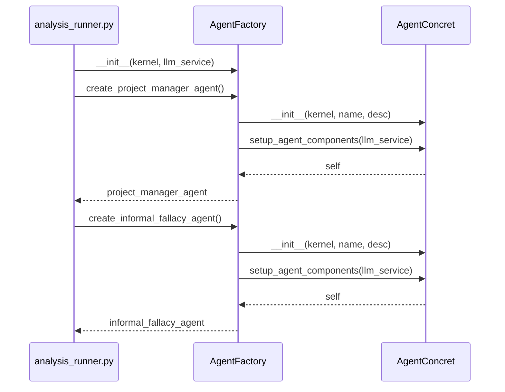
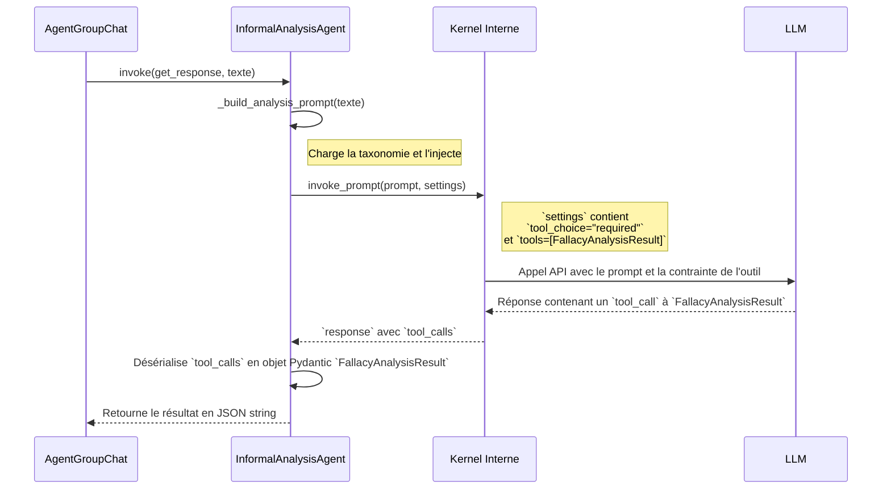

# Partie 1 : Restauration de l'Orchestration

## Contexte : Le Paiement d'une Dette Architecturale

L'investigation initiale, déclenchée par un bug fonctionnel, a mis en lumière une **régression architecturale majeure** : l'abandon d'une orchestration moderne basée sur `AgentGroupChat` au profit d'une boucle de contrôle manuelle, rigide et fragile. Cette décision, motivée par une crainte de l'instabilité de l'API `semantic-kernel` à l'époque, a introduit une dette technique considérable.

L'objectif de cette section est de détailler le plan de **restauration** de l'architecture d'origine, en s'appuyant sur les composants désormais stables et éprouvés de `semantic-kernel` pour construire un système d'orchestration robuste, déclaratif et intelligent.

## Analyse Comparative : De la Boucle Manuelle à l'Orchestration Stratégique

Pour comprendre la portée de la restauration, il est essentiel de comparer l'approche abandonnée (la boucle manuelle) à la nouvelle architecture cible.

```mermaid
graph TD
    subgraph "Schéma de la Régression (Boucle Manuelle Fragile)"
        A[analysis_runner.py] -- "boucle `for` sur `max_turns`" --> B{"Logique Impérative"};
        B -- "Agent X a parlé, qui est le suivant ?" --> C{"Parsing de la réponse précédente"};
        C -- "Si `designate_next_agent(...)` trouvé" --> D[Appel direct à l'Agent Y];
        C -- "Sinon, logique par défaut" --> E[Appel à l'Agent Z];
        D --> B;
        E --> B;
    end

    subgraph "Architecture Cible Restaurée (Déclarative et Robuste)"
        F[analysis_runner.py] -- "invoke(tâche)" --> G{AgentGroupChat};
        G -- "À qui le tour ?" --> H[selection_strategy.next(...)];
        H -- "agent_choisi" --> G;
        G -- "Devons-nous arrêter ?" --> I[termination_strategy.should_terminate(...)];
        I -- "True" --> J((Fin));
        I -- "False" --> G;
    end

    style A fill:#f9d,stroke:#333,stroke-width:2px
    style G fill:#9cf,stroke:#333,stroke-width:2px
```

### L'Ancienne Logique : Impérative et Fragile

L'orchestration manuelle reposait sur un principe simple mais dangereux :
1.  **Une boucle `for` rigide** qui dictait le nombre maximum de tours.
2.  **Une logique de décision codée en dur** dans `analysis_runner.py`.
3.  **Une dépendance à un parsing de texte fragile** (expression régulière) pour extraire de la réponse d'un agent le nom de son successeur désigné.

Ce système était **fragile** (tout changement dans le format de la réponse du `ProjectManagerAgent` cassait l'orchestration), **rigide** (ajouter un nouvel agent nécessitait de modifier la logique centrale) et **illisible** (la logique de collaboration était noyée dans des `if/else`).

### L'Approche `AgentGroupChat` : Déclarative et Robuste

La restauration architecturale acte le remplacement de cette boucle par une approche déclarative. Le développeur **ne code plus le "comment" mais déclare le "quoi"**. La logique est déléguée à des composants spécialisés :

-   **`AgentGroupChat`** : C'est le chef d'orchestre central. Son unique rôle est de maintenir le cycle de vie de la conversation. Comme l'illustre son code source, sa méthode `invoke` est une boucle qui, à chaque tour, délègue les décisions critiques.

    ```python
    # Fichier : semantic_kernel/agents/group_chat/agent_group_chat.py (extrait simplifié)
    ...
    async def invoke(...):
        ...
        for _ in range(self.termination_strategy.maximum_iterations):
            # 1. DÉLÉGATION DE LA SÉLECTION
            selected_agent = await self.selection_strategy.next(self.agents, self.history.messages)

            # 2. EXÉCUTION DE L'AGENT CHOISI
            async for message in super().invoke_agent(selected_agent):
                ...
                # 3. DÉLÉGATION DE LA TERMINAISON
                self.is_complete = await self.termination_strategy.should_terminate(selected_agent, self.history.messages)
                yield message

            if self.is_complete:
                break
    ```

-   **`SelectionStrategy` et `TerminationStrategy`** : Ces objets injectés sont les "cerveaux" de l'orchestration. Ils encapsulent la logique de décision, la rendant modulaire, interchangeable et testable indépendamment.

## Ingénierie des Stratégies pour un Contrôle Intelligent

L'efficacité de `AgentGroupChat` repose sur la configuration de ses stratégies. Pour notre cas d'usage, nous restaurons le contrôle intelligent en combinant des stratégies basées sur des fonctions sémantiques.

### 1. La Sélection d'Agent via `KernelFunctionSelectionStrategy`

Pour qu'un LLM agisse comme un chef d'orchestre (le rôle de l'ancien `ProjectManagerAgent`), cette stratégie est idéale.

**Mécanisme interne :**
Comme l'illustre le code de [`kernel_function_selection_strategy.py`](C:/Users/jsboi/.conda/envs/projet-is-new/Lib/site-packages/semantic_kernel/agents/strategies/selection/kernel_function_selection_strategy.py:1), la stratégie prépare et exécute une `KernelFunction` fournie par l'utilisateur.

```python
# Fichier: semantic_kernel/agents/strategies/selection/kernel_function_selection_strategy.py (extrait simplifié)
...
async def select_agent(self, agents: list["Agent"], history: list[ChatMessageContent]) -> "Agent":
    # 1. Prépare les arguments pour le prompt
    arguments = KernelArguments(
        **{
            self.agent_variable_name: ",".join(agent.name for agent in agents),
            self.history_variable_name: [msg.to_dict() for msg in history],
        }
    )
    
    # 2. Invoque la fonction sémantique fournie
    result = await self.function.invoke(kernel=self.kernel, arguments=arguments)

    # 3. Parse le résultat pour obtenir le nom de l'agent
    agent_name = self.result_parser(result)

    # 4. Retourne l'objet Agent correspondant
    return next(agent for agent in agents if agent.name == agent_name)
```

**Implémentation Cible :**
L'orchestrateur doit définir une fonction sémantique qui guide le LLM dans son choix, puis l'injecter dans la stratégie.

```python
# Fichier: argumentation_analysis/orchestration/analysis_runner.py (pseudo-code de la factory de stratégie)

def _create_selection_strategy(kernel: Kernel) -> KernelFunctionSelectionStrategy:
    """Crée la stratégie de sélection pilotée par LLM."""
    select_agent_prompt = """
    Vous êtes un chef d'orchestre expert en analyse d'arguments. En vous basant sur l'historique
    de la conversation, quel agent doit intervenir ensuite ?
    Votre réponse doit être UNIQUEMENT le nom de l'agent, et rien d'autre.

    AGENTS DISPONIBLES: {{$_agent_}}
    HISTORIQUE DE LA CONVERSATION: {{$_history_}}

    Prochain agent à parler :
    """
    selection_function = kernel.create_function_from_prompt(prompt=select_agent_prompt)

    return KernelFunctionSelectionStrategy(
        kernel=kernel,
        function=selection_function,
        result_parser=lambda result: str(result).strip() # Nettoie la sortie du LLM
    )
```

### 2. La Terminaison Composite avec `AggregatorTerminationStrategy`

Une conversation doit se terminer intelligemment, mais aussi avoir un garde-fou. `AggregatorTerminationStrategy` est conçue pour cela en combinant plusieurs stratégies. Son code est d'une grande simplicité :

```python
# Fichier: semantic_kernel/agents/strategies/termination/aggregator_termination_strategy.py (extrait)
...
async def should_terminate_async(self, agent: "Agent", history: list[ChatMessageContent]) -> bool:
    # Exécute toutes les stratégies en parallèle
    strategy_execution = [strategy.should_terminate(agent, history) for strategy in self.strategies]
    results = await asyncio.gather(*strategy_execution)

    # Retourne True si TOUTES ou N'IMPORTE LAQUELLE des conditions est remplie
    if self.condition == AggregateTerminationCondition.ALL:
        return all(results)
    return any(results)
```

**Implémentation Cible :**
Nous combinons une condition sémantique et un garde-fou mécanique.

1.  **Condition Sémantique (`KernelFunctionTerminationStrategy`)** : Un LLM évalue si la tâche est terminée.
2.  **Garde-fou (`DefaultTerminationStrategy`)** : L'analyse du code de [`termination_strategy.py`](C:/Users/jsboi/.conda/envs/projet-is-new/Lib/site-packages/semantic_kernel/agents/strategies/termination/termination_strategy.py:1) montre que la classe de base possède une propriété `maximum_iterations`. La stratégie `DefaultTerminationStrategy` hérite de ce comportement et sert donc de simple compteur, mettant fin à la conversation après N tours pour éviter les boucles infinies.

```python
# Fichier: argumentation_analysis/orchestration/analysis_runner.py (pseudo-code de la factory de stratégie)

def _create_termination_strategy(kernel: Kernel) -> AggregatorTerminationStrategy:
    """Crée une stratégie de terminaison composite."""
    # 1. Stratégie sémantique
    terminate_prompt = """
    L'objectif de l'analyse est-il atteint ? La tâche est considérée comme terminée
    si une synthèse finale a été fournie. Répondez uniquement par "true" ou "false".
    
    HISTORIQUE: {{$_history_}}
    Tâche terminée :
    """
    semantic_termination = KernelFunctionTerminationStrategy(
        kernel=kernel,
        function=kernel.create_function_from_prompt(prompt=terminate_prompt),
        result_parser=lambda result: "true" in str(result).lower()
    )

    # 2. Stratégie de garde-fou
    failsafe_termination = DefaultTerminationStrategy(maximum_iterations=15)

    # 3. Combinaison des deux
    return AggregatorTerminationStrategy(
        strategies=[semantic_termination, failsafe_termination],
        condition=AggregateTerminationCondition.ANY # S'arrêter dès que l'une des deux est vraie
    )
```

## Proposition d'Implémentation Finale de l'Orchestrateur

Avec ces stratégies en place, le code de l'orchestrateur dans `analysis_runner.py` devient une simple déclaration d'intention. Il assemble les composants et délègue l'exécution, rendant le code lisible, maintenable et robuste.

```python
# Fichier : argumentation_analysis/orchestration/analysis_runner.py (Implémentation cible)

async def _run_analysis_conversation(texte_a_analyser: str, llm_service):
    # ... initialisation du kernel, des agents via une factory ...
    
    # 1. Instancier les agents (ex: via une AgentFactory)
    pm_agent = agent_factory.create_project_manager_agent()
    fallacy_agent = agent_factory.create_informal_fallacy_agent()
    agents = [pm_agent, fallacy_agent]

    # 2. Construire les stratégies
    selection_strategy = _create_selection_strategy(kernel)
    termination_strategy = _create_termination_strategy(kernel)

    # 3. Assembler et configurer l'orchestrateur
    group_chat = AgentGroupChat(
        agents=agents,
        selection_strategy=selection_strategy,
        termination_strategy=termination_strategy,
    )

    # 4. Lancer l'orchestration avec la tâche initiale
    initial_arguments = KernelArguments(input=f"Veuillez analyser le texte suivant : {texte_a_analyser}")
    
    final_history = [message async for message in group_chat.invoke(arguments=initial_arguments)]

    # ... traitement du résultat ...
    return final_history
```

Cette architecture restaurée paie non seulement la dette technique, mais positionne également le projet sur des bases solides pour de futures évolutions, où l'ajout et la modification du comportement des agents deviennent des tâches simples et à faible risque.

# Partie 2 : Architecture des Agents : `AbstractAgent` et `AgentFactory`

Suite à la restauration de `AgentGroupChat`, il est impératif de standardiser la création et la structure des agents participants. Cette section définit une architecture de base pour tous les agents, garantissant leur interopérabilité et simplifiant leur maintenance.

## `AbstractAgent` : La Classe de Base Fondamentale

Pour garantir la compatibilité avec `AgentGroupChat` et uniformiser le comportement des agents, nous introduisons `AbstractAgent`.

**Principe clé :** `AbstractAgent` hérite directement de `semantic_kernel.agents.Agent`. Cet héritage est la pierre angulaire de l'architecture, assurant que chaque agent respecte le contrat attendu par l'écosystème `semantic-kernel`.

### Définition et Contrat de `AbstractAgent`

Le code ci-dessous présente la structure complète de la classe de base. Elle sera placée dans un nouveau fichier (`argumentation_analysis/agents/abc/abstract_agent.py`) pour marquer cette nouvelle fondation architecturale.

```python
# Fichier : argumentation_analysis/agents/abc/abstract_agent.py

import logging
from abc import ABC, abstractmethod
from typing import Dict, Any, Optional, AsyncIterable, Awaitable, List

from semantic_kernel import Kernel
from semantic_kernel.agents import Agent
from semantic_kernel.agents.agent import AgentResponseItem
from semantic_kernel.contents.chat_message_content import ChatMessageContent
from semantic_kernel.functions.kernel_arguments import KernelArguments

class AbstractAgent(Agent, ABC):
    """
    Classe de base abstraite pour tous les agents, garantissant la conformité
    avec `semantic_kernel.agents` pour une intégration native dans `AgentGroupChat`.

    Elle définit un contrat clair mêlant les exigences de `semantic-kernel`
    et les besoins de configuration spécifiques à notre projet.
    """

    def __init__(
        self,
        kernel: Kernel,
        name: Optional[str] = None,
        description: Optional[str] = None,
        instructions: Optional[str] = None,
        **kwargs: Any,
    ) -> None:
        """
        Initialise une instance de `AbstractAgent`, en appelant le constructeur parent.
        """
        super().__init__(
            name=name,
            description=description,
            instructions=instructions,
            kernel=kernel,
            **kwargs,
        )
        self.logger = logging.getLogger(f"agent.{self.__class__.__name__}.{self.name}")
        self.llm_service_id: Optional[str] = None

    # --- Contrat Spécifique au Projet ---

    @abstractmethod
    def setup_agent_components(self, llm_service_id: str) -> None:
        """
        Méthode de post-initialisation pour configurer les composants internes
        de l'agent (plugins, etc.) après sa création.
        
        Args:
            llm_service_id (str): L'ID du service LLM à utiliser.
        """
        self.llm_service_id = llm_service_id
        self.logger.info(f"Composants configurés pour '{self.name}' avec le service LLM '{llm_service_id}'.")

    @abstractmethod
    def get_agent_capabilities(self) -> Dict[str, Any]:
        """
        Retourne un dictionnaire décrivant les capacités de l'agent.
        Utile pour le débogage, la supervision et les stratégies avancées.
        """
        pass

    # --- Implémentation du Contrat `semantic-kernel.agents.Agent` ---

    @abstractmethod
    async def get_response(
        self,
        messages: List[ChatMessageContent],
        arguments: KernelArguments,
        **kwargs: Any,
    ) -> AgentResponseItem[ChatMessageContent]:
        """
        CŒUR DE LA LOGIQUE DE L'AGENT. Chaque agent concret doit implémenter
        cette méthode pour traiter l'historique et générer une réponse.

        Args:
            messages (List[ChatMessageContent]): L'historique des messages.
            arguments (KernelArguments): Arguments supplémentaires pour l'invocation.

        Returns:
            Un `AgentResponseItem` contenant la réponse de l'agent.
        """
        raise NotImplementedError

    async def invoke(
        self,
        messages: List[ChatMessageContent],
        arguments: Optional[KernelArguments] = None,
        **kwargs: Any,
    ) -> AsyncIterable[AgentResponseItem[ChatMessageContent]]:
        """
        Point d'entrée pour `AgentGroupChat`. Délègue la logique à `get_response`
        et encapsule le résultat dans le flux asynchrone attendu.
        """
        if arguments is None:
            arguments = KernelArguments()
        
        response = await self.get_response(messages, arguments, **kwargs)
        yield response

    async def invoke_stream(
        self,
        messages: List[ChatMessageContent],
        arguments: Optional[KernelArguments] = None,
        **kwargs: Any,
    ) -> AsyncIterable[AgentResponseItem[ChatMessageContent]]:
        """Implémentation du streaming, qui délègue à `invoke`."""
        async for message in self.invoke(messages, arguments, **kwargs):
            yield message
```

## `AgentFactory` : L'Usine de Création d'Agents

Pour centraliser et standardiser l'instanciation des agents, nous introduisons le patron de conception *Factory*. L'`AgentFactory` devient le point d'entrée unique pour créer et configurer tous les agents du système.

### Conception de la `AgentFactory`

La factory est initialisée avec les dépendances communes (comme le `Kernel`) et fournit des méthodes dédiées pour construire chaque type d'agent.

```python
# Fichier : argumentation_analysis/agents/agent_factory.py

from semantic_kernel import Kernel
from .concrete_agents import InformalFallacyAgent, ProjectManagerAgent # Exemples d'agents concrets
from .abc.abstract_agent import AbstractAgent

class AgentFactory:
    """Usine pour la création et la configuration centralisée des agents."""

    def __init__(self, kernel: Kernel, llm_service_id: str):
        """
        Initialise la factory avec les dépendances partagées.

        Args:
            kernel (Kernel): L'instance du kernel à injecter dans les agents.
            llm_service_id (str): L'ID du service LLM par défaut.
        """
        self._kernel = kernel
        self._llm_service_id = llm_service_id

    def create_informal_fallacy_agent(self) -> AbstractAgent:
        """Crée et configure un agent d'analyse des sophismes."""
        agent = InformalFallacyAgent(
            kernel=self._kernel,
            name="FallacyAnalyst",
            description="Spécialiste de l'identification des sophismes informels sur la base d'une taxonomie."
        )
        # Étape de configuration post-initialisation
        agent.setup_agent_components(self._llm_service_id)
        return agent

    def create_project_manager_agent(self) -> AbstractAgent:
        """Crée et configure l'agent chef de projet."""
        agent = ProjectManagerAgent(
            kernel=self._kernel,
            name="ProjectManager",
            description="Chef d'orchestre qui analyse l'état de la conversation et désigne le prochain intervenant."
        )
        # Étape de configuration post-initialisation
        agent.setup_agent_components(self._llm_service_id)
        return agent
        
    # Rajouter ici les méthodes pour chaque nouvel agent...
```

### Diagramme de Séquence : Utilisation de la Factory

Le diagramme suivant illustre comment l'orchestrateur utilise la factory pour assembler son groupe d'agents, sans connaître les détails de leur construction.



### Justification et Avantages de l'Architecture

Cette approche standardisée autour de `AbstractAgent` et `AgentFactory` apporte des bénéfices considérables :

*   **Couplage Faible** : L'orchestrateur (`analysis_runner`) ne dépend plus des implémentations concrètes des agents, mais uniquement de l'interface `AbstractAgent` et de la `AgentFactory`.
*   **Centralisation de la Logique de Création** : Toute la complexité liée à l'instanciation (injection du `Kernel`, configuration des services, chargement des plugins via `setup_agent_components`) est contenue dans la factory.
*   **Respect du Principe Ouvert/Fermé** : Pour ajouter un nouvel agent au système, il suffit de créer sa classe (héritant de `AbstractAgent`) et d'ajouter une méthode `create_...` dans la factory. Aucune modification n'est requise dans la logique de l'orchestrateur, qui est *fermé à la modification mais ouvert à l'extension*.
*   **Testabilité Améliorée** : Les agents et la factory peuvent être testés unitairement de manière beaucoup plus simple.
*   **Garantie de Compatibilité** : L'héritage de `semantic_kernel.agents.Agent` assure que tous nos agents sont, par définition, compatibles avec les composants `AgentGroupChat` et les stratégies associées.


# Partie 3 : L'Agent Hybride : Refactorisation du `InformalAnalysisPlugin`

Alors que les parties précédentes ont défini l'architecture de l'orchestration (`AgentGroupChat`) et la structure des agents (`AbstractAgent`), cette section se concentre sur un cas d'étude concret et essentiel : la refonte de l'`InformalAnalysisPlugin`. Cette transformation est la clé pour corriger le bug originel (l'incapacité à utiliser la taxonomie des sophismes) et pour produire une sortie de données fiable et structurée.

## 3.1. Principe Fondamental : De Plugin à Agent Spécialisé

### 3.1.1. La Problématique
L'implémentation initiale de l'analyse des sophismes fonctionnait comme un simple plugin exposant de multiples fonctions à un `Kernel` externe. Cette approche souffrait de deux défauts majeurs :
1.  **Fiabilité Médiocre :** La sortie était du texte libre, nécessitant un parsing fragile et sujet aux erreurs.
2.  **Couplage Fort :** La logique de l'agent était dispersée entre le code du plugin et les prompts sémantiques appelés par l'orchestrateur, rendant la maintenance et l'évolution complexes.

### 3.1.2. La Solution Architecturale : L'Agent Spécialisé
La solution consiste à transformer le plugin en un `InformalAnalysisAgent` autonome. Cet agent devient un "spécialiste" qui encapsule toute la complexité de sa tâche derrière une interface standardisée (`AbstractAgent`). Il ne se contente plus d'exécuter des fonctions ; il s'auto-orchestre pour accomplir sa mission.

### 3.1.3. Héritage et Contrat (`AbstractAgent`)
En héritant de `AbstractAgent`, le nouvel agent garantit sa parfaite intégration dans l'écosystème `AgentGroupChat`. Il respecte un contrat clair, implémentant la logique métier principale au sein de la méthode `get_response`.

```python
# Fichier : argumentation_analysis/agents/concrete_agents/informal_fallacy_agent.py (Illustratif)

from ..abc.abstract_agent import AbstractAgent
# ... autres imports

class InformalAnalysisAgent(AbstractAgent):
    """
    Agent spécialisé dans l'identification des sophismes informels
    en se basant sur une taxonomie et en garantissant une sortie structurée.
    """

    def setup_agent_components(self, llm_service_id: str) -> None:
        """ Configure le kernel interne et les dépendances de l'agent. """
        super().setup_agent_components(llm_service_id)
        # Ici, on pourrait initialiser le kernel interne, charger la taxonomie, etc.
        self.internal_kernel = Kernel() # Exemple simplifié
        self.logger.info("Kernel interne de l'agent d'analyse de sophismes configuré.")

    async def get_response(
        self,
        messages: List[ChatMessageContent],
        arguments: KernelArguments,
        **kwargs: Any,
    ) -> AgentResponseItem[ChatMessageContent]:
        """ C'est ici que toute la magie de l'agent opère. """
        text_to_analyze = arguments.get("input", "")
        # ... logique complète d'appel au kernel interne ...
        analysis_json = await self._run_internal_analysis(text_to_analyze)
        
        # Création du message de réponse standard
        response_message = ChatMessageContent(role="assistant", content=analysis_json)
        return AgentResponseItem(message=response_message, agent=self)

    # ... autres méthodes privées ...
```

## 3.2. Le Cœur de l'Agent Hybride : Le Pattern "Builder Plugin"

La refactorisation de `InformalAnalysisAgent` n'est pas une simple réorganisation, mais l'application d'un **pattern architectural puissant et validé** que nous nommerons le **"Pattern de l'Agent Hybride"** ou **"Builder Plugin"**.

L'exploration du code existant du projet, notamment dans [`argumentation_analysis/agents/core/logic/first_order_logic_agent.py`](argumentation_analysis/agents/core/logic/first_order_logic_agent.py:1), a révélé le `BeliefSetBuilderPlugin`. Ce plugin est l'exemple parfait de ce pattern : au lieu de demander au LLM de générer une syntaxe complexe et fragile, il lui fournit des "outils" simples (`add_sort`, `add_atomic_fact`, etc.). Le rôle du LLM est alors réduit à une tâche simple et fiable : décider quels outils appeler. Le plugin, quant à lui, agit comme un "builder", accumulant ces appels pour construire un objet complexe (`.fologic`) de manière déterministe et fiable.

Notre `InformalAnalysisAgent` applique rigoureusement ce même pattern :
1.  **Agent = Façade Simple :** Pour l'orchestrateur externe (`AgentGroupChat`), l'agent expose une interface simple (`get_response`).
2.  **Kernel Interne = Moteur d'Orchestration :** L'agent utilise son propre `Kernel` interne pour gérer la logique complexe.
3.  **Outil Pydantic = Contrat de Données :** L'agent expose un unique "outil" au LLM : la classe Pydantic `FallacyAnalysisResult`.
4.  **Rôle du LLM = Remplir un Formulaire :** Le LLM n'écrit plus de texte libre. Sa seule tâche est de remplir les champs du modèle Pydantic, agissant comme un employé qui remplit un formulaire structuré.
5.  **Rôle de l'Agent = Générer la Réponse :** L'agent reçoit cet objet Pydantic, validé et structuré, et l'utilise pour générer sa réponse finale.

Cette approche, validée par sa présence dans d'autres parties critiques du projet, garantit une robustesse et une fiabilité maximales. L'agent encapsule sa propre complexité, déchargeant à la fois l'orchestrateur principal et le LLM.

## 3.3. Fiabilisation des Entrées : L'Injection Dynamique de Taxonomie

Pour résoudre définitivement le bug de l'ignorance de la taxonomie, l'agent la charge et l'injecte dans le prompt à chaque appel.

Le mécanisme est le suivant :
1.  **Chargement :** L'agent utilise un `TaxonomyLoader` centralisé pour récupérer un DataFrame Pandas des sophismes.
2.  **Formatage :** Il transforme ce DataFrame en une chaîne de caractères claire et concise, optimisée pour le LLM.
3.  **Injection :** Cette chaîne est insérée dans le prompt.

```python
# Méthode privée au sein de InformalAnalysisAgent

def _build_analysis_prompt(self, text_to_analyze: str) -> str:
    """ Construit le prompt avec la taxonomie injectée. """
    
    # 1. & 2. Chargement et formatage
    # taxonomy_df = self.taxonomy_loader.load()
    # taxonomy_summary = "\n".join(f"- {row['name']}: {row['description']}" for _, row in taxonomy_df.iterrows())
    taxonomy_summary = "Exemple: Sophisme de la Pente Glissante, Ad Hominem, etc." # Pour l'exemple

    # 3. Injection
    prompt = f"""
    Analyse le texte suivant pour y dénicher des sophismes. Tu dois baser ton analyse
    UNIQUEMENT sur la taxonomie de sophismes ci-dessous.
    Ton objectif est de retourner une structure de données complète via l'outil `FallacyAnalysisResult`.

    --- TAXONOMIE DISPONIBLE ---
    {taxonomy_summary}
    --- FIN DE LA TAXONOMIE ---

    --- TEXTE À ANALYSER ---
    {text_to_analyze}
    --- FIN DU TEXTE ---
    """
    return prompt.strip()
```

## 3.4. Fiabilisation des Sorties : La Contrainte Pydantic

C'est l'étape la plus critique. Nous éliminons le parsing de texte en **forçant** le LLM à nous répondre dans un format que nous contrôlons.

**1. Contrat de Données (Pydantic) :** Nous définissons la structure de sortie attendue.

```python
from pydantic import BaseModel, Field
from typing import List

class IdentifiedFallacy(BaseModel):
    """Modèle de données pour un seul sophisme identifié."""
    fallacy_name: str = Field(..., description="Le nom du sophisme, doit correspondre EXACTEMENT à un nom de la taxonomie fournie.")
    justification: str = Field(..., description="Citation exacte du texte et explication détaillée de pourquoi c'est un sophisme.")
    confidence_score: float = Field(..., ge=0.0, le=1.0, description="Score de confiance entre 0.0 et 1.0.")

class FallacyAnalysisResult(BaseModel):
    """Modèle de données pour le résultat complet de l'analyse de sophismes."""
    is_fallacious: bool = Field(..., description="Vrai si au moins un sophisme a été détecté, sinon faux.")
    fallacies: List[IdentifiedFallacy] = Field(..., description="Liste de TOUS les sophismes identifiés dans le texte. Laisser vide si aucun.")
```

**2. Forcer la Sortie (`tool_choice="required"`) :** Lors de l'appel au `Kernel` interne, nous spécifions des `OpenAIChatPromptExecutionSettings` (comme découvert lors de l'analyse du code source de `semantic-kernel`) qui ne laissent aucune autre option au LLM que d'utiliser notre modèle Pydantic comme outil.

```python
# Méthode privée au sein de InformalAnalysisAgent

async def _run_internal_analysis(self, text_to_analyze: str) -> str:
    """ Exécute l'appel LLM interne de manière fiable. """
    
    prompt = self._build_analysis_prompt(text_to_analyze)

    # L'exploration du code SK a confirmé que OpenAIChatPromptExecutionSettings est la bonne classe à utiliser
    execution_settings = OpenAIChatPromptExecutionSettings(
        tool_choice="required",  # Contrainte absolue : le LLM DOIT utiliser un outil
        tools=[FallacyAnalysisResult] # L'outil à utiliser est notre classe Pydantic elle-même
    )

    response = await self.internal_kernel.invoke_prompt(
        prompt,
        arguments=KernelArguments(settings=execution_settings)
    )

    tool_calls = response.tool_calls
    if not tool_calls:
        # Cas où le LLM ne trouve rien, on retourne un résultat valide "non fallacieux"
        analysis_result = FallacyAnalysisResult(is_fallacious=False, fallacies=[])
    else:
        # Le kernel a déjà validé la structure, on désérialise en toute sécurité
        analysis_result: FallacyAnalysisResult = tool_calls[0].to_tool_function()(
            **tool_calls[0].parse_arguments()
        )
    
    return analysis_result.model_dump_json(indent=2)
```
Cette combinaison garantit un résultat toujours prévisible, valide et directement utilisable.


## 3.5. Schéma d'Interaction Interne

Le diagramme suivant illustre le flux interne complet de l'agent.



## 3.6. Validation par l'Existant : Le Patron `BeliefSetBuilderPlugin`

Il est crucial de souligner que l'architecture proposée pour l'`InformalAnalysisAgent` n'est pas une construction théorique, mais la **standardisation d'un pattern de conception déjà présent et éprouvé** au sein de ce projet.

L'analyse de `argumentation_analysis/agents/core/logic/first_order_logic_agent.py` et de son `BeliefSetBuilderPlugin` a été déterminante. Ce dernier résout un problème similaire (la génération d'un fichier `.fologic` à la syntaxe stricte) avec une élégance et une robustesse remarquables.

La stratégie architecturale, décrite dans les commentaires mêmes du fichier, est la suivante :
1.  **Définir des Outils Simples :** Le plugin expose des fonctions atomiques au LLM (`add_sort`, `add_constant`, `add_atomic_fact`). Ce sont ses "outils".
2.  **Réduire le Rôle du LLM :** Le LLM n'a plus à se soucier de la syntaxe complexe du `.fologic`. Son unique responsabilité est d'analyser le langage naturel et de décider **quels outils appeler avec quels arguments**.
3.  **Confier la Construction au Code Python :** Le plugin reçoit ces appels, accumule les informations dans une structure de données interne fiable, et se charge lui-même de générer la chaîne `.fologic` finale de manière parfaitement déterministe.

**Notre `InformalAnalysisAgent` est une implémentation directe de ce même pattern :**
*   L'outil unique est la classe Pydantic `FallacyAnalysisResult`.
*   Le LLM ne fait que "remplir les cases" de cet outil.
*   L'agent reçoit l'objet Pydantic et s'occupe de le sérialiser en un rapport JSON propre.

En adoptant cette approche, nous ne faisons donc qu'appliquer une "best practice" interne, garantissant que notre nouvelle architecture est non seulement théoriquement saine, mais aussi parfaitement alignée avec les solutions qui ont déjà fait leurs preuves dans ce codebase.
