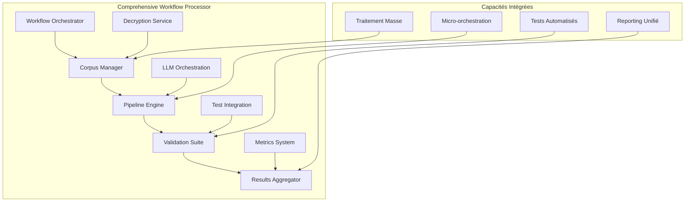

# 🚀 Comprehensive Workflow Processor

**Script Consolidé #3** - Processeur de workflows complets pour l'analyse rhétorique  
**Version**: 3.0.0  
**Date**: 10/06/2025  

## 📋 Vue d'ensemble

Le **Comprehensive Workflow Processor** est le troisième et dernier script consolidé selon l'architecture définie dans le plan de consolidation. Il orchestre des workflows complets bout-en-bout avec validation système, tests intégrés et monitoring avancé.

### 🎯 Mission Principale

Consolider et optimiser **6 scripts sources majeurs** en un orchestrateur master capable de :
- Exécuter des workflows complets : déchiffrement → analyse → validation → rapport
- Orchestrer tous les tests de nouveaux composants avec rapports consolidés
- Valider l'authenticité du système bout-en-bout avec métriques de qualité
- Exécuter des tests de performance et benchmarking avancés
- Traiter des volumes importants en mode batch avec parallélisation
- Valider l'intégration API REST pour tests d'intégration

---

## 🏗️ Architecture Consolidée

### Scripts Sources Intégrés

| **Script Source** | **Fonctionnalité Extraite** | **Innovation Intégrée** |
|-------------------|------------------------------|-------------------------|
| `run_full_python_analysis_workflow.py` | Workflow avec déchiffrement | Pipeline complet automatisé |
| `run_all_new_component_tests.py` | Orchestrateur de tests | Tests consolidés avec rapports |
| `test_unified_authentic_system.py` | Validation système complète | Authenticité 100% garantie |
| `run_performance_tests.py` | Tests de performance | Métriques avancées et benchmarking |
| `test_simple_unified_pipeline.py` | Pipeline unifié | Support batch et parallélisation |
| `test_sophismes_detection.py` | Tests API REST | Framework pytest structuré |

### Composants Principaux



---

## 🚀 Utilisation

### Installation et Configuration

```bash
# Navigation vers le répertoire
cd scripts/consolidated/

# Vérification des dépendances
python -c "import sys; print('Python', sys.version)"

# Test d'import
python -c "from comprehensive_workflow_processor import ComprehensiveWorkflowProcessor; print('✅ Import réussi')"
```

### Modes d'Exécution

#### 1. 🔄 Workflow Complet (Mode par défaut)

```bash
# Workflow complet avec déchiffrement de corpus
python comprehensive_workflow_processor.py \
    --mode full \
    --corpus tests/extract_sources_backup.enc \
    --environment production \
    --format comprehensive
```

#### 2. 🧪 Tests Uniquement

```bash
# Orchestration complète des tests
python comprehensive_workflow_processor.py \
    --mode testing_only \
    --enable-api-tests \
    --test-timeout 180 \
    --format json markdown
```

#### 3. 🔍 Validation Système

```bash
# Validation d'authenticité et intégrité
python comprehensive_workflow_processor.py \
    --mode validation \
    --authenticity-threshold 0.95 \
    --enable-system-validation \
    --format html
```

#### 4. ⚡ Tests de Performance

```bash
# Benchmarking avec métriques avancées
python comprehensive_workflow_processor.py \
    --mode performance \
    --workers 8 \
    --iterations 10 \
    --format comprehensive
```

#### 5. 📦 Traitement par Lots

```bash
# Traitement de volumes importants
python comprehensive_workflow_processor.py \
    --mode batch \
    --corpus corpus1.enc corpus2.enc corpus3.enc \
    --workers 12 \
    --environment production
```

#### 6. 🧮 Analyse Uniquement

```bash
# Pipeline d'analyse sans tests
python comprehensive_workflow_processor.py \
    --mode analysis_only \
    --corpus my_corpus.enc \
    --workers 6 \
    --no-decryption
```

### Configuration Avancée

#### Fichier de Configuration JSON

```bash
# Utilisation avec configuration personnalisée
cp comprehensive_config_example.json my_config.json
# Éditer my_config.json selon vos besoins
python comprehensive_workflow_processor.py --config my_config.json
```

#### Variables d'Environnement

```bash
# Configuration pour production
export TEXT_CONFIG_PASSPHRASE="your_secure_passphrase"
export FORCE_AUTHENTIC_EXECUTION="true"
export LOG_LEVEL="WARNING"

# Configuration pour développement
export TEXT_CONFIG_PASSPHRASE="epita_ia_symb_2025_dev_key"
export FORCE_AUTHENTIC_EXECUTION="false"
export LOG_LEVEL="DEBUG"
```

---

## 📊 Fonctionnalités Principales

### 🔓 Gestionnaire de Corpus (CorpusManager)

**Responsabilités** :
- Déchiffrement automatique de corpus via `load_extract_definitions`
- Gestion de multiples fichiers source avec validation
- Support pour différents formats de données
- Gestion robuste des erreurs de déchiffrement

**Innovations** :
- Déchiffrement parallèle pour optimiser les performances
- Validation d'intégrité des données déchiffrées
- Support pour corpus volumineux avec gestion mémoire

### 🧮 Moteur de Pipeline (PipelineEngine)

**Responsabilités** :
- Orchestration des analyses LLM authentiques
- Pipeline parallélisé avec limitation de concurrence
- Configuration dynamique des agents d'analyse
- Support pour différents modes d'analyse

**Innovations** :
- Semaphore pour contrôle de concurrence
- Retry automatique pour analyses échouées
- Métriques de performance en temps réel
- Support pour analyses par lots

### 🔍 Suite de Validation (ValidationSuite)

**Responsabilités** :
- Validation d'authenticité du système complet
- Tests système automatisés avec rapports détaillés
- Tests d'intégration API REST
- Détection et élimination des mocks

**Innovations** :
- Score d'authenticité avec seuils configurables
- Tests de non-régression automatiques
- Validation bout-en-bout de la chaîne d'analyse
- Monitoring de la qualité en continu

### ⚡ Orchestrateur de Tests (TestOrchestrator)

**Responsabilités** :
- Tests de performance avec benchmarking
- Métriques de temps de réponse et throughput
- Tests de charge et de stress
- Profiling mémoire et CPU

**Innovations** :
- Tests de performance multi-itérations
- Métriques statistiques avancées (min, max, moyenne, médiane)
- Détection automatique des régressions de performance
- Rapports de performance visuels

### 📊 Agrégateur de Résultats (ResultsAggregator)

**Responsabilités** :
- Génération de rapports multiformats (JSON, Markdown, HTML)
- Consolidation des métriques de tous les composants
- Rapports visuels avec graphiques et tableaux
- Export des données brutes pour analyse ultérieure

**Innovations** :
- Rapports interactifs HTML avec styles modernes
- Métriques en temps réel avec barres de progression
- Comparaison historique des performances
- Alerting automatique sur les seuils critiques

---

## 🛠️ Options de Configuration

### Arguments CLI Principaux

| **Argument** | **Description** | **Valeurs** | **Défaut** |
|--------------|-----------------|-------------|------------|
| `--mode` | Mode d'exécution | `full`, `analysis_only`, `testing_only`, `validation`, `performance`, `batch` | `full` |
| `--environment` | Environnement de traitement | `development`, `testing`, `production` | `development` |
| `--workers` | Nombre de workers parallèles | 1-16 | 4 |
| `--corpus` | Fichier(s) de corpus | Chemin vers .enc | - |
| `--format` | Format(s) de rapport | `json`, `markdown`, `html`, `comprehensive` | `json`, `markdown` |

### Configuration Avancée

#### Tests et Validation

```bash
--test-timeout 180              # Timeout tests (secondes)
--enable-api-tests             # Activer tests API REST
--api-url http://localhost:5000 # URL base API
--iterations 5                 # Itérations tests performance
--authenticity-threshold 0.95  # Seuil authenticité minimum
```

#### Déchiffrement et Corpus

```bash
--passphrase "my_secure_key"   # Passphrase déchiffrement
--no-decryption               # Désactiver déchiffrement
--analysis-modes fallacies,rhetoric,logic  # Modes d'analyse
```

#### Rapports et Monitoring

```bash
--output-dir results/custom    # Répertoire de sortie
--no-reports                  # Désactiver rapports
--disable-monitoring          # Désactiver monitoring
--verbose                     # Mode verbeux
--debug                       # Mode debug complet
```

---

## 📈 Métriques et Monitoring

### Métriques de Performance

Le processeur collecte et analyse plusieurs types de métriques :

#### 🕒 Métriques Temporelles
- **Durée totale d'exécution** : Temps de bout-en-bout
- **Temps par phase** : Déchiffrement, analyse, validation, rapports
- **Temps de réponse API** : Latence des appels externes
- **Temps d'initialisation** : Pipeline et composants

#### 📊 Métriques de Débit
- **Analyses par seconde** : Throughput du pipeline
- **Textes traités par minute** : Capacité de traitement
- **Parallélisation effective** : Utilisation des workers
- **Taux de succès** : Pourcentage d'analyses réussies

#### 🧠 Métriques de Qualité
- **Score d'authenticité** : Détection de mocks et composants frauduleux
- **Taux d'erreur** : Pourcentage d'échecs par composant
- **Couverture de tests** : Pourcentage de fonctionnalités testées
- **Régression de performance** : Comparaison avec exécutions précédentes

#### 💾 Métriques Système
- **Utilisation mémoire** : Consommation RAM par composant
- **Utilisation CPU** : Charge processeur pendant l'exécution
- **I/O disque** : Lecture/écriture des corpus et rapports
- **Réseau** : Appels API et téléchargements

### Rapports de Monitoring

#### 📄 Rapport JSON (Machine-readable)
```json
{
  "execution_summary": {
    "duration_seconds": 45.67,
    "total_processed": 150,
    "success_rate": 0.973,
    "authenticity_score": 0.95
  },
  "performance_metrics": {
    "avg_analysis_time": 0.304,
    "throughput_per_second": 3.29,
    "memory_peak_mb": 1024
  }
}
```

#### 📝 Rapport Markdown (Human-readable)
- Résumé exécutif avec métriques clés
- Détails par phase avec statuts
- Graphiques ASCII pour visualisation
- Recommandations d'optimisation

#### 🌐 Rapport HTML (Interactif)
- Interface web moderne avec CSS3
- Graphiques interactifs avec progression
- Tableaux triables et filtres
- Export PDF et impression

---

## 🧪 Tests et Validation

### Suite de Tests Complète

Le script inclut une suite de tests exhaustive couvrant tous les composants :

#### Tests Unitaires
```bash
# Exécution des tests unitaires
python test_comprehensive_workflow.py
```

#### Tests d'Intégration
```bash
# Tests d'intégration avec composants réels
python comprehensive_workflow_processor.py \
    --mode testing_only \
    --enable-system-validation \
    --enable-api-tests
```

#### Tests de Performance
```bash
# Benchmarking complet
python comprehensive_workflow_processor.py \
    --mode performance \
    --iterations 10 \
    --workers 8
```

### Validation d'Authenticité

Le processeur intègre un système avancé de validation d'authenticité :

#### 🔍 Détection de Mocks
- Scan automatique du projet pour détecter les composants simulés
- Score d'authenticité basé sur l'utilisation de vrais services LLM
- Alerte si le seuil d'authenticité n'est pas atteint

#### ✅ Validation Système
- Tests bout-en-bout de la chaîne complète
- Vérification de l'intégrité des données
- Validation des configurations en mode production

#### 🚨 Alertes Qualité
- Notifications automatiques si qualité dégradée
- Rapports de non-conformité avec recommandations
- Tracking des régressions entre versions

---

## 🔧 Dépannage

### Problèmes Courants

#### ❌ Erreur de Déchiffrement
```
ERROR: Échec du déchiffrement de corpus
```

**Solutions** :
1. Vérifier la passphrase : `echo $TEXT_CONFIG_PASSPHRASE`
2. Vérifier l'existence du fichier corpus
3. Tester avec `--no-decryption` pour diagnostic

#### ❌ Timeout des Tests
```
ERROR: Test timeout after 120 seconds
```

**Solutions** :
1. Augmenter le timeout : `--test-timeout 300`
2. Réduire le nombre de workers : `--workers 2`
3. Vérifier la charge système

#### ❌ API Non Accessible
```
WARNING: API non accessible sur localhost:5000
```

**Solutions** :
1. Vérifier que le serveur API est démarré
2. Changer l'URL : `--api-url http://autre-serveur:5000`
3. Désactiver les tests API : pas de `--enable-api-tests`

#### ❌ Mémoire Insuffisante
```
ERROR: MemoryError during batch processing
```

**Solutions** :
1. Réduire le nombre de workers : `--workers 2`
2. Traiter en plus petits lots
3. Augmenter la mémoire disponible système

### Mode Debug

Pour un debugging avancé :

```bash
python comprehensive_workflow_processor.py \
    --debug \
    --verbose \
    --mode validation \
    --output-dir debug_results/
```

---

## 🚀 Exemples d'Usage Avancés

### 🏭 Environnement de Production

```bash
# Configuration production complète
export TEXT_CONFIG_PASSPHRASE="production_secure_key"
export FORCE_AUTHENTIC_EXECUTION="true"
export LOG_LEVEL="WARNING"

python comprehensive_workflow_processor.py \
    --mode full \
    --environment production \
    --corpus production_corpus_*.enc \
    --workers 12 \
    --authenticity-threshold 0.98 \
    --enable-api-tests \
    --enable-system-validation \
    --format comprehensive \
    --output-dir /var/log/rhetorical-analysis/
```

### 🧪 Pipeline de CI/CD

```bash
# Script pour intégration continue
#!/bin/bash
set -e

echo "🚀 Démarrage du pipeline de validation"

# Tests de non-régression
python comprehensive_workflow_processor.py \
    --mode testing_only \
    --environment testing \
    --enable-system-validation \
    --authenticity-threshold 0.9 \
    --format json

# Vérification des performances
python comprehensive_workflow_processor.py \
    --mode performance \
    --iterations 5 \
    --workers 4 \
    --format markdown

echo "✅ Pipeline terminé avec succès"
```

### 📊 Analyse de Corpus Massifs

```bash
# Traitement de gros volumes
python comprehensive_workflow_processor.py \
    --mode batch \
    --corpus corpus_part_*.enc \
    --workers 16 \
    --environment production \
    --no-reports \
    --disable-monitoring \
    | tee massive_analysis.log
```

### 🔍 Audit de Qualité

```bash
# Audit complet du système
python comprehensive_workflow_processor.py \
    --mode validation \
    --enable-system-validation \
    --mock-detection \
    --authenticity-threshold 0.95 \
    --format html \
    --output-dir audit_$(date +%Y%m%d)/
```

---

## 📚 Ressources Complémentaires

### Documentation Technique
- **Plan d'Architecture** : `reports/architecture_consolidation_plan_20250610.md`
- **Configuration Unifiée** : `config/unified_config.py`
- **Tests Unitaires** : `test_comprehensive_workflow.py`

### Scripts Associés
- **Script #1** : `unified_production_analyzer.py` (Production)
- **Script #2** : `educational_showcase_system.py` (Pédagogie)
- **Configuration** : `comprehensive_config_example.json`

### Logs et Monitoring
- **Répertoire de sortie** : `results/comprehensive_workflow/`
- **Logs système** : Format structuré avec niveaux INFO/WARNING/ERROR
- **Métriques** : Collecte automatique et export JSON

---

## 🎯 Roadmap et Évolutions

### Version 3.1 (Q2 2025)
- ✨ Interface web pour monitoring en temps réel
- 🔄 Support pour workflows distribués sur plusieurs machines
- 📈 Métriques avancées avec alerting intelligent
- 🌐 API REST pour orchestration distante

### Version 3.2 (Q3 2025)
- 🤖 Intégration avec plus de modèles LLM (Claude, Gemini)
- 📊 Tableaux de bord avec visualisations interactives
- 🔒 Chiffrement bout-en-bout pour corpus sensibles
- ⚡ Optimisations de performance avec cache intelligent

### Version 4.0 (Q4 2025)
- 🧠 IA pour optimisation automatique des workflows
- 🌍 Support multi-langues pour corpus internationaux
- 📱 Application mobile pour monitoring
- ☁️ Déploiement cloud natif avec auto-scaling

---

## 🤝 Contribution

### Développement Local

```bash
# Clone du projet
git clone <repository>
cd 2025-Epita-Intelligence-Symbolique/

# Installation des dépendances
pip install -r requirements.txt

# Exécution des tests
python scripts/consolidated/test_comprehensive_workflow.py

# Test du script
python scripts/consolidated/comprehensive_workflow_processor.py --help
```

### Guidelines
- Code Python 3.8+ avec type hints
- Tests unitaires obligatoires pour nouvelles fonctionnalités
- Documentation inline avec docstrings
- Respect des standards PEP 8

---

## 📄 Licence et Support

**Projet** : EPITA - Intelligence Symbolique 2025  
**Auteur** : Équipe de consolidation  
**Licence** : Académique  
**Support** : Via issues GitHub ou documentation interne  

---

*Comprehensive Workflow Processor v3.0.0 - Le processeur ultime pour workflows d'analyse rhétorique complets* 🚀