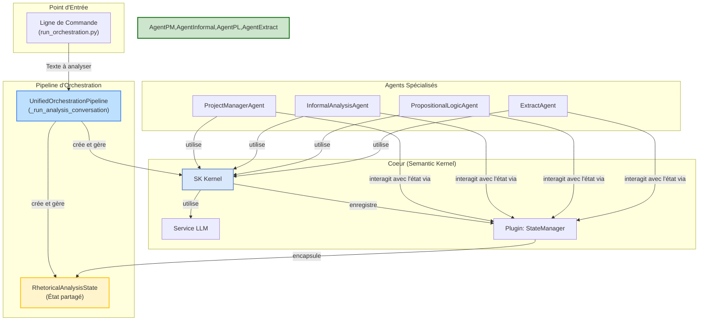

# Moteur d'Analyse d'Argumentation

*Dernière mise à jour : 15/06/2025*

Ce document fournit une description technique du système d'analyse d'argumentation. Il est destiné aux développeurs souhaitant comprendre, utiliser et étendre le pipeline d'analyse.

## 1. Architecture Générale

Le système est conçu autour d'un pipeline d'orchestration unifié, `UnifiedOrchestrationPipeline` (implémenté via `analysis_runner.py`), qui coordonne une flotte d'agents d'IA spécialisés. Chaque agent a un rôle précis et collabore en partageant un état commun (`RhetoricalAnalysisState`) via un `Kernel` Semantic Kernel.



## 2. Composants Clés

-   **`UnifiedOrchestrationPipeline`** (`analysis_runner.py`): Le chef d'orchestre. Il initialise tous les composants (Kernel, état, agents) et lance la conversation collaborative entre les agents.

-   **`RhetoricalAnalysisState`** (`shared_state.py`): L'état partagé de l'analyse. C'est un objet qui contient le texte initial, les arguments identifiés, les sophismes, les conclusions, etc. Il sert de "tableau blanc" pour les agents.

-   **`StateManagerPlugin`** (`state_manager_plugin.py`): Le pont entre les agents et l'état partagé. Ce plugin expose des fonctions sémantiques (ex: `add_identified_argument`) que les agents peuvent appeler pour lire ou modifier l'état de manière structurée.

-   **Agents Spécialisés** (`agents/core/`):
    -   **`ProjectManagerAgent`**: Supervise l'analyse, distribue les tâches et s'assure que le processus atteint une conclusion.
    -   **`InformalAnalysisAgent`**: Spécialisé dans la détection de sophismes informels (ex: homme de paille, pente glissante).
    -   **`PropositionalLogicAgent`**: Analyse la structure logique formelle des arguments, en s'appuyant sur le bridge Java/Tweety.
    -   **`ExtractAgent`**: Extrait les propositions et les arguments clés du texte brut pour les structurer.

## 3. Guide d'Utilisation Pratique

Toutes les analyses sont lancées via le script `run_orchestration.py`.

### a. Configuration
Assurez-vous d'avoir un fichier `.env` à la racine avec vos clés API (voir la section correspondante dans le README de Sherlock Watson).

### b. Analyse Simple (texte en argument)
Pour une analyse rapide sur une chaîne de caractères.
```bash
python -m argumentation_analysis.run_orchestration --text "Si tous les hommes sont mortels et que Socrate est un homme, alors Socrate est mortel."
```

### c. Analyse depuis un Fichier
Pour analyser le contenu d'un fichier texte.
```bash
python -m argumentation_analysis.run_orchestration --file "chemin/vers/mon_fichier.txt"
```

### d. Lancement avec des Agents Spécifiques
Pour ne lancer qu'un sous-ensemble d'agents.
```bash
python -m argumentation_analysis.run_orchestration --file "chemin/vers/mon_fichier.txt" --agents informal pl
```

## 4. Interprétation des Résultats

Le script affiche les interactions entre les agents dans la console. Le résultat final de l'analyse est contenu dans l'objet `RhetoricalAnalysisState`. Pour le moment, l'état final est affiché en fin d'exécution dans les logs `DEBUG`. De futurs développements permettront de sauvegarder cet état dans un fichier JSON pour une analyse plus aisée.