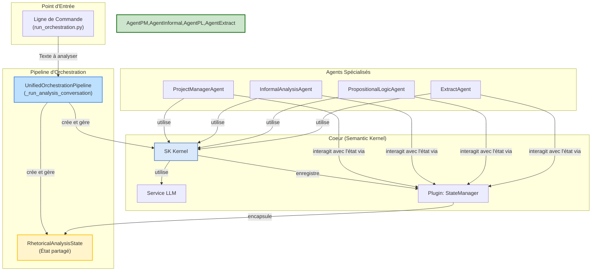

# Moteur d'Analyse d'Argumentation

*Dernière mise à jour : 15/06/2025*

Ce document fournit une description technique du système d'analyse d'argumentation. Il est destiné aux développeurs souhaitant comprendre, utiliser et étendre le pipeline d'analyse.

## 1. Architecture Générale

Le système est conçu autour d'un pipeline d'orchestration unifié, `UnifiedOrchestrationPipeline` (implémenté via `analysis_runner.py`), qui coordonne une flotte d'agents d'IA spécialisés. Chaque agent a un rôle précis et collabore en partageant un état commun (`RhetoricalAnalysisState`) via un `Kernel` Semantic Kernel.



## 2. Composants Clés

-   **`UnifiedOrchestrationPipeline`** (`analysis_runner.py`): Le chef d'orchestre. Il initialise tous les composants (Kernel, état, agents) et lance la conversation collaborative entre les agents.

-   **`RhetoricalAnalysisState`** (`shared_state.py`): L'état partagé de l'analyse. C'est un objet qui contient le texte initial, les arguments identifiés, les sophismes, les conclusions, etc. Il sert de "tableau blanc" pour les agents.

-   **`StateManagerPlugin`** (`state_manager_plugin.py`): Le pont entre les agents et l'état partagé. Ce plugin expose des fonctions sémantiques (ex: `add_identified_argument`) que les agents peuvent appeler pour lire ou modifier l'état de manière structurée.

-   **Agents Spécialisés** (`agents/core/`):
    -   **`ProjectManagerAgent`**: Supervise l'analyse, distribue les tâches et s'assure que le processus atteint une conclusion.
    -   **`InformalAnalysisAgent`**: Spécialisé dans la détection de sophismes informels (ex: homme de paille, pente glissante).
    -   **`PropositionalLogicAgent`**: Analyse la structure logique formelle des arguments, en s'appuyant sur le bridge Java/Tweety.
    -   **`ExtractAgent`**: Extrait les propositions et les arguments clés du texte brut pour les structurer.

## 3. Guide d'Utilisation Pratique

Toutes les analyses sont lancées via le script `run_orchestration.py`.

### a. Configuration
Assurez-vous d'avoir un fichier `.env` à la racine avec vos clés API (voir la section correspondante dans le README de Sherlock Watson).

### b. Analyse Simple (texte en argument)
Pour une analyse rapide sur une chaîne de caractères.
```bash
python -m argumentation_analysis.run_orchestration --text "Si tous les hommes sont mortels et que Socrate est un homme, alors Socrate est mortel."
```

### c. Analyse depuis un Fichier
Pour analyser le contenu d'un fichier texte.
```bash
python -m argumentation_analysis.run_orchestration --file "chemin/vers/mon_fichier.txt"
```

### d. Lancement avec des Agents Spécifiques
Pour ne lancer qu'un sous-ensemble d'agents.
```bash
python -m argumentation_analysis.run_orchestration --file "chemin/vers/mon_fichier.txt" --agents informal pl
```

## 4. Interprétation des Résultats

Le script affiche les interactions entre les agents dans la console. Le résultat final de l'analyse est contenu dans l'objet `RhetoricalAnalysisState`. Pour le moment, l'état final est affiché en fin d'exécution dans les logs `DEBUG`. De futurs développements permettront de sauvegarder cet état dans un fichier JSON pour une analyse plus aisée.

### Utilisation via les Notebooks (Legacy)
Les notebooks originaux sont toujours disponibles pour une utilisation interactive :

1. Lancez Jupyter Lab ou Notebook depuis la **racine du projet** : `jupyter lab`
2. Ouvrez le notebook `argumentation_analysis/main_orchestrator.ipynb` (si vous souhaitez l'utiliser)
3. Exécutez les cellules séquentiellement.
4. L'interface utilisateur apparaîtra. Interagissez pour sélectionner une source, préparer le texte et cliquez sur **"Lancer l'Analyse"**.

### Exemples d'Utilisation et Tests Pertinents

**Calcul de scores moyens à partir de résultats groupés (`stats_calculator.py`)**

La fonction `calculate_average_scores` permet de calculer des moyennes pour différentes métriques numériques à partir d'un dictionnaire de résultats groupés par corpus.
```python
from argumentation_analysis.analytics.stats_calculator import calculate_average_scores

sample_grouped_results = {
    "CorpusA": [
        {"id": "doc1", "confidence_score": 0.8, "richness_score": 0.9, "length": 100},
        {"id": "doc2", "confidence_score": 0.7, "richness_score": 0.85, "length": 150},
    ],
    "CorpusB": [
        {"id": "doc3", "confidence_score": 0.9, "richness_score": 0.95, "length": 120},
    ]
}

averages = calculate_average_scores(sample_grouped_results)
# averages vaudra approx:
# {
#     "CorpusA": {
#         "average_confidence_score": 0.75,
#         "average_richness_score": 0.875,
#         "average_length": 125.0
#     },
#     "CorpusB": {
#         "average_confidence_score": 0.9,
#         "average_richness_score": 0.95,
#         "average_length": 120.0
#     }
# }
```
Voir [ce test](tests/unit/argumentation_analysis/analytics/test_stats_calculator.py:37) pour un exemple complet de calcul de scores moyens.
---
**Initiation d'une analyse de texte (`text_analyzer.py`)**

La fonction `perform_text_analysis` initie une analyse de texte d'un type donné en utilisant un service LLM configuré. L'analyse principale est déléguée à une fonction interne `run_analysis_conversation`.
```python
from argumentation_analysis.analytics.text_analyzer import perform_text_analysis

# Supposons que 'services' est un dictionnaire configuré contenant 'llm_service'
# et que 'run_analysis_conversation' est la fonction qui effectue l'analyse réelle.

text_to_analyze = "Ceci est un texte d'exemple pour l'analyse."
# services = {"llm_service": my_llm_service_instance, "jvm_ready": True} # Exemple de structure
analysis_type = "default_analysis"

# Cette fonction semble retourner None en cas de succès et loguer les résultats.
# L'analyse réelle est déléguée.
# await perform_text_analysis(text_to_analyze, services, analysis_type)
```
Voir [ce test](tests/unit/argumentation_analysis/analytics/test_text_analyzer.py:30) pour un exemple d'initiation d'analyse de texte.
---
**Utilisation des outils d'analyse rhétorique avancée (simulés) (`mocks/test_advanced_tools.py`)**

Ce fichier montre comment interagir avec les versions *simulées* des outils d'analyse rhétorique avancée. Utile pour comprendre l'interface attendue de ces outils.
```python
from argumentation_analysis.mocks.advanced_tools import create_mock_advanced_rhetorical_tools

mock_tools = create_mock_advanced_rhetorical_tools()
complex_fallacy_analyzer = mock_tools["complex_fallacy_analyzer"]
contextual_fallacy_analyzer = mock_tools["contextual_fallacy_analyzer"]

arguments = ["Argument 1.", "Argument 2."]
context = {"source": "test_source"}
complex_fallacies = complex_fallacy_analyzer.detect_composite_fallacies(arguments, context)

text = "Ceci est un texte de test."
context_audience = {"audience": "general"}
contextual_analysis = contextual_fallacy_analyzer.analyze_context(text, context_audience)
```
Consultez [les tests dans ce fichier](tests/unit/argumentation_analysis/mocks/test_advanced_tools.py) pour voir comment les outils d'analyse rhétorique avancée (simulés) sont utilisés.
---
**Extraction d'arguments (simulée) (`mocks/test_argument_mining.py`)**

Le `MockArgumentMiner` simule l'extraction d'arguments explicites et implicites.
```python
from argumentation_analysis.mocks.argument_mining import MockArgumentMiner

miner = MockArgumentMiner()
text_explicit = "Prémisse: Les chats sont des animaux. Conclusion: Les chats aiment le lait."
result_explicit = miner.mine_arguments(text_explicit)
# result_explicit contiendra un argument de type 'Argument Explicite (Mock)'

text_implicit = "Il pleut des cordes. Donc le sol sera mouillé."
result_implicit = miner.mine_arguments(text_implicit)
# result_implicit contiendra un argument de type 'Argument Implicite (Mock - donc)'
```
Voir [ce test pour l'explicite](tests/unit/argumentation_analysis/mocks/test_argument_mining.py:71) et [ce test pour l'implicite](tests/unit/argumentation_analysis/mocks/test_argument_mining.py:105).
---
**Détection de biais (simulée) (`mocks/test_bias_detection.py`)**

Le `MockBiasDetector` simule la détection de divers biais cognitifs dans un texte.
```python
from argumentation_analysis.mocks.bias_detection import MockBiasDetector

detector = MockBiasDetector()
text = "Il est évident que cette solution est la meilleure pour tout le monde."
result = detector.detect_biases(text)
# result contiendra potentiellement un 'Biais de Confirmation (Mock)'
```
Voir [ce test](tests/unit/argumentation_analysis/mocks/test_bias_detection.py:62) pour un exemple de détection de biais (simulée).
---
**Extraction de revendications (simulée) (`mocks/test_claim_mining.py`)**

Le `MockClaimMiner` simule l'extraction de revendications, soit par mot-clé, soit en identifiant des phrases assertives.
```python
from argumentation_analysis.mocks.claim_mining import MockClaimMiner

miner = MockClaimMiner()
text_keyword = "D'abord, il est clair que le ciel est bleu."
result_keyword = miner.extract_claims(text_keyword)
# result_keyword contiendra une 'Revendication par Mot-Clé (Mock)'

text_assertive = "Ceci est une phrase assertive. Elle est assez longue."
result_assertive = miner.extract_claims(text_assertive)
# result_assertive contiendra des 'Revendication Assertive (Mock)'
```
Voir [ce test pour les mots-clés](tests/unit/argumentation_analysis/mocks/test_claim_mining.py:81) et [ce test pour les phrases assertives](tests/unit/argumentation_analysis/mocks/test_claim_mining.py:128).
---
**Évaluation de la clarté (simulée) (`mocks/test_clarity_scoring.py`)**

Le `MockClarityScorer` évalue la clarté d'un texte en pénalisant des facteurs comme les phrases longues, le jargon, ou les mots ambigus.
```python
from argumentation_analysis.mocks.clarity_scoring import MockClarityScorer

scorer = MockClarityScorer()
text_ideal = "Ceci est une phrase simple. Elle est courte. Les mots sont clairs."
result_ideal = scorer.score_clarity(text_ideal) # Attendu: score proche de 1.0

text_jargon = "Nous devons optimiser la synergie pour un paradigm shift efficient."
result_jargon = scorer.score_clarity(text_jargon) # Attendu: score plus bas
```
Consultez les tests dans [ce fichier](tests/unit/argumentation_analysis/mocks/test_clarity_scoring.py) pour des exemples d'évaluation de clarté (simulée).
---
**Analyse de cohérence (simulée) (`mocks/test_coherence_analysis.py`)**

Le `MockCoherenceAnalyzer` simule une évaluation de la cohérence textuelle, en considérant les mots de transition, la répétition de mots-clés, les contradictions, etc.
```python
from argumentation_analysis.mocks.coherence_analysis import MockCoherenceAnalyzer

analyzer = MockCoherenceAnalyzer()
text_coherent = "Ce texte est un exemple de cohérence. Donc, il suit une logique claire."
result_coherent = analyzer.analyze_coherence(text_coherent) # Score attendu élevé

text_contradiction = "J'aime le chocolat. Mais parfois, je n'aime pas le chocolat du tout."
result_contradiction = analyzer.analyze_coherence(text_contradiction) # Score attendu bas
```
Consultez les tests dans [ce fichier](tests/unit/argumentation_analysis/mocks/test_coherence_analysis.py) pour des exemples d'analyse de cohérence (simulée).
---
**Analyse de ton émotionnel (simulée) (`mocks/test_emotional_tone_analysis.py`)**

Le `MockEmotionalToneAnalyzer` simule la détection du ton émotionnel dominant dans un texte en se basant sur des mots-clés.
```python
from argumentation_analysis.mocks.emotional_tone_analysis import MockEmotionalToneAnalyzer

analyzer = MockEmotionalToneAnalyzer()
text_joy = "Je suis tellement heureux et content aujourd'hui, c'est une journée joyeuse !"
result_joy = analyzer.analyze_tone(text_joy)
# result_joy devrait indiquer 'Joie (Mock)' comme émotion dominante.
```
Voir [ce test](tests/unit/argumentation_analysis/mocks/test_emotional_tone_analysis.py:66) pour un exemple d'analyse de ton émotionnel (simulée).
---
**Analyse d'engagement (simulée) (`mocks/test_engagement_analysis.py`)**

Le `MockEngagementAnalyzer` simule une évaluation du niveau d'engagement d'un texte en se basant sur des signaux comme les questions directes, les appels à l'action, et le vocabulaire.
```python
from argumentation_analysis.mocks.engagement_analysis import MockEngagementAnalyzer

analyzer = MockEngagementAnalyzer()
text_questions = "Que pensez-vous de cela ? C'est une bonne idée, n'est-ce pas ?"
result_questions = analyzer.analyze_engagement(text_questions)
# result_questions devrait indiquer un score d'engagement élevé.
```
Consultez les tests dans [ce fichier](tests/unit/argumentation_analysis/mocks/test_engagement_analysis.py) pour des exemples d'analyse d'engagement (simulée).
---
**Détection de preuves (simulée) (`mocks/test_evidence_detection.py`)**

Le `MockEvidenceDetector` simule la détection de différents types de preuves dans un texte (par mot-clé, factuelles, citations).
```python
from argumentation_analysis.mocks.evidence_detection import MockEvidenceDetector

detector = MockEvidenceDetector()
text_keyword = "En effet, selon l'étude les résultats sont concluants."
result_keyword = detector.detect_evidence(text_keyword)
# result_keyword contiendra une 'Preuve par Mot-Clé (Mock)'
```
Consultez les tests dans [ce fichier](tests/unit/argumentation_analysis/mocks/test_evidence_detection.py) pour des exemples de détection de preuves (simulée).
---
**Catégorisation de sophismes (simulée) (`mocks/test_fallacy_categorization.py`)**

Le `MockFallacyCategorizer` simule la catégorisation de sophismes préalablement détectés.
```python
from argumentation_analysis.mocks.fallacy_categorization import MockFallacyCategorizer

categorizer = MockFallacyCategorizer()
detected_fallacies = [
    {"fallacy_type": "Ad Hominem (Mock)", "description": "..."},
    {"fallacy_type": "Généralisation Hâtive (Mock)", "description": "..."}
]
categorized_result = categorizer.categorize_fallacies(detected_fallacies)
# categorized_result groupera les sophismes par catégorie.
```
Voir [ce test](tests/unit/argumentation_analysis/mocks/test_fallacy_categorization.py:66) pour un exemple de catégorisation de sophismes (simulée).
---
**Détection de sophismes (simulée) (`mocks/test_fallacy_detection.py`)**

Le `MockFallacyDetector` simule la détection de sophismes dans un texte.
```python
from argumentation_analysis.mocks.fallacy_detection import MockFallacyDetector

detector = MockFallacyDetector()
text_specific = "Ceci est un exemple de sophisme spécifique pour test, pour voir."
result_specific = detector.detect(text_specific)
# result_specific contiendra un 'Specific Mock Fallacy'.
```
Voir [ce test](tests/unit/argumentation_analysis/mocks/test_fallacy_detection.py:18) pour un exemple de détection de sophismes (simulée).
---
**Analyse rhétorique (simulée) (`mocks/test_rhetorical_analysis.py`)**

Le `MockRhetoricalAnalyzer` simule une analyse rhétorique identifiant figures de style, tonalité et score d'engagement.
```python
from argumentation_analysis.mocks.rhetorical_analysis import MockRhetoricalAnalyzer

analyzer = MockRhetoricalAnalyzer()
text_metaphor = "Ceci est un exemple de métaphore pour illustrer."
result_metaphor = analyzer.analyze(text_metaphor)
# result_metaphor identifiera une 'Métaphore (Mock)' et une tonalité 'Imagée'.
```
Voir [ce test](tests/unit/argumentation_analysis/mocks/test_rhetorical_analysis.py:58) pour un exemple d'analyse rhétorique (simulée).
---
**Génération d'embeddings (`nlp/embedding_utils.py`)**

La fonction `get_embeddings_for_chunks` permet de générer des représentations vectorielles (embeddings) pour une liste de textes en utilisant soit des modèles OpenAI, soit des modèles Sentence Transformers.
```python
from argumentation_analysis.nlp.embedding_utils import get_embeddings_for_chunks

sample_text_chunks = ["Ceci est un texte.", "Un autre texte ici."]
# Pour SentenceTransformer (nécessite la librairie):
# embeddings_st = get_embeddings_for_chunks(sample_text_chunks, "all-MiniLM-L6-v2")
# embeddings_st sera une liste de vecteurs.
```
Voir [ce test](tests/unit/argumentation_analysis/nlp/test_embedding_utils.py:66) pour un exemple de génération d'embeddings avec SentenceTransformer. La fonction `save_embeddings_data` permet ensuite de sauvegarder ces embeddings. Voir [ce test pour la sauvegarde](tests/unit/argumentation_analysis/nlp/test_embedding_utils.py:132).
---
**Orchestration d'analyse avancée (`orchestration/advanced_analyzer.py`)**

La fonction `analyze_extract_advanced` orchestre une série d'analyses rhétoriques avancées sur un extrait de texte donné, en utilisant potentiellement les résultats d'une analyse de base.
```python
from argumentation_analysis.orchestration.advanced_analyzer import analyze_extract_advanced

# sample_extract_definition = {
#     "extract_name": "Test Extrait 1",
#     "extract_text": "Ceci est le premier argument. Et voici un second argument.",
#     "context": {"domain": "general_test"}
# }
# source_name = "TestSource"
# mock_tools = { ... } # Initialisé avec les analyseurs nécessaires (mocks ou réels)
# sample_base_result = None # ou les résultats d'une analyse précédente

# results = analyze_extract_advanced(
#     sample_extract_definition,
#     source_name,
#     sample_base_result,
#     mock_tools
# )
# 'results' contiendra une structure agrégée des analyses avancées.
```
Voir [ce test](tests/unit/argumentation_analysis/orchestration/test_advanced_analyzer.py:49) pour un exemple d'orchestration d'analyse avancée.
---
**Pipeline d'analyse rhétorique avancée (`pipelines/advanced_rhetoric.py`)**

La fonction `run_advanced_rhetoric_pipeline` prend une liste de définitions d'extraits, effectue des analyses rhétoriques avancées sur chaque extrait, et sauvegarde les résultats consolidés.
```python
from argumentation_analysis.pipelines.advanced_rhetoric import run_advanced_rhetoric_pipeline
from pathlib import Path

# sample_extract_definitions = [
#     {"source_name": "Source1", "extracts": [{"extract_name": "Ext1.1", "extract_text": "..."}, ...]},
#     ...
# ]
# sample_base_results = [] # Optionnel
# output_file_path = Path("chemin/vers/advanced_results.json")

# run_advanced_rhetoric_pipeline(sample_extract_definitions, sample_base_results, output_file_path)
```
Voir [ce test](tests/unit/argumentation_analysis/pipelines/test_advanced_rhetoric.py:51) pour un exemple d'exécution du pipeline.
---
**Pipeline d'analyse de texte (`pipelines/analysis_pipeline.py`)**

La fonction `run_text_analysis_pipeline` initialise les services d'analyse et exécute `perform_text_analysis` sur un texte donné.
```python
from argumentation_analysis.pipelines.analysis_pipeline import run_text_analysis_pipeline

text_input = "Un texte à analyser en profondeur."
# config_for_services = {"lang": "en"}

# results = await run_text_analysis_pipeline(
#     input_text_content=text_input,
#     config_for_services=config_for_services
# )
```
Voir [ce test](tests/unit/argumentation_analysis/pipelines/test_analysis_pipeline.py:27) pour un exemple d'exécution du pipeline.
---
**Pipeline de génération d'embeddings (`pipelines/embedding_pipeline.py`)**

La fonction `run_embedding_generation_pipeline` orchestre le chargement de documents, leur prétraitement, la génération d'embeddings, et leur sauvegarde.
```python
from argumentation_analysis.pipelines.embedding_pipeline import run_embedding_generation_pipeline

# input_file_path = "chemin/vers/documents.txt"
# output_file_path = "chemin/vers/embeddings_output.json"
# config = {
#     "load_config": {"file_type": "txt"},
#     "preprocess_config": {"chunk_size": 100},
#     "embedding_config": {"model": "all-MiniLM-L6-v2"},
#     "save_config": {"format": "json"}
# }

# pipeline_result = run_embedding_generation_pipeline(input_file_path, output_file_path, config)
```
Voir [ce test](tests/unit/argumentation_analysis/pipelines/test_embedding_pipeline.py:38) pour un exemple d'exécution du pipeline.
---
**Pipeline de génération de rapport complet (`pipelines/reporting_pipeline.py`)**

La fonction `run_comprehensive_report_pipeline` charge des résultats d'analyse, les traite, et génère un rapport HTML complet.
```python
from argumentation_analysis.pipelines.reporting_pipeline import run_comprehensive_report_pipeline

# results_file_path = "chemin/vers/analysis_results.json"
# output_report_path = "chemin/vers/comprehensive_report.html"
# config = {"load_config": {"format": "json"}}

# pipeline_report_result = run_comprehensive_report_pipeline(results_file_path, output_report_path, config)
```
Voir [ce test](tests/unit/argumentation_analysis/pipelines/test_reporting_pipeline.py:48) pour un exemple d'exécution du pipeline.
---
**Pipeline de génération de résumés (`reporting/summary_generator.py`)**

La fonction `run_summary_generation_pipeline` simule des analyses rhétoriques, génère des résumés Markdown et un rapport global.
```python
from argumentation_analysis.reporting.summary_generator import run_summary_generation_pipeline
from pathlib import Path

# sample_simulated_sources_data = [...]
# sample_rhetorical_agents_data = [...]
# sample_common_fallacies_data = [...]
# output_directory = Path("chemin/vers/output_reports")

# run_summary_generation_pipeline(
#     sample_simulated_sources_data,
#     sample_rhetorical_agents_data,
#     sample_common_fallacies_data,
#     output_directory
# )
```
Voir [ce test](tests/unit/argumentation_analysis/reporting/test_summary_generator.py:54) pour un exemple d'exécution du pipeline.
---
**Initialisation des services d'analyse (`service_setup/analysis_services.py`)**

La fonction `initialize_analysis_services` configure et initialise les services externes requis (JVM pour Tweety, service LLM).
```python
from argumentation_analysis.service_setup.analysis_services import initialize_analysis_services

# config = {"LIBS_DIR_PATH": "/chemin/vers/libs_tweety", ...}
# services = initialize_analysis_services(config)
# # 'services' contiendra {"jvm_ready": True/False, "llm_service": instance_llm/None}
```
Voir [ce test](tests/unit/argumentation_analysis/service_setup/test_analysis_services.py:34) pour un exemple d'initialisation des services.
---
**Comparaison d'analyses rhétoriques (`utils/analysis_comparison.py`)**

La fonction `compare_rhetorical_analyses` compare les résultats d'une analyse "avancée" avec ceux d'une analyse de "base".
```python
from argumentation_analysis.utils.analysis_comparison import compare_rhetorical_analyses

# sample_advanced_results = { ... }
# sample_base_results = { ... }

# comparison_report = compare_rhetorical_analyses(sample_advanced_results, sample_base_results)
# 'comparison_report' détaille les différences.
```
Voir [ce test](tests/unit/argumentation_analysis/utils/test_analysis_comparison.py:46) pour un exemple de comparaison.
---
**Génération de texte d'exemple (`utils/data_generation.py`)**

La fonction `generate_sample_text` produit des textes d'exemple prédéfinis basés sur des mots-clés.
```python
from argumentation_analysis.utils.data_generation import generate_sample_text

# text_lincoln = generate_sample_text(extract_name="Discours de Lincoln", source_name="Histoire")
# text_default = generate_sample_text(extract_name="Autre", source_name="Divers")
```
Voir [ce test](tests/unit/argumentation_analysis/utils/test_data_generation.py:11) pour un exemple.
---
**Chargement de résultats JSON (`utils/data_loader.py`)**

La fonction `load_results_from_json` charge une liste de résultats à partir d'un fichier JSON.
```python
from argumentation_analysis.utils.data_loader import load_results_from_json
from pathlib import Path

# json_file_path = Path("chemin/vers/results.json")
# loaded_data = load_results_from_json(json_file_path)
```
Voir [ce test](tests/unit/argumentation_analysis/utils/test_data_loader.py:26) pour un exemple.
---
**Groupement de résultats par corpus (`utils/data_processing_utils.py`)**

La fonction `group_results_by_corpus` regroupe des résultats d'analyse en corpus en fonction de leur `source_name`.
```python
from argumentation_analysis.utils.data_processing_utils import group_results_by_corpus

# sample_results = [
#     {"id": 1, "source_name": "Discours d'Hitler - 1933"}, ...
# ]
# grouped_data = group_results_by_corpus(sample_results)
# # grouped_data sera un dict avec des clés comme "Discours d'Hitler".
```
Voir [ce test](tests/unit/argumentation_analysis/utils/test_data_processing_utils.py:46) pour un exemple.
---
**Estimation des taux d'erreur FP/FN (`utils/error_estimation.py`)**

La fonction `estimate_false_positives_negatives_rates` compare les détections de sophismes entre analyses de base et avancées.
```python
from argumentation_analysis.utils.error_estimation import estimate_false_positives_negatives_rates

# sample_base_results = [...]
# sample_advanced_results = [...]

# error_rates_report = estimate_false_positives_negatives_rates(sample_base_results, sample_advanced_results)
# Le rapport contiendra les taux de FP/FN.
```
Voir [ce test](tests/unit/argumentation_analysis/utils/test_error_estimation.py:42) pour un exemple.
---
**Agrégation de métriques de performance (`utils/metrics_aggregation.py`)**

La fonction `generate_performance_metrics_for_agents` agrège diverses métriques pour différents types d'analyse.
```python
from argumentation_analysis.utils.metrics_aggregation import generate_performance_metrics_for_agents

# sample_base_results = [...]
# sample_advanced_results = [...]

# aggregated_metrics = generate_performance_metrics_for_agents(sample_base_results, sample_advanced_results)
# 'aggregated_metrics' contiendra des métriques comme 'fallacy_count', 'execution_time'.
```
Voir [ce test](tests/unit/argumentation_analysis/utils/test_metrics_aggregation.py:74) pour un exemple.
---
**Extraction de métriques spécifiques (`utils/metrics_extraction.py`)**

Ce module fournit des fonctions pour extraire des métriques comme le temps d'exécution, le nombre de sophismes, les scores de confiance, etc.
```python
# from argumentation_analysis.utils.metrics_extraction import extract_execution_time_from_results, count_fallacies_in_results
# sample_results = [...]
# execution_times = extract_execution_time_from_results(sample_results)
# fallacy_counts = count_fallacies_in_results(sample_results)
```
Consultez les tests dans [ce fichier](tests/unit/argumentation_analysis/utils/test_metrics_extraction.py) pour des exemples d'extraction de diverses métriques.
---
**Génération de rapport de performance Markdown (`utils/report_generator.py`)**

La fonction `generate_markdown_performance_report` produit un rapport Markdown comparant les performances d'agents/analyses.
```python
from argumentation_analysis.utils.report_generator import generate_markdown_performance_report
from pathlib import Path

# sample_aggregated_metrics = {"agent_A": {...}, "agent_B": {...}}
# base_summary = {"count": 10}
# advanced_summary = {"count": 8}
# output_markdown_file = Path("report.md")

# generate_markdown_performance_report(sample_aggregated_metrics, base_summary, advanced_summary, output_markdown_file)
```
Voir [ce test](tests/unit/argumentation_analysis/utils/test_report_generator.py:37) pour un exemple.
---
**Division de texte en arguments/phrases (`utils/text_processing.py`)**

La fonction `split_text_into_arguments` segmente un texte en une liste de chaînes, représentant des arguments ou phrases potentiels.
```python
from argumentation_analysis.utils.text_processing import split_text_into_arguments

text1 = "Ceci est le premier argument. Et voici le deuxième argument."
arguments1 = split_text_into_arguments(text1, min_arg_length=5)
# arguments1: ["Ceci est le premier argument.", "Et voici le deuxième argument."]
```
Voir [ce test](tests/unit/argumentation_analysis/utils/test_text_processing.py:7) pour un exemple.
---
**Intégration Agent Informel et Outils (`integration/test_agents_tools_integration.py`)**

Ce test montre comment un `InformalAgent` peut être configuré avec des outils d'analyse (ici, un détecteur de sophismes simulé) et comment sa méthode `analyze_text` est utilisée pour obtenir une analyse d'un texte donné.
Voir [ce test](tests/integration/test_agents_tools_integration.py:69) pour un scénario d'utilisation.
---
**Intégration des Agents Logiques (`integration/test_logic_agents_integration.py`)**

Ces tests illustrent comment les agents logiques (`PropositionalLogicAgent`, `FirstOrderLogicAgent`, `ModalLogicAgent`) peuvent être utilisés pour convertir du langage naturel en représentations logiques formelles, générer et exécuter des requêtes (via un TweetyBridge simulé), et interpréter les résultats.
Voir [ce test](tests/integration/test_logic_agents_integration.py:219) pour un exemple de flux de travail complet.
---
**Construction d'un Framework d'Argumentation de Dung avec JPype (`integration/jpype_tweety/test_argumentation_syntax.py`)**

Ce test montre comment créer une théorie d'argumentation de Dung, y ajouter des arguments et des relations d'attaque en utilisant les classes Java de Tweety via JPype. Il montre aussi l'utilisation de raisonneurs sémantiques.
```python
# import jpype
# # Supposons que dung_classes est un dictionnaire avec les classes Java chargées
# DungTheory = dung_classes["DungTheory"]
# Argument = dung_classes["Argument"]
# Attack = dung_classes["Attack"]
# CompleteReasoner = dung_classes["CompleteReasoner"]
#
# dung_theory = DungTheory()
# arg_a = Argument(jpype.JString("a"))
# arg_b = Argument(jpype.JString("b"))
# dung_theory.add(arg_a)
# dung_theory.add(arg_b)
# dung_theory.add(Attack(arg_a, arg_b)) # a attaque b
#
# reasoner = CompleteReasoner()
# extensions = reasoner.getModels(dung_theory)
```
Voir [ce test](tests/integration/jpype_tweety/test_argumentation_syntax.py:17) pour la construction et [ce test](tests/integration/jpype_tweety/test_argumentation_syntax.py:173) pour l'utilisation d'un raisonneur.
---
**Mise en place d'un Dialogue de Persuasion avec JPype (`integration/jpype_tweety/test_dialogical_argumentation.py`)**

Ce test montre comment configurer un protocole de dialogue de persuasion, y ajouter des agents participants avec des positions définies (PRO/CONTRA) sur un sujet donné, et potentiellement lancer le dialogue en utilisant les composants de Tweety via JPype.
```python
# import jpype
# # Supposons que dialogue_classes et dung_classes sont configurés
# PersuasionProtocol = dialogue_classes["PersuasionProtocol"]
# ArgumentationAgent = dialogue_classes["ArgumentationAgent"]
# PlParser_class = jpype.JClass("org.tweetyproject.logics.pl.parser.PlParser")
# Dialogue = dialogue_classes["Dialogue"]
# Position = dialogue_classes["Position"]
# DungTheory = dung_classes["DungTheory"]
#
# proponent = ArgumentationAgent("Proponent")
# opponent = ArgumentationAgent("Opponent")
# proponent.setArgumentationFramework(DungTheory())
# opponent.setArgumentationFramework(DungTheory())
#
# topic_formula = PlParser_class().parseFormula("sujet_du_debat")
# protocol = PersuasionProtocol()
# protocol.setTopic(topic_formula)
#
# dialogue_system = Dialogue(protocol)
# dialogue_system.addParticipant(proponent, Position.PRO)
# dialogue_system.addParticipant(opponent, Position.CONTRA)
#
# # dialogue_result = dialogue_system.run()
```
Voir [ce test](tests/integration/jpype_tweety/test_dialogical_argumentation.py:415) pour un exemple de mise en place d'un dialogue de persuasion.
## Guide de Contribution pour Étudiants

Cette section explique comment contribuer efficacement au projet en tant qu'étudiant, que vous travailliez seul ou en groupe.

### Préparation de l'environnement de travail

1. **Assurez-vous d'avoir créé un fork** du dépôt principal comme expliqué dans la section [Installation](#installation)
2. **Configurez votre environnement de développement** en suivant les instructions détaillées
3. **Familiarisez-vous avec la structure du projet** en explorant les différents modules et leurs README

### Workflow de contribution

1. **Créez une branche** pour votre fonctionnalité ou correction :
   ```bash
   git checkout -b feature/nom-de-votre-fonctionnalite
   ```

2. **Développez votre fonctionnalité** en suivant les bonnes pratiques :
   - Respectez les conventions de nommage existantes
   - Commentez votre code de manière claire
   - Écrivez des tests pour vos fonctionnalités

3. **Committez vos changements** avec des messages descriptifs :
   ```bash
   git add .
   git commit -m "Description claire de vos modifications"
   ```

4. **Poussez votre branche** vers votre fork :
   ```bash
   git push origin feature/nom-de-votre-fonctionnalite
   ```

5. **Créez une Pull Request (PR)** depuis votre branche vers le dépôt principal :
   - Accédez à votre fork sur GitHub
   - Cliquez sur "Pull Request"
   - Sélectionnez votre branche et le dépôt principal comme cible
   - Remplissez le formulaire avec une description détaillée de vos modifications

### Conseils pour le travail en groupe

#### Groupe de 2 étudiants
- Répartissez clairement les tâches entre les membres
- Utilisez des branches distinctes pour travailler en parallèle
- Faites des revues de code mutuelles avant de soumettre une PR

#### Groupe de 3-4 étudiants
- Désignez un chef de projet pour coordonner le travail
- Divisez le projet en sous-modules indépendants
- Utilisez les issues GitHub pour suivre l'avancement
- Organisez des réunions régulières pour synchroniser le travail

### Bonnes pratiques

- **Maintenez votre fork à jour** avec le dépôt principal :
  ```bash
  git remote add upstream https://github.com/jsboigeEpita/2025-Epita-Intelligence-Symbolique.git
  git fetch upstream
  git merge upstream/main
  ```
- **Testez vos modifications** avant de soumettre une PR
- **Documentez vos changements** dans les README appropriés
- **Communiquez clairement** dans vos messages de commit et descriptions de PR

## Approche Multi-Instance

La nouvelle structure du projet permet une approche multi-instance dans VSCode, où chaque sous-module peut être exécuté indépendamment dans sa propre instance VSCode. Cela facilite le développement parallèle et la maintenance des différentes parties du projet.

### Organisation des instances

Chaque sous-répertoire contient un README.md qui sert de point d'entrée pour une instance VSCode dédiée :

* **Instance principale** : Racine du projet, pour l'orchestration globale
* **Instance Agents** : Dossier `agents/`, pour le développement des agents spécialisés
* **Instance UI** : Dossier `ui/`, pour le développement de l'interface utilisateur
* **Instance Extract Editor** : Dossier `ui/extract_editor/`, pour l'éditeur de marqueurs
* **Instance Extract Repair** : Dossier `utils/extract_repair/`, pour la réparation des bornes

### Avantages de l'approche multi-instance

* **Développement parallèle** : Plusieurs développeurs peuvent travailler simultanément sur différentes parties du projet
* **Isolation des dépendances** : Chaque module peut avoir ses propres dépendances spécifiques
* **Meilleure organisation** : Séparation claire des responsabilités et des fonctionnalités
* **Mise à jour incrémentielle** : Les modules peuvent être mis à jour indépendamment les uns des autres

## Outils d'édition et de réparation des extraits

Le projet inclut des outils spécialisés pour l'édition et la réparation des extraits de texte:

### Éditeur de marqueurs d'extraits

L'éditeur de marqueurs permet de définir et modifier les bornes des extraits de texte à analyser:

```bash
python run_extract_editor.py
```

Ou ouvrez le notebook interactif:
```bash
jupyter notebook ui/extract_editor/extract_marker_editor.ipynb
```

### Réparation des bornes défectueuses

L'outil de réparation permet de corriger automatiquement les bornes d'extraits défectueuses:

```bash
python run_extract_repair.py
```

Ou ouvrez le notebook interactif:
```bash
jupyter notebook utils/extract_repair/repair_extract_markers.ipynb
```

Pour plus de détails, consultez les README spécifiques:
- [Éditeur de marqueurs d'extraits](./ui/extract_editor/README.md)
- [Réparation des bornes défectueuses](./utils/extract_repair/README.md)

## Pistes d'Amélioration Futures

### Améliorations des Agents Existants
* **Activer & Finaliser PL:** Implémenter réellement les appels JPype/Tweety dans `PropositionalLogicPlugin._internal_execute_query`.
* **Affiner Analyse Sophismes:** Améliorer instructions `InformalAnalysisAgent` (profondeur, choix branches...).
* **Optimisation de l'Agent Informel:** Utiliser les outils dans `agents/utils/informal_optimization/` pour améliorer les performances.

### Architecture et Infrastructure
* **Externaliser Prompts & Config:** Utiliser fichiers externes (YAML, JSON) via `kernel.import_plugin_from_directory`.
* **Gestion Erreurs Agents:** Renforcer capacité des agents à gérer `FUNC_ERROR:` (clarification, retry...).
* **État RDF/KG:** Explorer `rdflib` ou base graphe pour état plus sémantique.
* **Orchestration Avancée:** Implémenter des stratégies d'orchestration plus sophistiquées.

### Nouveaux Agents et Fonctionnalités
* **Nouveaux Agents Logiques:** Agents FOL, Logique Modale, Logique de Description, etc.
* **Agents de Tâches Spécifiques:** Agents pour résumé, extraction d'entités, etc.
* **Intégration d'Outils Externes:** Web, bases de données, etc.

### Interface Utilisateur et Expérience Utilisateur
* **Interface Web Avancée:** Alternative type Gradio/Streamlit pour visualisation/interaction post-analyse.
* **Amélioration des Outils d'Édition:** Enrichir les fonctionnalités de l'éditeur de marqueurs et de l'outil de réparation.
* **Visualisation des Résultats:** Améliorer la visualisation des résultats d'analyse (graphes, tableaux, etc.).

### Tests et Évaluation
* **Tests à Grande Échelle:** Étendre les tests d'orchestration à grande échelle.
* **Métriques d'Évaluation:** Développer des métriques pour évaluer la qualité des analyses.
* **Benchmarks:** Créer des benchmarks pour comparer différentes configurations d'agents.
