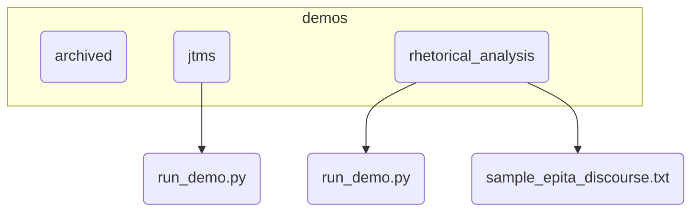

# Plan de Réorganisation du Répertoire `demos/`

## 1. Objectif

Ce document décrit le plan de migration pour réorganiser le répertoire `demos/` afin d'améliorer la clarté, la maintenabilité et la scalabilité.

## 2. État Actuel

Le répertoire `argumentation_analysis/demos/` contient actuellement deux fichiers de démonstration à la racine :

- `jtms_demo_complete.py`
- `run_rhetorical_analysis_demo.py`

Cette structure est plate et ne permet pas d'évoluer correctement.

## 3. Nouvelle Structure Proposée

La nouvelle structure regroupera les démonstrations par fonctionnalité dans des sous-répertoires dédiés. Un répertoire `archived/` est également créé pour les futures démos obsolètes.



## 4. Plan d'Action

### Étape 1 : Création des nouveaux répertoires

```bash
mkdir -p argumentation_analysis/demos/archived
mkdir -p argumentation_analysis/demos/jtms
mkdir -p argumentation_analysis/demos/rhetorical_analysis
```

### Étape 2 : Déplacement et Renommage des fichiers

Les scripts de démonstration seront déplacés et renommés en `run_demo.py` pour une convention unifiée.

```bash
# Déplacer la démo JTMS
mv argumentation_analysis/demos/jtms_demo_complete.py argumentation_analysis/demos/jtms/run_demo.py

# Déplacer la démo d'analyse rhétorique
mv argumentation_analysis/demos/run_rhetorical_analysis_demo.py argumentation_analysis/demos/rhetorical_analysis/run_demo.py
```

### Étape 3 : Modification du Script d'Analyse Rhétorique

Le script `argumentation_analysis/demos/rhetorical_analysis/run_demo.py` doit être modifié pour fonctionner correctement depuis son nouvel emplacement.

1.  **Mettre à jour le chemin du fichier de démonstration :**
    - **Fichier à modifier :** `argumentation_analysis/demos/rhetorical_analysis/run_demo.py`
    - **Ligne à modifier :** 106
    - **Changement :** Remplacer le chemin absolu par un chemin relatif.
      ```python
      # AVANT
      demo_file_path = "argumentation_analysis/demos/sample_epita_discourse.txt"
      
      # APRÈS
      demo_file_path = "argumentation_analysis/demos/rhetorical_analysis/sample_epita_discourse.txt"
      ```

2.  **Corriger la création de fichiers temporaires :**
    - **Fichier à modifier :** `argumentation_analysis/demos/rhetorical_analysis/run_demo.py`
    - **Ligne à modifier :** 43
    - **Changement :** Supprimer l'argument `dir` pour utiliser le répertoire temporaire par défaut du système, ce qui est une meilleure pratique.
      ```python
      # AVANT
      with tempfile.NamedTemporaryFile(mode='w', delete=False, encoding='utf-8', suffix='.txt', dir='argumentation_analysis') as input_fp:

      # APRÈS
      with tempfile.NamedTemporaryFile(mode='w', delete=False, encoding='utf-8', suffix='.txt') as input_fp:
      ```

### Étape 4 : Validation

Après avoir appliqué ces changements, exécuter les deux scripts `run_demo.py` dans leurs répertoires respectifs pour s'assurer que les démonstrations fonctionnent toujours comme prévu.