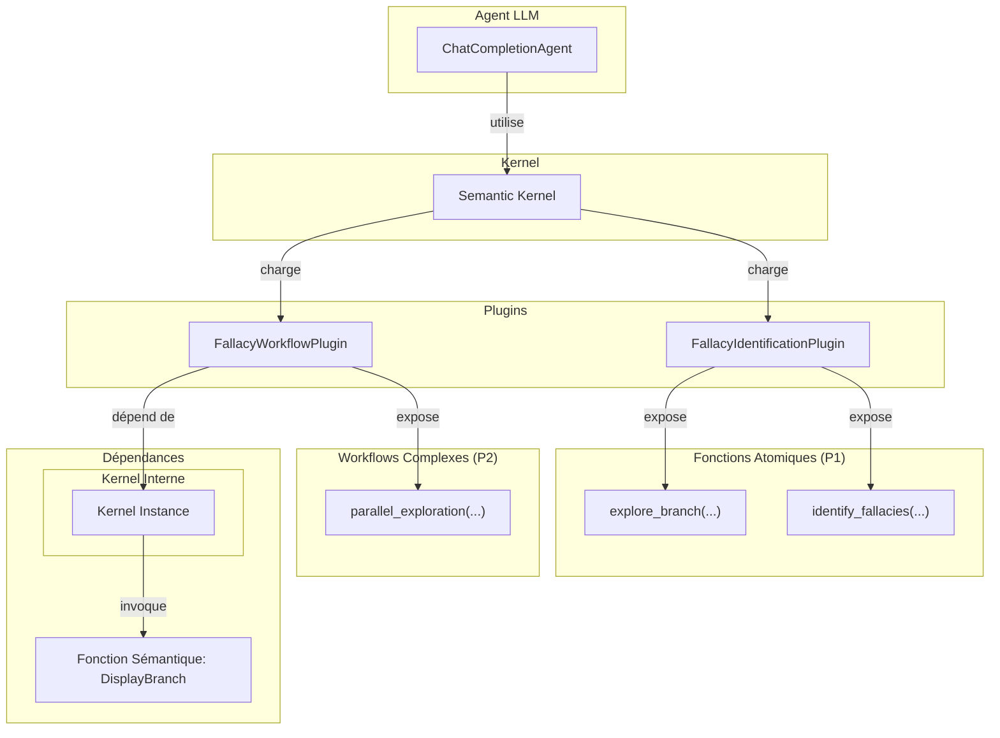

# Plan d'Implémentation : Workflows d'Exploration des Sophismes

Ce document détaille l'architecture et les étapes d'implémentation pour rendre le `FallacyIdentificationPlugin` configurable et pour introduire de nouveaux workflows d'exploration complexes.

## Objectifs

1.  **Configurabilité**: Permettre de limiter le `FallacyIdentificationPlugin` à certaines opérations (simples, complexes, ou les deux).
2.  **Workflows Complexes**: Introduire deux nouveaux workflows guidés par le LLM pour l'exploration de la taxonomie des sophismes :
    *   Un workflow parallélisé.
    *   Un workflow séquentiel itératif.
3.  **Tests Robustes**: Mettre à jour les tests existants et en créer de nouveaux pour valider toutes les configurations et tous les workflows.

---

## Architecture Validée

L'approche consiste à séparer la logique en deux plugins distincts pour une modularité maximale.

*   **`FallacyIdentificationPlugin`**: Contient les fonctions atomiques (`explore_branch`, `identify_fallacies`). Ce plugin sera rendu configurable.
*   **`FallacyWorkflowPlugin`**: Nouveau plugin qui contiendra les fonctions d'orchestration (`parallel_exploration`, `sequential_exploration`) et qui dépendra d'une instance du `Kernel`.

### Diagramme d'Architecture

---

## Plan d'Implémentation Détaillé

### Phase 1: Rendre `FallacyIdentificationPlugin` Configurable

**Fichier à modifier**: `argumentation_analysis/agents/plugins/fallacy_identification_plugin.py`

1.  **Mettre à jour `__init__`**:
    *   Ajouter un paramètre `allowed_operations: list[str] | None = None`.
    *   Stocker la valeur dans `self.allowed_operations`.
2.  **Filtrage dynamique des fonctions**:
    *   Surcharger la méthode `__getattribute__` ou modifier les métadonnées de la fonction post-initialisation pour retirer les fonctions non désirées de la liste des fonctions visibles par le kernel. L'approche la plus propre est de ne pas enregistrer les fonctions non autorisées.
    *   Une alternative consiste à inspecter les fonctions de l'objet après `__init__` et à retirer l'attribut `_is_kernel_function` pour celles qui ne sont pas dans `allowed_operations`.

### Phase 2: Création du `FallacyWorkflowPlugin`

**Nouveau fichier**: `argumentation_analysis/agents/plugins/fallacy_workflow_plugin.py`

1.  **Définir la classe `FallacyWorkflowPlugin`**:
    *   Le constructeur `__init__` prendra `kernel: Kernel` en argument.
2.  **Implémenter `parallel_exploration`**:
    *   Signature: `async def parallel_exploration(self, nodes: list[str], depth: int = 1) -> str:`
    *   **Logique interne**:
        *   Utiliser `asyncio.gather` pour appeler en parallèle une fonction sémantique (`DisplayBranch`) pour chaque `node_id` dans `nodes` via le `self.kernel`.
        *   Agréger les résultats en une seule chaîne (JSON ou Markdown).

### Phase 3: Création de la Fonction Sémantique `DisplayBranch`

1.  **Créer l'arborescence de répertoires**:
    *   `argumentation_analysis/agents/prompts/FallacyWorkflows/DisplayBranch/`
2.  **Créer `skprompt.txt`**:
    *   Chemin: `.../DisplayBranch/skprompt.txt`
    *   Prompt: Instruira le LLM pour extraire et formater une sous-branche de la taxonomie fournie.
    *   Variables: `{{$node_id}}`, `{{$depth}}`, `{{$taxonomy}}`.
3.  **Créer `config.json`**:
    *   Chemin: `.../DisplayBranch/config.json`
    *   Définir les `input_variables`.

### Phase 4: Mise à Jour des Tests

**Fichier à modifier**: `tests/integration/test_fallacy_agent_workflow.py`

1.  **Paramétrer le test existant**:
    *   Utiliser `@pytest.mark.parametrize` pour tester les configurations `simple_mode` (seul `identify_fallacies` est disponible) et `complex_mode` (le workflow d'exploration complet).
    *   La fixture du plugin doit être modifiée pour accepter la configuration et instancier le plugin en conséquence.
2.  **Créer un nouveau test pour `parallel_exploration`**:
    *   Valider que le workflow appelle le kernel interne pour chaque noeud fourni et agrège correctement les résultats.
    *   Mocker la réponse du LLM pour appeler `parallel_exploration` et mocker les appels au `kernel.invoke` interne.
3.  **Créer un nouveau test pour le workflow séquentiel**:
    *   Valider la capacité de l'agent à suivre un prompt système qui le force à utiliser `explore_branch` de manière itérative pour descendre dans la taxonomie.