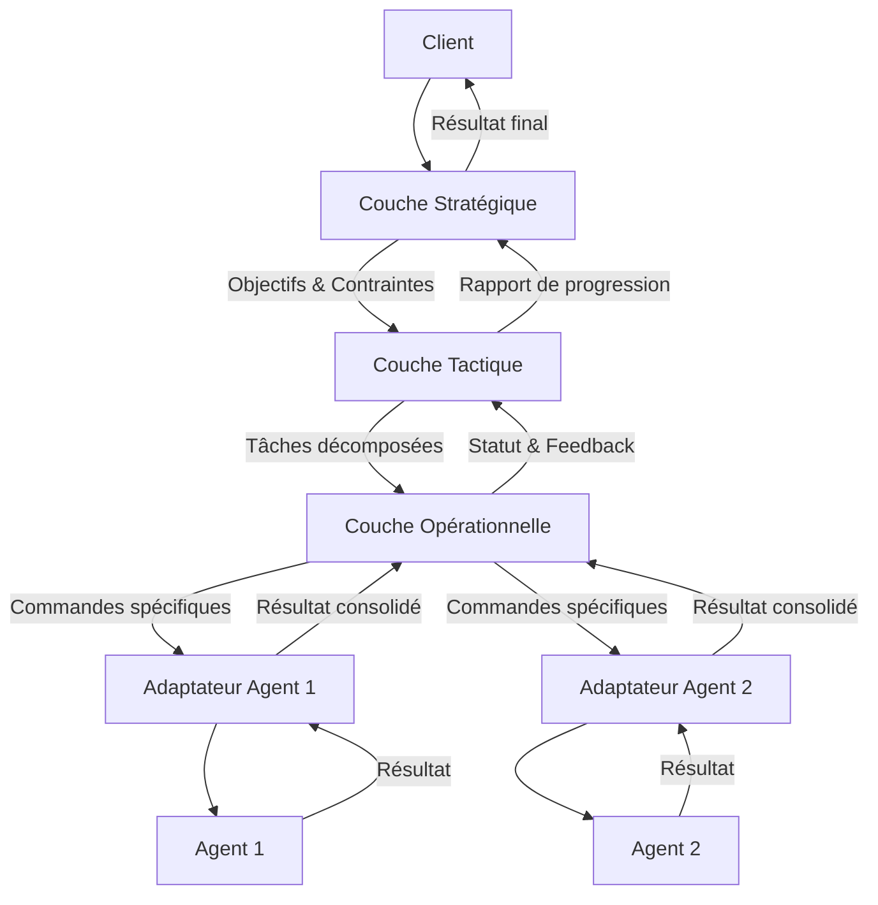

# Paquet `orchestration`

## 1. Philosophie d'Orchestration

Le paquet `orchestration` est le cœur de la collaboration entre les agents au sein du système d'analyse d'argumentation. Sa responsabilité principale est de gérer la dynamique complexe des interactions entre agents, en décidant **qui** fait **quoi** et **quand**.

Contrairement à une simple exécution séquentielle de tâches, l'orchestration gère :
- L'assignation dynamique des tâches en fonction des compétences des agents et du contexte actuel.
- La parallélisation des opérations lorsque cela est possible.
- La résolution de conflits ou de dépendances entre les tâches.
- L'agrégation et la synthèse des résultats produits par plusieurs agents.
- L'adaptation du plan d'analyse en fonction des résultats intermédiaires.

Ce paquet fournit les mécanismes pour transformer une flotte d'agents spécialisés en une équipe cohérente capable de résoudre des problèmes complexes.

## 2. Approches architecturales

Deux approches principales d'orchestration coexistent au sein de ce paquet, offrant différents niveaux de flexibilité et de contrôle.

### 2.1. Orchestrateur Centralisé (`engine/main_orchestrator.py`)

Cette approche s'appuie sur un orchestrateur principal qui maintient un état global et distribue les tâches aux agents. C'est un modèle plus simple et direct.

*   **Concept** : Un chef d'orchestre unique dirige les agents.
*   **Avantages** : Simple à comprendre, facile à déboguer, contrôle centralisé.
*   **Inconvénients** : Peut devenir un goulot d'étranglement, moins flexible face à des scénarios très dynamiques.

### 2.2. Architecture Hiérarchique (`hierarchical/`)

Cette approche, plus sophistiquée, structure l'orchestration sur trois niveaux de responsabilité, permettant une séparation claire des préoccupations et une plus grande scalabilité.

*   **Couche Stratégique** : Planification à long terme, définition des objectifs généraux.
*   **Couche Tactique** : Coordination des groupes d'agents, décomposition des objectifs en tâches concrètes, gestion des dépendances.
*   **Couche Opérationnelle** : Exécution des tâches, interaction directe avec les agents via des adaptateurs.

Cette architecture est conçue pour gérer des analyses complexes impliquant de nombreux agents avec des rôles variés. Pour plus de détails, consultez le [README de l'architecture hiérarchique](./hierarchical/README.md).