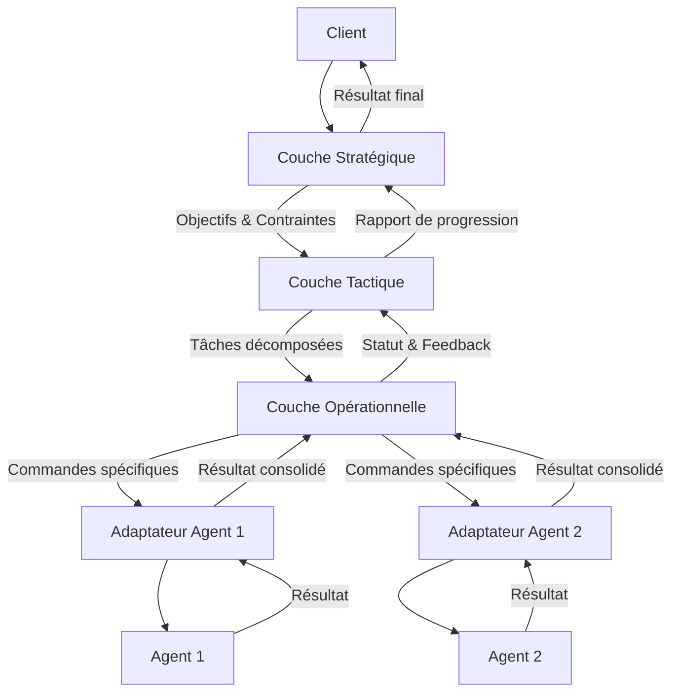

# Paquet `orchestration`

## 1. Philosophie d'Orchestration

Le paquet `orchestration` est le cœur de la collaboration entre les agents au sein du système d'analyse d'argumentation. Sa responsabilité principale est de gérer la dynamique complexe des interactions entre agents, en décidant **qui** fait **quoi** et **quand**.

Contrairement à une simple exécution séquentielle de tâches, l'orchestration gère :
- L'assignation dynamique des tâches en fonction des compétences des agents et du contexte actuel.
- La parallélisation des opérations lorsque cela est possible.
- La résolution de conflits ou de dépendances entre les tâches.
- L'agrégation et la synthèse des résultats produits par plusieurs agents.
- L'adaptation du plan d'analyse en fonction des résultats intermédiaires.

Ce paquet fournit les mécanismes pour transformer une flotte d'agents spécialisés en une équipe cohérente capable de résoudre des problèmes complexes.

## 2. Approches architecturales

Deux approches principales d'orchestration coexistent au sein du système, offrant différents niveaux de flexibilité et de contrôle.

### 2.1. Moteur d'exécution (`WorkflowExecutor`, `workflow_dsl.py`)

Le moteur d'exécution des phases est le **`WorkflowExecutor`** (`workflow_dsl.py:356` — « exécute un `WorkflowDefinition` en résolvant les capabilities via un `CapabilityRegistry` »), instancié par `run_unified_analysis()` (`unified_pipeline.py:205`, construction à `:373`). Chaque phase du `WorkflowDSL` est résolue par capability au moment de l'exécution ; bande exécutée : `tests/unit/argumentation_analysis/orchestration/test_dag_parallelism.py` + `test_critical_coverage.py` → 43 passed.

L'ancien `pipelines/orchestration/execution/engine.py` **n'était pas ce moteur et n'était pas câblé** : zéro appelant production et chemin refusé en amont par `pipelines/unified_pipeline.py`. Il a été retiré avec ses helpers `analysis/` dans #2113 ; seules des stratégies historiques subsistent dans ce sous-paquet. L'ancien doublon `orchestration/engine/` (main_orchestrator/config/strategy) avait déjà été supprimé dans #1962 faute d'appelant production.

### 2.2. Architecture Hiérarchique (`hierarchical/`)

Cette approche, plus sophistiquée, structure l'orchestration sur trois niveaux de responsabilité, permettant une séparation claire des préoccupations et une plus grande scalabilité.

```mermaid
graph TD
    A[Client] --> S[Couche Stratégique];
    S -- Objectifs & Contraintes --> T[Couche Tactique];
    T -- Tâches décomposées --> O[Couche Opérationnelle];
    O -- Commandes spécifiques --> Ad1[Adaptateur Agent 1];
    O -- Commandes spécifiques --> Ad2[Adaptateur Agent 2];
    Ad1 --> Ag1[Agent 1];
    Ad2 --> Ag2[Agent 2];
    Ag1 -- Résultat --> Ad1;
    Ag2 -- Résultat --> Ad2;
    Ad1 -- Résultat consolidé --> O;
    Ad2 -- Résultat consolidé --> O;
    O -- Statut & Feedback --> T;
    T -- Rapport de progression --> S;
    S -- Résultat final --> A;
```

*   **Couche Stratégique** : Planification à long terme, définition des objectifs généraux.
*   **Couche Tactique** : Coordination des groupes d'agents, décomposition des objectifs en tâches concrètes, gestion des dépendances.
*   **Couche Opérationnelle** : Exécution des tâches, interaction directe avec les agents via des adaptateurs.

Cette architecture est conçue pour gérer des analyses complexes impliquant de nombreux agents avec des rôles variés. Pour plus de détails, consultez le [README de l'architecture hiérarchique](./hierarchical/README.md).