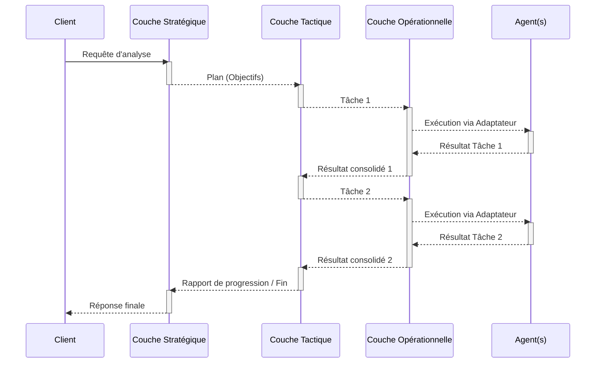

# Architecture d'Orchestration Hiérarchique

Ce répertoire contient l'implémentation d'une architecture d'orchestration à trois niveaux, conçue pour gérer des tâches d'analyse complexes en décomposant le problème. Cette approche favorise la séparation des préoccupations, la modularité et la scalabilité.

## Les Trois Couches

L'architecture est divisée en trois couches de responsabilité distinctes :

1.  **Stratégique (`strategic/`)**
    *   **Rôle** : Planification à long terme et définition des objectifs de haut niveau. Le `StrategicManager` interprète la requête initiale, la décompose en grands objectifs (ex: "Analyser la structure logique", "Évaluer la crédibilité des sources") et définit les contraintes globales.
    *   **Focalisation** : Le "Quoi" et le "Pourquoi".

2.  **Tactique (`tactical/`)**
    *   **Rôle** : Coordination à moyen terme. Le `TacticalCoordinator` reçoit les objectifs stratégiques et les traduit en une séquence de tâches concrètes et ordonnancées. Il gère les dépendances entre les tâches, alloue les groupes d'agents nécessaires et supervise la progression.
    *   **Focalisation** : Le "Comment" et le "Quand".

3.  **Opérationnel (`operational/`)**
    *   **Rôle** : Exécution à court terme. L'`OperationalManager` reçoit des tâches individuelles de la couche tactique et les exécute. Il gère la communication directe avec les agents via des **Adaptateurs** (`adapters/`), qui traduisent une commande générique (ex: "analyse informelle") en l'appel spécifique attendu par l'agent correspondant.
    *   **Focalisation** : Le "Faire".

## Flux de Contrôle et de Données

Le système fonctionne sur un double flux : un flux de contrôle descendant (délégation) et un flux de feedback ascendant (résultats).

-   **Flux descendant (Top-Down)** : La requête du client est progressivement décomposée à chaque niveau. La couche stratégique définit la vision, la tactique crée le plan d'action, et l'opérationnelle exécute chaque étape.
-   **Flux ascendant (Bottom-Up)** : Les résultats produits par les agents sont collectés par la couche opérationnelle, agrégés et synthétisés par la couche tactique, et finalement utilisés par la couche stratégique pour construire la réponse finale et, si nécessaire, ajuster le plan.

## Interfaces (`interfaces/`)

Pour garantir un couplage faible entre les couches, des interfaces formelles sont définies dans ce répertoire. Elles agissent comme des contrats, spécifiant les données et les méthodes que chaque couche expose à ses voisines.

-   [`strategic_tactical.py`](./interfaces/strategic_tactical.py:0) : Définit la structure de communication entre la stratégie et la tactique.
-   [`tactical_operational.py`](./interfaces/tactical_operational.py:0) : Définit la structure de communication entre la tactique et l'opérationnel.