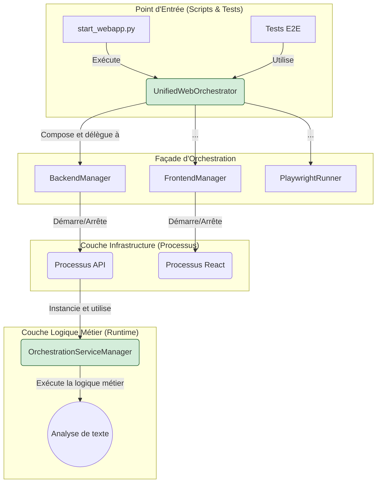

# Rapport d'Audit et de Recommandations - Infrastructure Web et Tests

**Date:** 10/06/2025
**Auteur:** Roo, Architecte Technique
**Version:** 2.1 (Révision finale avec analyse exhaustive des tests)

## 1. Introduction

Ce rapport présente un audit exhaustif de l'infrastructure existante liée aux applications web, aux API et aux tests. L'objectif est de fournir une cartographie détaillée de l'existant, d'identifier les problèmes architecturaux (redondances, complexité) et de proposer un plan de refactoring intelligent qui capitalise sur les composants robustes déjà développés pour créer une architecture unifiée, maintenable et prévisible.

## 2. Cartographie de l'Architecture Actuelle

L'architecture du projet est mature et puissante, mais sa complexité s'est accrue avec le temps. Elle s'articule autour d'une façade d'orchestration qui délègue les responsabilités à des gestionnaires spécialisés, lesquels interagissent avec deux types de "Service Managers" aux rôles bien distincts.

### 2.1. Le Chef d'Orchestre : `UnifiedWebOrchestrator`

Le composant `scripts/webapp/unified_web_orchestrator.py` est la **façade centrale** pour toute interaction avec l'application web. Il ne contient pas de logique métier complexe mais agit comme un point d'entrée unifié qui orchestre d'autres composants spécialisés. Son rôle est de simplifier le cycle de vie complet : démarrage, test, et arrêt.

### 2.2. Les Gestionnaires Spécialisés

L'orchestrateur délègue ses tâches à une série de gestionnaires, chacun avec une responsabilité unique :

*   **`BackendManager`**: Gère le cycle de vie du processus de l'API backend (démarrage, arrêt, health check).
*   **`FrontendManager`**: Gère le cycle de vie du serveur de développement frontend (React).
*   **`PlaywrightRunner`**: Exécute les suites de tests de bout-en-bout (E2E) avec Playwright.
*   **`ProcessCleaner`**: S'assure que tous les processus sont correctement terminés pour éviter les ports orphelins.

### 2.3. La Dualité des `ServiceManager`

C'est la découverte la plus importante de cet audit. Il n'y a pas un, mais **deux `ServiceManager`** avec des rôles très différents :

1.  **`InfrastructureServiceManager` (`project_core`)**: C'est le gestionnaire de **bas niveau**, responsable de l'infrastructure. Il gère les processus, les ports, et l'environnement.
2.  **`OrchestrationServiceManager` (`argumentation_analysis`)**: C'est le gestionnaire de **haut niveau**, le "cerveau" de l'application. Il est instancié par l'application API elle-même et contient toute la logique métier.

### 2.4. Diagramme de l'Architecture Actuelle



## 3. Stratégie de Test : Une Pyramide Complète et Riche

Le projet bénéficie d'une stratégie de test très complète qui couvre tous les niveaux de la pyramide. L'analyse exhaustive révèle une couverture bien plus riche que suspecté initialement.

### 3.1. Vue d'Ensemble de la Pyramide

1.  **Tests Unitaires (`tests/unit`)**: Testent des fonctions ou des classes individuelles de manière isolée.
2.  **Tests d'Intégration (`tests/integration`)**: Valident la collaboration entre les composants internes du backend.
3.  **Tests Fonctionnels / E2E (voir ci-dessous)**: Simulent des parcours utilisateurs complets.
4.  **Tests de Validation (`tests/validation_sherlock_watson`)**: Tests de très haut niveau qui valident des objectifs métier.
5.  **Tests de Santé Architecturale**: Tests uniques qui valident la cohérence de l'architecture elle-même.

### 3.2. La Suite de Tests Fonctionnels E2E (Python + Playwright)

Le répertoire `tests/functional` contient une suite de tests de bout-en-bout (E2E) particulièrement riche, pilotée par `pytest` et `playwright`.

*   **Organisation par Feature :** Les tests sont méthodiquement organisés par fonctionnalité de l'interface web, ce qui est une excellente pratique :
    *   `test_argument_analyzer.py`: Valide l'onglet principal d'analyse.
    *   `test_fallacy_detector.py`: Valide l'onglet de détection de sophismes.
    *   `test_argument_reconstructor.py`: Valide l'onglet de reconstruction d'arguments.
    *   `test_logic_graph.py`: Valide l'onglet de visualisation de graphes logiques.
    *   `test_validation_form.py`: Valide l'onglet de validation d'arguments.
    *   `test_framework_builder.py`: Valide l'onglet de construction de frameworks.

*   **Couverture Approfondie :** Chaque fichier de test couvre non seulement le scénario nominal ("happy path"), mais aussi les cas d'erreur et les fonctionnalités annexes comme les boutons de réinitialisation.

*   **Workflows d'Intégration Complexes :**
    *   `test_integration_workflows.py`: Ce test est crucial. Il simule des parcours utilisateurs complexes qui naviguent entre plusieurs onglets, validant la persistance des données et la cohérence de l'expérience utilisateur globale. Il inclut même des tests de performance.
    *   `test_react_interface_complete.py`: Ce script n'est pas un test en soi, mais un **lanceur de tests**. Il orchestre le démarrage complet de l'infrastructure (backend et frontend) avant d'exécuter l'intégralité de la suite de tests fonctionnels. C'est le point d'entrée pour la validation E2E.

### 3.3. Recommandations pour la Stratégie de Test

*   **Clarifier la Nomenclature :** Renommer `tests/functional` en `tests/e2e_python` pour mieux refléter son contenu et le distinguer des tests E2E purement JS dans `tests_playwright`.
*   **Centraliser l'Exécution :** Le `UnifiedWebOrchestrator` et le lanceur `test_react_interface_complete.py` sont les bons outils. Leur utilisation doit être systématisée et documentée comme la méthode officielle pour lancer les tests.

## 4. Problèmes Architecturaux et Plan de Consolidation

Malgré une base solide, l'architecture souffre de redondances qui augmentent la complexité.

### 4.1. Problèmes Identifiés

1.  **Redondance des API :** Coexistence d'une API Flask et d'une API FastAPI.
2.  **Redondance des Applications Web :** Multiples applications Flask quasi-identiques.
3.  **Redondance des Scripts de Démarrage :** Multiples scripts pour lancer l'orchestrateur.

### 4.2. Plan de Consolidation Recommandé

**Étape 1 : Unifier l'API Backend sur FastAPI**
*   **Action :** Migrer toute la logique métier de l'API Flask vers `api/main.py` (FastAPI).
*   **Résultat :** Une seule API backend, moderne et performante.

**Étape 2 : Unifier le Point d'Entrée de Démarrage**
*   **Action :** Établir `scripts/apps/start_webapp.py` comme le **seul script officiel** pour le démarrage. Mettre à jour sa logique pour lancer l'API FastAPI avec `uvicorn`.
*   **Résultat :** Un seul script clair pour les développeurs.

**Étape 3 : Unifier l'Orchestration du Pipeline CI/CD**
*   **Action :** Modifier `scripts/pipelines/run_web_e2e_pipeline.py` pour qu'il utilise systématiquement `UnifiedWebOrchestrator`.
*   **Résultat :** La même logique d'orchestration robuste en développement et en CI/CD.

**Étape 4 : Mettre à jour les Tests et Configurations**
*   **Action :** Mettre à jour les configurations Playwright et les lanceurs de tests pour qu'ils ciblent la nouvelle API FastAPI unifiée.
*   **Résultat :** Des tests E2E qui valident l'architecture cible.

### 4.3. Diagramme de l'Architecture Cible

```mermaid
graph TD
    subgraph "Gestion de l'Environnement (Conservé)"
        A1[auto_env.py] -->|Utilise| A2[EnvironmentManager];
    end

    subgraph "Orchestration (Unifiée)"
        B1[start_webapp.py] -->|Lance| C1[UnifiedWebOrchestrator];
        B2[run_web_e2e_pipeline.py] -->|Lance| C1;
    end

    subgraph "Coeur de l'Orchestration (Adapté)"
        C1 --> C2[BackendManager (pour FastAPI)];
        C1 --> C3[FrontendManager (pour React)];
        C1 --> C4[PlaywrightRunner];
    end

    subgraph "Applications & APIs (Consolidées)"
        D1[api/main.py (FastAPI)] -->|API| E2[Tests API Playwright];
        D2[interface_web/app.py (React/Vue/etc)] -->|UI| E1[Tests UI Playwright];
    end

    style A1 fill:#d4edda,stroke:#155724
    style C1 fill:#d4edda,stroke:#155724
    style D1 fill:#d4edda,stroke:#155724
```

Ce plan de refactoring, en s'appuyant sur les composants les plus robustes de l'architecture actuelle, permettra de réduire drastiquement la complexité, d'améliorer la maintenabilité et de garantir que le système fonctionne de manière authentique et prévisible.