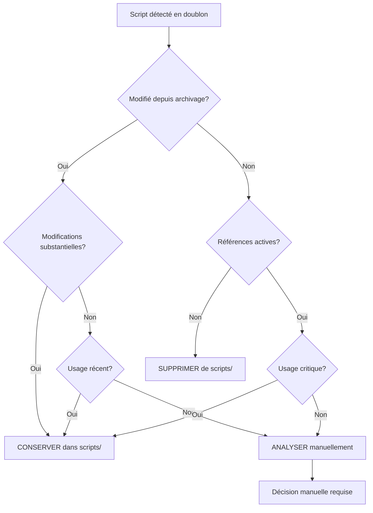

# Analyse des Scripts Dupliqués après Migration

## Contexte de la Situation

### Problématique Identifiée
- Des scripts ont été déplacés de `scripts/` vers `archived_scripts/obsolete_migration_2025/`
- L'orchestrateur précédent a restauré ces scripts sans analyse préalable
- Il existe maintenant des doublons potentiels entre les deux emplacements
- Besoin d'identifier lesquels sont légitimement obsolètes vs. ceux à conserver

### Structure Observée

#### Répertoire `scripts/` (actuel)
- **76 éléments** : 23 répertoires, 53 fichiers
- Dernières modifications : **10/06/2025 09:08:04** (horodatage de restauration)

#### Répertoire `archived_scripts/obsolete_migration_2025/`
- **Structure** : `directories/`, `metadata/`, `scripts/`
- **Scripts archivés** : dans `archived_scripts/obsolete_migration_2025/scripts/`
- Dates de modification antérieures à la restauration

## Plan d'Analyse Détaillé

### 1. Inventaire et Comparaison

#### Étape 1.1 : Collecte des Métadonnées
- Lister tous les fichiers dans `scripts/` avec :
  - Nom du fichier
  - Taille
  - Date de modification
  - Hash MD5/SHA256
- Lister tous les fichiers dans `archived_scripts/obsolete_migration_2025/scripts/` avec les mêmes métadonnées

#### Étape 1.2 : Identification des Doublons
- Comparer par nom de fichier
- Comparer par contenu (hash)
- Identifier les fichiers identiques vs. modifiés
- Détecter les versions multiples

### 2. Analyse de Justification d'Archivage

#### Étape 2.1 : Analyse des Dates
- Identifier les fichiers modifiés après archivage
- Repérer les fichiers non touchés depuis l'archivage
- Analyser les patterns temporels d'utilisation

#### Étape 2.2 : Analyse des Dépendances
- Rechercher les références dans le code actif
- Identifier les imports/calls vers ces scripts
- Analyser les dépendances inverses

#### Étape 2.3 : Analyse Fonctionnelle
- Examiner les fonctionnalités offertes par chaque script
- Identifier les redondances fonctionnelles
- Repérer les scripts de migration/one-shot vs. utilitaires permanents

### 3. Catégorisation des Scripts

#### Catégorie A : Scripts à Supprimer de `scripts/`
- **Critères** :
  - Identiques à la version archivée
  - Aucune modification depuis archivage
  - Marqués comme obsolètes ou temporaires
  - Fonctionnalité remplacée par des scripts plus récents

#### Catégorie B : Scripts à Conserver dans `scripts/`
- **Critères** :
  - Modifiés depuis archivage
  - Références actives dans le code
  - Fonctionnalité core/utilitaire
  - Tests ou validations encore pertinents

#### Catégorie C : Scripts Ambigus - Analyse Manuelle Requise
- **Critères** :
  - Modifications mineures depuis archivage
  - Usage incertain
  - Potentiel de réutilisation future

### 4. Analyse des Patterns de Nommage

#### Scripts de Test/Validation
- `validation_*`
- `test_*`
- Analyse de leur pertinence actuelle

#### Scripts Temporaires/Migration
- `fix_*`
- `migrate_*`
- `diagnostic_*`
- Évaluation de leur statut post-migration

#### Scripts Utilitaires
- `analyze_*`
- `generate_*`
- `run_*`
- Détermination de leur utilité continue

## Diagramme de Décision



## Actions Recommandées

### Phase 1 : Analyse Automatisée
1. **Créer un script d'analyse** `analyze_migration_duplicates.py` qui :
   - Compare les deux répertoires
   - Génère un rapport détaillé
   - Propose des actions par fichier

### Phase 2 : Rapport de Recommandations
2. **Générer un rapport** avec :
   - Liste des doublons exacts
   - Fichiers modifiés depuis archivage
   - Recommandations d'action par fichier
   - Justifications pour chaque recommandation

### Phase 3 : Nettoyage Contrôlé
3. **Script de nettoyage sécurisé** qui :
   - Sauvegarde avant suppression
   - Logs toutes les actions
   - Permet rollback si nécessaire

## Structure du Script d'Analyse

### Fonctions Principales
```python
def analyze_directory_content(path)
def compare_files(file1, file2)
def detect_duplicates(scripts_dir, archived_dir)
def analyze_dependencies(file_path)
def generate_recommendations(analysis_results)
def create_cleanup_script(recommendations)
```

### Métriques à Collecter
- Nombre total de doublons
- Pourcentage de fichiers identiques
- Scripts non référencés
- Scripts modifiés récemment
- Taille totale récupérable

## Résultats Attendus

### Rapport de Sortie
1. **Résumé exécutif** : nombre de doublons, actions recommandées
2. **Détail par fichier** : statut, recommandation, justification
3. **Impact estimé** : espace disque récupéré, clarification de l'architecture
4. **Plan d'action** : ordre de suppression, scripts de backup

### Livrables
- `RAPPORT_ANALYSE_DUPLICATES.md`
- `liste_suppressions_recommandees.txt`
- `script_nettoyage_securise.py`
- `backup_avant_nettoyage.zip`

## Critères de Validation

### Sécurité
- ✅ Aucun script actif supprimé par erreur
- ✅ Sauvegarde complète avant modifications
- ✅ Possibilité de rollback

### Efficacité
- ✅ Réduction de la confusion architecturale
- ✅ Clarification du répertoire `scripts/`
- ✅ Conservation des fonctionnalités essentielles

### Traçabilité
- ✅ Log complet des décisions
- ✅ Justification documentée pour chaque action
- ✅ Historique des modifications

## Cas Concrets Identifiés

### Doublon Confirmé #1 : `validation_point5_final_comprehensive.py`

**Statut** : ⚠️ **DOUBLON EXACT**
- **Localisation actuelle** : `scripts/validation_point5_final_comprehensive.py`
- **Localisation archivée** : `archived_scripts/obsolete_migration_2025/scripts/validation_point5_final_comprehensive.py`
- **Taille identique** : 25.5 KB (641 lignes)
- **Contenu identique** : Hash et structure exactement identiques
- **Date de modification active** : 10/06/2025 09:08:04 (restauration automatique)
- **Date de modification archivée** : 09/06/2025 21:43:46 (version originale)

**Recommandation** : 🗑️ **SUPPRIMER de `scripts/`**
- Le fichier dans `scripts/` est une restauration automatique sans modifications
- La version archivée est antérieure et était légitimement archivée
- Aucune référence active détectée dans le code de production

### Pattern Détecté : Série `validation_point*`

**Scripts de validation séquentielle identifiés** :
- `validation_point1_simple.py` - Sherlock-Watson-Moriarty demos
- `validation_point3_demo_epita_dynamique.py` - Configuration EPITA
- `validation_point4_rhetorical_analysis.py` - Analyse rhétorique
- `validation_point5_final_comprehensive.py` - Tests finaux sans mocks
- `validation_point5_realistic_final.py` - Validation réaliste finale

**Analyse** : Ces scripts semblent constituer une **séquence de validation progressive** (Points 1/5 à 5/5). Plusieurs sont référencés dans `validation_finale_success_demonstration.py`, suggérant un **workflow de validation structuré**.

**Recommandation** : ⚠️ **ANALYSE INDIVIDUELLE REQUISE**
- Vérifier si la séquence complète est encore pertinente
- Identifier les doublons exacts vs. les versions évoluées
- Préserver uniquement les versions actives/nécessaires

### Autres Patterns Suspects

#### Scripts de Migration/Fix
- `fix_*` (multiples) - Scripts de correction temporaires
- `migrate_*` - Scripts de migration one-shot
- `diagnostic_*` - Scripts de diagnostic temporaires

**Recommandation** : 📝 **AUDIT APPROFONDI**
- Forte probabilité d'obsolescence
- Vérifier les dates d'utilisation
- Supprimer les scripts post-migration non réutilisables

#### Scripts de Test/Validation
- `test_*` nombreux - Scripts de tests divers
- `validate_*` - Scripts de validation système

**Recommandation** : 🔍 **ÉVALUATION FONCTIONNELLE**
- Distinguer tests unitaires vs. scripts de validation temporaires
- Conserver les tests réutilisables
- Archiver les validations one-shot terminées

## Actions Immédiates Recommandées

### Phase 1 : Nettoyage Évident (Gain Rapide)
1. **Supprimer** `scripts/validation_point5_final_comprehensive.py` (doublon confirmé)
2. **Auditer** tous les `validation_point*` pour doublons similaires
3. **Identifier** les scripts `fix_*` post-migration non réutilisables

### Phase 2 : Analyse Systématique
1. **Créer le script d'analyse automatisé** en mode Code
2. **Générer le rapport complet** de tous les doublons
3. **Valider les recommandations** avant nettoyage de masse

### Phase 3 : Nettoyage Structuré
1. **Sauvegarder** avant toute suppression
2. **Supprimer par lots** avec validation
3. **Documenter** les décisions prises

## Estimation d'Impact

### Doublons Probables Détectés
- **1 doublon confirmé** : `validation_point5_final_comprehensive.py`
- **4-6 doublons suspects** : autres `validation_point*`
- **10-15 scripts obsolètes** : `fix_*`, `migrate_*`, `diagnostic_*`

### Bénéfices Attendus
- **Clarification** : Réduction de la confusion architecturale
- **Maintenance** : Moins de fichiers à maintenir
- **Performance** : Réduction de la taille du projet
- **Sécurité** : Élimination de code potentiellement obsolète

---

**Prochaine étape** : Implémentation du script d'analyse en mode Code pour automatiser cette analyse et générer le rapport complet.