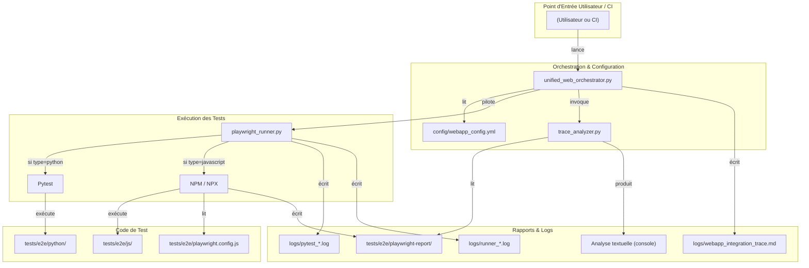

# 🗺️ Guide de l'Architecture de Test E2E Unifiée

Ce document décrit l'architecture de test End-to-End (E2E) du projet, conçue pour être robuste, maintenable et fournir des capacités de débogage autonome.

## 1. Philosophie et Architecture

L'architecture de test est centralisée autour d'un **orchestrateur unique** qui gère l'ensemble du cycle de vie de l'application et des tests. Cela garantit une exécution cohérente et reproductible.



## 2. Composants Clés

*   **Orchestrateur Unifié (`unified_web_orchestrator.py`)** : Le **seul point d'entrée** pour lancer les tests E2E. Il gère :
    *   Le démarrage et l'arrêt des services (backend, frontend).
    *   L'appel au runner de test.
    *   La génération d'une trace d'orchestration de haut niveau (`webapp_integration_trace.md`).
    *   L'appel à l'analyseur de traces pour fournir un rapport de débogage textuel.

*   **Runner Adaptatif (`playwright_runner.py`)** : Le "worker" qui exécute les tests. Il est capable de lancer :
    *   Des tests **Python** via `pytest`.
    *   Des tests **JavaScript** via `npx playwright test`.

*   **Analyseur de Traces (`trace_analyzer.py`)** : Un outil puissant qui **analyse les rapports de test Playwright** (`trace.zip`) pour en extraire des informations clés (actions, appels API, erreurs) et produire un rapport textuel concis, affiché directement dans la console à la fin de l'exécution.

*   **Configuration Playwright (`tests/e2e/playwright.config.js`)** : Fichier de configuration central pour les tests JS. Il est crucial car il active la **génération systématique des traces (`trace: 'on'`)**, qui sont indispensables à l'analyseur.

## 3. Guide d'Utilisation Pratique

Toutes les commandes sont lancées depuis la racine du projet.

### 3.1. Exécuter l'Intégration Complète

Cette commande démarre les services, exécute la suite de tests par défaut (définie dans `webapp_config.yml`), puis arrête tout.

```bash
python project_core/webapp_from_scripts/unified_web_orchestrator.py --integration
```

### 3.2. Exécuter une Suite de Tests Spécifique

Vous pouvez choisir d'exécuter uniquement les tests Python, JavaScript, ou les démos en utilisant l'argument `--test-type`.

*   **Lancer les tests JavaScript :**
    ```bash
    python project_core/webapp_from_scripts/unified_web_orchestrator.py --integration --test-type javascript
    ```

*   **Lancer les tests Python :**
    ```bash
    python project_core/webapp_from_scripts/unified_web_orchestrator.py --integration --test-type python
    ```

### 3.3. Déboguer les Tests (Le Workflow Recommandé)

L'objectif est d'obtenir des rapports textuels détaillés sans avoir à visionner des vidéos.

**Étape 1 : Lancer les tests en mode "visible" pour observation**

Pour voir ce que fait le navigateur en temps réel.

```bash
python project_core/webapp_from_scripts/unified_web_orchestrator.py --integration --test-type javascript --visible
```

**Étape 2 : Analyser la Sortie Console**

À la fin de l'exécution (même en cas d'échec), l'orchestrateur appellera automatiquement l'analyseur de traces. Vous verrez un rapport comme celui-ci directement dans votre terminal :

```text
--- DEBUT RAPPORT D'ANALYSE DE TRACE ---

================================================================================
RAPPORT D'ANALYSE DES TRACES PLAYWRIGHT
================================================================================
Analyse du: 2025-06-15T22:30:00.123456
Tests totaux: 5
Tests reussis: 4
Tests echoues: 1
...

RECOMMANDATIONS:
  1. [WARNING] 1 tests ont échoué - Examiner les messages d'erreur

RESUME DES TESTS:
  [FAIL] js/flask-interface.spec.js (15234ms)
  [OK] js/api-backend.spec.js (5034ms)
  ...

APPELS API /ANALYZE:
  [SM] POST /api/analyze -> 200
     Preview: {"status": "success", "analysis_id": ...
================================================================================
--- FIN RAPPORT D'ANALYSE DE TRACE ---
```

Ce rapport fournit :
*   Un **résumé** de l'état des tests.
*   Des **recommandations** automatiques.
*   Le **statut de chaque test**.
*   Un aperçu des **appels API** et de leurs réponses.

**Étape 3 : Consulter les Artefacts Détaillés (si nécessaire)**

Si le rapport textuel ne suffit pas, vous pouvez consulter :
*   **`logs/webapp_integration_trace.md`** : Le rapport de haut niveau de l'orchestrateur.
*   **`tests/e2e/playwright-report/`** : Le rapport HTML complet de Playwright.
*   **`tests/e2e/test-results/`** : Contient les traces brutes (`trace.zip`) et les captures d'écran des échecs.