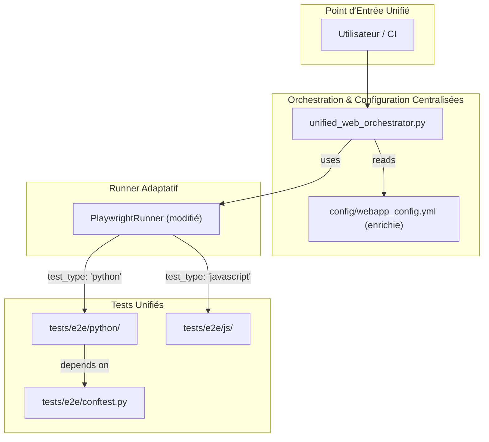

# 🗺️ Carte Architecturale et Guide d'Unification des Tests E2E

Ce document fournit une analyse complète de l'architecture actuelle des tests End-to-End (E2E) du projet, et propose un plan d'action pour unifier les différentes suites de tests sous une seule bannière.

## Partie 1 : Audit de l'Existant (Les 3 Piliers)

### 1.1. Diagramme d'Architecture Actuelle

```mermaid
flowchart TD
    subgraph "Points d'Entrée"
        U1["Utilisateur / CI"]
    end

    subgraph "Pilier 1: Python/Pytest (Principal)"
        O1["unified_web_orchestrator.py"]
        P1["pytest-playwright"]
        T1["tests/functional/"]
        C1["tests/functional/conftest.py"]
    end

    subgraph "Pilier 2: JavaScript/Playwright (Secondaire)"
        O2["run_web_e2e_pipeline.py"]
        P2["npx playwright test"]
        T2["tests_playwright/"]
        C2["playwright.config.js"]
    end

    subgraph "Pilier 3: Démos (Autonomes)"
        O3["Scripts manuels"]'
        P3["pytest / npx divers"]
        T3["demos/playwright/"]
    end

    U1 --> O1
    U1 --> O2
    U1 --> O3

    O1 --> P1 --> T1
    T1 -- depends on --> C1

    O2 --> P2 --> T2
    T2 -- depends on --> C2

    O3 --> P3 --> T3
```

### 1.2. Analyse de chaque pilier

#### Pilier 1 : Tests Fonctionnels Python (`tests/functional/`)
*   **Ce qui est bien** : Suite de tests principale et la plus mature. Elle est bien intégrée avec `pytest` et bénéficie de fixtures robustes définies dans `conftest.py`, ce qui permet un partage de la configuration et de l'état.
*   **Points faibles** : L'exécution est couplée à une configuration dans `unified_web_orchestrator.py` qui a évolué, créant des incohérences (par exemple, la référence à `PlaywrightRunner` qui est désormais orienté JS).

#### Pilier 2 : Tests Playwright JS (`tests_playwright/`)
*   **Ce qui est bien** : Utilise l'outillage standard de Playwright (`npx`), ce qui assure une bonne isolation et une compatibilité avec l'écosystème JavaScript. dispose de son propre pipeline d'orchestration via `run_web_e2e_pipeline.py`.
*   **Points faibles** : Redondant avec la suite Python. L'existence de deux suites de tests E2E distinctes augmente la charge de maintenance et peut entraîner une dérive entre les deux.

#### Pilier 3 : Démos (`demos/playwright/`)
*   **Ce qui est bien** : Excellents exemples autonomes qui sont très utiles pour le prototypage rapide et pour isoler des fonctionnalités spécifiques.
*   **Points faibles** : Totalement déconnecté de l'orchestrateur principal. Duplique la configuration (fixtures, etc.) et ne bénéficie pas de l'infrastructure de test centralisée.

## Partie 2 : Proposition d'Architecture Cible (Unifiée)

### 2.1. Diagramme d'Architecture Cible



### 2.2. Plan d'action pour l'unification

#### Étape 1 : Rendre le `PlaywrightRunner` adaptatif
Le `PlaywrightRunner` doit être modifié pour pouvoir lancer soit `pytest`, soit `npx playwright test`.

-   **Ajouter une méthode `_build_pytest_command`** dans `project_core/webapp_from_scripts/playwright_runner.py`. Cette méthode construira la commande `python -m pytest ...` avec les arguments appropriés (headless, etc.).
-   **Modifier `run_tests` dans `PlaywrightRunner`** pour qu'il choisisse la méthode de construction de commande en fonction d'un nouveau paramètre dans `config/webapp_config.yml` (ex: `test_type: 'python'` ou `test_type: 'javascript'`).

#### Étape 2 : Consolider les répertoires de tests et intégrer les démos
-   **Créer un répertoire `tests/e2e/`** qui contiendra les sous-répertoires `python/` et `js/`.
-   **Migrer les tests de `tests/functional/`** vers `tests/e2e/python/`.
-   **Migrer les tests de `tests_playwright/`** vers `tests/e2e/js/`.
-   **Transformer les scripts de `demos/playwright/`** en tests fonctionnels standards et les placer dans `tests/e2e/python/` (ou `js/` selon le cas). Les fixtures et configurations dupliquées seront migrées dans un `conftest.py` centralisé dans `tests/e2e/`.

#### Étape 3 : Mettre à jour l'Orchestrateur
-   `unified_web_orchestrator.py` doit être mis à jour pour lire une configuration de test enrichie depuis `config/webapp_config.yml`. Cette configuration pourra lister plusieurs suites de tests, chacune avec son `test_type`.
-   L'orchestrateur bouclera sur ces suites et appellera le `PlaywrightRunner` adaptatif pour chacune.

#### Étape 4 : Mettre à jour la Documentation
-   **Réécrire `docs/RUNNERS_ET_VALIDATION_WEB.md`** pour refléter la nouvelle architecture unifiée, en mettant l'accent sur `unified_web_orchestrator.py` comme point d'entrée unique.
-   **Documenter la nouvelle structure de `config/webapp_config.yml`** et expliquer comment l'utiliser pour lancer différents types de tests (tous, juste Python, juste JS, un test spécifique, etc.).
-   **Archiver l'ancien pipeline** (`run_web_e2e_pipeline.py`) et la documentation obsolète.


## Partie 3 : Guide d'Utilisation de la Nouvelle Architecture

### 3.1. Exécuter tous les tests E2E
```bash
python project_core/webapp_from_scripts/unified_web_orchestrator.py --integration
```
**Comment ça marche** : L'orchestrateur lira la section `tests` de `config/webapp_config.yml` et exécutera toutes les suites de tests qui y sont définies.

### 3.2. Exécuter une seule suite de tests (par exemple, juste les tests JS)
```bash
python project_core/webapp_from_scripts/unified_web_orchestrator.py --test-suite javascript_suite
```
**Comment ça marche** : L'orchestrateur utilisera un argument pour filtrer la suite de tests à exécuter, en se basant sur les noms définis dans `config/webapp_config.yml`.

### 3.3. Déboguer un test spécifique
```bash
# Dans config/webapp_config.yml, modifier la suite de test pour ne cibler qu'un fichier.
# puis lancer en mode visible :
python project_core/webapp_from_scripts/unified_web_orchestrator.py --visible