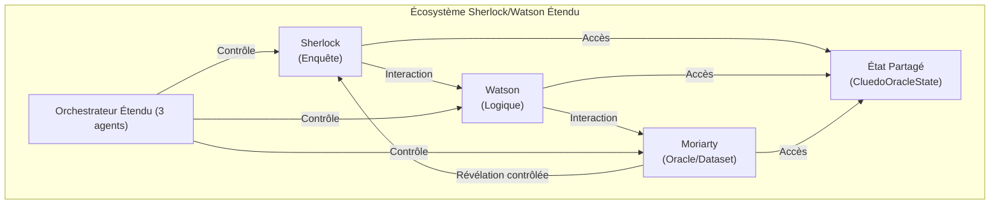

# Document de Conception : Workflow Agentique "Sherlock & Watson"

## Introduction

Ce document détaille la conception d'un workflow agentique collaboratif mettant en scène les personnages de Sherlock Holmes et du Dr. Watson. L'objectif principal est de créer une démonstration illustrant l'interaction entre un agent enquêteur/manager (`SherlockEnqueteAgent`) et un agent logicien (`WatsonLogicAssistant`) pour résoudre une énigme, initialement sous la forme d'un mystère de type Cluedo. Cette conception vise également la flexibilité pour permettre des enquêtes policières plus généralistes et des extensions futures.

L'architecture s'appuie sur Semantic Kernel pour l'orchestration des agents, la gestion de l'état partagé, et l'invocation des capacités des agents.

## Section 1: Objectifs de la Démo et du Workflow

*   **Illustrer la collaboration agentique :** Montrer comment deux agents spécialisés peuvent travailler ensemble pour résoudre un problème complexe.
*   **Démontrer l'interaction avec un état partagé structuré :** Mettre en évidence l'utilisation d'une classe d'état dédiée (`EnqueteCluedoState` héritant d'une hiérarchie) pour coordonner les agents.
*   **Mettre en œuvre un scénario d'enquête de type Cluedo :** Fournir un cadre engageant et compréhensible pour la démonstration, avec des éléments de jeu (suspects, armes, lieux), une solution secrète, et des indices initiaux.
*   **Concevoir pour l'extensibilité :** Poser les bases pour des enquêtes textuelles plus générales et l'intégration future de nouvelles capacités ou agents (par exemple, un agent Oracle/Interrogateur).
*   **Alignement avec les Pratiques Existantes :** S'inspirer des mécanismes de gestion d'état et d'orchestration déjà présents dans le projet `argumentation_analysis` (notamment `RhetoricalAnalysisState` et `StateManagerPlugin`).

## Section 2: Définition des Agents et Interaction avec l'État Hiérarchisé

Deux agents principaux sont proposés :

### 2.1 SherlockEnqueteAgent

*   **Rôle :** Agent principal de l'enquête, responsable de la gestion globale du cas, de la formulation des hypothèses, de la collecte d'informations (potentielles), et de la direction de l'enquête. Il interagit avec Watson pour obtenir des déductions logiques. Dans le scénario Cluedo, il tente d'identifier le coupable, l'arme et le lieu.
*   **Classe de Base Potentielle :** `ProjectManagerAgent` (de `argumentation_analysis.agents.core.pm`) pour ses capacités de gestion de tâches et de sous-objectifs.
*   **Interaction avec l'État :**
    *   Lit la description du cas, les éléments identifiés, les hypothèses en cours depuis l'objet `EnquetePoliciereState` (ou `EnqueteCluedoState`).
    *   Écrit de nouvelles tâches (par exemple, "Vérifier l'alibi de Mlle Rose"), des hypothèses mises à jour, et potentiellement des demandes de clarification à Watson.
    *   Utilise des méthodes de l'objet d'état (exposées via `StateManagerPlugin`) pour ajouter/modifier des hypothèses, des tâches, et consulter le log des requêtes.
*   **System Prompt (Adaptable) :**
    ```
    Vous êtes Sherlock Holmes, un détective consultant de renommée mondiale. Votre mission est de résoudre l'enquête en cours décrite dans l'état partagé.
    Vous devez analyser les informations disponibles, formuler des hypothèses et diriger l'enquête.
    Utilisez l'agent WatsonLogicAssistant pour effectuer des déductions logiques basées sur les faits et les règles établies.
    Pour interagir avec l'état de l'enquête (géré par StateManagerPlugin), utilisez les fonctions disponibles pour :
    - Lire la description du cas : `get_case_description()`
    - Consulter les éléments identifiés : `get_identified_elements()`
    - Consulter les hypothèses actuelles : `get_hypotheses()`
    - Ajouter une nouvelle hypothèse : `add_hypothesis(hypothesis_text: str, confidence_score: float)`
    - Mettre à jour une hypothèse : `update_hypothesis(hypothesis_id: str, new_text: str, new_confidence: float)`
    - Demander une déduction à Watson : `query_watson(logical_query: str, belief_set_id: str)` (Watson mettra à jour l'état avec sa réponse)
    - Consulter le log des requêtes à Watson : `get_query_log()`
    - Marquer une tâche comme terminée : `complete_task(task_id: str)`
    - Ajouter une nouvelle tâche : `add_task(description: str, assignee: str)`
    - Consulter les tâches : `get_tasks()`
    - Proposer une solution finale : `propose_final_solution(solution_details: dict)`

    Votre objectif est de parvenir à une conclusion logique et bien étayée.
    Dans le contexte d'une enquête Cluedo, vous devez identifier le coupable, l'arme et le lieu du crime.
    ```

### 2.2 WatsonLogicAssistant

*   **Rôle :** Assistant logique de Sherlock. Il maintient une base de connaissances formelle (un `BeliefSet` Tweety), effectue des déductions logiques basées sur les requêtes de Sherlock, et interprète les résultats formels en langage naturel.
*   **Classe de Base Potentielle :** `PropositionalLogicAgent` (de `argumentation_analysis.agents.core.logic`) pour ses capacités de raisonnement en logique propositionnelle via Tweety.
*   **Interaction avec l'État :**
    *   Lit les requêtes logiques formulées par Sherlock depuis l'état (via une tâche ou une section dédiée).
    *   Accède et met à jour son `BeliefSet` principal (dont l'identifiant est stocké dans `EnqueteCluedoState.main_cluedo_bs_id` ou géré dynamiquement pour `EnquetePoliciereState`). Le contenu du `BeliefSet` lui-même (les formules logiques) peut être stocké sérialisé dans l'état ou référencé si géré par un service externe. Pour cette conception, nous supposons que Watson charge/sauvegarde son `BeliefSet` via des méthodes de l'état qui gèrent la persistance (par exemple, `get_belief_set_content(bs_id)`, `update_belief_set_content(bs_id, new_content)`).
    *   Écrit les résultats de ses déductions (formels et en langage naturel) dans une section dédiée de l'état (par exemple, dans `results` avec une structure spécifique).
*   **System Prompt (Adaptable) :**
    ```
    Vous êtes le Dr. John Watson, un logicien rigoureux et l'assistant de confiance de Sherlock Holmes.
    Votre rôle est de maintenir une base de connaissances formelle (BeliefSet) et d'effectuer des déductions logiques basées sur les requêtes de Sherlock Holmes.
    Vous devez également interpréter les résultats de vos déductions en langage naturel clair et concis pour Sherlock.
    Pour interagir avec l'état de l'enquête (géré par StateManagerPlugin), utilisez les fonctions disponibles pour :
    - Récupérer le contenu d'un BeliefSet : `get_belief_set_content(belief_set_id: str)`
    - Mettre à jour le contenu d'un BeliefSet : `update_belief_set_content(belief_set_id: str, formulas: list[str], query_context: str)`
    - Ajouter une réponse de déduction à l'état : `add_deduction_result(query_id: str, formal_result: str, natural_language_interpretation: str, belief_set_id: str)`
    - Consulter les tâches qui vous sont assignées : `get_tasks(assignee='WatsonLogicAssistant')`

    Lorsqu'une requête logique vous est soumise par Sherlock (via une tâche ou une indication dans l'état) :
    1. Chargez ou mettez à jour le BeliefSet pertinent en utilisant son ID stocké dans l'état (par exemple, `EnqueteCluedoState.main_cluedo_bs_id`).
    2. Effectuez la déduction en utilisant vos capacités logiques (par exemple, avec TweetyProject).
    3. Enregistrez le résultat formel et votre interprétation en langage naturel dans l'état via `add_deduction_result`.
    4. Marquez la tâche correspondante comme complétée.
    ```

## Section 3: Initialisation de l'État d'Enquête

L'état de l'enquête sera géré par une instance d'une classe héritant de `BaseWorkflowState`.

### 3.1 `EnquetePoliciereState` (Pour enquêtes textuelles générales)

*   **Initialisation :**
    *   `description_cas`: Un texte décrivant le mystère ou le cas à résoudre.
    *   `elements_identifies`: Dictionnaire ou liste pour stocker les faits, personnages, lieux, objets pertinents identifiés au cours de l'enquête.
    *   `belief_sets`: Un dictionnaire pour stocker les `BeliefSet` de Watson. La clé pourrait être un ID unique, et la valeur le contenu sérialisé du `BeliefSet` ou une référence.
    *   `query_log`: Une liste pour enregistrer les requêtes faites à Watson et ses réponses.
    *   `hypotheses_enquete`: Liste des hypothèses formulées par Sherlock.
    *   Hérite des attributs de `BaseWorkflowState` (`tasks`, `results`, `log_messages`, `final_output`).

### 3.2 `EnqueteCluedoState` (Spécialisation pour la démo Cluedo)

Hérite de `EnquetePoliciereState` et ajoute/spécifie :

*   **Initialisation (Bootstraping du Scénario Cluedo) :**
    1.  `nom_enquete_cluedo`: e.g., "Le Mystère du Manoir Tudor".
    2.  `elements_jeu_cluedo`:
        *   `suspects`: Liste de noms (ex: ["Colonel Moutarde", "Mlle Rose", ...]).
        *   `armes`: Liste de noms (ex: ["Poignard", "Revolver", ...]).
        *   `lieux`: Liste de noms (ex: ["Salon", "Cuisine", ...]).
    3.  `solution_secrete_cluedo`: Un dictionnaire contenant le `suspect`, l'`arme`, et le `lieu` choisis aléatoirement ou prédéfinis pour être la solution. **Cet élément ne doit pas être directement accessible aux agents enquêteurs via les fonctions standards de l'état.**
    4.  `indices_distribues_cluedo`: (Optionnel, pour simuler la distribution des cartes) Une structure indiquant quels éléments *ne sont pas* la solution et sont connus initialement (par exemple, par le "joueur" ou implicitement par l'orchestrateur pour générer les premiers indices pour Watson).
    5.  `main_cluedo_bs_id`: Un identifiant unique (ex: "cluedo_main_bs") pour le `BeliefSet` principal de Watson pour cette enquête Cluedo.
    6.  **Génération des Indices Initiaux pour Watson :**
        *   Sur la base de `solution_secrete_cluedo` et `elements_jeu_cluedo`, l'orchestrateur (ou une fonction d'initialisation de `EnqueteCluedoState`) génère un ensemble de propositions logiques initiales pour le `BeliefSet` de Watson.
        *   Ces propositions affirmeraient, par exemple, que certains suspects/armes/lieux *ne sont pas* la solution (simulant les cartes qu'un joueur détiendrait).
        *   Exemple : Si la solution est (Moutarde, Poignard, Salon), et que le système décide de donner comme indice que "Mlle Rose n'est pas la coupable" et "Le Revolver n'est pas l'arme", alors le `BeliefSet` initial de Watson contiendrait des formules comme `Not(Coupable(Rose))` et `Not(Arme(Revolver))`.
        *   Le contenu de ce `BeliefSet` initial est stocké dans `belief_sets[main_cluedo_bs_id]`.
    7.  La `description_cas` (héritée) est remplie avec une description narrative du crime du Cluedo.

## Section 4: Flux d'Interaction et Orchestration

L'orchestration s'appuiera sur `AgentGroupChat` de Semantic Kernel.

1.  **Configuration de `AgentGroupChat` :**
    *   Agents : `SherlockEnqueteAgent`, `WatsonLogicAssistant`.
    *   Stratégie de participation : `BalancedParticipationStrategy` ou une stratégie personnalisée pour alterner logiquement entre Sherlock et Watson.
    *   Stratégie de terminaison : `SimpleTerminationStrategy` (par exemple, lorsque Sherlock propose une solution finale et qu'elle est validée, ou après un nombre maximum de tours).

2.  **Plugin `StateManagerPlugin` :**
    *   Une instance de `EnqueteCluedoState` (ou `EnquetePoliciereState`) est créée et passée au `StateManagerPlugin`.
    *   Le plugin expose les méthodes de l'objet d'état comme des fonctions sémantiques/natives que les agents peuvent appeler (via `FunctionChoiceBehavior.Auto`).
    *   Les prompts des agents sont conçus pour les encourager à utiliser ces fonctions pour lire et modifier l'état.

3.  **Flux Typique d'une Interaction Cluedo :**
    *   **(Tour 0 - Initialisation)** : `EnqueteCluedoState` est initialisé comme décrit en Section 3.2. Le `BeliefSet` initial de Watson est peuplé.
    *   **(Tour 1 - Sherlock)** :
        *   Sherlock est activé. Il consulte l'état (`get_case_description()`, `get_identified_elements()`).
        *   Il formule une première hypothèse ou une question pour Watson. Par exemple, "Watson, étant donné nos connaissances initiales, pouvons-nous exclure certains suspects ?"
        *   Il utilise `query_watson("SuspectsExclus?", main_cluedo_bs_id)` ou ajoute une tâche pour Watson.
    *   **(Tour 2 - Watson)** :
        *   Watson est activé. Il voit la requête de Sherlock (via l'état ou une tâche).
        *   Il accède à son `BeliefSet` (`get_belief_set_content(main_cluedo_bs_id)`).
        *   Il effectue la déduction (par exemple, interroge son `BeliefSet` avec Tweety).
        *   Il met à jour l'état avec sa réponse : `add_deduction_result(query_id="Q1", formal_result="...", natural_language_interpretation="Oui Sherlock, d'après nos informations, Mlle Rose et le Professeur Violet ne peuvent être les coupables.")`.
    *   **(Tour 3 - Sherlock)** :
        *   Sherlock lit la réponse de Watson (`get_results(query_id="Q1")` ou via une notification).
        *   Il met à jour ses propres hypothèses (`update_hypothesis(...)`).
        *   Il peut décider de "faire une suggestion" dans le jeu Cluedo (formuler une hypothèse sur un trio suspect/arme/lieu) et demander à Watson si cette suggestion est contredite par les faits connus.
        *   Exemple : "Watson, si je suggère que le crime a été commis par le Colonel Moutarde avec le Chandelier dans la Bibliothèque, cela contredit-il nos informations actuelles ?"
        *   Il utilise `query_watson("Contradiction(Suggestion(Moutarde, Chandelier, Bibliotheque))?", main_cluedo_bs_id)`.
    *   **(Tour X - Répétition)** : Le cycle continue. Sherlock pose des questions, fait des suggestions (qui se traduisent par des requêtes logiques pour Watson). Watson met à jour son `BeliefSet` si de nouveaux faits sont "révélés" (simulé par l'orchestrateur ou un agent Oracle externe dans une version plus avancée).
    *   **(Tour Final - Sherlock)** :
        *   Lorsque Sherlock pense avoir résolu l'énigme, il utilise `propose_final_solution(solution={"suspect": "X", "arme": "Y", "lieu": "Z"})`.
        *   L'orchestrateur (ou une fonction de `SimpleTerminationStrategy`) compare cette proposition à `EnqueteCluedoState.solution_secrete_cluedo` pour déterminer si l'enquête est résolue.

## Section 5: Formats des Données Échangées via l'État

Les structures de données suivantes sont suggérées pour être stockées dans l'objet d'état et accessibles/modifiables via les fonctions du `StateManagerPlugin`.

*   **`tasks` (Liste de dictionnaires) :**
    *   `task_id`: str (unique)
    *   `description`: str
    *   `assignee`: str ("SherlockEnqueteAgent", "WatsonLogicAssistant", "Orchestrator")
    *   `status`: str ("pending", "in_progress", "completed", "failed")
    *   `related_query_id`: str (optionnel, lie une tâche à une requête spécifique)
*   **`results` (Liste de dictionnaires, pour les réponses de Watson ou autres résultats d'actions) :**
    *   `result_id`: str (unique)
    *   `query_id`: str (lie au `query_log` ou `task_id`)
    *   `agent_source`: str ("WatsonLogicAssistant")
    *   `timestamp`: datetime
    *   `content`: dict (spécifique au type de résultat)
        *   Pour Watson :
            *   `reponse_formelle`: str (la sortie brute du système logique)
            *   `interpretation_ln`: str (l'interprétation en langage naturel)
            *   `belief_set_id_utilise`: str
            *   `status_deduction`: str ("success", "failure", "contradiction_found")
*   **`hypotheses_enquete` (Liste de dictionnaires, gérée par Sherlock) :**
    *   `hypothesis_id`: str (unique)
    *   `text`: str (description de l'hypothèse)
    *   `confidence_score`: float (0.0 à 1.0)
    *   `status`: str ("active", "rejected", "confirmed_partially", "confirmed_fully")
    *   `supporting_evidence_ids`: list[str] (IDs de résultats ou faits qui supportent)
    *   `contradicting_evidence_ids`: list[str]
*   **`query_log` (Liste de dictionnaires, pour tracer les interactions avec Watson) :**
    *   `query_id`: str (unique)
    *   `timestamp`: datetime
    *   `queried_by`: str ("SherlockEnqueteAgent")
    *   `query_text_or_params`: str ou dict
    *   `belief_set_id_cible`: str
    *   `status_processing`: str ("sent_to_watson", "watson_responded", "watson_failed")
*   **`final_output` (Dictionnaire) :**
    *   `solution_proposee`: dict (par Sherlock, ex: `{"suspect": "X", "arme": "Y", "lieu": "Z"}`)
    *   `est_correcte`: bool (déterminé par l'orchestrateur en comparant à `solution_secrete_cluedo`)
    *   `justification_finale`: str

## Section 6: Approche de Tests

Une approche de tests rigoureuse est essentielle. En s'inspirant des principes DDD, les tests devraient couvrir :

1.  **Tests Unitaires des Classes d'État (`BaseWorkflowState`, `EnquetePoliciereState`, `EnqueteCluedoState`) :**
    *   Vérifier l'initialisation correcte des attributs.
    *   Tester les méthodes de manipulation de l'état (ajout/modification/suppression d'hypothèses, tâches, etc.) en isolation.
    *   Pour `EnqueteCluedoState`, tester spécifiquement la logique de bootstraping (génération de la solution secrète, création des indices initiaux pour le `BeliefSet` de Watson) pour s'assurer qu'elle est cohérente et correcte.

2.  **Tests Unitaires des Agents (`SherlockEnqueteAgent`, `WatsonLogicAssistant`) :**
    *   **Mocker les dépendances externes :**
        *   Pour Sherlock : Mocker le `StateManagerPlugin` pour simuler les lectures/écritures dans l'état.
        *   Pour Watson : Mocker le `StateManagerPlugin` et le `TweetyBridge` (ou l'interface équivalente vers le solveur logique).
    *   Tester la logique interne de chaque agent en réponse à différents états simulés et différentes requêtes.
        *   Sherlock : Vérifier sa capacité à générer des requêtes pertinentes pour Watson, à formuler des hypothèses, à interpréter les réponses de Watson (simulées).
        *   Watson : Vérifier sa capacité à construire des requêtes logiques pour Tweety, à interpréter les réponses de Tweety (simulées), et à formuler des réponses en langage naturel.
    *   Tester l'interaction des agents avec les fonctions de l'état (via le `StateManagerPlugin` mocké) pour s'assurer qu'ils utilisent correctement l'API de l'état.

3.  **Tests d'Intégration du `StateManagerPlugin` avec les Classes d'État :**
    *   Vérifier que le plugin expose correctement les méthodes des objets d'état et que les appels via le plugin modifient l'état comme attendu.

4.  **Tests d'Orchestration (`AgentGroupChat`) :**
    *   Tester le flux d'interaction de base entre Sherlock et Watson dans des scénarios Cluedo simplifiés.
    *   Vérifier que les stratégies de participation et de terminaison fonctionnent comme prévu.
    *   Simuler des cycles complets d'enquête pour des cas simples.

5.  **Tests des Fonctions Utilitaires :**
    *   Toute logique de parsing, de sérialisation/désérialisation (par exemple pour les `BeliefSet`), ou de génération d'indices doit être testée unitairement.

L'objectif est de s'assurer que chaque composant fonctionne correctement en isolation avant de tester leurs interactions.

## Section 7: Extensions Futures Envisageables

*   **Agent Oracle/Interrogateur :** Un troisième agent qui détient la vérité (ou une partie) et que Sherlock peut interroger (simulant le fait de poser des questions aux autres joueurs dans Cluedo pour savoir s'ils peuvent réfuter une suggestion). Cet agent interagirait avec `EnqueteCluedoState.solution_secrete_cluedo` et `indices_distribues_cluedo`.
*   **Interface Utilisateur (UI) :** Une interface simple pour visualiser l'état de l'enquête, les actions des agents, et potentiellement permettre à un humain de jouer le rôle de Sherlock ou de l'Oracle.
*   **Logique plus Avancée pour Watson :** Utilisation de logiques plus expressives (ex: logique modale, temporelle) si le type d'enquête le justifie. Intégration de capacités de gestion de l'incertitude plus fines.
*   **Orchestration Avancée :** Stratégies d'orchestration plus dynamiques, potentiellement basées sur des événements ou des changements critiques dans l'état de l'enquête.
*   **Apprentissage et Adaptation des Agents :** Permettre aux agents d'apprendre de leurs interactions passées pour améliorer leurs stratégies d'enquête ou de raisonnement (hors scope pour la démo initiale).
*   **Gestion d'Événements Narratifs :** Pour des enquêtes plus complexes, introduire des événements externes qui modifient l'état de l'enquête (ex: "un nouveau témoin se présente", "une preuve disparaît"), forçant les agents à s'adapter.

## Annexe A: Structure Détaillée des Classes d'État (Propositions)

Cette annexe propose une vue plus détaillée des attributs et des signatures de méthodes potentielles pour les classes d'état. Les implémentations exactes dépendront des capacités de Semantic Kernel et des choix de conception finaux.

### `BaseWorkflowState`

```python
class BaseWorkflowState:
    def __init__(self, initial_context: dict, workflow_id: str = None):
        self.workflow_id: str = workflow_id or str(uuid.uuid4())
        self.initial_context: dict = initial_context
        self.tasks: list[dict] = [] # Voir Section 5 pour la structure
        self.results: list[dict] = [] # Voir Section 5
        self.log_messages: list[dict] = [] # {timestamp, agent_source, message_type, content}
        self.final_output: dict = {} # Voir Section 5
        self._next_agent_designated: str = None # Utilisé par l'orchestrateur

    # Méthodes pour les tâches
    def add_task(self, description: str, assignee: str, task_id: str = None) -> dict: ...
    def get_task(self, task_id: str) -> dict | None: ...
    def update_task_status(self, task_id: str, status: str) -> bool: ...
    def get_tasks(self, assignee: str = None, status: str = None) -> list[dict]: ...

    # Méthodes pour les résultats
    def add_result(self, query_id: str, agent_source: str, content: dict, result_id: str = None) -> dict: ...
    def get_results(self, query_id: str = None, agent_source: str = None) -> list[dict]: ...

    # Méthodes pour les logs
    def add_log_message(self, agent_source: str, message_type: str, content: any) -> None: ...

    # Méthode pour la sortie finale
    def set_final_output(self, output_data: dict) -> None: ...
    def get_final_output(self) -> dict: ...

    # Gestion du prochain agent (pour l'orchestrateur)
    def designate_next_agent(self, agent_name: str) -> None: ...
    def get_designated_next_agent(self) -> str | None: ...
```

### `EnquetePoliciereState(BaseWorkflowState)`

```python
class EnquetePoliciereState(BaseWorkflowState):
    def __init__(self, description_cas: str, initial_context: dict, workflow_id: str = None):
        super().__init__(initial_context, workflow_id)
        self.description_cas: str = description_cas
        self.elements_identifies: list[dict] = [] # {element_id, type, description, source}
        self.belief_sets: dict[str, str] = {} # {belief_set_id: serialized_content}
        self.query_log: list[dict] = [] # Voir Section 5
        self.hypotheses_enquete: list[dict] = [] # Voir Section 5

    # Méthodes pour la description du cas
    def get_case_description(self) -> str: ...
    def update_case_description(self, new_description: str) -> None: ...

    # Méthodes pour les éléments identifiés
    def add_identified_element(self, element_type: str, description: str, source: str) -> dict: ...
    def get_identified_elements(self, element_type: str = None) -> list[dict]: ...

    # Méthodes pour les BeliefSets (gestion simplifiée du contenu)
    def add_or_update_belief_set(self, bs_id: str, content: str) -> None: ... # content pourrait être une string XML/JSON
    def get_belief_set_content(self, bs_id: str) -> str | None: ...
    def remove_belief_set(self, bs_id: str) -> bool: ...
    def list_belief_sets(self) -> list[str]: ... # Retourne les IDs

    # Méthodes pour le query_log
    def add_query_log_entry(self, queried_by: str, query_text_or_params: any, belief_set_id_cible: str) -> str: ... # retourne query_id
    def update_query_log_status(self, query_id: str, status_processing: str) -> bool: ...
    def get_query_log_entries(self, queried_by: str = None, belief_set_id_cible: str = None) -> list[dict]: ...

    # Méthodes pour les hypothèses
    def add_hypothesis(self, text: str, confidence_score: float, hypothesis_id: str = None) -> dict: ...
    def get_hypothesis(self, hypothesis_id: str) -> dict | None: ...
    def update_hypothesis(self, hypothesis_id: str, new_text: str = None, new_confidence: float = None, new_status: str = None, \
                          add_supporting_evidence_id: str = None, add_contradicting_evidence_id: str = None) -> bool: ...
    def get_hypotheses(self, status: str = None) -> list[dict]: ...
```

### `EnqueteCluedoState(EnquetePoliciereState)`

```python
class EnqueteCluedoState(EnquetePoliciereState):
    def __init__(self, nom_enquete_cluedo: str, elements_jeu_cluedo: dict, \
                 description_cas: str, initial_context: dict, workflow_id: str = None, \
                 solution_secrete_cluedo: dict = None, auto_generate_solution: bool = True):
        super().__init__(description_cas, initial_context, workflow_id)
        self.nom_enquete_cluedo: str = nom_enquete_cluedo
        self.elements_jeu_cluedo: dict = elements_jeu_cluedo # {"suspects": [], "armes": [], "lieux": []}
        
        if solution_secrete_cluedo:
            self.solution_secrete_cluedo: dict = solution_secrete_cluedo # {"suspect": "X", "arme": "Y", "lieu": "Z"}
        elif auto_generate_solution:
            self.solution_secrete_cluedo: dict = self._generate_random_solution()
        else:
            raise ValueError("Une solution secrète doit être fournie ou auto-générée.")

        self.indices_distribues_cluedo: list[dict] = [] # Liste d'éléments qui ne sont PAS la solution
        self.main_cluedo_bs_id: str = f"cluedo_bs_{self.workflow_id}"
        
        self._initialize_cluedo_belief_set()

    def _generate_random_solution(self) -> dict:
        # Logique pour choisir aléatoirement un suspect, une arme, un lieu
        # à partir de self.elements_jeu_cluedo
        ...
        return {"suspect": "...", "arme": "...", "lieu": "..."} # Placeholder

    def _initialize_cluedo_belief_set(self):
        # Logique pour générer les propositions initiales pour le BeliefSet de Watson
        # basées sur self.solution_secrete_cluedo et self.elements_jeu_cluedo.
        # Par exemple, ajouter des faits comme Not(Coupable(SuspectA)) si SuspectA n'est pas la solution.
        # Ces faits sont ajoutés au self.belief_sets[self.main_cluedo_bs_id]
        initial_formulas = [] # Liste de strings représentant les formules logiques
        # ... logique de génération ...
        self.add_or_update_belief_set(self.main_cluedo_bs_id, "\n".join(initial_formulas)) # ou format approprié

    def get_solution_secrete(self) -> dict | None:
        # ATTENTION: Cette méthode ne devrait être accessible qu'à l'orchestrateur/évaluateur,
        # pas directement aux agents via StateManagerPlugin.
        # Des mécanismes de contrôle d'accès pourraient être nécessaires.
        return self.solution_secrete_cluedo

    def get_elements_jeu(self) -> dict:
        return self.elements_jeu_cluedo
        
## Section 8: État Actuel, Roadmap et Conception Étendue (Mise à jour Juin 2025)

Cette section remplace les précédentes estimations par une analyse à jour de l'état d'implémentation et une roadmap détaillée pour les futures évolutions, incluant la conception de l'agent Oracle.

### 8.1 Analyse Comparative - Conception vs Implémentation

#### ✅ **Fonctionnalités Complètement Implémentées**

- **Agents Principaux** : `SherlockEnqueteAgent` et `WatsonLogicAssistant` sont opérationnels.
- **Hiérarchie d'États** : `BaseWorkflowState`, `EnquetePoliciereState`, et `EnqueteCluedoState` sont implémentés.
- **Orchestration de Base** : `CluedoOrchestrator` avec `AgentGroupChat` est fonctionnel.
- **Infrastructure** : `StateManagerPlugin` et `TweetyBridge` sont stables.

#### 🚧 **Extensions Réalisées Au-Delà de la Conception Initiale**

- **États Avancés** : `EinsteinsRiddleState` et `LogiqueBridgeState` ont été ajoutés pour gérer des problèmes logiques plus complexes.
- **Capacités Logiques Avancées** : Le système supporte la normalisation de formules, la gestion de constantes et la validation syntaxique stricte.

#### ❌ **Gaps Identifiés**

- **Documentation Manquante** :
    - `analyse_orchestrations_sherlock_watson.md` : Ce fichier a été créé et est à jour.
    - Manque de tests d'intégration spécifiques à Sherlock/Watson.
    - Manque un guide utilisateur détaillé.
- **Fonctionnalités Non Implémentées** :
    - **Agent Oracle/Interrogateur** : Identifié comme la **nouvelle priorité pour la Phase 1**.
    - Interface utilisateur, orchestrateur pour la logique complexe, et persistance avancée des états.

### 8.2 Roadmap d'Évolution Détaillée

#### 🎯 **Phase 1: Consolidation et Stabilisation (Court terme - 1-2 mois)**

- **Documentation Critique** :
  - [x] ~~Créer `analyse_orchestrations_sherlock_watson.md`~~ (Déjà fait)
  - [ ] Rédiger des tests d'intégration complets.
  - [ ] Rédiger un guide utilisateur.
- **Corrections Techniques** :
  - [ ] Implémenter `LogiqueComplexeOrchestrator` pour `EinsteinsRiddleState`.
  - [ ] Améliorer la gestion des erreurs, notamment pour le bridge JVM.

#### 🚀 **Phase 2: Extensions Fonctionnelles (Moyen terme - 2-4 mois)**

- **Agent Oracle et Interrogateur** : Intégration complète du nouvel agent `MoriartyInterrogatorAgent` (voir conception détaillée ci-dessous).
- **Interface Utilisateur** : Développement d'un dashboard web de visualisation.
- **Nouveaux Types d'Enquêtes** : Support pour les enquêtes textuelles et les énigmes mathématiques.

#### ⚡ **Phase 3 & 4: Optimisations et Innovation (Long terme - 4+ mois)**

- **Orchestration Intelligente** : Introduction de stratégies adaptatives et d'orchestration par événements.
- **Capacités Logiques Avancées** : Support pour les logiques modale, temporelle et non-monotone.
- **Apprentissage et Méta-raisonnement** : Permettre aux agents d'apprendre de leurs performances et de raisonner sur leurs propres stratégies.

---

## Section 9: Conception de l'Extension - Agents Oracle et Interrogateur

Cette section détaille l'intégration des nouveaux agents Oracle et Interrogateur.

### 9.1 Vue d'Ensemble

L'objectif est d'introduire un troisième agent, l'**Oracle**, qui gère l'accès contrôlé à un dataset. Un **Interrogateur** spécialisé (`Moriarty`) héritera de cet Oracle pour le workflow Cluedo.



### 9.2 Conception de l'Agent Oracle de Base (`OracleBaseAgent`)

- **Responsabilités** :
    - Détenir un accès exclusif à un `DatasetAccessManager`.
    - Gérer les permissions via des règles ACL (Access Control List).
    - Valider et filtrer les requêtes.
    - Exposer des outils comme `validate_query_permission` et `execute_authorized_query`.

### 9.3 Conception de l'Agent Interrogateur Spécialisé (`MoriartyInterrogatorAgent`)

- **Nomenclature** : "Moriarty" est choisi pour sa cohérence littéraire et son rôle de détenteur de secrets.
- **Héritage** : `MoriartyInterrogatorAgent` hérite de `OracleBaseAgent`.
- **Spécialisation** :
    - Gère le dataset spécifique au Cluedo (cartes, solution secrète).
    - Simule le comportement des autres joueurs.
    - Applique des stratégies de révélation (coopérative, compétitive).
    - Expose des outils spécialisés comme `validate_cluedo_suggestion` et `reveal_card_if_owned`.

### 9.4 État Étendu (`CluedoOracleState`)

- **Héritage** : Étend `EnqueteCluedoState`.
- **Ajouts** :
    - `cartes_distribuees` : Dictionnaire des cartes détenues par chaque "joueur".
    - `cluedo_dataset`: Instance d'un `CluedoDataset` contenant la logique de gestion des cartes et de la solution.
    - `revelations_log` : Historique des informations révélées par l'Oracle.
    - `agent_permissions` : Configuration des droits d'accès pour chaque agent.

### 9.5 Orchestration Étendue (`CluedoExtendedOrchestrator`)

- **Workflow** : Gère un cycle à 3 agents (Sherlock → Watson → Moriarty).
- **Stratégie de Sélection** : `CyclicSelectionStrategy` pour alterner les tours.
- **Stratégie de Terminaison** : `OracleTerminationStrategy` qui termine si une solution correcte est proposée et validée par l'Oracle, ou si toutes les cartes ont été révélées.

### 9.6 Actions Prioritaires Immédiates (Top 7)

1.  **PRIORITÉ #1 : Implémenter les Agents Oracle et Interrogateur**.
2.  **PRIORITÉ #2 : Implémenter le Workflow Cluedo avec Oracle**.
3.  Mettre à jour la documentation d'analyse (`analyse_orchestrations_sherlock_watson.md`) pour inclure l'Oracle.
4.  Implémenter `LogiqueComplexeOrchestrator`.
5.  Créer une suite de tests d'intégration pour les workflows à 2 et 3 agents.
6.  Améliorer la gestion des erreurs du `TweetyBridge`.
7.  Rédiger un guide utilisateur étendu incluant les exemples avec l'Oracle.