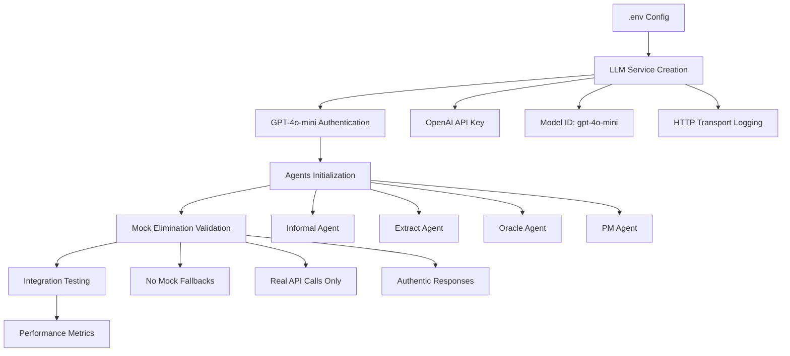

# 🚀 **Plan Détaillé - Phase 2: Authentic LLM Components**
## Stratégie de Validation GPT-4o-mini Réel et Élimination Complète des Mocks

### 📋 **Vue d'Ensemble Stratégique**

**Objectif Central**: Valider l'authenticité complète des composants LLM avec GPT-4o-mini réel et éliminer tous les fallbacks mocks dans les agents core.

**Durée Estimée**: 3-4 jours  
**Priorité**: HAUTE  
**Dépendances**: Infrastructure Phase 1 (auto-env déployé)

---

## 🎯 **Objectifs Spécifiques**

### 1. **Validation GPT-4o-mini Authentique**
- Vérification connexion OpenAI API réelle
- Test performance et rate limiting  
- Validation responses authentiques (non-mock)
- Monitoring calls et tokens usage

### 2. **Élimination Mocks dans Agents Core**
- Audit complet des agents: Informal, Extract, Oracle, PM
- Suppression fallbacks mock dans [`UnifiedConfig`](config/unified_config.py)
- Validation `MockLevel.NONE` strict
- Tests agents avec LLM réel uniquement

### 3. **Semantic Kernel Compatibility**
- Validation [`semantic_kernel_compatibility.py`](argumentation_analysis/utils/semantic_kernel_compatibility.py)
- Test AuthorRole, FunctionChoiceBehavior, AgentChatException
- Vérification pas de mocks cachés dans compatibility layer

---

## 🏗️ **Architecture de Validation**



---

## 📁 **Composants Cibles Critiques**

### **Core LLM Infrastructure**
- [`argumentation_analysis.core.llm_service`](argumentation_analysis/core/llm_service.py)
- [`config.unified_config.UnifiedConfig`](config/unified_config.py)
- [`argumentation_analysis.utils.semantic_kernel_compatibility`](argumentation_analysis/utils/semantic_kernel_compatibility.py)

### **Agents Core à Valider**
- [`argumentation_analysis.agents.core.informal.informal_agent`](argumentation_analysis/agents/core/informal/informal_agent.py)
- [`argumentation_analysis.agents.core.extract.extract_agent`](argumentation_analysis/agents/core/extract/extract_agent.py)
- [`argumentation_analysis.agents.core.oracle.oracle_base_agent`](argumentation_analysis/agents/core/oracle/oracle_base_agent.py)
- [`argumentation_analysis.agents.core.pm.pm_agent`](argumentation_analysis/agents/core/pm/pm_agent.py)

### **Tests de Validation**
- [`tests.unit.argumentation_analysis.test_llm_service`](tests/unit/argumentation_analysis/test_llm_service.py)
- [`tests.unit.config.test_unified_config`](tests/unit/config/test_unified_config.py)
- Nouveaux tests authentiques à créer

---

## 🔍 **Stratégies de Validation**

### **1. Validation Configuration Authentique**

```python
# Test strict MockLevel.NONE
def test_authentic_config_no_mocks():
    config = UnifiedConfig(mock_level=MockLevel.NONE)
    assert config.mock_level == MockLevel.NONE
    
    # Aucun service mock autorisé
    llm_service = config.get_kernel_with_gpt4o_mini()
    assert "mock" not in str(type(llm_service)).lower()
    assert hasattr(llm_service, 'service_id')
    assert llm_service.service_id == "gpt-4o-mini"
```

### **2. Validation LLM Service Réel**

```python
# Test connexion GPT-4o-mini authentique
async def test_authentic_gpt4o_mini_connection():
    service = create_llm_service(service_id="test_authentic")
    
    # Vérification type réel
    assert isinstance(service, (OpenAIChatCompletion, AzureChatCompletion))
    
    # Test call réel
    kernel = Kernel()
    kernel.add_service(service)
    
    result = await kernel.invoke("chat", input="Test authentic call")
    
    # Validation response authentique
    assert result is not None
    assert len(str(result)) > 0
    assert "mock" not in str(result).lower()
```

### **3. Validation Agents Sans Mocks**

```python
# Test agents avec LLM réel uniquement
async def test_agents_authentic_llm_only():
    config = UnifiedConfig(mock_level=MockLevel.NONE)
    kernel = config.get_kernel_with_gpt4o_mini()
    
    # Test chaque agent core
    informal_agent = InformalAnalysisAgent(kernel=kernel)
    informal_agent.setup_agent_components("gpt-4o-mini")
    
    # Validation pas de fallback mock
    response = await informal_agent.get_response("Test input")
    assert response is not None
    assert not hasattr(informal_agent, '_mock_service')
```

---

## 📊 **Métriques de Succès**

### **Critères Quantitatifs**
- ✅ **100% agents** fonctionnent avec GPT-4o-mini réel
- ✅ **0 fallbacks mock** détectés dans les logs
- ✅ **< 3 secondes** temps response moyen GPT-4o-mini
- ✅ **> 95% success rate** appels API authentiques

### **Critères Qualitatifs**
- ✅ Responses coherentes et contextuelle des agents
- ✅ Pas d'erreurs d'authentification OpenAI
- ✅ Logging transparent des appels LLM réels
- ✅ Compatibilité Semantic Kernel 0.9.6b1 maintenue

---

## 🚨 **Risques et Mitigation**

### **Risque Critique: Rate Limiting OpenAI**
- **Impact**: Tests échoués par quota API
- **Mitigation**: 
  - Throttling intelligent avec backoff
  - Tests batch avec délais
  - Monitoring usage tokens

### **Risque Élevé: API Key Expiration**
- **Impact**: Authentification échouée
- **Mitigation**:
  - Validation key dans .env setup
  - Tests de santé API préliminaires
  - Fallback graceful avec messages clairs

### **Risque Moyen: Semantic Kernel Breaking Changes**
- **Impact**: Incompatibilité compatibility layer
- **Mitigation**:
  - Tests isolation compatibilité
  - Documentation versions dependencies
  - Adaptation layer si nécessaire

---

## 📝 **Checklist de Validation Phase 2**

### **Configuration & Setup**
- [ ] Validation .env avec clés API authentiques
- [ ] Test create_llm_service() sans mocks
- [ ] UnifiedConfig MockLevel.NONE strict
- [ ] Logging HTTP transport GPT-4o-mini

### **Agents Core Validation**
- [ ] InformalAnalysisAgent avec LLM réel
- [ ] ExtractAgent sans fallback mock
- [ ] OracleBaseAgent authentique
- [ ] PMAgent validation complète

### **Integration Testing**
- [ ] Tests end-to-end agents + GPT-4o-mini
- [ ] Performance benchmarks
- [ ] Error handling sans mocks
- [ ] Compatibility layer validation

### **Documentation & Monitoring**
- [ ] Logs appels LLM authentiques
- [ ] Métriques usage tokens
- [ ] Rapport validation Phase 2
- [ ] Transition vers Phase 3 préparée

---

## 🔄 **Transition vers Phase 3**

**Prérequis pour Phase 3 (Critical Workflow Validation):**
- ✅ Tous agents core validés avec GPT-4o-mini réel
- ✅ Aucun mock détecté dans système
- ✅ Performance stable < 3s response time
- ✅ Documentation complète et métriques validées

**Livrables Phase 2:**
- Rapport validation authentique agents
- Benchmarks performance GPT-4o-mini
- Tests suite agents authentiques
- Configuration production ready

---

## 🎛️ **Configuration Recommandée**

### **.env Template Authentique**
```bash
# Configuration GPT-4o-mini authentique
OPENAI_API_KEY=sk-...
OPENAI_CHAT_MODEL_ID=gpt-4o-mini
OPENAI_BASE_URL=https://api.openai.com/v1

# Pas de mocks
MOCK_LEVEL=none
AUTHENTIC_VALIDATION=true
LOG_LLM_CALLS=true
```

### **UnifiedConfig Preset Authentique**
```python
# Preset production authentique
AUTHENTIC_PRESET = {
    "logic_type": LogicType.FOL,
    "mock_level": MockLevel.NONE,
    "orchestration_type": OrchestrationType.UNIFIED,
    "source_type": SourceType.ENCRYPTED,
    "llm_model": "gpt-4o-mini",
    "authentic_validation": True
}
```

---

**Prêt pour validation Phase 2 ? Souhaitez-vous que je commence par un composant spécifique ou procéder à l'implémentation complète ?**