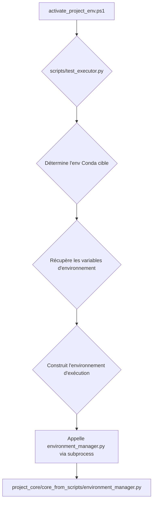

# Nouvelle Architecture d'Exécution des Tests

Ce document de conception décrit une nouvelle architecture pour l'exécution des tests, conçue pour contourner les limitations de `conda run` sous Windows sans modifier le code de production existant (`environment_manager.py`).

## 1. Problématique

L'utilisation de `conda run` à partir de PowerShell pour exécuter des commandes dans un environnement Conda spécifique est défaillante et provoque une erreur fatale `Fatal Python error: init_fs_encoding`. Cette erreur est due à une mauvaise construction de l'environnement d'exécution par `conda run`, qui ne parvient pas à localiser les bibliothèques internes de Python. Toutes les tentatives de correction directe ont échoué.

## 2. Architecture Proposée

L'architecture proposée introduit un script "pont" en Python (`scripts/test_executor.py`) qui agit comme un intermédiaire intelligent entre le script d'activation PowerShell et le gestionnaire d'environnement Python existant.

### Diagramme de Flux



### Responsabilités des Composants

1.  **`activate_project_env.ps1` (Modifié)**
    *   **Responsabilité unique :** Lancer le nouveau script `test_executor.py`.
    *   N'essaie plus d'activer ou d'exécuter des commandes directement avec `conda run`.
    *   **Commande d'appel :**
        ```powershell
        python scripts/test_executor.py --original-command "pytest -m jvm_test"
        ```

2.  **`scripts/test_executor.py` (Nouveau)**
    *   **Chef d'orchestre :** C'est le cœur de la nouvelle architecture.
    *   **Responsabilités :**
        a.  **Déterminer l'environnement cible :** Lit le fichier `environment.yml` pour connaître le nom de l'environnement Conda (`e2e_test_env`).
        b.  **Exporter les variables d'environnement :** Exécute `conda env export -n e2e_test_env` pour obtenir une liste des dépendances et potentiellement des variables d'environnement de l'environnement cible. Une autre approche pourrait être `conda run -n e2e_test_env python -c "import os; print(os.environ)"` pour capturer l'environnement.
        c.  **Construire l'environnement d'exécution :** Parse la sortie de la commande précédente pour construire un dictionnaire `env` compatible avec `subprocess.run`. Ce dictionnaire contiendra les `PATH`, `PYTHONPATH`, et autres variables essentielles de l'environnement cible.
        d.  **Exécuter la commande :** Appelle la fonction cible dans `project_core/core_from_scripts/environment_manager.py` en utilisant `subprocess.run`. Il passe la commande originale (`pytest...`) et le dictionnaire `env` nouvellement construit.

3.  **`project_core/core_from_scripts/environment_manager.py` (Inchangé)**
    *   **Continue son rôle :** Exécute la logique de test comme auparavant.
    *   **Avantage :** Il reçoit un environnement d'exécution déjà configuré et correct, ignorant complètement la complexité de Conda. Il n'y a aucune régression ou modification de son comportement.

## 3. Avantages de l'Approche

*   **Isolation :** Le problème `conda run` est contenu et géré par le `test_executor.py`, sans impacter le reste du code.
*   **Non-régression :** `environment_manager.py` n'est pas modifié, ce qui élimine le risque d'introduire de nouveaux bugs dans la logique métier existante.
*   **Testabilité :** Le `test_executor.py` peut être testé unitairement de manière indépendante.
*   **Robustesse :** La construction explicite de l'environnement d'exécution est plus fiable que de dépendre du comportement interne et bogué de `conda run`.
*   **Clarté :** Sépare la préoccupation de la "construction de l'environnement" de celle de "l'exécution des tests".