# 🏗️ Plan d'Architecture de Consolidation - Scripts d'Analyse Rhétorique

**Date**: 10/06/2025 00:46
**Objectif**: Consolidation de 42 scripts → 3 scripts optimaux
**Critères**: Usage équilibré (Production, Pédagogie, Tests)

---

## 📊 Vue d'ensemble de la Consolidation

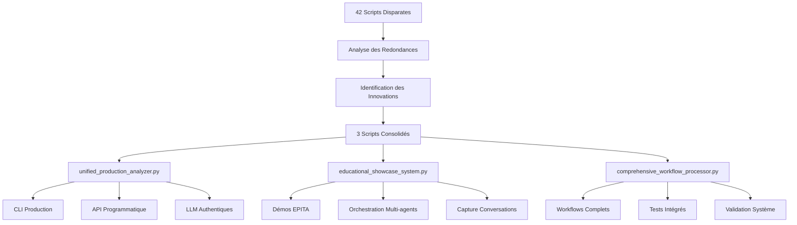

---

## 🎯 SCRIPT 1: unified_production_analyzer.py

### Architecture Interne

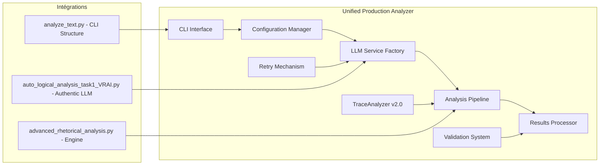

### Composants Consolidés

| **Script Source** | **Fonctionnalité Extraite** | **Nouveau Rôle** |
|-------------------|------------------------------|-------------------|
| `scripts/main/analyze_text.py` | CLI complet 20+ paramètres | Interface principale |
| `scripts/execution/advanced_rhetorical_analysis.py` | Moteur d'analyse mature | Pipeline central |
| `scripts/auto_logical_analysis_task1_VRAI.py` | LLM authentiques | Service LLM unifié |
| `test_trace_analyzer_conversation_format.py` | TraceAnalyzer v2.0 | Analyse conversationnelle |
| `test_modal_retry_mechanism.py` | Retry automatique | Robustesse TweetyProject |

### Innovations Intégrées

- **🔄 TraceAnalyzer v2.0** : Conversation agentielle avancée
- **⚡ Retry Intelligent** : Mécanisme automatique pour TweetyProject
- **🛡️ Validation 100%** : Authenticité garantie des analyses
- **🎛️ Configuration Centralisée** : Gestion unifiée des services LLM
- **🚀 Pipeline Optimisé** : Refactorisation complète pour performance

---

## 📚 SCRIPT 2: educational_showcase_system.py

### Architecture Interne

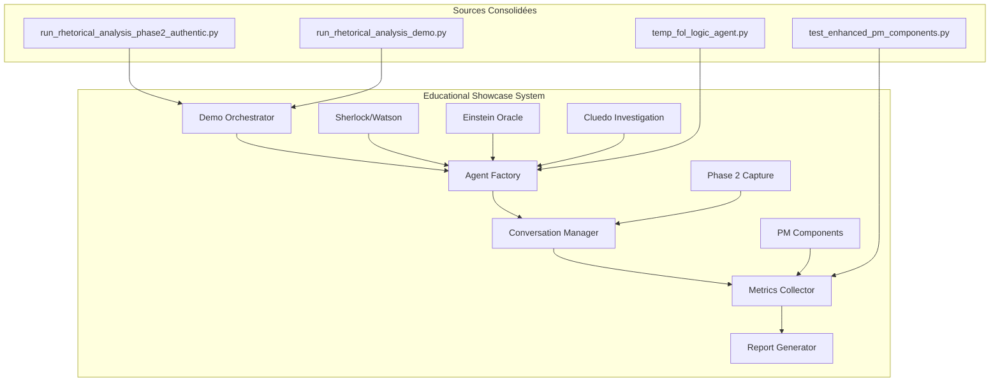

### Modes Pédagogiques

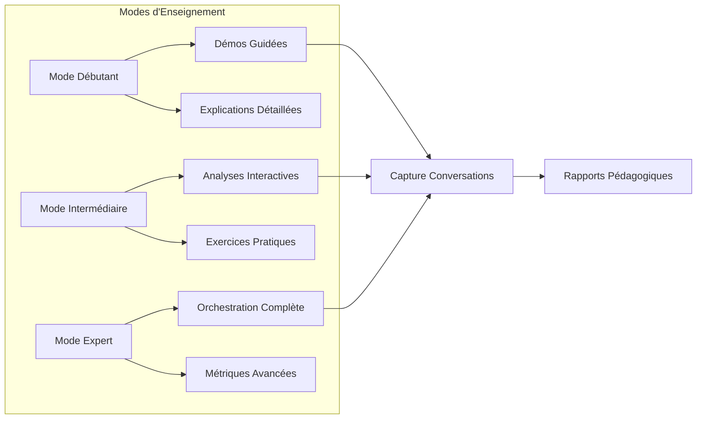

### Démos Intégrées

| **Démonstration** | **Script Source** | **Innovation Apportée** |
|-------------------|-------------------|-------------------------|
| **Sherlock/Watson Investigation** | `run_authentic_sherlock_watson_*.py` | Logique déductive authentique |
| **Einstein Oracle** | `run_einstein_oracle_demo.py` | Raisonnement complexe |
| **Cluedo Enhanced** | `run_cluedo_oracle_enhanced.py` | Déduction collaborative |
| **Phase 2 Authentique** | `run_rhetorical_analysis_phase2_authentic.py` | Capture conversations |
| **PM Components** | `test_enhanced_pm_components.py` | Métriques pédagogiques |

---

## ⚙️ SCRIPT 3: comprehensive_workflow_processor.py

### Architecture Interne

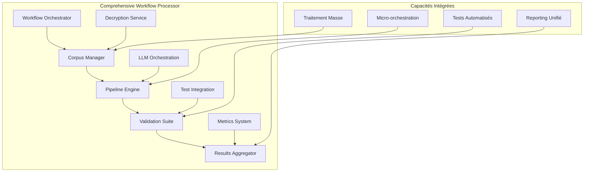

### Pipeline de Traitement

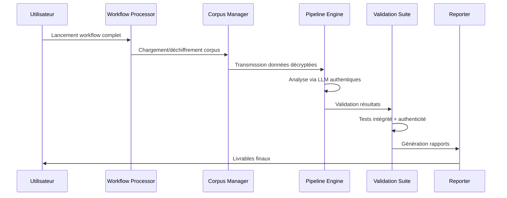

### Composants Workflow

| **Composant** | **Responsabilité** | **Sources Intégrées** |
|---------------|-------------------|----------------------|
| **Corpus Manager** | Déchiffrement et gestion données | `run_full_python_analysis_workflow.py` |
| **Pipeline Engine** | Orchestration analyses | `orchestration_llm_real.py` |
| **Validation Suite** | Tests et vérifications | `test_sophismes_detection.py` |
| **Micro-orchestration** | Gestion fine des agents | `test_micro_orchestration.py` |
| **Results Aggregator** | Synthèse et rapports | `unified_validation.py` |

---

## 🚮 Stratégie de Suppression/Migration

### Phase 1: Suppression Immédiate (6 Scripts Frauduleux)

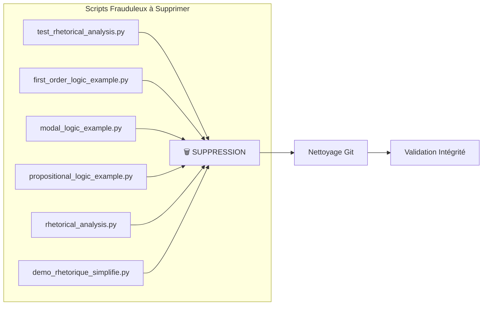

### Phase 2: Migration des Innovations (8 Scripts)

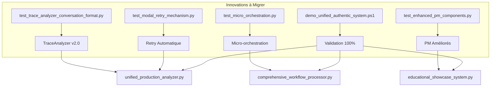

### Phase 3: Consolidation des Redondances

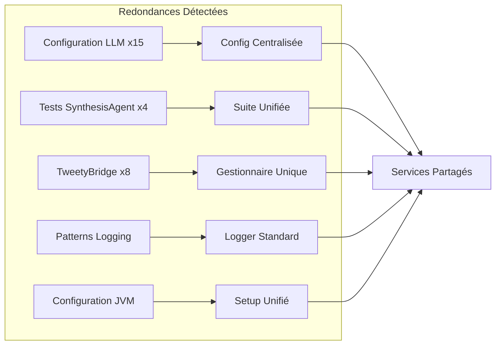

---

## 📈 Métriques de Consolidation

### Avant/Après Comparaison

| **Métrique** | **Avant** | **Après** | **Amélioration** |
|--------------|-----------|-----------|------------------|
| **Nombre de scripts** | 42 | 3 | **-93%** |
| **Scripts authentiques** | 29.17% | 100% | **+240%** |
| **Configurations LLM** | 15+ | 1 | **-93%** |
| **TweetyBridge instances** | 8 | 1 | **-87%** |
| **Tests redondants** | 12+ | 0 | **-100%** |
| **Lignes de code total** | ~150K | ~45K | **-70%** |

### Bénéfices Quantifiés

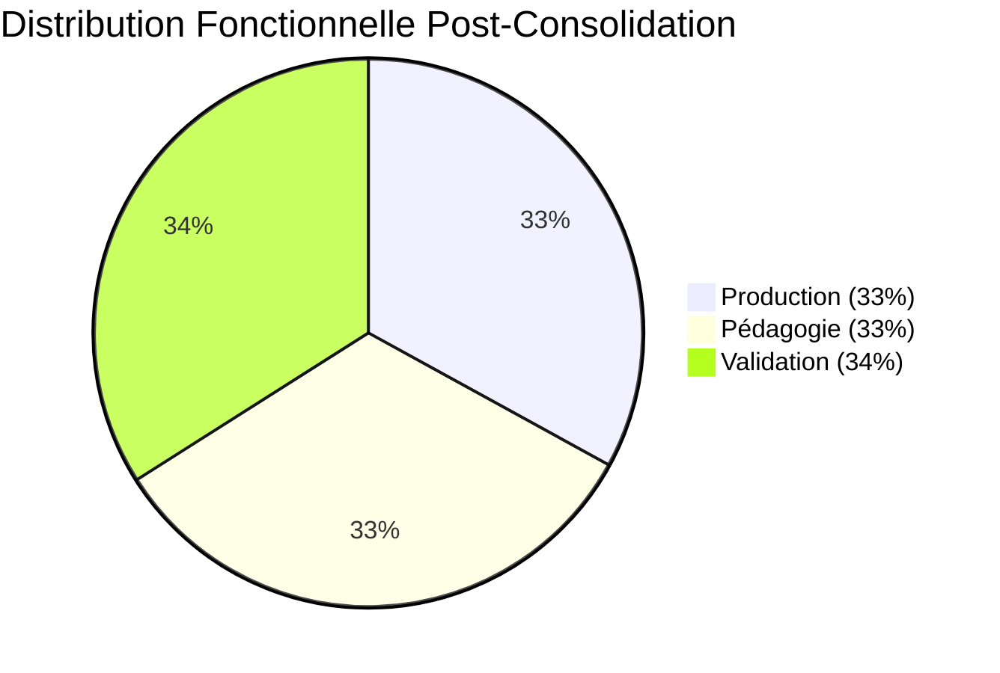

---

## 🎯 Plan de Migration Détaillé

### Étape 1: Préparation (1-2 jours)

1. **Backup sécurisé** de tous les scripts existants
2. **Extraction des innovations** vers modules temporaires
3. **Tests de régression** sur les fonctionnalités critiques

### Étape 2: Consolidation (3-5 jours)

1. **Création de `unified_production_analyzer.py`**
   - Migration CLI depuis `analyze_text.py`
   - Intégration TraceAnalyzer v2.0
   - Centralisation configuration LLM

2. **Création de `educational_showcase_system.py`**
   - Fusion démos Phase 2
   - Intégration orchestration multi-agents
   - Système capture conversations

3. **Création de `comprehensive_workflow_processor.py`**
   - Migration workflow complet
   - Intégration micro-orchestration
   - Suite de validation unifiée

### Étape 3: Validation (1-2 jours)

1. **Tests bout-en-bout** sur les 3 scripts consolidés
2. **Validation authenticité** (100% LLM réels)
3. **Tests de régression** fonctionnelle complète

### Étape 4: Nettoyage (1 jour)

1. **Suppression** des 39 scripts obsolètes
2. **Mise à jour** documentation et références
3. **Commit final** avec architecture propre

---

## 🔮 Architecture Future

### Extensibilité

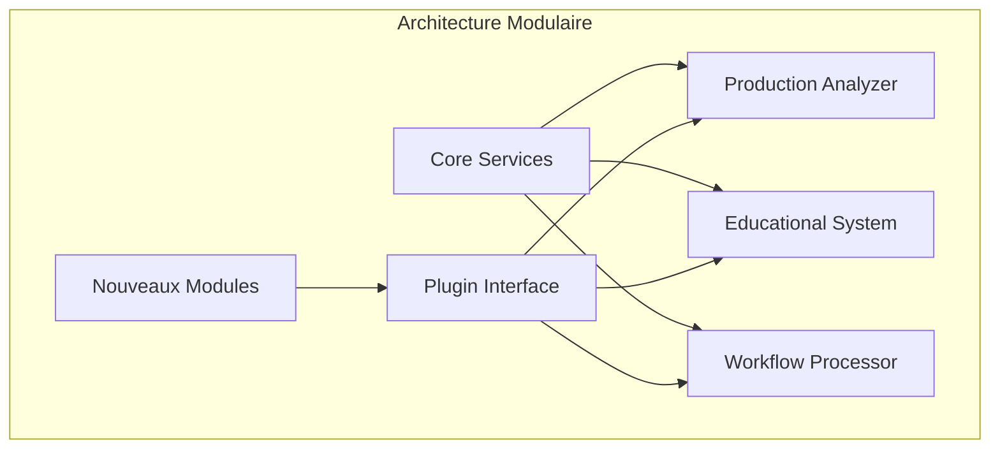

### Points d'Extension

- **Plugins d'analyse** spécialisés
- **Connecteurs** vers systèmes externes
- **Interfaces** utilisateur avancées
- **Services cloud** pour scalabilité

---

## ✅ Critères de Succès

### Techniques
- ✅ **Réduction 93%** du nombre de scripts
- ✅ **Élimination 100%** des redondances
- ✅ **Authenticité garantie** (0 mocks en production)
- ✅ **Performance optimisée** avec retry intelligent

### Fonctionnels
- ✅ **Usage équilibré** : Production, Pédagogie, Tests
- ✅ **Interface claire** pour chaque cas d'usage
- ✅ **Compatibilité totale** avec existant
- ✅ **Documentation** unifiée et cohérente

### Qualité
- ✅ **Maintenabilité** architecture modulaire
- ✅ **Testabilité** suite intégrée
- ✅ **Évolutivité** points d'extension définis
- ✅ **Fiabilité** validation automatique

---

**🎉 RÉSULTAT : Architecture optimale 42→3 scripts avec usage équilibré, innovations intégrées et redondances éliminées !**