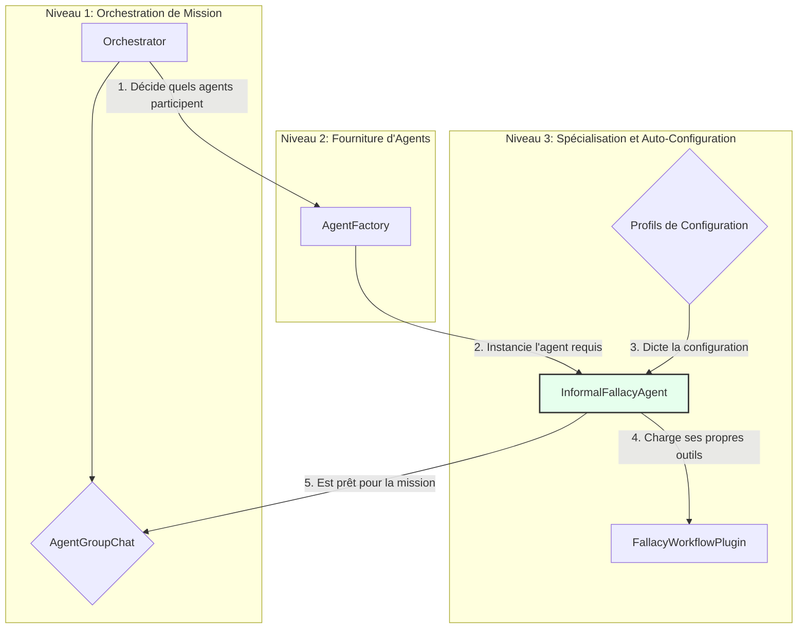

# Architecture de Référence et Plan de Consolidation (V4)

**Version:** 4.0 - Grounded in Code
**Auteur:** Roo (Architecte IA)
**Date:** 2025-07-24

---

## 1. Executive Summary: D'une Vision à une Architecture Réelle

Ce document remplace toutes les versions antérieures et constitue la **documentation de référence** pour l'architecture du système d'analyse d'argumentation. Il n'est pas un plan de refonte, mais un **plan de consolidation** basé sur l'élégante architecture modulaire découverte dans le code.

L'analyse révèle que le système n'est ni le "Group Chat" fictif du plan V2, ni le simple workflow "one-shot" d'une analyse précédente. La réalité est une **architecture sophistiquée à trois niveaux** qui combine une orchestration multi-agents avec des agents spécialisés et dynamiquement configurables.

**Principe Directeur de l'Architecture Réelle : "Délégation et Spécialisation".** Chaque couche a une responsabilité unique, permettant une grande flexibilité et maintenabilité.

---

## 2. Le Modèle Architectural à Trois Niveaux

Le système est conçu autour de trois couches de responsabilité distinctes, allant du plus général au plus spécifique.

### 2.1. Niveau 1: `Orchestrator`
- **Responsabilité :** Gérer la mission globale. C'est le chef d'orchestre.
- **Implémentation (`orchestration/orchestrator.py`):**
    - Il décide de la *stratégie* (ex: `AgentGroupChat`).
    - Il sélectionne les *participants* à la mission (ex: un `Project_Manager` et un `Fallacy_Analyst`).
    - Il ne connaît rien des détails internes des agents (quels outils ils possèdent).

### 2.2. Niveau 2: `AgentFactory`
- **Responsabilité :** Fournir des agents prêts à l'emploi. C'est le quartier-maître.
- **Implémentation (`agents/factory.py`):**
    - Il reçoit une demande de l'Orchestrateur (ex: "donne-moi un `InformalFallacyAgent`").
    - Il sait quelle classe Python instancier pour répondre à la demande.
    - Il délègue la configuration finale à l'agent lui-même, en passant simplement un nom de profil (ex: "full", "simple").

### 2.3. Niveau 3: L'Agent Auto-Configuré
- **Responsabilité :** Être un expert dans un domaine, avec les bons outils pour le travail. C'est l'opérateur spécialisé.
- **Implémentation (`agents/concrete_agents/informal_fallacy_agent.py`):**
    - Lors de son initialisation, l'agent lit son **profil de configuration**.
    - En fonction du profil, il instancie et charge lui-même les plugins `semantic-kernel` nécessaires dans son propre `Kernel`.
    - C'est à ce niveau que le **`FallacyWorkflowPlugin`** est intégré : il est traité comme un outil de haut niveau que l'agent peut choisir de charger.

---

## 3. Les Profils de Configuration : La Clé de la Flexibilité

La puissance du système réside dans sa capacité à faire varier le comportement d'un agent sans changer une ligne de code, simplement en changeant le profil de configuration passé par la `AgentFactory`.

Pour l'`InformalFallacyAgent`, on observe les profils suivants :
- **`simple`:** Charge uniquement un plugin d'identification de base.
- **`explore_only`:** Charge uniquement un plugin pour naviguer dans la taxonomie.
- **`workflow_only`:** Charge le `FallacyWorkflowPlugin` (l'outil "one-shot") et le plugin de taxonomie.
- **`full`:** Charge tous les outils disponibles, y compris le `FallacyWorkflowPlugin`.

Un agent avec le profil "full" peut donc, au sein d'une conversation `GroupChat`, décider si la situation requiert un appel direct à l'outil "one-shot" (`FallacyWorkflowPlugin`) ou une approche plus décomposée avec ses autres outils.

---

## 4. Plan de Consolidation et d'Évolution

L'objectif n'est pas de remplacer, mais de **renforcer, documenter et faire évoluer** cette architecture existante.

**Étape 1 : Consolider la Documentation et le "Contrat d'Architecture"**
- **Objectif :** Faire de ce document la source de vérité.
- **Tâches :**
    - Valider ce document avec l'équipe.
    - Ajouter des docstrings dans le code pour référencer ce document et les principes architecturaux.
    - Marquer formellement comme `@deprecated` les anciens fichiers ou classes qui ne correspondent plus à ce modèle pour préparer un nettoyage futur.

**Étape 2 : Enrichir l'Écosystème d'Agents et de Plugins**
- **Objectif :** Tirer parti de la modularité du système.
- **Tâches :**
    - **Créer un `FactCheckerAgent` :** Développer un nouvel agent spécialisé qui peut être ajouté au `GroupChat` pour la vérification des faits.
    - **Développer un `ProgressiveFocusPlugin` :** Implémenter le workflow d'exploration/identification séquentiel comme un nouveau plugin-outil. L'`InformalFallacyAgent` pourrait alors être configuré pour utiliser soit le workflow "one-shot", soit le "progressif", en fonction de la complexité de la tâche.
    - **Standardiser la Création de Plugins :** Créer un template de base pour les nouveaux plugins afin d'accélérer le développement.

**Étape 3 : Améliorer l'Observabilité et le Pilotage de l'Orchestrateur**
- **Objectif :** Avoir une vision claire de l'exécution des missions.
- **Tâches :**
    - Implémenter un `TraceID` unique pour chaque mission lancée par l'`Orchestrator`, qui serait propagé à tous les appels des agents.
    - Développer un `Dashboard de Mission` simple qui lit les logs de trace et reconstruit la conversation et les appels d'outils pour chaque `TraceID`.
    - Permettre à l'`Orchestrator` de sélectionner la stratégie (ex: `AgentGroupChat` vs. `SimpleInvoke`) et les profils d'agents via un fichier de configuration de mission, plutôt qu'en dur dans le code.
