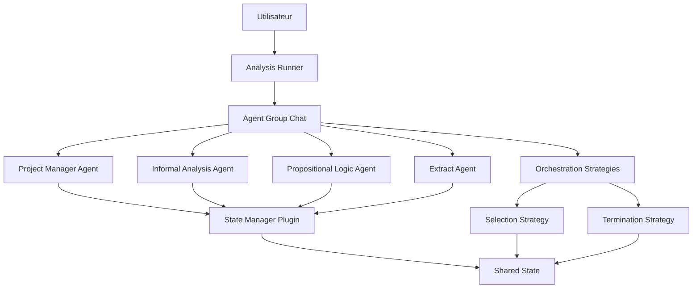
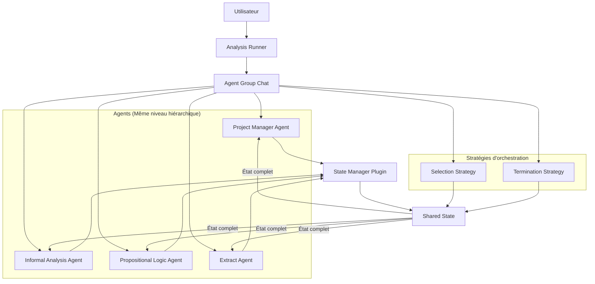
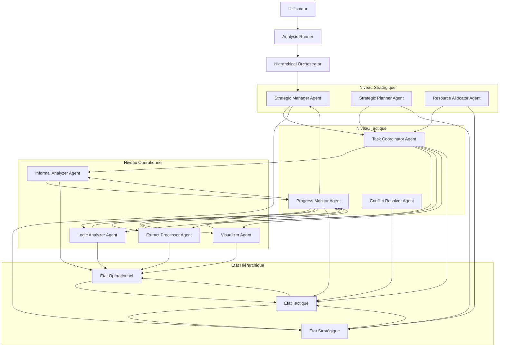
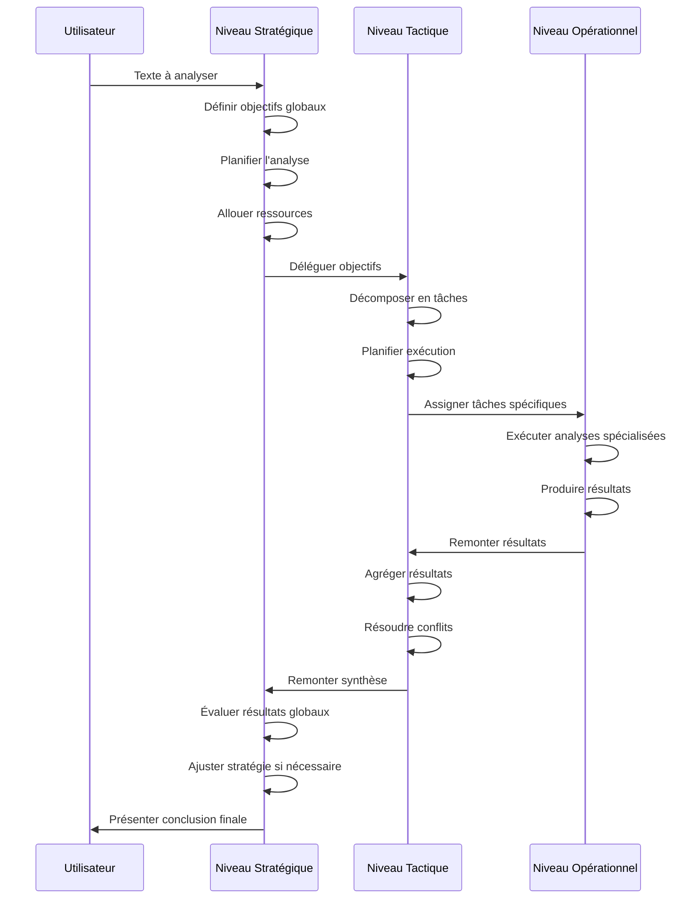

# Analyse de l'Architecture d'Orchestration Actuelle

## 1. Introduction et contexte

### Présentation du système d'analyse rhétorique

Le système d'analyse rhétorique est une application collaborative multi-agents conçue pour analyser des textes sous différents angles. Il utilise plusieurs agents IA spécialisés qui collaborent pour identifier des arguments, détecter des sophismes, et effectuer des analyses logiques formelles. Le système est construit sur le framework Semantic Kernel et utilise une approche d'orchestration basée sur la modification d'un état partagé et la désignation explicite des agents.

### Objectif de la refonte vers une architecture hiérarchique à trois niveaux

L'objectif de la refonte est d'implémenter une architecture hiérarchique à trois niveaux (stratégique, tactique, opérationnel) pour améliorer la scalabilité, la modularité et l'efficacité du système. Cette nouvelle architecture vise à:
- Séparer clairement les responsabilités entre les différents niveaux de décision
- Améliorer la coordination entre les agents
- Faciliter l'ajout de nouveaux agents et fonctionnalités
- Optimiser la gestion des ressources et la planification des tâches

### Méthodologie d'analyse utilisée

Pour cette analyse, nous avons examiné en détail les fichiers clés de l'architecture d'orchestration actuelle:
- `argumentiation_analysis/orchestration/README.md`
- `argumentiation_analysis/orchestration/analysis_runner.py`
- `argumentiation_analysis/core/README.md`
- `argumentiation_analysis/core/shared_state.py`
- `argumentiation_analysis/core/state_manager_plugin.py`
- `argumentiation_analysis/core/strategies.py`
- `argumentiation_analysis/README.md`

Cette analyse se concentre sur la structure actuelle, les composants principaux, les mécanismes d'interaction entre agents, et les limitations identifiées qui justifient une refonte vers une architecture hiérarchique.

## 2. Architecture d'orchestration actuelle

### 2.1 Vue d'ensemble

#### Structure générale du système d'orchestration

L'architecture d'orchestration actuelle est centrée autour d'un modèle de conversation collaborative entre agents, où chaque agent est au même niveau hiérarchique. Le système utilise une approche d'état partagé, où tous les agents peuvent lire et modifier un état commun qui représente l'analyse en cours.

#### Rôle du framework Semantic Kernel

Le système utilise Semantic Kernel comme framework d'orchestration principal. Ce framework fournit:
- La structure `AgentGroupChat` pour gérer la conversation entre agents
- Le mécanisme de plugins pour exposer des fonctions aux agents
- Le système de stratégies pour contrôler le flux de la conversation
- L'intégration avec les services LLM (OpenAI ou Azure)

#### Flux d'exécution principal

Le flux d'exécution principal, défini dans `analysis_runner.py`, suit ces étapes:
1. Création d'une instance d'état locale (`RhetoricalAnalysisState`)
2. Création d'une instance de plugin de gestion d'état (`StateManagerPlugin`)
3. Configuration d'un kernel Semantic Kernel local avec le service LLM
4. Configuration des plugins des agents sur le kernel
5. Création des instances d'agents (`ChatCompletionAgent`)
6. Création des stratégies d'orchestration (terminaison et sélection)
7. Création d'une instance `AgentGroupChat` avec les agents et stratégies
8. Initialisation de l'historique avec un message utilisateur contenant le texte à analyser
9. Exécution de la boucle d'invocation qui gère les tours de conversation
10. Affichage de l'historique détaillé et de l'état final à la fin de l'analyse

### 2.2 Composants principaux

#### État partagé (`RhetoricalAnalysisState`)

L'état partagé est le composant central qui stocke toutes les données de l'analyse:
- `raw_text`: Le texte brut à analyser
- `analysis_tasks`: Les tâches d'analyse définies
- `identified_arguments`: Les arguments identifiés dans le texte
- `identified_fallacies`: Les sophismes détectés
- `belief_sets`: Les ensembles de croyances formels (logique propositionnelle)
- `query_log`: Les logs des requêtes formelles
- `answers`: Les réponses des agents aux tâches
- `extracts`: Les extraits de texte
- `errors`: Les erreurs rencontrées
- `final_conclusion`: La conclusion finale de l'analyse
- `_next_agent_designated`: Le nom de l'agent désigné pour le prochain tour

La classe fournit des méthodes pour ajouter, modifier et récupérer ces éléments, ainsi que pour sérialiser l'état en JSON.

#### Plugin de gestion d'état (`StateManagerPlugin`)

Le `StateManagerPlugin` est un plugin Semantic Kernel qui encapsule l'état partagé et expose des fonctions kernel aux agents:
- `get_current_state_snapshot`: Récupère un aperçu de l'état actuel
- `add_analysis_task`: Ajoute une tâche d'analyse
- `add_identified_argument`: Ajoute un argument identifié
- `add_identified_fallacy`: Ajoute un sophisme identifié
- `add_belief_set`: Ajoute un ensemble de croyances formel
- `log_query_result`: Enregistre une requête formelle et son résultat
- `add_answer`: Ajoute une réponse à une tâche
- `set_final_conclusion`: Enregistre la conclusion finale
- `designate_next_agent`: Désigne l'agent qui doit parler au prochain tour

Ce plugin assure que les modifications de l'état sont contrôlées et traçables.

#### Stratégies d'orchestration

Deux stratégies principales sont utilisées pour l'orchestration:

1. **SimpleTerminationStrategy**: Détermine quand la conversation doit se terminer
   - Arrête la conversation si une conclusion finale est présente dans l'état
   - Arrête la conversation si un nombre maximum de tours est atteint

2. **BalancedParticipationStrategy**: Sélectionne le prochain agent à parler
   - Priorise la désignation explicite via `_next_agent_designated` dans l'état
   - Équilibre la participation des agents en fonction de cibles de participation
   - Utilise un système de budget de déséquilibre pour favoriser les agents sous-représentés
   - Retourne par défaut au `ProjectManagerAgent` si aucune désignation n'est présente

#### Agents spécialisés et leurs rôles

Le système utilise quatre agents spécialisés:

1. **ProjectManagerAgent**: Coordonne l'analyse, définit les tâches et synthétise les résultats
2. **InformalAnalysisAgent**: Identifie les arguments et sophismes informels
3. **PropositionalLogicAgent**: Effectue des analyses formelles en logique propositionnelle
4. **ExtractAgent**: Extrait et analyse des portions spécifiques du texte

Chaque agent a ses propres instructions et plugins spécifiques qui sont configurés sur le kernel local.

#### Runner d'analyse (`analysis_runner.py`)

Le runner d'analyse est le point d'entrée principal pour l'exécution de l'analyse. Il:
- Crée et configure tous les composants nécessaires
- Gère la boucle d'invocation de `AgentGroupChat`
- Affiche les messages et appels d'outils pendant la conversation
- Gère les erreurs et exceptions
- Affiche l'historique détaillé et l'état final à la fin de l'analyse

### 2.3 Mécanismes d'interaction entre agents

#### Désignation explicite du prochain agent

Le mécanisme principal d'interaction entre agents est la désignation explicite du prochain agent à parler:
- Un agent peut appeler la fonction `designate_next_agent` pour indiquer quel agent devrait parler ensuite
- Cette désignation est stockée dans l'état partagé (`_next_agent_designated`)
- La stratégie de sélection (`BalancedParticipationStrategy`) consulte cette désignation pour déterminer le prochain agent
- Si aucune désignation n'est présente, la stratégie utilise ses propres règles pour sélectionner un agent

Ce mécanisme permet une forme de coordination directe entre les agents.

#### Partage d'état et modification collaborative

Les agents interagissent indirectement via l'état partagé:
- Chaque agent peut lire l'état complet via `get_current_state_snapshot`
- Les agents peuvent ajouter des tâches, arguments, sophismes, etc. à l'état
- Les modifications de l'état sont visibles par tous les agents
- Les agents peuvent construire sur le travail des autres en consultant l'état

Cette approche permet une collaboration asynchrone où les agents peuvent voir et utiliser les contributions des autres.

#### Équilibrage de participation

La stratégie `BalancedParticipationStrategy` assure que tous les agents participent de manière équilibrée à la conversation:
- Elle maintient des compteurs de participation pour chaque agent
- Elle calcule des scores de priorité basés sur l'écart par rapport aux cibles de participation
- Elle favorise les agents qui n'ont pas parlé récemment
- Elle ajuste les budgets de déséquilibre après les désignations explicites

Ce mécanisme évite qu'un seul agent domine la conversation et assure une diversité de perspectives dans l'analyse.

## 3. Analyse des limitations actuelles

### 3.1 Limitations structurelles

#### Architecture plate sans hiérarchie claire

L'architecture actuelle place tous les agents au même niveau hiérarchique, sans distinction claire entre les rôles stratégiques, tactiques et opérationnels:
- Tous les agents ont le même accès à l'état partagé
- Il n'y a pas de séparation formelle des responsabilités
- Le `ProjectManagerAgent` joue un rôle de coordination mais n'a pas d'autorité structurelle sur les autres agents

Cette structure plate limite la capacité du système à gérer des analyses complexes nécessitant plusieurs niveaux de décision et d'exécution.

#### Absence de séparation des préoccupations entre niveaux

Le système ne sépare pas clairement les différentes préoccupations:
- La planification stratégique (que faut-il analyser et pourquoi)
- La coordination tactique (comment organiser l'analyse)
- L'exécution opérationnelle (comment effectuer des analyses spécifiques)

Cette absence de séparation rend le système moins modulaire et plus difficile à maintenir et à faire évoluer.

#### Manque de modularité dans la prise de décision

Les décisions sont prises de manière ad hoc par les agents sans cadre structuré:
- Pas de mécanisme formel pour décomposer des problèmes complexes
- Pas de hiérarchie claire pour la résolution de conflits
- Pas de séparation entre les décisions à long terme et les actions immédiates

### 3.2 Limitations fonctionnelles

#### Coordination limitée entre agents

La coordination entre agents repose principalement sur la désignation explicite du prochain agent et le partage d'état:
- Pas de mécanisme sophistiqué de planification collaborative
- Pas de protocole structuré pour la délégation de tâches
- Pas de mécanisme formel pour la résolution de conflits
- Communication limitée à la désignation du prochain agent

#### Absence de planification stratégique

Le système manque de capacités de planification stratégique:
- Pas de vision à long terme de l'analyse
- Pas de décomposition hiérarchique des objectifs
- Pas d'allocation optimale des ressources
- Pas de priorisation formelle des tâches

#### Manque de mécanismes de délégation sophistiqués

Les mécanismes de délégation sont limités:
- Un agent peut seulement désigner le prochain agent à parler
- Pas de structure pour déléguer des tâches complexes
- Pas de suivi formel de l'exécution des tâches déléguées
- Pas de mécanisme pour agréger les résultats de tâches déléguées

#### Gestion d'état non hiérarchique

L'état partagé est monolithique et accessible à tous les agents:
- Pas de partitionnement de l'état par niveau de responsabilité
- Pas d'isolation des préoccupations
- Pas de contrôle d'accès basé sur les rôles
- Risque de conflits et d'incohérences dans les modifications de l'état

### 3.3 Limitations techniques

#### Scalabilité limitée avec l'augmentation du nombre d'agents

L'architecture actuelle ne scale pas bien avec l'ajout de nouveaux agents:
- La complexité de coordination augmente de manière quadratique
- L'état partagé devient plus difficile à gérer
- Les stratégies d'orchestration deviennent moins efficaces
- Le risque de conflits et d'incohérences augmente

#### Difficultés potentielles pour intégrer des agents avec des capacités très différentes

L'architecture plate rend difficile l'intégration d'agents avec des capacités très différentes:
- Pas de mécanisme pour adapter la communication aux capacités des agents
- Pas de structure pour combiner des agents de différents niveaux d'abstraction
- Difficultés pour intégrer des agents avec des temporalités différentes
- Manque de flexibilité pour des agents spécialisés dans des domaines très spécifiques

#### Complexité de maintenance et d'évolution

L'architecture actuelle présente des défis pour la maintenance et l'évolution:
- Couplage fort entre les agents et l'état partagé
- Difficultés pour modifier les stratégies d'orchestration
- Complexité pour ajouter de nouveaux types d'agents
- Manque de modularité pour faire évoluer le système

## 4. Points d'amélioration pour une architecture à trois niveaux

### 4.1 Niveau stratégique

Le niveau stratégique serait responsable de la planification à haut niveau et de la définition des objectifs globaux:

#### Planification à long terme
- Définir la stratégie globale d'analyse
- Identifier les aspects clés à analyser
- Établir un plan d'analyse structuré
- Gérer les ressources sur l'ensemble de l'analyse

#### Définition d'objectifs globaux
- Formuler les objectifs principaux de l'analyse
- Définir les critères de succès
- Établir les priorités entre différents aspects de l'analyse
- Assurer la cohérence globale de l'analyse

#### Allocation de ressources
- Déterminer quels agents doivent être impliqués
- Allouer du temps et des ressources computationnelles
- Équilibrer les efforts entre différentes parties de l'analyse
- Optimiser l'utilisation des capacités des agents

### 4.2 Niveau tactique

Le niveau tactique serait responsable de la coordination et de la décomposition des objectifs en tâches concrètes:

#### Coordination entre agents
- Orchestrer les interactions entre agents opérationnels
- Résoudre les conflits et incohérences
- Assurer la communication efficace entre agents
- Synchroniser les activités des agents

#### Décomposition des objectifs en tâches
- Traduire les objectifs stratégiques en tâches concrètes
- Structurer les tâches de manière logique
- Définir les dépendances entre tâches
- Créer des plans d'exécution détaillés

#### Suivi de l'avancement
- Monitorer l'exécution des tâches
- Évaluer les résultats intermédiaires
- Ajuster les plans en fonction des progrès
- Remonter les informations importantes au niveau stratégique

### 4.3 Niveau opérationnel

Le niveau opérationnel serait responsable de l'exécution des tâches spécifiques:

#### Exécution des tâches spécifiques
- Analyser des aspects spécifiques du texte
- Appliquer des techniques d'analyse spécialisées
- Produire des résultats concrets
- Résoudre des problèmes techniques spécifiques

#### Spécialisation des agents
- Agents spécialisés dans l'analyse informelle
- Agents spécialisés dans la logique formelle
- Agents spécialisés dans l'extraction et le prétraitement
- Agents spécialisés dans la visualisation et la présentation

#### Remontée d'information
- Rapporter les résultats aux agents tactiques
- Signaler les problèmes et obstacles
- Fournir des métriques d'exécution
- Proposer des améliorations basées sur l'expérience opérationnelle

### 4.4 Mécanismes de communication inter-niveaux

Pour que l'architecture à trois niveaux fonctionne efficacement, des mécanismes de communication inter-niveaux sont nécessaires:

#### Délégation top-down
- Mécanismes formels pour déléguer des objectifs et tâches
- Transmission de contexte et contraintes
- Définition claire des attentes et critères de succès
- Allocation de ressources et priorités

#### Feedback bottom-up
- Remontée structurée des résultats
- Signalement des problèmes et blocages
- Suggestions d'amélioration
- Métriques de performance et d'efficacité

#### Partitionnement de l'état
- État stratégique pour les objectifs et ressources globales
- État tactique pour les plans et la coordination
- État opérationnel pour les résultats spécifiques
- Mécanismes de synchronisation entre les différents niveaux d'état

## 5. Diagrammes d'architecture

### Diagramme de l'architecture actuelle

### Diagramme de l'architecture proposée à trois niveaux

### Diagramme de flux d'information entre les niveaux

## 6. Conclusion et recommandations

### Synthèse des limitations identifiées

L'architecture d'orchestration actuelle présente plusieurs limitations importantes:

1. **Structure plate sans hiérarchie**: Tous les agents sont au même niveau, sans séparation claire des responsabilités.
2. **Coordination limitée**: La coordination repose principalement sur la désignation explicite du prochain agent.
3. **État monolithique**: L'état partagé est accessible à tous les agents sans partitionnement.
4. **Absence de planification stratégique**: Pas de mécanisme pour la planification à long terme et la décomposition hiérarchique des objectifs.
5. **Mécanismes de délégation limités**: Pas de structure formelle pour déléguer et suivre des tâches complexes.
6. **Scalabilité limitée**: L'architecture ne scale pas bien avec l'augmentation du nombre d'agents.

Ces limitations justifient une refonte vers une architecture hiérarchique à trois niveaux qui permettrait de mieux séparer les préoccupations et d'améliorer la coordination entre agents.

### Avantages attendus de l'architecture à trois niveaux

L'architecture hiérarchique à trois niveaux proposée offrirait plusieurs avantages:

1. **Séparation claire des responsabilités**: Chaque niveau a un rôle bien défini (stratégique, tactique, opérationnel).
2. **Meilleure coordination**: Mécanismes formels de délégation et de feedback entre niveaux.
3. **Scalabilité améliorée**: Possibilité d'ajouter des agents à chaque niveau sans augmenter la complexité de coordination.
4. **Modularité accrue**: Chaque niveau peut évoluer indépendamment des autres.
5. **Gestion d'état plus structurée**: Partitionnement de l'état par niveau de responsabilité.
6. **Planification sophistiquée**: Capacités de planification stratégique et de décomposition hiérarchique des objectifs.
7. **Spécialisation des agents**: Agents optimisés pour des rôles spécifiques à chaque niveau.

### Prochaines étapes recommandées pour la refonte

Pour mettre en œuvre cette refonte, nous recommandons les étapes suivantes:

1. **Conception détaillée de l'architecture hiérarchique**:
   - Définir précisément les responsabilités de chaque niveau
   - Concevoir les interfaces entre niveaux
   - Spécifier les mécanismes de communication inter-niveaux

2. **Refactorisation de l'état partagé**:
   - Partitionner l'état en composants stratégique, tactique et opérationnel
   - Définir les règles d'accès et de modification pour chaque niveau
   - Concevoir les mécanismes de synchronisation entre niveaux d'état

3. **Développement des agents stratégiques**:
   - Implémenter le Strategic Manager Agent
   - Développer les capacités de planification stratégique
   - Créer les mécanismes d'allocation de ressources

4. **Développement des agents tactiques**:
   - Implémenter le Task Coordinator Agent
   - Développer les capacités de suivi de progression
   - Créer les mécanismes de résolution de conflits

5. **Adaptation des agents opérationnels existants**:
   - Adapter les agents existants au nouveau modèle hiérarchique
   - Optimiser leurs interactions avec le niveau tactique
   - Améliorer leurs capacités de reporting

6. **Développement de l'orchestrateur hiérarchique**:
   - Créer un nouveau composant d'orchestration qui gère les trois niveaux
   - Implémenter les stratégies de sélection et de terminaison hiérarchiques
   - Développer les mécanismes de routage des messages entre niveaux

7. **Tests et validation**:
   - Tester l'architecture avec des cas d'utilisation simples et complexes
   - Comparer les performances avec l'architecture actuelle
   - Valider la robustesse et la scalabilité de la nouvelle architecture

8. **Documentation et formation**:
   - Documenter la nouvelle architecture
   - Créer des guides pour l'ajout de nouveaux agents à chaque niveau
   - Former l'équipe aux nouveaux patterns d'architecture

Cette refonte permettra de transformer le système d'analyse rhétorique en une plateforme plus modulaire, scalable et sophistiquée, capable de gérer des analyses complexes avec une coordination efficace entre agents spécialisés.