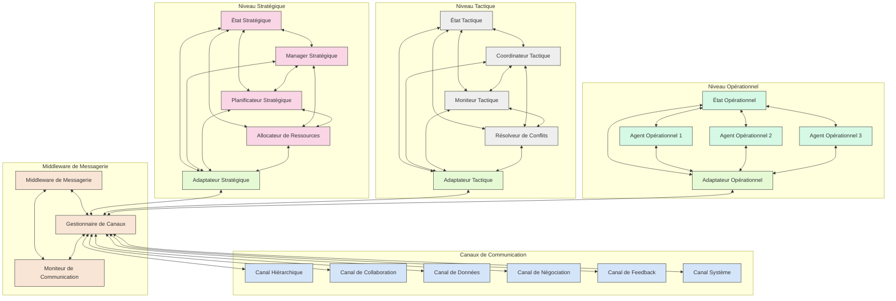

Ce diagramme Mermaid illustre l'architecture de communication multi-canal du système.
Il montre comment le Middleware de Messagerie, via son Gestionnaire de Canaux, interagit avec divers canaux spécialisés pour faciliter la communication entre les agents des niveaux Stratégique, Tactique et Opérationnel. Les adaptateurs représentent l'interface de chaque niveau avec le système de communication.

