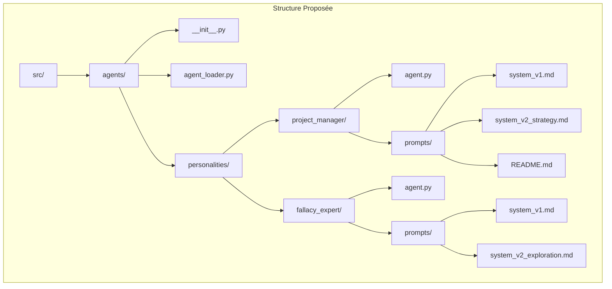
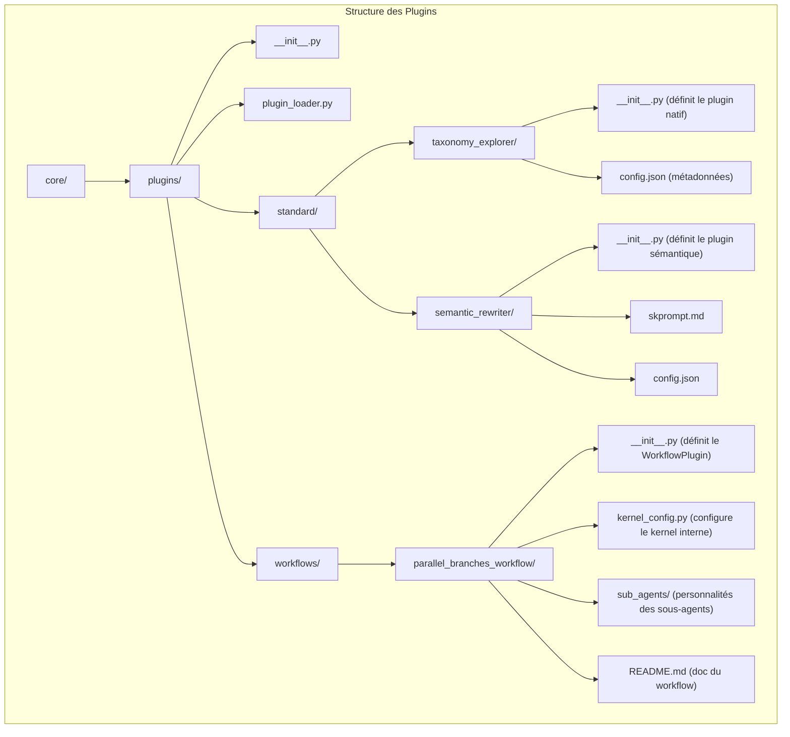

# Vision d'Ensemble et Principes Directeurs

Ce document représente la synthèse finale du plan de consolidation pour le système d'analyse de sophismes. L'objectif est de transformer une collection hétérogène de composants, d'expérimentations et d'architectures en un système unifié, robuste et évolutif. Ce plan n'est pas une réécriture complète, mais une **consolidation constructive** qui respecte l'existant tout en imposant une structure cohérente.

## Philosophie et Principes

1.  **Guichet de Service Unique** : Toutes les interactions externes passeront par un `InformalAnalysisService` unique et bien défini. Ce guichet agira comme une façade, simplifiant l'intégration pour les applications clientes (web, mobile, scripts) et masquant la complexité interne.
2.  **Architecture à Deux Niveaux de Plugins** : La logique métier est organisée en deux types de plugins :
    *   **Plugins Standard** : Des briques de base, atomiques et réutilisables, qui exposent une capacité unique (ex: `TaxonomyExplorer`, `FactChecker`).
    *   **Plugins Workflows** : Des orchestrateurs complexes qui encapsulent des processus métier complets (ex: `PlanAndExecuteWorkflow`, `CounterArgumentGenerationWorkflow`), en s'appuyant sur les Plugins Standard.
3.  **Agents comme Personnalités Découplées** : La logique des agents (leurs "personnalités") est externalisée dans des répertoires dédiés, contenant leur code et une "forêt" de prompts versionnés en Markdown. Cela permet de faire évoluer le comportement des agents sans modifier le code applicatif.
4.  **Migration Incrémentale** : Le plan favorise une migration progressive. Les composants hérités peuvent être temporairement "enveloppés" par des adaptateurs pour s'intégrer rapidement dans la nouvelle structure, avant d'être entièrement migrés.
5.  **Centralisation de la Connaissance** : Les taxonomies, prompts, et définitions sont centralisés et traités comme des actifs de première classe, avec un versioning clair.

## Architecture Globale (Niveau C2 : Conteneurs)

Le diagramme suivant illustre l'interaction de haut niveau entre les composants principaux du système consolidé.

```mermaid
graph TD
    subgraph "Système d'Analyse de Sophismes"
        A["Guichet de Service (API Façade)"]
        B["Coeur des Agents"]
        C["Écosystème des Plugins"]
        D["Services Fondamentaux"]

        A -- Invoque via AnalysisRequest --> B;
        B -- Utilise les capacités de --> C;
        C -- S'appuie sur --> D;
        B -- S'appuie sur --> D;
    end

    subgraph "Écosystème des Plugins"
        C1["Plugins Workflows (ex: Plan-and-Execute)"]
        C2["Plugins Standard (ex: TaxonomyExplorer)"]
        C1 -- Orchestre --> C2;
    end

# Feuille de Route de Migration Séquentielle

Cette feuille de route propose un ordre logique pour la mise en œuvre de ce plan de consolidation. L'objectif est de fournir de la valeur de manière incrémentale et de réduire les risques en validant chaque étape majeure avant de passer à la suivante.

## Étape 1 : Mise en Place des Fondations de la Nouvelle Architecture

*   **Objectif :** Créer le squelette de la nouvelle structure de répertoires pour le `core` et les `agents`.
*   **Actions :**
    1.  Créer la nouvelle arborescence de base : `core/plugins/standard`, `core/plugins/workflows`, `src/agents/personalities`.
    2.  Implémenter les versions initiales des classes d'interfaces (`BasePlugin`, `IWorkflowPlugin`) et des services de chargement (`plugin_loader.py`, `agent_loader.py`).
    3.  Mettre en place la structure de test unifiée `tests/unit`, `tests/integration`, `tests/e2e` et déplacer quelques tests existants simples pour la valider.

## Étape 2 : Migration des Services Fondamentaux et des Plugins Standard

*   **Objectif :** Migrer les briques de base les plus critiques pour fournir des capacités réutilisables.
*   **Actions :**
    1.  Migrer le `FallacyTaxonomyService` et le `FactVerificationService` pour qu'ils soient encapsulés dans des **Plugins Standard** natifs (`TaxonomyExplorerPlugin`, `FactCheckerPlugin`).
    2.  Migrer les outils d'analyse "Enhanced" (4.1) dans un unique `AnalysisToolsPlugin`.
    3.  Développer les tests unitaires pour ces nouveaux plugins afin de garantir leur robustesse.

## Étape 3 : Implémentation du Guichet de Service et du Mode "Analyse Directe"

*   **Objectif :** Activer le premier mode opérationnel du nouveau système pour obtenir un premier résultat de bout en bout.
*   **Actions :**
    1.  Implémenter la classe `InformalAnalysisService` avec ses modèles de données `AnalysisRequest` et `AnalysisResponse`.
    2.  Coder la logique du handler `_handle_direct_analysis` pour qu'il puisse invoquer les fonctions des Plugins Standard migrés à l'étape 2.
    3.  Adapter l'API web (`api/`) pour qu'elle expose ce nouveau service.
    4.  Mettre à jour les tests d'intégration pour valider ce premier workflow via l'API.

## Étape 4 : Migration des Agents et de la "Forêt de Prompts"

*   **Objectif :** Découpler la logique des agents du code applicatif.
*   **Actions :**
    1.  Extraire tous les prompts des fichiers Python vers la nouvelle structure de `prompts` versionnés en `.md` sous `src/agents/personalities/`.
    2.  Refactoriser le code des agents (`ProjectManagerAgent`, `InformalAnalysisAgent`) pour qu'ils soient chargés via le `AgentLoader` avec leur prompt système.
    3.  Implémenter les handlers `_handle_single_agent_chat` dans le Guichet de Service.

## Étape 5 : Migration du premier Plugin Workflow : "Plan-and-Execute"

*   **Objectif :** Intégrer la capacité d'orchestration la plus avancée dans la nouvelle architecture.
*   **Actions :**
    1.  Encapsuler la logique de l'architecture "Plan-and-Execute" (1.1) dans un `PlanAndExecuteWorkflowPlugin`.
    2.  Ce plugin utilisera son propre kernel et ses propres sous-agents (`Planificateur`, `Exécuteur`) comme décrit dans l'architecture des plugins.
    3.  Implémenter le handler `_handle_complex_pipeline` dans le Guichet de Service pour pouvoir invoquer ce workflow.
    4.  Migrer les tests de performance (`test_performance_extraits.py`) pour qu'ils ciblent ce workflow via le Guichet.

## Étape 6 : Intégration des Capacités Satellites

*   **Objectif :** Intégrer les fonctionnalités de valeur prouvée qui étaient dans des projets annexes.
*   **Actions :**
    1.  Démanteler le projet `2.3.3-generation-contre-argument` et le réimplémenter en tant que `CounterArgumentGenerationWorkflow`.
    2.  Intégrer la logique de `2.3.5_argument_quality` dans un `ArgumentQualityPlugin`.
    3.  Intégrer le support pour les LLMs locaux (`2.3.6_local_llm`) dans le `core` du système.

## Étape 7 : Nettoyage et Déclassement

*   **Objectif :** Finaliser la transition en supprimant l'ancien code.
*   **Actions :**
    1.  Parcourir l'inventaire et supprimer tous les composants marqués `À DÉCLASSER`.
    2.  Nettoyer les répertoires `libs/`, `templates/` comme défini dans le plan de rationalisation.
    3.  Archiver les projets étudiants et les prototypes non intégrés dans `examples/academic_projects/`.
    4.  Mettre à jour la documentation finale pour refléter l'architecture cible.

---

---

# Inventaire des Composants et Architectures Existants

Ce document recense l'ensemble des composants logiciels identifiés lors de l'analyse du système de détection de sophismes informels. Chaque entrée décrit le rôle du composant et propose une action de consolidation pour guider la migration vers une architecture unifiée.

---

## 1. Architecture Principale ("Plan-and-Execute")

Composants formant le cœur de l'architecture la plus récente et la plus aboutie, basée sur un modèle multi-agents avec un planificateur central.

### 1.1. Planificateur Stratégique

*   **Chemin :** `argumentation_analysis/agents/core/pm/pm_agent.py`
*   **Rôle :** Contient le `ProjectManagerAgent`, le cerveau de l'orchestration qui décide des étapes d'analyse à entreprendre.
*   **Action :** Promouvoir comme planificateur central de référence. Standardiser son interface d'invocation.

*   **Chemin :** `argumentation_analysis/agents/core/pm/prompts.py`
*   **Rôle :** Définit la logique de décision et les heuristiques du `ProjectManagerAgent`.
*   **Action :** À externaliser dans un catalogue de "stratégies de planification" configurables pour découpler la logique du code.

### 1.2. Agent Spécialiste

*   **Chemin :** `argumentation_analysis/agents/core/informal/informal_agent.py`
*   **Rôle :** `InformalAnalysisAgent`, l'agent d'exécution hybride de référence pour l'analyse de sophismes.
*   **Action :** Conserver comme implémentation de référence. Renommer en `ExecutingAgent` ou `FallacyAnalysisExpert` pour mieux refléter son rôle d'exécuteur.

*   **Chemin :** `argumentation_analysis/agents/core/informal/prompts.py`
*   **Rôle :** Contient les prompts complexes guidant le raisonnement de l'`InformalAnalysisAgent`.
*   **Action :** Extraire et versionner ces prompts en tant que "compétences" ou "workflows" sémantiques dans un catalogue dédié.

*   **Chemin :** `argumentation_analysis/agents/core/informal/informal_definitions.py`
*   **Rôle :** Configuration du Kernel sémantique pour l'`InformalAnalysisAgent`, enregistrant ses plugins.
*   **Action :** Remplacer par un mécanisme de chargement dynamique de plugins à partir d'un catalogue centralisé pour améliorer la modularité.

### 1.3. Composants de Support

*   **Chemin :** `argumentation_analysis/orchestration/analysis_runner_v2.py`
*   **Rôle :** Orchestrateur externe exemple qui exécute la boucle "Plan-and-Execute".
*   **Action :** Transformer en le **"Guichet de Service"** officiel qui expose l'architecture "Plan-and-Execute" via une API claire.

*   **Chemin :** (Conceptuel) `StateManager`
*   **Rôle :** Service de gestion d'état servant de mémoire partagée entre les agents.
*   **Action :** Implémenter une version robuste et persistante (ex: via Redis, base de données, ou bus d'événements) pour remplacer le `StateManagerMock`. Ce sera un service fondamental.

*   **Chemin :** `argumentation_analysis/agents/utils/informal_optimization/`
*   **Rôle :** Documentation sur l'historique et l'optimisation des prompts de l'agent principal.
*   **Action :** Archiver dans la documentation du projet (`docs/`). Le contenu est précieux pour la connaissance mais n'est pas un composant d'exécution.

---

## 2. Pipelines d'Orchestration et d'Analyse

Points d'entrée et orchestrateurs qui encapsulent des logiques d'analyse complètes.

### 2.1. Architecture "Pipeline d'Analyse Avancée" (Multi-niveaux)

*   **Chemin :** `argumentation_analysis/pipelines/advanced_rhetoric.py`
*   **Rôle :** Point d'entrée pour une analyse sophistiquée et multi-niveaux.
*   **Action :** Déclasser en tant que point d'entrée. Ses fonctionnalités devront être remappées comme un **Plugin Workflow** complexe (voir section 4) invocable par le **Guichet de Service**.

*   **Chemin :** `argumentation_analysis/orchestration/advanced_analyzer.py`
*   **Rôle :** Orchestre les appels séquentiels aux outils d'analyse spécialisés.
*   **Action :** Décomposer. Sa logique d'orchestration doit être transformée en une "stratégie de planification" pour le `ProjectManagerAgent`. Les outils qu'il appelle seront conservés.

### 2.2. Architecture "Pipeline Unifié"

*   **Chemin :** `argumentation_analysis/pipelines/unified_text_analysis.py`
*   **Rôle :** Orchestrateur textuel principal et point d'entrée le plus récent.
*   **Action :** **Candidat principal pour évoluer en "Guichet de Service" central.** Il servira de façade pour toutes les demandes d'analyse.

*   **Chemin :** `argumentation_analysis/pipelines/analysis_pipeline.py` & `reporting_pipeline.py`
*   **Rôle :** Pipelines de support pour le pipeline unifié.
*   **Action :** Intégrer leurs logiques comme des étapes standards (ex: "pré-traitement", "post-traitement/reporting") dans le nouveau **Guichet de Service** consolidé.

---

## 3. Architectures et Composants Hérités ou Alternatifs

Implémentations anciennes ou alternatives qui doivent être gérées.

### 3.1. Agent Configurable ("One-Shot")

*   **Chemin :** `argumentation_analysis/agents/concrete_agents/informal_fallacy_agent.py`
*   **Rôle :** Ancienne implémentation d'un agent configurable pour une analyse "one-shot".
*   **Action :** **À déclasser.** Sa fonctionnalité ("one-shot") doit être réimplémentée comme un "workflow sémantique simple" dans le nouveau système pour les cas d'usage rapides.

*   **Chemin :** `argumentation_analysis/agents/prompts/InformalFallacyAgent/`
*   **Rôle :** Prompt simple pour l'agent "one-shot".
*   **Action :** Archiver dans la documentation comme exemple de workflow simple, puis supprimer du code source.

*   **Chemin :** `argumentation_analysis/agents/plugins/fallacy_workflow_plugin.py`
*   **Rôle :** Plugin effectuant l'analyse "one-shot".
*   **Action :** **À déclasser.** Sa logique doit être migrée vers un **Plugin Standard** sémantique.

### 3.2. Adaptateur de Rétrocompatibilité

*   **Chemin :** `argumentation_analysis/agents/core/informal/informal_agent_adapter.py`
*   **Rôle :** Façade pour la compatibilité des anciens tests.
*   **Action :** **Supprimer** après la migration complète des tests vers la nouvelle interface de service.

---

## 4. Outils d'Analyse Fondamentaux (Briques de base)

Moteurs d'analyse de bas niveau utilisés par les architectures de plus haut niveau.

### 4.1. Outils d'analyse "Enhanced"

*   **Localisation :** `argumentation_analysis/agents/tools/analysis/enhanced/`
*   **Fichiers :** `complex_fallacy_analyzer.py`, `contextual_fallacy_analyzer.py`, `fallacy_severity_evaluator.py`
*   **Rôle :** Cœur de l'analyse la plus fine et mature.
*   **Action :** **Conserver et généraliser.** Ces outils doivent devenir les briques de base de référence pour l'analyse, exposées comme des services internes clairs et testables.

### 4.2. Outils d'analyse "New"

*   **Localisation :** `argumentation_analysis/agents/tools/analysis/new/`
*   **Fichiers :** `contextual_fallacy_detector.py`, `argument_coherence_evaluator.py`
*   **Rôle :** Nouvelle génération expérimentale d'outils.
*   **Action :** **Évaluer et potentiellement intégrer.** Mener une évaluation comparative avec les outils "enhanced". Les gagnants remplaceront les anciens.

### 4.3. Outils d'analyse de base

*   **Localisation :** `argumentation_analysis/agents/tools/analysis/` (racine)
*   **Rôle :** Versions plus anciennes et probablement obsolètes des outils "enhanced".
*   **Action :** **Candidats clairs à la suppression.** À supprimer après avoir validé que les versions "enhanced" couvrent bien leurs fonctionnalités.

---

## 5. Plugins et Services Partagés

Composants transverses utilisés par différentes architectures.

### 5.1. Plugins Sémantiques Modulaires ("Guide-Explore-Synthesize")

*   **Chemin :** `argumentation_analysis/plugins/GuidingPlugin/`
*   **Rôle :** Plugin de triage pour identifier les axes d'analyse.
*   **Action :** Conserver comme un **Plugin Standard** de planification avancée. À intégrer dans le catalogue de stratégies du planificateur.

*   **Chemin :** `argumentation_analysis/plugins/ExplorationPlugin/`
*   **Rôle :** Plugin d'analyse ciblée sur une catégorie de sophisme.
*   **Action :** Conserver comme un **Plugin Standard** fondamental. Le planificateur doit pouvoir l'invoquer dynamiquement.

*   **Chemin :** `argumentation_analysis/plugins/SynthesisPlugin/`
*   **Rôle :** Agrège les résultats des explorations parallèles.
*   **Action :** Conserver comme un **Plugin Standard** clé pour la convergence des analyses. À généraliser pour pouvoir synthétiser différents types de résultats.

### 5.2. Services Fondamentaux

*   **Chemin :** `argumentation_analysis/services/fallacy_taxonomy_service.py`
*   **Rôle :** Service essentiel pour gérer la taxonomie des sophismes.
*   **Action :** **À conserver absolument** et à renforcer comme service de base immuable du système.

*   **Chemin :** `argumentation_analysis/services/fallacy_family_definitions.py`
*   **Rôle :** Fournit des métadonnées sur les familles de sophismes.
*   **Action :** Fusionner avec le `fallacy_taxonomy_service` pour créer un unique "Service de Connaissance des Sophismes".

*   **Chemin :** `argumentation_analysis/services/fact_verification_service.py`
*   **Rôle :** Service transverse de vérification des faits.
*   **Action :** **Clarifier et généraliser.** Transformer en un service de "vérification externe" bien défini, potentiellement avec des connecteurs interchangeables (recherche web, base de données interne...).

*   **Chemin :** `argumentation_analysis/services/web_api/services/fallacy_service.py`
*   **Rôle :** Façade de service pour l'API Web.
*   **Action :** Ce sera le prédécesseur du "Guichet de Service" final. Sa logique sera migrée vers le nouveau service unifié, mais ce fichier sera conservé pour assurer la transition de l'API.

---

## 6. Scripts de Validation et de Démonstration

Fichiers non exécutés en production mais essentiels pour le développement et la validation.

### 6.1. Scripts de Test et de Performance

*   **Chemin :** `argumentation_analysis/scripts/test_performance_extraits.py`
*   **Rôle :** Suite de tests `pytest` pour l'architecture principale.
*   **Action :** Migrer ces tests pour qu'ils ciblent le nouveau "Guichet de Service". Ils deviendront les tests d'intégration de référence.

*   **Chemin :** (Conceptuel) Autres fichiers de tests (`test_*.py`)
*   **Rôle :** Tests unitaires et d'intégration pour des composants spécifiques.
*   **Action :** Réorganiser dans une structure de tests standard (`tests/unit`, `tests/integration`). Maintenir et améliorer la couverture.

### 6.2. Scripts de Démonstration et Exemples

*   **Chemin :** `argumentation_analysis/demos/run_rhetorical_analysis_demo.py`
*   **Rôle :** Démonstrateur de haut niveau.
*   **Action :** Mettre à jour pour qu'il utilise le nouveau "Guichet de Service". Il servira d'exemple d'intégration client.

*   **Chemin :** `argumentation_analysis/examples/rhetorical_tools/`
*   **Rôle :** Exemples d'utilisation isolée des outils de bas niveau.
*   **Action :** Conserver et mettre à jour. Transformer en documentation vivante (`docs/examples/`) illustrant comment utiliser les services et outils internes du système consolidé.


---

# Architecture du Guichet de Service Unifié

Cette section décrit l'architecture du `InformalAnalysisService`, le point d'entrée unique et configurable pour toutes les opérations d'analyse de sophismes informels. Ce service est conçu pour orchestrer les divers composants identifiés dans l'inventaire de la Phase 1, en offrant une interface flexible capable de gérer des scénarios allant de l'analyse simple à des orchestrations multi-agents complexes.

Le `pipeline unifié` mentionné en **2.2** (`argumentation_analysis/pipelines/unified_text_analysis.py`) est le candidat principal pour évoluer en ce guichet, et la façade de service existante en **5.2** (`argumentation_analysis/services/web_api/services/fallacy_service.py`) sera son prédécesseur direct.

## Structure du Service et Modèles de Données

Pour garantir la flexibilité et la robustesse, le service s'appuiera sur des modèles de données clairs, basés sur Pydantic, pour les requêtes et les réponses.

### Modèle de Requête (`AnalysisRequest`)

Le modèle `AnalysisRequest` est conçu pour être riche et extensible, afin de capturer tous les paramètres nécessaires aux différents modes d'opération.

```python
# Pseudo-code pour les modèles Pydantic
from typing import List, Dict, Any, Literal, Optional
from pydantic import BaseModel, Field

class ToolConfig(BaseModel):
    """Configuration pour un outil ou plugin sémantique."""
    plugin_name: str = Field(description="Nom du plugin à charger (ex: 'ExplorationPlugin').")
    # D'autres paramètres spécifiques à l'outil pourraient être ajoutés ici.

class AgentConfig(BaseModel):
    """Configuration pour un agent conversationnel."""
    agent_id: str = Field(description="Identifiant unique de l'agent à invoquer.")
    system_prompt_key: str = Field(description="Clé pour retrouver le prompt système de l'agent dans le catalogue.")
    tools: Optional[List[ToolConfig]] = Field(default=None, description="Liste des outils (plugins) à fournir à l'agent.")

class ConversationConfig(BaseModel):
    """Configuration pour une orchestration de conversation."""
    conversation_id: str
    participants: List[AgentConfig]
    guidance_mode: Literal["moderator", "debate", "sequential"] = "moderator"
    shared_context: Dict[str, Any] = {}

class AnalysisRequest(BaseModel):
    """
    Modèle de requête unifié pour le InformalAnalysisService.
    """
    text_to_analyze: str = Field(description="Le texte brut à analyser.")
    
    # Mode d'opération pour le dispatch
    mode: Literal[
        "direct_analysis",
        "kernel_invocation",
        "single_agent_chat",
        "multi_agent_chat",
        "complex_pipeline"
    ] = Field(description="Le mode d'opération principal qui détermine la logique de dispatch.")

    # Paramètres spécifiques aux modes
    function_name: Optional[str] = Field(default=None, description="[direct_analysis] Nom de la fonction d'analyse directe à appeler.")
    
    kernel_plugin_config: Optional[ToolConfig] = Field(default=None, description="[kernel_invocation] Configuration du plugin sémantique à invoquer.")
    
    agent_config: Optional[AgentConfig] = Field(default=None, description="[single_agent_chat] Configuration de l'agent unique.")
    
    conversation_config: Optional[ConversationConfig] = Field(default=None, description="[multi_agent_chat] Configuration de la conversation multi-agents.")

    pipeline_name: Optional[str] = Field(default=None, description="[complex_pipeline] Nom du pipeline d'orchestration complexe à exécuter (ex: 'plan_and_execute').")

    # Contexte et état
    session_id: Optional[str] = Field(default=None, description="ID de session pour maintenir un état entre les appels.")
    
    # Pour la compatibilité
    legacy_parameters: Optional[Dict[str, Any]] = Field(default=None, description="Paramètres pour la rétrocompatibilité.")

```

### Modèle de Réponse (`AnalysisResponse`)

La réponse est également standardisée pour fournir des résultats structurés.

```python
class AnalysisResult(BaseModel):
    """Structure pour un résultat d'analyse individuel."""
    sophism_type: str
    detected_text: str
    explanation: str
    severity: float
    # ... autres champs pertinents

class AnalysisResponse(BaseModel):
    """
    Modèle de réponse unifié.
    """
    request_id: str
    status: Literal["completed", "failed", "in_progress"]
    results: Optional[List[AnalysisResult]] = None
    conversation_history: Optional[Dict[str, Any]] = None
    error_message: Optional[str] = None
    debug_info: Optional[Dict[str, Any]] = None
```

### Classe de Service (`InformalAnalysisService`)

```python
# Pseudo-code pour la classe de service
class InformalAnalysisService:
    
    def __init__(self):
        # Initialisation des services fondamentaux (voir 5.2 de l'inventaire)
        self.taxonomy_service = self._load_taxonomy_service()
        self.knowledge_service = self._load_knowledge_service()
        self.verification_service = self._load_verification_service()
        
        # Initialisation des briques d'analyse (voir 4.1, 4.2)
        self.analysis_tools = self._load_analysis_tools()
        
        # Initialisation des orchestrateurs (voir 1.1, 2.1)
        self.plan_and_execute_orchestrator = self._load_plan_and_execute()
        
        # Gestionnaire d'état (voir 1.3)
        self.state_manager = self._load_state_manager() # Ex: RedisStateManager

    async def analyze(self, request: AnalysisRequest) -> AnalysisResponse:
        """
        Point d'entrée principal qui dispatche la requête vers le bon handler.
        """
        # Logique de dispatch basée sur le mode
        if request.mode == "direct_analysis":
            return await self._handle_direct_analysis(request)
        elif request.mode == "kernel_invocation":
            return await self._handle_kernel_invocation(request)
        elif request.mode == "single_agent_chat":
            return await self._handle_single_agent_chat(request)
        elif request.mode == "multi_agent_chat":
            return await self._handle_multi_agent_chat(request)
        elif request.mode == "complex_pipeline":
            return await self._handle_complex_pipeline(request)
        else:
            raise ValueError(f"Mode d'analyse non supporté: {request.mode}")

    # Implémentation des handlers internes...
    async def _handle_direct_analysis(self, request: AnalysisRequest): ...
    async def _handle_kernel_invocation(self, request: AnalysisRequest): ...
    async def _handle_single_agent_chat(self, request: AnalysisRequest): ...
    async def _handle_multi_agent_chat(self, request: AnalysisRequest): ...
    async def _handle_complex_pipeline(self, request: AnalysisRequest): ...

```

## Logique de Dispatch Interne

La logique de dispatch est au cœur du guichet. Elle aiguille la requête en fonction du paramètre `mode` vers le backend approprié.

```mermaid
graph TD
    A[AnalysisRequest] --> B{InformalAnalysisService.analyze};
    B --> C{Dispatch on request.mode};
    C --> D[mode: direct_analysis] --> D1[Invoke: _handle_direct_analysis];
    C --> E[mode: kernel_invocation] --> E1[Invoke: _handle_kernel_invocation];
    C --> F[mode: single_agent_chat] --> F1[Invoke: _handle_single_agent_chat];
    C --> G[mode: multi_agent_chat] --> G1[Invoke: _handle_multi_agent_chat];
    C --> H[mode: complex_pipeline] --> H1[Invoke: _handle_complex_pipeline];
    
    D1 --> D2[Appel direct d'un outil d'analyse (Inventaire 4.1)];
    E1 --> E2[Chargement dynamique d'un plugin SK (Inventaire 5.1)];
    F1 --> F2[Orchestration d'un agent unique (Inventaire 1.2)];
    G1 --> G2[Orchestration de conversation (Nouveau)];
    H1 --> H2[Invocation d'un pipeline (Inventaire 1.1, 2.1)];

    D2 --> Z[AnalysisResponse];
    E2 --> Z;
    F2 --> Z;
    G2 --> Z;
    H2 --> Z;
```

## Scénarios d'Utilisation et Liens avec l'Inventaire

### 1. Analyse Directe

*   **Description :** Invocation simple et directe d'une fonction d'analyse fondamentale pour des tâches atomiques et rapides. Utile pour les intégrations qui nécessitent une analyse spécifique sans le surcoût d'un agent.
*   **Logique du Guichet :** Le handler `_handle_direct_analysis` sélectionne et appelle une fonction parmi les outils de bas niveau chargés.
*   **Composants Invoqués (Inventaire) :**
    *   **Outils d'analyse "Enhanced" (4.1)** : `complex_fallacy_analyzer`, `contextual_fallacy_analyzer`, `fallacy_severity_evaluator`. Ces composants sont les briques de base de cette fonctionnalité.
    *   **Services Fondamentaux (5.2)** : `FallacyTaxonomyService` pour accéder aux définitions si nécessaire.

### 2. Kernel Invocation

*   **Description :** Permet d'invoquer une fonction spécifique d'un plugin `semantic-kernel` chargé dynamiquement. Ce mode est idéal pour exécuter une "compétence" sémantique isolée.
*   **Logique du Guichet :** `_handle_kernel_invocation` utilise la `ToolConfig` pour localiser, charger (si nécessaire) et exécuter un plugin sémantique.
*   **Composants Invoqués (Inventaire) :**
    *   **Plugins Sémantiques (5.1)** : `GuidingPlugin`, `ExplorationPlugin`, `SynthesisPlugin`. Ces plugins, une fois transformés en "skills" autonomes, sont les cibles parfaites pour ce mode.
    *   **Logique de l'agent "One-Shot" (3.1)** : La fonctionnalité de l'ancien `fallacy_workflow_plugin` sera réimplémentée comme un skill invocable via ce mode.

### 3. Agent Conversationnel (sans outils)

*   **Description :** Gère un échange conversationnel avec un agent spécialiste unique. L'agent est doté d'une personnalité et d'un objectif définis par un prompt système, mais n'a pas accès à des outils externes.
*   **Logique du Guichet :** Le handler `_handle_single_agent_chat` instancie un kernel, injecte le prompt système spécifié dans `AgentConfig`, gère l'historique de la conversation (via `StateManager`) et retourne la réponse de l'agent.
*   **Composants Invoqués (Inventaire) :**
    *   **Agent Spécialiste (1.2)** : La logique de `InformalAnalysisAgent` (futur `ExecutingAgent`) est la base.
    *   **Prompts (1.2, 1.1)** : Les prompts systèmes seront chargés à partir du catalogue de "compétences" et de "stratégies".
    *   **StateManager (1.3)** : Le `StateManager` robuste sera utilisé pour maintenir le contexte de la conversation.

### 4. Agent Conversationnel (avec outils)

*   **Description :** Similaire au cas précédent, mais l'agent dispose d'un ensemble d'outils (plugins sémantiques) qu'il peut décider d'utiliser pour répondre à la requête de l'utilisateur.
*   **Logique du Guichet :** En plus de la logique du cas 3, le handler charge et enregistre les plugins spécifiés dans `AgentConfig.tools` dans le kernel de l'agent avant de traiter la requête.
*   **Composants Invoqués (Inventaire) :**
    *   **Tous les composants du cas 3**.
    *   **Mécanisme de chargement de plugins (1.2)** : Le mécanisme de chargement dynamique de plugins sera central ici.
    *   **Plugins Sémantiques (5.1)** et **Outils d'analyse (4.1)** : Ces composants, une fois exposés comme des plugins compatibles, formeront le catalogue d'outils disponibles pour l'agent.
    *   **Service de vérification (5.2)** : Le `fact_verification_service` est un candidat idéal pour être un outil fourni à l'agent.

### 5. Orchestration de Conversation Multi-Agents

*   **Description :** Met en scène une conversation entre plusieurs agents, chacun avec ses propres compétences et outils. Un mécanisme de "guidage" contrôle le flux de la conversation.
*   **Logique du Guichet :** Le handler `_handle_multi_agent_chat` est le plus complexe. Il s'appuie sur la `ConversationConfig` pour :
    1.  Instancier plusieurs agents dans un contexte partagé.
    2.  Utiliser le `StateManager` pour maintenir l'état de la conversation globale.
    3.  Appliquer une logique de "chef d'orchestre" (le `guidance_mode`) pour déterminer quel agent parle à quel moment.
*   **Composants Invoqués (Inventaire) :**
    *   Ce scénario est une généralisation de l'architecture **Plan-and-Execute (1.1, 1.2)**. Le `ProjectManagerAgent` peut agir comme le "modérateur".
    *   Les agents peuvent être des instances multiples de `ExecutingAgent` avec des configurations (prompts, outils) différentes.
    *   Le `StateManager` est critique pour la mémoire partagée.

### 6. Orchestrations Complexes ("Plan-and-Execute")

*   **Description :** Invocation de workflows d'analyse de haut niveau, comme le pipeline "Plan-and-Execute" complet.
*   **Logique du Guichet :** Le handler `_handle_complex_pipeline` agit comme une simple façade, transmettant la requête à un orchestrateur de plus haut niveau.
*   **Composants Invoqués (Inventaire) :**
    *   **Planificateur Stratégique (1.1)** : Le `ProjectManagerAgent` est invoqué pour créer un plan.
    *   **Agent Spécialiste (1.2)** : Les `ExecutingAgent` sont invoqués pour exécuter les étapes du plan.
    *   **Orchestrateur externe (1.3)** : La logique de `analysis_runner_v2.py` sera encapsulée ici.
    *   **Pipelines (2.1, 2.2)** : Les logiques des anciens pipelines (`advanced_rhetoric`, etc.) seront réimplementées comme des workflows nommés que l'on peut appeler via ce mode.


---

# Architecture de la Couche Agents et Prompts

Cette section définit la nouvelle architecture pour la gestion des agents et de leurs prompts système. Elle répond à une faiblesse critique identifiée dans les phases précédentes : la dispersion, le manque de versioning et le couplage fort des prompts avec le code applicatif. 

L'objectif est de mettre en place une **structure centralisée, versionnée et découplée** qui servira de "source de vérité" unique pour la définition du comportement des agents.

## 1. Structure des Répertoires des Agents

Pour remédier à la dispersion actuelle, nous proposons une arborescence de répertoires claire et logique, localisée à la racine du code source (`src/`), qui remplacera progressivement l'ancienne structure `argumentation_analysis/`.

La structure est organisée par "personnalité" d'agent, chaque personnalité étant un répertoire contenant le code de l'agent et sa collection de prompts versionnés.



*   **`src/agents/`**: Répertoire racine pour toute la logique liée aux agents.
*   **`src/agents/personalities/`**: Contient les différentes "personnalités" d'agents (ex: `project_manager`, `fallacy_expert`). Chaque sous-répertoire représente un rôle distinct.
*   **`src/agents/personalities/<nom_agent>/agent.py`**: L'implémentation Python de l'agent.
*   **`src/agents/personalities/<nom_agent>/prompts/`**: La **"forêt de prompts"** de l'agent. Chaque fichier est une version d'un prompt système.
*   **`src/agents/agent_loader.py`**: Un service central pour charger une instance d'agent avec une version spécifique de son prompt.

## 2. Gestion et Versioning de la "Forêt de Prompts"

La gestion des prompts est au cœur de cette architecture.

### 2.1. Convention de Versioning

*   **Format de Fichier**: Chaque prompt est stocké dans un fichier Markdown (`.md`), ce qui garantit sa lisibilité et facilite son édition.
*   **Nommage Sémantique**: Le nom de fichier du prompt inclut sa version et une indication de sa spécificité. Exemples :
    *   `system_v1.md`: Première version stable.
    *   `system_v2_concise.md`: Deuxième version, refactorisée pour être plus concise.
    *   `system_v3_exploration_focus.md`: Troisième version, optimisée pour le workflow d'exploration.
*   **Changelog**: Un fichier `README.md` dans chaque répertoire `prompts/` décrira l'historique des changements, les raisons des nouvelles versions et les résultats des tests de performance associés.

### 2.2. Rationalisation et Plan de Migration

Pour centraliser les prompts existants, un plan en 4 étapes sera suivi :

1.  **Extraction**: Identifier tous les prompts actuellement intégrés dans le code Python (`.py`) ou dans des fichiers textes non standardisés, comme identifié dans l'inventaire (`argumentation_analysis/agents/core/pm/prompts.py`, `argumentation_analysis/agents/core/informal/prompts.py`, etc.).
2.  **Création de la Structure**: Mettre en place la nouvelle arborescence de répertoires `src/agents/personalities/`.
3.  **Migration**: Copier le contenu des prompts extraits vers les nouveaux fichiers `.md` dans la structure appropriée, en leur assignant une version initiale (ex: `system_v1.md`).
4.  **Refactoring du Code**: Modifier le code des agents pour qu'ils ne contiennent plus de logique de prompt en dur. À la place, ils feront appel au `AgentLoader` pour se charger avec le prompt requis.

### 2.3. Intégration avec l'Amélioration Automatisée

Cette nouvelle structure est conçue pour faciliter l'amélioration (manuelle ou automatisée) des prompts. Un script, par exemple `scripts/evolve_prompt.py`, pourra :
1.  Prendre en entrée le chemin d'un prompt existant (`.../fallacy_expert/prompts/system_v2.md`).
2.  Appliquer un méta-prompt d'amélioration (ex: "Reformule ce prompt pour qu'il soit plus robuste face aux injections").
3.  Sauvegarder le résultat comme une nouvelle version (`system_v2_robust.md`), prête à être testée.

## 3. Chargement des Agents et Intégration

Le chargement d'un agent avec une version spécifique de son prompt sera géré par un service dédié, `AgentLoader`, et exposé au "Guichet de Service" via le modèle `AnalysisRequest`.

### 3.1. Raffinement du Modèle `AgentConfig`

Le modèle `AgentConfig` défini dans la phase 2 sera ajusté pour s'aligner sur cette nouvelle structure :

```python
# Extrait du modèle Pydantic de la phase 2, avec ajustements
class AgentConfig(BaseModel):
    """Configuration pour un agent."""
    agent_personality: str = Field(description="Nom de la personnalité de l'agent à charger (ex: 'fallacy_expert').")
    prompt_version: str = Field(description="Version du prompt à utiliser (ex: 'v2_exploration', 'latest').", default="latest")
    # ... autres paramètres
```

### 3.2. Pseudo-code du `AgentLoader`

Voici comment le `AgentLoader` fonctionnerait pour charger un agent sur la base de cette configuration.

```python
# Pseudo-code pour src/agents/agent_loader.py
import importlib
from pathlib import Path

class AgentLoader:
    def __init__(self, personalities_path: str = "src/agents/personalities"):
        self.path = Path(personalities_path)

    def get_prompt_content(self, personality: str, version: str) -> str:
        """Trouve et lit le contenu d'un prompt spécifique."""
        prompt_dir = self.path / personality / "prompts"
        if version == "latest":
            # Logique pour trouver le fichier avec la version la plus haute
            # Ex: Trouve 'system_v3.md' s'il existe
            prompt_file = max(prompt_dir.glob("system_v*.md"))
        else:
            # Logique pour trouver le fichier correspondant à la version
            # Ex: Trouve le fichier qui contient 'v2_exploration' dans son nom
            found = list(prompt_dir.glob(f"*{version}*.md"))
            if not found:
                 raise FileNotFoundError(f"Prompt version '{version}' non trouvé pour '{personality}'.")
            prompt_file = found[0]

        return prompt_file.read_text()

    def load(self, config: AgentConfig):
        """Charge et instancie un agent complet."""
        # 1. Charger le code de l'agent dynamiquement
        module_path = f"agents.personalities.{config.agent_personality}.agent"
        agent_module = importlib.import_module(module_path)
        AgentClass = getattr(agent_module, "Agent") # Convention: la classe s'appelle 'Agent'

        # 2. Charger le prompt système requis
        system_prompt = self.get_prompt_content(config.agent_personality, config.prompt_version)

        # 3. Instancier l'agent avec toutes ses dépendances et son prompt
        agent_instance = AgentClass(system_prompt=system_prompt)
        
        return agent_instance

# Utilisation dans le Guichet de Service
# request: AnalysisRequest = ...
# if request.mode == "single_agent_chat":
#     loader = AgentLoader()
#     agent = loader.load(request.agent_config)
#     # ... utiliser l'agent
```


---

# Architecture des Plugins à Deux Niveaux

Cette section définit l'architecture de l'écosystème des plugins qui alimenteront les agents. Pour répondre au besoin de gérer à la fois des capacités atomiques et des orchestrations complexes, une structure à deux niveaux est proposée. Elle distingue clairement les **Plugins Standard**, qui fournissent des fonctions de base, et les **Plugins Workflows**, qui encapsulent des processus métier complets.

Cette architecture vise à :
*   **Clarifier les responsabilités** : Chaque plugin a un rôle bien défini.
*   **Maximiser la réutilisabilité** : Les fonctions de base sont isolées et peuvent être composées de multiples manières.
*   **Faciliter la migration** : La structure permet d'intégrer progressivement la logique existante.
*   **Améliorer la maintenabilité** : L'isolation des complexités rend le système plus facile à comprendre et à faire évoluer.

## 1. Structure des Répertoires des Plugins

Pour matérialiser cette dualité, la structure de répertoires suivante est proposée à la racine du `core` du projet (qui remplacera `src/` ou sera son parent).



*   **`core/plugins/`**: Répertoire racine pour tous les plugins.
*   **`core/plugins/plugin_loader.py`**: Service de chargement capable de découvrir et d'instancier les plugins des deux types.
*   **`core/plugins/standard/`**: Contient les plugins atomiques, réutilisables et sans état interne complexe.
*   **`core/plugins/workflows/`**: Contient les plugins complexes qui orchestrent d'autres composants.

## 2. Niveau 1 : Plugins "Standard"

Les plugins "Standard" (ou "Libres") sont les briques de base fonctionnelles fournies à un agent. Ils exécutent une tâche atomique et bien définie.

*   **Rôle** : Fournir une capacité unique et directe.
    *   **Fonction Native** : Accéder à une base de données, interroger un service externe, manipuler des données locales (ex: `TaxonomyManager`).
    *   **Fonction Sémantique** : Reformuler un texte, classifier une intention, extraire une information spécifique via un LLM.
*   **Exemples Existants (mapping depuis l'inventaire)** :
    *   **`ExplorationPlugin` (5.1)** : Deviendra un plugin standard sémantique pour l'analyse ciblée.
    *   **`SynthesisPlugin` (5.1)** : Plugin standard sémantique pour l'agrégation de résultats.
    *   **`FactVerificationService` (5.2)** : Sera encapsulé dans un plugin standard natif `FactCheckerPlugin`.
    *   **Outils d'analyse "Enhanced" (4.1)** : Chaque analyseur (`complex_fallacy_analyzer`, etc.) sera exposé comme une fonction native dans un `AnalysisToolsPlugin`.
    *   **`FallacyTaxonomyService` (5.2)** : Sera exposé via un `TaxonomyExplorerPlugin` natif.

### 2.1. Structure Interne d'un Plugin Standard (Exemple Hybride)

Prenons l'exemple du **`TaxonomyExplorerPlugin`**. Il doit pouvoir cohabiter avec l'ancienne et la nouvelle approche.

_Chemin : `core/plugins/standard/taxonomy_explorer/`_

```python
# __init__.py

from semantic_kernel import Kernel
from semantic_kernel.functions import kernel_function
from some_legacy_path import HandlebarsPromptManager # Ancien système
from core.services import TaxonomyManager # Nouveau système

class TaxonomyExplorerPlugin:
    """Plugin pour explorer la taxonomie des sophismes."""

    def __init__(self, use_native: bool = True):
        self.use_native = use_native
        if not self.use_native:
            self.legacy_prompt_manager = HandlebarsPromptManager()
        else:
            self.taxonomy_manager = TaxonomyManager()

    @kernel_function(name="get_fallacy_definition", description="Récupère la définition d'un sophisme.")
    def get_definition(self, fallacy_name: str) -> str:
        if self.use_native:
            # Nouvelle approche : appel direct, structuré et testable
            return self.taxonomy_manager.get_definition(fallacy_name)
        else:
            # Ancienne approche : pour la rétrocompatibilité
            prompt = self.legacy_prompt_manager.get_prompt("get_definition", fallacy_name)
            # ... (logique pour exécuter le prompt via le kernel)
            # Cette branche sera dépréciée puis supprimée.
            pass
```

### 2.2. Plan de Migration pour les Plugins Standard

1.  **Identifier & Mapper** : Cartographier tous les "outils" et "services" de l'inventaire vers de futurs plugins standard.
2.  **Encapsuler** : Créer la structure de répertoires et le fichier `__init__.py` pour chaque plugin. Copier la logique existante à l'intérieur, en utilisant un flag comme `use_native` pour gérer la transition.
3.  **Exposer en Natif** : Pour la logique qui n'est pas sémantique (accès DB, API), créer une classe `Manager` (ex: `TaxonomyManager`) avec des méthodes Python pures et la décorer avec `@kernel_function`.
4.  **Refactoriser** : Mettre à jour le code des agents pour qu'ils utilisent le `PluginLoader` et appellent les nouvelles fonctions natives.
5.  **Nettoyer** : Une fois la migration validée, supprimer l'ancienne branche de code (Handlebars, prompts en dur).

## 3. Niveau 2 : Plugins "Workflows"

Les plugins "Workflows" sont des orchestrateurs de haut niveau. Ils ne réalisent pas une tâche atomique mais encapsulent une séquence complète d'opérations, un sous-processus métier.

*   **Rôle** : Gérer un flux de travail complexe qui peut nécessiter de la mémoire, de l'état, et l'invocation de multiples autres plugins (Standard ou même d'autres Workflows). Ils sont de véritables "mini-applications".
*   **Caractéristiques Clés** :
    *   **Kernel Interne** : Un Workflow peut avoir sa propre instance de `semantic-kernel` pour gérer sa logique interne et ses propres plugins.
    *   **Sous-Agents** : Peut instancier et orchestrer des agents spécifiques (avec des personnalités définies localement) pour accomplir ses tâches.
    *   **Utilisation de Plugins Standard** : Un workflow invoque des plugins standard comme de simples boîtes à outils.
*   **Exemples Existants (mapping depuis l'inventaire)** :
    *   **L'architecture "Plan-and-Execute" (1.1)** : Le duo `ProjectManagerAgent` et `InformalAnalysisAgent` est un workflow parfait. Il sera encapsulé dans un `PlanAndExecuteWorkflowPlugin`.
    *   **`GuidingPlugin`, `ExplorationPlugin`, `SynthesisPlugin` (5.1)** : Leur orchestration séquentielle "Guide-Explore-Synthesize" est un workflow. Il sera encapsulé dans `GuidedExplorationWorkflowPlugin`.
    *   **Pipeline d'Analyse Avancée (2.1)** : La logique de `advanced_analyzer` sera réimplémentée en tant que `AdvancedRhetoricWorkflowPlugin`.

### 3.1. Diagramme d'Interaction Hiérarchique

Ce diagramme illustre comment les différents niveaux interagissent, depuis la requête initiale jusqu'à l'exécution de la brique de base.

```mermaid
graph TD
    A[Guichet de Service] -- AnalysisRequest --> B{Agent Principal};
    B -- Invoque plugin --> C{Workflow: PlanAndExecute};
    
    subgraph C [Plugin Workflow]
        C1[Kernel Interne du Workflow]
        C2[Sous-Agent: Planificateur]
        C3[Sous-Agent: Exécuteur]
        
        C1 -- Configure --> C2;
        C1 -- Configure --> C3;
        C2 -- Plan --> C3;
    end

    B --> C;
    C3 -- Utilise outil --> D{Plugin Standard: TaxonomyExplorer};
    
    subgraph D [Plugin Standard]
        D1[Fonction Native: get_definition]
    end
    
    C3 --> D;
    D --> D1;

    style C subgraph fill:#f9f,stroke:#333,stroke-width:2px,stroke-dasharray: 5 5;
    style D subgraph fill:#ccf,stroke:#333,stroke-width:2px;
```

## 4. Mutualisation et Migration

Pour assurer la cohérence et faciliter la migration, des classes de base et des interfaces sont nécessaires.

### 4.1. Interfaces Communes

Nous définirons des interfaces pour garantir un comportement homogène.

```python
# core/plugins/interfaces.py
from abc import ABC, abstractmethod
from typing import Dict, Any

class BasePlugin(ABC):
    """Interface de base pour tous les plugins."""
    
    @property
    @abstractmethod
    def name(self) -> str:
        """Nom unique du plugin."""
        pass

    @abstractmethod
    def get_metadata(self) -> Dict[str, Any]:
        """Retourne les métadonnées du plugin (version, auteur, etc.)."""
        pass

class IWorkflowPlugin(BasePlugin):
    """Interface pour les plugins de type Workflow."""
    
    @abstractmethod
    async def execute_workflow(self, context: Dict[str, Any]) -> Dict[str, Any]:
        """Exécute le workflow complet."""
        pass
```

### 4.2. Stratégie de Migration

1.  **Définir les Interfaces** : Finaliser `BasePlugin` et `IWorkflowPlugin`.
2.  **Adapter les Nouveaux Plugins** : S'assurer que tous les nouveaux plugins (Standard et Workflows) implémentent ces interfaces.
3.  **Créer des Adaptateurs pour l'Héritage** : Pour les composants existants complexes à migrer (ex: `advanced_analyzer`), créer une classe `AdvancedAnalyzerWorkflowAdapter` qui implémente `IWorkflowPlugin` et qui, en interne, appelle l'ancienne logique. Cela permet une intégration rapide sans réécriture immédiate.
4.  **Migration Progressive** : Prioriser la migration complète des workflows les plus critiques, comme "Plan-and-Execute", tout en maintenant les autres via des adaptateurs. Puis, remplacer progressivement les adaptateurs par des implémentations natives.


---

# Phase 5 : Rationalisation des Composants Satellites

Cette section traite de tous les composants, scripts, et expériences qui existent dans la base de code mais qui n'ont pas été couverts par l'inventaire initial des systèmes principaux. L'objectif est de leur assigner une place et un statut clairs dans la nouvelle architecture.

## 1. Projets Étudiants et Expérimentations Numérotées

Ces répertoires semblent correspondre à des projets ou des preuves de concept isolés, probablement issus de travaux universitaires.

### 1.1. `1_2_7_argumentation_dialogique`
*   **Analyse** : Contient une tentative de modélisation de dialogue argumentatif. Semble être une recherche exploratoire.
*   **Statut** : `À CONSERVER (TEL QUEL)`
*   **Plan d'action** : Déplacer ce répertoire vers `examples/academic_projects/argumentation_dialogique/`. Il peut servir de référence pour de futurs travaux sur le dialogue mais n'est pas directement intégrable dans le core actuel.

### 1.2. `1.4.1-JTMS`
*   **Analyse** : Implémentation d'un "Justification-based Truth Maintenance System". C'est un concept logique assez spécifique. L'inventaire mentionne un `watson_jtms` dans `argumentation_analysis` qui est probablement une version plus intégrée.
*   **Statut** : `À DÉCLASSER`
*   **Plan d'action** : La logique JTMS pertinente devrait être celle du `core`. Ce répertoire est redondant. Il sera supprimé après avoir vérifié que le `watson_jtms` couvre bien les besoins.

### 1.3. `2.1.6_multiagent_governance_prototype`
*   **Analyse** : Un prototype explorant la gouvernance entre agents. Contient des notions de métriques, scénarios, et reporting.
*   **Statut** : `ACTION REQUISE`
*   **Plan d'action** : La notion de gouvernance est cruciale pour le mode `multi_agent_chat` décrit dans l'architecture du Guichet. Une analyse plus approfondie est nécessaire pour extraire les concepts de métriques et de reporting de ce prototype. Les concepts validés devront être intégrés dans la future brique de "Monitoring & Gouvernance" du système principal. Le code lui-même sera probablement à réécrire.

### 1.4. `2.3.2-detection-sophismes`
*   **Analyse** : Nom très générique. Il s'agit probablement d'une des toutes premières tentatives, antérieure à toutes les architectures plus complexes.
*   **Statut** : `À DÉCLASSER`
*   **Plan d'action** : La fonctionnalité est entièrement couverte par le `Guichet de Service` et ses backends. Le code est obsolète et sera supprimé.

### 1.5. `2.3.3-generation-contre-argument`
*   **Analyse** : Un projet complet avec sa propre structure d'agent, UI, et logique pour la génération de contre-arguments. C'est une capacité métier de grande valeur.
*   **Statut** : `À INTÉGRER`
*   **Plan d'action** : Ce projet doit être démantelé et ses composants intégrés dans la nouvelle architecture.
    1.  La **logique de génération de contre-arguments** doit devenir un `WorkflowPlugin` nommé `CounterArgumentGenerationWorkflow`.
    2.  Les **plugins** internes (`counter_agent/agent/plugins/`) doivent être migrés comme des `StandardPlugins`.
    3.  L'**UI** (`counter_agent/ui/`) peut servir de base pour une future démo ou être archivée.

### 1.6. `2.3.5_argument_quality` & `2.3.6_local_llm`
*   **Analyse** : Deux projets connexes. Le premier vise à évaluer la qualité d'un argument, le second à utiliser des LLMs locaux. Ce sont des capacités de support importantes.
*   **Statut** : `À INTÉGRER`
*   **Plan d'action** : 
    *   La logique de `2.3.5_argument_quality` doit être exposée comme une fonction d'un `StandardPlugin` nommé `ArgumentQualityPlugin`.
    *   La logique de `2.3.6_local_llm` doit être intégrée dans le `core` en tant que "Provider" de LLM, permettant au `Guichet de Service` d'utiliser des modèles locaux au lieu de dépendre uniquement d'APIs externes.

### 1.7. `3.1.5_Interface_Mobile`
*   **Analyse** : Une application mobile (probablement React Native ou similaire).
*   **Statut** : `À CONSERVER (TEL QUEL)`
*   **Plan d'action** : C'est un client du système. Il doit être mis à jour pour consommer la nouvelle API exposée par le `Guichet de Service`. À déplacer dans un répertoire `clients/mobile_app/`.

## 2. Composants Structurels et de Support

### 2.1. `abs_arg_dung`, `CaseAI`, `Arg_Semantic_Index`
*   **Analyse** : Semblent être des recherches ou des bibliothèques sur des modèles d'argumentation formelle (Dung), du "Case-Based Reasoning" et de l'indexation sémantique.
*   **Statut** : `ACTION REQUISE`
*   **Plan d'action** : Ces répertoires contiennent probablement de la propriété intellectuelle de valeur. Une analyse est requise par un expert du domaine pour déterminer si leur logique doit être :
    1.  Intégrée comme des `StandardPlugins` (ex: un `DungSolverPlugin`).
    2.  Conservée comme des bibliothèques de recherche dans `libs/`.
    3.  Archivée si obsolète.

### 2.2. `api/`
*   **Analyse** : Le plan mentionne déjà la migration de la logique de l'API vers le `Guichet de Service`.
*   **Statut** : `À INTÉGRER`
*   **Plan d'action** : Confirmer que ce répertoire contient bien le code de l'API web actuelle. L'objectif est que ce répertoire devienne une coquille vide qui expose simplement le `Guichet de Service` via FastAPI (ou autre framework). La logique métier doit entièrement migrer vers les plugins et services du `core`.

### 2.3. `archived_scripts/`
*   **Analyse** : Contient des scripts et du code explicitement archivés.
*   **Statut** : `À CONSERVER (TEL QUEL)`
*   **Plan d'action** : Maintenir ce répertoire pour la traçabilité historique. Pas d'action requise autre que de s'assurer qu'aucun composant actif n'en dépend.

### 2.4. `benchmarking/`, `validation/`
*   **Analyse** : Scripts pour mesurer la performance et valider les résultats.
*   **Statut** : `À INTÉGRER`
*   **Plan d'action** : Consolider tous les scripts de test, de performance et de validation dans une structure de test unifiée, probablement à la racine du projet (`/tests`). Les benchmarks doivent être adaptés pour cibler le nouveau `Guichet de Service`.

### 2.5. `interface_web/`
*   **Analyse** : Application web cliente.
*   **Statut** : `À CONSERVER (TEL QUEL)`
*   **Plan d'action** : Similaire à l'interface mobile, cette application doit être considérée comme un client externe. Elle devra être mise à jour pour utiliser la nouvelle API. À déplacer dans `clients/web_interface/`.

### 2.6. `speech-to-text/`
*   **Analyse** : Un service ou un script pour la transcription audio.
*   **Statut** : `À INTÉGRER`
*   **Plan d'action** : La transcription doit être un service de pré-traitement. L'encapsuler dans un `StandardPlugin` nommé `SpeechToTextPlugin` qui peut être utilisé par n'importe quel workflow pour traiter des entrées audio.


## 3. Assets de Développement et Répertoires Divers

### 3.1. `docs/`
*   **Analyse** : Contient la documentation du projet, y compris ce plan de consolidation.
*   **Statut** : `À CONSERVER (TEL QUEL)`
*   **Plan d'action** : C'est le foyer de la documentation. Il faudra le nettoyer, le structurer (par exemple avec des sous-répertoires `architecture/`, `user_guide/`, `examples/`) et s'assurer que son contenu est à jour après la migration. Les exemples de `argumentation_analysis/examples/` y seront déplacés.

### 3.2. `documentation_system/`
*   **Analyse** : Semble être un système pour générer de la documentation.
*   **Statut** : `À DÉCLASSER`
*   **Plan d'action** : Les outils modernes de génération de documentation (MkDocs, Sphinx, Docusaurus) sont plus standards. Ce système personnalisé est une dette technique. À remplacer par une solution standard, puis supprimer.

### 3.3. `libs/`
*   **Analyse** : Bibliothèque de dépendances locales ou modifiées. Le `jdk-17` dans `argumentation_analysis/libs` est particulièrement inquiétant.
*   **Statut** : `ACTION REQUISE`
*   **Plan d'action** : Un audit complet de ce répertoire est nécessaire.
    1.  Toute dépendance open-source doit être gérée par un gestionnaire de paquets (pip, poetry, npm).
    2.  Les JDK et autres runtimes "vendored" doivent être remplacés par des prérequis d'installation documentés (ex: via `asdf` ou `mise`).
    3.  Le code "maison" doit être soit promu en `core` service, soit isolé en tant que bibliothèque interne avec son propre cycle de vie.

### 3.4. `project_core/`, `services/`
*   **Analyse** : Ces noms suggèrent qu'ils étaient destinés à devenir le cœur du système. Le plan actuel redéfinit le `core` autour du Guichet, des Agents et des Plugins.
*   **Statut** : `À DÉCLASSER`
*   **Plan d'action** : Le contenu de ces répertoires doit être migré vers la nouvelle structure `core/` (plugins, services) ou `src/agents/`. Une fois vides, ces répertoires seront supprimés pour éviter la confusion.

### 3.5. `scripts/`, `tutorials/`
*   **Analyse** : Contient des scripts utilitaires et des tutoriels.
*   **Statut** : `À CONSERVER (TEL QUEL)`
*   **Plan d'action** : Maintenir ces répertoires. Les scripts doivent être vérifiés pour leur pertinence et mis à jour pour fonctionner avec la nouvelle architecture. Les tutoriels sont précieux et devront être adaptés pour refléter le nouveau "Guichet de Service".

### 3.6. `tests/`, `tests_playwright/`
*   **Analyse** : Contient les tests. Leur existence est une bonne chose, mais ils sont probablement désorganisés.
*   **Statut** : `À INTÉGRER`
*   **Plan d'action** : Unifier tous les tests (unitaires, intégration, e2e) sous un seul répertoire `tests/` à la racine, avec une structure claire (`tests/unit`, `tests/integration`, `tests/e2e`). Tous les tests doivent être adaptés pour cibler les nouvelles interfaces du `Guichet de Service` et des `Plugins`.

### 3.7. `migration_output/`, `templates/`
*   **Analyse** : `migration_output` contient probablement des artefacts de migrations précédentes. `templates` est générique, pourrait contenir des templates de code, de réponses, etc.
*   **Statut** : `À DÉCLASSER`
*   **Plan d'action** : 
    *   `migration_output`: Archiver son contenu si nécessaire pour l'historique, puis supprimer le répertoire.
    *   `templates`: Analyser le contenu. S'il s'agit de templates de prompts, ils doivent être migrés dans la "forêt de prompts" des agents. S'il s'agit d'autre chose (templates HTML, etc.), ils doivent être déplacés avec le composant qui les utilise (ex: `clients/web_interface/templates/`). Le répertoire racine doit être supprimé.
