# Rapport d'Analyse de l'Architecture du Projet "argumentation_analysis"

## Table des matières
1. [Introduction](#introduction)
2. [Méthodologie d'analyse](#méthodologie-danalyse)
3. [Synthèse de l'Architecture Actuelle](#synthèse-de-larchitecture-actuelle)
    - [Composants Clés de l'Architecture Fonctionnelle](#composants-clés-de-larchitecture-fonctionnelle)
    - [Forces et Faiblesses de l'Architecture Actuelle](#forces-et-faiblesses-de-larchitecture-actuelle)
4. [Proposition d'Architecture Hiérarchique](#proposition-darchitecture-hiérarchique)
    - [Résumé de la Proposition](#résumé-de-la-proposition)
    - [État d'Avancement de la Proposition](#état-davancement-de-la-proposition)
5. [Analyse des Problèmes Structurels et de Documentation](#analyse-des-problèmes-structurels-et-de-documentation)
    - [Incohérences structurelles des fichiers](#incohérences-structurelles-des-fichiers)
    - [Problèmes d'importation](#problèmes-dimportation)
    - [Documentation incomplète ou incohérente](#documentation-incomplète-ou-incohérente)
6. [Recommandations](#recommandations)
    - [Recommandations Architecturales](#recommandations-architecturales)
    - [Recommandations pour la Structure des Fichiers et la Documentation](#recommandations-pour-la-structure-des-fichiers-et-la-documentation)
7. [Plan d'implémentation Suggéré](#plan-dimplémentation-suggéré)
8. [Conclusion Générale](#conclusion-générale)
9. [Annexes : Diagrammes](#annexes--diagrammes)
    - [Diagramme Simplifié de l'Architecture Fonctionnelle Actuelle](#diagramme-simplifié-de-larchitecture-fonctionnelle-actuelle)
    - [Problèmes Structurels Identifiés (Diagramme)](#problèmes-structurels-identifiés-diagramme)
    - [Solutions Proposées pour les Problèmes Structurels (Diagramme)](#solutions-proposées-pour-les-problèmes-structurels-diagramme)

## Introduction

Ce rapport présente une analyse détaillée de l'architecture du projet "argumentation_analysis". L'objectif est double :
1.  Fournir une synthèse de l'architecture fonctionnelle actuelle, incluant ses composants majeurs, ses forces et ses faiblesses.
2.  Évaluer l'état de la proposition d'une architecture hiérarchique plus évoluée.
3.  Identifier et proposer des solutions pour les problèmes structurels persistants (organisation des fichiers, imports, documentation) afin d'améliorer la maintenabilité et la clarté du projet, notamment en vue de son déploiement pour des étudiants de l'EPITA.

Ce document consolide les informations issues de plusieurs analyses architecturales spécifiques, notamment [`current_state_analysis.md`](./current_state_analysis.md:1), [`architecture_globale.md`](./architecture_globale.md:1), [`communication_agents.md`](./communication_agents.md:1), [`analyse_architecture_orchestration.md`](./analyse_architecture_orchestration.md:1), [`architecture_hierarchique.md`](./architecture_hierarchique.md:1) et [`etat_avancement.md`](./etat_avancement.md:1).

## Méthodologie d'analyse

L'analyse a été réalisée en examinant :
- La structure des fichiers et dossiers du projet.
- Le code source des composants clés.
- Les documents d'architecture existants pour comprendre la conception intentionnelle et son état actuel.
- Les scripts de test et leur fonctionnement.
- Les mécanismes d'importation et de redirection.
- La documentation générale du projet et sa cohérence avec la structure réelle.

## Synthèse de l'Architecture Actuelle

L'architecture actuelle du projet "argumentation_analysis" est fonctionnelle et repose sur une collaboration d'agents spécialisés.

### Composants Clés de l'Architecture Fonctionnelle

L'architecture actuelle s'articule autour des composants suivants (plus de détails dans [`architecture_globale.md`](./architecture_globale.md:1) et [`current_state_analysis.md`](./current_state_analysis.md:1)) :

1.  **Agents Spécialisés** :
    *   Plusieurs agents collaborent, chacun avec un rôle défini (ex: `ProjectManagerAgent`, `InformalAnalysisAgent`, `PropositionalLogicAgent`, `ExtractAgent`). Leurs implémentations de base se trouvent dans [`argumentation_analysis/agents/core/`](../../argumentation_analysis/agents/core/).
    *   Ils héritent de classes de base définies dans [`argumentation_analysis/agents/core/abc/agent_bases.py`](../../argumentation_analysis/agents/core/abc/agent_bases.py:1).

2.  **État Partagé (`RhetoricalAnalysisState`)** :
    *   Un composant central, [`RhetoricalAnalysisState`](../../argumentation_analysis/core/shared_state.py:12), stocke les informations et résultats intermédiaires.
    *   Il est géré et exposé aux agents via le [`StateManagerPlugin`](../../argumentation_analysis/core/state_manager_plugin.py:16), un plugin Semantic Kernel.

3.  **Communication Inter-Agents (`MessageMiddleware`)** :
    *   Le [`MessageMiddleware`](../../argumentation_analysis/core/communication/middleware.py:19) est le cœur de la communication. Il gère de multiples canaux spécialisés :
        *   `HierarchicalChannel` ([`../../argumentation_analysis/core/communication/hierarchical_channel.py`](../../argumentation_analysis/core/communication/hierarchical_channel.py:20)) : Conçu pour des communications structurées entre niveaux (pertinent pour la proposition hiérarchique).
        *   `DataChannel` ([`../../argumentation_analysis/core/communication/data_channel.py`](../../argumentation_analysis/core/communication/data_channel.py:253)) : Pour le transfert de données volumineuses.
        *   `CollaborationChannel` ([`../../argumentation_analysis/core/communication/collaboration_channel.py`](../../argumentation_analysis/core/communication/collaboration_channel.py:140)) : Pour la communication horizontale entre agents.
    *   Les messages suivent un format défini par la classe [`Message`](../../argumentation_analysis/core/communication/message.py:1).
    *   Des détails supplémentaires sont disponibles dans [`communication_agents.md`](./communication_agents.md:1).

4.  **Orchestration (Architecture "Plate")** :
    *   L'orchestration actuelle est de nature "plate", gérée principalement par le framework Semantic Kernel.
    *   Elle utilise `AgentGroupChat` pour la collaboration entre agents, où chaque agent est au même niveau hiérarchique.
    *   Des stratégies d'orchestration comme `SimpleTerminationStrategy` et `BalancedParticipationStrategy` ([`../../argumentation_analysis/core/strategies.py`](../../argumentation_analysis/core/strategies.py:1)) contrôlent le flux de la conversation.
    *   Le script [`analysis_runner.py`](../../argumentation_analysis/orchestration/analysis_runner.py:1) est le point d'entrée principal pour l'exécution.
    *   Il est à noter l'absence d'un fichier [`argumentation_analysis/core/orchestration_service.py`](../../argumentation_analysis/core/orchestration_service.py:1) qui décrirait un service d'orchestration centralisé plus formel.
    *   L'analyse détaillée de cette orchestration est dans [`analyse_architecture_orchestration.md`](./analyse_architecture_orchestration.md:1).

5.  **Services Externes** :
    *   **LLM Service** : Accès aux Grands Modèles de Langage.
    *   **JVM (Tweety)** : Intégration des bibliothèques TweetyProject pour l'analyse logique. La gestion de la JVM ([`../../argumentation_analysis/core/jvm_setup.py`](../../argumentation_analysis/core/jvm_setup.py:1)) est un point à clarifier.

### Forces et Faiblesses de l'Architecture Actuelle

L'analyse de l'état actuel (détaillée dans [`current_state_analysis.md`](./current_state_analysis.md:89)) met en lumière :

**Forces :**
*   **Modularité des Agents** : Conception modulaire facilitant le développement et la maintenance.
*   **Centralisation de l'État d'Analyse** : `RhetoricalAnalysisState` fournit un accès unifié aux données.
*   **Capacités de Communication Avancées** : Le `MessageMiddleware` offre une base robuste pour la communication.
*   **Utilisation de Semantic Kernel** : Fournit une base pour l'orchestration et l'intégration LLM.
*   **Infrastructure de Test Centralisée** : Le répertoire `tests/` racine est bien structuré.

**Faiblesses :**
*   **Absence d'un Service d'Orchestration Centralisé Explicite** : Le fichier `orchestration_service.py` est manquant.
*   **Architecture d'Orchestration "Plate"** : Limite la scalabilité et la gestion de la complexité. L'architecture hiérarchique est une proposition.
*   **Limitations de l'Orchestration Actuelle** : Le modèle `AgentGroupChat` a des limites pour la planification stratégique et la délégation avancée.
*   **Sous-Exploitation Potentielle du `MessageMiddleware`** : Ses capacités pourraient être mieux intégrées dans un flux d'orchestration plus structuré.

## Proposition d'Architecture Hiérarchique

Face aux limitations de l'orchestration plate, une architecture hiérarchique à trois niveaux (Stratégique, Tactique, Opérationnel) a été proposée.

### Résumé de la Proposition

Cette architecture, détaillée dans [`architecture_hierarchique.md`](./architecture_hierarchique.md:1) et analysée dans [`analyse_architecture_orchestration.md`](./analyse_architecture_orchestration.md:10), vise à :
*   **Séparer les préoccupations** : Chaque niveau aurait des responsabilités distinctes (planification globale, coordination, exécution).
*   **Améliorer la coordination** : Introduire des mécanismes formels de délégation et de feedback.
*   **Augmenter la scalabilité** : Faciliter l'ajout d'agents et la gestion d'analyses complexes.
*   **Structurer la gestion de l'état** : Envisager un partitionnement de l'état par niveau.

### État d'Avancement de la Proposition

D'après [`etat_avancement.md`](./etat_avancement.md:40) et [`architecture_hierarchique.md`](./architecture_hierarchique.md:1523) :
*   Il s'agit d'une **proposition active**, en phase d'étude et de validation.
*   Des **éléments de base existent** :
    *   Le `MessageMiddleware` et le `HierarchicalChannel` ([`../../argumentation_analysis/core/communication/hierarchical_channel.py`](../../argumentation_analysis/core/communication/hierarchical_channel.py:20)) fournissent une infrastructure pour la communication inter-niveaux.
    *   Des ébauches d'interfaces hiérarchiques (ex: [`StrategicTacticalInterface`](../../argumentation_analysis/orchestration/hierarchical/interfaces/strategic_tactical.py:22)) existent.
*   Cependant, les **composants majeurs sont encore conceptuels** :
    *   Les agents spécifiques à chaque niveau (ex: `StrategicAgent`, `TacticalAgent`) ne sont pas implémentés.
    *   Le partitionnement de l'état partagé (`RhetoricalAnalysisState`) n'a pas été réalisé.
*   Un **Proof of Concept (PoC)** est une prochaine étape clé pour valider la faisabilité et les bénéfices de cette architecture.

## Analyse des Problèmes Structurels et de Documentation

En parallèle de l'analyse fonctionnelle, plusieurs problèmes concernant la structure des fichiers et la documentation ont été identifiés (initialement dans ce document, et corroborés par [`current_state_analysis.md`](./current_state_analysis.md:120)).

### Incohérences structurelles des fichiers

1.  **Dossier `config/` manquant**
    *   Référencé dans plusieurs fichiers (ex: [`main_orchestrator.py`](../../argumentation_analysis/main_orchestrator.py:1), `README.md`) mais absent de la structure actuelle.
    *   La fonction `ensure_directories_exist()` dans [`project_core/utils/paths.py`](../../project_core/utils/paths.py) (si c'est le bon `paths.py`) est censée le créer mais cela ne semble pas effectif.
2.  **Dossier `libs/` créé dynamiquement**
    *   Contient les JARs TweetyProject et est créé dynamiquement. Bien qu'ignoré par `.gitignore`, sa gestion peut surprendre lors d'un premier déploiement.
    *   Une duplication existe avec `argumentation_analysis/libs/` (identifié dans [`current_state_analysis.md`](docs/architecture/current_state_analysis.md:83)).
3.  **Dispersion de fichiers** : Certains scripts et configurations sont dispersés à la racine ou dupliqués (ex: `pytest.ini`, `requirements.txt`), comme détaillé dans [`current_state_analysis.md`](docs/architecture/current_state_analysis.md:122).

### Problèmes d'importation

1.  **Incohérences dans les importations** : Utilisation mixte d'importations directes et avec préfixe `argumentation_analysis.`.
2.  **Mécanisme de redirection complexe** : Dans `agents/__init__.py` pour compatibilité, source potentielle de confusion.
3.  **Échecs des tests** : Une partie des échecs de tests est liée à ces problèmes d'importation.

### Documentation incomplète ou incohérente

1.  **`README.md` et `docs/structure_projet.md`** : Peuvent mentionner des fichiers/dossiers non existants ou décrire une structure ne correspondant pas parfaitement à la réalité.
2.  **Documentation manquante** : Sur les conventions d'importation ou le mécanisme de redirection.

## Recommandations

### Recommandations Architecturales

Basées sur les analyses (notamment [`current_state_analysis.md`](docs/architecture/current_state_analysis.md:159)) :

1.  **Clarifier et Décider de l'Architecture d'Orchestration Cible** :
    *   Statuer formellement sur l'adoption (ou l'adaptation) de la proposition d'architecture hiérarchique.
    *   Si adoptée, planifier sa mise en œuvre par étapes, en commençant par un PoC.
    *   Si non, documenter et planifier l'amélioration de l'architecture "plate" actuelle.
2.  **Développer un Service d'Orchestration Centralisé** :
    *   Envisager l'implémentation d'un fichier [`argumentation_analysis/core/orchestration_service.py`](../../argumentation_analysis/core/orchestration_service.py:1) pour centraliser la logique d'orchestration, quel que soit le modèle retenu (plat amélioré ou hiérarchique). Ce service devrait exploiter pleinement le `MessageMiddleware`.
3.  **Optimiser l'Utilisation du `MessageMiddleware`** :
    *   S'assurer que ses capacités (canaux spécialisés, protocoles) sont pleinement utilisées par le service d'orchestration.
4.  **Clarifier la Gestion de la JVM** :
    *   Documenter et potentiellement unifier le processus d'initialisation de la JVM pour TweetyProject, en clarifiant les rôles de [`jvm_setup.py`](../../argumentation_analysis/core/jvm_setup.py:1) et des `conftest.py`.

### Recommandations pour la Structure des Fichiers et la Documentation

1.  **Correction des Incohérences Structurelles** :
    *   **Dossier `config/`** : Créer physiquement le dossier `config/` à la racine, y ajouter un `.gitkeep` et un `.env.template`. Vérifier/corriger `ensure_directories_exist()`.
    *   **Dossier `libs/`** : Rationaliser en un seul emplacement (`libs/` racine semble préférable). Documenter clairement sa gestion (création dynamique ou inclusion). Envisager un script d'initialisation pour les JARs.
    *   **Autres Fichiers Dispersés** : Déplacer les scripts de la racine vers des emplacements logiques (`scripts/`, `tests/`, `examples/`). Unifier les fichiers de configuration (`pytest.ini`, `requirements.txt`).
2.  **Résolution des Problèmes d'Importation** :
    *   **Standardisation** : Choisir une approche cohérente (préfixée semble la norme visée par `check_imports.py`) et l'appliquer partout. Utiliser/améliorer `update_imports.py`.
    *   **Simplification/Documentation de la Redirection** : Documenter le mécanisme dans `agents/__init__.py` ou le simplifier.
    *   **Correction des Tests** : Mettre à jour les tests pour utiliser les imports standardisés.
3.  **Amélioration de la Documentation Générale** :
    *   Mettre à jour `README.md` et `docs/structure_projet.md` pour refléter la structure réelle et les décisions architecturales.
    *   Créer un document sur les conventions d'importation.
    *   S'assurer que tous les documents d'architecture sont cohérents entre eux et avec le code. Ajouter des références croisées.

## Plan d'implémentation Suggéré

1.  **Phase 1 : Corrections Structurelles et Clarification de Base**
    *   Créer/rationaliser les dossiers `config/` et `libs/`.
    *   Standardiser les importations et corriger les tests associés.
    *   Mettre à jour la documentation de base (`README.md`, `docs/structure_projet.md`, conventions d'import).
    *   Clarifier et documenter la gestion de la JVM.
2.  **Phase 2 : Décision Architecturale et PoC pour l'Orchestration**
    *   Prendre une décision formelle sur l'architecture d'orchestration cible.
    *   Si l'option hiérarchique est retenue, développer un PoC pour valider les concepts clés (agents de chaque niveau, communication inter-niveaux via `MessageMiddleware`, gestion d'état partitionnée basique).
3.  **Phase 3 : Développement du Service d'Orchestration**
    *   Implémenter (ou commencer l'implémentation) du `orchestration_service.py` en accord avec l'architecture cible.
4.  **Phase 4 : Implémentation de l'Architecture d'Orchestration Cible (Itératif)**
    *   Si hiérarchique : développer itérativement les agents, les états et les mécanismes de chaque niveau.
    *   Si plate améliorée : refactoriser et améliorer les stratégies et la coordination existantes.
5.  **Phase 5 : Tests et Validation Globale**
    *   Exécuter tous les tests et valider le fonctionnement de l'application.
    *   Mettre à jour l'ensemble de la documentation d'architecture pour refléter l'état final.

## Conclusion Générale

L'analyse de l'architecture du projet "argumentation_analysis" révèle une base solide avec des composants fonctionnels avancés, notamment le `MessageMiddleware`. Cependant, l'orchestration actuelle, de nature "plate", présente des limitations pour la scalabilité et la gestion de la complexité. Une proposition d'architecture hiérarchique existe pour adresser ces points, mais elle est encore au stade conceptuel pour ses aspects majeurs.

Des problèmes structurels persistent également au niveau de l'organisation des fichiers, des imports et de la documentation, nécessitant une attention pour améliorer la maintenabilité.

Les recommandations formulées visent à :
1.  Résoudre les problèmes structurels et de documentation pour assainir la base du projet.
2.  Prendre une décision éclairée sur l'évolution de l'architecture d'orchestration.
3.  Mettre en place un plan d'action pour implémenter l'architecture cible, en s'appuyant sur les composants existants et en développant les éléments manquants.

En suivant ces recommandations, le projet "argumentation_analysis" peut évoluer vers une architecture plus robuste, scalable, maintenable et clairement documentée, bénéfique tant pour son développement futur que pour son utilisation par les étudiants.

## Annexes : Diagrammes

### Diagramme Simplifié de l'Architecture Fonctionnelle Actuelle

```mermaid
graph TD
    UI[Interface Utilisateur] --> RUNNER[Analysis Runner (analysis_runner.py)];
    RUNNER --> SK_CHAT[Semantic Kernel AgentGroupChat];

    subgraph "Orchestration & État (Core)"
        SK_CHAT -.-> STATE_PLUGIN[StateManagerPlugin];
        STATE_PLUGIN --- SHARED_STATE[RhetoricalAnalysisState];
        SK_CHAT -.-> STRATEGIES[Orchestration Strategies];
        STRATEGIES --- SHARED_STATE;
    end

    subgraph "Communication (Core)"
        MIDDLEWARE[MessageMiddleware];
        MIDDLEWARE -- HierarchicalChannel --> H_CHAN;
        MIDDLEWARE -- DataChannel --> D_CHAN;
        MIDDLEWARE -- CollaborationChannel --> C_CHAN;
    end
    
    subgraph "Agents Spécialisés (agents/core)"
        PM_AGENT[ProjectManagerAgent];
        INFORMAL_AGENT[InformalAnalysisAgent];
        LOGIC_AGENT[PropositionalLogicAgent];
        EXTRACT_AGENT[ExtractAgent];
    end

    SK_CHAT -- Interagit avec --> PM_AGENT;
    SK_CHAT -- Interagit avec --> INFORMAL_AGENT;
    SK_CHAT -- Interagit avec --> LOGIC_AGENT;
    SK_CHAT -- Interagit avec --> EXTRACT_AGENT;

    PM_AGENT -- Via Plugin & Middleware Potentiel --> MIDDLEWARE;
    INFORMAL_AGENT -- Via Plugin & Middleware Potentiel --> MIDDLEWARE;
    LOGIC_AGENT -- Via Plugin & Middleware Potentiel --> MIDDLEWARE;
    EXTRACT_AGENT -- Via Plugin & Middleware Potentiel --> MIDDLEWARE;
    
    PM_AGENT -- Accède/Modifie --> STATE_PLUGIN;
    INFORMAL_AGENT -- Accède/Modifie --> STATE_PLUGIN;
    LOGIC_AGENT -- Accède/Modifie --> STATE_PLUGIN;
    EXTRACT_AGENT -- Accède/Modifie --> STATE_PLUGIN;

    subgraph "Services Externes"
        LLM[LLM Service];
        JVM[JVM (Tweety)];
    end

    PM_AGENT --> LLM;
    INFORMAL_AGENT --> LLM;
    LOGIC_AGENT --> LLM;
    LOGIC_AGENT --> JVM;
    EXTRACT_AGENT --> LLM;
```

### Problèmes Structurels Identifiés (Diagramme)

```mermaid
graph TD
    subgraph "Problèmes Structurels"
        A[Dossier config/ manquant] -->|Référencé dans| B[main_orchestrator.py]
        A -->|Référencé dans| C[main_orchestrator.ipynb]
        A -->|Référencé dans| D[README.md]
        A -->|Défini dans| E[paths.py]
        
        F[Dossier libs/ créé dynamiquement] -->|Référencé dans| D
        F -->|Référencé dans| B
        F -->|Référencé dans| C
        F -->|Créé par| E
        F -->|Créé par| G[jvm_setup.py]
        F -->|Ignoré dans| H[.gitignore]
        F -->|Duplication avec| LIBS_ARG[argumentation_analysis/libs/]
    end
    
    subgraph "Problèmes d'Importation"
        I[Importations incohérentes] -->|Directes vs Préfixées| J["Ex: from core vs from argumentiation_analysis.core"]
        I -->|Script de correction| L[update_imports.py]
        
        M[Mécanisme de redirection complexe] -->|Implémenté dans| N[agents/__init__.py]
        M -->|Redirige| O["agents.extract vers agents.core.extract"]
        
        P[Échecs des tests] -->|Causés par| I
        P -->|Causés par| M
    end
    
    subgraph "Documentation Incomplète/Incohérente"
        Q[Incohérences dans README.md] -->|Mentionne| A
        R[Structure_projet.md inexacte] -->|Ne correspond pas à| S[Structure réelle]
        T[Documentation manquante] -->|Sur| I
        T -->|Sur| M
    end
```



### Solutions Proposées pour les Problèmes Structurels (Diagramme)

```mermaid
graph TD
    subgraph "Correction Incohérences Structurelles"
        A1[Créer dossier config/] -->|Ajouter| B1[.gitkeep]
        A1 -->|Ajouter| C1[.env.template]
        A1 -->|Vérifier/Corriger| D1[ensure_directories_exist()]
        
        E1[Gérer dossier libs/] -->|Rationaliser vers un seul emplacement| F1[libs/ racine]
        E1 -->|Documenter création/gestion| G1[README.md]
        E1 -->|Envisager script d'initialisation| H1[Script Setup]
    end
    
    subgraph "Résolution Problèmes d'Importation"
        I1[Standardiser importations] -->|Exécuter/Améliorer| J1[update_imports.py]
        I1 -->|Mettre à jour| K1[Tests]
        
        L1[Simplifier/Documenter redirections] -->|Documenter| M1[agents/__init__.py]
        L1 -->|Ou Réorganiser| N1[Structure des fichiers concernés]
    end
    
    subgraph "Amélioration Documentation"
        O1[Mettre à jour README.md] -->|Refléter| P1[Structure réelle & décisions archi]
        O1 -->|Clarifier| Q1[Installation et configuration]
        
        R1[Mettre à jour structure_projet.md] -->|Refléter| P1
        R1 -->|Ajouter info sur| S1[Mécanismes d'importation/archi]
        
        T1[Créer documentation] -->|Sur| U1[Conventions d'importation]
        V1[Synchroniser tous les docs archi] -->|Cohérence & Références croisées| W1[Ensemble des docs /architecture/]
    end