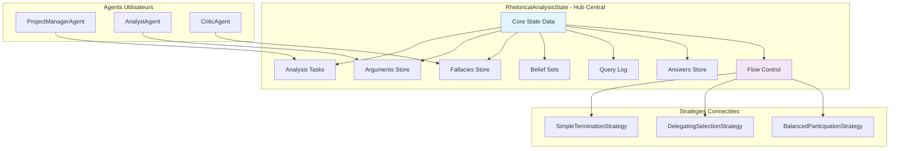

# Architecture de l'État Partagé - RhetoricalAnalysisState

## 🎯 Vue d'Ensemble

Le **RhetoricalAnalysisState** constitue le **hub central** de coordination entre toutes les stratégies d'argumentation, offrant un état partagé sophistiqué qui permet la synchronisation et la communication inter-stratégies.

## 🏗️ Architecture de l'État Partagé

### Conception Modulaire



## 📊 Structure des Données

### Classe RhetoricalAnalysisState Complète

```python
class RhetoricalAnalysisState:
    """
    État partagé sophistiqué pour analyse rhétorique collaborative.
    Hub central de coordination inter-stratégies et inter-agents.
    """
    
    def __init__(self, initial_text: str):
        # 🎯 DONNÉES FONDAMENTALES
        self.raw_text: str = initial_text
        self.instance_id: str = f"ras_{id(self)}"
        self.created_at: str = datetime.now().isoformat()
        
        # 📝 DONNÉES D'ANALYSE STRUCTURÉES
        self.analysis_tasks: Dict[str, str] = {}  # {task_id: description}
        self.identified_arguments: Dict[str, str] = {}  # {arg_id: description}
        self.identified_fallacies: Dict[str, Dict[str, str]] = {}  # {fallacy_id: metadata}
        self.belief_sets: Dict[str, Dict[str, str]] = {}  # {bs_id: logic_data}
        self.query_log: List[Dict[str, str]] = []  # Historique requêtes logiques
        self.answers: Dict[str, Dict[str, Any]] = {}  # {task_id: answer_data}
        self.extracts: List[Dict[str, Any]] = []  # Extraits d'analyse
        self.errors: List[Dict[str, str]] = []  # Erreurs rencontrées
        
        # 🎛️ CONTRÔLE DE FLUX INTER-STRATÉGIES
        self.final_conclusion: Optional[str] = None  # Trigger terminaison
        self._next_agent_designated: Optional[str] = None  # Contrôle sélection
        
        # 📊 MÉTRIQUES ET MÉTADONNÉES
        self._operation_count: int = 0
        self._last_modified: str = self.created_at
        self._state_version: int = 1
```

### Propriétés de Contrôle de Flux

```python
class RhetoricalAnalysisState:
    # ... (attributs de base)
    
    @property
    def next_agent_designation(self) -> Optional[str]:
        """Accès sécurisé à la désignation d'agent"""
        return self._next_agent_designated
    
    @next_agent_designation.setter
    def next_agent_designation(self, agent_name: Optional[str]):
        """Définition avec validation et logging"""
        if agent_name != self._next_agent_designated:
            old_designation = self._next_agent_designated
            self._next_agent_designated = agent_name
            self._update_metadata()
            state_logger.info(f"[{self.instance_id}] Désignation agent: {old_designation} -> {agent_name}")
    
    @property
    def is_complete(self) -> bool:
        """Détermine si l'analyse est considérée comme complète"""
        return (
            self.final_conclusion is not None or
            len(self.answers) >= len(self.analysis_tasks) and len(self.analysis_tasks) > 0
        )
    
    @property 
    def progress_percentage(self) -> float:
        """Calcule le pourcentage de progression de l'analyse"""
        if not self.analysis_tasks:
            return 0.0
        answered_tasks = len([task_id for task_id in self.analysis_tasks if task_id in self.answers])
        return (answered_tasks / len(self.analysis_tasks)) * 100.0
```

## 🔄 Méthodes de Gestion des Données

### Gestion des Tâches d'Analyse

```python
def add_task(self, description: str, priority: str = "normal") -> str:
    """Ajoute une tâche d'analyse avec priorité"""
    task_id = self._generate_id("task", self.analysis_tasks)
    task_data = {
        'description': description,
        'priority': priority,
        'created_at': datetime.now().isoformat(),
        'status': 'pending'
    }
    self.analysis_tasks[task_id] = task_data
    self._update_metadata()
    state_logger.info(f"[{self.instance_id}] Tâche ajoutée: {task_id} - {description[:50]}...")
    return task_id

def complete_task(self, task_id: str, result: Any, agent_name: str) -> bool:
    """Marque une tâche comme complétée avec résultat"""
    if task_id not in self.analysis_tasks:
        state_logger.warning(f"[{self.instance_id}] Tâche inconnue: {task_id}")
        return False
    
    answer_data = {
        'task_id': task_id,
        'result': result,
        'agent_name': agent_name,
        'completed_at': datetime.now().isoformat(),
        'source_ids': []  # Références aux arguments/analyses utilisés
    }
    self.answers[task_id] = answer_data
    self.analysis_tasks[task_id]['status'] = 'completed'
    self._update_metadata()
    
    state_logger.info(f"[{self.instance_id}] Tâche complétée: {task_id} par {agent_name}")
    return True

def get_pending_tasks(self) -> Dict[str, str]:
    """Retourne les tâches en attente"""
    return {
        task_id: task_data['description'] 
        for task_id, task_data in self.analysis_tasks.items() 
        if task_data.get('status') == 'pending'
    }
```

### Gestion des Arguments et Sophismes

```python
def add_argument(self, description: str, category: str = "general", 
                 strength: float = 0.5, source_agent: str = None) -> str:
    """Ajoute un argument avec métadonnées enrichies"""
    arg_id = self._generate_id("arg", self.identified_arguments)
    
    argument_data = {
        'description': description,
        'category': category,
        'strength': max(0.0, min(1.0, strength)),  # Normalisation 0-1
        'source_agent': source_agent,
        'created_at': datetime.now().isoformat(),
        'related_tasks': [],
        'supporting_evidence': [],
        'counter_arguments': []
    }
    
    self.identified_arguments[arg_id] = argument_data
    self._update_metadata()
    state_logger.info(f"[{self.instance_id}] Argument ajouté: {arg_id} (force: {strength})")
    return arg_id

def add_fallacy(self, fallacy_type: str, justification: str, 
                target_arg_id: Optional[str] = None, severity: str = "medium") -> str:
    """Ajoute un sophisme avec analyse de sévérité"""
    fallacy_id = self._generate_id("fallacy", self.identified_fallacies)
    
    fallacy_data = {
        'type': fallacy_type,
        'justification': justification,
        'severity': severity,  # low, medium, high, critical
        'target_argument_id': target_arg_id,
        'detected_at': datetime.now().isoformat(),
        'detection_confidence': 0.8,  # Score de confiance
        'remediation_suggestions': []
    }
    
    # Validation de l'argument cible
    if target_arg_id and target_arg_id not in self.identified_arguments:
        state_logger.warning(f"[{self.instance_id}] Argument cible {target_arg_id} introuvable")
        fallacy_data['target_validation'] = 'invalid'
    else:
        fallacy_data['target_validation'] = 'valid'
    
    self.identified_fallacies[fallacy_id] = fallacy_data
    self._update_metadata()
    state_logger.info(f"[{self.instance_id}] Sophisme ajouté: {fallacy_id} ({fallacy_type})")
    return fallacy_id
```

### Gestion des Belief Sets et Requêtes Logiques

```python
def add_belief_set(self, logic_type: str, content: str, 
                   source_agent: str = None, confidence: float = 1.0) -> str:
    """Ajoute un belief set avec métadonnées logiques"""
    normalized_type = logic_type.strip().lower().replace(" ", "_")
    bs_id = self._generate_id(f"{normalized_type}_bs", self.belief_sets)
    
    belief_data = {
        'logic_type': logic_type,
        'content': content,
        'source_agent': source_agent,
        'confidence': max(0.0, min(1.0, confidence)),
        'created_at': datetime.now().isoformat(),
        'query_count': 0,
        'last_queried': None,
        'validation_status': 'pending'  # pending, valid, invalid
    }
    
    self.belief_sets[bs_id] = belief_data
    self._update_metadata()
    state_logger.info(f"[{self.instance_id}] Belief Set ajouté: {bs_id} ({logic_type})")
    return bs_id

def log_query(self, belief_set_id: str, query: str, raw_result: str,
              query_type: str = "inference", success: bool = True) -> str:
    """Enregistre une requête avec métadonnées détaillées"""
    log_id = self._generate_id("qlog", self.query_log)
    
    query_entry = {
        'log_id': log_id,
        'belief_set_id': belief_set_id,
        'query': query,
        'query_type': query_type,
        'raw_result': raw_result,
        'success': success,
        'execution_time_ms': 0,  # À remplir par l'appelant
        'timestamp': datetime.now().isoformat()
    }
    
    # Validation du belief set
    if belief_set_id in self.belief_sets:
        self.belief_sets[belief_set_id]['query_count'] += 1
        self.belief_sets[belief_set_id]['last_queried'] = query_entry['timestamp']
        query_entry['belief_set_valid'] = True
    else:
        query_entry['belief_set_valid'] = False
        state_logger.warning(f"[{self.instance_id}] Belief Set {belief_set_id} introuvable pour requête")
    
    self.query_log.append(query_entry)
    self._update_metadata()
    state_logger.debug(f"[{self.instance_id}] Requête enregistrée: {log_id}")
    return log_id
```

## 🎛️ Contrôle de Flux Inter-Stratégies

### Coordination Terminaison/Sélection

```python
def designate_next_agent(self, agent_name: str, reason: str = None) -> None:
    """
    Désigne explicitement l'agent suivant pour coordination inter-stratégies.
    Utilisé par DelegatingSelectionStrategy et BalancedParticipationStrategy.
    """
    old_designation = self._next_agent_designated
    self.next_agent_designation = agent_name
    
    # Logging détaillé pour debugging
    reason_info = f" (raison: {reason})" if reason else ""
    state_logger.info(f"[{self.instance_id}] Désignation: {old_designation} -> {agent_name}{reason_info}")

def clear_agent_designation(self) -> None:
    """Efface la désignation pour retourner à la sélection par défaut"""
    if self._next_agent_designated:
        old_designation = self._next_agent_designated
        self.next_agent_designation = None
        state_logger.info(f"[{self.instance_id}] Désignation effacée: {old_designation}")

def set_final_conclusion(self, conclusion: str, agent_name: str = None) -> None:
    """
    Définit la conclusion finale, déclenchant la terminaison.
    Utilisé par SimpleTerminationStrategy pour coordination.
    """
    self.final_conclusion = conclusion
    self._update_metadata()
    
    agent_info = f" par {agent_name}" if agent_name else ""
    state_logger.info(f"[{self.instance_id}] Conclusion finale définie{agent_info}: {conclusion[:100]}...")
    
    # Notification pour debugging
    if hasattr(self, '_conclusion_callbacks'):
        for callback in self._conclusion_callbacks:
            try:
                callback(conclusion, agent_name)
            except Exception as e:
                state_logger.error(f"[{self.instance_id}] Erreur callback conclusion: {e}")

def requires_immediate_termination(self) -> bool:
    """Vérifie si une terminaison immédiate est requise"""
    return (
        self.final_conclusion is not None or
        len(self.errors) > 5 or  # Trop d'erreurs
        self._operation_count > 1000  # Limite sécurité
    )
```

## 📊 Métriques et Observabilité

### Système de Métriques Intégré

```python
def get_state_metrics(self) -> Dict[str, Any]:
    """Retourne les métriques complètes de l'état"""
    return {
        'basic_metrics': {
            'instance_id': self.instance_id,
            'created_at': self.created_at,
            'last_modified': self._last_modified,
            'operation_count': self._operation_count,
            'state_version': self._state_version
        },
        'content_metrics': {
            'raw_text_length': len(self.raw_text),
            'tasks_total': len(self.analysis_tasks),
            'tasks_completed': len(self.answers),
            'arguments_count': len(self.identified_arguments),
            'fallacies_count': len(self.identified_fallacies),
            'belief_sets_count': len(self.belief_sets),
            'queries_total': len(self.query_log),
            'errors_count': len(self.errors)
        },
        'progress_metrics': {
            'completion_percentage': self.progress_percentage,
            'is_complete': self.is_complete,
            'has_conclusion': self.final_conclusion is not None,
            'agent_designated': self._next_agent_designated is not None
        },
        'quality_metrics': {
            'average_argument_strength': self._calculate_avg_argument_strength(),
            'fallacy_density': self._calculate_fallacy_density(),
            'query_success_rate': self._calculate_query_success_rate()
        }
    }

def _calculate_avg_argument_strength(self) -> float:
    """Calcule la force moyenne des arguments"""
    if not self.identified_arguments:
        return 0.0
    strengths = [arg.get('strength', 0.5) for arg in self.identified_arguments.values()]
    return sum(strengths) / len(strengths)

def _calculate_fallacy_density(self) -> float:
    """Calcule la densité de sophismes par rapport aux arguments"""
    if not self.identified_arguments:
        return 0.0
    return len(self.identified_fallacies) / len(self.identified_arguments)

def _calculate_query_success_rate(self) -> float:
    """Calcule le taux de succès des requêtes logiques"""
    if not self.query_log:
        return 0.0
    successful = sum(1 for query in self.query_log if query.get('success', True))
    return successful / len(self.query_log)
```

### Gestion des Métadonnées

```python
def _update_metadata(self) -> None:
    """Met à jour les métadonnées de l'état"""
    self._operation_count += 1
    self._last_modified = datetime.now().isoformat()
    self._state_version += 1

def _generate_id(self, prefix: str, collection: Any) -> str:
    """Génère un ID unique avec préfixe"""
    try:
        if isinstance(collection, (dict, list)):
            index = len(collection)
        else:
            index = 0
            state_logger.warning(f"[{self.instance_id}] Type inattendu pour génération ID: {type(collection)}")
    except Exception as e:
        state_logger.error(f"[{self.instance_id}] Erreur génération ID: {e}")
        index = 999
    
    safe_index = min(index, 9999)  # Limite sécurité
    return f"{prefix}_{safe_index + 1:04d}"  # Format: prefix_0001

def export_state_snapshot(self) -> Dict[str, Any]:
    """Exporte un snapshot complet de l'état pour persistance"""
    return {
        'metadata': {
            'instance_id': self.instance_id,
            'created_at': self.created_at,
            'last_modified': self._last_modified,
            'state_version': self._state_version,
            'operation_count': self._operation_count
        },
        'content': {
            'raw_text': self.raw_text,
            'analysis_tasks': self.analysis_tasks,
            'identified_arguments': self.identified_arguments,
            'identified_fallacies': self.identified_fallacies,
            'belief_sets': self.belief_sets,
            'query_log': self.query_log,
            'answers': self.answers,
            'extracts': self.extracts,
            'errors': self.errors
        },
        'control': {
            'final_conclusion': self.final_conclusion,
            'next_agent_designated': self._next_agent_designated
        },
        'metrics': self.get_state_metrics()
    }
```

## 🔄 Patterns d'Utilisation

### Pattern de Coordination Complète

```python
# Exemple d'utilisation coordonnée entre stratégies
async def coordinated_analysis_workflow():
    """Workflow avec coordination complète via état partagé"""
    
    # 1. Initialisation de l'état partagé
    state = RhetoricalAnalysisState("Texte d'analyse complexe")
    
    # 2. Configuration des tâches initiales
    task1 = state.add_task("Identifier arguments principaux", "high")
    task2 = state.add_task("Détecter sophismes éventuels", "medium")
    task3 = state.add_task("Évaluer cohérence logique", "low")
    
    # 3. Création des stratégies avec état partagé
    agents = [ProjectManagerAgent(), AnalystAgent(), CriticAgent()]
    termination = SimpleTerminationStrategy(state, max_steps=15)
    selection = BalancedParticipationStrategy(agents, state, "ProjectManagerAgent")
    
    # 4. Workflow coordonné
    turn = 0
    history = []
    
    while not await termination.should_terminate(None, history):
        # Sélection d'agent via état partagé
        selected_agent = await selection.next(agents, history)
        
        # Traitement de tâche par l'agent
        pending_tasks = state.get_pending_tasks()
        if pending_tasks:
            task_id = next(iter(pending_tasks))
            result = await selected_agent.process_task(state, task_id)
            state.complete_task(task_id, result, selected_agent.name)
        
        # Vérification de progression
        if state.progress_percentage >= 100.0:
            state.set_final_conclusion("Analyse complétée avec succès", selected_agent.name)
        
        # Coordination dynamique (exemple)
        if turn == 5:  # Après 5 tours, forcer l'analyste
            state.designate_next_agent("AnalystAgent", "Analyse détaillée requise")
        
        turn += 1
        
    # 5. Résultats avec métriques
    return {
        'state': state,
        'metrics': state.get_state_metrics(),
        'final_snapshot': state.export_state_snapshot()
    }
```

## 🎯 Avantages de l'Architecture

### Coordination Inter-Stratégies

1. **Synchronisation parfaite** : Toutes les stratégies partagent le même état
2. **Communication directe** : Pas de canal de communication séparé nécessaire
3. **Contrôle centralisé** : Désignation et terminaison coordonnées
4. **Cohérence garantie** : Pas de conflits d'état entre composants

### Extensibilité et Maintenabilité

1. **Nouvelle stratégie facile** : Injection d'état standard
2. **Debugging simplifié** : État centralisé observable
3. **Métriques complètes** : Observabilité intégrée
4. **Persistance simple** : Snapshot complet exportable

### Performance et Robustesse

1. **Accès optimisé** : Pas de sérialisation inter-processus
2. **Mémoire maîtrisée** : Structure de données efficace
3. **Gestion d'erreurs** : Récupération gracieuse
4. **Limites sécurisées** : Protection contre débordements

---

*Architecture d'état partagé sophistiquée - Hub central de coordination validé*