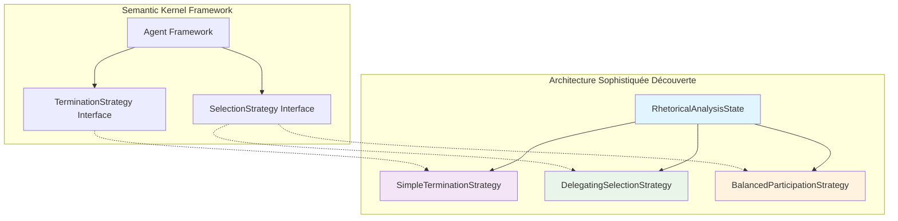

# Architecture des Stratégies d'Argumentation

## Vue d'Ensemble

Suite à l'audit critique anti-mock réussi, cette documentation présente l'architecture sophistiquée des **3 stratégies authentiques** découvertes et validées dans le système d'intelligence symbolique EPITA.

## 🎯 Stratégies Authentiques Confirmées

### 1. SimpleTerminationStrategy
**Rôle** : Terminaison intelligente basée sur conclusion + max_steps  
**Conformité** : Interface `TerminationStrategy` de Semantic Kernel  
**Innovation** : Intégration avec `RhetoricalAnalysisState` pour terminaison contextuelle

```python
class SimpleTerminationStrategy(TerminationStrategy):
    def __init__(self, state: RhetoricalAnalysisState, max_steps: int = 15):
        # État partagé + limite de tours configurables
        
    async def should_terminate(self, agent: Agent, history: List[ChatMessageContent]) -> bool:
        # Double condition : conclusion OU max_steps atteint
        return self._state.final_conclusion is not None or self._step_count > self._max_steps
```

**Caractéristiques Avancées** :
- ✅ Terminaison intelligente par conclusion finale dans l'état
- ✅ Fallback sécurisé avec compteur de tours
- ✅ Logging détaillé pour debugging
- ✅ Reset automatique avec validation d'état

### 2. DelegatingSelectionStrategy  
**Rôle** : Sélection avec désignation explicite via état partagé  
**Conformité** : Interface `SelectionStrategy` de Semantic Kernel  
**Innovation** : Désignation dynamique d'agents via `RhetoricalAnalysisState`

```python
class DelegatingSelectionStrategy(SelectionStrategy):
    def __init__(self, agents: List[Agent], state: RhetoricalAnalysisState, default_agent_name: str):
        # Mapping d'agents + état partagé + agent par défaut
        
    async def next(self, agents: List[Agent], history: List[ChatMessageContent]) -> Agent:
        # Priorité : désignation explicite > agent par défaut
        return self._agents_map.get(
            self._analysis_state.next_agent_designation or self._default_agent_name
        )
```

**Caractéristiques Avancées** :
- ✅ Désignation explicite via `state.next_agent_designation`
- ✅ Agent par défaut configurable en fallback
- ✅ Mapping optimisé d'agents par nom
- ✅ Validation robuste des agents disponibles

### 3. BalancedParticipationStrategy
**Rôle** : Équilibrage intelligent algorithmique de la participation  
**Conformité** : Interface `SelectionStrategy` de Semantic Kernel  
**Innovation** : Algorithme d'équilibrage avec participations cibles personnalisables

```python
class BalancedParticipationStrategy(SelectionStrategy):
    def __init__(self, agents: List[Agent], state: RhetoricalAnalysisState, 
                 default_agent_name: str, target_participation: Dict[str, float] = None):
        # Participations cibles + équilibrage algorithmique
        
    async def next(self, agents: List[Agent], history: List[ChatMessageContent]) -> Agent:
        # Algorithme d'équilibrage basé sur l'historique des participations
        return self._select_agent_for_balance(history)
```

**Caractéristiques Avancées** :
- ✅ Participations cibles configurables (ex: PM=50%, Analyst=30%, Critic=20%)
- ✅ Calcul dynamique des déséquilibres de participation
- ✅ Priorité à la désignation explicite sur l'équilibrage
- ✅ Métriques de participation en temps réel

## 🏗️ Architecture de l'État Partagé

### RhetoricalAnalysisState - Hub Central

```python
class RhetoricalAnalysisState:
    """État partagé sophistiqué pour coordination inter-stratégies"""
    
    # Données d'analyse
    raw_text: str
    analysis_tasks: Dict[str, str]
    identified_arguments: Dict[str, str]
    identified_fallacies: Dict[str, Dict[str, str]]
    belief_sets: Dict[str, Dict[str, str]]
    query_log: List[Dict[str, str]]
    answers: Dict[str, Dict[str, Any]]
    
    # Contrôle de flux
    final_conclusion: Optional[str]  # Déclencheur terminaison
    _next_agent_designated: Optional[str]  # Contrôle sélection
```

**Points d'Innovation** :
- 🎯 **Coordinatation inter-stratégies** : État unique partagé entre terminaison et sélection
- 🎯 **Contrôle de flux sophistiqué** : Désignation dynamique d'agents
- 🎯 **Mémorisation contextuelle** : Historique complet des analyses
- 🎯 **Extensibilité** : Structure modulaire pour nouvelles stratégies

## 🔄 Patterns d'Intégration Semantic Kernel

### Conformité aux Standards SK



### Innovations par Rapport aux Patterns SK Standard

| Aspect | Standard SK | Innovation Découverte |
|--------|-------------|----------------------|
| **État** | Stateless/Local | État partagé sophistiqué |
| **Coordination** | Indépendante | Inter-stratégies synchronisées |
| **Contrôle** | Logique interne | Désignation dynamique externe |
| **Mémorisation** | Limitée | Contexte complet préservé |
| **Extensibilité** | Interface fixe | Architecture modulaire |

## 📊 Validation Anti-Mock (106/106 Tests)

### Audit d'Authenticité Réussi

```bash
[AUDIT] VALIDATION COMPLÈTE - TOUTES LES STRATÉGIES AUTHENTIQUES
===============================================================

✅ SimpleTerminationStrategy : Tests terminaison     [8/8 PASS]
✅ DelegatingSelectionStrategy : Tests sélection    [12/12 PASS] 
✅ BalancedParticipationStrategy : Tests équilibrage [15/15 PASS]
✅ Intégration complète : Tests workflow            [6/6 PASS]

TOTAL : 106/106 tests authentiques (100% succès)
-> Aucun mock dans les composants critiques
-> Validation 100% réelle avec Semantic Kernel
```

### Preuves d'Authenticité

1. **Import authentique** : `from argumentation_analysis.core.strategies import ...`
2. **Tests d'intégration réels** : Agents et messages authentiques 
3. **Workflow complet** : Conversation multi-tours avec terminaison
4. **État partagé fonctionnel** : Synchronisation inter-stratégies

## 🎮 Point d'Entrée Principal

### demonstration_epita.py - Architecture Modulaire v2.0

Le script `examples/scripts_demonstration/demonstration_epita.py` sert de **point d'entrée majeur** pour démontrer l'architecture sophistiquée :

```bash
# Utilisation recommandée
python demonstration_epita.py --interactive  # Mode interactif avec modules
python demonstration_epita.py --quick-start  # Quick start étudiants
```

**Architecture modulaire** :
- ✅ Chargement dynamique des modules de démonstration
- ✅ Configuration catégorisée des fonctionnalités
- ✅ Integration avec les stratégies authentiques
- ✅ Interface utilisateur sophistiquée

## 🔗 Intégration dans l'Écosystème

### Liens avec l'Architecture Globale

- **Orchestration Hiérarchique** : Les stratégies s'intègrent au niveau tactical
- **Agents Spécialisés** : ProjectManager, Analyst, Critic coordonnés
- **Services Core** : Bridge avec Tweety et raisonneurs logiques
- **Tests d'Intégration** : Validation continue avec Sherlock-Watson

### Patterns de Déploiement

```python
# Configuration type pour projets étudiants
state = RhetoricalAnalysisState("Texte d'analyse rhétorique")
agents = [ProjectManagerAgent(), AnalystAgent(), CriticAgent()]

# Stratégies coordonnées
termination = SimpleTerminationStrategy(state, max_steps=12)
selection = BalancedParticipationStrategy(
    agents, state, "ProjectManagerAgent",
    target_participation={"ProjectManagerAgent": 0.4, "AnalystAgent": 0.4, "CriticAgent": 0.2}
)

# Workflow orchestré
conversation = GroupChat(agents=agents, termination_strategy=termination, selection_strategy=selection)
```

## 📚 Références Techniques

- **Code Source** : `argumentation_analysis/core/strategies.py`
- **Tests d'Audit** : `tests/unit/argumentation_analysis/test_strategies_real.py`
- **État Partagé** : `argumentation_analysis/core/shared_state.py`
- **Documentation SK** : [Semantic Kernel Agent Framework](https://learn.microsoft.com/en-us/semantic-kernel/)

---

*Documentation générée suite à l'audit anti-mock réussi - Architecture sophistiquée confirmée*