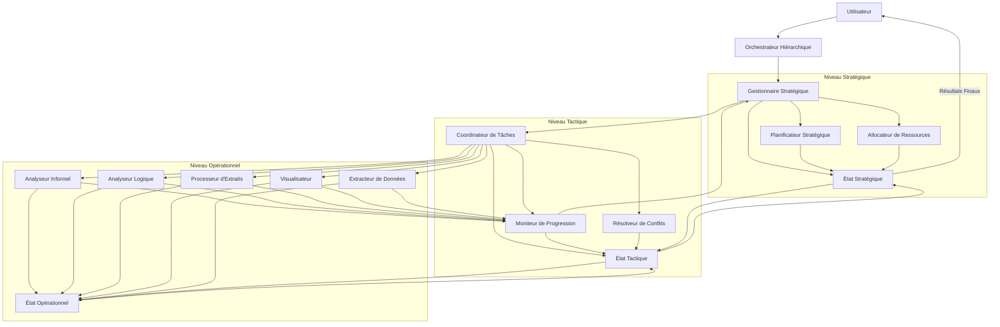
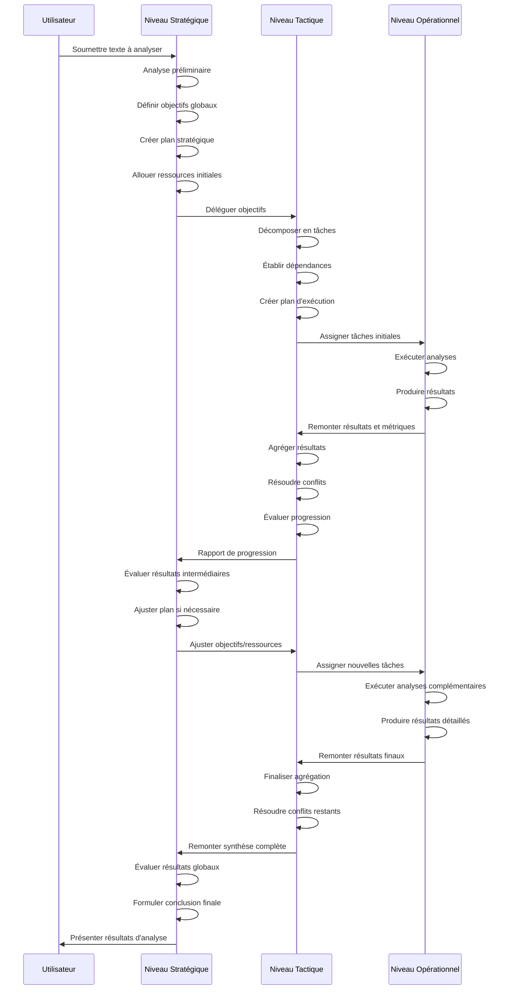
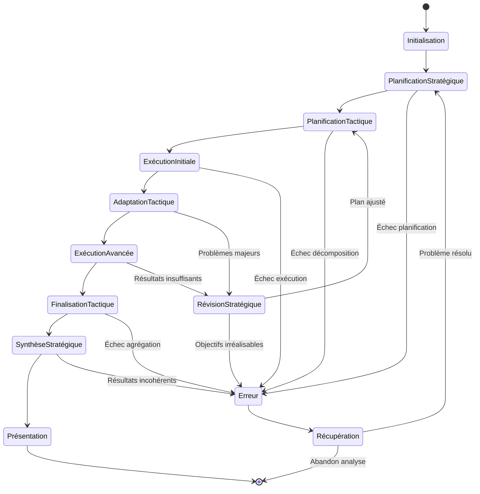

# Architecture Hiérarchique à Trois Niveaux pour le Système d'Orchestration d'Analyse Rhétorique

## Table des matières

1. [Introduction](#1-introduction)
   - [Contexte et objectifs](#11-contexte-et-objectifs)
   - [Rappel des limitations de l'architecture actuelle](#12-rappel-des-limitations-de-larchitecture-actuelle)
   - [Vision globale de la nouvelle architecture](#13-vision-globale-de-la-nouvelle-architecture)

2. [Architecture Globale du Système](#2-architecture-globale-du-système)
   - [Vue d'ensemble de l'architecture à trois niveaux](#21-vue-densemble-de-larchitecture-à-trois-niveaux)
   - [Principes architecturaux fondamentaux](#22-principes-architecturaux-fondamentaux)
   - [Composants principaux et leurs interactions](#23-composants-principaux-et-leurs-interactions)

3. [Niveau Stratégique](#3-niveau-stratégique)
   - [Responsabilités et objectifs](#31-responsabilités-et-objectifs)
   - [Agents stratégiques et leurs rôles](#32-agents-stratégiques-et-leurs-rôles)
   - [État stratégique et gestion des ressources](#33-état-stratégique-et-gestion-des-ressources)
   - [Mécanismes de planification et d'évaluation](#34-mécanismes-de-planification-et-dévaluation)

4. [Niveau Tactique](#4-niveau-tactique)
   - [Responsabilités et objectifs](#41-responsabilités-et-objectifs)
   - [Agents tactiques et leurs rôles](#42-agents-tactiques-et-leurs-rôles)
   - [État tactique et suivi des tâches](#43-état-tactique-et-suivi-des-tâches)
   - [Mécanismes de coordination et d'adaptation](#44-mécanismes-de-coordination-et-dadaptation)

5. [Niveau Opérationnel](#5-niveau-opérationnel)
   - [Responsabilités et objectifs](#51-responsabilités-et-objectifs)
   - [Agents opérationnels et leurs rôles](#52-agents-opérationnels-et-leurs-rôles)
   - [État opérationnel et résultats d'analyse](#53-état-opérationnel-et-résultats-danalyse)
   - [Mécanismes d'exécution et de reporting](#54-mécanismes-dexécution-et-de-reporting)

6. [Interfaces Entre les Niveaux](#6-interfaces-entre-les-niveaux)
   - [Interface stratégique-tactique](#61-interface-stratégique-tactique)
   - [Interface tactique-opérationnelle](#62-interface-tactique-opérationnelle)
   - [Mécanismes de communication inter-niveaux](#63-mécanismes-de-communication-inter-niveaux)
   - [Gestion des exceptions et escalade](#64-gestion-des-exceptions-et-escalade)

7. [Flux de Données et de Contrôle](#7-flux-de-données-et-de-contrôle)
   - [Flux top-down : délégation et directives](#71-flux-top-down--délégation-et-directives)
   - [Flux bottom-up : reporting et feedback](#72-flux-bottom-up--reporting-et-feedback)
   - [Synchronisation des états entre niveaux](#73-synchronisation-des-états-entre-niveaux)
   - [Cycle de vie d'une analyse complète](#74-cycle-de-vie-dune-analyse-complète)

8. [Patterns de Conception Recommandés](#8-patterns-de-conception-recommandés)
   - [Patterns pour le niveau stratégique](#81-patterns-pour-le-niveau-stratégique)
   - [Patterns pour le niveau tactique](#82-patterns-pour-le-niveau-tactique)
   - [Patterns pour le niveau opérationnel](#83-patterns-pour-le-niveau-opérationnel)
   - [Patterns pour la communication inter-niveaux](#84-patterns-pour-la-communication-inter-niveaux)

9. [Diagrammes d'Architecture](#9-diagrammes-darchitecture)
   - [Diagramme de l'architecture globale](#91-diagramme-de-larchitecture-globale)
   - [Diagramme des composants par niveau](#92-diagramme-des-composants-par-niveau)
   - [Diagramme de séquence du flux d'analyse](#93-diagramme-de-séquence-du-flux-danalyse)
   - [Diagramme d'état du système](#94-diagramme-détat-du-système)

10. [Implémentation et Migration](#10-implémentation-et-migration)
    - [Stratégie de migration depuis l'architecture actuelle](#101-stratégie-de-migration-depuis-larchitecture-actuelle)
    - [Plan d'implémentation par phases](#102-plan-dimplémentation-par-phases)
    - [Considérations techniques](#103-considérations-techniques)
    - [Tests et validation](#104-tests-et-validation)

11. [Conclusion](#11-conclusion)
    - [Avantages de la nouvelle architecture](#111-avantages-de-la-nouvelle-architecture)
    - [Défis potentiels et mitigations](#112-défis-potentiels-et-mitigations)
    - [Perspectives d'évolution future](#113-perspectives-dévolution-future)

## 1. Introduction

### 1.1 Contexte et objectifs

Le système d'analyse rhétorique est une application collaborative multi-agents conçue pour analyser des textes sous différents angles. Il utilise plusieurs agents IA spécialisés qui collaborent pour identifier des arguments, détecter des sophismes, et effectuer des analyses logiques formelles. Le système est actuellement construit sur le framework Semantic Kernel avec une approche d'orchestration basée sur la modification d'un état partagé et la désignation explicite des agents.

L'objectif de cette refonte architecturale est d'implémenter une architecture hiérarchique à trois niveaux (stratégique, tactique, opérationnel) pour améliorer la scalabilité, la modularité et l'efficacité du système. Cette nouvelle architecture vise à:

- Séparer clairement les responsabilités entre les différents niveaux de décision
- Améliorer la coordination entre les agents
- Faciliter l'ajout de nouveaux agents et fonctionnalités
- Optimiser la gestion des ressources et la planification des tâches
- Permettre une meilleure adaptation à des analyses de complexité variable

### 1.2 Rappel des limitations de l'architecture actuelle

L'architecture actuelle présente plusieurs limitations importantes qui justifient cette refonte:

1. **Architecture plate sans hiérarchie claire**: Tous les agents sont au même niveau hiérarchique, sans distinction claire entre les rôles stratégiques, tactiques et opérationnels.

2. **Absence de séparation des préoccupations**: Le système ne sépare pas clairement la planification stratégique, la coordination tactique et l'exécution opérationnelle.

3. **Coordination limitée entre agents**: La coordination repose principalement sur la désignation explicite du prochain agent et le partage d'état, sans mécanismes sophistiqués de planification collaborative.

4. **Absence de planification stratégique**: Le système manque de capacités de planification à long terme, de décomposition hiérarchique des objectifs et d'allocation optimale des ressources.

5. **Manque de mécanismes de délégation sophistiqués**: Un agent peut seulement désigner le prochain agent à parler, sans structure pour déléguer des tâches complexes.

6. **Gestion d'état non hiérarchique**: L'état partagé est monolithique et accessible à tous les agents, sans partitionnement par niveau de responsabilité.

7. **Scalabilité limitée**: L'architecture ne scale pas bien avec l'augmentation du nombre d'agents, la complexité de coordination augmentant de manière quadratique.

### 1.3 Vision globale de la nouvelle architecture

La nouvelle architecture hiérarchique à trois niveaux propose une structure claire où:

- Le **niveau stratégique** est responsable de la planification globale, de la définition des objectifs d'analyse et de l'allocation des ressources.
- Le **niveau tactique** est chargé de la coordination des agents, de la décomposition des objectifs en tâches concrètes et du suivi de l'avancement.
- Le **niveau opérationnel** est dédié à l'exécution des tâches spécifiques d'analyse par des agents spécialistes.

Cette architecture introduit des mécanismes formels de communication entre les niveaux, un partitionnement de l'état partagé, et des patterns de conception adaptés à chaque niveau. Elle vise à créer un système plus modulaire, scalable et adaptable, capable de gérer efficacement des analyses rhétoriques de complexité variable.

## 2. Architecture Globale du Système

### 2.1 Vue d'ensemble de l'architecture à trois niveaux

L'architecture hiérarchique à trois niveaux organise le système d'analyse rhétorique en couches distinctes, chacune avec des responsabilités spécifiques:

```
┌─────────────────────────────────────────────────────────┐
│                  NIVEAU STRATÉGIQUE                     │
│                                                         │
│  ┌─────────────┐    ┌─────────────┐    ┌─────────────┐  │
│  │ Gestionnaire│    │ Planificateur│    │ Allocateur  │  │
│  │ Stratégique │    │ Stratégique │    │ Ressources  │  │
│  └─────────────┘    └─────────────┘    └─────────────┘  │
│            │               │                 │          │
└────────────┼───────────────┼─────────────────┼──────────┘
             ▼               ▼                 ▼
┌─────────────────────────────────────────────────────────┐
│                    NIVEAU TACTIQUE                      │
│                                                         │
│  ┌─────────────┐    ┌─────────────┐    ┌─────────────┐  │
│  │Coordinateur │    │ Moniteur de │    │ Résolveur   │  │
│  │  de Tâches  │    │ Progression │    │ de Conflits │  │
│  └─────────────┘    └─────────────┘    └─────────────┘  │
│            │               │                 │          │
└────────────┼───────────────┼─────────────────┼──────────┘
             ▼               ▼                 ▼
┌─────────────────────────────────────────────────────────┐
│                  NIVEAU OPÉRATIONNEL                    │
│                                                         │
│  ┌─────────────┐    ┌─────────────┐    ┌─────────────┐  │
│  │  Analyseur  │    │  Analyseur  │    │ Processeur  │  │
│  │  Informel   │    │   Logique   │    │  d'Extraits │  │
│  └─────────────┘    └─────────────┘    └─────────────┘  │
│                                                         │
│  ┌─────────────┐    ┌─────────────┐    ┌─────────────┐  │
│  │Visualisateur│    │  Extracteur │    │  Autres     │  │
│  │             │    │  de Données │    │  Agents     │  │
│  └─────────────┘    └─────────────┘    └─────────────┘  │
└─────────────────────────────────────────────────────────┘
```

Cette structure permet une séparation claire des préoccupations tout en établissant des canaux de communication formels entre les niveaux. Chaque niveau possède son propre état et ses propres mécanismes de gestion, tout en maintenant une cohérence globale grâce à des interfaces bien définies.

### 2.2 Principes architecturaux fondamentaux

L'architecture proposée repose sur plusieurs principes fondamentaux:

1. **Séparation des préoccupations**: Chaque niveau a des responsabilités distinctes et bien définies, ce qui améliore la modularité et la maintenabilité du système.

2. **Hiérarchie de contrôle**: Les décisions et directives circulent principalement du haut vers le bas (top-down), tandis que les informations et résultats remontent du bas vers le haut (bottom-up).

3. **Partitionnement de l'état**: L'état du système est partitionné entre les trois niveaux, avec des mécanismes de synchronisation contrôlés.

4. **Communication formalisée**: Des interfaces bien définies régissent la communication entre les niveaux, assurant une interaction cohérente et prévisible.

5. **Délégation et agrégation**: Les niveaux supérieurs délèguent des tâches aux niveaux inférieurs et agrègent les résultats remontés.

6. **Autonomie relative**: Chaque niveau dispose d'une certaine autonomie dans son domaine de responsabilité, tout en respectant les contraintes imposées par les niveaux supérieurs.

7. **Extensibilité horizontale**: Chaque niveau peut être étendu horizontalement en ajoutant de nouveaux agents sans perturber l'architecture globale.

8. **Observabilité multi-niveaux**: Des mécanismes de monitoring sont intégrés à chaque niveau pour assurer la visibilité sur le fonctionnement du système.

### 2.3 Composants principaux et leurs interactions

L'architecture comprend plusieurs composants principaux qui interagissent pour former un système cohérent:

1. **Orchestrateur Hiérarchique**: Composant central qui gère l'initialisation du système, la création des agents à chaque niveau, et le routage des messages entre niveaux.

2. **Gestionnaires d'État par Niveau**: Chaque niveau dispose de son propre gestionnaire d'état qui encapsule les données pertinentes pour ce niveau et expose des méthodes d'accès contrôlées.

3. **Agents Spécialisés**: Agents IA adaptés à chaque niveau (stratégique, tactique, opérationnel) avec des instructions et capacités spécifiques.

4. **Interfaces de Communication**: Mécanismes formels pour la communication entre les niveaux, incluant des protocoles de délégation, de reporting et d'escalade.

5. **Stratégies d'Orchestration Hiérarchiques**: Stratégies adaptées à chaque niveau pour la sélection des agents, la terminaison des conversations, et la gestion des tours de parole.

6. **Mécanismes de Synchronisation**: Composants assurant la cohérence des données entre les différents niveaux d'état.

7. **Système de Monitoring et Logging**: Infrastructure pour suivre l'exécution du système à travers les trois niveaux et faciliter le débogage.

Ces composants interagissent selon des patterns bien définis pour assurer une orchestration efficace et cohérente de l'analyse rhétorique.

## 3. Niveau Stratégique

### 3.1 Responsabilités et objectifs

Le niveau stratégique représente la couche supérieure de l'architecture et est responsable de la vision globale de l'analyse. Ses principales responsabilités sont:

1. **Planification stratégique**: Définir un plan d'analyse global basé sur le texte à analyser et les objectifs de l'utilisateur.

2. **Définition des objectifs d'analyse**: Identifier les aspects clés du texte à analyser (arguments, structure logique, sophismes potentiels, etc.).

3. **Allocation des ressources**: Déterminer quels agents et quelles capacités doivent être mobilisés pour l'analyse.

4. **Supervision globale**: Surveiller l'avancement global de l'analyse et ajuster la stratégie si nécessaire.

5. **Prise de décisions stratégiques**: Arbitrer entre différentes approches d'analyse possibles en fonction des contraintes et objectifs.

6. **Évaluation des résultats**: Évaluer la qualité et la pertinence des résultats finaux de l'analyse.

7. **Communication avec l'utilisateur**: Présenter les résultats finaux de l'analyse de manière cohérente et compréhensible.

Le niveau stratégique opère avec une vision à long terme et une perspective globale, en se concentrant sur le "quoi" et le "pourquoi" de l'analyse plutôt que sur le "comment".

### 3.2 Agents stratégiques et leurs rôles

Le niveau stratégique comprend plusieurs agents spécialisés, chacun avec un rôle distinct:

1. **Gestionnaire Stratégique (Strategic Manager)**:
   - Agent principal du niveau stratégique
   - Responsable de la coordination globale entre les agents stratégiques
   - Interface principale avec l'utilisateur et le niveau tactique
   - Prend les décisions finales concernant la stratégie d'analyse
   - Évalue les résultats finaux et formule la conclusion globale

2. **Planificateur Stratégique (Strategic Planner)**:
   - Spécialisé dans la création de plans d'analyse structurés
   - Décompose l'objectif global en sous-objectifs cohérents
   - Établit les dépendances entre les différentes parties de l'analyse
   - Définit les critères de succès pour chaque objectif
   - Ajuste les plans en fonction des feedbacks du niveau tactique

3. **Allocateur de Ressources (Resource Allocator)**:
   - Gère l'allocation des ressources computationnelles et cognitives
   - Détermine quels agents opérationnels doivent être activés
   - Établit les priorités entre les différentes tâches d'analyse
   - Optimise l'utilisation des capacités des agents
   - Ajuste l'allocation en fonction des besoins émergents

Ces agents collaborent étroitement pour définir et superviser la stratégie globale d'analyse, en maintenant une vision cohérente tout au long du processus.

### 3.3 État stratégique et gestion des ressources

L'état stratégique est une partition spécifique de l'état global qui contient les informations pertinentes pour le niveau stratégique:

```python
class StrategicState:
    def __init__(self):
        # Texte à analyser
        self.raw_text = None
        
        # Objectifs globaux de l'analyse
        self.global_objectives = []
        
        # Plan stratégique structuré
        self.strategic_plan = {
            "phases": [],
            "dependencies": {},
            "priorities": {},
            "success_criteria": {}
        }
        
        # Allocation des ressources
        self.resource_allocation = {
            "agent_assignments": {},
            "priority_levels": {},
            "computational_budget": {}
        }
        
        # Métriques globales
        self.global_metrics = {
            "progress": 0.0,
            "quality_indicators": {},
            "resource_utilization": {}
        }
        
        # Conclusion finale
        self.final_conclusion = None
        
        # Historique des décisions stratégiques
        self.strategic_decisions_log = []
```

La gestion des ressources au niveau stratégique implique:

1. **Modélisation des capacités des agents**: Représentation formelle des capacités et limites de chaque type d'agent.

2. **Allocation dynamique**: Ajustement de l'allocation des ressources en fonction des besoins émergents et des résultats intermédiaires.

3. **Priorisation des tâches**: Établissement d'un ordre de priorité pour les différentes tâches d'analyse.

4. **Équilibrage de charge**: Distribution équilibrée du travail entre les agents disponibles.

5. **Monitoring des ressources**: Suivi de l'utilisation des ressources pour éviter les goulots d'étranglement.

### 3.4 Mécanismes de planification et d'évaluation

Le niveau stratégique utilise plusieurs mécanismes sophistiqués pour la planification et l'évaluation:

1. **Planification hiérarchique**: Décomposition des objectifs globaux en sous-objectifs organisés hiérarchiquement.

2. **Analyse préliminaire**: Évaluation rapide du texte pour identifier les aspects clés à analyser.

3. **Définition de métriques de succès**: Établissement de critères mesurables pour évaluer la qualité de l'analyse.

4. **Révision continue du plan**: Ajustement du plan stratégique en fonction des résultats intermédiaires et des obstacles rencontrés.

5. **Évaluation multi-critères**: Évaluation des résultats selon plusieurs dimensions (précision, exhaustivité, pertinence, etc.).

6. **Mécanismes de feedback**: Intégration des retours du niveau tactique pour améliorer la planification.

7. **Apprentissage stratégique**: Amélioration des stratégies d'analyse basée sur l'expérience des analyses précédentes.

Ces mécanismes permettent au niveau stratégique de définir des plans d'analyse adaptés au texte et aux objectifs, tout en restant flexible face aux défis émergents.

## 4. Niveau Tactique

### 4.1 Responsabilités et objectifs

Le niveau tactique constitue la couche intermédiaire de l'architecture et sert de pont entre la vision stratégique et l'exécution opérationnelle. Ses principales responsabilités sont:

1. **Traduction des objectifs en tâches**: Transformer les objectifs stratégiques en tâches concrètes et assignables.

2. **Coordination des agents opérationnels**: Orchestrer les interactions entre les agents spécialisés pour accomplir les tâches.

3. **Suivi de progression**: Monitorer l'avancement des tâches et identifier les blocages ou retards.

4. **Résolution de conflits**: Gérer les contradictions ou incohérences dans les résultats des agents opérationnels.

5. **Adaptation dynamique**: Ajuster les plans d'exécution en fonction des résultats intermédiaires et des obstacles rencontrés.

6. **Agrégation des résultats**: Compiler et synthétiser les résultats des agents opérationnels pour les remonter au niveau stratégique.

7. **Optimisation des workflows**: Identifier et implémenter des améliorations dans les processus d'analyse.

Le niveau tactique se concentre sur le "comment" de l'analyse, en traduisant les directives stratégiques en actions concrètes et en assurant leur exécution efficace.

### 4.2 Agents tactiques et leurs rôles

Le niveau tactique comprend plusieurs agents spécialisés, chacun avec un rôle distinct:

1. **Coordinateur de Tâches (Task Coordinator)**:
   - Agent principal du niveau tactique
   - Décompose les objectifs stratégiques en tâches assignables
   - Attribue les tâches aux agents opérationnels appropriés
   - Établit les séquences et dépendances entre tâches
   - Interface principale avec les niveaux stratégique et opérationnel

2. **Moniteur de Progression (Progress Monitor)**:
   - Suit l'avancement des tâches en temps réel
   - Identifie les retards, blocages ou déviations
   - Collecte les métriques de performance
   - Génère des rapports de progression pour le niveau stratégique
   - Déclenche des alertes en cas de problèmes significatifs

3. **Résolveur de Conflits (Conflict Resolver)**:
   - Détecte et analyse les contradictions dans les résultats
   - Arbitre entre différentes interprétations ou analyses
   - Applique des heuristiques de résolution de conflits
   - Maintient la cohérence globale de l'analyse
   - Escalade les conflits non résolus au niveau stratégique

Ces agents collaborent étroitement pour assurer une exécution efficace et cohérente du plan stratégique, en adaptant dynamiquement les actions en fonction des résultats et obstacles.

### 4.3 État tactique et suivi des tâches

L'état tactique est une partition spécifique de l'état global qui contient les informations pertinentes pour le niveau tactique:

```python
class TacticalState:
    def __init__(self):
        # Objectifs reçus du niveau stratégique
        self.assigned_objectives = []
        
        # Tâches décomposées
        self.tasks = {
            "pending": [],
            "in_progress": [],
            "completed": [],
            "failed": []
        }
        
        # Assignations des tâches
        self.task_assignments = {}
        
        # Dépendances entre tâches
        self.task_dependencies = {}
        
        # Progression des tâches
        self.task_progress = {}
        
        # Résultats intermédiaires
        self.intermediate_results = {}
        
        # Conflits identifiés
        self.identified_conflicts = []
        
        # Métriques tactiques
        self.tactical_metrics = {
            "task_completion_rate": 0.0,
            "agent_utilization": {},
            "conflict_resolution_rate": 0.0
        }
        
        # Journal des actions tactiques
        self.tactical_actions_log = []
```

Le suivi des tâches au niveau tactique implique:

1. **Système de gestion de tâches**: Structure formelle pour représenter les tâches, leurs états et leurs dépendances.

2. **Métriques de progression**: Indicateurs quantitatifs pour mesurer l'avancement des tâches.

3. **Détection de blocages**: Mécanismes pour identifier les tâches bloquées ou en retard.

4. **Traçabilité**: Lien entre les tâches et les objectifs stratégiques dont elles découlent.

5. **Historique d'exécution**: Enregistrement chronologique des actions et décisions tactiques.

### 4.4 Mécanismes de coordination et d'adaptation

Le niveau tactique utilise plusieurs mécanismes sophistiqués pour la coordination et l'adaptation:

1. **Orchestration basée sur les événements**: Réaction aux événements significatifs (complétion de tâche, blocage, conflit, etc.).

2. **Planification adaptative**: Ajustement dynamique des plans d'exécution en fonction des résultats intermédiaires.

3. **Routage intelligent des tâches**: Attribution des tâches aux agents les plus appropriés en fonction de leurs capacités et charge actuelle.

4. **Parallélisation contrôlée**: Exécution simultanée de tâches indépendantes pour optimiser les performances.

5. **Mécanismes de synchronisation**: Coordination des tâches interdépendantes pour assurer la cohérence des résultats.

6. **Stratégies de reprise**: Gestion des échecs de tâches avec mécanismes de retry ou de réallocation.

7. **Communication ciblée**: Transmission sélective d'informations aux agents opérationnels en fonction de leurs besoins.

Ces mécanismes permettent au niveau tactique d'assurer une exécution efficace et adaptative du plan stratégique, en gérant la complexité de la coordination entre agents opérationnels.
## 5. Niveau Opérationnel

### 5.1 Responsabilités et objectifs

Le niveau opérationnel constitue la couche d'exécution de l'architecture et est responsable de la réalisation concrète des tâches d'analyse. Ses principales responsabilités sont:

1. **Exécution des tâches spécifiques**: Réaliser les analyses spécialisées sur le texte ou des portions du texte.

2. **Application des techniques d'analyse**: Utiliser des techniques spécifiques d'analyse rhétorique, logique, linguistique, etc.

3. **Production de résultats concrets**: Générer des outputs spécifiques (arguments identifiés, sophismes détectés, analyses formelles, etc.).

4. **Traitement des données**: Manipuler et transformer le texte pour en extraire des informations pertinentes.

5. **Reporting détaillé**: Documenter les analyses effectuées et leurs résultats de manière structurée.

6. **Signalement des problèmes**: Identifier et remonter les difficultés techniques ou analytiques rencontrées.

7. **Optimisation locale**: Améliorer l'efficacité et la précision des analyses spécifiques.

Le niveau opérationnel se concentre sur l'exécution technique des tâches d'analyse, en appliquant l'expertise spécialisée de chaque agent aux portions pertinentes du texte.

### 5.2 Agents opérationnels et leurs rôles

Le niveau opérationnel comprend plusieurs agents spécialisés, chacun avec une expertise spécifique:

1. **Analyseur Informel (Informal Analyzer)**:
   - Identifie les arguments informels dans le texte
   - Détecte les sophismes et fallacies
   - Analyse la structure argumentative
   - Évalue la force persuasive des arguments
   - Identifie les techniques rhétoriques utilisées

2. **Analyseur Logique (Logic Analyzer)**:
   - Formalise les arguments en logique propositionnelle
   - Vérifie la validité formelle des arguments
   - Identifie les contradictions et incohérences logiques
   - Construit et évalue des modèles logiques
   - Analyse les implications logiques des arguments

3. **Processeur d'Extraits (Extract Processor)**:
   - Extrait des portions pertinentes du texte
   - Prétraite les extraits pour faciliter l'analyse
   - Identifie les relations entre extraits
   - Gère les références croisées entre extraits
   - Maintient la traçabilité entre extraits et analyses

4. **Visualisateur (Visualizer)**:
   - Génère des représentations visuelles des analyses
   - Crée des graphes d'arguments
   - Produit des tableaux de synthèse
   - Formate les résultats pour la présentation
   - Adapte les visualisations aux besoins spécifiques

5. **Extracteur de Données (Data Extractor)**:
   - Extrait des données structurées du texte
   - Identifie les entités, relations et attributs
   - Normalise les données extraites
   - Enrichit les données avec des métadonnées
   - Prépare les données pour l'analyse

Ces agents opérationnels peuvent être étendus ou spécialisés davantage en fonction des besoins spécifiques d'analyse.

### 5.3 État opérationnel et résultats d'analyse

L'état opérationnel est une partition spécifique de l'état global qui contient les informations pertinentes pour le niveau opérationnel:

```python
class OperationalState:
    def __init__(self):
        # Tâches assignées par le niveau tactique
        self.assigned_tasks = []
        
        # Extraits de texte à analyser
        self.text_extracts = {}
        
        # Résultats d'analyse
        self.analysis_results = {
            "identified_arguments": [],
            "identified_fallacies": [],
            "formal_analyses": [],
            "extracted_data": {},
            "visualizations": []
        }
        
        # Problèmes rencontrés
        self.encountered_issues = []
        
        # Métriques opérationnelles
        self.operational_metrics = {
            "processing_times": {},
            "confidence_scores": {},
            "coverage_metrics": {}
        }
        
        # Journal des actions opérationnelles
        self.operational_actions_log = []
```

Les résultats d'analyse produits au niveau opérationnel sont structurés et standardisés pour faciliter leur agrégation et leur interprétation aux niveaux supérieurs:

1. **Arguments identifiés**: Structure formalisée des arguments avec prémisses, conclusion, force, etc.

2. **Sophismes détectés**: Catalogue des sophismes avec type, description, impact, etc.

3. **Analyses formelles**: Représentations logiques formelles avec évaluations de validité.

4. **Données extraites**: Entités, relations et attributs structurés extraits du texte.

5. **Visualisations**: Représentations graphiques des analyses sous différents formats.

### 5.4 Mécanismes d'exécution et de reporting

Le niveau opérationnel utilise plusieurs mécanismes pour l'exécution des tâches et le reporting des résultats:

1. **Exécution spécialisée**: Chaque agent utilise des techniques spécifiques adaptées à son domaine d'expertise.

2. **Traitement contextuel**: Prise en compte du contexte global lors de l'analyse de portions spécifiques du texte.

3. **Reporting structuré**: Format standardisé pour les résultats d'analyse facilitant leur agrégation.

4. **Métriques de qualité**: Indicateurs quantitatifs sur la confiance, la précision et la couverture des analyses.

5. **Signalement d'exceptions**: Protocole formel pour remonter les problèmes techniques ou analytiques.

6. **Optimisation continue**: Ajustement des techniques d'analyse en fonction des feedbacks reçus.

7. **Documentation détaillée**: Traçabilité complète des analyses effectuées et des décisions prises.

Ces mécanismes assurent que les analyses opérationnelles sont précises, traçables et exploitables par les niveaux supérieurs.

## 6. Interfaces Entre les Niveaux

### 6.1 Interface stratégique-tactique

L'interface entre les niveaux stratégique et tactique définit comment les objectifs stratégiques sont traduits en plans tactiques et comment les résultats tactiques sont remontés au niveau stratégique:

#### Flux descendant (stratégique → tactique)

1. **Directive d'objectif**: Le niveau stratégique transmet des objectifs formalisés avec:
   - Description claire de l'objectif
   - Critères de succès
   - Contraintes et priorités
   - Ressources allouées
   - Délais attendus

2. **Contexte global**: Informations contextuelles nécessaires pour comprendre l'objectif:
   - Vue d'ensemble du texte
   - Objectifs globaux de l'analyse
   - Interdépendances avec d'autres objectifs
   - Connaissances préalables pertinentes

3. **Paramètres de contrôle**: Contraintes et préférences pour l'exécution:
   - Niveau de détail requis
   - Balance entre précision et couverture
   - Préférences méthodologiques
   - Limites de ressources

#### Flux ascendant (tactique → stratégique)

1. **Rapport de progression**: Mises à jour régulières sur l'avancement:
   - Pourcentage de complétion
   - Étapes franchies
   - Obstacles rencontrés
   - Ajustements effectués

2. **Résultats agrégés**: Synthèse des résultats opérationnels:
   - Conclusions principales
   - Patterns identifiés
   - Anomalies détectées
   - Métriques de qualité

3. **Demandes d'ajustement**: Requêtes pour modifier les objectifs ou ressources:
   - Clarification d'objectifs ambigus
   - Allocation de ressources supplémentaires
   - Extension de délais
   - Résolution de conflits entre objectifs

### 6.2 Interface tactique-opérationnelle

L'interface entre les niveaux tactique et opérationnel définit comment les plans tactiques sont traduits en tâches opérationnelles et comment les résultats opérationnels sont remontés au niveau tactique:

#### Flux descendant (tactique → opérationnel)

1. **Assignation de tâche**: Le niveau tactique transmet des tâches spécifiques avec:
   - Description précise de la tâche
   - Extraits de texte à analyser
   - Techniques à appliquer
   - Formats de résultats attendus
   - Délais d'exécution

2. **Contexte local**: Informations contextuelles nécessaires pour la tâche:
   - Position de l'extrait dans le texte global
   - Analyses préalables pertinentes
   - Dépendances avec d'autres tâches
   - Contraintes spécifiques

3. **Paramètres d'exécution**: Configurations spécifiques pour l'exécution:
   - Seuils de confiance
   - Niveau de détail
   - Préférences d'analyse
   - Priorité de la tâche

#### Flux ascendant (opérationnel → tactique)

1. **Résultats d'analyse**: Outputs détaillés des analyses effectuées:
   - Arguments identifiés
   - Sophismes détectés
   - Analyses formelles
   - Données extraites
   - Visualisations

2. **Métriques d'exécution**: Indicateurs sur l'exécution de la tâche:
   - Temps de traitement
   - Scores de confiance
   - Couverture de l'analyse
   - Ressources utilisées

3. **Signalement de problèmes**: Notification des difficultés rencontrées:
   - Ambiguïtés dans le texte
   - Limitations techniques
   - Conflits d'interprétation
   - Besoins d'information supplémentaire

### 6.3 Mécanismes de communication inter-niveaux

Plusieurs mécanismes formels assurent une communication efficace entre les niveaux:

1. **Messages structurés**: Format standardisé pour les communications entre niveaux:
   - Type de message (directive, rapport, alerte, etc.)
   - Métadonnées (timestamp, émetteur, destinataire, etc.)
   - Contenu structuré selon le type
   - Niveau de priorité

2. **Canaux dédiés**: Canaux de communication spécifiques pour différents types d'interactions:
   - Canal de directives (top-down)
   - Canal de reporting (bottom-up)
   - Canal d'alertes (bidirectionnel)
   - Canal de synchronisation d'état (bidirectionnel)

3. **Protocoles d'interaction**: Séquences définies pour les interactions complexes:
   - Protocole de délégation d'objectif
   - Protocole de reporting de progression
   - Protocole d'escalade de problème
   - Protocole de synchronisation d'état

4. **Mécanismes de synchronisation**: Outils pour maintenir la cohérence entre niveaux:
   - Points de synchronisation périodiques
   - Verrous pour les modifications critiques
   - Transactions pour les mises à jour multi-niveaux
   - Versionnement des états

### 6.4 Gestion des exceptions et escalade

Des mécanismes spécifiques sont définis pour gérer les situations exceptionnelles:

1. **Détection d'exceptions**: Identification des situations anormales:
   - Dépassement de seuils prédéfinis
   - Violations de contraintes
   - Échecs répétés
   - Incohérences dans les résultats

2. **Classification des exceptions**: Catégorisation des problèmes par type et sévérité:
   - Exceptions techniques (erreurs, timeouts, etc.)
   - Exceptions analytiques (ambiguïtés, contradictions, etc.)
   - Exceptions de ressources (dépassements de budget, etc.)
   - Exceptions de coordination (conflits, blocages, etc.)

3. **Protocoles d'escalade**: Procédures formelles pour remonter les problèmes:
   - Escalade opérationnelle → tactique
   - Escalade tactique → stratégique
   - Escalade d'urgence (court-circuitant les niveaux)
   - Escalade vers l'utilisateur (pour intervention humaine)

4. **Stratégies de récupération**: Mécanismes pour gérer les situations après escalade:
   - Réallocation de ressources
   - Ajustement des objectifs
   - Simplification des tâches
   - Intervention manuelle

Ces mécanismes d'exception et d'escalade assurent que le système peut gérer efficacement les situations imprévues et maintenir la progression de l'analyse malgré les obstacles.

## 7. Flux de Données et de Contrôle

### 7.1 Flux top-down : délégation et directives

Le flux top-down représente la cascade de directives et de contrôle depuis le niveau stratégique jusqu'au niveau opérationnel:

1. **Initialisation de l'analyse**:
   - L'utilisateur soumet un texte à analyser
   - Le niveau stratégique reçoit le texte et définit les objectifs globaux
   - Le Gestionnaire Stratégique coordonne la création du plan d'analyse
   - Le Planificateur Stratégique décompose l'analyse en phases et objectifs
   - L'Allocateur de Ressources détermine les ressources à allouer

2. **Délégation stratégique → tactique**:
   - Le Gestionnaire Stratégique transmet les objectifs au niveau tactique
   - Chaque objectif est accompagné de critères de succès et contraintes
   - Le contexte global et les priorités sont communiqués
   - Des directives sur la méthodologie sont fournies
   - Des points de contrôle pour le reporting sont définis

3. **Planification tactique**:
   - Le Coordinateur de Tâches reçoit les objectifs
   - Il décompose les objectifs en tâches concrètes
   - Il établit les dépendances entre tâches
   - Il définit un plan d'exécution avec séquencement
   - Il prépare les assignations de tâches

4. **Délégation tactique → opérationnelle**:
   - Le Coordinateur de Tâches assigne des tâches aux agents opérationnels
   - Chaque tâche contient des instructions précises
   - Les extraits de texte pertinents sont fournis
   - Les paramètres d'analyse sont spécifiés
   - Les formats de résultats attendus sont définis

5. **Contrôle d'exécution**:
   - Le Moniteur de Progression surveille l'exécution des tâches
   - Des ajustements sont communiqués en fonction des résultats intermédiaires
   - Des priorités dynamiques sont assignées
   - Des ressources supplémentaires peuvent être allouées
   - Des directives de correction sont émises si nécessaire

Ce flux top-down assure que les objectifs stratégiques sont correctement traduits en actions opérationnelles concrètes, avec une chaîne de contrôle claire.

### 7.2 Flux bottom-up : reporting et feedback

Le flux bottom-up représente la remontée d'informations et de résultats depuis le niveau opérationnel jusqu'au niveau stratégique:

1. **Production de résultats opérationnels**:
   - Les agents opérationnels exécutent leurs tâches spécifiques
   - Ils produisent des résultats d'analyse structurés
   - Ils documentent leur processus d'analyse
   - Ils calculent des métriques de qualité
   - Ils signalent les problèmes rencontrés

2. **Reporting opérationnel → tactique**:
   - Les résultats d'analyse sont transmis au niveau tactique
   - Les métriques d'exécution sont communiquées
   - Les problèmes sont signalés avec leur contexte
   - Des suggestions d'amélioration peuvent être incluses
   - L'état de complétion des tâches est mis à jour

3. **Agrégation tactique**:
   - Le Coordinateur de Tâches collecte les résultats des différentes tâches
   - Le Résolveur de Conflits harmonise les résultats contradictoires
   - Le Moniteur de Progression compile les métriques d'avancement
   - Des synthèses intermédiaires sont produites
   - Les problèmes non résolus sont identifiés

4. **Reporting tactique → stratégique**:
   - Des rapports de progression sont transmis au niveau stratégique
   - Les résultats agrégés sont communiqués
   - Les obstacles majeurs sont signalés
   - Des recommandations d'ajustement sont formulées
   - Des métriques globales sont calculées

5. **Évaluation stratégique**:
   - Le Gestionnaire Stratégique évalue les résultats par rapport aux objectifs
   - Le Planificateur Stratégique identifie les ajustements nécessaires au plan
   - L'Allocateur de Ressources révise l'allocation si nécessaire
   - Des décisions stratégiques sont prises pour la suite de l'analyse
   - Une synthèse globale est préparée pour l'utilisateur

Ce flux bottom-up assure que les résultats opérationnels sont correctement agrégés et interprétés pour informer les décisions stratégiques et produire une analyse cohérente.

### 7.3 Synchronisation des états entre niveaux

La synchronisation des états entre les trois niveaux est essentielle pour maintenir la cohérence du système:

1. **Partitionnement vertical de l'état**:
   - L'état global est partitionné en états stratégique, tactique et opérationnel
   - Chaque niveau a accès complet à son propre état
   - L'accès aux états des autres niveaux est contrôlé et limité
   - Des vues spécifiques sont exposées entre niveaux

2. **Mécanismes de propagation des changements**:
   - Propagation descendante: les modifications stratégiques sont répercutées vers le bas
   - Propagation ascendante: les résultats opérationnels sont agrégés vers le haut
   - Propagation sélective: seules les informations pertinentes sont propagées
   - Propagation transactionnelle: certaines mises à jour sont atomiques entre niveaux

3. **Points de synchronisation**:
   - Synchronisation périodique à intervalles prédéfinis
   - Synchronisation événementielle déclenchée par des changements significatifs
   - Synchronisation à la demande initiée par un niveau spécifique
   - Synchronisation complète lors des transitions de phase

4. **Gestion de cohérence**:
   - Versionnement des états pour tracer les évolutions
   - Détection et résolution des conflits entre versions
   - Mécanismes de rollback pour revenir à des états cohérents
   - Validation croisée entre niveaux pour assurer la cohérence

5. **Optimisations de synchronisation**:
   - Synchronisation différentielle (uniquement les changements)
   - Synchronisation asynchrone pour les mises à jour non critiques
   - Synchronisation prioritaire pour les informations urgentes
   - Compression et agrégation des données synchronisées

Ces mécanismes de synchronisation assurent que chaque niveau dispose des informations nécessaires tout en maintenant une séparation claire des préoccupations.

### 7.4 Cycle de vie d'une analyse complète

Le cycle de vie complet d'une analyse rhétorique dans l'architecture à trois niveaux suit ces étapes:

1. **Initialisation**:
   - Réception du texte à analyser et des objectifs de l'utilisateur
   - Configuration initiale du système
   - Création des instances d'agents à chaque niveau
   - Initialisation des états à chaque niveau

2. **Planification stratégique**:
   - Analyse préliminaire du texte
   - Définition des objectifs globaux
   - Création du plan stratégique
   - Allocation initiale des ressources

3. **Planification tactique**:
   - Réception des objectifs stratégiques
   - Décomposition en tâches
   - Établissement des dépendances
   - Création du plan d'exécution

4. **Exécution opérationnelle - Phase 1**:
   - Assignation des premières tâches
   - Exécution des analyses initiales
   - Reporting des premiers résultats
   - Identification des problèmes précoces

5. **Adaptation tactique**:
   - Évaluation des résultats initiaux
   - Ajustement du plan d'exécution
   - Résolution des conflits préliminaires
   - Réassignation des tâches si nécessaire

6. **Exécution opérationnelle - Phase 2**:
   - Exécution des tâches ajustées
   - Analyses approfondies
   - Production de résultats détaillés
   - Signalement des problèmes complexes

7. **Révision stratégique intermédiaire**:
   - Évaluation des progrès globaux
   - Ajustement des objectifs si nécessaire
   - Réallocation des ressources
   - Décisions sur les directions d'analyse

8. **Finalisation tactique**:
   - Complétion des tâches restantes
   - Résolution des conflits finaux
   - Agrégation des résultats complets
   - Préparation des synthèses

9. **Synthèse stratégique**:
   - Évaluation finale des résultats
   - Formulation des conclusions globales
   - Validation de la qualité de l'analyse
   - Préparation du rapport final

10. **Présentation et clôture**:
    - Présentation des résultats à l'utilisateur
    - Archivage de l'analyse
    - Collecte de feedback
    - Apprentissage pour amélioration future

Ce cycle de vie illustre comment les trois niveaux collaborent tout au long du processus d'analyse, avec des boucles de feedback et d'adaptation à chaque étape.
## 8. Patterns de Conception Recommandés

### 8.1 Patterns pour le niveau stratégique

Le niveau stratégique bénéficie de plusieurs patterns de conception adaptés à ses responsabilités de planification et de supervision:

1. **Pattern Stratégie**:
   - Permet de définir une famille d'algorithmes de planification stratégique
   - Encapsule chaque algorithme dans une classe séparée
   - Permet de changer dynamiquement de stratégie d'analyse en fonction du type de texte
   - Facilite l'ajout de nouvelles stratégies sans modifier le code existant

2. **Pattern Observateur**:
   - Permet au niveau stratégique d'observer les changements significatifs aux niveaux inférieurs
   - Implémente un mécanisme de notification pour les événements importants
   - Maintient une vue cohérente de l'état global du système
   - Évite le polling constant pour vérifier les changements d'état

3. **Pattern Chaîne de responsabilité**:
   - Permet de traiter les décisions stratégiques complexes à travers une chaîne d'agents
   - Chaque agent peut traiter une partie de la décision ou la passer au suivant
   - Facilite la décomposition des décisions complexes
   - Permet une spécialisation des agents stratégiques

4. **Pattern Médiateur**:
   - Centralise la communication entre les agents stratégiques
   - Réduit les dépendances directes entre agents
   - Facilite la coordination des activités stratégiques
   - Simplifie l'ajout ou la modification d'agents stratégiques

5. **Pattern Mémento**:
   - Permet de capturer et d'externaliser l'état stratégique
   - Facilite la sauvegarde de points de contrôle stratégiques
   - Permet de revenir à des états antérieurs en cas de problème
   - Supporte l'analyse de scénarios alternatifs

### 8.2 Patterns pour le niveau tactique

Le niveau tactique utilise des patterns adaptés à ses responsabilités de coordination et d'adaptation:

1. **Pattern Composite**:
   - Représente les tâches et leurs compositions hiérarchiques de manière uniforme
   - Permet de traiter les tâches simples et complexes de la même manière
   - Facilite la décomposition récursive des objectifs en tâches
   - Simplifie la gestion des dépendances entre tâches

2. **Pattern État**:
   - Modélise les différents états d'une tâche (en attente, en cours, terminée, échouée)
   - Encapsule les comportements spécifiques à chaque état
   - Facilite les transitions entre états en fonction des événements
   - Clarifie la logique de progression des tâches

3. **Pattern Commande**:
   - Encapsule les requêtes de tâches comme des objets
   - Permet de paramétrer, mettre en file d'attente et journaliser les tâches
   - Supporte l'annulation et la reprise des tâches
   - Facilite l'implémentation de mécanismes de priorité et de planification

4. **Pattern Adaptateur**:
   - Convertit les objectifs stratégiques en tâches opérationnelles compatibles
   - Adapte les interfaces entre niveaux stratégique et opérationnel
   - Facilite l'intégration d'agents avec des capacités différentes
   - Permet l'évolution indépendante des différents niveaux

5. **Pattern Proxy**:
   - Fournit un substitut pour les agents opérationnels
   - Contrôle l'accès aux agents opérationnels
   - Permet une allocation dynamique des agents
   - Facilite l'équilibrage de charge et la gestion des ressources

### 8.3 Patterns pour le niveau opérationnel

Le niveau opérationnel bénéficie de patterns adaptés à ses responsabilités d'exécution et de reporting:

1. **Pattern Stratégie**:
   - Encapsule différentes techniques d'analyse dans des classes séparées
   - Permet de sélectionner dynamiquement la technique appropriée
   - Facilite l'ajout de nouvelles techniques d'analyse
   - Permet la personnalisation des analyses en fonction du contexte

2. **Pattern Décorateur**:
   - Ajoute dynamiquement des fonctionnalités aux analyses de base
   - Permet de combiner différentes techniques d'analyse
   - Facilite l'extension des capacités des agents sans modifier leur code
   - Supporte la composition flexible des fonctionnalités d'analyse

3. **Pattern Template Method**:
   - Définit le squelette d'un algorithme d'analyse
   - Délègue certaines étapes aux sous-classes spécialisées
   - Assure une structure cohérente pour les analyses
   - Facilite la réutilisation de code entre agents similaires

4. **Pattern Visiteur**:
   - Sépare les algorithmes des structures de données sur lesquelles ils opèrent
   - Permet d'ajouter de nouvelles opérations sans modifier les classes d'objets
   - Facilite l'application de différentes analyses sur les mêmes données
   - Supporte l'accumulation de résultats à travers différentes structures

5. **Pattern Builder**:
   - Construit progressivement des résultats d'analyse complexes
   - Sépare la construction de la représentation
   - Permet différentes représentations du même résultat
   - Facilite la création de rapports structurés et cohérents

### 8.4 Patterns pour la communication inter-niveaux

La communication entre les niveaux bénéficie de patterns spécifiques:

1. **Pattern Façade**:
   - Fournit une interface simplifiée pour chaque niveau
   - Cache la complexité interne de chaque niveau
   - Réduit les dépendances entre niveaux
   - Facilite les changements internes sans affecter les autres niveaux

2. **Pattern Observateur**:
   - Implémente un mécanisme de notification entre niveaux
   - Permet aux niveaux supérieurs d'observer les changements significatifs
   - Supporte la communication asynchrone
   - Réduit le couplage entre niveaux

3. **Pattern Médiateur**:
   - Centralise la communication entre les trois niveaux
   - Encapsule les protocoles de communication
   - Simplifie les interactions complexes
   - Facilite l'évolution des protocoles de communication

4. **Pattern Interpréteur**:
   - Définit une grammaire pour les communications inter-niveaux
   - Interprète les messages selon le contexte
   - Facilite la traduction entre les différents niveaux d'abstraction
   - Permet une communication structurée et vérifiable

5. **Pattern Publish-Subscribe**:
   - Implémente un mécanisme d'événements entre niveaux
   - Permet aux composants de s'abonner aux événements pertinents
   - Supporte la communication many-to-many
   - Facilite la propagation sélective des informations

Ces patterns de conception fournissent des solutions éprouvées pour les défis spécifiques de chaque niveau et de leur communication, contribuant à une architecture modulaire, extensible et maintenable.

## 9. Diagrammes d'Architecture

### 9.1 Diagramme de l'architecture globale



Ce diagramme illustre l'architecture globale du système, montrant les trois niveaux hiérarchiques, leurs composants principaux, et les flux de communication entre eux.

### 9.2 Diagramme des composants par niveau

```mermaid
graph TD
    subgraph "Orchestrateur Hiérarchique"
        Init[Initialisation]
        Router[Routeur de Messages]
        Monitor[Monitoring Global]
        Logger[Logging Système]
    end
    
    subgraph "Niveau Stratégique"
        SM[Gestionnaire Stratégique]
        SP[Planificateur Stratégique]
        RA[Allocateur de Ressources]
        
        subgraph "État Stratégique"
            SO[Objectifs Globaux]
            SPlan[Plan Stratégique]
            SRes[Allocation Ressources]
            SMet[Métriques Globales]
            SConc[Conclusion Finale]
        end
    end
    
    subgraph "Niveau Tactique"
        TC[Coordinateur de Tâches]
        PM[Moniteur de Progression]
        CR[Résolveur de Conflits]
        
        subgraph "État Tactique"
            TO[Objectifs Assignés]
            TT[Tâches]
            TA[Assignations]
            TD[Dépendances]
            TP[Progression]
            TR[Résultats Intermédiaires]
            TC2[Conflits]
        end
    end
    
    subgraph "Niveau Opérationnel"
        IA[Analyseur Informel]
        LA[Analyseur Logique]
        EP[Processeur d'Extraits]
        VZ[Visualisateur]
        DE[Extracteur de Données]
        
        subgraph "État Opérationnel"
            OT[Tâches Assignées]
            OE[Extraits de Texte]
            OR[Résultats d'Analyse]
            OI[Problèmes Rencontrés]
            OM[Métriques Opérationnelles]
        end
    end
    
    SM --> SO
    SM --> SPlan
    SM --> SConc
    SP --> SPlan
    RA --> SRes
    
    TC --> TO
    TC --> TT
    TC --> TA
    TC --> TD
    PM --> TP
    PM --> TR
    CR --> TC2
    
    IA --> OR
    LA --> OR
    EP --> OE
    EP --> OR
    VZ --> OR
    DE --> OR
    IA --> OI
    LA --> OI
    EP --> OI
    
    Init --> SM
    Init --> TC
    Init --> IA
    Init --> LA
    Init --> EP
    Init --> VZ
    Init --> DE
    
    Router --> SM
    Router --> TC
    Router --> IA
    Router --> LA
    Router --> EP
    Router --> VZ
    Router --> DE
    
    Monitor --> SMet
    Monitor --> TP
    Monitor --> OM
    
    Logger --> |Logs Stratégiques| SM
    Logger --> |Logs Tactiques| TC
    Logger --> |Logs Opérationnels| IA
```



Ce diagramme détaille les composants internes de chaque niveau et leurs interactions avec les états correspondants.

### 9.3 Diagramme de séquence du flux d'analyse



Ce diagramme de séquence illustre le flux d'information et de contrôle à travers les trois niveaux pendant une analyse complète, montrant les interactions entre les niveaux et les principales étapes du processus.

### 9.4 Diagramme d'état du système



Ce diagramme d'état illustre les différentes phases du système pendant une analyse, les transitions entre ces phases, et les chemins d'erreur possibles avec leurs mécanismes de récupération.

## 10. Implémentation et Migration

### 10.1 Stratégie de migration depuis l'architecture actuelle

La migration depuis l'architecture plate actuelle vers l'architecture hiérarchique à trois niveaux doit être planifiée soigneusement pour minimiser les perturbations et maximiser la réutilisation du code existant. Nous recommandons une approche progressive:

1. **Phase préparatoire**:
   - Audit complet du code existant pour identifier les composants réutilisables
   - Refactorisation préliminaire pour isoler les fonctionnalités par niveau
   - Création d'une couche d'abstraction pour faciliter la transition
   - Mise en place d'un environnement de test parallèle

2. **Partitionnement de l'état**:
   - Refactorisation de la classe `RhetoricalAnalysisState` en trois classes distinctes
   - Implémentation des mécanismes de synchronisation entre états
   - Mise en place de contrôles d'accès appropriés
   - Tests exhaustifs de la cohérence des données

3. **Migration des agents existants**:
   - Adaptation du `ProjectManagerAgent` en agents stratégiques
   - Création des agents tactiques à partir de fonctionnalités existantes
   - Adaptation des agents spécialisés existants en agents opérationnels
   - Implémentation des nouvelles interfaces de communication

4. **Implémentation de l'orchestrateur hiérarchique**:
   - Développement du nouveau composant d'orchestration
   - Intégration avec le framework Semantic Kernel
   - Implémentation des mécanismes de routage des messages
   - Tests d'intégration avec les agents migrés

5. **Déploiement progressif**:
   - Mise en place d'un mode hybride temporaire supportant les deux architectures
   - Migration progressive des fonctionnalités
   - Tests A/B comparant les performances des deux architectures
   - Basculement complet une fois la stabilité assurée

Cette approche progressive permet de minimiser les risques tout en validant les bénéfices de la nouvelle architecture à chaque étape.

### 10.2 Plan d'implémentation par phases

L'implémentation de la nouvelle architecture peut être organisée en plusieurs phases distinctes:

#### Phase 1: Fondations (1-2 mois)
- Développement des classes d'état pour chaque niveau
- Implémentation des interfaces de communication inter-niveaux
- Création du squelette de l'orchestrateur hiérarchique
- Mise en place de l'infrastructure de logging et monitoring

#### Phase 2: Niveau stratégique (1 mois)
- Implémentation des agents stratégiques
- Développement des mécanismes de planification
- Création des outils d'allocation de ressources
- Tests unitaires et d'intégration du niveau stratégique

#### Phase 3: Niveau tactique (1-2 mois)
- Implémentation des agents tactiques
- Développement du système de gestion de tâches
- Création des mécanismes de suivi de progression
- Implémentation du résolveur de conflits
- Tests unitaires et d'intégration du niveau tactique

#### Phase 4: Niveau opérationnel (1 mois)
- Adaptation des agents spécialisés existants
- Standardisation des interfaces de reporting
- Optimisation des mécanismes d'exécution
- Tests unitaires et d'intégration du niveau opérationnel

#### Phase 5: Intégration et optimisation (1-2 mois)
- Intégration complète des trois niveaux
- Tests de bout en bout
- Optimisation des performances
- Résolution des problèmes d'intégration
- Documentation détaillée

#### Phase 6: Déploiement et stabilisation (1 mois)
- Déploiement progressif en production
- Surveillance des performances et de la stabilité
- Corrections des problèmes identifiés
- Formation des équipes de développement et maintenance

Ce plan d'implémentation s'étale sur une période de 6 à 9 mois, avec des livrables intermédiaires à chaque phase pour faciliter le suivi et l'évaluation des progrès.

### 10.3 Considérations techniques

Plusieurs considérations techniques doivent être prises en compte lors de l'implémentation:

1. **Compatibilité avec Semantic Kernel**:
   - Assurer que la nouvelle architecture s'intègre bien avec les mécanismes de Semantic Kernel
   - Adapter les stratégies d'orchestration pour supporter la hiérarchie
   - Étendre les fonctionnalités de plugin pour les besoins spécifiques de chaque niveau

2. **Gestion de la concurrence**:
   - Implémenter des mécanismes robustes pour la synchronisation des états
   - Gérer les accès concurrents aux ressources partagées
   - Assurer la cohérence des données entre les niveaux

3. **Performance et scalabilité**:
   - Optimiser les communications inter-niveaux pour minimiser la latence
   - Implémenter des mécanismes de mise en cache appropriés
   - Concevoir pour la scalabilité horizontale à chaque niveau

4. **Gestion des erreurs et résilience**:
   - Implémenter des stratégies de récupération à chaque niveau
   - Assurer la traçabilité complète des erreurs
   - Concevoir des mécanismes de fallback pour les situations critiques

5. **Extensibilité**:
   - Utiliser des interfaces bien définies pour faciliter l'ajout de nouveaux agents
   - Concevoir des points d'extension explicites à chaque niveau
   - Documenter les patterns d'extension recommandés

6. **Testabilité**:
   - Concevoir pour la testabilité avec des interfaces mockables
   - Implémenter des harness de test pour chaque niveau
   - Créer des scénarios de test couvrant les interactions inter-niveaux

7. **Observabilité**:
   - Implémenter un système de logging détaillé à chaque niveau
   - Exposer des métriques pertinentes pour le monitoring
   - Créer des visualisations de l'état du système en temps réel

### 10.4 Tests et validation

Une stratégie de test complète est essentielle pour assurer la qualité de l'implémentation:

1. **Tests unitaires**:
   - Tests des composants individuels à chaque niveau
   - Couverture de code > 80% pour les composants critiques
   - Tests des cas limites et des conditions d'erreur

2. **Tests d'intégration**:
   - Tests des interactions entre composants d'un même niveau
   - Tests des interfaces entre niveaux
   - Validation des mécanismes de synchronisation d'état

3. **Tests de bout en bout**:
   - Scénarios complets d'analyse sur différents types de textes
   - Validation des résultats par rapport à l'architecture actuelle
   - Tests de performance comparative

4. **Tests de charge et de stress**:
   - Évaluation des performances sous charge
   - Tests de scalabilité avec un nombre croissant d'agents
   - Identification des goulots d'étranglement

5. **Tests de résilience**:
   - Simulation de défaillances de composants
   - Validation des mécanismes de récupération
   - Tests de dégradation gracieuse

6. **Validation fonctionnelle**:
   - Comparaison des résultats avec l'architecture actuelle
   - Évaluation qualitative des analyses produites
   - Validation par des experts du domaine

7. **Acceptance testing**:
   - Démonstrations aux parties prenantes
   - Collecte de feedback utilisateur
   - Validation des cas d'utilisation clés

Cette stratégie de test complète assure que la nouvelle architecture répond aux exigences fonctionnelles et non-fonctionnelles, tout en offrant les améliorations attendues en termes de modularité, scalabilité et efficacité.

## 11. Conclusion

### 11.1 Avantages de la nouvelle architecture

L'architecture hiérarchique à trois niveaux offre de nombreux avantages par rapport à l'architecture plate actuelle:

1. **Séparation claire des responsabilités**:
   - Chaque niveau a un rôle bien défini et des préoccupations spécifiques
   - Réduction du couplage entre les différentes fonctionnalités
   - Amélioration de la maintenabilité et de la lisibilité du code
   - Facilitation de la compréhension du système par les développeurs

2. **Meilleure scalabilité**:
   - Possibilité d'ajouter des agents à chaque niveau indépendamment
   - Réduction de la complexité de coordination (de O(n²) à O(n))
   - Distribution possible des niveaux sur différentes ressources computationnelles
   - Capacité à gérer des analyses plus complexes et volumineuses

3. **Coordination sophistiquée**:
   - Mécanismes formels de délégation et de reporting
   - Planification stratégique et décomposition hiérarchique des objectifs
   - Résolution structurée des conflits
   - Adaptation dynamique aux résultats intermédiaires

4. **Modularité accrue**:
   - Possibilité de remplacer ou modifier des composants à chaque niveau
   - Interfaces bien définies entre les niveaux
   - Réutilisation facilitée des composants
   - Évolution indépendante des différents niveaux

5. **Gestion d'état structurée**:
   - Partitionnement de l'état par niveau de responsabilité
   - Contrôle d'accès basé sur les rôles
   - Réduction des risques d'incohérences
   - Synchronisation contrôlée entre niveaux

6. **Meilleure observabilité**:
   - Visibilité claire sur chaque niveau du système
   - Métriques spécifiques à chaque niveau de responsabilité
   - Traçabilité des décisions et actions à travers la hiérarchie
   - Facilitation du débogage et de l'optimisation

7. **Extensibilité améliorée**:
   - Points d'extension bien définis à chaque niveau
   - Facilité d'ajout de nouveaux types d'agents
   - Support pour de nouvelles capacités d'analyse
   - Adaptation à différents domaines d'application

Ces avantages permettront au système d'analyse rhétorique de gérer des analyses plus complexes, d'intégrer plus facilement de nouvelles fonctionnalités, et de s'adapter à des besoins évolutifs.

### 11.2 Défis potentiels et mitigations

Malgré ses nombreux avantages, l'architecture proposée présente certains défis qui doivent être anticipés et mitigés:

1. **Complexité accrue**:
   - **Défi**: L'architecture à trois niveaux introduit une complexité structurelle supplémentaire.
   - **Mitigation**: Documentation détaillée, formation des équipes, utilisation de patterns de conception standardisés, et création d'abstractions bien conçues pour masquer la complexité non essentielle.

2. **Surcharge de communication**:
   - **Défi**: Les communications entre niveaux peuvent introduire une latence et des frais généraux.
   - **Mitigation**: Optimisation des protocoles de communication, mise en cache intelligente, communication asynchrone quand approprié, et transmission sélective des informations.

3. **Cohérence des états**:
   - **Défi**: Maintenir la cohérence entre les états des différents niveaux peut être complexe.
   - **Mitigation**: Mécanismes robustes de synchronisation, transactions pour les mises à jour multi-niveaux, versionnement des états, et validation croisée périodique.

4. **Courbe d'apprentissage**:
   - **Défi**: Les développeurs devront s'adapter à la nouvelle architecture et ses patterns.
   - **Mitigation**: Documentation complète, sessions de formation, période de transition avec support renforcé, et développement d'outils d'aide au développement.

5. **Risques de sur-ingénierie**:
   - **Défi**: L'architecture pourrait être trop complexe pour certains cas d'utilisation simples.
   - **Mitigation**: Implémentation d'un mode simplifié pour les analyses basiques, possibilité de court-circuiter certains niveaux, et adaptation dynamique de la complexité.

6. **Performances initiales**:
   - **Défi**: La première implémentation pourrait être moins performante que l'architecture optimisée actuelle.
   - **Mitigation**: Optimisation progressive, profilage détaillé, identification et élimination des goulots d'étranglement, et parallélisation des traitements où possible.

7. **Intégration avec l'existant**:
   - **Défi**: L'intégration avec le code et les systèmes existants peut être complexe.
   - **Mitigation**: Approche de migration progressive, couche d'adaptation temporaire, tests d'intégration approfondis, et période de fonctionnement en parallèle.

Une planification minutieuse et une attention particulière à ces défis pendant l'implémentation permettront de maximiser les bénéfices de la nouvelle architecture tout en minimisant les risques.

### 11.3 Perspectives d'évolution future

L'architecture hiérarchique à trois niveaux ouvre de nombreuses perspectives d'évolution pour le système d'analyse rhétorique:

1. **Intégration d'agents spécialisés avancés**:
   - Agents d'analyse de biais cognitifs
   - Agents d'analyse de sentiment et d'émotion
   - Agents d'analyse de style et de rhétorique avancée
   - Agents spécialisés dans des domaines spécifiques (juridique, scientifique, etc.)

2. **Apprentissage et amélioration continue**:
   - Mécanismes d'apprentissage à chaque niveau
   - Optimisation des stratégies basée sur