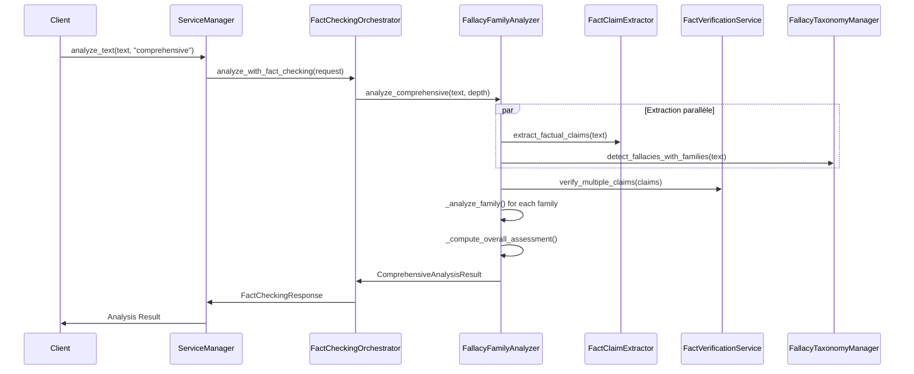
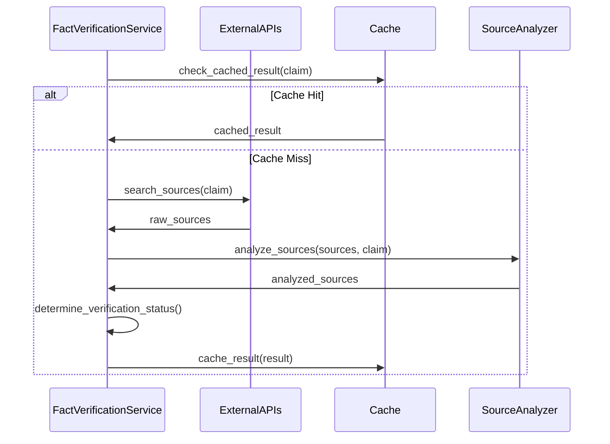

# Architecture du Système de Fact-Checking et Taxonomie des Sophismes

## Vue d'ensemble Architecturale

Ce document décrit l'architecture du système intégré de fact-checking et de classification des sophismes par familles, développé selon le PRD d'intégration pour le projet d'intelligence symbolique de l'EPITA.

## Diagramme d'Architecture

```
┌─────────────────────────────────────────────────────────────────┐
│                    ORCHESTRATION LAYER                          │
├─────────────────────────────────────────────────────────────────┤
│  OrchestrationServiceManager                                   │
│  ├─ FactCheckingOrchestrator ←── FactCheckingRequest           │
│  ├─ RealLLMOrchestrator                                        │
│  ├─ ConversationOrchestrator                                   │
│  └─ CluedoOrchestrator                                         │
└─────────────────────────────────────────────────────────────────┘
                              │
                              ▼
┌─────────────────────────────────────────────────────────────────┐
│                    ANALYSIS LAYER                               │
├─────────────────────────────────────────────────────────────────┤
│  FallacyFamilyAnalyzer                                         │
│  ├─ analyze_comprehensive()                                     │
│  ├─ _analyze_family()                                          │
│  ├─ _calculate_family_score()                                  │
│  └─ _generate_recommendations()                                │
└─────────────────────────────────────────────────────────────────┘
                              │
                    ┌─────────┼─────────┐
                    ▼         ▼         ▼
┌─────────────────┐ ┌─────────────────┐ ┌─────────────────┐
│ FACT-CHECKING   │ │ SOPHISM         │ │ TAXONOMY        │
│ SERVICES        │ │ DETECTION       │ │ MANAGEMENT      │
├─────────────────┤ ├─────────────────┤ ├─────────────────┤
│FactClaim        │ │FactualClaim     │ │FallacyTaxonomy  │
│Extractor        │ │Extractor        │ │Manager          │
│                 │ │                 │ │                 │
│FactVerification │ │ClaimType        │ │8 Fallacy        │
│Service          │ │ClaimVerifiability│ │Families         │
│                 │ │                 │ │                 │
│SourceReliability│ │NLP Processing   │ │ClassifiedFallacy│
│Assessment       │ │(spaCy optional) │ │                 │
└─────────────────┘ └─────────────────┘ └─────────────────┘
                              │
                              ▼
┌─────────────────────────────────────────────────────────────────┐
│                    DATA LAYER                                   │
├─────────────────────────────────────────────────────────────────┤
│  ┌─────────────────┐ ┌─────────────────┐ ┌─────────────────┐   │
│  │ Taxonomy CSV    │ │ External APIs   │ │ Cache Storage   │   │
│  │ (400+ sophisms) │ │ - Tavily        │ │ - Verifications │   │
│  │                 │ │ - SearXNG       │ │ - Classifications│   │
│  │ TaxonomySophism │ │ - Simulation    │ │ - Performance   │   │
│  │ Detector        │ │                 │ │   Metrics       │   │
│  └─────────────────┘ └─────────────────┘ └─────────────────┘   │
└─────────────────────────────────────────────────────────────────┘
```

## Composants Architecturaux

### 1. Couche d'Orchestration

#### OrchestrationServiceManager
- **Rôle** : Point d'entrée principal pour toutes les analyses
- **Responsabilités** :
  - Initialisation et coordination des orchestrateurs
  - Routage des requêtes vers le bon orchestrateur
  - Gestion du cycle de vie des services
  - Monitoring et health checks

#### FactCheckingOrchestrator
- **Rôle** : Coordinateur principal pour l'analyse intégrée
- **Responsabilités** :
  - Orchestration du processus complet d'analyse
  - Coordination fact-checking + détection sophismes
  - Gestion des requêtes en lot
  - Génération de rapports consolidés

### 2. Couche d'Analyse

#### FallacyFamilyAnalyzer
- **Architecture** : Analyseur unifié intégrant tous les composants
- **Méthodes principales** :
  ```python
  async def analyze_comprehensive(text, depth) -> ComprehensiveAnalysisResult
  async def _analyze_family(family, fallacies, fact_results) -> FamilyAnalysisResult
  def _calculate_family_score(text, family, fallacies) -> float
  def _generate_recommendations(family_results, fact_results) -> List[str]
  ```

#### Profondeurs d'Analyse
```python
class AnalysisDepth(Enum):
    BASIC = "basic"           # Détection rapide
    STANDARD = "standard"     # Analyse équilibrée  
    COMPREHENSIVE = "comprehensive"  # Analyse complète
    EXPERT = "expert"         # Analyse maximale avec patterns complexes
```

### 3. Services de Fact-Checking

#### FactClaimExtractor
```python
class FactClaimExtractor:
    def extract_factual_claims(text, max_claims) -> List[FactualClaim]
    def _extract_claims_by_pattern(sentence, claim_type, patterns) -> List[FactualClaim]
    def _extract_claims_with_nlp(text) -> List[FactualClaim]  # spaCy optionnel
```

**Types d'affirmations supportés** :
- `STATISTICAL` : Données statistiques et pourcentages
- `HISTORICAL` : Événements et dates historiques
- `SCIENTIFIC` : Affirmations scientifiques et études
- `GEOGRAPHICAL` : Informations géographiques
- `NUMERICAL` : Valeurs numériques et quantités
- `TEMPORAL` : Références temporelles
- `CAUSAL` : Relations de cause à effet
- `DEFINITIONAL` : Définitions et concepts
- `BIOGRAPHICAL` : Informations sur les personnes
- `QUOTE` : Citations et déclarations

#### FactVerificationService
```python
class FactVerificationService:
    async def verify_claim(claim) -> FactVerificationResult
    async def verify_multiple_claims(claims) -> List[FactVerificationResult]
    def _assess_source_reliability(domain) -> SourceReliability
    def _determine_verification_status(sources, claim) -> VerificationStatus
```

**Statuts de vérification** :
- `VERIFIED_TRUE` : Confirmé par sources fiables
- `VERIFIED_FALSE` : Contredit par sources fiables
- `PARTIALLY_TRUE` : Partiellement confirmé
- `DISPUTED` : Sources contradictoires
- `UNVERIFIABLE` : Impossible à vérifier
- `INSUFFICIENT_INFO` : Manque d'informations
- `ERROR` : Erreur lors de la vérification

### 4. Gestion de Taxonomie

#### FallacyTaxonomyManager
```python
class FallacyTaxonomyManager:
    def detect_fallacies_with_families(text, max_fallacies) -> List[ClassifiedFallacy]
    def classify_fallacy_by_family(taxonomy_key) -> Optional[FallacyFamily]
    def get_family_statistics(classified_fallacies) -> Dict[str, Any]
```

#### 8 Familles de Sophismes

##### 1. Authority & Popularity (authority_popularity)
```python
# Exemples de sophistmes
- Appel à l'autorité (argumentum ad verecundiam)
- Appel à la popularité (argumentum ad populum)  
- Appel à la tradition (argumentum ad antiquitatem)
- Appel à la nouveauté (argumentum ad novitatem)

# Métriques spécifiques
- authority_relevance: Pertinence de l'autorité (0-1)
- source_credibility: Crédibilité de la source (0-1)
- popularity_representativeness: Représentativité opinion (0-1)
```

##### 2. Emotional Appeals (emotional_appeals)
```python
# Exemples de sophismes
- Appel à la peur (argumentum ad metum)
- Appel à la pitié (argumentum ad misericordiam)
- Appel à la flatterie (argumentum ad captandum)
- Appel à la honte (argumentum ad pudorem)

# Métriques spécifiques  
- emotional_intensity: Intensité émotionnelle (0-1)
- emotion_relevance: Pertinence émotionnelle (0-1)
- manipulation_intentionality: Manipulation intentionnelle (0-1)
```

##### 3. Generalization & Causality (generalization_causality)
```python
# Exemples de sophismes
- Généralisation hâtive (secundum quid)
- Post hoc ergo propter hoc
- Pente glissante (argumentum ad consequentiam)
- Composition et division

# Métriques spécifiques
- sample_representativeness: Représentativité échantillon (0-1)
- causal_strength: Force relation causale (0-1)
- confounding_variables: Variables confondantes (0-1)
```

##### 4. Diversion & Attack (diversion_attack)
```python
# Exemples de sophismes
- Homme de paille (straw man)
- Ad hominem (attaque personnelle)
- Tu quoque (tu fais pareil)
- Hareng rouge (red herring)

# Métriques spécifiques
- attack_relevance: Pertinence de l'attaque (0-1)
- diversion_degree: Degré de diversion (0-1)
- discussion_impact: Impact sur discussion (0-1)
```

##### 5. False Dilemma & Simplification (false_dilemma_simplification)
```python
# Exemples de sophismes
- Faux dilemme (false dilemma)
- Sophisme du vrai écossais (no true Scotsman)
- Appel à l'ignorance (argumentum ad ignorantiam)
- Argument circulaire (petitio principii)

# Métriques spécifiques
- alternatives_omitted: Nombre alternatives omises
- complexity_ratio: Complexité réelle vs présentée (0-1)
- simplification_degree: Degré de simplification (0-1)
```

##### 6. Language & Ambiguity (language_ambiguity)
```python
# Exemples de sophismes
- Équivocation (ambiguïté sémantique)
- Amphibologie (ambiguïté syntaxique)
- Accent (accentuation trompeuse)
- Composition lexicale (mot-valise trompeur)

# Métriques spécifiques
- ambiguity_degree: Degré d'ambiguïté (0-1)
- ambiguity_intentionality: Intentionnalité (0-1)
- comprehension_impact: Impact compréhension (0-1)
```

##### 7. Statistical & Probabilistic (statistical_probabilistic)
```python
# Exemples de sophismes  
- Sophisme du joueur (gambler's fallacy)
- Biais de confirmation (confirmation bias)
- Sophisme de la base de référence (base rate fallacy)
- Sophisme de l'échantillon biaisé (biased sample)

# Métriques spécifiques
- statistical_accuracy: Exactitude statistiques (0-1)
- sample_representativeness: Représentativité (0-1)
- statistical_relevance: Pertinence contextuelle (0-1)
```

##### 8. Audio/Oral Context (audio_oral_context)
```python
# Exemples de sophismes
- Sophisme d'interruption
- Intimidation par le volume
- Confusion par débit rapide
- Manipulation par intonation

# Métriques spécifiques
- interruption_frequency: Fréquence interruptions
- volume_variations: Variations volume (dB)
- speech_rate: Débit de parole (mots/minute)
```

## Flux de Données

### 1. Flux d'Analyse Complète



### 2. Flux de Fact-Checking



## Patterns de Conception

### 1. Singleton Pattern
```python
# Instances globales pour optimiser les performances
_global_taxonomy_manager = None
_global_verification_service = None
_global_family_analyzer = None
_global_fact_checking_orchestrator = None

def get_taxonomy_manager() -> FallacyTaxonomyManager:
    global _global_taxonomy_manager
    if _global_taxonomy_manager is None:
        _global_taxonomy_manager = FallacyTaxonomyManager()
    return _global_taxonomy_manager
```

### 2. Factory Pattern
```python
def create_fact_checking_request(text: str, options: Dict) -> FactCheckingRequest:
    return FactCheckingRequest(
        text=text,
        analysis_depth=AnalysisDepth[options.get('depth', 'STANDARD')],
        enable_fact_checking=options.get('fact_checking', True),
        api_config=options.get('api_config')
    )
```

### 3. Strategy Pattern
```python
class AnalysisStrategy:
    def analyze(self, text: str) -> AnalysisResult:
        pass

class BasicAnalysisStrategy(AnalysisStrategy):
    def analyze(self, text: str) -> AnalysisResult:
        # Implémentation analyse basique
        pass

class ComprehensiveAnalysisStrategy(AnalysisStrategy):
    def analyze(self, text: str) -> AnalysisResult:
        # Implémentation analyse complète
        pass
```

## Configuration et Extensibilité

### Configuration API
```python
API_CONFIG = {
    'fact_checking': {
        'tavily': {
            'api_key': 'your_tavily_key',
            'max_results': 10,
            'timeout': 30
        },
        'searxng': {
            'url': 'http://your.searxng.instance',
            'timeout': 20
        },
        'cache': {
            'duration_hours': 24,
            'max_entries': 1000
        }
    },
    'sophism_detection': {
        'max_fallacies_per_family': 5,
        'confidence_threshold': 0.3,
        'enable_nlp': True
    }
}
```

### Extensibilité

#### Ajouter une Nouvelle Famille de Sophismes
```python
# 1. Étendre l'énumération
class FallacyFamily(Enum):
    # ... familles existantes ...
    NEW_FAMILY = "new_family"

# 2. Ajouter définition
FALLACY_FAMILY_INFO[FallacyFamily.NEW_FAMILY] = FallacyFamilyInfo(
    family=FallacyFamily.NEW_FAMILY,
    name_fr="Nouvelle Famille",
    name_en="New Family",
    description="Description de la nouvelle famille",
    keywords=["keyword1", "keyword2"],
    severity_weight=0.8,
    common_contexts=["context1", "context2"]
)

# 3. Ajouter patterns de détection
FALLACY_FAMILY_KEYWORDS[FallacyFamily.NEW_FAMILY] = {
    "primary": ["pattern1", "pattern2"],
    "secondary": ["secondary1", "secondary2"]
}
```

#### Ajouter un Nouveau Type d'Affirmation
```python
# 1. Étendre l'énumération
class ClaimType(Enum):
    # ... types existants ...
    NEW_CLAIM_TYPE = "new_claim_type"

# 2. Ajouter patterns de détection
claim_patterns[ClaimType.NEW_CLAIM_TYPE] = [
    r'pattern_regex_1',
    r'pattern_regex_2'
]
```

## Performance et Optimisation

### Métriques de Performance
```python
class PerformanceMetrics:
    total_analyses: int = 0
    total_processing_time: float = 0.0
    average_processing_time: float = 0.0
    error_count: int = 0
    error_rate: float = 0.0
    cache_hit_rate: float = 0.0
```

### Optimisations Implémentées

1. **Cache Intelligent** : 
   - Cache des résultats de fact-checking (24h par défaut)
   - Cache des classifications taxonomiques
   - Nettoyage automatique des entrées expirées

2. **Traitement Parallèle** :
   - Extraction d'affirmations et détection de sophismes en parallèle
   - Vérification de multiples claims simultanément (avec semaphore)
   - Analyse en lot avec limitation de concurrence

3. **Optimisations NLP** :
   - spaCy optionnel pour améliorer l'extraction
   - Fallback sur regex si spaCy indisponible
   - Segmentation intelligente des textes longs

## Sécurité et Fiabilité

### Gestion d'Erreurs
```python
# Hiérarchie d'exceptions
class FactCheckingError(Exception): pass
class VerificationTimeoutError(FactCheckingError): pass
class InvalidClaimError(FactCheckingError): pass
class APILimitExceededError(FactCheckingError): pass

# Retry avec backoff exponentiel
@retry(
    retry=retry_if_exception_type(APILimitExceededError),
    wait=wait_exponential(multiplier=1, min=4, max=10),
    stop=stop_after_attempt(3)
)
async def verify_with_external_api(claim):
    # Implémentation avec retry automatique
    pass
```

### Validation des Données
```python
def validate_claim(claim: FactualClaim) -> bool:
    # Validation structure et contenu
    if not claim.claim_text or len(claim.claim_text.strip()) < 10:
        return False
    if claim.confidence < 0.0 or claim.confidence > 1.0:
        return False
    return True

def sanitize_text_input(text: str) -> str:
    # Nettoyage et sanitisation
    text = re.sub(r'[^\w\s\-\.,!?;:]', '', text)
    return text[:10000]  # Limitation taille
```

## Tests et Qualité

### Architecture de Tests
```
tests/
├── test_fact_checking_integration.py    # Tests composants individuels
├── test_orchestration_integration.py    # Tests intégration orchestration
├── test_performance.py                  # Tests de performance
├── fixtures/                           # Données de test
└── mocks/                              # Mocks pour APIs externes
```

### Métriques de Qualité Cibles
- **Couverture de code** : > 80%
- **Précision classification sophismes** : > 85%
- **Précision fact-checking** : > 80%
- **Temps de réponse** : < 10 secondes
- **Disponibilité** : > 99%

## Conclusion

Cette architecture offre un système robuste, extensible et performant pour l'analyse intégrée de sophismes et le fact-checking. La conception modulaire permet une évolution progressive et une adaptation aux besoins spécifiques tout en maintenant une cohérence architecturale forte.