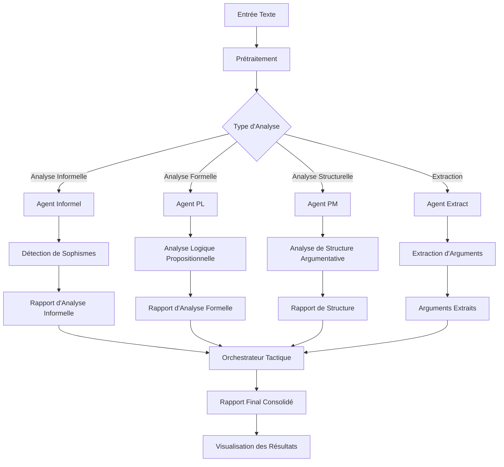

# Diagramme de Flux de Données du Système d'Analyse Argumentative

Ce diagramme illustre le flux de données à travers les différents composants du système d'analyse argumentative.

## Description du Flux

1. **Entrée Texte** : Le système reçoit un texte à analyser.
2. **Prétraitement** : Le texte est nettoyé et préparé pour l'analyse.
3. **Type d'Analyse** : Le système détermine quel(s) type(s) d'analyse effectuer.
4. **Agents Spécialisés** : Différents agents traitent le texte selon leur spécialité :
   - **Agent Informel** : Détecte les sophismes et erreurs de raisonnement
   - **Agent PL** : Effectue une analyse logique propositionnelle
   - **Agent PM** : Analyse la structure argumentative
   - **Agent Extract** : Extrait les arguments du texte
5. **Analyses Spécifiques** : Chaque agent effectue son analyse spécialisée
6. **Rapports Individuels** : Chaque agent produit un rapport d'analyse
7. **Orchestrateur Tactique** : Consolide les différents rapports
8. **Rapport Final** : Un rapport complet est généré
9. **Visualisation** : Les résultats sont présentés de manière visuelle

## Utilisation de ce Diagramme

Ce diagramme peut être utilisé pour :
- Comprendre le flux global de données dans le système
- Identifier les dépendances entre les différents composants
- Suivre le parcours d'un texte à travers le processus d'analyse
- Planifier des modifications ou extensions du système

## Notes Techniques

- Les agents peuvent fonctionner en parallèle pour optimiser les performances
- L'orchestrateur tactique est responsable de la résolution des conflits entre analyses
- Le système est conçu pour être extensible avec de nouveaux agents d'analyse