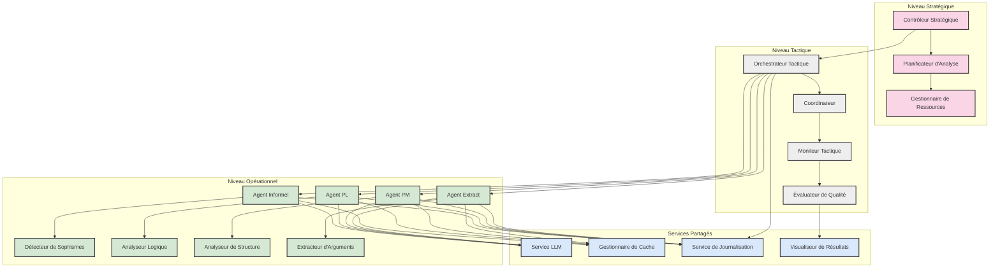

# Diagramme d'Interactions entre Composants du Système

Ce diagramme illustre les interactions entre les différents composants du système d'analyse argumentative, montrant comment ils communiquent et collaborent.

## Description des Interactions

### Architecture Hiérarchique à Trois Niveaux

Le système est organisé selon une architecture hiérarchique à trois niveaux :

1. **Niveau Stratégique** : Responsable de la planification globale et de l'allocation des ressources
   - Le Contrôleur Stratégique supervise l'ensemble du processus d'analyse
   - Le Planificateur d'Analyse détermine la stratégie d'analyse optimale
   - Le Gestionnaire de Ressources alloue les ressources computationnelles

2. **Niveau Tactique** : Coordonne l'exécution des analyses et surveille la qualité
   - L'Orchestrateur Tactique dirige les agents opérationnels
   - Le Coordinateur synchronise les activités des agents
   - Le Moniteur Tactique surveille les performances
   - L'Évaluateur de Qualité vérifie la cohérence des résultats

3. **Niveau Opérationnel** : Exécute les analyses spécifiques
   - L'Agent Informel détecte les sophismes via son Détecteur de Sophismes
   - L'Agent PL effectue l'analyse logique propositionnelle
   - L'Agent PM analyse la structure argumentative
   - L'Agent Extract extrait les arguments du texte

### Services Partagés

Les composants partagent plusieurs services communs :

- **Service LLM** : Fournit l'accès aux modèles de langage
- **Gestionnaire de Cache** : Optimise les performances en mettant en cache les résultats
- **Service de Journalisation** : Enregistre les activités et les erreurs
- **Visualiseur de Résultats** : Présente les résultats de manière visuelle

## Flux de Communication

1. Le Contrôleur Stratégique initie le processus et communique avec l'Orchestrateur Tactique
2. L'Orchestrateur Tactique dirige les agents opérationnels
3. Les agents opérationnels utilisent les services partagés pour effectuer leurs analyses
4. Les résultats remontent la hiérarchie pour consolidation et évaluation
5. L'Évaluateur de Qualité transmet les résultats finaux au Visualiseur

## Cas d'Utilisation de ce Diagramme

Ce diagramme est utile pour :
- Comprendre l'architecture globale du système
- Identifier les dépendances entre composants
- Planifier des modifications ou extensions du système
- Former de nouveaux développeurs à l'architecture du projet