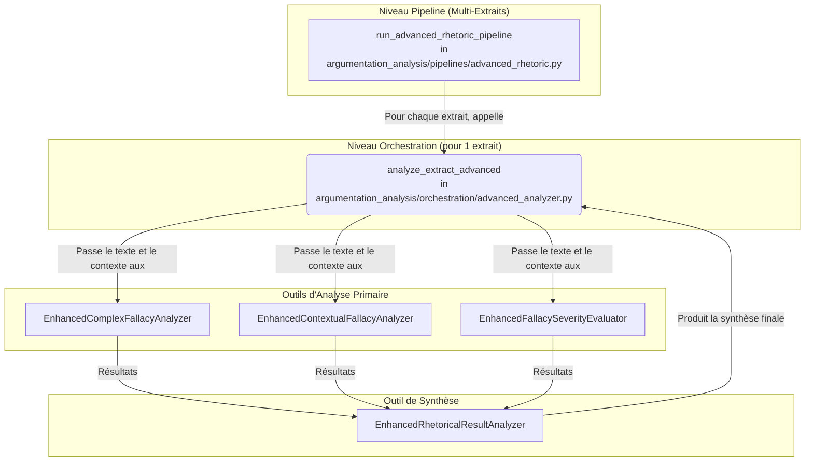

# Architecture du Point d'Entrée : Analyse Rhétorique

## 1. Objectif

Le point d'entrée "Analyse Rhétorique" a pour but de réaliser une analyse rhétorique approfondie d'un texte. Il ne s'agit pas d'un script unique, mais d'une **capacité** du système qui peut être invoquée par des orchestrateurs de plus haut niveau.

L'objectif est d'identifier des structures argumentatives complexes, des sophismes contextuels, d'évaluer leur gravité, et de produire une synthèse globale de la stratégie rhétorique de l'auteur.

## 2. Script de Lancement Principal

Il n'y a pas de script unique `main.py` pour cette fonctionnalité. L'analyse est déclenchée par un orchestrateur qui configure et exécute une `UnifiedAnalysisPipeline`.

Le script **`scripts/orchestrate_complex_analysis.py`** est un exemple de tel orchestrateur. Il peut être lancé directement pour initier une analyse complète qui inclut le mode rhétorique.

```bash
python scripts/orchestrate_complex_analysis.py
```

## 3. Diagramme d'Architecture

Le diagramme suivant illustre les interactions entre les composants clés, du pipeline de haut niveau jusqu'aux outils d'analyse spécifiques.



## 4. Description des Composants Clés

### 4.1. Pipeline
-   **`run_advanced_rhetoric_pipeline`** (`argumentation_analysis/pipelines/advanced_rhetoric.py`):
    -   Fonction de haut niveau qui gère une **liste d'extraits**.
    -   Elle itère sur chaque extrait et appelle l'orchestrateur `analyze_extract_advanced` pour chacun.
    -   Elle est responsable de l'initialisation des outils d'analyse et de l'agrégation des résultats finaux.

### 4.2. Orchestration
-   **`analyze_extract_advanced`** (`argumentation_analysis/orchestration/advanced_analyzer.py`):
    -   Le cœur de l'analyse pour un **unique extrait**.
    -   Reçoit les outils pré-initialisés et les applique de manière séquentielle sur le texte.
    -   Collecte les résultats des différents outils et les transmet à l'outil de synthèse.

### 4.3. Outils d'Analyse (Agents)
Ces classes, situées dans `argumentation_analysis/agents/tools/analysis/enhanced/`, effectuent le travail d'analyse détaillé :

-   **`EnhancedComplexFallacyAnalyzer`**: Détecte les sophismes composites et les relations complexes entre arguments.
-   **`EnhancedContextualFallacyAnalyzer`**: Analyse le texte dans son contexte pour identifier les sophismes qui dépendent de la situation.
-   **`EnhancedFallacySeverityEvaluator`**: Évalue l'impact et la gravité des sophismes identifiés.

### 4.4. Outil de Synthèse
-   **`EnhancedRhetoricalResultAnalyzer`**:
    -   Reçoit les analyses des trois outils précédents.
    -   Produit une vue d'ensemble, une synthèse cohérente de la stratégie rhétorique globale du texte.