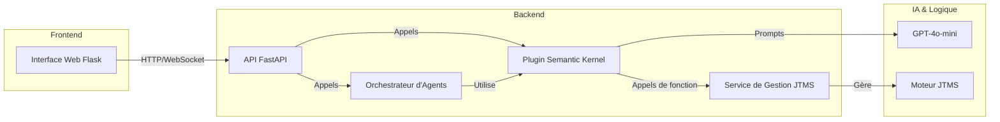

# Documentation Technique : Système d'Analyse d'Argumentation JTMS

**Version :** 1.0  
**Date :** 11 Juin 2025  
**Public Cible :** Développeurs, Étudiants avancés, Administrateurs Système

---

## 1. Vue d'ensemble de l'Architecture

Le système est architecturé autour de plusieurs composants clés qui interagissent pour fournir une plateforme d'analyse d'argumentation hybride (symbolique et générative).



-   **Interface Web (Flask) :** Fournit l'interface utilisateur pour la visualisation et l'interaction avec les réseaux de croyances.
-   **API (FastAPI) :** Expose les fonctionnalités du backend via une API RESTful. C'est le point d'entrée principal pour les interactions programmatiques.
-   **Orchestrateur d'Agents (`GroupChat`) :** Gère le dialogue et la collaboration entre les agents IA (`Sherlock` et `Watson`).
-   **Plugin Semantic Kernel (`JTMSSemanticKernelPlugin`) :** Sert de pont entre le monde sémantique du LLM et le monde logique du JTMS.
-   **Service JTMS (`JTMSService`) :** Gère le cycle de vie des instances du JTMS (création, stockage, accès).
-   **Moteur JTMS :** L'implémentation de base du JTMS qui maintient la cohérence logique.
-   **LLM (GPT-4o-mini) :** Le modèle de langage utilisé pour la compréhension, la génération et l'analyse de texte.

---

## 2. API Endpoints (FastAPI)

L'API REST est la porte d'entrée pour interagir avec le système. Voici les endpoints les plus importants, disponibles sous le préfixe `/api/v1/jtms`.

### Gestion des Croyances
-   `POST /beliefs/` : Crée une nouvelle croyance.
    -   **Body :** `{ "session_id": "...", "content": "..." }`
-   `GET /beliefs/{session_id}` : Récupère toutes les croyances pour une session.

### Gestion des Justifications
-   `POST /justifications/` : Crée une nouvelle justification.
    -   **Body :** `{ "session_id": "...", "justified_belief_id": "...", "justifying_belief_ids": [...] }`

### Interaction avec les Agents
-   `POST /agents/invoke/` : Envoie une requête à l'orchestrateur d'agents.
    -   **Body :** `{ "session_id": "...", "query": "Analysez ce texte..." }`

---

## 3. Le Plugin Semantic Kernel (`JTMSSemanticKernelPlugin`)

Ce plugin est le cœur de l'intégration hybride. Il expose des fonctions natives que le LLM peut appeler pour interagir avec le JTMS.

**Fonctions Natives Principales :**

1.  `create_belief(session_id: str, content: str) -> str`
    -   Crée une croyance dans le JTMS et retourne son identifiant.

2.  `add_justification(session_id: str, justified_belief_id: str, justifying_belief_ids: list[str])`
    -   Lie des croyances entre elles pour former une justification logique.

3.  `mark_as_contradiction(session_id: str, belief_id: str)`
    -   Marque une croyance comme étant une contradiction, déclenchant une réévaluation du réseau de croyances.

4.  `get_belief_status(session_id: str, belief_id: str) -> str`
    -   Retourne le statut d'une croyance (`IN`, `OUT`, `UNKNOWN`).

5.  `propose_analysis(session_id: str, topic: str) -> str`
    -   Fonction de haut niveau qui demande au LLM d'analyser un sujet, d'extraire des croyances et de les structurer directement dans le JTMS.

**Exemple d'invocation en Python :**
```python
import semantic_kernel as sk
from argumentation_analysis.plugins import JTMSSemanticKernelPlugin

# Initialisation du kernel...
kernel = sk.Kernel()
plugin = JTMSSemanticKernelPlugin()
kernel.add_plugin(plugin, plugin_name="jtms")

# Invocation
result = await kernel.invoke_function(
    "jtms",
    "create_belief",
    session_id="session_123",
    content="Le code doit être documenté.",
)
```

---

## 4. Structure des Données (Pydantic)

Les modèles Pydantic sont utilisés à travers l'API et les services pour garantir la validation et la cohérence des données.

-   **BeliefModel :**
    -   `id: str`
    -   `session_id: str`
    -   `content: str`
    -   `status: str` (`IN` ou `OUT`)

-   **JustificationModel :**
    -   `id: str`
    -   `session_id: str`
    -   `justified_belief: BeliefModel`
    -   `justifying_beliefs: list[BeliefModel]`

---

## 5. Étendre le Système

### Ajouter un nouvel Agent
1.  Créez une nouvelle classe héritant de `ConversableAgent` dans `argumentation_analysis/agents/`.
2.  Donnez-lui une personnalité et des compétences spécifiques via son `system_message`.
3.  Ajoutez une instance de votre agent à la configuration du `GroupChat` dans le service d'orchestration.

### Ajouter une nouvelle fonction au Plugin SK
1.  Ajoutez une nouvelle méthode à la classe `JTMSSemanticKernelPlugin`.
2.  Décorez-la avec `@sk_function` et décrivez clairement son rôle dans la docstring (c'est ce que le LLM lira pour savoir quand l'utiliser).
3.  Assurez-vous que la fonction interagit avec le `JTMSService` pour toute opération liée au JTMS.