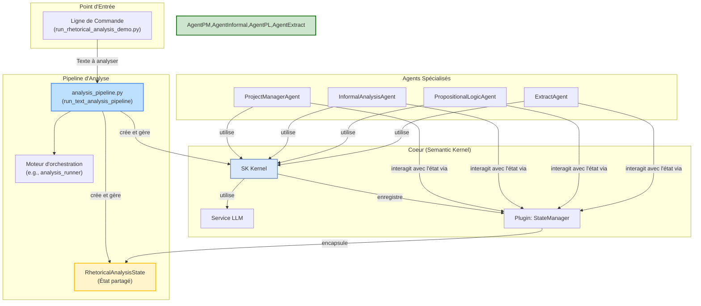

# Guide Complet du Système d'Analyse Rhétorique

*Dernière mise à jour : 25/06/2025*

Ce document fournit une description technique complète du système d'analyse rhétorique. Il est destiné aux développeurs souhaitant comprendre, utiliser et étendre le pipeline d'analyse.

## 1. Architecture Générale

Le système est conçu autour d'un pipeline d'orchestration modulaire. Le point d'entrée canonique est `argumentation_analysis/demos/run_rhetorical_analysis_demo.py`. Ce script lance une chaîne de traitement qui peut invoquer un ou plusieurs agents d'IA spécialisés coordonnés par un moteur d'orchestration.



## 2. Composants Clés

-   **`run_rhetorical_analysis_demo.py`**: Le point d'entrée canonique. Il parse les arguments de la ligne de commande et appelle le pipeline d'analyse.
-   **`analysis_pipeline.py`**: Le principal point d'entrée programmatique. Il initialise les services (LLM, JVM) et lance l'orchestration.
-   **`analysis_runner.py`**: Contient la logique d'orchestration principale, en gérant la conversation entre les agents.
-   **`RhetoricalAnalysisState`** (`shared_state.py`): L'état partagé de l'analyse. C'est un objet qui contient le texte initial, les arguments identifiés, les sophismes, les conclusions, etc.
-   **`StateManagerPlugin`** (`state_manager_plugin.py`): Le pont entre les agents et l'état partagé.
-   **Agents Spécialisés** (`agents/core/`):
    -   **`ProjectManagerAgent`**: Supervise l'analyse.
    -   **`InformalAnalysisAgent`**: Détecte les sophismes informels.
    -   **`PropositionalLogicAgent`**: Analyse la structure logique formelle.
    -   **`ExtractAgent`**: Extrait les propositions et les arguments.

## 3. Guide d'Utilisation

### a. Configuration
Assurez-vous que votre environnement virtuel est activé et que les dépendances sont installées. Un fichier `.env` à la racine est nécessaire pour les clés API.

### b. Exécution
Le script `run_rhetorical_analysis_demo.py` est le point d'entrée recommandé.

**Exemple 1: Lancer les démos par défaut**
```bash
python argumentation_analysis/demos/run_rhetorical_analysis_demo.py
```
Cette commande exécutera les exemples prédéfinis dans le script.

**Exemple 2: Analyser un fichier et sauvegarder le résultat**
```bash
python argumentation_analysis/demos/run_rhetorical_analysis_demo.py -f "path/to/your/text.txt" -o "path/to/your/report.json" -v
```
-   `-f, --file`: Spécifie le fichier à analyser.
-   `-o, --output-file`: Sauvegarde le rapport JSON à cet emplacement.
-   `-v, --verbose`: Active les logs détaillés.

**Exemple 3: Analyser un texte directement**
```bash
python argumentation_analysis/demos/run_rhetorical_analysis_demo.py -t "Ceci est un argument. Il est fallacieux car il attaque la personne."
```
-   `-t, --text`: Permet de passer le texte directement en argument.

## 4. Architecture de l'Analyse Avancée

Pour des analyses plus poussées, le système utilise des outils d'analyse améliorés.

-   **`run_advanced_rhetoric_pipeline`** (`argumentation_analysis/pipelines/advanced_rhetoric.py`):
    -   Gère une liste d'extraits et orchestre l'analyse sur chacun.
-   **`analyze_extract_advanced`** (`argumentation_analysis/orchestration/advanced_analyzer.py`):
    -   Orchestre l'analyse pour un unique extrait.
-   **Outils d'Analyse "Enhanced"** (`argumentation_analysis/agents/tools/analysis/enhanced/`):
    -   `EnhancedComplexFallacyAnalyzer`: Détecte les sophismes composites.
    -   `EnhancedContextualFallacyAnalyzer`: Analyse les sophismes contextuels.
    -   `EnhancedFallacySeverityEvaluator`: Évalue la gravité des sophismes.
-   **Outil de Synthèse**
    -   `EnhancedRhetoricalResultAnalyzer`: Produit une synthèse finale.

Cette architecture avancée est typiquement invoquée par des orchestrateurs de plus haut niveau et n'est pas directement exposée dans la démo de base.