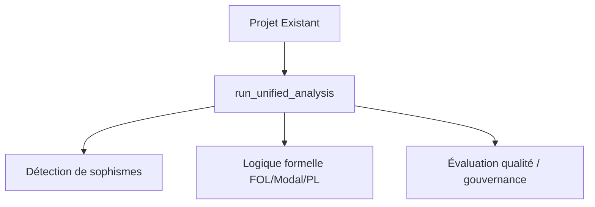

# Guide d'Intégration des Outils Rhétorique

> Les points d'entrée réels sont `run_unified_analysis` (async), l'API REST
> `api/main.py` et le CLI `run_orchestration.py`. L'ancienne classe
> `RhetoricalAnalysisSystem` (`configure_tool` / `create_pipeline`) n'existe pas
> dans le code.

## Intégration dans des Projets Existants

### Architecture de Base



### Étapes d'Intégration

1. **Environnement** : activer l'environnement Conda (`projet-is-roo-new`) et
   renseigner les clés API dans `.env` (voir `CLAUDE.md`, section Build & Environment).
2. **Appel principal** :

   ```python
   import asyncio
   from argumentation_analysis.orchestration.unified_pipeline import run_unified_analysis

   async def analyze(text: str):
       return await run_unified_analysis(text, workflow_name="standard")

   results = asyncio.run(analyze("Texte à analyser"))
   ```

3. **Choix du workflow** : `light` | `standard` | `full` (paramètre `workflow_name`).

## Intégration avec des Frameworks

### Flask

```python
import asyncio
from argumentation_analysis.orchestration.unified_pipeline import run_unified_analysis

@app.route('/analyze', methods=['POST'])
def analyze():
    text = request.json['text']
    results = asyncio.run(run_unified_analysis(text))
    return jsonify(results)
```

### FastAPI

```python
from argumentation_analysis.orchestration.unified_pipeline import run_unified_analysis

@app.post("/analyze")
async def analyze_text(text: str):
    return await run_unified_analysis(text)
```

## Dépendances

L'environnement complet est défini par Conda (`projet-is-roo-new`) et le fichier
`.env` (clés API OpenAI / OpenRouter). Il n'y a pas de paquet pip
`argumentation-analysis` à installer ; le projet s'exécute depuis le dépôt.
Voir `CLAUDE.md` (section Build & Environment).

## Déploiement

Point d'entrée REST recommandé :

```bash
uvicorn api.main:app --reload --port 8000
```
