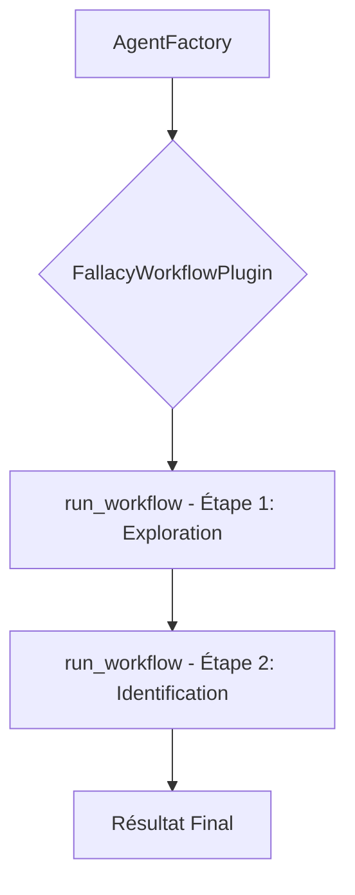

# Plan de Refactoring des Outils d'Analyse de Sophismes

## 1. Introduction

L'analyse actuelle du `FallacyWorkflowPlugin` révèle une conception monolithique qui nuit à sa maintenabilité, son extensibilité et ses performances. Le workflow est codé en dur, la gestion des outils est manuelle et séquentielle, et la création de fonctions hybrides (code natif + LLM) n'est pas standardisée.

Ce document propose un plan de refactoring en trois axes pour transformer ce plugin en un système modulaire, robuste et performant, en s'appuyant sur les meilleures pratiques de `semantic-kernel`.

### Architecture Actuelle (Simplifiée)



### Architecture Cible (Simplifiée)

```mermaid
graph TD
    subgraph "Orchestrateur"
        A[FallacyWorkflowOrchestrator]
    end

    subgraph "Boîte à Outils Modulaire"
        B[ExplorationTool]
        C[HypothesisValidationTool]
        D[AggregationTool]
    end

    A -- 1. "Quelles pistes explorer ?" --> B;
    B -- 2. Hypothèses [H1, H2, H3] --> A;
    A -- 3. "Valider chaque hypothèse en parallèle" --> C;

    subgraph "Exécution Parallèle"
        C1(Validate H1)
        C2(Validate H2)
        C3(Validate H3)
    end
    
    C --> C1 & C2 & C3

    C1 & C2 & C3 -- 4. Rapports [R1, R2, R3] --> A
    A -- 5. "Synthétiser les rapports" --> D
    D -- 6. Rapport Final --> F[Résultat Final]

```

---

## 2. Axe 1: Standardisation des Fonctions Hybrides

**Problème :** La création de fonctions mélangeant logique native et appels au Kernel est actuellement manuelle et verbeuse, comme on le voit dans la boucle de traitement des `tool_calls` du `FallacyWorkflowPlugin`.

**Solution :** Introduire un décorateur `@hybrid_function` pour abstraire cette complexité. Ce décorateur prendrait en charge l'appel au LLM pour le "raisonnement" et passerait ensuite le résultat à une fonction native Python pour l'"exécution".

### Conception du Décorateur `@hybrid_function`

Ce décorateur sera responsable de :
1.  Recevoir une instruction (prompt) décrivant l'objectif de la phase LLM.
2.  Invoquer le Kernel avec cette instruction pour générer des arguments structurés.
3.  Appeler la fonction native décorée avec les arguments générés.

### Exemple de Pseudo-Code

```python
# Fichier: argumentation_analysis/agents/utils/hybrid_decorator.py

from functools import wraps
from semantic_kernel import Kernel, KernelArguments

def hybrid_function(prompt_template: str, result_parser: callable = None):
    """
    Décorateur pour créer une fonction hybride.
    - Le LLM utilise le 'prompt_template' pour raisonner.
    - La fonction native décorée exécute une tâche avec le résultat du LLM.
    """
    def decorator(native_func):
        @wraps(native_func)
        async def wrapper(self, kernel: Kernel, **kwargs):
            # 1. Invoquer le LLM pour le raisonnement
            reasoning_result = await kernel.invoke_prompt(
                prompt_template,
                arguments=KernelArguments(**kwargs)
            )
            
            # 2. Utiliser un analyseur pour extraire les arguments pour la fonction native
            parsed_args = result_parser(reasoning_result) if result_parser else reasoning_result.value

            # 3. Appeler la fonction native avec les arguments traités
            return await native_func(self, **parsed_args)
        
        # Attacher les métadonnées pour que semantic-kernel puisse les utiliser
        wrapper.is_kernel_function = True
        wrapper.prompt = prompt_template
        return wrapper
    return decorator

# --- Utilisation dans un nouveau plugin modulaire ---
# Fichier: argumentation_analysis/agents/plugins/exploration_tool.py

class ExplorationTool:
    def __init__(self, taxonomy: Taxonomy):
        self.taxonomy = taxonomy

    @hybrid_function(
        prompt_template="À partir de l'argument suivant: {{$input}}, identifie les 3 branches de la taxonomie les plus pertinentes à explorer. Réponds avec une liste JSON d'IDs de noeuds."
    )
    async def get_exploration_hypotheses(self, node_ids: List[str]) -> Dict:
        """
        Fonction native qui reçoit les IDs de noeuds du LLM.
        Elle explore ensuite la taxonomie en parallèle.
        """
        # La logique est maintenant purement native et testable
        tasks = [asyncio.to_thread(self.taxonomy.get_branch, node_id) for node_id in node_ids]
        results = await asyncio.gather(*tasks)
        return dict(zip(node_ids, results))

```

---

## 3. Axe 2: Modularité du `FallacyWorkflowPlugin`

**Problème :** Le `FallacyWorkflowPlugin` est une classe monolithique qui contient une logique de workflow complexe et hardcodée. Il n'expose pas de "capacités" réutilisables mais exécute un script.

**Solution :**
1.  **Supprimer `FallacyWorkflowPlugin`**.
2.  Le remplacer par une classe d'orchestration **non-plugin**, `FallacyWorkflowOrchestrator`.
3.  Créer une suite de **plugins plus petits et spécialisés** (Tools) qui exposent des capacités atomiques au Kernel et à l'orchestrateur.

### Nouvelle Structure

1.  **`FallacyWorkflowOrchestrator` (Classe standard Python) :**
    *   Prend un Kernel en initialisation.
    *   Importe les nouveaux plugins (tools).
    *   Contient la logique d'orchestration de haut niveau (appeler l'exploration, puis la validation en parallèle, puis l'agrégation).
    *   Gère l'état du workflow.

2.  **`ExplorationTool` (Nouveau Plugin) :**
    *   **Responsabilité :** Générer des hypothèses de sophismes à partir d'un texte.
    *   **Fonctions exposées :**
        *   `get_exploration_hypotheses(argument_text: str) -> List[str]`: Utilise le LLM pour suggérer des branches de taxonomie pertinentes.
        *   `explore_branch(node_id: str) -> dict`: Fonction native pour obtenir les détails d'une branche (similaire à ce qui existe déjà).

3.  **`HypothesisValidationTool` (Nouveau Plugin) :**
    *   **Responsabilité :** Valider une hypothèse de sophisme spécifique.
    *   **Fonctions exposées :**
        *   `validate_fallacy(argument_text: str, fallacy_hypothesis: dict) -> dict`: Prend un argument et une branche de taxonomie, et produit une analyse structurée (confiance, explication, etc.) pour déterminer si le sophisme est présent.

4.  **`AggregationTool` (Nouveau Plugin, optionnel) :**
    *   **Responsabilité :** Synthétiser les résultats des validations.
    *   **Fonctions exposées :**
        *   `summarize_reports(reports: List[dict]) -> dict`: Crée un rapport final unifié à partir des multiples validations.

---

## 4. Axe 3: Gestion des `Tool Calls` et Parallélisation

**Problème :** Le workflow actuel est séquentiel. La parallélisation n'est pas possible en raison de la conception monolithique, même si une fonction `parallel_exploration` existe mais n'est pas utilisée dans le flux principal.

**Solution :** La nouvelle architecture modulaire (Axe 2) rend la parallélisation naturelle. L'orchestrateur peut lancer des appels d'outils simultanément lorsque les tâches sont indépendantes.

### Implémentation de la Parallélisation

L'orchestrateur utilisera `asyncio.gather` pour paralléliser l'étape de validation des hypothèses.

### Exemple de Pseudo-Code dans l'Orchestrateur

```python
# Fichier: argumentation_analysis/orchestration/fallacy_workflow_orchestrator.py
import asyncio

class FallacyWorkflowOrchestrator:
    def __init__(self, kernel: Kernel):
        self.kernel = kernel
        # Les plugins sont déjà chargés dans le kernel au démarrage de l'application
        self.exploration_tool = self.kernel.plugins["ExplorationTool"]
        self.validation_tool = self.kernel.plugins["HypothesisValidationTool"]

    async def analyze_argument(self, argument_text: str) -> dict:
        # Étape 1: Générer des hypothèses (un seul appel LLM)
        hypotheses_result = await self.kernel.invoke(
            self.exploration_tool["get_exploration_hypotheses"],
            argument_text=argument_text
        )
        fallacy_hypotheses = hypotheses_result.value # Supposons que cela renvoie une liste de dicts

        # Étape 2: Créer des tâches de validation indépendantes
        validation_tasks = []
        for hypothesis in fallacy_hypotheses:
            task = self.kernel.invoke(
                self.validation_tool["validate_fallacy"],
                argument_text=argument_text,
                fallacy_hypothesis=hypothesis
            )
            validation_tasks.append(task)
        
        # Exécuter toutes les tâches de validation en parallèle
        validation_results = await asyncio.gather(*validation_tasks)

        # Étape 3: Agréger les résultats
        final_report = self.aggregate_results([res.value for res in validation_results])
        
        return final_report

    def aggregate_results(self, results: List[dict]) -> dict:
        # Logique pour compiler les résultats en un rapport unifié
        # ...
        return {"summary": "...", "details": results}
```

## 5. Conclusion

Ce plan de refactoring transforme notre système d'analyse de sophismes d'un script monolithique et fragile à une architecture d'outils modulaires, performants et extensibles.

**Bénéfices attendus :**
*   **Robustesse :** Des composants plus petits, spécialisés et testables unitairement.
*   **Performance :** Exécution parallèle des tâches indépendantes, réduisant la latence globale.
*   **Modularité :** Facilité d'ajout, de suppression ou de mise à jour des outils.
*   **Lisibilité :** Une séparation claire entre la logique d'orchestration et les capacités des outils.
*   **Extensibilité :** Les nouveaux outils peuvent être facilement intégrés dans des workflows existants ou nouveaux.