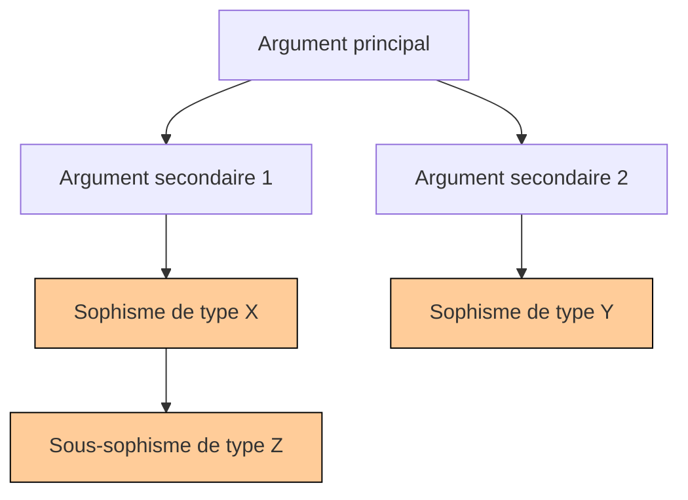

# Analyseur de Sophismes Complexes

## Objectif
Analyse les structures argumentatives complexes et identifie les erreurs logiques imbriquées.

## Utilisation
```python
from argumentiation_analysis.tools import EnhancedComplexFallacyAnalyzer

analyzer = EnhancedComplexFallacyAnalyzer(depth=3, strict_mode=False)
result = analyzer.analyze(text="Texte à analyser")
print(result.complex_fallacies)  # Liste des sophismes imbriqués
print(result.dependency_tree)  # Arbre des dépendances logiques
```

## Paramètres
| Paramètre | Type | Description | Valeur par défaut |
|-----------|------|-------------|-------------------|
| `depth` | int | Profondeur d'analyse des structures | 2 |
| `strict_mode` | bool | Mode strict pour détection rigoureuse | False |
| `language_model` | str | Modèle LLM à utiliser | "default" |

## Résultats
- Arbre des dépendances logiques
- Liste des sophismes imbriqués avec niveaux
- Score de complexité logique
- Suggestions de simplification

## Exemple de Diagramme


## Extension
Pour ajouter un nouveau niveau d'analyse :
```python
class CustomDepthAnalyzer:
    def analyze_depth(self, structure):
        # Implémentation personnalisée
        return depth_score, explanations

analyzer.add_depth_analyzer(CustomDepthAnalyzer())