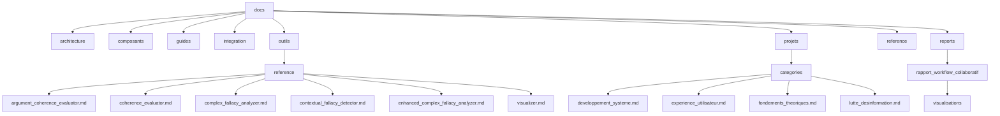

# Plan de Réorganisation de la Documentation

## 1. Analyse de la Situation Actuelle

### 1.1 Structure Actuelle
La documentation est actuellement organisée en plusieurs répertoires thématiques :
- `docs/` (racine avec de nombreux fichiers)
- `docs/architecture/`
- `docs/composants/`
- `docs/guides/`
- `docs/integration/`
- `docs/outils/`
- `docs/projets/`
- `docs/reference/`
- `docs/reports/`
- `docs/analysis/`
- `docs/images/`
- `docs/resources/`

### 1.2 Problèmes Identifiés
1. **Redondances entre fichiers** : Plusieurs fichiers contiennent des informations similaires ou identiques
2. **Duplication entre la racine et les sous-répertoires** : Des fichiers à la racine qui devraient être dans des sous-répertoires thématiques
3. **Vues multiples des mêmes données** dans le répertoire `docs/projets/` (par difficulté, technologie, durée)
4. **Conventions de nommage inconsistantes** : Mélange de styles de nommage
5. **Structure hiérarchique peu claire** : Navigation difficile entre les documents liés

## 2. Principes de Réorganisation

1. **Élimination des redondances** : Chaque information ne doit exister qu'à un seul endroit
2. **Organisation thématique claire** : Regroupement logique des documents par thème
3. **Hiérarchie cohérente** : Structure à trois niveaux maximum (catégorie/sous-catégorie/document)
4. **Conventions de nommage standardisées** : Utilisation de snake_case pour tous les fichiers
5. **Points d'entrée clairs** : Chaque répertoire doit avoir un README.md servant de point d'entrée
6. **Liens croisés** : Utilisation de liens relatifs pour naviguer entre les documents liés

## 3. Nouvelle Structure Proposée

```
docs/
├── README.md                           # Point d'entrée principal
├── architecture/                       # Architecture du système
│   ├── README.md                       # Vue d'ensemble de l'architecture
│   ├── analyse_architecture.md         # Analyse détaillée de l'architecture
│   ├── communication_agents.md         # Communication entre agents
│   ├── conception_multi_canal.md       # Conception du système multi-canal
│   └── images/                         # Diagrammes et images d'architecture
│       ├── architecture_communication.md
│       └── architecture_multi_canal.md
├── composants/                         # Composants du système
│   ├── README.md                       # Vue d'ensemble des composants
│   ├── agents_specialistes.md          # Agents spécialistes
│   ├── structure_projet.md             # Structure du projet
│   └── synthese_collaboration.md       # Synthèse de la collaboration
├── guides/                             # Guides d'utilisation et développement
│   ├── README.md                       # Vue d'ensemble des guides
│   ├── conventions_importation.md      # Conventions d'importation
│   ├── guide_developpeur.md            # Guide du développeur
│   └── guide_utilisation.md            # Guide d'utilisation
├── integration/                        # Intégration et validation
│   ├── README.md                       # Vue d'ensemble de l'intégration
│   ├── integration_complete.md         # Guide d'intégration complète
│   ├── liste_verification_deploiement.md # Liste de vérification pour le déploiement
│   ├── plan_integration.md             # Plan d'intégration
│   ├── validation_integration.md       # Validation de l'intégration
│   └── validation_systeme.md           # Validation du système
├── outils/                             # Outils d'analyse rhétorique
│   ├── README.md                       # Vue d'ensemble des outils
│   ├── api_outils.md                   # API des outils
│   ├── developpement_outils.md         # Développement des outils
│   ├── integration_outils.md           # Intégration des outils
│   └── reference/                      # Documentation de référence des outils
│       ├── argument_coherence_evaluator.md
│       ├── coherence_evaluator.md
│       ├── complex_fallacy_analyzer.md
│       ├── contextual_fallacy_detector.md
│       ├── enhanced_complex_fallacy_analyzer.md
│       └── visualizer.md
├── projets/                            # Projets pour les étudiants
│   ├── README.md                       # Vue d'ensemble et index des projets
│   ├── categories/                     # Projets par catégorie thématique
│   │   ├── developpement_systeme.md    # Projets de développement système
│   │   ├── experience_utilisateur.md   # Projets d'expérience utilisateur
│   │   ├── fondements_theoriques.md    # Projets de fondements théoriques
│   │   └── lutte_desinformation.md     # Projets de lutte contre la désinformation
│   ├── exemples_tweety.md              # Exemples d'utilisation de Tweety
│   ├── matrice_interdependances.md     # Matrice d'interdépendances entre projets
│   └── message_annonce_etudiants.md    # Message d'annonce aux étudiants
├── reference/                          # Documentation de référence
│   ├── README.md                       # Vue d'ensemble de la référence
│   └── reference_api.md                # Référence de l'API
└── reports/                            # Rapports d'analyse
    ├── README.md                       # Vue d'ensemble des rapports
    └── rapport_workflow_collaboratif/  # Rapport sur le workflow collaboratif
        ├── rapport_analyse_workflow_collaboratif.md
        └── visualisations/             # Visualisations pour le rapport
            ├── architecture_systeme.mmd
            ├── flux_conversation.mmd
            ├── interaction_etat_partage.mmd
            └── taxonomie_sophismes.mmd
```

## 4. Actions de Réorganisation

### 4.1 Fichiers à Supprimer (Redondants)

1. **Vues redondantes des projets** :
   - `docs/projets/projets_par_difficulte.md` (fusionner dans README.md avec liens vers catégories)
   - `docs/projets/projets_par_duree.md` (fusionner dans README.md avec liens vers catégories)
   - `docs/projets/projets_par_technologie.md` (fusionner dans README.md avec liens vers catégories)
   - `docs/projets/sujets_projets.md` (remplacer par README.md)

2. **Fichiers dupliqués entre racine et sous-répertoires** :
   - `docs/guide_developpeur_systeme_communication.md` (utiliser `docs/guides/guide_developpeur.md`)
   - `docs/guide_utilisation_systeme_communication.md` (utiliser `docs/guides/guide_utilisation.md`)
   - `docs/integration_complete.md` (utiliser `docs/integration/integration_complete.md`)
   - `docs/liste_verification_deploiement.md` (utiliser `docs/integration/liste_verification_deploiement.md`)
   - `docs/outils_analyse_rhetorique.md` (utiliser `docs/outils/README.md`)
   - `docs/reference_api_systeme_communication.md` (utiliser `docs/reference/reference_api.md`)
   - `docs/validation_integration.md` (utiliser `docs/integration/validation_integration.md`)
   - `docs/validation_systeme_communication.md` (utiliser `docs/integration/validation_systeme.md`)

3. **Fichiers obsolètes ou remplacés** :
   - `docs/rapport_reorganisation_fichiers.md` (remplacer par nouveau rapport)
   - `docs/rapport_reorganisation.md` (remplacer par nouveau rapport)
   - `docs/README_cleanup_obsolete_files.md` (fusionner dans `docs/integration/README.md`)

### 4.2 Fichiers à Fusionner

1. **Fusion des informations sur les projets** :
   - Créer un nouveau `docs/projets/README.md` qui servira d'index principal
   - Intégrer les métadonnées de difficulté et durée dans les descriptions de projets par catégorie
   - Ajouter une section de filtrage/recherche dans le README.md

2. **Fusion des documents d'architecture** :
   - Fusionner `docs/architecture/analyse_architecture_orchestration.md` et `docs/analyse_architecture_orchestration.md`
   - Fusionner `docs/architecture/conception_multi_canal.md` et `docs/conception_systeme_communication_multi_canal.md`

3. **Fusion des documents sur les agents** :
   - Fusionner `docs/composants/agents_specialistes.md` et `docs/agents_specialistes.md`
   - Fusionner `docs/composants/synthese_collaboration.md` et `docs/synthese_collaboration_agents.md`

### 4.3 Fichiers à Déplacer

1. **Déplacer les fichiers de la racine vers les sous-répertoires appropriés** :
   - `docs/analyse_systeme_communication_agents.md` → `docs/architecture/communication_agents.md`
   - `docs/api_outils_rhetorique.md` → `docs/outils/api_outils.md`
   - `docs/developpement_outils_rhetorique.md` → `docs/outils/developpement_outils.md`
   - `docs/documentation_sophismes.md` → `docs/outils/reference/documentation_sophismes.md`
   - `docs/extraits_chiffres.md` → `docs/reports/extraits_chiffres.md`
   - `docs/message_annonce_etudiants.md` → `docs/projets/message_annonce_etudiants.md`
   - `docs/pull_request_summary.md` → `docs/integration/pull_request_summary.md`

2. **Réorganiser les fichiers dans les sous-répertoires** :
   - Déplacer les fichiers de référence des outils dans `docs/outils/reference/`
   - Déplacer les visualisations dans `docs/reports/rapport_workflow_collaboratif/visualisations/`

### 4.4 Fichiers à Créer

1. **Nouveaux fichiers README.md** :
   - `docs/reports/README.md` (vue d'ensemble des rapports)
   - `docs/analysis/README.md` (vue d'ensemble des analyses)

2. **Fichiers de documentation** :
   - `docs/CONTRIBUTING.md` (guide de contribution à la documentation)
   - `docs/STRUCTURE.md` (explication de la structure de la documentation)

### 4.5 Standardisation des Noms de Fichiers

Convertir tous les noms de fichiers en snake_case pour une cohérence globale :
- `docs/README_cleanup_obsolete_files.md` → `docs/integration/cleanup_obsolete_files.md`
- `docs/pull_request_summary.md` → `docs/integration/pull_request_summary.md`

## 5. Représentation Visuelle de la Nouvelle Structure



## 6. Liste des Fichiers à Supprimer

1. `docs/projets/projets_par_difficulte.md`
2. `docs/projets/projets_par_duree.md`
3. `docs/projets/projets_par_technologie.md`
4. `docs/projets/sujets_projets.md`
5. `docs/guide_developpeur_systeme_communication.md`
6. `docs/guide_utilisation_systeme_communication.md`
7. `docs/integration_complete.md`
8. `docs/liste_verification_deploiement.md`
9. `docs/outils_analyse_rhetorique.md`
10. `docs/reference_api_systeme_communication.md`
11. `docs/validation_integration.md`
12. `docs/validation_systeme_communication.md`
13. `docs/rapport_reorganisation_fichiers.md`
14. `docs/rapport_reorganisation.md`
15. `docs/README_cleanup_obsolete_files.md`

## 7. Liste des Fichiers à Fusionner avec leur Destination

1. `docs/projets/projets_par_difficulte.md` + `docs/projets/projets_par_duree.md` + `docs/projets/projets_par_technologie.md` → `docs/projets/README.md`
2. `docs/architecture/analyse_architecture_orchestration.md` + `docs/analyse_architecture_orchestration.md` → `docs/architecture/analyse_architecture.md`
3. `docs/architecture/conception_multi_canal.md` + `docs/conception_systeme_communication_multi_canal.md` → `docs/architecture/conception_multi_canal.md`
4. `docs/composants/agents_specialistes.md` + `docs/agents_specialistes.md` → `docs/composants/agents_specialistes.md`
5. `docs/composants/synthese_collaboration.md` + `docs/synthese_collaboration_agents.md` → `docs/composants/synthese_collaboration.md`
6. `docs/README_cleanup_obsolete_files.md` + `docs/integration/README_cleanup_obsolete_files.md` → `docs/integration/cleanup_obsolete_files.md`

## 8. Liste des Nouveaux Fichiers à Créer

1. `docs/reports/README.md`
2. `docs/analysis/README.md`
3. `docs/CONTRIBUTING.md`
4. `docs/STRUCTURE.md`

## 9. Plan d'Exécution

1. **Phase 1 : Préparation**
   - Créer une sauvegarde de la structure actuelle
   - Créer les nouveaux répertoires nécessaires
   - Préparer les templates pour les nouveaux fichiers README.md

2. **Phase 2 : Fusion et Création**
   - Fusionner les fichiers redondants
   - Créer les nouveaux fichiers README.md
   - Créer les nouveaux fichiers de documentation

3. **Phase 3 : Déplacement**
   - Déplacer les fichiers de la racine vers les sous-répertoires appropriés
   - Réorganiser les fichiers dans les sous-répertoires

4. **Phase 4 : Nettoyage**
   - Supprimer les fichiers redondants
   - Standardiser les noms de fichiers

5. **Phase 5 : Validation**
   - Vérifier les liens entre les documents
   - Tester la navigation dans la nouvelle structure
   - Valider la cohérence globale

## 10. Recommandations pour la Maintenance Future

1. **Gouvernance de la Documentation**
   - Désigner un responsable de la documentation
   - Établir un processus de revue pour les nouvelles contributions
   - Mettre en place des vérifications automatisées pour la cohérence

2. **Conventions de Nommage**
   - Utiliser snake_case pour tous les noms de fichiers
   - Préfixer les fichiers README.md avec le nom du répertoire pour les exports
   - Utiliser des noms descriptifs et cohérents

3. **Structure des Documents**
   - Commencer chaque document par un titre de niveau 1 (#)
   - Inclure une brève description après le titre
   - Utiliser une hiérarchie de titres cohérente (# pour le titre, ## pour les sections principales, etc.)
   - Inclure une table des matières pour les documents longs

4. **Liens et Références**
   - Utiliser des liens relatifs pour les références internes
   - Vérifier régulièrement la validité des liens
   - Inclure des références croisées entre documents liés

5. **Mise à Jour Régulière**
   - Réviser la documentation tous les trimestres
   - Archiver les documents obsolètes plutôt que de les supprimer
   - Maintenir un journal des modifications majeures

## 11. Détails sur la Réorganisation du Répertoire docs/projets/

### 11.1 Structure Actuelle du Répertoire projets/

Actuellement, le répertoire `docs/projets/` contient plusieurs vues redondantes des mêmes projets :
- `projets_par_difficulte.md` : Projets classés par niveau de difficulté (⭐⭐ à ⭐⭐⭐⭐⭐)
- `projets_par_duree.md` : Projets classés par durée estimée (2-3 semaines à 4+ semaines)
- `projets_par_technologie.md` : Projets classés par technologie principale
- `sujets_projets.md` et `sujets_projets_detailles.md` : Descriptions des projets
- Sous-répertoire `categories/` avec des fichiers par thématique

### 11.2 Nouvelle Structure du Répertoire projets/

La nouvelle structure proposée pour le répertoire `docs/projets/` est la suivante :

```
projets/
├── README.md                       # Index principal avec filtres et métadonnées
├── categories/                     # Organisation principale par catégorie thématique
│   ├── developpement_systeme.md    # Projets de développement système
│   ├── experience_utilisateur.md   # Projets d'expérience utilisateur
│   ├── fondements_theoriques.md    # Projets de fondements théoriques
│   └── lutte_desinformation.md     # Projets de lutte contre la désinformation
├── exemples_tweety.md              # Exemples d'utilisation de Tweety
├── matrice_interdependances.md     # Matrice d'interdépendances entre projets
└── message_annonce_etudiants.md    # Message d'annonce aux étudiants
```

### 11.3 Intégration des Métadonnées dans les Fichiers de Catégories

Pour chaque projet dans les fichiers de catégories, les métadonnées de difficulté et de durée seront intégrées directement dans la description du projet. Par exemple :

```markdown
### 1.1.1 Intégration des logiques propositionnelles avancées
- **Contexte** : La logique propositionnelle constitue la base de nombreux systèmes de raisonnement automatique...
- **Objectifs** : Améliorer l'agent PL existant pour exploiter davantage les fonctionnalités du module...
- **Technologies clés** : Tweety `logics.pl`, Solveurs SAT modernes, Format DIMACS, Java-Python bridge via JPype
- **Niveau de difficulté** : ⭐⭐⭐
- **Estimation d'effort** : 3-4 semaines-personnes
- **Interdépendances** : Base pour les projets de maintenance de la vérité (1.4) et d'argumentation formelle (1.2)
```

### 11.4 Structure du Nouveau README.md

Le nouveau fichier `README.md` du répertoire `projets/` servira d'index principal et inclura :

1. **Introduction** : Présentation générale des projets
2. **Organisation des Projets** : Explication de l'organisation par catégories thématiques
3. **Filtres Interactifs** : Sections permettant de filtrer les projets par :
   - Niveau de difficulté (avec liens vers les sections correspondantes)
   - Durée estimée (avec liens vers les sections correspondantes)
   - Technologies clés (avec liens vers les sections correspondantes)
4. **Tableau Récapitulatif** : Tableau présentant tous les projets avec leurs métadonnées principales
5. **Modalités de Réalisation** : Informations sur la réalisation des projets
6. **Liens vers les Catégories** : Liens vers les fichiers de catégories

### 11.5 Exemple de Section de Filtrage dans le README.md

```markdown
## Filtrage par Niveau de Difficulté

### Niveau ⭐⭐ (Accessible)
- [Documentation et transfert de connaissances](./categories/developpement_systeme.md#214-documentation-et-transfert-de-connaissances)

### Niveau ⭐⭐⭐ (Intermédiaire)
- [Taxonomie des schémas argumentatifs](./categories/fondements_theoriques.md#131-taxonomie-des-schémas-argumentatifs)
- [Classification des sophismes](./categories/fondements_theoriques.md#132-classification-des-sophismes)
- [Ontologie de l'argumentation](./categories/fondements_theoriques.md#133-ontologie-de-largumentation)

### Niveau ⭐⭐⭐⭐ (Avancé)
- [Formules booléennes quantifiées (QBF)](./categories/fondements_theoriques.md#115-formules-booléennes-quantifiées-qbf)
- [Argumentation basée sur les hypothèses (ABA)](./categories/fondements_theoriques.md#124-argumentation-basée-sur-les-hypothèses-aba)

### Niveau ⭐⭐⭐⭐⭐ (Très avancé)
- [ArgumentuMind: Système cognitif de compréhension argumentative](./categories/lutte_desinformation.md#argumentumind-système-cognitif-de-compréhension-argumentative)
- [ArgumentuShield: Système de protection cognitive contre la désinformation](./categories/lutte_desinformation.md#argumentushield-système-de-protection-cognitive-contre-la-désinformation)
```

Cette approche permettra de conserver toutes les informations utiles des vues actuelles tout en éliminant les redondances et en améliorant la navigation.