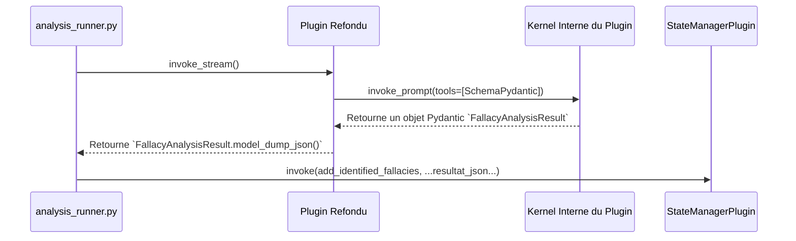

# Plan d'Implémentation : Refonte du `InformalAnalysisPlugin`

## 1. Contexte et Objectif Final

L'implémentation actuelle de `InformalAnalysisPlugin` est une boîte noire qui ne respecte pas les contrats de données du projet, menant à des résultats non fiables, comme l'incapacité à utiliser une taxonomie de sophismes spécifique. L'objectif de cette refonte est de transformer ce composant en un agent robuste, prédictible et aligné sur l'architecture globale du projet, afin de corriger le test `demos/validation_complete_epita.py`.

## 2. Architecture Cible Validée : Le Plugin Hybride à Auto-Orchestration

L'exploration approfondie de `semantic-kernel` et du projet `argumentation_analysis` a validé une architecture cible claire et robuste.

- **Principe :** Le plugin devient une classe Python qui reçoit un `Kernel` par injection de dépendances. Il utilise ce `Kernel` pour orchestrer ses propres appels LLM internes.
- **Fiabilité :** La sortie du LLM est forcée dans un schéma structuré et fiable via Pydantic et la fonctionnalité `tool_choice="required"` de `semantic-kernel`. Le parsing de texte libre, source d'erreurs, est éliminé.
- **Intégration :** La sortie (un objet Pydantic sérialisé en JSON) est conçue pour être directement consommée par le `StateManagerPlugin`, s'intégrant ainsi parfaitement dans le flux d'orchestration existant mis en évidence dans `orchestration/analysis_runner.py`.



## 3. Plan d'Action Séquentiel

Voici les étapes précises pour réaliser l'implémentation.

### Étape 1 : Définir les Schémas de Sortie Pydantic

**Fichier à modifier :** `argumentation_analysis/agents/core/informal/informal_definitions.py`

**Action :** Créer les modèles Pydantic qui serviront de contrat de données avec le LLM. Ajoutez ce code au début du fichier.

```python
from pydantic import BaseModel, Field
from typing import Optional, List

class IdentifiedFallacy(BaseModel):
    """Modèle de données pour un seul sophisme identifié."""
    fallacy_name: str = Field(..., description="Le nom du sophisme, doit correspondre EXACTEMENT à un nom de la taxonomie fournie.")
    justification: str = Field(..., description="Citation exacte du texte et explication détaillée de pourquoi c'est un sophisme.")
    confidence_score: float = Field(..., ge=0.0, le=1.0, description="Score de confiance entre 0.0 et 1.0.")

class FallacyAnalysisResult(BaseModel):
    """Modèle de données pour le résultat complet de l'analyse de sophismes."""
    is_fallacious: bool = Field(..., description="Vrai si au moins un sophisme a été détecté, sinon faux.")
    fallacies: List[IdentifiedFallacy] = Field(..., description="Liste de tous les sophismes identifiés dans le texte.")
```

### Étape 2 : Refondre la Classe `InformalAnalysisPlugin`

**Fichier à modifier :** `argumentation_analysis/agents/core/informal/informal_definitions.py`

**Action :** Remplacer l'implémentation actuelle de `InformalAnalysisPlugin` par la version refondue.

```python
# (Imports existants + les nouveaux de Pydantic)
from semantic_kernel import Kernel
from semantic_kernel.functions import kernel_function
from semantic_kernel.connectors.ai.open_ai import OpenAIPromptExecutionSettings
from argumentation_analysis.utils.taxonomy_loader import load_taxonomy # Assurez-vous que cet import est correct

class InformalAnalysisPlugin:
    """Un plugin hybride qui analyse les sophismes de manière structurée."""

    def __init__(self, kernel: Kernel, taxonomy_file_path: str):
        self.kernel = kernel
        self.taxonomy_df = load_taxonomy(taxonomy_file_path)

    @kernel_function(
        description="Analyse un texte pour identifier les sophismes en se basant sur une taxonomie fournie.",
        name="analyze_argument"
    )
    async def analyze_argument(self, text_to_analyze: str) -> str:
        """
        Orchestre l'analyse d'un texte pour y trouver des sophismes.
        """
        prompt = f"""
        Analyse le texte suivant pour y dénicher des sophismes. Tu dois baser ton analyse
        UNIQUEMENT sur la taxonomie de sophismes suivante. Pour chaque sophisme trouvé,
        tu dois appeler l'outil `FallacyAnalysisResult` avec les informations requises.
        Si aucun sophisme n'est trouvé, tu dois quand même appeler l'outil
        en indiquant que le texte n'est pas fallacieux.

        --- TAXONOMIE DISPONIBLE ---
        {self._get_taxonomy_summary_for_prompt()}

        --- TEXTE À ANALYSER ---
        {text_to_analyze}
        """

        execution_settings = OpenAIPromptExecutionSettings(
            tool_choice="required",
            tools=[FallacyAnalysisResult]
        )

        response = await self.kernel.invoke_prompt(
            prompt,
            settings=execution_settings
        )

        tool_calls = response.tool_calls
        if not tool_calls:
            analysis_result = FallacyAnalysisResult(is_fallacious=False, fallacies=[])
        else:
            # Le kernel a déjà validé la structure grâce au modèle Pydantic
            analysis_result: FallacyAnalysisResult = tool_calls[0].to_tool_function()(
                **tool_calls[0].parse_arguments()
            )

        self._validate_result_against_taxonomy(analysis_result)
        return analysis_result.model_dump_json(indent=2)

    def _get_taxonomy_summary_for_prompt(self) -> str:
        """Formate la taxonomie pour l'injecter dans le prompt."""
        if self.taxonomy_df.empty:
            return "Aucune taxonomie disponible."
        # Cet exemple peut être enrichi si nécessaire
        return "\n".join(
            f"- {row.get('nom_vulgarise', 'N/A')}: {row.get('text_fr', 'N/A')}"
            for _, row in self.taxonomy_df.iterrows()
        )

    def _validate_result_against_taxonomy(self, result: FallacyAnalysisResult):
        """Valide que les sophismes retournés par le LLM existent dans la taxonomie."""
        valid_fallacy_names = set(self.taxonomy_df['nom_vulgarise'].str.lower())
        validated_fallacies = []
        for fallacy in result.fallacies:
            if fallacy.fallacy_name.lower() in valid_fallacy_names:
                validated_fallacies.append(fallacy)
        result.fallacies = validated_fallacies
        if not result.fallacies:
            result.is_fallacious = False

```

### Étape 3 : Adapter la Fonction d'Initialisation `setup_informal_kernel`

**Fichier à modifier :** `argumentation_analysis/agents/core/informal/informal_definitions.py`

**Action :** Remplacer la fonction `setup_informal_kernel` pour qu'elle instancie et enregistre simplement le nouveau plugin.

```python
def setup_informal_kernel(kernel: Kernel, taxonomy_file_path: str):
    """
    Instancie et enregistre le InformalAnalysisPlugin refondu.
    """
    informal_plugin_instance = InformalAnalysisPlugin(
        kernel=kernel, # Injection de dépendance cruciale
        taxonomy_file_path=taxonomy_file_path
    )
    kernel.add_plugin(informal_plugin_instance, "InformalAnalysis")
    return kernel
```

### Étape 4 : Validation Finale

**Fichier à exécuter :** `demos/validation_complete_epita.py`

**Action :** Lancez ce script de test de bout en bout. 

**Critère de Succès :** Le test doit maintenant passer. Le log devrait montrer que l'analyse des sophismes a été effectuée correctement, en identifiant le "Sophisme de la Pente Glissante" comme requis, prouvant que la taxonomie a été utilisée avec succès.

## 4. Bénéfices Attendus

1.  **Fiabilité :** Résultat déterministe et structuré, éliminant les erreurs de parsing.
2.  **Maintenance :** Logique claire et séparée, facile à maintenir et à tester.
3.  **Performance :** Un seul appel LLM pour une analyse complète.
4.  **Cohérence Architecturale :** Alignement parfait avec les patrons de conception du projet.