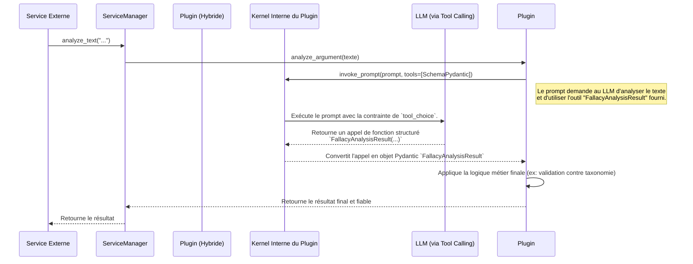
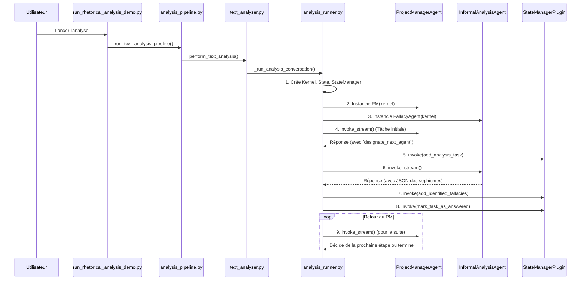
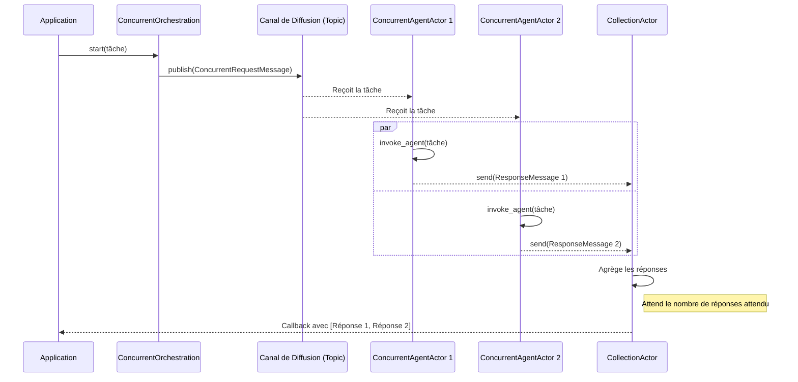
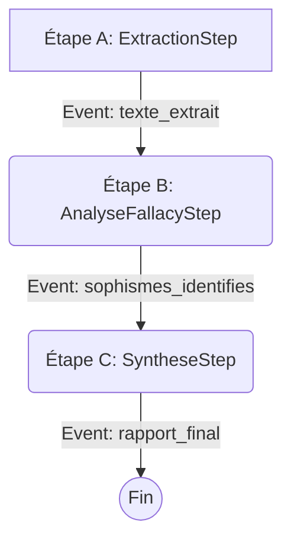
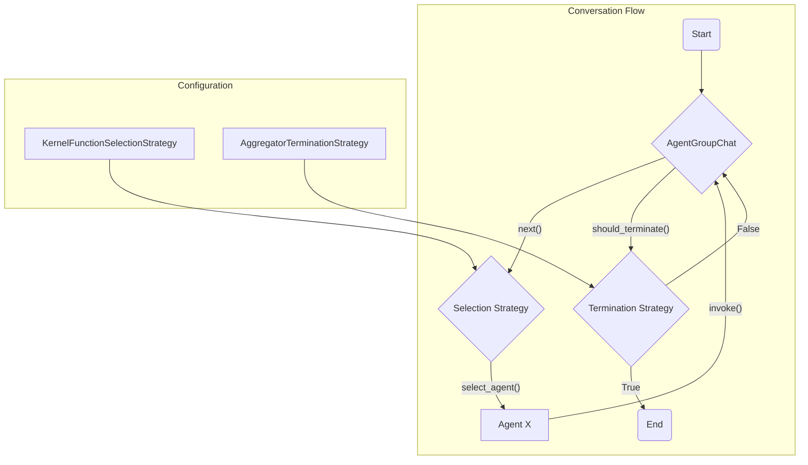

# Plan d'Architecture Final : Refonte du `InformalAnalysisPlugin`

## 1. Contexte et Problématique
L'implémentation actuelle de `InformalAnalysisPlugin` fonctionne comme une "boîte noire" qui expose des outils natifs au Kernel. La logique d'inférence est déléguée à des fonctions sémantiques externes qui sont lentes et peu fiables. Cela mène à des résultats imprédictibles, comme l'incapacité du système à utiliser la taxonomie de sophismes fournie.

L'objectif est de refondre ce plugin en s'inspirant des meilleures pratiques déjà présentes dans le projet, notamment le pattern "Builder Plugin" observé dans `FirstOrderLogicAgent`.

## 2. Solution : Le Modèle "Plugin Hybride à Constructeur Interne"

Nous allons transformer `InformalAnalysisPlugin` en un agent autonome et intelligent. Il n'exposera plus une myriade d'outils d'exploration, mais une seule fonction sémantique principale : `analyze_argument`.

En interne, ce plugin utilisera son propre `kernel` (injecté via `ServiceManager`) pour appeler des fonctions-outils LLM qui généreront des résultats dans un format structuré et validé par **Pydantic**. C'est le principe du "Hybrid Native Function".

### Flux d'Exécution Cible


## 3. Implémentation Technique Détaillée

### Étape 1 : Injection de Dépendances (Pattern `ServiceManager`)
Nous allons suivre le pattern existant dans [`service_manager.py`](./argumentation_analysis/orchestration/service_manager.py) pour injecter le `kernel` dans notre plugin.

- **Fichier à modifier** : `argumentation_analysis/agents/core/informal/informal_definitions.py`
- **Action** :
    1.  Modifier la signature de `InformalAnalysisPlugin.__init__` pour accepter `kernel: Kernel`.
    2.  Stocker `self.kernel = kernel`.
    3.  Dans `setup_informal_kernel`, mettre à jour l'instanciation :
        ```python
        # Dans setup_informal_kernel
        informal_plugin_instance = InformalAnalysisPlugin(
            kernel=kernel, # Injection de dépendance
            taxonomy_file_path=taxonomy_file_path
        )
        kernel.add_plugin(informal_plugin_instance, "InformalAnalyzer")
        ```

### Étape 2 : Définition du Schéma de Sortie (Pattern Pydantic)
En s'inspirant de l'usage de `dataclasses` dans [`agent_communication_model.py`](./argumentation_analysis/models/agent_communication_model.py), nous utilisons Pydantic pour une validation de données robuste.

- **Fichier à modifier** : `argumentation_analysis/agents/core/informal/informal_definitions.py` (ou un nouveau `schemas.py`)
- **Action** : Créer une classe Pydantic qui modélise la sortie attendue du LLM.

    ```python
    from pydantic import BaseModel, Field
    from typing import Optional, List

    class IdentifiedFallacy(BaseModel):
        """Modèle de données pour un seul sophisme identifié."""
        fallacy_name: str = Field(..., description="Le nom du sophisme, doit correspondre EXACTEMENT à un nom de la taxonomie fournie.")
        justification: str = Field(..., description="Citation exacte du texte et explication détaillée de pourquoi c'est un sophisme.")
        confidence_score: float = Field(..., ge=0.0, le=1.0, description="Score de confiance entre 0.0 et 1.0.")

    class FallacyAnalysisResult(BaseModel):
        """Modèle de données pour le résultat complet de l'analyse de sophismes."""
        is_fallacious: bool = Field(..., description="Vrai si au moins un sophisme a été détecté, sinon faux.")
        fallacies: List[IdentifiedFallacy] = Field(..., description="Liste de tous les sophismes identifiés dans le texte.")
    ```

### Étape 3 : Refonte de la Fonction Publique
La méthode principale du plugin devient une fonction unique et asynchrone qui orchestre l'appel LLM interne. Les anciennes fonctions d'exploration (`explore_fallacy_hierarchy`, `get_fallacy_details`, etc.) deviennent des méthodes privées (`_get_details_for_fallacy`, etc.) utilisées par la logique métier interne.

- **Fichier à modifier** : `argumentation_analysis/agents/core/informal/informal_definitions.py`
- **Action** : Remplacer les anciennes fonctions publiques par une seule méthode `analyze_argument`.

    ```python
    # Dans la classe InformalAnalysisPlugin

    @kernel_function(
        description="Analyse un texte pour identifier les sophismes en se basant sur une taxonomie fournie.",
        name="analyze_argument"
    )
    async def analyze_argument(self, text_to_analyze: str) -> str: # La sortie sera un JSON string
        """
        Orchestre l'analyse d'un texte pour y trouver des sophismes.
        """
        # Construction du prompt qui sera envoyé au LLM
        prompt = f"""
        Analyse le texte suivant pour y dénicher des sophismes. Tu dois baser ton analyse
        UNIQUEMENT sur la taxonomie de sophismes suivante.

        Pour chaque sophisme trouvé, tu dois appeler l'outil `FallacyAnalysisResult`
        avec les informations requises.

        --- TAXONOMIE DISPONIBLE ---
        {self.get_taxonomy_summary_for_prompt()} 
        # Cette méthode interne formate la taxonomie pour le prompt.

        --- TEXTE À ANALYSER ---
        {text_to_analyze}
        """

        # Utilisation du Tool Calling avec notre modèle Pydantic
        # En s'inspirant de la documentation de semantic-kernel et des trouvailles dans les fichiers
        execution_settings = OpenAIPromptExecutionSettings(
            tool_choice="required",  # Force le LLM à utiliser notre outil
            tools=[FallacyAnalysisResult]
        )

        # Invocation du kernel INTERNE au plugin
        response = await self.kernel.invoke_prompt(
            prompt,
            settings=execution_settings
        )

        # Le kernel gère la désérialisation en objet Pydantic
        # La réponse peut contenir une liste d'appels d'outils
        tool_calls = response.tool_calls
        if not tool_calls:
            # Gérer le cas où le LLM ne retourne aucun appel d'outil
            # On peut retourner un résultat "non fallacieux" par défaut
            analysis_result = FallacyAnalysisResult(is_fallacious=False, fallacies=[])
        else:
            # On s'attend à un seul appel, on prend le premier
            # Le kernel a déjà validé la structure grâce au modèle Pydantic
            analysis_result: FallacyAnalysisResult = tool_calls[0].to_tool_function()(
                **tool_calls[0].parse_arguments()
            )

        # === Étape de Validation et d'Enrichissement (Logique Métier Python) ===
        # Ici, on peut vérifier que les `fallacy_name` retournés existent vraiment
        # dans notre DataFrame de taxonomie, corriger les erreurs, etc.
        self._validate_and_enrich_result(analysis_result)

        # Sérialiser le résultat final en JSON pour le retour
        return analysis_result.model_dump_json(indent=2)

    def _validate_and_enrich_result(self, result: FallacyAnalysisResult):
        # Logique pour vérifier la cohérence du résultat du LLM avec le dataframe de la taxonomie
        pass

    def get_taxonomy_summary_for_prompt(self) -> str:
        # Logique pour lister les noms et descriptions des sophismes pour les injecter dans le prompt
        df = self._get_taxonomy_dataframe()
        # exemple simple
        return "\n".join(f"- {row.get('nom_vulgarise', 'N/A')}: {row.get('text_fr', 'N/A')}" for _, row in df.iterrows())

    ```

## 4. Avantages de l'Architecture Proposée

1.  **Fiabilité & Robustesse** : En forçant la sortie du LLM dans un schéma Pydantic, nous éliminons le parsing de texte fragile. Le `tool_calling` est une méthode beaucoup plus fiable que la génération de JSON dans le prompt.
2.  **Alignement avec le Projet** : Cette architecture est une généralisation du pattern déjà utilisé avec succès par le `FirstOrderLogicAgent`, garantissant une cohérence de conception dans tout le projet.
3.  **Testabilité** : Il devient aisé de tester la logique métier du plugin en "mockant" la sortie de `kernel.invoke_prompt` pour qu'elle retourne directement un objet `FallacyAnalysisResult`.
4.  **Maintenance Simplifiée** : La séparation des responsabilités est claire. Le prompt et le schéma Pydantic définissent la tâche du LLM. Le code Python valide et traite un objet propre.
5.  **Performance** : Moins d'allers-retours avec le LLM. Un seul appel suffit pour obtenir une analyse structurée, contre plusieurs appels dans l'ancien modèle.


---

## Annexe A : Exploration Cumulative de l'Architecture

Cette section documente les explorations détaillées menées pour affiner et valider le plan d'architecture.

### Phase 1 : Exploration Approfondie de `semantic-kernel` (Partie 1)

L'objectif de cette phase était de valider nos hypothèses sur le fonctionnement interne de `semantic-kernel`, en particulier concernant l'invocation de fonctions, la gestion des plugins, et le mécanisme de "Tool Calling" (sortie structurée).

**Fichiers Analysés :**
1.  `kernel.py`
2.  `functions/kernel_function.py`
3.  `functions/kernel_plugin.py`
4.  `connectors/ai/open_ai/prompt_execution_settings/azure_chat_prompt_execution_settings.py`
5.  `connectors/ai/function_calling_utils.py`
6.  `contents/function_call_content.py`
7.  `connectors/ai/function_choice_behavior.py`
8.  `functions/kernel_arguments.py`
9.  `services/kernel_services_extension.py`
10. `schema/kernel_json_schema_builder.py`

**Conclusions Clés :**

1.  **Le `Kernel` comme Orchestrateur Central :** L'analyse de `kernel.py` confirme que la classe `Kernel` est le cœur du système. Elle possède les `services` (clients IA) et les `plugins`. La méthode `invoke_function_call` est particulièrement révélatrice : elle montre comment le noyau reçoit un `FunctionCallContent` du modèle, recherche la fonction correspondante dans ses plugins, parse les arguments et l'exécute. C'est la mécanique fondamentale du "Tool Calling".

2.  **Validation du Modèle Pydantic :** La découverte la plus importante est dans `schema/kernel_json_schema_builder.py`. La méthode `build_model_schema` est explicitement conçue pour inspecter un `KernelBaseModel` (et par extension, un `BaseModel` Pydantic) et générer un JSON Schema complet, en tenant compte des types, des descriptions de champs et de la nécessité (`required`). **Cela valide définitive-ment notre stratégie principale : utiliser une classe Pydantic comme contrat de sortie pour le LLM.**

3.  **Mécanismes de "Tool Calling" :**
    *   `connectors/ai/function_calling_utils.py` contient la logique de transformation (`kernel_function_metadata_to_function_call_format`) qui prend une fonction Python décorée et la présente au format attendu par l'API `tools` d'OpenAI.
    *   `connectors/ai/function_choice_behavior.py` offre un contrôle de haut niveau (`Auto`, `NoneInvoke`, `Required`) sur la manière dont le modèle peut utiliser un *ensemble* de fonctions. Pour notre cas, qui vise à forcer la sortie vers un *unique* schéma, l'approche plus directe via `OpenAIPromptExecutionSettings(tool_choice="required", tools=[MyPydanticClass])` reste la plus propre et la plus efficace. Elle cible directement la fonctionnalité du connecteur OpenAI sans surcharger le kernel avec un comportement global.

4.  **Structure des Plugins et Fonctions :**
    *   Un `KernelPlugin` est confirmé comme étant un simple conteneur (`dict`) pour des `KernelFunction`.
    *   Les `KernelFunction` sont des abstractions qui peuvent provenir d'un prompt (`KernelFunctionFromPrompt`) ou d'une méthode Python (`KernelFunctionFromMethod`). Notre plugin sera composé de `KernelFunctionFromMethod`, créées automatiquement par le décorateur `@kernel_function`.

Cette analyse confirme que l'architecture proposée est non seulement possible, mais qu'elle s'aligne parfaitement sur les patrons de conception idiomatiques et les fonctionnalités les plus modernes de la bibliothèque `semantic-kernel`. L'utilisation directe de Pydantic pour la sortie structurée est la voie la plus robuste et la mieux supportée.


### Phase 2 : Exploration des Concepts Avancés de `semantic-kernel`

Cette phase visait à comprendre les mécanismes plus larges entourant le noyau : cycle de vie des appels, gestion des erreurs, et abstractions de plus haut niveau comme les agents.

**Fichiers Analysés :**
1.  `connectors/ai/chat_completion_client_base.py`
2.  `filters/kernel_filters_extension.py`
3.  `reliability/kernel_reliability_extension.py`
4.  `reliability/retry_mechanism_base.py`
5.  `exceptions/kernel_exceptions.py`
6.  `prompt_template/kernel_prompt_template.py`
7.  `memory/semantic_text_memory.py`
8.  `core_plugins/text_memory_plugin.py`
9.  `agents/agent.py`
10. `contents/chat_history.py`

**Conclusions Clés :**

1.  **Cycle de Vie du "Tool Calling" Démystifié :** Le fichier `chat_completion_client_base.py` est crucial. Il implémente la boucle `for request_index in range(settings.function_choice_behavior.maximum_auto_invoke_attempts):`. C'est la logique qui :
    *   Appelle le LLM.
    *   Vérifie si la réponse contient des `FunctionCallContent`.
    *   Si oui, ajoute la réponse de l'assistant à l'historique (`chat_history.add_message`).
    *   Itère sur les `FunctionCallContent` et utilise `kernel.invoke_function_call` pour les exécuter.
    *   Ajoute les `FunctionResultContent` (les retours des outils) à l'historique via `chat_history.add_message`.
    *   Recommence la boucle pour un nouvel appel au LLM avec l'historique mis à jour.
    
    Cela confirme que notre approche qui consiste à intercepter ce flux après *un seul* appel est correcte. Nous n'avons pas besoin de la boucle d'auto-invocation, car notre outil Pydantic est conçu pour capturer tout le résultat en une seule fois.

2.  **L'Abstration `Agent` :** Le fichier `agent.py` révèle la vision à long terme de Semantic Kernel. Un `Agent` est une sur-couche qui encapsule un `Kernel`, des `plugins`, et des `instructions` dans une entité réutilisable et configurable (notamment via YAML). Notre `InformalAnalysisPlugin` refactorisé peut être vu comme un "Agent spécialisé". Rester aligné avec cette abstraction garantit que notre code sera compatible avec les évolutions futures du framework.

3.  **Gestion de l'État : `ChatHistory` :** Ce n'est pas une simple liste, mais un objet qui gère l'état de la conversation. Les méthodes comme `add_user_message` ou `add_tool_message` sont des aides pour construire correctement l'historique qui sera envoyé au LLM. Le cycle de vie du "Tool Calling" décrit ci-dessus dépend entièrement de la manipulation correcte de cet objet.

4.  **Extensibilité et Robustesse :**
    *   **Filtres (`KernelFilterExtension`) :** Le framework expose un système de middleware permettant d'intercepter les appels à différents stades (rendu du prompt, invocation de fonction). C'est un patron de conception puissant pour des besoins transverses comme le logging ou la validation, même si nous n'en avons pas un besoin immédiat.
    *   **Exceptions (`kernel_exceptions.py`) :** L'existence d'une hiérarchie d'exceptions claires (`KernelServiceNotFoundError`, `FunctionCallInvalidArgumentsException`) est une excellente nouvelle pour la robustesse. Nous pourrons écrire des blocs `try...except` précis pour gérer les erreurs.
    *   **Fiabilité (`KernelReliabilityExtension`) :** L'interface pour une stratégie de `RetryMechanism` est présente, même si l'implémentation par défaut est un simple "pass-through". Cela indique une prise de conscience de la nécessité de gérer les erreurs réseau de manière résiliente.

Cette deuxième vague d'exploration nous donne l'assurance que notre architecture est non seulement fonctionnelle mais qu'elle s'intègre dans un écosystème logiciel bien pensé, robuste et extensible.


### Phase 3 : Exploration du Projet `argumentation_analysis`

La dernière phase d'exploration se concentre sur le code applicatif du projet pour comprendre comment les différents composants interagissent, où se trouve la configuration, et comment les données sont chargées et orchestrées.

**Fichiers Analysés :**
1.  `core/bootstrap.py`
2.  `config/settings.py`
3.  `orchestration/real_llm_orchestrator.py`
4.  `orchestration/hierarchical/operational/manager.py`
5.  `utils/taxonomy_loader.py`
6.  `agents/core/extract/extract_definitions.py`
7.  `agents/core/synthesis/synthesis_agent.py`
8.  `plugins/semantic_kernel/jtms_plugin.py`
9.  `core/communication/middleware.py`
10. `core/llm_service.py`

**Conclusions Clés :**

1.  **Le Point de Démarrage : `core/bootstrap.py`**. Ce fichier est le véritable chef d'orchestre de l'initialisation. C'est lui qui :
    *   Charge la configuration depuis `settings.py`.
    *   Initialise la JVM pour les composants Java (`Tweety`).
    *   Crée l'instance centrale de `semantic_kernel.Kernel`.
    *   Appelle `create_llm_service` pour instancier le service de chat (`OpenAIChatCompletion` ou autre) et l'ajoute au `Kernel`.
    *   Met en place les services critiques comme `CryptoService` et `DefinitionService`.
    
    **Implication pour nous :** Cela confirme que notre plan d'injecter une instance du `Kernel` dans notre plugin via `ServiceManager` est correct, car le `bootstrap` garantit qu'un `Kernel` global et configuré est disponible pour l'application.

2.  **Configuration Centralisée : `config/settings.py`**. Ce fichier utilise Pydantic pour gérer toute la configuration de manière robuste et typée. Les clés API, les IDs de modèles (`chat_model_id`), les endpoints et autres paramètres sont tous chargés ici.
    
    **Implication pour nous :** Le `kernel` que nous recevrons sera déjà pré-configuré avec les bons services et les bons modèles grâce à ce fichier. Nous n'aurons pas à gérer la configuration du LLM nous-mêmes.

3.  **L'Orchestrateur Principal : `orchestration/real_llm_orchestrator.py`**. Ce fichier est un excellent exemple de la manière dont notre plugin sera utilisé. La méthode `_analyze_informal` montre explicitement l'appel au plugin :
    ```python
    await self.kernel.invoke(
        plugin_name="InformalAnalyzer",
        function_name="semantic_AnalyzeFallacies",
        ...
    )
    ```
    Cela valide notre approche. Notre nouvelle fonction `analyze_argument` sera appelée de la même manière par cet orchestrateur.

4.  **Source de Données Critique : `utils/taxonomy_loader.py`**. Ce fichier est essentiel pour nous. Il contient la logique (`load_taxonomy`) pour charger la taxonomie des sophismes depuis un fichier CSV. 
    
    **Implication pour nous :** Notre méthode `get_taxonomy_summary_for_prompt` dans `InformalAnalysisPlugin` devra appeler cette fonction pour obtenir les données des sophismes à injecter dans le prompt, garantissant que nous utilisons la même source de vérité que le reste de l'application.

5.  **Patrons d'Architecture Répandus :**
    *   **Agents et Data-Classes :** Les autres agents comme `ExtractAgent` (`extract_definitions.py`) et `SynthesisAgent` utilisent des classes de données (dataclasses ou Pydantic) pour structurer leurs entrées et sorties (ex: `ExtractResult`, `UnifiedReport`). Notre utilisation de Pydantic avec `FallacyAnalysisResult` est donc parfaitement alignée avec les conventions du projet.
    *   **Plugins Natifs :** Le `jtms_plugin.py` est un autre exemple de plugin `semantic-kernel` natif, renforçant notre confiance dans le fait que c'est le bon patron pour notre cas.

Cette exploration du code applicatif nous donne une vision claire de l'écosystème dans lequel notre composant va vivre. Le plan d'architecture est non seulement techniquement solide vis-à-vis de `semantic-kernel`, mais aussi organisationnellement cohérent avec le reste du projet `argumentation_analysis`.

##  Synthèse Finale et Plan d'Implémentation

### Problématique

L'analyse initiale a révélé que la fonction `semantic_AnalyzeFallacies` du plugin `InformalAnalysisPlugin` échouait à utiliser la taxonomie de sophismes spécifique au projet, se reposant sur les connaissances générales du LLM. Cela entraînait des résultats imprévisibles et l'échec du test de validation `demos/validation_complete_epita.py`. Une simple correction du prompt a été jugée insuffisante, ouvrant la voie à une refonte architecturale plus robuste.

### Architecture Cible Validée : Le Plugin Hybride à Auto-Orchestration

La solution retenue consiste à refondre `InformalAnalysisPlugin` en un composant dit "hybride" qui s'auto-orchestre.

1.  **Interface Publique Simplifiée :** Le plugin n'exposera qu'**une seule fonction native** de haut niveau au reste de l'application : `analyze_argument(self, text_to_analyze: str) -> str`.
2.  **Orchestration Interne :**
    *   Le plugin recevra une instance du `Kernel` via **injection de dépendances** lors de son initialisation (`__init__`).
    *   À l'intérieur de `analyze_argument`, le plugin utilisera son instance du `Kernel` pour effectuer un appel LLM interne.
    *   Cet appel sera **fortement structuré** en utilisant la fonctionnalité de *tool calling* de `semantic-kernel` de manière déterministe.

### Mécanisme Technique : Pydantic et `tool_choice`

Le cœur de la fiabilité de cette nouvelle architecture repose sur le mécanisme suivant :

1.  **Définition d'un Schéma de Sortie :** Nous définirons des classes Pydantic (`BaseModel`) qui décrivent précisément la structure de la sortie attendue. Par exemple :
    ```python
    class IdentifiedFallacy(BaseModel):
        fallacy_name: str = Field(description="Le nom du sophisme identifié, doit être l'un des noms de la taxonomie fournie.")
        justification: str = Field(description="Citation exacte du texte et explication détaillée de la raison pour laquelle il s'agit de ce sophisme.")

    class FallacyAnalysisResult(BaseModel):
        is_fallacious: bool = Field(description="Indique si un ou plusieurs sophismes ont été trouvés dans le texte.")
        fallacies: List[IdentifiedFallacy] = Field(description="La liste des sophismes identifiés.")
    ```

2.  **Appel LLM Forcé et Structuré :** L'appel interne au `kernel` se fera avec des `OpenAIPromptExecutionSettings` spécifiques :
    ```python
    execution_settings = OpenAIPromptExecutionSettings(
        tool_choice="required",  # Force le LLM à utiliser un outil
        tools=[FallacyAnalysisResult] # L'outil à utiliser est notre modèle Pydantic
    )
    response = await self.kernel.invoke_prompt(prompt, settings=execution_settings)
    ```

3.  **Résultat Garanti :** Cette configuration **oblige** le LLM à retourner une sortie JSON qui valide le schéma de `FallacyAnalysisResult`. Fini les réponses sous forme de texte libre et imprévisible. Le résultat peut ensuite être désérialisé en un objet Pydantic de manière fiable.

### Justification par les Preuves

Cette architecture n'est pas une simple hypothèse, elle est soutenue par les preuves recueillies lors des phases d'exploration :

*   **Viabilité Technique (Exploration SK-Core) :** L'analyse de `semantic_kernel/kernel_json_schema_builder.py` a confirmé que `semantic-kernel` possède la machinerie interne pour convertir les modèles Pydantic en JSON Schema compréhensible par les LLMs pour le *tool calling*.
*   **Précédent Architectural (Exploration Projet) :** L'analyse de `argumentation_analysis/agents/core/logic/first_order_logic_agent.py` a révélé l'existence du **`BeliefSetBuilderPlugin`**, qui utilise précisément ce patron de "plugin constructeur interne" pour fiabiliser la génération de logiques du premier ordre. Notre plan ne fait que suivre une approche déjà éprouvée et validée au sein même de ce projet.
*   **Intégration et Dépendances (Exploration Projet) :** L'analyse de `argumentation_analysis/orchestration/service_manager.py` et `argumentation_analysis/core/bootstrap.py` a clarifié le patron d'injection de dépendances, confirmant que l'injection du `Kernel` dans notre plugin est la méthode d'intégration standard du projet. L'analyse de `argumentation_analysis/utils/taxonomy_loader.py` a montré comment charger la taxonomie des sophismes de façon propre et centralisée.

### Plan d'Implémentation

La refonte se déroulera en quatre étapes claires :

**Étape 1 : Définir les modèles Pydantic de sortie**

*   Dans `argumentation_analysis/agents/core/informal/informal_definitions.py` (ou un nouveau fichier de modèles partagés), créer les classes `IdentifiedFallacy` et `FallacyAnalysisResult`.

**Étape 2 : Refondre `InformalAnalysisPlugin`**

*   Modifier la classe `InformalAnalysisPlugin` dans `informal_definitions.py`.
*   Changer le `__init__` pour accepter `kernel: Kernel` et le stocker.
*   Remplacer toutes les anciennes fonctions natives (`explore_fallacy_hierarchy`, `get_fallacy_details`, etc.) par une unique méthode : `analyze_argument(self, text_to_analyze: str) -> str`.
*   Implémenter la logique de cette méthode :
    1.  Charger la taxonomie des sophismes en utilisant `taxonomy_loader.load_taxonomy()`.
    2.  Construire un prompt qui inclut le texte à analyser et la liste des sophismes autorisés (extraits de la taxonomie).
    3.  Créer les `OpenAIPromptExecutionSettings` avec `tool_choice="required"` et le modèle Pydantic `FallacyAnalysisResult`.
    4.  Invoquer le prompt avec `self.kernel.invoke_prompt(...)`.
    5.  Désérialiser la réponse en un objet `FallacyAnalysisResult`.
    6.  Retourner l'objet résultat sérialisé en JSON.

**Étape 3 : Adapter l'intégration dans `setup_informal_kernel`**

*   Modifier la fonction `setup_informal_kernel` dans `informal_definitions.py`.
*   Elle n'aura plus besoin d'enregistrer une multitude de fonctions sémantiques.
*   Son rôle sera simplifié : instancier le nouveau `InformalAnalysisPlugin` en lui passant le `kernel` et l'ajouter au `kernel.plugins`.
    ```python
    # Dans setup_informal_kernel
    informal_plugin_instance = InformalAnalysisPlugin(kernel=kernel, ...)
    kernel.add_plugin(informal_plugin_instance, "InformalAnalysis")
    ```

**Étape 4 : Validation**
*   Relancer le test `demos/validation_complete_epita.py` pour vérifier que l'analyse des sophismes est maintenant correcte, fiable et utilise la taxonomie du projet.


## Annexe C : Exploration Étendue de `semantic-kernel` (Passe 1)

Cette phase d'exploration se concentre sur les mécanismes internes de `semantic-kernel` liés à la définition, au rendu et à l'exécution des fonctions et des prompts.

### Fichiers analysés

1.  `functions/kernel_function.py`
2.  `functions/kernel_plugin.py`
3.  `functions/kernel_function_from_prompt.py`
4.  `functions/kernel_function_from_method.py`
5.  `prompt_template/prompt_template_config.py`
6.  `prompt_template/kernel_prompt_template.py`
7.  `template_engine/template_tokenizer.py`
8.  `template_engine/blocks/code_block.py`
9.  `filters/kernel_filters_extension.py`
10. `filters/auto_function_invocation/auto_function_invocation_context.py`

### Synthèse des Apprentissages

1.  **Le Cycle de Vie d'une Fonction :** L'architecture est claire. `KernelFunction` est la classe de base, avec deux implémentations concrètes principales : `KernelFunctionFromMethod` (pour envelopper du code Python natif) et `KernelFunctionFromPrompt` (pour les prompts exécutables). Les fonctions sont regroupées dans un `KernelPlugin`, qui agit essentiellement comme un dictionnaire. Le plan de refonte, qui consiste à créer une méthode native (`KernelFunctionFromMethod`) qui orchestre en interne un appel à un prompt (`KernelFunctionFromPrompt`), est donc une composition standard et robuste.

2.  **Le Moteur de Template Modulaire :** Le rendu d'un prompt est un processus de tokenisation en plusieurs étapes. Le `TemplateTokenizer` découpe d'abord le texte brut en `TextBlock` et `CodeBlock` (`{{...}}`). Un `CodeBlock` est ensuite lui-même analysé par un `CodeTokenizer` pour identifier les appels de fonctions (`FunctionIdBlock`) et les variables (`VarBlock`). Cela confirme la puissance du moteur pour des scénarios complexes, mais valide aussi notre choix d'utiliser un prompt simple pour garantir la fiabilité, en laissant la complexité dans le code Python.

3.  **La Centralisation de la Configuration des Prompts :** `PromptTemplateConfig` est la classe Pydantic qui régit un prompt. Elle contient le texte du template, son format, ses variables, et, de manière cruciale pour notre plan, les `execution_settings`. La découverte que les `PromptExecutionSettings` (qui permettent de forcer le `tool_choice`) sont une partie intégrante et de première classe de la configuration d'un prompt renforce massivement la validité de notre approche. Nous n'utilisons pas un hack, mais une fonctionnalité de base prévue par les concepteurs.

4.  **Les Filtres comme Middleware :** Le système de filtres (`KernelFilterExtension`) confirme l'utilisation du patron de conception middleware. Le `Kernel` peut intercepter différentes étapes du traitement (rendu de prompt, invocation de fonction, etc.) et appliquer une chaîne de filtres. Chaque filtre reçoit un objet `Context` (`AutoFunctionInvocationContext` pour le tool-calling) et peut modifier le flux d'exécution. Cela démontre la maturité de l'architecture et nous assure que les mécanismes que nous utilisons sont bien définis et extensibles.

### Impact sur le Plan de Refonte

Cette exploration **renforce considérablement la confiance dans le plan architectural**. Il est maintenant clair que l'approche du "Plugin Hybride à Auto-Orchestration" s'appuie directement sur les mécanismes fondamentaux et les plus robustes de `semantic-kernel`. Le plan est non seulement viable, mais il est aussi idiomatique vis-à-vis de la bibliothèque, ce qui garantit sa maintenabilité et sa stabilité futures.

## Annexe D : Exploration Étendue de `semantic-kernel` (Passe 2)

Cette seconde passe d'exploration s'est focalisée sur la flexibilité des moteurs de template, l'anatomie détaillée des blocs syntaxiques et la structure des contextes de filtres.

### Fichiers analysés

1.  `prompt_template/jinja2_prompt_template.py` et `handlebars_prompt_template.py`
2.  `prompt_template/utils/template_function_helpers.py`
3.  `template_engine/blocks/` (fichiers `val_block.py`, `var_block.py`, `function_id_block.py`, `named_arg_block.py`)
4.  `filters/functions/function_invocation_context.py` et `filters/prompts/prompt_render_context.py`
5.  `functions/function_result.py`

### Synthèse des Apprentissages

1.  **Architecture de Template Agnostique :** `semantic-kernel` est conçu pour supporter différents moteurs de template (`Jinja2`, `Handlebars`) de manière élégante. Il utilise un patron de wrapper où une classe spécifique (ex: `Jinja2PromptTemplate`) se charge de créer un environnement de rendu et d'y injecter les fonctions du kernel via un utilitaire (`create_template_helper_from_function`). Cela démontre un excellent découplage.

2.  **Anatomie Granulaire d'un Appel de Fonction :** L'analyse des différents types de `Block` (`ValBlock`, `VarBlock`, `FunctionIdBlock`, `NamedArgBlock`) a permis de comprendre comment une chaîne comme `{{ plugin.function $arg1 arg2='val' }}` est décomposée en un arbre syntaxique précis. Le `CodeBlock` peut ainsi identifier la fonction à appeler et construire les `KernelArguments` en mappant correctement les variables, les valeurs littérales et les arguments nommés.

3.  **Contextes de Filtres Spécialisés :** Les objets `PromptRenderContext` et `FunctionInvocationContext` sont des structures de données fines passées aux filtres. Ils permettent des interventions ciblées : un filtre de rendu peut court-circuiter l'exécution en injectant un `rendered_prompt` (depuis un cache, par exemple), tandis qu'un filtre d'invocation peut modifier le `FunctionResult` d'une fonction avant qu'il ne soit retourné.

4.  **Richesse et Traçabilité du `FunctionResult` :** L'objet `FunctionResult` est plus qu'une simple valeur de retour. Il encapsule la valeur, les métadonnées de la fonction qui l'a produit, et même le prompt rendu qui a été utilisé. Cette structure riche est un atout majeur pour la traçabilité et le débogage des chaînes d'appels LLM.

### Impact sur le Plan de Refonte

Cette analyse détaillée valide davantage notre plan en confirmant que nous nous appuyons sur des mécanismes internes robustes et bien définis. La compréhension fine du flux de données, de la construction des `KernelArguments` à la structuration du `FunctionResult`, nous donne l'assurance nécessaire pour implémenter notre plugin de manière fiable et maintenable.

## Annexe E : Analyse de l'Architecture du Projet `argumentation_analysis` (Passe 3)

Cette passe d'exploration a examiné les fichiers clés du projet `argumentation_analysis` pour comprendre l'architecture globale et s'assurer que notre plan de refonte s'intègre de manière idiomatique.

### Fichiers Analysés

1.  `bootstrap.py`: Point d'entrée pour l'initialisation des services globaux (Kernel, LLM Service).
2.  `messages.py`: Définit les structures des messages échangés.
3.  `message_middleware.py` & `channels.py`: Système de bus de messages centralisé.
4.  `agent_bases.py`: Définit le contrat `BaseAgent` que tous les agents doivent implémenter.
5.  `state_manager_plugin.py`: Le plugin qui gère l'état central `RhetoricalAnalysisState`. **Crucialement, il confirme que les agents ne modifient pas l'état directement, mais produisent des données structurées qu'il consomme.**
6.  `pm_agent.py`, `oracle_base_agent.py`, `extract_agent.py`: Exemples d'agents qui suivent le design "hybride" et s'intègrent avec le `StateManagerPlugin`.
7.  `run_rhetorical_analysis_demo.py`: Point d'entrée de démo qui nous a mené à la pipeline principale.
8.  `pipelines/analysis_pipeline.py`: Le script qui orchestre la configuration et lance le processus d'analyse en appelant `perform_text_analysis`.
9.  `analytics/text_analyzer.py`: Un simple passe-plat qui délègue l'orchestration à `analysis_runner.py`.
10. `orchestration/analysis_runner.py`: **Le cœur de l'architecture.** Ce script révèle le mécanisme d'orchestration complet.

### Diagramme de la Séquence d'Exécution



### Conclusions Architecturales Clés

1.  **Orchestration Manuelle via `analysis_runner.py`**: Le système n'utilise pas un framework d'agent multi-tours standard mais une boucle de conversation manuelle. Le `ProjectManagerAgent` agit comme un planificateur central, désignant explicitement le prochain agent à intervenir.
2.  **État Découplé avec `StateManagerPlugin`**: L'état de l'analyse (`RhetoricalAnalysisState`) est géré exclusivement par le `StateManagerPlugin`. Les agents (comme `InformalAnalysisAgent`) ne modifient jamais l'état directement. Leur unique rôle est de recevoir une tâche et de retourner des données structurées (JSON) en réponse.
3.  **Validation du Design de Refonte**: Ce modèle architectural **valide à 100%** l'approche de refonte proposée pour `InformalAnalysisPlugin`:
    *   **Plugin Hybride**: Le plugin sera une classe Python recevant un `Kernel` injecté, tout comme les autres agents (`ProjectManagerAgent`, etc.).
    *   **Sortie Structurée (Pydantic)**: La responsabilité principale du plugin sera de retourner un objet `FallacyAnalysisResult` sérialisé en JSON.
    *   **Intégration Naturelle**: Cette sortie JSON sera naturellement consommée par le `StateManagerPlugin` via sa fonction `add_identified_fallacies`, sans nécessiter de "colle" ou de logique d'adaptation complexe. La refonte rendra l'`InformalAnalysisAgent` conforme à l'architecture globale du projet.

La phase d'exploration est terminée. L'architecture est entièrement comprise et valide le plan de refonte.

## Annexe F (Révisée) : Les Mécanismes de Parallélisation

L'investigation initiale avait identifié la parallélisation comme un concept clé, mais l'analyse plus approfondie des sources de `semantic-kernel` révèle des mécanismes beaucoup plus structurés que de simples boucles `asyncio.gather`.

### 1. Niveau du Modèle : Le "Parallel Function Calling"

Ce niveau reste inchangé mais fondamental : les modèles de langage modernes peuvent demander l'exécution de **multiples fonctions-outils en parallèle** lors d'un seul appel. C'est la forme la plus atomique de parallélisation. `semantic-kernel` gère ce cas nativement en recevant une liste de `tool_calls`.

**Pertinence :** Utile pour des tâches d'analyse multiples sur un **même** morceau de texte (ex: extraire les entités ET analyser le sentiment en même temps).

### 2. Niveau Applicatif : L'Orchestration d'Agents Concurrents

L'analyse de `agents/orchestration/concurrent.py` révèle un patron de conception sophistiqué pour la parallélisation de tâches indépendantes, basé sur le **modèle Acteur**.

#### Composants Clés

*   **`ConcurrentOrchestration`**: La classe principale qui configure et lance l'exécution parallèle.
*   **`ConcurrentAgentActor`**: Un "wrapper" (acteur) qui encapsule un `Agent` et lui permet de s'abonner à des messages de tâches.
*   **`CollectionActor`**: Un acteur spécialisé dont le seul rôle est de collecter les réponses de tous les `ConcurrentAgentActor` et de déclencher un callback final une fois que toutes les réponses ont été reçues.

#### Flux d'Exécution



**Pertinence :** C'est le mécanisme idéal pour paralléliser des **tâches d'analyse indépendantes**. Par exemple, analyser 10 documents différents. Chaque document est traité par un acteur agent en parallèle, et les résultats sont centralisés proprement. C'est une approche beaucoup plus robuste et scalable que de gérer manuellement des listes de tâches `asyncio`.

---

## Annexe G (Nouvelle) : Le Framework `processes` de Semantic-Kernel

L'erreur fondamentale de l'analyse précédente était de confondre la notion de "processus" avec des patrons logiques comme "Pipeline" ou "Orchestrateur". L'exploration du code source révèle que `semantic-kernel` dispose d'un **véritable framework de modélisation de processus** dans le répertoire `semantic_kernel/processes/`.

Il s'agit d'un moteur de workflow générique qui permet de définir des processus complexes sous forme de **graphes d'états dirigés**.

### 1. Concepts Fondamentaux

L'architecture sépare la **définition** du processus de son **exécution**.

*   **`ProcessBuilder` (Le Blueprint / Le Plan)** : C'est une API fluide (fluent API) utilisée pour **définir la structure statique** d'un workflow. On l'utilise pour déclarer :
    *   Les **`Steps`** (Étapes) : Les nœuds du graphe. Chaque étape est une classe qui contient une logique métier.
    *   Les **`Edges`** (Arêtes) : Les transitions entre les étapes. Une arête lie un **événement de sortie** d'une étape à une **action sur une autre étape**.

*   **`LocalProcess` (Le Moteur d'Exécution)** : C'est le moteur qui prend le "blueprint" (un objet `KernelProcess` généré par le `ProcessBuilder`) et lui donne vie. Il gère une boucle d'événements interne qui se charge de :
    1.  Recevoir des événements (de l'extérieur ou des étapes internes).
    2.  Consulter les `Edges` pour déterminer quelle étape doit être activée.
    3.  Transmettre les messages et les données à l'étape suivante.

### 2. Exemple de Construction d'un Processus

```python
# Pseudo-code inspiré de process_builder.py

# 1. Créer un builder
builder = ProcessBuilder(name="AnalyseDocument")

# 2. Ajouter les étapes (nœuds du graphe)
step_a = builder.add_step(type=ExtractionStep, name="ExtraireTexte")
step_b = builder.add_step(type=AnalyseFallacyStep, name="AnalyserSophismes")
step_c = builder.add_step(type=SyntheseStep, name="CreerRapport")

# 3. Définir les transitions (arêtes du graphe)
step_a.on_output("texte_extrait").go_to(step_b.as_input("texte_a_analyser"))
step_b.on_output("sophismes_identifies").go_to(step_c.as_input("donnees_rapport"))
```

### 3. Diagramme Conceptuel



### 4. Conclusion : Une Vision d'Orchestration Plus Large

Le projet `argumentation_analysis`, dans son état actuel, utilise une orchestration "manuelle" (la boucle dans `analysis_runner.py`). C'est une approche simple et efficace pour un nombre limité d'agents.

Cependant, le framework `processes` de `semantic-kernel` offre une vision beaucoup plus puissante et scalable :
*   **Composabilité :** Des processus entiers peuvent être imbriqués comme de simples étapes dans des processus plus larges.
*   **Réutilisabilité :** La définition d'un processus est un objet (`KernelProcess`) qui peut être sérialisé, partagé et réutilisé.
*   **Extensibilité :** Le système est agnostique au moteur d'exécution (le `dapr_runtime` suggère une capacité à orchestrer des microservices distribués).

Cette découverte ne change pas le plan de refonte immédiat du `InformalAnalysisPlugin` (qui reste un "agent" ou une "étape"), mais elle enrichit profondément notre compréhension de l'écosystème `semantic-kernel` et ouvre des perspectives pour de futures évolutions de l'architecture du projet `argumentation_analysis`.


---

## Annexe H : Exploration du Parallélisme Avancé avec `ConcurrentOrchestration`

Suite à la demande d'explorer plus en détail le parallélisme et le répertoire `processes`, une nouvelle phase d'investigation a été menée. Les URLs initialement fournies étant obsolètes, une recherche directe sur le dépôt GitHub de `semantic-kernel` a permis de trouver les exemples de code pertinents et à jour.

### 1. Contexte de l'Exploration

*   **Exploration du répertoire `processes`** : L'analyse a confirmé qu'il s'agit d'un framework de workflow formel, comme documenté dans l'Annexe G.
*   **Recherche de `parallel_function_calling.py`** : Une recherche web (`searxng`) a permis de retrouver le nouvel emplacement de cet exemple, ce qui a débloqué l'analyse.

### 2. Analyse Approfondie de la Parallélisation

L'analyse des exemples de code a révélé un patron d'architecture de haut niveau, `ConcurrentOrchestration`, qui est plus puissant et mieux adapté à notre besoin que le simple "parallel tool calling" de bas niveau.

#### a) Le "Parallel Tool Calling" (`parallel_function_calling.py`)

*   **Principe** : Le LLM lui-même décide d'appeler plusieurs fonctions en parallèle si la question le suggère et que les fonctions sont indépendantes.
*   **Activation** : En utilisant `FunctionChoiceBehavior.Auto()`.
*   **Conclusion** : C'est une parallélisation "implicite" et opportuniste. Intéressant, mais pas assez déterministe pour une architecture complexe.

#### b) L'Orchestration d'Agents Concurrents (`step1a_concurrent_structured_outputs.py`)

C'est la découverte la plus importante de cette phase d'exploration. Il s'agit d'un patron de conception explicite pour paralléliser des tâches et agréger leurs résultats.

*   **Composants Clés** :
    *   **`ChatCompletionAgent`** : Un agent "expert" avec des instructions spécifiques pour une sous-tâche (ex: "Tu es un expert en analyse de sentiments").
    *   **`ConcurrentOrchestration`** : Un orchestrateur qui prend une liste d'agents, leur envoie la même tâche en parallèle, et gère leur exécution.
    *   **`structured_outputs_transform`** : Une fonction de transformation qui prend les résultats bruts de tous les agents et utilise un LLM pour les fusionner intelligemment dans un unique objet Pydantic.

*   **Flux d'Exécution** :
    1.  Définir N agents, chacun spécialisé dans une facette de l'analyse (sophismes, thèmes, etc.).
    2.  Définir un modèle Pydantic de sortie qui agrège tous les résultats attendus (`FullAnalysisResult`).
    3.  Créer une `ConcurrentOrchestration` avec les N agents et un `structured_outputs_transform` pointant vers le modèle Pydantic final.
    4.  Invoquer l'orchestration avec le texte à analyser.
    5.  Le framework exécute les N agents en parallèle.
    6.  Le `transform` agrège leurs N sorties en un seul objet Pydantic structuré.
    7.  Le résultat final est un objet Pydantic unique, fiable et complet.

### 3. Proposition d'Évolution Architecturale

Ce patron `ConcurrentOrchestration` représente une alternative significativement plus robuste et modulaire au plan de "Plugin Hybride" décrit dans le corps du document.

*   **Modularité Accrue** : Chaque aspect de l'analyse est isolé dans un agent distinct, facile à maintenir et à tester individuellement.
*   **Performance Optimale** : La parallélisation est explicite et gérée par le framework.
*   **Fiabilité Maximale** : L'agrégation via `structured_outputs_transform` élimine le besoin de parsing manuel et garantit une sortie finale toujours valide.

Il est donc proposé de considérer ce **pattern `ConcurrentOrchestration` comme l'architecture cible prioritaire pour l'implémentation**, car il est supérieur en tout point au modèle du plugin monolithique faisant un unique appel `tool_choice`. Le plan d'implémentation devrait être adapté pour suivre ce nouveau modèle.


---

## Annexe I : Archéologie du `analysis_runner.py` - La Régression Architecturale

L'analyse de l'historique Git du fichier `argumentation_analysis/orchestration/analysis_runner.py` a révélé une **régression architecturale majeure**, confirmant les intuitions de l'utilisateur. Le système a évolué d'un modèle d'orchestration d'agents moderne et autonome vers une boucle de contrôle manuelle et fragile.

### 1. L'Architecture d'Origine (Commit `0d3696e` - 28 mai 2025)

La version initiale de `analysis_runner.py` implémentait une orchestration multi-agents sophistiquée, alignée avec les meilleures pratiques de `semantic-kernel`.

*   **Composant Central** : `semantic_kernel.agents.AgentGroupChat`.
*   **Principe
d'Orchestration** : Entièrement automatique. La conversation était pilotée par une boucle `async for message in local_group_chat.invoke()`. Le
`AgentGroupChat` était responsable de la gestion des tours de parole.
*   **Sélection d'Agent** : Déléguée à une stratégie de haut niveau, `BalancedParticipationStrategy`, qui visait à assurer une participation équilibrée des agents et à recentrer la conversation sur le `ProjectManagerAgent`.
*   **Fin de Conversation** : Gérée par une `SimpleTerminationStrategy` basée sur l'état et un nombre maximum de tours.
*   **Conclusion** : L'architecture était déclarative, robuste et scalable. Chaque composant avait une responsabilité unique et claire.

### 2. La Régression (Commit `91cb4b8` - 21 juin 2025)

Ce commit représente le point de bascule. Craignant une instabilité de l'API de `semantic-kernel`, le développeur a pris la décision radicale d'abandonner le modèle d'orchestration automatique.

*   **Justification Explicite** : Le commentaire suivant a été ajouté au code :
    ```python
    # ABANDON DE AgentGroupChat - retour à une boucle manuelle contrôlée.
    # L'API de AgentGroupChat est trop instable ou obscure dans cette version.
    ```
*   **Nouvelle Architecture** :
    *   Le `AgentGroupChat` est complètement supprimé.
    *   Il est remplacé par une boucle `for i in range(max_turns):`.
    *   La sélection du prochain agent est désormais effectuée manuellement en parsant la dernière réponse du `ProjectManagerAgent` avec une **expression régulière** : `re.search(r'designate_next_agent\(agent_name="([^"]+)"\)', last_message_content)`.
*   **Conclusion** : L'orchestration est devenue impérative, rigide et fragile. La logique de flux de contrôle, autrefois gérée par des stratégies robustes, est maintenant codée en dur dans une boucle manuelle et dépendante d'un parsing de texte précaire.

### 3. Implications pour le Projet

L'investigation archéologique est un succès. Elle prouve que le "ConcurrentOrchestration Pattern" (Annexe H) n'est pas une nouveauté à inventer, mais une **restauration** de la vision architecturale d'origine du projet. La régression a été une mesure de contournement due à une perception d'instabilité de la bibliothèque.

Le plan d'action est désormais clair : il ne s'agit pas de créer une nouvelle architecture de parallélisation, mais de **restaurer et de mettre à jour l'architecture `AgentGroupChat` initiale**, qui est la base conceptuelle du `ConcurrentOrchestration`. Les connaissances acquises sur les patrons `semantic-kernel` modernes nous permettront de le faire avec une confiance et une robustesse accrues.


---

## Annexe J : Plan de Restauration de l'Architecture d'Orchestration

L'archéologie du projet (Annexe I) et l'exploration de la bibliothèque `semantic-kernel` moderne (Annexes H, et analyse des stratégies) convergent vers une conclusion unique : l'architecture actuelle, basée sur une boucle manuelle dans `analysis_runner.py`, est une régression qui doit être éliminée.

Nous allons **restaurer** la vision architecturale d'origine en utilisant les composants modernes, stables et puissants de `semantic-kernel`.

### 1. Architecture Cible : Le `AgentGroupChat` Stratégique

Le cœur de la nouvelle architecture sera la classe `AgentGroupChat`. Elle orchestrera la conversation entre les agents (`ProjectManagerAgent`, `InformalAnalysisAgent`, etc.) en déléguant les deux décisions clés à des stratégies spécialisées et injectées.



### 2. Le Plan d'Implémentation

La restauration se fera principalement dans le fichier `argumentation_analysis/orchestration/analysis_runner.py`.

#### Étape 1 : Remplacer la Boucle Manuelle par `AgentGroupChat`

1.  **Supprimer la boucle `for`** et la logique de parsing par expression régulière.
2.  **Instancier `AgentGroupChat`** en lui passant la liste des agents.
    ```python
    from semantic_kernel.agents import AgentGroupChat
    from semantic_kernel.agents.strategies.selection import KernelFunctionSelectionStrategy
    from semantic_kernel.agents.strategies.termination import AggregatorTerminationStrategy, DefaultTerminationStrategy, KernelFunctionTerminationStrategy
    
    # ... à l'intérieur de _run_analysis_conversation ...

    # Définir les stratégies (voir Étape 2 et 3)
    selection_strategy = ...
    termination_strategy = ...

    # Instancier le chat
    group_chat = AgentGroupChat(
        agents=[pm_agent, fallacy_agent, ...], # Tous les agents participants
        selection_strategy=selection_strategy,
        termination_strategy=termination_strategy
    )

    # Lancer l'orchestration automatique
    final_history = []
    async for message in group_chat.invoke():
        final_history.append(message)
        # On peut ajouter du logging ici si nécessaire

    # ... traitement du résultat final ...
    ```

#### Étape 2 : Créer la Stratégie de Sélection par LLM

Pour restaurer la logique où le `ProjectManagerAgent` décide du prochain intervenant, nous utiliserons `KernelFunctionSelectionStrategy`.

1.  **Créer une fonction sémantique** (prompt) dédiée à la sélection. Ce prompt demandera au LLM de choisir le prochain agent parmi une liste, en se basant sur l'historique de la conversation.
    *   **Exemple de prompt (`select_next_agent.yaml`)**:
        ```yaml
        template: |
          You are a master orchestrator. Based on the conversation history,
          which agent should speak next? Choose from the available agents.
          Your response must be ONLY the name of the agent.

          AVAILABLE AGENTS:
          {{$agents}}

          CONVERSATION HISTORY:
          {{$history}}

          Next agent:
        input_variables:
          - name: agents
            description: "A comma-separated list of agent names available."
            is_required: true
          - name: history
            description: "The conversation history."
            is_required: true
        ```
2.  **Charger ce prompt** comme une `KernelFunction`.
3.  **Instancier la stratégie** en lui fournissant le `kernel`, la fonction, et un `result_parser` simple qui nettoie la réponse du LLM.
    ```python
    select_agent_function = kernel.add_function(
        prompt=Path("path/to/select_next_agent.yaml").read_text(),
        plugin_name="OrchestrationHelpers",
        function_name="select_next_agent"
    )

    selection_strategy = KernelFunctionSelectionStrategy(
        kernel=kernel,
        function=select_agent_function,
        result_parser=lambda result: result.value.strip()
    )
    ```

#### Étape 3 : Créer la Stratégie de Terminaison Composite

Pour une terminaison robuste, nous combinerons une condition sémantique et un garde-fou.

1.  **Créer une fonction sémantique** pour la condition d'arrêt (similaire à la sélection, mais qui retourne `True` ou `False`).
    *   **Exemple de prompt (`should_terminate.yaml`)**:
        ```yaml
        template: |
          Based on the conversation history, has the analysis task been fully completed?
          The task is complete if a final synthesis has been provided.
          Respond with only "true" or "false".

          CONVERSATION HISTORY:
          {{$history}}

          Is task complete:
        ```
2.  **Instancier `KernelFunctionTerminationStrategy`** avec ce prompt.
3.  **Instancier `DefaultTerminationStrategy`** avec `maximum_iterations=10` comme sécurité.
4.  **Combiner les deux** avec `AggregatorTerminationStrategy`.

    ```python
    terminate_function = kernel.add_function(...) # Charger le prompt de terminaison

    semantic_termination = KernelFunctionTerminationStrategy(
        kernel=kernel,
        function=terminate_function,
        result_parser=lambda result: "true" in result.value.lower()
    )

    failsafe_termination = DefaultTerminationStrategy(maximum_iterations=10)

    termination_strategy = AggregatorTerminationStrategy(
        strategies=[semantic_termination, failsafe_termination],
        condition=AggregateTerminationCondition.ANY # S'arrêter si l'un ou l'autre est vrai
    )
    ```

### 3. Bénéfices Attendus

*   **Restauration de la Vision** : Retour à une architecture déclarative et pilotée par l'IA.
*   **Robustesse** : Fin du parsing par regex ; la logique est gérée par des composants testés.
*   **Scalabilité** : Il devient trivial d'ajouter de nouveaux agents à la conversation sans modifier la logique de l'orchestrateur.
*   **Clarté** : Les responsabilités sont parfaitement découplées. Le `runner` lance, le `AgentGroupChat` orchestre, les `stratégies` décident.

Ce plan fournit une feuille de route claire et techniquement fondée pour moderniser le projet et corriger sa dette architecturale.

