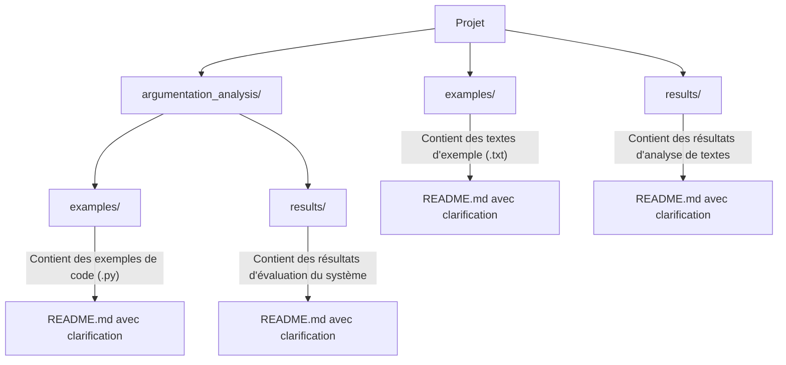

# Plan de clarification des dossiers dupliqués

## Résumé de l'analyse

L'analyse a révélé que malgré leurs noms identiques, les dossiers dupliqués ont des fonctions distinctes et complémentaires :

- Les dossiers à la racine (`examples/` et `results/`) sont orientés vers les données d'entrée et les résultats d'analyse de textes
- Les dossiers dans `argumentation_analysis/` sont orientés vers le code d'exemple et l'évaluation des performances du système

## Problèmes identifiés

1. Duplication entre `results/` et `argumentation_analysis/results/`
2. Duplication entre `examples/` et `argumentation_analysis/examples/`

## Analyse du contenu et du rôle de chaque dossier dupliqué

### Dossiers `examples/` et `argumentation_analysis/examples/`

| Dossier | Contenu | Fonction |
|---------|---------|----------|
| **examples/** | Fichiers texte (`.txt`) | Contient des **exemples de textes et données** pour tester le système d'analyse argumentative |
| **argumentation_analysis/examples/** | Fichiers Python (`.py`) | Contient des **exemples de code** démontrant l'utilisation et l'implémentation du système |

### Dossiers `results/` et `argumentation_analysis/results/`

| Dossier | Contenu | Fonction |
|---------|---------|----------|
| **results/** | Analyses, rapports, visualisations | Stocke les **résultats d'analyse de textes** effectuées sur différents corpus |
| **argumentation_analysis/results/** | Tests de performance | Contient les **résultats d'évaluation du système** lui-même (performance, précision, etc.) |

## Solution retenue

La solution consiste à ajouter des README explicatifs dans chaque dossier pour clarifier leur rôle et leur relation avec les autres dossiers du projet, sans modifier la structure existante.

## Contenu exact des README à ajouter

### Pour le dossier `examples/`

```markdown
# Exemples de textes pour l'analyse argumentative

## À propos de ce dossier
Ce dossier contient des **exemples de textes et données** utilisés comme entrées pour le système d'analyse argumentative. Ces textes servent à tester les capacités d'analyse du système et à démontrer ses fonctionnalités.

## Distinction avec `argumentation_analysis/examples/`
⚠️ **Note importante** : Ne pas confondre avec le dossier `argumentation_analysis/examples/` qui contient des **exemples de code** démontrant l'utilisation et l'implémentation du système.

| Ce dossier (`examples/`) | Dossier `argumentation_analysis/examples/` |
|--------------------------|-------------------------------------------|
| Contient des fichiers texte (`.txt`) | Contient des fichiers Python (`.py`) |
| Exemples de données d'entrée | Exemples de code d'implémentation |
| Utilisé pour tester l'analyse | Utilisé pour apprendre à utiliser le système |

## Utilisation
Les textes de ce dossier peuvent être utilisés comme entrées pour les scripts d'analyse ou comme données de test pour évaluer les performances du système.
```

### Pour le dossier `argumentation_analysis/examples/`

```markdown
# Exemples de code pour l'analyse argumentative

## À propos de ce dossier
Ce dossier contient des **exemples de code** démontrant l'utilisation et l'implémentation du système d'analyse argumentative. Ces exemples servent de guide pour comprendre comment utiliser les différentes fonctionnalités du système.

## Distinction avec le dossier `examples/` à la racine
⚠️ **Note importante** : Ne pas confondre avec le dossier `examples/` à la racine du projet qui contient des **exemples de textes et données** utilisés comme entrées pour le système.

| Ce dossier (`argumentation_analysis/examples/`) | Dossier `examples/` à la racine |
|------------------------------------------------|--------------------------------|
| Contient des fichiers Python (`.py`) | Contient des fichiers texte (`.txt`) |
| Exemples de code d'implémentation | Exemples de données d'entrée |
| Utilisé pour apprendre à utiliser le système | Utilisé pour tester l'analyse |

## Utilisation
Les exemples de code de ce dossier peuvent être exécutés directement pour comprendre le fonctionnement du système et apprendre à l'utiliser dans vos propres projets.
```

### Pour le dossier `results/`

```markdown
# Résultats d'analyse de textes

## À propos de ce dossier
Ce dossier contient les **résultats des analyses rhétoriques** effectuées sur différents corpus de textes. Il stocke les analyses, rapports, visualisations et comparaisons générés par le système.

## Distinction avec `argumentation_analysis/results/`
⚠️ **Note importante** : Ne pas confondre avec le dossier `argumentation_analysis/results/` qui contient les **résultats d'évaluation du système** lui-même (performance, précision, etc.).

| Ce dossier (`results/`) | Dossier `argumentation_analysis/results/` |
|-------------------------|-------------------------------------------|
| Résultats d'analyse de textes | Résultats d'évaluation du système |
| Analyses, rapports, visualisations | Tests de performance |
| Orienté vers le contenu analysé | Orienté vers les performances du système |

## Utilisation
Les résultats stockés dans ce dossier peuvent être consultés pour comprendre les analyses effectuées sur différents corpus de textes et pour comparer les performances des différents agents d'analyse.
```

### Pour le dossier `argumentation_analysis/results/`

```markdown
# Résultats d'évaluation du système

## À propos de ce dossier
Ce dossier contient les **résultats d'évaluation du système** d'analyse argumentative, notamment les tests de performance, la précision des détections et l'efficacité des différents composants.

## Distinction avec le dossier `results/` à la racine
⚠️ **Note importante** : Ne pas confondre avec le dossier `results/` à la racine du projet qui contient les **résultats des analyses rhétoriques** effectuées sur différents corpus de textes.

| Ce dossier (`argumentation_analysis/results/`) | Dossier `results/` à la racine |
|-----------------------------------------------|--------------------------------|
| Résultats d'évaluation du système | Résultats d'analyse de textes |
| Tests de performance | Analyses, rapports, visualisations |
| Orienté vers les performances du système | Orienté vers le contenu analysé |

## Utilisation
Les résultats stockés dans ce dossier sont utilisés pour évaluer les performances du système, identifier les points d'amélioration et documenter les progrès réalisés.
```

## Mise en œuvre et bénéfices attendus

### Étapes de mise en œuvre

1. Créer ou mettre à jour les fichiers README.md dans chaque dossier concerné avec le contenu proposé ci-dessus
2. Ajouter une section dans le README principal du projet expliquant la structure des dossiers et leurs fonctions
3. Mettre à jour la documentation existante pour refléter cette clarification

### Bénéfices attendus

Cette solution présente plusieurs avantages :

1. **Clarté pour les étudiants** : Les étudiants comprendront immédiatement la fonction de chaque dossier et sauront où chercher les informations dont ils ont besoin.
2. **Préservation de la structure** : La structure existante du projet est maintenue, évitant ainsi toute perturbation dans les références ou les imports.
3. **Documentation améliorée** : Les README explicatifs servent également de documentation, améliorant la compréhension globale du projet.
4. **Facilité de mise en œuvre** : La solution peut être implémentée rapidement sans nécessiter de modifications majeures du code ou de la structure.

## Diagramme de la structure clarifiée



## Conclusion

Cette solution de clarification par l'ajout de README explicatifs permet de résoudre efficacement la confusion potentielle liée aux dossiers dupliqués, tout en respectant la contrainte de minimiser les changements structurels. Les étudiants pourront facilement comprendre la fonction de chaque dossier et savoir où trouver les exemples et les résultats dont ils ont besoin.