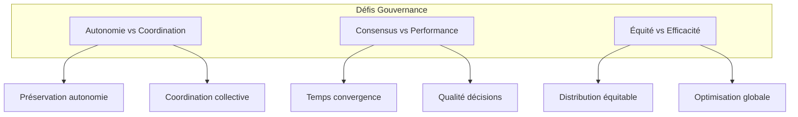

# 2.1.6 Gouvernance Multi-Agents

**Étudiant :** arthur.guelennoc  
**Niveau :** Avancé  
**Prérequis :** Systèmes multi-agents, Théorie des jeux, Algorithmes de consensus, TweetyProject, Java/Python

## Table des Matières

1. [Fondements théoriques](#1-fondements-théoriques)
2. [Architectures multi-agents](#2-architectures-multi-agents)
3. [Protocoles de coordination](#3-protocoles-de-coordination)
4. [Mécanismes de consensus](#4-mécanismes-de-consensus)
5. [Intégration TweetyProject](#5-intégration-tweetyproject)
6. [Résolution de conflits](#6-résolution-de-conflits)
7. [Implémentation pratique](#7-implémentation-pratique)
8. [Ressources et références](#8-ressources-et-références)

---

## 1. Fondements théoriques

### 1.1 Définition et enjeux

La **gouvernance multi-agents** désigne l'ensemble des mécanismes permettant à des agents autonomes de prendre des décisions collectives et de coordonner leurs actions.



### 1.2 Théories fondamentales

#### Théorie du Choix Social

```python
class SocialChoiceTheory:
    def __init__(self):
        self.voting_methods = {
            'plurality': self._plurality_voting,
            'borda': self._borda_count,
            'condorcet': self._condorcet_method
        }
    
    def _plurality_voting(self, preferences):
        votes = {}
        for pref in preferences:
            if pref:
                first_choice = pref[0]
                votes[first_choice] = votes.get(first_choice, 0) + 1
        return max(votes.items(), key=lambda x: x[1])[0] if votes else None
    
    def _borda_count(self, preferences):
        scores = {}
        for pref in preferences:
            for i, option in enumerate(pref):
                points = len(pref) - i - 1
                scores[option] = scores.get(option, 0) + points
        return max(scores.items(), key=lambda x: x[1])[0] if scores else None
```

#### Théorie des Jeux Coopératifs

```python
class CooperativeGameTheory:
    def shapley_value(self, coalition_values, players):
        n = len(players)
        shapley_values = {player: 0.0 for player in players}
        
        for player in players:
            for coalition_size in range(n):
                for coalition in self._combinations([p for p in players if p != player], coalition_size):
                    coalition_set = frozenset(coalition)
                    coalition_with_player = coalition_set | {player}
                    
                    marginal_contribution = (
                        coalition_values.get(coalition_with_player, 0) -
                        coalition_values.get(coalition_set, 0)
                    )
                    
                    weight = (
                        self._factorial(coalition_size) * 
                        self._factorial(n - coalition_size - 1) / 
                        self._factorial(n)
                    )
                    
                    shapley_values[player] += weight * marginal_contribution
        
        return shapley_values
```

## 2. Architectures multi-agents

### 2.1 Architecture BDI pour la gouvernance

```python
from dataclasses import dataclass
from enum import Enum
from typing import Set, Dict, List

class BeliefType(Enum):
    FACT = "fact"
    RULE = "rule"
    PREFERENCE = "preference"
    TRUST = "trust"

@dataclass
class Belief:
    content: str
    belief_type: BeliefType
    confidence: float
    source: str

@dataclass
class Desire:
    goal: str
    priority: float
    deadline: int = None

@dataclass
class Intention:
    plan: str
    commitment_level: float
    resources_required: Dict[str, float]

class BDIGovernanceAgent:
    def __init__(self, agent_id: str):
        self.agent_id = agent_id
        self.beliefs: Set[Belief] = set()
        self.desires: Set[Desire] = set()
        self.intentions: Set[Intention] = set()
    
    def update_beliefs(self, new_belief: Belief):
        conflicting_beliefs = self._find_conflicting_beliefs(new_belief)
        
        for conflict in conflicting_beliefs:
            if new_belief.confidence > conflict.confidence:
                self.beliefs.remove(conflict)
                self.beliefs.add(new_belief)
        
        if not conflicting_beliefs:
            self.beliefs.add(new_belief)
    
    def participate_in_collective_decision(self, decision_context: Dict):
        relevant_beliefs = self._filter_relevant_beliefs(decision_context)
        applicable_desires = self._filter_applicable_desires(decision_context)
        
        return {
            'agent_id': self.agent_id,
            'position': self._generate_position(relevant_beliefs, applicable_desires),
            'flexibility': self._calculate_negotiation_flexibility(applicable_desires)
        }
```

### 2.2 Architecture réactive

```python
class ReactiveGovernanceAgent:
    def __init__(self, agent_id: str):
        self.agent_id = agent_id
        self.perception_buffer = []
        self.action_rules = []
    
    def add_governance_rule(self, condition, action, priority=0):
        rule = {
            'condition': condition,
            'action': action,
            'priority': priority,
            'success_rate': 1.0
        }
        self.action_rules.append(rule)
        self.action_rules.sort(key=lambda r: r['priority'], reverse=True)
    
    def perceive_governance_event(self, event):
        enriched_event = {
            **event,
            'timestamp': self._current_timestamp(),
            'context': self._analyze_context(event)
        }
        
        self.perception_buffer.append(enriched_event)
        self._trigger_reactive_rules(enriched_event)
```

## 3. Protocoles de coordination

### 3.1 Protocoles FIPA-ACL étendus

```python
from enum import Enum
from dataclasses import dataclass
import uuid

class Performative(Enum):
    INFORM = "inform"
    REQUEST = "request"
    PROPOSE = "propose"
    VOTE = "vote"
    DELEGATE = "delegate"
    FORM_COALITION = "form-coalition"
    CONSENSUS_CHECK = "consensus-check"

@dataclass
class ACLMessage:
    performative: Performative
    sender: str
    receivers: List[str]
    content: any
    conversation_id: str = None
    
    def __post_init__(self):
        if self.conversation_id is None:
            self.conversation_id = str(uuid.uuid4())

class GovernanceProtocol:
    def __init__(self, agent_id: str):
        self.agent_id = agent_id
        self.active_conversations = {}
        self.message_handlers = {
            Performative.VOTE: self._handle_vote,
            Performative.DELEGATE: self._handle_delegation,
            Performative.FORM_COALITION: self._handle_coalition
        }
    
    def initiate_voting_process(self, issue, participants, deadline):
        content = {
            'issue': issue,
            'deadline': deadline,
            'voting_method': 'majority',
            'options': issue.get('options', [])
        }
        
        message = ACLMessage(
            performative=Performative.VOTE,
            sender=self.agent_id,
            receivers=participants,
            content=content
        )
        
        return message.conversation_id
```

## 4. Mécanismes de consensus

### 4.1 Algorithmes de consensus

```python
class ConsensusAlgorithm:
    def __init__(self, agent_id: str, total_agents: int):
        self.agent_id = agent_id
        self.total_agents = total_agents
        self.consensus_threshold = 0.67
    
    def byzantine_fault_tolerant_consensus(self, proposal, byzantine_tolerance=None):
        if byzantine_tolerance is None:
            byzantine_tolerance = (self.total_agents - 1) // 3
        
        required_votes = self.total_agents - byzantine_tolerance
        
        vote_count = self._collect_votes(proposal)
        
        return {
            'proposal': proposal,
            'votes_required': required_votes,
            'votes_received': vote_count,
            'status': 'accepted' if vote_count >= required_votes else 'rejected'
        }
    
    def raft_consensus(self, proposal):
        leader_id = self._elect_leader()
        
        if leader_id == self.agent_id:
            return self._propose_as_leader(proposal)
        else:
            return self._follow_leader_proposal(leader_id)
```

### 4.2 Vote quadratique

```python
class AdvancedVotingMechanisms:
    def quadratic_voting(self, preferences, budget_per_agent=100):
        results = {}
        agent_costs = {}
        
        for agent_id, votes in preferences.items():
            total_cost = 0
            for option, vote_count in votes.items():
                cost = vote_count ** 2
                total_cost += cost
                
                if option not in results:
                    results[option] = 0
                results[option] += vote_count
            
            if total_cost > budget_per_agent:
                raise ValueError(f"Agent {agent_id} dépasse le budget")
            
            agent_costs[agent_id] = total_cost
        
        return {
            'results': results,
            'costs': agent_costs,
            'winner': max(results.items(), key=lambda x: x[1])[0] if results else None
        }
```

## 5. Intégration TweetyProject

### 5.1 Framework argumentatif

```java
import org.tweetyproject.arg.dung.syntax.*;
import org.tweetyproject.arg.dung.reasoner.*;

public class GovernanceArgumentationFramework {
    private DungTheory governanceFramework;
    private AbstractExtensionReasoner reasoner;
    
    public GovernanceArgumentationFramework() {
        this.governanceFramework = new DungTheory();
        this.reasoner = new CompleteReasoner();
    }
    
    public void addGovernanceArgument(String argumentId, String content) {
        Argument arg = new Argument(argumentId);
        governanceFramework.add(arg);
    }
    
    public void addAttackRelation(String attackerId, String targetId) {
        Argument attacker = governanceFramework.getArgument(attackerId);
        Argument target = governanceFramework.getArgument(targetId);
        
        if (attacker != null && target != null) {
            Attack attack = new Attack(attacker, target);
            governanceFramework.add(attack);
        }
    }
    
    public boolean isDecisionJustified(String argumentId) {
        Argument arg = governanceFramework.getArgument(argumentId);
        Collection<Extension> extensions = reasoner.getModels(governanceFramework);
        return extensions.stream().anyMatch(ext -> ext.contains(arg));
    }
}
```

### 5.2 Validation Python-Java

```python
import jpype
from jpype.types import *

class TweetyGovernanceValidator:
    def __init__(self):
        if not jpype.isJVMStarted():
            jpype.startJVM(classpath=['tweety-full.jar'])
        
        from org.tweetyproject.arg.dung.syntax import DungTheory, Argument, Attack
        from org.tweetyproject.arg.dung.reasoner import CompleteReasoner
        
        self.DungTheory = DungTheory
        self.Argument = Argument
        self.Attack = Attack
        self.reasoner = CompleteReasoner()
    
    def validate_governance_decision(self, decision_context):
        theory = self.DungTheory()
        arguments = {}
        
        # Créer arguments pour chaque option
        for option_id, option_data in decision_context['options'].items():
            arg = self.Argument(option_id)
            theory.add(arg)
            arguments[option_id] = arg
        
        # Ajouter relations d'attaque
        for conflict in decision_context.get('conflicts', []):
            attacker = arguments.get(conflict['attacker'])
            target = arguments.get(conflict['target'])
            if attacker and target:
                theory.add(self.Attack(attacker, target))
        
        extensions = self.reasoner.getModels(theory)
        
        acceptable_options = set()
        for extension in extensions:
            for arg in extension:
                acceptable_options.add(str(arg))
        
        return {
            'acceptable_options': list(acceptable_options),
            'is_consistent': len(extensions) > 0,
            'recommended_option': self._select_best_option(acceptable_options, decision_context)
        }
```

## 6. Résolution de conflits

### 6.1 Système de médiation

```python
class ConflictResolutionSystem:
    def __init__(self):
        self.mediation_strategies = {
            'collaborative': self._collaborative_mediation,
            'competitive': self._competitive_mediation,
            'compromise': self._compromise_mediation
        }
    
    def detect_conflict(self, agents_positions):
        conflicts = []
        agents = list(agents_positions.keys())
        
        for i in range(len(agents)):
            for j in range(i + 1, len(agents)):
                agent1, agent2 = agents[i], agents[j]
                conflict_level = self._calculate_conflict_level(
                    agents_positions[agent1], 
                    agents_positions[agent2]
                )
                
                if conflict_level > 0.5:
                    conflicts.append({
                        'agents': [agent1, agent2],
                        'conflict_level': conflict_level
                    })
        
        return {
            'conflicts_detected': len(conflicts),
            'conflicts': conflicts
        }
    
    def resolve_conflict(self, conflict, strategy='collaborative'):
        return self.mediation_strategies[strategy](conflict)
    
    def _collaborative_mediation(self, conflict):
        agents = conflict['agents']
        common_interests = self._find_common_interests(agents)
        
        return {
            'resolution_type': 'collaborative',
            'success_probability': 0.8,
            'common_interests': common_interests
        }
```

## 7. Implémentation pratique

### 7.1 Exemple complet

```python
class MultiAgentGovernanceSystem:
    def __init__(self):
        self.agents = {}
        self.governance_protocol = GovernanceProtocol("system")
        self.consensus_algorithm = ConsensusAlgorithm("system", 0)
        self.conflict_resolver = ConflictResolutionSystem()
        self.tweety_validator = TweetyGovernanceValidator()
    
    def add_agent(self, agent_id, agent_type="BDI"):
        if agent_type == "BDI":
            self.agents[agent_id] = BDIGovernanceAgent(agent_id)
        else:
            self.agents[agent_id] = ReactiveGovernanceAgent(agent_id)
    
    def initiate_collective_decision(self, issue):
        # 1. Collecter les positions des agents
        positions = {}
        for agent_id, agent in self.agents.items():
            positions[agent_id] = agent.participate_in_collective_decision(issue)
        
        # 2. Détecter les conflits
        conflicts = self.conflict_resolver.detect_conflict(positions)
        
        # 3. Résoudre les conflits si nécessaire
        if conflicts['conflicts_detected'] > 0:
            for conflict in conflicts['conflicts']:
                resolution = self.conflict_resolver.resolve_conflict(conflict)
                print(f"Conflit résolu: {resolution}")
        
        # 4. Validation argumentative
        validation = self.tweety_validator.validate_governance_decision(issue)
        
        # 5. Consensus final
        final_decision = self.consensus_algorithm.byzantine_fault_tolerant_consensus(
            validation['recommended_option']
        )
        
        return {
            'decision': final_decision,
            'validation': validation,
            'conflicts_resolved': conflicts['conflicts_detected']
        }

# Exemple d'utilisation
def example_usage():
    system = MultiAgentGovernanceSystem()
    
    # Ajouter des agents
    system.add_agent("agent1", "BDI")
    system.add_agent("agent2", "BDI")
    system.add_agent("agent3", "reactive")
    
    # Définir un problème de gouvernance
    issue = {
        'type': 'resource_allocation',
        'options': {
            'option1': {'feasibility': 0.8, 'fairness': 0.6},
            'option2': {'feasibility': 0.6, 'fairness': 0.9}
        },
        'conflicts': [
            {'attacker': 'option1', 'target': 'option2'}
        ]
    }
    
    # Prendre une décision collective
    result = system.initiate_collective_decision(issue)
    print(f"Décision finale: {result}")
```

## 8. Ressources et références

### 8.1 Bibliographie

- **Livres:**
  - "Multiagent Systems" par Gerhard Weiss
  - "An Introduction to MultiAgent Systems" par Michael Wooldridge
  - "Computational Social Choice" par Felix Brandt

- **Articles:**
  - "Byzantine Generals Problem" par Lamport et al.
  - "Mechanism Design Theory" par Myerson
  - "Argumentation in Multi-Agent Systems" par Rahwan & Simari

### 8.2 Outils et frameworks

- **TweetyProject:** Framework d'argumentation formelle
- **JADE:** Java Agent Development Framework
- **Jason:** Agent-oriented programming language
- **SPADE:** Smart Python Agent Development Environment

### 8.3 Métriques d'évaluation

```python
class GovernanceMetrics:
    def evaluate_system_performance(self, decisions_history):
        return {
            'consensus_rate': self._calculate_consensus_rate(decisions_history),
            'fairness_index': self._calculate_fairness_index(decisions_history),
            'efficiency_score': self._calculate_efficiency_score(decisions_history),
            'stability_measure': self._calculate_stability_measure(decisions_history)
        }
    
    def _calculate_consensus_rate(self, history):
        consensus_decisions = sum(1 for d in history if d.get('consensus_level', 0) > 0.8)
        return consensus_decisions / len(history) if history else 0
    
    def _calculate_fairness_index(self, history):
        # Indice de Gini pour mesurer l'équité
        allocations = [d.get('resource_allocation', {}) for d in history]
        return self._gini_coefficient(allocations)
```

---

**Conclusion**

Ce guide présente les fondements théoriques et pratiques de la gouvernance multi-agents, intégrant les mécanismes de consensus, la résolution de conflits et la validation argumentative avec TweetyProject. L'implémentation proposée offre un framework complet pour développer des systèmes de gouvernance distribués efficaces et équitables.