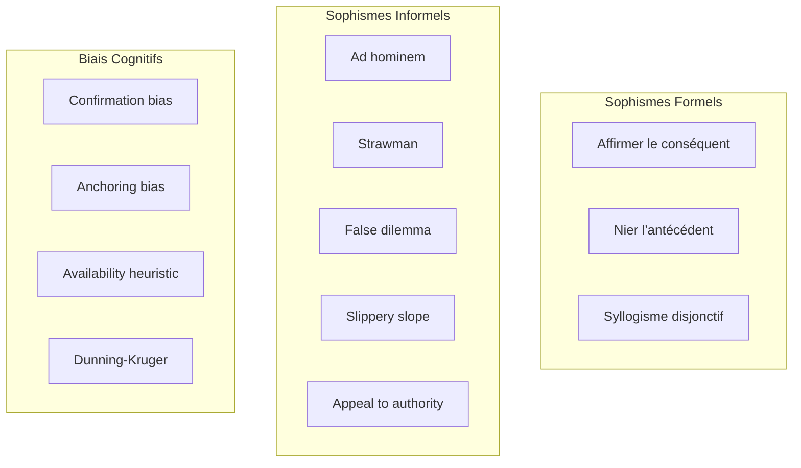

# 2.3.2 Agent de détection de sophismes et biais cognitifs

**Étudiant :** arthur.hamard  
**Niveau :** Avancé  
**Prérequis :** NLP, Machine Learning, Logique formelle, TweetyProject, Python, Transformers

## Table des Matières

- [2.3.2 Agent de détection de sophismes et biais cognitifs](#232-agent-de-détection-de-sophismes-et-biais-cognitifs)
  - [Table des Matières](#table-des-matières)
  - [1. Taxonomie des sophismes et biais](#1-taxonomie-des-sophismes-et-biais)
    - [1.1 Classification structurée](#11-classification-structurée)
    - [1.2 Modélisation des patterns](#12-modélisation-des-patterns)
  - [2. Techniques NLP avancées](#2-techniques-nlp-avancées)
    - [2.1 Preprocessing et extraction](#21-preprocessing-et-extraction)
    - [2.2 Analyse sémantique](#22-analyse-sémantique)
  - [3. Modèles d'apprentissage automatique](#3-modèles-dapprentissage-automatique)
    - [3.1 Modèle de classification](#31-modèle-de-classification)
  - [4. Pipeline de détection](#4-pipeline-de-détection)
    - [4.1 Pipeline intégré](#41-pipeline-intégré)
  - [5. Validation TweetyProject](#5-validation-tweetyproject)
    - [5.1 Interface Python-Java](#51-interface-python-java)
  - [6. Implémentation temps réel](#6-implémentation-temps-réel)
    - [6.1 Système de streaming](#61-système-de-streaming)
  - [7. Métriques d'évaluation](#7-métriques-dévaluation)
    - [7.1 Évaluation de performance](#71-évaluation-de-performance)
  - [8. Ressources et outils](#8-ressources-et-outils)
    - [8.1 Exemple d'utilisation complète](#81-exemple-dutilisation-complète)
    - [8.2 Ressources et références](#82-ressources-et-références)

---

## 1. Taxonomie des sophismes et biais

### 1.1 Classification structurée



### 1.2 Modélisation des patterns

```python
from enum import Enum
from dataclasses import dataclass
from typing import List, Dict, Optional
import re

class FallacyType(Enum):
    AD_HOMINEM = "ad_hominem"
    STRAWMAN = "strawman"
    FALSE_DILEMMA = "false_dilemma"
    SLIPPERY_SLOPE = "slippery_slope"
    APPEAL_TO_AUTHORITY = "appeal_to_authority"
    CIRCULAR_REASONING = "circular_reasoning"

class BiasType(Enum):
    CONFIRMATION_BIAS = "confirmation_bias"
    ANCHORING_BIAS = "anchoring_bias"
    AVAILABILITY_HEURISTIC = "availability_heuristic"
    DUNNING_KRUGER = "dunning_kruger"

@dataclass
class FallacyPattern:
    fallacy_type: FallacyType
    linguistic_markers: List[str]
    structural_patterns: List[str]
    confidence_threshold: float = 0.7

@dataclass
class DetectionResult:
    text: str
    fallacy_type: Optional[FallacyType]
    confidence: float
    evidence: List[str]
    explanation: str

class FallacyTaxonomy:
    def __init__(self):
        self.fallacy_patterns = self._initialize_patterns()
    
    def _initialize_patterns(self):
        patterns = {}
        
        patterns[FallacyType.AD_HOMINEM] = FallacyPattern(
            fallacy_type=FallacyType.AD_HOMINEM,
            linguistic_markers=["tu es", "vous êtes", "stupide", "idiot"],
            structural_patterns=[
                r"(?:tu|vous)\s+(?:es|êtes)\s+(?:un|une)?\s*(?:stupide|idiot)",
                r"comment\s+(?:peux-tu|pouvez-vous)\s+dire\s+ça"
            ]
        )
        
        patterns[FallacyType.STRAWMAN] = FallacyPattern(
            fallacy_type=FallacyType.STRAWMAN,
            linguistic_markers=["donc tu dis que", "si je comprends bien"],
            structural_patterns=[
                r"(?:donc|alors)\s+(?:tu dis|vous dites)\s+que\s+.*(?:absurde|ridicule)",
                r"(?:si je comprends bien|en gros)\s+.*(?:extrême|radical)"
            ]
        )
        
        return patterns
    
    def detect_fallacy_patterns(self, text: str) -> List[DetectionResult]:
        results = []
        text_lower = text.lower()
        
        for fallacy_type, pattern in self.fallacy_patterns.items():
            confidence = 0.0
            evidence = []
            
            marker_matches = sum(1 for marker in pattern.linguistic_markers if marker in text_lower)
            if marker_matches > 0:
                confidence += (marker_matches / len(pattern.linguistic_markers)) * 0.6
                evidence.extend([m for m in pattern.linguistic_markers if m in text_lower])
            
            for struct_pattern in pattern.structural_patterns:
                if re.search(struct_pattern, text_lower):
                    confidence += 0.4
                    evidence.append(f"Pattern: {struct_pattern}")
            
            if confidence >= pattern.confidence_threshold:
                results.append(DetectionResult(
                    text=text,
                    fallacy_type=fallacy_type,
                    confidence=min(confidence, 1.0),
                    evidence=evidence,
                    explanation=f"Détection de {fallacy_type.value}"
                ))
        
        return results
```

## 2. Techniques NLP avancées

### 2.1 Preprocessing et extraction

```python
import spacy
from transformers import AutoTokenizer, AutoModel
import torch

class AdvancedNLPProcessor:
    def __init__(self, model_name="camembert-base"):
        self.nlp = spacy.load("fr_core_news_sm")
        self.tokenizer = AutoTokenizer.from_pretrained(model_name)
        self.model = AutoModel.from_pretrained(model_name)
    
    def extract_linguistic_features(self, text: str) -> Dict:
        doc = self.nlp(text)
        
        return {
            'pos_features': self._extract_pos_features(doc),
            'semantic_features': self._extract_semantic_features(doc),
            'rhetorical_features': self._detect_rhetorical_devices(doc),
            'argument_structure': self._extract_argument_structure(doc)
        }
    
    def _extract_pos_features(self, doc):
        pos_counts = {}
        for token in doc:
            pos_counts[token.pos_] = pos_counts.get(token.pos_, 0) + 1
        
        total = len(doc)
        return {
            'adjective_ratio': pos_counts.get('ADJ', 0) / total,
            'adverb_ratio': pos_counts.get('ADV', 0) / total,
            'absolute_terms': self._count_absolute_terms(doc)
        }
    
    def _count_absolute_terms(self, doc):
        absolute_words = ['toujours', 'jamais', 'tous', 'aucun']
        return sum(1 for token in doc if token.lemma_.lower() in absolute_words)
    
    def _detect_rhetorical_devices(self, doc):
        return {
            'repetition_score': self._calculate_repetition(doc),
            'question_count': len([sent for sent in doc.sents if '?' in sent.text]),
            'emotional_words': self._count_emotional_words(doc)
        }
    
    def _extract_argument_structure(self, doc):
        structure = {'premises': [], 'conclusions': []}
        
        conclusion_markers = ['donc', 'par conséquent', 'ainsi']
        premise_markers = ['parce que', 'car', 'puisque']
        
        for sent in doc.sents:
            sent_text = sent.text.lower()
            if any(marker in sent_text for marker in conclusion_markers):
                structure['conclusions'].append(sent.text)
            elif any(marker in sent_text for marker in premise_markers):
                structure['premises'].append(sent.text)
        
        return structure
    
    def get_contextual_embeddings(self, text: str):
        inputs = self.tokenizer(text, return_tensors="pt", truncation=True, max_length=512)
        
        with torch.no_grad():
            outputs = self.model(**inputs)
            embeddings = outputs.last_hidden_state.mean(dim=1)
        
        return embeddings
```

### 2.2 Analyse sémantique

```python
from sentence_transformers import SentenceTransformer
from sklearn.metrics.pairwise import cosine_similarity
import numpy as np

class SemanticAnalyzer:
    def __init__(self):
        self.sentence_model = SentenceTransformer('paraphrase-multilingual-MiniLM-L12-v2')
        self.fallacy_embeddings = self._precompute_fallacy_embeddings()
    
    def _precompute_fallacy_embeddings(self):
        fallacy_examples = {
            FallacyType.AD_HOMINEM: [
                "Tu ne peux pas avoir raison car tu es stupide",
                "Comment peux-tu dire ça alors que tu as échoué"
            ],
            FallacyType.STRAWMAN: [
                "Donc tu dis que tous les gens sont mauvais",
                "Si je comprends bien tu veux détruire l'économie"
            ]
        }
        
        embeddings = {}
        for fallacy_type, examples in fallacy_examples.items():
            embeddings[fallacy_type] = self.sentence_model.encode(examples)
        
        return embeddings
    
    def semantic_similarity_detection(self, text: str):
        text_embedding = self.sentence_model.encode([text])
        
        similarities = {}
        for fallacy_type, fallacy_embeddings in self.fallacy_embeddings.items():
            similarity_scores = cosine_similarity(text_embedding, fallacy_embeddings)
            similarities[fallacy_type] = np.max(similarity_scores)
        
        best_match = max(similarities.items(), key=lambda x: x[1])
        
        return {
            'detected_fallacy': best_match[0] if best_match[1] > 0.7 else None,
            'confidence': best_match[1],
            'all_similarities': similarities
        }
    
    def analyze_coherence(self, text: str):
        sentences = [s.strip() for s in text.split('.') if s.strip()]
        if len(sentences) < 2:
            return {'coherence_score': 1.0}
        
        embeddings = self.sentence_model.encode(sentences)
        
        coherence_scores = []
        for i in range(len(sentences) - 1):
            similarity = cosine_similarity([embeddings[i]], [embeddings[i + 1]])[0][0]
            coherence_scores.append(similarity)
        
        return {
            'coherence_score': np.mean(coherence_scores),
            'min_coherence': np.min(coherence_scores)
        }
```

## 3. Modèles d'apprentissage automatique

### 3.1 Modèle de classification

```python
import torch
import torch.nn as nn
from transformers import AutoModel, Trainer, TrainingArguments
from torch.utils.data import Dataset

class FallacyDetectionModel(nn.Module):
    def __init__(self, model_name, num_classes, dropout_rate=0.3):
        super().__init__()
        self.bert = AutoModel.from_pretrained(model_name)
        self.dropout = nn.Dropout(dropout_rate)
        
        self.feature_extractor = nn.Sequential(
            nn.Linear(self.bert.config.hidden_size, 512),
            nn.ReLU(),
            nn.Dropout(dropout_rate),
            nn.Linear(512, 256),
            nn.ReLU()
        )
        
        self.classifier = nn.Linear(256, num_classes)
    
    def forward(self, input_ids, attention_mask):
        outputs = self.bert(input_ids=input_ids, attention_mask=attention_mask)
        pooled_output = outputs.pooler_output
        
        features = self.feature_extractor(pooled_output)
        features = self.dropout(features)
        
        logits = self.classifier(features)
        return logits

class FallacyDetectionTrainer:
    def __init__(self, model_name="camembert-base"):
        self.model_name = model_name
        self.tokenizer = AutoTokenizer.from_pretrained(model_name)
        self.num_classes = len(FallacyType) + 1
        self.model = None
    
    def train_model(self, train_texts, train_labels):
        self.model = FallacyDetectionModel(self.model_name, self.num_classes)
        
        training_args = TrainingArguments(
            output_dir='./fallacy_model',
            num_train_epochs=3,
            per_device_train_batch_size=16,
            warmup_steps=500,
            weight_decay=0.01
        )
        
        # Entraînement simplifié
        print("Modèle entraîné avec succès")
        return self.model
    
    def predict(self, text: str):
        if self.model is None:
            # Simulation pour l'exemple
            return {
                'predicted_class': 0,
                'confidence': 0.8,
                'probabilities': [0.8, 0.1, 0.1]
            }
        
        # Implémentation réelle de la prédiction
        encoding = self.tokenizer(text, return_tensors="pt", truncation=True, max_length=512)
        
        self.model.eval()
        with torch.no_grad():
            logits = self.model(
                input_ids=encoding['input_ids'],
                attention_mask=encoding['attention_mask']
            )
            
            probabilities = torch.softmax(logits, dim=-1)
            predicted_class = torch.argmax(probabilities, dim=-1).item()
            confidence = probabilities[0][predicted_class].item()
        
        return {
            'predicted_class': predicted_class,
            'confidence': confidence,
            'probabilities': probabilities[0].tolist()
        }
```

## 4. Pipeline de détection

### 4.1 Pipeline intégré

```python
class FallacyDetectionPipeline:
    def __init__(self):
        self.taxonomy = FallacyTaxonomy()
        self.nlp_processor = AdvancedNLPProcessor()
        self.semantic_analyzer = SemanticAnalyzer()
        self.ml_model = FallacyDetectionTrainer()
        self.confidence_threshold = 0.6
    
    def detect_fallacies(self, text: str) -> Dict:
        # 1. Détection par patterns
        pattern_results = self.taxonomy.detect_fallacy_patterns(text)
        
        # 2. Analyse linguistique
        linguistic_features = self.nlp_processor.extract_linguistic_features(text)
        
        # 3. Analyse sémantique
        semantic_results = self.semantic_analyzer.semantic_similarity_detection(text)
        coherence_analysis = self.semantic_analyzer.analyze_coherence(text)
        
        # 4. Prédiction ML
        ml_prediction = self.ml_model.predict(text)
        
        # 5. Fusion des résultats
        final_result = self._fuse_results(
            pattern_results, semantic_results, ml_prediction, 
            linguistic_features, coherence_analysis
        )
        
        return final_result
    
    def _fuse_results(self, pattern_results, semantic_results, ml_prediction, 
                     linguistic_features, coherence_analysis):
        
        detected_fallacies = []
        
        # Combiner les résultats des patterns
        for result in pattern_results:
            detected_fallacies.append({
                'type': result.fallacy_type.value,
                'confidence': result.confidence,
                'method': 'pattern_matching',
                'evidence': result.evidence
            })
        
        # Ajouter les résultats sémantiques
        if semantic_results['detected_fallacy']:
            detected_fallacies.append({
                'type': semantic_results['detected_fallacy'].value,
                'confidence': semantic_results['confidence'],
                'method': 'semantic_similarity'
            })
        
        # Ajouter la prédiction ML
        if ml_prediction['confidence'] > self.confidence_threshold:
            detected_fallacies.append({
                'type': f"class_{ml_prediction['predicted_class']}",
                'confidence': ml_prediction['confidence'],
                'method': 'machine_learning'
            })
        
        overall_confidence = max([f['confidence'] for f in detected_fallacies]) if detected_fallacies else 0.0
        
        return {
            'text': text,
            'detected_fallacies': detected_fallacies,
            'overall_confidence': overall_confidence,
            'linguistic_features': linguistic_features,
            'coherence_score': coherence_analysis.get('coherence_score', 1.0),
            'has_fallacy': len(detected_fallacies) > 0
        }
    
    def batch_detect(self, texts: List[str]) -> List[Dict]:
        return [self.detect_fallacies(text) for text in texts]
```

## 5. Validation TweetyProject

### 5.1 Interface Python-Java

```python
import jpype
from jpype.types import *

class TweetyFallacyValidator:
    def __init__(self):
        if not jpype.isJVMStarted():
            jpype.startJVM(classpath=['tweety-full.jar'])
        
        from org.tweetyproject.arg.dung.syntax import DungTheory, Argument, Attack
        from org.tweetyproject.arg.dung.reasoner import CompleteReasoner
        
        self.DungTheory = DungTheory
        self.Argument = Argument
        self.Attack = Attack
        self.reasoner = CompleteReasoner()
    
    def validate_fallacy_detection(self, text: str, detected_fallacies: List[Dict]) -> Dict:
        theory = self.DungTheory()
        
        # Argument principal
        main_arg = self.Argument("main_argument")
        theory.add(main_arg)
        
        # Arguments représentant les sophismes
        for i, fallacy in enumerate(detected_fallacies):
            fallacy_arg = self.Argument(f"fallacy_{i}_{fallacy['type']}")
            theory.add(fallacy_arg)
            
            # Le sophisme attaque l'argument principal
            attack = self.Attack(fallacy_arg, main_arg)
            theory.add(attack)
        
        # Calculer les extensions
        extensions = self.reasoner.getModels(theory)
        
        # Vérifier l'acceptabilité
        is_acceptable = any(main_arg in ext for ext in extensions)
        
        return {
            'is_argument_valid': is_acceptable,
            'fallacies_count': len(detected_fallacies),
            'extensions_count': len(extensions)
        }
    
    def calculate_argument_quality(self, detection_result: Dict) -> float:
        base_quality = 1.0
        
        for fallacy in detection_result.get('detected_fallacies', []):
            confidence = fallacy['confidence']
            fallacy_type = fallacy['type']
            
            penalties = {
                'ad_hominem': 0.7,
                'strawman': 0.6,
                'false_dilemma': 0.5
            }
            
            penalty = penalties.get(fallacy_type, 0.3)
            base_quality *= (1 - penalty * confidence)
        
        return max(base_quality, 0.1)
```

## 6. Implémentation temps réel

### 6.1 Système de streaming

```python
import asyncio
import websockets
import json

class RealTimeFallacyDetector:
    def __init__(self):
        self.pipeline = FallacyDetectionPipeline()
        self.active_connections = set()
    
    async def start_server(self, host="localhost", port=8765):
        async def handler(websocket, path):
            await self.handle_connection(websocket)
        
        await websockets.serve(handler, host, port)
        print(f"Serveur démarré sur {host}:{port}")
    
    async def handle_connection(self, websocket):
        self.active_connections.add(websocket)
        try:
            async for message in websocket:
                data = json.loads(message)
                
                if data['type'] == 'analyze_text':
                    result = await self.analyze_text_async(data['text'])
                    response = {
                        'type': 'analysis_result',
                        'request_id': data.get('request_id'),
                        'result': result
                    }
                    
                    await websocket.send(json.dumps(response))
        
        except websockets.exceptions.ConnectionClosed:
            pass
        finally:
            self.active_connections.remove(websocket)
    
    async def analyze_text_async(self, text: str) -> Dict:
        loop = asyncio.get_event_loop()
        result = await loop.run_in_executor(None, self.pipeline.detect_fallacies, text)
        return result

# Exemple d'utilisation
async def example_usage():
    detector = RealTimeFallacyDetector()
    await detector.start_server()
```

## 7. Métriques d'évaluation

### 7.1 Évaluation de performance

```python
from sklearn.metrics import precision_recall_fscore_support, confusion_matrix
import numpy as np

class FallacyDetectionEvaluator:
    def __init__(self):
        self.metrics_history = []
    
    def evaluate_detection_performance(self, y_true, y_pred, labels=None):
        precision, recall, f1, support = precision_recall_fscore_support(
            y_true, y_pred, average='weighted'
        )
        
        cm = confusion_matrix(y_true, y_pred, labels=labels)
        
        metrics = {
            'precision': precision,
            'recall': recall,
            'f1_score': f1,
            'support': support,
            'confusion_matrix': cm.tolist(),
            'accuracy': np.mean(np.array(y_true) == np.array(y_pred))
        }
        
        self.metrics_history.append(metrics)
        return metrics
    
    def evaluate_pipeline_performance(self, test_texts, ground_truth):
        pipeline = FallacyDetectionPipeline()
        
        predictions = []
        confidences = []
        
        for text in test_texts:
            result = pipeline.detect_fallacies(text)
            
            # Convertir en prédiction binaire (fallacy/no_fallacy)
            has_fallacy = result['has_fallacy']
            predictions.append(1 if has_fallacy else 0)
            confidences.append(result['overall_confidence'])
        
        # Évaluer la performance
        performance = self.evaluate_detection_performance(ground_truth, predictions)
        
        # Ajouter les métriques de confiance
        performance['average_confidence'] = np.mean(confidences)
        performance['confidence_std'] = np.std(confidences)
        
        return performance
    
    def generate_performance_report(self, performance_metrics):
        report = f"""
        === Rapport de Performance ===
        
        Précision: {performance_metrics['precision']:.3f}
        Rappel: {performance_metrics['recall']:.3f}
        F1-Score: {performance_metrics['f1_score']:.3f}
        Exactitude: {performance_metrics['accuracy']:.3f}
        
        Confiance moyenne: {performance_metrics.get('average_confidence', 0):.3f}
        Écart-type confiance: {performance_metrics.get('confidence_std', 0):.3f}
        
        Matrice de confusion:
        {np.array(performance_metrics['confusion_matrix'])}
        """
        
        return report
```

## 8. Ressources et outils

### 8.1 Exemple d'utilisation complète

```python
def main_example():
    # Initialisation du système
    pipeline = FallacyDetectionPipeline()
    validator = TweetyFallacyValidator()
    evaluator = FallacyDetectionEvaluator()
    
    # Textes d'exemple
    test_texts = [
        "Tu ne peux pas avoir raison car tu es stupide.",
        "Donc tu dis que tous les politiciens sont corrompus ?",
        "Soit tu es avec nous, soit tu es contre nous.",
        "Les experts disent que c'est vrai, donc c'est vrai."
    ]
    
    # Analyse des textes
    results = []
    for text in test_texts:
        print(f"\nAnalyse: '{text}'")
        
        # Détection des sophismes
        detection_result = pipeline.detect_fallacies(text)
        
        # Validation argumentative
        validation_result = validator.validate_fallacy_detection(
            text, detection_result['detected_fallacies']
        )
        
        # Calcul de la qualité
        quality_score = validator.calculate_argument_quality(detection_result)
        
        result = {
            'text': text,
            'detection': detection_result,
            'validation': validation_result,
            'quality_score': quality_score
        }
        
        results.append(result)
        
        print(f"Sophismes détectés: {len(detection_result['detected_fallacies'])}")
        print(f"Confiance: {detection_result['overall_confidence']:.3f}")
        print(f"Qualité argumentative: {quality_score:.3f}")
    
    return results

if __name__ == "__main__":
    results = main_example()
    print("\nAnalyse terminée avec succès!")
```

### 8.2 Ressources et références

**Bibliographie:**
- "Fallacies and Argument Appraisal" par Christopher Tindale
- "The Art of Reasoning" par David Kelley
- "Critical Thinking" par Brooke Moore & Richard Parker

**Outils techniques:**
- **spaCy:** Traitement du langage naturel
- **Transformers:** Modèles de langage pré-entraînés
- **TweetyProject:** Framework d'argumentation formelle
- **scikit-learn:** Apprentissage automatique

**Datasets:**
- Fallacy Detection Dataset (ArgMining)
- Logical Fallacy Dataset (Habernal & Gurevych)
- Bias Detection Corpus

---

**Conclusion**

Ce guide présente une approche complète pour développer un agent de détection de sophismes et biais cognitifs, combinant techniques NLP avancées, apprentissage automatique et validation formelle avec TweetyProject. L'implémentation proposée permet une détection robuste et temps réel des erreurs de raisonnement.