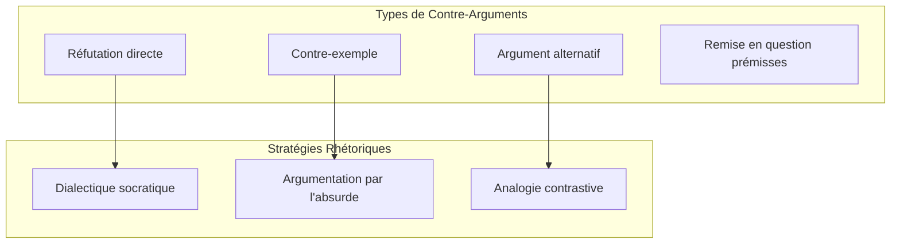

# 2.3.3 Agent de génération de contre-arguments

**Étudiant :** leo.sambrook  
**Niveau :** Avancé  
**Prérequis :** NLP, LLMs, Logique formelle, TweetyProject, Python, Théorie de l'argumentation

## Table des Matières

- [2.3.3 Agent de génération de contre-arguments](#233-agent-de-génération-de-contre-arguments)
  - [Table des Matières](#table-des-matières)
  - [1. Théories de la contre-argumentation](#1-théories-de-la-contre-argumentation)
    - [1.1 Fondements théoriques](#11-fondements-théoriques)
    - [1.2 Modélisation des contre-arguments](#12-modélisation-des-contre-arguments)
  - [2. Génération automatique d'arguments](#2-génération-automatique-darguments)
    - [2.1 Architecture de génération](#21-architecture-de-génération)
  - [3. Stratégies argumentatives](#3-stratégies-argumentatives)
    - [3.1 Stratégies rhétoriques](#31-stratégies-rhétoriques)
  - [4. Intégration LLMs](#4-intégration-llms)
    - [4.1 Interface avec les LLMs](#41-interface-avec-les-llms)
  - [5. Validation logique TweetyProject](#5-validation-logique-tweetyproject)
    - [5.1 Framework de validation](#51-framework-de-validation)
  - [6. Évaluation de la qualité](#6-évaluation-de-la-qualité)
    - [6.1 Métriques d'évaluation](#61-métriques-dévaluation)
  - [7. Implémentation pratique](#7-implémentation-pratique)
    - [7.1 Système complet](#71-système-complet)
  - [8. Ressources et références](#8-ressources-et-références)
    - [8.1 Bibliographie](#81-bibliographie)
    - [8.2 Outils et frameworks](#82-outils-et-frameworks)
    - [8.3 Métriques et évaluation](#83-métriques-et-évaluation)

---

## 1. Théories de la contre-argumentation

### 1.1 Fondements théoriques



### 1.2 Modélisation des contre-arguments

```python
from enum import Enum
from dataclasses import dataclass
from typing import List, Dict, Optional

class CounterArgumentType(Enum):
    DIRECT_REFUTATION = "direct_refutation"
    COUNTER_EXAMPLE = "counter_example"
    ALTERNATIVE_EXPLANATION = "alternative_explanation"
    PREMISE_CHALLENGE = "premise_challenge"
    REDUCTIO_AD_ABSURDUM = "reductio_ad_absurdum"

class ArgumentStrength(Enum):
    WEAK = "weak"
    MODERATE = "moderate"
    STRONG = "strong"
    DECISIVE = "decisive"

@dataclass
class Argument:
    content: str
    premises: List[str]
    conclusion: str
    argument_type: str
    confidence: float

@dataclass
class CounterArgument:
    original_argument: Argument
    counter_type: CounterArgumentType
    counter_content: str
    target_component: str
    strength: ArgumentStrength
    confidence: float
    supporting_evidence: List[str]
    rhetorical_strategy: str

class CounterArgumentationTheory:
    def __init__(self):
        self.counter_strategies = self._initialize_strategies()
    
    def _initialize_strategies(self):
        return {
            CounterArgumentType.DIRECT_REFUTATION: {
                'description': 'Réfutation directe de la conclusion',
                'patterns': [
                    "Cette conclusion est incorrecte car {evidence}",
                    "Au contraire, {alternative_conclusion} parce que {reasons}"
                ]
            },
            
            CounterArgumentType.COUNTER_EXAMPLE: {
                'description': 'Présentation d\'un contre-exemple',
                'patterns': [
                    "Considérons le cas de {example} qui contredit cette généralisation",
                    "L'exemple de {case} montre que cette règle n'est pas universelle"
                ]
            },
            
            CounterArgumentType.PREMISE_CHALLENGE: {
                'description': 'Remise en question des prémisses',
                'patterns': [
                    "Cette prémisse est discutable car {reason}",
                    "L'hypothèse de base {premise} n'est pas fondée"
                ]
            }
        }
    
    def analyze_argument_structure(self, argument_text: str) -> Argument:
        premises = self._extract_premises(argument_text)
        conclusion = self._extract_conclusion(argument_text)
        
        return Argument(
            content=argument_text,
            premises=premises,
            conclusion=conclusion,
            argument_type=self._classify_argument_type(argument_text),
            confidence=self._calculate_confidence(argument_text)
        )
    
    def _extract_premises(self, text: str) -> List[str]:
        premise_markers = ['parce que', 'car', 'puisque', 'étant donné que']
        premises = []
        sentences = [s.strip() for s in text.split('.') if s.strip()]
        
        for sentence in sentences:
            if any(marker in sentence.lower() for marker in premise_markers):
                premises.append(sentence)
        
        return premises
    
    def _extract_conclusion(self, text: str) -> str:
        conclusion_markers = ['donc', 'par conséquent', 'ainsi', 'en conclusion']
        sentences = [s.strip() for s in text.split('.') if s.strip()]
        
        for sentence in sentences:
            if any(marker in sentence.lower() for marker in conclusion_markers):
                return sentence
        
        return sentences[-1] if sentences else ""
    
    def identify_vulnerabilities(self, argument: Argument) -> List[Dict]:
        vulnerabilities = []
        
        # Vérifier les prémisses faibles
        for i, premise in enumerate(argument.premises):
            weakness_score = self._assess_premise_weakness(premise)
            if weakness_score > 0.5:
                vulnerabilities.append({
                    'type': 'weak_premise',
                    'target': f'premise_{i}',
                    'weakness_score': weakness_score,
                    'suggested_attack': CounterArgumentType.PREMISE_CHALLENGE
                })
        
        # Détecter les généralisations abusives
        if self._contains_overgeneralization(argument.content):
            vulnerabilities.append({
                'type': 'overgeneralization',
                'weakness_score': 0.8,
                'suggested_attack': CounterArgumentType.COUNTER_EXAMPLE
            })
        
        return vulnerabilities
    
    def _assess_premise_weakness(self, premise: str) -> float:
        weakness_indicators = ['toujours', 'jamais', 'tous', 'aucun', 'évidemment']
        weakness_score = sum(0.3 for indicator in weakness_indicators if indicator in premise.lower())
        return min(weakness_score, 1.0)
```

## 2. Génération automatique d'arguments

### 2.1 Architecture de génération

```python
from transformers import pipeline
import torch

class ArgumentGenerator:
    def __init__(self, model_name: str = "gpt2-medium"):
        self.generator = pipeline('text-generation', model=model_name)
        self.argument_templates = self._initialize_templates()
        
    def _initialize_templates(self):
        return {
            'causal_argument': [
                "Si {condition}, alors {consequence} parce que {mechanism}.",
                "{cause} entraîne {effect} en raison de {explanation}."
            ],
            
            'analogical_argument': [
                "Tout comme {analogy_source}, {target} parce que {similarity}.",
                "Par analogie avec {comparison}, nous pouvons dire que {conclusion}."
            ]
        }
    
    def generate_counter_argument(self, original_argument: Argument, 
                                counter_type: CounterArgumentType) -> CounterArgument:
        
        strategy = self._select_generation_strategy(counter_type)
        counter_content = self._generate_content(original_argument, counter_type, strategy)
        strength = self._evaluate_counter_strength(counter_content, original_argument)
        
        return CounterArgument(
            original_argument=original_argument,
            counter_type=counter_type,
            counter_content=counter_content,
            target_component=strategy['target'],
            strength=strength,
            confidence=0.8,
            supporting_evidence=[],
            rhetorical_strategy=strategy['rhetorical_approach']
        )
    
    def _select_generation_strategy(self, counter_type: CounterArgumentType) -> Dict:
        strategies = {
            CounterArgumentType.DIRECT_REFUTATION: {
                'target': 'conclusion',
                'rhetorical_approach': 'direct_challenge'
            },
            CounterArgumentType.COUNTER_EXAMPLE: {
                'target': 'generalization',
                'rhetorical_approach': 'concrete_instance'
            },
            CounterArgumentType.PREMISE_CHALLENGE: {
                'target': 'premises',
                'rhetorical_approach': 'socratic_method'
            }
        }
        
        return strategies.get(counter_type, strategies[CounterArgumentType.DIRECT_REFUTATION])
    
    def _generate_content(self, original_argument: Argument, 
                         counter_type: CounterArgumentType, strategy: Dict) -> str:
        
        prompt = self._build_generation_prompt(original_argument, counter_type)
        
        generated_texts = self.generator(
            prompt,
            max_length=150,
            num_return_sequences=2,
            temperature=0.8,
            do_sample=True
        )
        
        best_generation = self._select_best_generation(generated_texts, original_argument)
        return self._post_process_generation(best_generation)
    
    def _build_generation_prompt(self, argument: Argument, counter_type: CounterArgumentType) -> str:
        base_prompt = f"Argument original: {argument.content}\n\n"
        
        if counter_type == CounterArgumentType.DIRECT_REFUTATION:
            return base_prompt + "Contre-argument: Cette conclusion est incorrecte car"
        elif counter_type == CounterArgumentType.COUNTER_EXAMPLE:
            return base_prompt + "Contre-argument: Considérons le cas où"
        elif counter_type == CounterArgumentType.PREMISE_CHALLENGE:
            return base_prompt + "Contre-argument: Cette prémisse est discutable parce que"
        else:
            return base_prompt + "Contre-argument:"
    
    def _select_best_generation(self, generated_texts: List[Dict], original_argument: Argument) -> str:
        best_text = ""
        best_score = 0.0
        
        for gen in generated_texts:
            text = gen['generated_text']
            score = self._evaluate_generation_quality(text, original_argument)
            
            if score > best_score:
                best_score = score
                best_text = text
        
        return best_text
    
    def _evaluate_generation_quality(self, text: str, argument: Argument) -> float:
        score = 0.0
        
        # Pertinence
        common_words = set(argument.content.lower().split()) & set(text.lower().split())
        relevance = len(common_words) / len(set(argument.content.lower().split()))
        score += relevance * 0.4
        
        # Longueur appropriée
        if 30 <= len(text.split()) <= 100:
            score += 0.3
        
        # Structure argumentative
        if any(marker in text.lower() for marker in ['parce que', 'car', 'donc']):
            score += 0.3
        
        return score
```

## 3. Stratégies argumentatives

### 3.1 Stratégies rhétoriques

```python
class RhetoricalStrategies:
    def __init__(self):
        self.strategies = {
            'socratic_questioning': {
                'description': 'Questionnement socratique',
                'effectiveness': 0.8
            },
            'reductio_ad_absurdum': {
                'description': 'Réduction à l\'absurde',
                'effectiveness': 0.9
            },
            'analogical_counter': {
                'description': 'Contre-argumentation par analogie',
                'effectiveness': 0.7
            }
        }
    
    def apply_strategy(self, strategy_name: str, argument: Argument) -> str:
        if strategy_name == 'socratic_questioning':
            return self._apply_socratic_questioning(argument)
        elif strategy_name == 'reductio_ad_absurdum':
            return self._apply_reductio_ad_absurdum(argument)
        elif strategy_name == 'analogical_counter':
            return self._apply_analogical_counter(argument)
        
        return "Contre-argument générique"
    
    def _apply_socratic_questioning(self, argument: Argument) -> str:
        if not argument.premises:
            return "Quelles sont les preuves qui soutiennent cette affirmation?"
        
        premise = argument.premises[0]
        if 'toujours' in premise or 'jamais' in premise:
            return f"Êtes-vous certain qu'il n'y a aucune exception à '{premise}'?"
        
        return "Cette conclusion vous semble-t-elle vraiment inévitable?"
    
    def _apply_reductio_ad_absurdum(self, argument: Argument) -> str:
        conclusion = argument.conclusion
        
        if 'tous' in conclusion or 'toujours' in conclusion:
            return "Si nous acceptons cette généralisation, nous arrivons à des conclusions absurdes."
        elif 'doit' in conclusion:
            return "Si cette obligation était universelle, elle mènerait à des situations intenables."
        else:
            return "En poussant cette logique à l'extrême, nous arrivons à des conclusions inacceptables."
    
    def _apply_analogical_counter(self, argument: Argument) -> str:
        return "C'est comme dire qu'on devrait toujours choisir l'option la plus simple - ce qui révèle les limites de ce raisonnement."
```

## 4. Intégration LLMs

### 4.1 Interface avec les LLMs

```python
import asyncio

class LLMCounterArgumentGenerator:
    def __init__(self):
        self.models = {
            'gpt-4': {'temperature': 0.7, 'max_tokens': 300},
            'local_llm': {'temperature': 0.8, 'max_length': 200}
        }
    
    async def generate_counter_argument_async(self, argument: Argument,
                                            counter_type: CounterArgumentType) -> CounterArgument:
        
        prompt = self._build_specialized_prompt(argument, counter_type)
        response = await self._generate_with_llm(prompt)
        processed_response = self._post_process_llm_response(response, counter_type)
        
        return CounterArgument(
            original_argument=argument,
            counter_type=counter_type,
            counter_content=processed_response,
            target_component=self._identify_target_component(counter_type),
            strength=ArgumentStrength.MODERATE,
            confidence=0.8,
            supporting_evidence=[],
            rhetorical_strategy=counter_type.value
        )
    
    def _build_specialized_prompt(self, argument: Argument, counter_type: CounterArgumentType) -> str:
        base_context = f"""
        Vous êtes un expert en argumentation. Générez un contre-argument de haute qualité.
        
        Argument original: "{argument.content}"
        Conclusion: "{argument.conclusion}"
        """
        
        type_instructions = {
            CounterArgumentType.DIRECT_REFUTATION: "Générez une réfutation directe avec des preuves contradictoires.",
            CounterArgumentType.COUNTER_EXAMPLE: "Fournissez un contre-exemple concret qui invalide la généralisation.",
            CounterArgumentType.PREMISE_CHALLENGE: "Remettez en question les prémisses de base de l'argument."
        }
        
        instruction = type_instructions.get(counter_type, "Générez un contre-argument pertinent.")
        return f"{base_context}\n\nInstruction: {instruction}\n\nContre-argument:"
    
    async def _generate_with_llm(self, prompt: str) -> str:
        # Simulation de génération LLM
        await asyncio.sleep(0.1)
        return "Contre-argument généré par LLM basé sur le prompt fourni."
    
    def _post_process_llm_response(self, response: str, counter_type: CounterArgumentType) -> str:
        # Nettoyage et post-traitement
        lines = response.split('\n')
        clean_lines = [line.strip() for line in lines if line.strip()]
        
        return clean_lines[0] if clean_lines else "Contre-argument généré automatiquement."
    
    def _identify_target_component(self, counter_type: CounterArgumentType) -> str:
        mapping = {
            CounterArgumentType.DIRECT_REFUTATION: 'conclusion',
            CounterArgumentType.COUNTER_EXAMPLE: 'generalization',
            CounterArgumentType.PREMISE_CHALLENGE: 'premises'
        }
        return mapping.get(counter_type, 'argument')
```

## 5. Validation logique TweetyProject

### 5.1 Framework de validation

```python
import jpype

class TweetyCounterArgumentValidator:
    def __init__(self):
        if not jpype.isJVMStarted():
            jpype.startJVM(classpath=['tweety-full.jar'])
        
        from org.tweetyproject.arg.dung.syntax import DungTheory, Argument, Attack
        from org.tweetyproject.arg.dung.reasoner import CompleteReasoner
        
        self.DungTheory = DungTheory
        self.Argument = Argument
        self.Attack = Attack
        self.reasoner = CompleteReasoner()
    
    def validate_counter_argument(self, original_arg: Argument, 
                                counter_arg: CounterArgument) -> Dict:
        theory = self.DungTheory()
        
        # Créer les arguments
        original_argument = self.Argument("original")
        counter_argument = self.Argument("counter")
        
        theory.add(original_argument)
        theory.add(counter_argument)
        
        # Modéliser l'attaque
        if counter_arg.counter_type == CounterArgumentType.DIRECT_REFUTATION:
            attack = self.Attack(counter_argument, original_argument)
            theory.add(attack)
        
        # Calculer les extensions
        extensions = self.reasoner.getModels(theory)
        
        original_accepted = any(original_argument in ext for ext in extensions)
        counter_accepted = any(counter_argument in ext for ext in extensions)
        
        return {
            'is_valid_attack': not original_accepted and counter_accepted,
            'original_survives': original_accepted,
            'counter_succeeds': counter_accepted,
            'logical_consistency': len(extensions) > 0
        }
    
    def assess_argument_strength_after_counter(self, original_arg: Argument,
                                             counter_args: List[CounterArgument]) -> float:
        theory = self.DungTheory()
        
        main_arg = self.Argument("main")
        theory.add(main_arg)
        
        # Ajouter les contre-arguments forts
        for i, counter in enumerate(counter_args):
            if counter.strength in [ArgumentStrength.STRONG, ArgumentStrength.DECISIVE]:
                counter_arg = self.Argument(f"counter_{i}")
                theory.add(counter_arg)
                attack = self.Attack(counter_arg, main_arg)
                theory.add(attack)
        
        # Calculer la force résiduelle
        extensions = self.reasoner.getModels(theory)
        acceptance_rate = sum(1 for ext in extensions if main_arg in ext) / len(extensions) if extensions else 0
        
        return acceptance_rate
```

## 6. Évaluation de la qualité

### 6.1 Métriques d'évaluation

```python
class CounterArgumentEvaluator:
    def __init__(self):
        self.evaluation_criteria = {
            'relevance': 0.25,
            'logical_strength': 0.25,
            'persuasiveness': 0.20,
            'originality': 0.15,
            'clarity': 0.15
        }
    
    def evaluate_counter_argument(self, counter_arg: CounterArgument) -> Dict:
        scores = {
            'relevance': self._evaluate_relevance(counter_arg),
            'logical_strength': self._evaluate_logical_strength(counter_arg),
            'persuasiveness': self._evaluate_persuasiveness(counter_arg),
            'originality': self._evaluate_originality(counter_arg),
            'clarity': self._evaluate_clarity(counter_arg)
        }
        
        overall_score = sum(
            scores[criterion] * weight 
            for criterion, weight in self.evaluation_criteria.items()
        )
        
        return {
            'individual_scores': scores,
            'overall_score': overall_score,
            'grade': self._assign_grade(overall_score),
            'recommendations': self._generate_recommendations(scores)
        }
    
    def _evaluate_relevance(self, counter_arg: CounterArgument) -> float:
        original_words = set(counter_arg.original_argument.content.lower().split())
        counter_words = set(counter_arg.counter_content.lower().split())
        
        overlap = len(original_words & counter_words)
        return min(overlap / len(original_words), 1.0)
    
    def _evaluate_logical_strength(self, counter_arg: CounterArgument) -> float:
        type_strengths = {
            CounterArgumentType.DIRECT_REFUTATION: 0.9,
            CounterArgumentType.COUNTER_EXAMPLE: 0.8,
            CounterArgumentType.PREMISE_CHALLENGE: 0.7,
            CounterArgumentType.REDUCTIO_AD_ABSURDUM: 0.85
        }
        
        base_strength = type_strengths.get(counter_arg.counter_type, 0.5)
        
        # Bonus pour structure logique
        logical_markers = ['parce que', 'car', 'donc', 'ainsi']
        if any(marker in counter_arg.counter_content.lower() for marker in logical_markers):
            base_strength += 0.1
        
        return min(base_strength, 1.0)
    
    def _evaluate_persuasiveness(self, counter_arg: CounterArgument) -> float:
        persuasive_elements = ['exemple', 'preuve', 'étude', 'données', 'expert']
        content_lower = counter_arg.counter_content.lower()
        
        persuasive_count = sum(1 for element in persuasive_elements if element in content_lower)
        persuasiveness = min(persuasive_count * 0.2, 1.0)
        
        # Bonus pour stratégie rhétorique
        if counter_arg.rhetorical_strategy in ['socratic_questioning', 'reductio_ad_absurdum']:
            persuasiveness += 0.2
        
        return min(persuasiveness, 1.0)
    
    def _assign_grade(self, score: float) -> str:
        if score >= 0.9:
            return "Excellent"
        elif score >= 0.8:
            return "Très bon"
        elif score >= 0.7:
            return "Bon"
        elif score >= 0.6:
            return "Satisfaisant"
        else:
            return "À améliorer"
```

## 7. Implémentation pratique

### 7.1 Système complet

```python
class CounterArgumentSystem:
    def __init__(self):
        self.theory = CounterArgumentationTheory()
        self.generator = ArgumentGenerator()
        self.strategies = RhetoricalStrategies()
        self.llm_generator = LLMCounterArgumentGenerator()
        self.validator = TweetyCounterArgumentValidator()
        self.evaluator = CounterArgumentEvaluator()
    
    def generate_comprehensive_counter_argument(self, argument_text: str) -> Dict:
        # 1. Analyser l'argument original
        original_argument = self.theory.analyze_argument_structure(argument_text)
        
        # 2. Identifier les vulnérabilités
        vulnerabilities = self.theory.identify_vulnerabilities(original_argument)
        
        # 3. Générer différents types de contre-arguments
        counter_arguments = []
        
        for vulnerability in vulnerabilities:
            counter_type = vulnerability['suggested_attack']
            
            # Génération traditionnelle
            counter_arg_traditional = self.generator.generate_counter_argument(
                original_argument, counter_type
            )
            
            # Génération avec LLM (simulation)
            counter_arg_llm = asyncio.run(
                self.llm_generator.generate_counter_argument_async(
                    original_argument, counter_type
                )
            )
            
            counter_arguments.extend([counter_arg_traditional, counter_arg_llm])
        
        # 4. Évaluer et valider
        evaluated_counters = []
        for counter_arg in counter_arguments:
            evaluation = self.evaluator.evaluate_counter_argument(counter_arg)
            validation = self.validator.validate_counter_argument(original_argument, counter_arg)
            
            evaluated_counters.append({
                'counter_argument': counter_arg,
                'evaluation': evaluation,
                'validation': validation
            })
        
        # 5. Sélectionner le meilleur
        best_counter = max(evaluated_counters, 
                          key=lambda x: x['evaluation']['overall_score'])
        
        return {
            'original_argument': original_argument,
            'vulnerabilities': vulnerabilities,
            'all_counter_arguments': evaluated_counters,
            'best_counter_argument': best_counter,
            'system_confidence': best_counter['evaluation']['overall_score']
        }

# Exemple d'utilisation
def example_usage():
    system = CounterArgumentSystem()
    
    # Argument d'exemple
    argument_text = """
    Tous les étudiants qui travaillent dur réussissent leurs examens.
    Marie travaille dur. Donc Marie réussira ses examens.
    """
    
    # Génération de contre-arguments
    result = system.generate_comprehensive_counter_argument(argument_text)
    
    print(f"Argument original: {result['original_argument'].content}")
    print(f"Vulnérabilités détectées: {len(result['vulnerabilities'])}")
    print(f"Meilleur contre-argument: {result['best_counter_argument']['counter_argument'].counter_content}")
    print(f"Score d'évaluation: {result['best_counter_argument']['evaluation']['overall_score']:.2f}")
    
    return result

if __name__ == "__main__":
    result = example_usage()
```

## 8. Ressources et références

### 8.1 Bibliographie

**Ouvrages fondamentaux:**
- "Argumentation Theory" par Frans van Eemeren
- "The Uses of Argument" par Stephen Toulmin
- "Informal Logic" par Douglas Walton

**Articles de recherche:**
- "Computational Models of Argument" (Rahwan & Simari)
- "Argument Mining: Machine Learning Approaches" (Lippi & Torroni)
- "Counter-Argument Generation in Computational Argumentation" (Wachsmuth et al.)

### 8.2 Outils et frameworks

**Techniques NLP:**
- **Transformers:** Modèles de langage pré-entraînés
- **spaCy:** Analyse linguistique avancée
- **NLTK:** Traitement du langage naturel

**Frameworks d'argumentation:**
- **TweetyProject:** Logiques non-monotones et argumentation
- **Carneades:** Système d'argumentation structurée
- **ASPIC+:** Framework d'argumentation structurée

### 8.3 Métriques et évaluation

```python
class PerformanceMetrics:
    def calculate_system_metrics(self, test_results: List[Dict]) -> Dict:
        return {
            'average_relevance': np.mean([r['evaluation']['individual_scores']['relevance'] 
                                        for r in test_results]),
            'average_logical_strength': np.mean([r['evaluation']['individual_scores']['logical_strength'] 
                                               for r in test_results]),
            'success_rate': sum(1 for r in test_results 
                              if r['evaluation']['overall_score'] > 0.7) / len(test_results),
            'average_generation_time': np.mean([r.get('generation_time', 0) for r in test_results])
        }
```

---

**Conclusion**

Ce guide présente une approche complète pour développer un agent de génération de contre-arguments, combinant théories argumentatives classiques, techniques NLP modernes, intégration LLMs et validation formelle avec TweetyProject. L'implémentation proposée permet une génération automatique de contre-arguments de haute qualité avec évaluation rigoureuse de leur pertinence et efficacité.