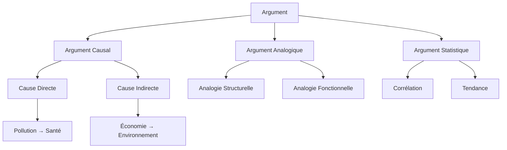
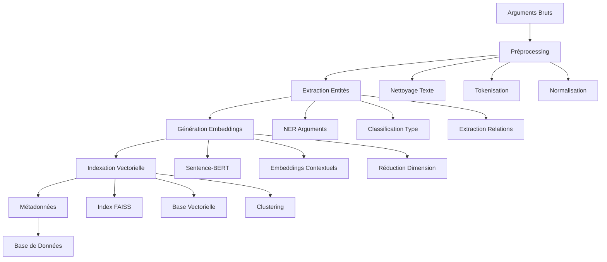
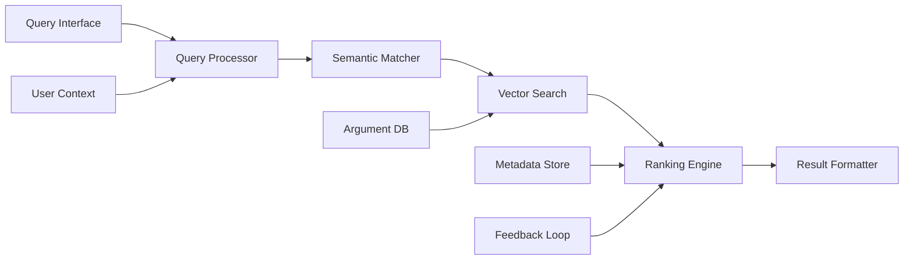

# 2.4.1 Index Sémantique d'Arguments

**Étudiants :** leo.lopes, lucas.duport, yanis.martin  
**Niveau :** Avancé  
**Prérequis :** Théorie de l'argumentation, Machine Learning, Programmation Python, Bases de données  

## Table des Matières

1. [Fondements Théoriques](#1-fondements-théoriques)
2. [Technologies de Base](#2-technologies-de-base)
3. [Architecture du Système](#3-architecture-du-système)
4. [Intégration TweetyProject](#4-intégration-tweetyproject)
5. [Implémentation Pratique](#5-implémentation-pratique)
6. [Cas d'Usage Avancés](#6-cas-dusage-avancés)
7. [Évaluation et Métriques](#7-évaluation-et-métriques)
8. [Ressources et Outils](#8-ressources-et-outils)

---

## 1. Fondements Théoriques

### 1.1 Qu'est-ce qu'un Index Sémantique ?

Un **index sémantique d'arguments** est une structure de données qui permet de rechercher et de récupérer des arguments basés sur leur signification plutôt que sur des correspondances exactes de mots-clés. Contrairement à un index traditionnel qui se base sur des termes exacts, l'index sémantique capture les relations conceptuelles entre les arguments.

**Définition formelle :**
Un index sémantique d'arguments est un tuple `IS = ⟨A, E, S, Q⟩` où :
- `A` : ensemble des arguments indexés
- `E` : fonction d'embedding qui mappe chaque argument vers un vecteur dense
- `S` : fonction de similarité sémantique
- `Q` : moteur de requête sémantique

```
Exemple conceptuel :
Argument 1: "Les voitures électriques réduisent la pollution"
Argument 2: "Les véhicules électriques diminuent les émissions"
→ Similarité sémantique élevée malgré des termes différents
```

### 1.2 Représentation Vectorielle des Arguments

#### 1.2.1 Principe des Embeddings

Les embeddings transforment du texte en vecteurs numériques de dimension fixe qui capturent la sémantique :

```
Texte → Modèle d'Embedding → Vecteur Dense
"L'IA améliore l'éducation" → BERT → [0.2, -0.1, 0.8, ..., 0.3]
                                      ↑
                                   768 dimensions
```

#### 1.2.2 Propriétés Mathématiques

Les embeddings préservent les relations sémantiques dans l'espace vectoriel :

```python
# Propriétés des embeddings sémantiques
def semantic_properties():
    """
    Propriétés fondamentales des embeddings d'arguments
    """
    # 1. Similarité par proximité
    # Arguments similaires → vecteurs proches
    similarity = cosine_similarity(embed("pollution auto"), 
                                 embed("émissions véhicules"))
    # similarity ≈ 0.85
    
    # 2. Composition sémantique
    # Concepts composés = combinaison de vecteurs
    complex_arg = embed("voiture") + embed("électrique") + embed("environnement")
    
    # 3. Analogies argumentatives
    # "essence:pollution :: électrique:propre"
    analogy = embed("électrique") - embed("essence") + embed("pollution")
    # analogy ≈ embed("propre")
```

### 1.3 Similarité Sémantique et Clustering d'Arguments

#### 1.3.1 Métriques de Similarité

```
Métriques principales pour comparer les arguments :

1. Similarité Cosinus :
   sim_cos(A, B) = (A · B) / (||A|| × ||B||)
   
2. Distance Euclidienne :
   dist_eucl(A, B) = √(Σ(Ai - Bi)²)
   
3. Similarité de Jaccard (pour ensembles) :
   sim_jaccard(A, B) = |A ∩ B| / |A ∪ B|
```

#### 1.3.2 Clustering Thématique

```
Processus de clustering d'arguments :

Arguments → Embeddings → Clustering → Groupes Thématiques
    ↓           ↓            ↓              ↓
"Pollution"  [0.2,0.8]   K-means      Cluster "Environnement"
"Émissions"  [0.3,0.7]      ↓         Cluster "Économie"
"Coût"       [0.9,0.1]   DBSCAN       Cluster "Technologie"
```

### 1.4 Ontologies Argumentatives

#### 1.4.1 Structure Hiérarchique

Une ontologie argumentative organise les concepts en hiérarchies :



#### 1.4.2 Relations Sémantiques

```
Relations entre concepts argumentatifs :

1. Subsomption : "Pollution atmosphérique" ⊆ "Pollution"
2. Synonymie : "Véhicule" ≡ "Automobile"
3. Antonymie : "Propre" ⊥ "Polluant"
4. Causalité : "Émissions CO2" → "Réchauffement"
5. Support : "Statistiques" ⊢ "Conclusion"
```

---

## 2. Technologies de Base

### 2.1 Embeddings Textuels

#### 2.1.1 Word2Vec et FastText

**Word2Vec** : Modèle pionnier pour les embeddings de mots

```python
# Exemple conceptuel Word2Vec
class Word2VecConcept:
    """
    Principe de Word2Vec pour les arguments
    """
    def __init__(self, window_size=5, vector_dim=300):
        self.window_size = window_size
        self.vector_dim = vector_dim
    
    def train_on_arguments(self, argument_corpus):
        """
        Entraînement sur un corpus d'arguments
        """
        # Skip-gram : prédire le contexte à partir du mot central
        # CBOW : prédire le mot central à partir du contexte
        for argument in argument_corpus:
            words = self.tokenize(argument)
            for i, target_word in enumerate(words):
                context = self.get_context(words, i)
                # Optimiser : P(context|target) ou P(target|context)
                self.update_weights(target_word, context)
```

**FastText** : Extension de Word2Vec avec sous-mots

```python
# Avantage de FastText pour les arguments
def fasttext_advantage():
    """
    FastText gère mieux les termes argumentatifs rares
    """
    # Mots rares dans l'argumentation
    rare_terms = ["bioéthique", "géopolitique", "épistémologique"]
    
    # FastText décompose en sous-mots
    # "bioéthique" → ["bio", "éth", "ique", "bioé", "oéth", ...]
    # Permet de capturer la sémantique même pour des termes non vus
```

#### 2.1.2 BERT et Transformers

**BERT** (Bidirectional Encoder Representations from Transformers) :

```python
# Architecture BERT pour les arguments
class BERTArgumentEncoder:
    """
    Utilisation de BERT pour encoder les arguments
    """
    def __init__(self):
        self.model = BertModel.from_pretrained('bert-base-uncased')
        self.tokenizer = BertTokenizer.from_pretrained('bert-base-uncased')
    
    def encode_argument(self, argument_text):
        """
        Encoder un argument avec BERT
        """
        # Tokenisation avec tokens spéciaux
        tokens = self.tokenizer.encode(
            argument_text,
            add_special_tokens=True,  # [CLS] ... [SEP]
            max_length=512,
            truncation=True,
            padding=True
        )
        
        # Passage dans BERT
        with torch.no_grad():
            outputs = self.model(torch.tensor([tokens]))
            # Utiliser [CLS] token pour la représentation globale
            argument_embedding = outputs.last_hidden_state[0][0]
        
        return argument_embedding.numpy()
```

#### 2.1.3 Sentence-BERT

**Sentence-BERT** : Optimisé pour les phrases complètes (idéal pour les arguments)

```python
# Sentence-BERT pour arguments
from sentence_transformers import SentenceTransformer

class ArgumentEncoder:
    """
    Encodeur d'arguments basé sur Sentence-BERT
    """
    def __init__(self, model_name='all-MiniLM-L6-v2'):
        self.model = SentenceTransformer(model_name)
    
    def encode_arguments(self, arguments):
        """
        Encoder une liste d'arguments
        """
        # Sentence-BERT optimisé pour la similarité sémantique
        embeddings = self.model.encode(
            arguments,
            convert_to_tensor=True,
            show_progress_bar=True
        )
        return embeddings
    
    def find_similar_arguments(self, query_arg, argument_db, top_k=5):
        """
        Trouver les arguments les plus similaires
        """
        query_embedding = self.model.encode([query_arg])
        db_embeddings = self.model.encode(argument_db)
        
        # Calcul de similarité cosinus
        similarities = cosine_similarity(query_embedding, db_embeddings)[0]
        
        # Top-K arguments similaires
        top_indices = similarities.argsort()[-top_k:][::-1]
        return [(argument_db[i], similarities[i]) for i in top_indices]
### 2.2 Bases de Données Vectorielles

#### 2.2.1 Chroma

**Chroma** : Base de données vectorielle simple et efficace

```python
# Configuration Chroma pour arguments
import chromadb
from chromadb.config import Settings

class ArgumentVectorDB:
    """
    Base de données vectorielle pour arguments avec Chroma
    """
    def __init__(self, persist_directory="./argument_db"):
        self.client = chromadb.PersistentClient(path=persist_directory)
        self.collection = self.client.get_or_create_collection(
            name="arguments",
            metadata={"description": "Collection d'arguments sémantiques"}
        )
    
    def add_arguments(self, arguments, metadatas=None, ids=None):
        """
        Ajouter des arguments à la base
        """
        if ids is None:
            ids = [f"arg_{i}" for i in range(len(arguments))]
        
        self.collection.add(
            documents=arguments,
            metadatas=metadatas or [{}] * len(arguments),
            ids=ids
        )
    
    def search_similar(self, query, n_results=5, where=None):
        """
        Recherche sémantique d'arguments
        """
        results = self.collection.query(
            query_texts=[query],
            n_results=n_results,
            where=where  # Filtres métadonnées
        )
        return results
```

#### 2.2.2 Pinecone

**Pinecone** : Service cloud pour recherche vectorielle à grande échelle

```python
# Configuration Pinecone
import pinecone

class PineconeArgumentIndex:
    """
    Index Pinecone pour arguments à grande échelle
    """
    def __init__(self, api_key, environment, index_name="arguments"):
        pinecone.init(api_key=api_key, environment=environment)
        
        # Créer l'index si nécessaire
        if index_name not in pinecone.list_indexes():
            pinecone.create_index(
                name=index_name,
                dimension=384,  # Dimension Sentence-BERT
                metric="cosine"
            )
        
        self.index = pinecone.Index(index_name)
    
    def upsert_arguments(self, arguments_data):
        """
        Insérer/Mettre à jour des arguments
        """
        # Format : [(id, vector, metadata), ...]
        self.index.upsert(vectors=arguments_data)
    
    def search_arguments(self, query_vector, top_k=10, filter=None):
        """
        Recherche vectorielle
        """
        results = self.index.query(
            vector=query_vector.tolist(),
            top_k=top_k,
            filter=filter,
            include_metadata=True
        )
        return results
```

#### 2.2.3 Weaviate

**Weaviate** : Base vectorielle avec capacités de graphe de connaissances

```python
# Configuration Weaviate
import weaviate

class WeaviateArgumentStore:
    """
    Stockage d'arguments avec Weaviate
    """
    def __init__(self, url="http://localhost:8080"):
        self.client = weaviate.Client(url)
        self.setup_schema()
    
    def setup_schema(self):
        """
        Définir le schéma pour les arguments
        """
        argument_schema = {
            "class": "Argument",
            "description": "Argument dans un débat ou raisonnement",
            "properties": [
                {
                    "name": "content",
                    "dataType": ["text"],
                    "description": "Contenu textuel de l'argument"
                },
                {
                    "name": "category",
                    "dataType": ["string"],
                    "description": "Catégorie de l'argument"
                },
                {
                    "name": "strength",
                    "dataType": ["number"],
                    "description": "Force de l'argument (0-1)"
                }
            ],
            "vectorizer": "text2vec-transformers"
        }
        
        if not self.client.schema.exists("Argument"):
            self.client.schema.create_class(argument_schema)
```

### 2.3 Techniques de Recherche Sémantique

#### 2.3.1 Approximate Nearest Neighbors (ANN)

```
Algorithmes ANN pour recherche rapide :

1. LSH (Locality Sensitive Hashing)
   ┌─────────────────┐
   │ Hash Functions  │ → Buckets similaires
   │ h1, h2, ..., hk │    pour vecteurs proches
   └─────────────────┘

2. Hierarchical NSW (HNSW)
   Layer 2: ○───○───○     (Connexions longues)
   Layer 1: ○─○─○─○─○     (Connexions moyennes)  
   Layer 0: ○○○○○○○○○     (Connexions locales)

3. Product Quantization
   Vecteur → Sous-vecteurs → Quantification → Index compact
```

#### 2.3.2 FAISS (Facebook AI Similarity Search)

```python
# Utilisation de FAISS pour arguments
import faiss
import numpy as np

class FAISSArgumentIndex:
    """
    Index FAISS pour recherche rapide d'arguments
    """
    def __init__(self, dimension=384):
        self.dimension = dimension
        # Index IVF (Inverted File) avec quantification
        self.index = faiss.IndexIVFFlat(
            faiss.IndexFlatL2(dimension),  # Quantizer
            dimension,
            100  # Nombre de clusters
        )
        self.is_trained = False
    
    def train_and_add(self, embeddings):
        """
        Entraîner l'index et ajouter les embeddings
        """
        embeddings = embeddings.astype('float32')
        
        if not self.is_trained:
            # Entraînement nécessaire pour IVF
            self.index.train(embeddings)
            self.is_trained = True
        
        self.index.add(embeddings)
    
    def search(self, query_embedding, k=5):
        """
        Recherche des k plus proches voisins
        """
        query = query_embedding.astype('float32').reshape(1, -1)
        distances, indices = self.index.search(query, k)
        return distances[0], indices[0]
```

### 2.4 Métriques de Similarité

#### 2.4.1 Similarité Cosinus

```python
def cosine_similarity_detailed(vec_a, vec_b):
    """
    Calcul détaillé de la similarité cosinus
    """
    # Produit scalaire
    dot_product = np.dot(vec_a, vec_b)
    
    # Normes euclidiennes
    norm_a = np.linalg.norm(vec_a)
    norm_b = np.linalg.norm(vec_b)
    
    # Similarité cosinus
    similarity = dot_product / (norm_a * norm_b)
    
    # Interprétation :
    # 1.0  : Vecteurs identiques
    # 0.0  : Vecteurs orthogonaux
    # -1.0 : Vecteurs opposés
    
    return similarity
```

#### 2.4.2 Distance Euclidienne

```python
def euclidean_distance_analysis(vec_a, vec_b):
    """
    Analyse de la distance euclidienne
    """
    # Distance euclidienne standard
    distance = np.sqrt(np.sum((vec_a - vec_b) ** 2))
    
    # Distance euclidienne normalisée
    normalized_distance = distance / np.sqrt(len(vec_a))
    
    # Conversion en similarité (0-1)
    similarity = 1 / (1 + distance)
    
    return {
        'distance': distance,
        'normalized_distance': normalized_distance,
        'similarity': similarity
    }
```

#### 2.4.3 Distance de Manhattan

```python
def manhattan_distance_arguments(vec_a, vec_b):
    """
    Distance de Manhattan pour arguments
    """
    # Somme des différences absolues
    distance = np.sum(np.abs(vec_a - vec_b))
    
    # Avantage : moins sensible aux outliers
    # Inconvénient : ne capture pas les relations angulaires
    
    return distance
```

---

## 3. Architecture du Système

### 3.1 Pipeline d'Indexation des Arguments

#### 3.1.1 Vue d'Ensemble



#### 3.1.2 Étapes Détaillées

```
Pipeline d'indexation détaillé :

1. INGESTION
   ├── Sources multiples (texte, PDF, web)
   ├── Validation format
   └── Queue de traitement

2. PRÉPROCESSING
   ├── Nettoyage : suppression HTML, caractères spéciaux
   ├── Segmentation : découpage en arguments atomiques
   ├── Normalisation : casse, accents, abréviations
   └── Filtrage : suppression arguments trop courts/longs

3. ANALYSE SÉMANTIQUE
   ├── Reconnaissance entités argumentatives
   ├── Classification type d'argument (causal, analogique...)
   ├── Extraction relations (support, attaque, réfutation)
   └── Scoring qualité/pertinence

4. VECTORISATION
   ├── Génération embeddings Sentence-BERT
   ├── Embeddings contextuels (position, auteur, date)
   ├── Fusion multi-modal si applicable
   └── Normalisation vecteurs

5. INDEXATION
   ├── Insertion base vectorielle
   ├── Création index ANN
   ├── Clustering thématique
   └── Mise à jour métadonnées
```

### 3.2 Moteur de Recherche Sémantique

#### 3.2.1 Architecture Modulaire



#### 3.2.2 Composants Principaux

```python
# Architecture du moteur de recherche
class SemanticSearchEngine:
    """
    Moteur de recherche sémantique pour arguments
    """
    def __init__(self, config):
        self.query_processor = QueryProcessor(config)
        self.vector_index = VectorIndex(config)
        self.ranking_engine = RankingEngine(config)
        self.result_formatter = ResultFormatter(config)
    
    def search(self, query, user_context=None, filters=None):
        """
        Pipeline de recherche complet
        """
        # 1. Traitement de la requête
        processed_query = self.query_processor.process(
            query, user_context
        )
        
        # 2. Recherche vectorielle
        candidates = self.vector_index.search(
            processed_query.embedding,
            filters=filters,
            top_k=100  # Large recall
        )
        
        # 3. Classement et scoring
        ranked_results = self.ranking_engine.rank(
            candidates, processed_query, user_context
        )
        
        # 4. Formatage des résultats
        formatted_results = self.result_formatter.format(
            ranked_results, query
        )
        
        return formatted_results
```

### 3.3 Interface de Requête et Filtrage

#### 3.3.1 Types de Requêtes

```
Types de requêtes supportées :

1. REQUÊTE SIMPLE
   Input: "arguments pollution voitures"
   Process: Embedding direct → Recherche similarité

2. REQUÊTE STRUCTURÉE  
   Input: {
     "content": "pollution",
     "type": "causal",
     "domain": "environnement",
     "strength": ">0.7"
   }

3. REQUÊTE COMPLEXE
   Input: "arguments POUR électrique ET CONTRE essence"
   Process: Parsing logique → Recherche multi-critères

4. REQUÊTE PAR EXEMPLE
   Input: Argument existant
   Process: "Trouve des arguments similaires à celui-ci"
```

#### 3.3.2 Système de Filtrage

```python
# Système de filtres avancés
class ArgumentFilter:
    """
    Système de filtrage pour la recherche d'arguments
    """
    def __init__(self):
        self.filters = {
            'semantic': SemanticFilter(),
            'temporal': TemporalFilter(),
            'categorical': CategoricalFilter(),
            'quality': QualityFilter(),
            'contextual': ContextualFilter()
        }
    
    def apply_filters(self, results, filter_spec):
        """
        Appliquer une série de filtres
        """
        filtered_results = results
        
        for filter_type, filter_params in filter_spec.items():
            if filter_type in self.filters:
                filtered_results = self.filters[filter_type].apply(
                    filtered_results, filter_params
                )
        
        return filtered_results

class SemanticFilter:
    """Filtrage basé sur la similarité sémantique"""
    def apply(self, results, params):
        threshold = params.get('similarity_threshold', 0.5)
        return [r for r in results if r.similarity >= threshold]

class CategoricalFilter:
    """Filtrage par catégories d'arguments"""
    def apply(self, results, params):
        allowed_types = params.get('argument_types', [])
        if not allowed_types:
            return results
        return [r for r in results if r.type in allowed_types]
```

### 3.4 Mise à Jour Incrémentale de l'Index

#### 3.4.1 Stratégies de Mise à Jour

```
Stratégies de mise à jour :

1. MISE À JOUR BATCH
   ┌─────────────┐    ┌──────────────┐    ┌─────────────┐
   │ Nouveaux    │ →  │ Traitement   │ →  │ Réindexation│
   │ Arguments   │    │ par lots     │    │ complète    │
   └─────────────┘    └──────────────┘    └─────────────┘
   
2. MISE À JOUR STREAMING
   ┌─────────────┐    ┌──────────────┐    ┌─────────────┐
   │ Argument    │ →  │ Traitement   │ →  │ Insertion   │
   │ individuel  │    │ temps réel   │    │ immédiate   │
   └─────────────┘    └──────────────┘    └─────────────┘

3. MISE À JOUR HYBRIDE
   ┌─────────────┐    ┌──────────────┐    ┌─────────────┐
   │ Buffer      │ →  │ Seuil        │ →  │ Flush       │
   │ temporaire  │    │ atteint      │    │ périodique  │
   └─────────────┘    └──────────────┘    └─────────────┘
```

#### 3.4.2 Gestion de la Cohérence

```python
# Système de mise à jour incrémentale
class IncrementalIndexUpdater:
    """
    Gestionnaire de mise à jour incrémentale
    """
    def __init__(self, index, buffer_size=1000):
        self.index = index
        self.buffer = []
        self.buffer_size = buffer_size
        self.lock = threading.Lock()
    
    def add_argument(self, argument):
        """
        Ajouter un argument (avec buffering)
        """
        with self.lock:
            self.buffer.append(argument)
            
            if len(self.buffer) >= self.buffer_size:
                self._flush_buffer()
    
    def _flush_buffer(self):
        """
        Vider le buffer dans l'index principal
        """
        if not self.buffer:
            return
        
        # Traitement par batch pour efficacité
        embeddings = self._generate_embeddings(self.buffer)
        
        # Mise à jour atomique
        try:
            self.index.add_batch(self.buffer, embeddings)
            self.buffer.clear()
        except Exception as e:
            # Gestion d'erreur : log et retry
            self._handle_update_error(e)
    
    def update_argument(self, arg_id, new_content):
        """
        Mettre à jour un argument existant
        """
        # Stratégie : suppression + réinsertion
        self.index.delete(arg_id)
        self.add_argument(new_content)
        
        # Alternative : mise à jour en place si supportée
        # self.index.update(arg_id, new_embedding)
```
---

## 4. Intégration TweetyProject

### 4.1 Extraction d'Arguments depuis les Frameworks de Dung

#### 4.1.1 Interface avec TweetyProject

```java
// Extraction d'arguments depuis TweetyProject
import org.tweetyproject.arg.dung.syntax.*;
import org.tweetyproject.arg.dung.semantics.*;

public class TweetyArgumentExtractor {
    
    /**
     * Extraire les arguments d'un framework de Dung
     */
    public List<SemanticArgument> extractArguments(DungTheory theory) {
        List<SemanticArgument> semanticArgs = new ArrayList<>();
        
        for (Argument arg : theory.getNodes()) {
            SemanticArgument semArg = new SemanticArgument();
            
            // Contenu textuel de l'argument
            semArg.setContent(arg.getName());
            
            // Relations d'attaque
            Set<Argument> attackers = theory.getAttackers(arg);
            Set<Argument> attacked = theory.getAttacked(arg);
            
            semArg.setAttackers(extractNames(attackers));
            semArg.setAttacked(extractNames(attacked));
            
            // Statut selon différentes sémantiques
            semArg.setGroundedStatus(isInGroundedExtension(arg, theory));
            semArg.setPreferredStatus(isInPreferredExtensions(arg, theory));
            semArg.setStableStatus(isInStableExtensions(arg, theory));
            
            semanticArgs.add(semArg);
        }
        
        return semanticArgs;
    }
    
    /**
     * Enrichir avec informations sémantiques
     */
    private boolean isInGroundedExtension(Argument arg, DungTheory theory) {
        GroundedReasoner reasoner = new GroundedReasoner();
        Extension groundedExt = reasoner.getModel(theory);
        return groundedExt.contains(arg);
    }
}
```

#### 4.1.2 Pont Java-Python

```python
# Interface Python pour TweetyProject via Py4J
from py4j.java_gateway import JavaGateway

class TweetyProjectBridge:
    """
    Pont entre Python et TweetyProject Java
    """
    def __init__(self):
        self.gateway = JavaGateway()
        self.extractor = self.gateway.entry_point.getTweetyArgumentExtractor()
    
    def extract_from_dung_theory(self, theory_file):
        """
        Extraire arguments depuis un fichier TGF/APX
        """
        # Charger la théorie depuis le fichier
        java_theory = self.gateway.jvm.org.tweetyproject.arg.dung.parser.TgfParser().parseBeliefBaseFromFile(theory_file)
        
        # Extraire les arguments avec métadonnées
        java_arguments = self.extractor.extractArguments(java_theory)
        
        # Convertir en format Python
        python_arguments = []
        for java_arg in java_arguments:
            arg_dict = {
                'content': java_arg.getContent(),
                'attackers': list(java_arg.getAttackers()),
                'attacked': list(java_arg.getAttacked()),
                'grounded_status': java_arg.getGroundedStatus(),
                'preferred_status': java_arg.getPreferredStatus(),
                'stable_status': java_arg.getStableStatus()
            }
            python_arguments.append(arg_dict)
        
        return python_arguments
```

### 4.2 Enrichissement Sémantique des Structures Argumentatives

#### 4.2.1 Augmentation des Frameworks de Dung

```python
# Enrichissement sémantique des arguments
class SemanticArgumentFramework:
    """
    Framework d'argumentation enrichi sémantiquement
    """
    def __init__(self, sentence_transformer_model='all-MiniLM-L6-v2'):
        self.encoder = SentenceTransformer(sentence_transformer_model)
        self.arguments = {}
        self.embeddings = {}
        self.attack_relations = []
        self.semantic_clusters = {}
    
    def add_argument(self, arg_id, content, metadata=None):
        """
        Ajouter un argument avec enrichissement sémantique
        """
        # Stocker l'argument
        self.arguments[arg_id] = {
            'content': content,
            'metadata': metadata or {},
            'semantic_features': self._extract_semantic_features(content)
        }
        
        # Générer embedding
        self.embeddings[arg_id] = self.encoder.encode(content)
        
        # Mise à jour des clusters
        self._update_semantic_clusters(arg_id)
    
    def _extract_semantic_features(self, content):
        """
        Extraire des caractéristiques sémantiques
        """
        features = {
            'length': len(content.split()),
            'sentiment': self._analyze_sentiment(content),
            'argument_type': self._classify_argument_type(content),
            'key_concepts': self._extract_key_concepts(content),
            'certainty_level': self._assess_certainty(content)
        }
        return features
    
    def find_semantic_attacks(self, similarity_threshold=0.8, opposition_threshold=0.3):
        """
        Découvrir des relations d'attaque basées sur la sémantique
        """
        semantic_attacks = []
        
        for arg1_id, arg1 in self.arguments.items():
            for arg2_id, arg2 in self.arguments.items():
                if arg1_id != arg2_id:
                    # Calculer similarité sémantique
                    similarity = cosine_similarity(
                        [self.embeddings[arg1_id]], 
                        [self.embeddings[arg2_id]]
                    )[0][0]
                    
                    # Détecter opposition sémantique
                    opposition_score = self._detect_semantic_opposition(
                        arg1['content'], arg2['content']
                    )
                    
                    if (similarity > similarity_threshold and 
                        opposition_score > opposition_threshold):
                        semantic_attacks.append((arg1_id, arg2_id, opposition_score))
        
        return semantic_attacks
```

### 4.3 Recherche d'Arguments Similaires dans une Base de Connaissances

#### 4.3.1 Intégration avec l'Index Sémantique

```python
# Recherche d'arguments similaires
class TweetySemanticSearch:
    """
    Recherche sémantique intégrée avec TweetyProject
    """
    def __init__(self, vector_db, tweety_bridge):
        self.vector_db = vector_db
        self.tweety_bridge = tweety_bridge
        self.encoder = SentenceTransformer('all-MiniLM-L6-v2')
    
    def search_similar_arguments(self, source_argument, context_theory=None, top_k=10):
        """
        Rechercher des arguments similaires avec contexte TweetyProject
        """
        # Encoder l'argument source
        source_embedding = self.encoder.encode([source_argument])
        
        # Recherche vectorielle de base
        base_results = self.vector_db.search_similar(
            source_argument, n_results=top_k * 2
        )
        
        # Enrichir avec informations TweetyProject si contexte fourni
        if context_theory:
            enriched_results = self._enrich_with_tweety_context(
                base_results, context_theory
            )
        else:
            enriched_results = base_results
        
        # Filtrer et classer selon critères sémantiques
        final_results = self._semantic_ranking(
            enriched_results, source_embedding, top_k
        )
        
        return final_results
    
    def _enrich_with_tweety_context(self, results, theory):
        """
        Enrichir les résultats avec le contexte TweetyProject
        """
        enriched = []
        
        for result in results['documents'][0]:
            # Analyser la compatibilité avec la théorie
            compatibility = self._analyze_theory_compatibility(result, theory)
            
            # Calculer la force argumentative
            strength = self._calculate_argument_strength(result, theory)
            
            enriched_result = {
                'content': result,
                'compatibility_score': compatibility,
                'argument_strength': strength,
                'semantic_similarity': results['distances'][0][results['documents'][0].index(result)]
            }
            enriched.append(enriched_result)
        
        return enriched
```

### 4.4 Validation de Cohérence Sémantique

#### 4.4.1 Détection d'Incohérences

```python
# Validation de cohérence sémantique
class SemanticConsistencyValidator:
    """
    Validateur de cohérence sémantique pour arguments
    """
    def __init__(self):
        self.encoder = SentenceTransformer('all-MiniLM-L6-v2')
        self.contradiction_detector = ContradictionDetector()
        self.coherence_analyzer = CoherenceAnalyzer()
    
    def validate_argument_set(self, arguments):
        """
        Valider la cohérence d'un ensemble d'arguments
        """
        validation_report = {
            'is_consistent': True,
            'contradictions': [],
            'weak_coherence': [],
            'semantic_gaps': [],
            'overall_score': 0.0
        }
        
        # Détecter les contradictions directes
        contradictions = self._detect_contradictions(arguments)
        validation_report['contradictions'] = contradictions
        
        # Analyser la cohérence thématique
        coherence_issues = self._analyze_thematic_coherence(arguments)
        validation_report['weak_coherence'] = coherence_issues
        
        # Identifier les lacunes sémantiques
        semantic_gaps = self._identify_semantic_gaps(arguments)
        validation_report['semantic_gaps'] = semantic_gaps
        
        # Calculer score global
        validation_report['overall_score'] = self._calculate_consistency_score(
            validation_report
        )
        
        validation_report['is_consistent'] = (
            len(contradictions) == 0 and 
            validation_report['overall_score'] > 0.7
        )
        
        return validation_report
    
    def _detect_contradictions(self, arguments):
        """
        Détecter les contradictions sémantiques
        """
        contradictions = []
        
        for i, arg1 in enumerate(arguments):
            for j, arg2 in enumerate(arguments[i+1:], i+1):
                # Analyser la contradiction sémantique
                contradiction_score = self.contradiction_detector.analyze(
                    arg1['content'], arg2['content']
                )
                
                if contradiction_score > 0.8:  # Seuil de contradiction
                    contradictions.append({
                        'arg1_id': arg1.get('id', i),
                        'arg2_id': arg2.get('id', j),
                        'contradiction_score': contradiction_score,
                        'explanation': self._explain_contradiction(arg1, arg2)
                    })
        
        return contradictions
```

---

## 5. Implémentation Pratique

### 5.1 Code Python avec Sentence-BERT et Chroma

#### 5.1.1 Système Complet d'Index Sémantique

```python
#!/usr/bin/env python3
"""
Système d'index sémantique d'arguments - Implémentation complète
Auteurs: leo.lopes, lucas.duport, yanis.martin
"""

import os
import json
import logging
from typing import List, Dict, Tuple, Optional
from dataclasses import dataclass
from datetime import datetime

import numpy as np
import pandas as pd
from sentence_transformers import SentenceTransformer
from sklearn.metrics.pairwise import cosine_similarity
from sklearn.cluster import KMeans, DBSCAN
import chromadb
from chromadb.config import Settings

# Configuration du logging
logging.basicConfig(level=logging.INFO)
logger = logging.getLogger(__name__)

@dataclass
class Argument:
    """Structure de données pour un argument"""
    id: str
    content: str
    category: Optional[str] = None
    strength: Optional[float] = None
    source: Optional[str] = None
    timestamp: Optional[datetime] = None
    metadata: Optional[Dict] = None

class SemanticArgumentIndex:
    """
    Index sémantique d'arguments - Classe principale
    """
    
    def __init__(self, 
                 model_name: str = 'all-MiniLM-L6-v2',
                 persist_directory: str = './semantic_argument_db',
                 collection_name: str = 'arguments'):
        """
        Initialiser l'index sémantique
        
        Args:
            model_name: Nom du modèle Sentence-BERT
            persist_directory: Répertoire de persistance
            collection_name: Nom de la collection Chroma
        """
        self.model_name = model_name
        self.persist_directory = persist_directory
        self.collection_name = collection_name
        
        # Initialiser le modèle d'embedding
        logger.info(f"Chargement du modèle {model_name}...")
        self.encoder = SentenceTransformer(model_name)
        
        # Initialiser la base de données vectorielle
        self._init_vector_db()
        
        # Cache pour les embeddings
        self.embedding_cache = {}
        
        logger.info("Index sémantique initialisé avec succès")
    
    def _init_vector_db(self):
        """Initialiser la base de données vectorielle Chroma"""
        try:
            self.chroma_client = chromadb.PersistentClient(
                path=self.persist_directory
            )
            
            self.collection = self.chroma_client.get_or_create_collection(
                name=self.collection_name,
                metadata={
                    "description": "Collection d'arguments sémantiques",
                    "model": self.model_name,
                    "created_at": datetime.now().isoformat()
                }
            )
            
            logger.info(f"Base vectorielle initialisée: {self.persist_directory}")
            
        except Exception as e:
            logger.error(f"Erreur initialisation base vectorielle: {e}")
            raise
    
    def add_arguments(self, arguments: List[Argument]) -> bool:
        """
        Ajouter des arguments à l'index
        
        Args:
            arguments: Liste d'arguments à indexer
            
        Returns:
            bool: Succès de l'opération
        """
        try:
            # Préparer les données pour Chroma
            documents = []
            metadatas = []
            ids = []
            
            for arg in arguments:
                documents.append(arg.content)
                
                metadata = {
                    'category': arg.category or 'unknown',
                    'strength': arg.strength or 0.0,
                    'source': arg.source or 'unknown',
                    'timestamp': arg.timestamp.isoformat() if arg.timestamp else datetime.now().isoformat(),
                    'content_length': len(arg.content),
                    'word_count': len(arg.content.split())
                }
                
                # Ajouter métadonnées personnalisées
                if arg.metadata:
                    metadata.update(arg.metadata)
                
                metadatas.append(metadata)
                ids.append(arg.id)
            
            # Ajouter à la collection
            self.collection.add(
                documents=documents,
                metadatas=metadatas,
                ids=ids
            )
            
            logger.info(f"Ajouté {len(arguments)} arguments à l'index")
            return True
            
        except Exception as e:
            logger.error(f"Erreur lors de l'ajout d'arguments: {e}")
            return False
    
    def search_similar(self, 
                      query: str, 
                      n_results: int = 10,
                      filters: Optional[Dict] = None,
                      similarity_threshold: float = 0.0) -> List[Dict]:
        """
        Rechercher des arguments similaires
        
        Args:
            query: Requête de recherche
            n_results: Nombre de résultats
            filters: Filtres métadonnées
            similarity_threshold: Seuil de similarité minimum
            
        Returns:
            List[Dict]: Résultats de recherche
        """
        try:
            # Recherche dans Chroma
            results = self.collection.query(
                query_texts=[query],
                n_results=n_results,
                where=filters
            )
            
            # Formater les résultats
            formatted_results = []
            
            if results['documents'] and results['documents'][0]:
                for i, (doc, metadata, distance) in enumerate(zip(
                    results['documents'][0],
                    results['metadatas'][0],
                    results['distances'][0]
                )):
                    # Convertir distance en similarité
                    similarity = 1 - distance
                    
                    if similarity >= similarity_threshold:
                        result = {
                            'id': results['ids'][0][i],
                            'content': doc,
                            'similarity': similarity,
                            'metadata': metadata,
                            'rank': i + 1
                        }
                        formatted_results.append(result)
            
            logger.info(f"Trouvé {len(formatted_results)} arguments similaires")
            return formatted_results
            
        except Exception as e:
            logger.error(f"Erreur lors de la recherche: {e}")
            return []
    
    def cluster_arguments(self, 
                         method: str = 'kmeans', 
                         n_clusters: int = 5,
                         filters: Optional[Dict] = None) -> Dict:
        """
        Clustering thématique des arguments
        
        Args:
            method: Méthode de clustering ('kmeans' ou 'dbscan')
            n_clusters: Nombre de clusters (pour k-means)
            filters: Filtres pour sélectionner les arguments
            
        Returns:
            Dict: Résultats du clustering
        """
        try:
            # Récupérer tous les arguments (ou filtrés)
            all_results = self.collection.get(
                where=filters,
                include=['documents', 'metadatas', 'embeddings']
            )
            
            if not all_results['documents']:
                logger.warning("Aucun argument trouvé pour le clustering")
                return {}
            
            # Générer embeddings si nécessaire
            if 'embeddings' not in all_results or not all_results['embeddings']:
                documents = all_results['documents']
                embeddings = self.encoder.encode(documents)
            else:
                embeddings = np.array(all_results['embeddings'])
            
            # Appliquer clustering
            if method == 'kmeans':
                clusterer = KMeans(n_clusters=n_clusters, random_state=42)
            elif method == 'dbscan':
                clusterer = DBSCAN(eps=0.5, min_samples=2)
            else:
                raise ValueError(f"Méthode de clustering non supportée: {method}")
            
            cluster_labels = clusterer.fit_predict(embeddings)
            
            # Organiser les résultats par cluster
            clusters = {}
            for i, (doc, metadata, label) in enumerate(zip(
                all_results['documents'],
                all_results['metadatas'],
                cluster_labels
            )):
                cluster_id = f"cluster_{label}"
                
                if cluster_id not in clusters:
                    clusters[cluster_id] = {
                        'arguments': [],
                        'size': 0,
                        'representative_terms': []
                    }
                
                clusters[cluster_id]['arguments'].append({
                    'id': all_results['ids'][i],
                    'content': doc,
                    'metadata': metadata
                })
                clusters[cluster_id]['size'] += 1
            
            # Extraire termes représentatifs pour chaque cluster
            for cluster_id, cluster_data in clusters.items():
                terms = self._extract_representative_terms(
                    [arg['content'] for arg in cluster_data['arguments']]
                )
                cluster_data['representative_terms'] = terms
            
            logger.info(f"Clustering terminé: {len(clusters)} clusters créés")
            return clusters
            
        except Exception as e:
            logger.error(f"Erreur lors du clustering: {e}")
            return {}
    
    def _extract_representative_terms(self, documents: List[str], top_k: int = 5) -> List[str]:
        """
        Extraire les termes les plus représentatifs d'un cluster
        
        Args:
            documents: Documents du cluster
            top_k: Nombre de termes à extraire
            
        Returns:
            List[str]: Termes représentatifs
        """
        # Implémentation simplifiée - peut être améliorée avec TF-IDF
        from collections import Counter
        import re
        
        # Nettoyer et tokeniser
        all_words = []
        for doc in documents:
            words = re.findall(r'\b\w+\b', doc.lower())
            # Filtrer les mots courts et communs
            words = [w for w in words if len(w) > 3 and w not in ['avec', 'pour', 'dans', 'cette', 'sont']]
            all_words.extend(words)
        
        # Compter les occurrences
        word_counts = Counter(all_words)
        
        # Retourner les plus fréquents
        return [word for word, count in word_counts.most_common(top_k)]
    
    def get_statistics(self) -> Dict:
        """
        Obtenir des statistiques sur l'index
        
        Returns:
            Dict: Statistiques de l'index
        """
        try:
            # Compter les arguments
            count_result = self.collection.count()
            
            # Obtenir quelques échantillons pour analyse
            sample_results = self.collection.get(
                limit=100,
                include=['documents', 'metadatas']
            )
            
            stats = {
                'total_arguments': count_result,
                'collection_name': self.collection_name,
                'model_name': self.model_name,
                'categories': {},
                'avg_content_length': 0,
                'avg_word_count': 0
            }
            
            if sample_results['metadatas']:
                # Analyser les catégories
                categories = [meta.get('category', 'unknown') for meta in sample_results['metadatas']]
                stats['categories'] = dict(Counter(categories))
                
                # Calculer moyennes
                lengths = [meta.get('content_length', 0) for meta in sample_results['metadatas']]
                word_counts = [meta.get('word_count', 0) for meta in sample_results['metadatas']]
                
                stats['avg_content_length'] = np.mean(lengths) if lengths else 0
                stats['avg_word_count'] = np.mean(word_counts) if word_counts else 0
            
            return stats
            
        except Exception as e:
            logger.error(f"Erreur lors du calcul des statistiques: {e}")
            return {}
    
    def export_arguments(self, output_file: str, format: str = 'json') -> bool:
        """
        Exporter les arguments indexés
        
        Args:
            output_file: Fichier de sortie
            format: Format d'export ('json' ou 'csv')
            
        Returns:
            bool: Succès de l'opération
        """
        try:
            # Récupérer tous les arguments
            all_results = self.collection.get(
                include=['documents', 'metadatas']
            )
            
            if format == 'json':
                export_data = []
                for i, (doc, metadata) in enumerate(zip(
                    all_results['documents'],
                    all_results['metadatas']
                )):
                    export_data.append({
                        'id': all_results['ids'][i],
                        'content': doc,
                        'metadata': metadata
                    })
                
                with open(output_file, 'w', encoding='utf-8') as f:
                    json.dump(export_data, f, ensure_ascii=False, indent=2)
            
            elif format == 'csv':
                # Créer DataFrame
                data = []
                for i, (doc, metadata) in enumerate(zip(
                    all_results['documents'],
                    all_results['metadatas']
                )):
                    row = {
                        'id': all_results['ids'][i],
                        'content': doc,
                        **metadata
                    }
                    data.append(row)
                
                df = pd.DataFrame(data)
                df.to_csv(output_file, index=False, encoding='utf-8')
            
            else:
                raise ValueError(f"Format non supporté: {format}")
            
            logger.info(f"Export terminé: {output_file}")
            return True
            
        except Exception as e:
            logger.error(f"Erreur lors de l'export: {e}")
            return False

# Exemple d'utilisation
def main():
    """Exemple d'utilisation du système d'index sémantique"""
    
    # Initialiser l'index
    index = SemanticArgumentIndex()
    
    # Créer des arguments d'exemple
    sample_arguments = [
        Argument(
            id="arg_001",
            content="Les voitures électriques réduisent significativement les émissions de CO2",
            category="environnement",
            strength=0.8,
            source="étude_scientifique"
        ),
        Argument(
            id="arg_002", 
            content="Les véhicules électriques diminuent la pollution atmosphérique urbaine",
            category="environnement",
            strength=0.9,
            source="rapport_gouvernemental"
        ),
        Argument(
            id="arg_003",
            content="Le coût d'achat des voitures électriques reste élevé pour les consommateurs",
            category="économie",
            strength=0.7,
            source="analyse_marché"
        ),
        Argument(
            id="arg_004",
            content="L'infrastructure de recharge électrique est insuffisante dans les zones rurales",
            category="infrastructure",
            strength=0.6,
            source="enquête_terrain"
        )
    ]
    
    # Ajouter les arguments à l'index
    success = index.add_arguments(sample_arguments)
    if success:
        print("✅ Arguments ajoutés avec succès")
    
    # Rechercher des arguments similaires
    query = "pollution voitures environnement"
    results = index.search_similar(query, n_results=3)
    
    print(f"\n🔍 Résultats pour '{query}':")
    for result in results:
        print(f"  - Similarité: {result['similarity']:.3f}")
        print(f"    Contenu: {result['content'][:100]}...")
        print(f"    Catégorie: {result['metadata']['category']}")
        print()
    
    # Clustering thématique
    clusters = index.cluster_arguments(method='kmeans', n_clusters=2)
    
    print("📊 Clustering thématique:")
    for cluster_id, cluster_data in clusters.items():
        print(f"  {cluster_id}: {cluster_data['size']} arguments")
        print(f"    Termes: {', '.join(cluster_data['representative_terms'])}")
        print()
    
    # Statistiques
    stats = index.get_statistics()
    print("📈 Statistiques de l'index:")
    print(f"  Total arguments: {stats['total_arguments']}")
    print(f"  Catégories: {stats['categories']}")
    print(f"  Longueur moyenne: {stats['avg_content_length']:.1f} caractères")

if __name__ == "__main__":
    main()
```

### 5.2 Interface de Recherche avec Streamlit

#### 5.2.1 Application Web Interactive

```python
#!/usr/bin/env python3
"""
Interface Streamlit pour l'index sémantique d'arguments
"""

import streamlit as st
import pandas as pd
import plotly.express as px
import plotly.graph_objects as go
from datetime import datetime
import json

# Import du système d'index
from semantic_argument_index import SemanticArgumentIndex, Argument

# Configuration de la page
st.set_page_config(
    page_title="Index Sémantique d'Arguments",
    page_icon="🔍",
    layout="wide",
    initial_sidebar_state="expanded"
)

# CSS personnalisé
st.markdown("""
<style>
.main-header {
    font-size: 2.5rem;
    color: #1f77b4;
    text-align: center;
    margin-bottom: 2rem;
}
.search-box {
    background-color: #f0f2f6;
    padding: 1rem;
    border-radius: 0.5rem;
    margin-bottom: 1rem;
}
.result-card {
    background-color: white;
    padding: 1rem;
    border-radius: 0.5rem;
    border-left: 4px solid #1f77b4;
    margin-bottom: 1rem;
    box-shadow: 0 2px 4px rgba(0,0,0,0.1);
}
.similarity-score {
    background-color: #e8f4fd;
    color: #1f77b4;
    padding: 0.2rem 0.5rem;
    border-radius: 0.3rem;
    font-weight: bold;
}
</style>
""", unsafe_allow_html=True)

@st.cache_resource
def load_index():
    """Charger l'index sémantique (avec cache)"""
    return SemanticArgumentIndex()

def main():
    """Application principale"""
    
    # Titre principal
    st.markdown('<h1 class="main-header">🔍 Index Sémantique d\'Arguments</h1>', 
                unsafe_allow_html=True)
    
    # Charger l'index
    index = load_index()
    
    # Sidebar pour navigation
    st.sidebar.title("Navigation")
    page = st.sidebar.selectbox(
        "Choisir une page",
        ["🔍 Recherche", "📊 Analyse", "➕ Ajouter Arguments", "⚙️ Administration"]
    )
    
    if page == "🔍 Recherche":
        search_page(index)
    elif page == "📊 Analyse":
        analysis_page(index)
    elif page == "➕ Ajouter Arguments":
        add_arguments_page(index)
elif page == "⚙️ Administration":
        admin_page(index)

def search_page(index):
    """Page de recherche sémantique"""
    
    st.header("🔍 Recherche Sémantique d'Arguments")
    
    # Zone de recherche
    with st.container():
        st.markdown('<div class="search-box">', unsafe_allow_html=True)
        
        col1, col2 = st.columns([3, 1])
        
        with col1:
            query = st.text_input(
                "Entrez votre requête de recherche:",
                placeholder="Ex: pollution voitures électriques environnement",
                key="search_query"
            )
        
        with col2:
            n_results = st.number_input(
                "Nombre de résultats:",
                min_value=1,
                max_value=50,
                value=10
            )
        
        st.markdown('</div>', unsafe_allow_html=True)
    
    # Filtres avancés
    with st.expander("🔧 Filtres Avancés"):
        col1, col2, col3 = st.columns(3)
        
        with col1:
            category_filter = st.selectbox(
                "Catégorie:",
                ["Toutes", "environnement", "économie", "technologie", "social"]
            )
        
        with col2:
            min_strength = st.slider(
                "Force minimum:",
                0.0, 1.0, 0.0, 0.1
            )
        
        with col3:
            similarity_threshold = st.slider(
                "Seuil de similarité:",
                0.0, 1.0, 0.3, 0.05
            )
    
    # Bouton de recherche
    if st.button("🔍 Rechercher", type="primary") and query:
        
        # Préparer les filtres
        filters = {}
        if category_filter != "Toutes":
            filters["category"] = category_filter
        if min_strength > 0:
            filters["strength"] = {"$gte": min_strength}
        
        # Effectuer la recherche
        with st.spinner("Recherche en cours..."):
            results = index.search_similar(
                query=query,
                n_results=n_results,
                filters=filters if filters else None,
                similarity_threshold=similarity_threshold
            )
        
        # Afficher les résultats
        if results:
            st.success(f"✅ {len(results)} arguments trouvés")
            
            for i, result in enumerate(results):
                with st.container():
                    st.markdown('<div class="result-card">', unsafe_allow_html=True)
                    
                    col1, col2 = st.columns([4, 1])
                    
                    with col1:
                        st.markdown(f"**#{result['rank']}** {result['content']}")
                        
                        # Métadonnées
                        meta_info = []
                        if 'category' in result['metadata']:
                            meta_info.append(f"📂 {result['metadata']['category']}")
                        if 'source' in result['metadata']:
                            meta_info.append(f"📄 {result['metadata']['source']}")
                        if 'strength' in result['metadata']:
                            meta_info.append(f"💪 {result['metadata']['strength']:.2f}")
                        
                        if meta_info:
                            st.caption(" | ".join(meta_info))
                    
                    with col2:
                        similarity_color = "green" if result['similarity'] > 0.8 else "orange" if result['similarity'] > 0.6 else "red"
                        st.markdown(
                            f'<span class="similarity-score" style="background-color: {similarity_color}20; color: {similarity_color};">'
                            f'{result["similarity"]:.3f}</span>',
                            unsafe_allow_html=True
                        )
                    
                    st.markdown('</div>', unsafe_allow_html=True)
        else:
            st.warning("❌ Aucun argument trouvé pour cette requête")

def analysis_page(index):
    """Page d'analyse et visualisation"""
    
    st.header("📊 Analyse de l'Index Sémantique")
    
    # Statistiques générales
    stats = index.get_statistics()
    
    if stats:
        # Métriques principales
        col1, col2, col3, col4 = st.columns(4)
        
        with col1:
            st.metric("Total Arguments", stats['total_arguments'])
        
        with col2:
            st.metric("Catégories", len(stats.get('categories', {})))
        
        with col3:
            st.metric("Longueur Moyenne", f"{stats.get('avg_content_length', 0):.0f} car.")
        
        with col4:
            st.metric("Mots Moyens", f"{stats.get('avg_word_count', 0):.0f}")
        
        # Graphiques
        if stats.get('categories'):
            col1, col2 = st.columns(2)
            
            with col1:
                # Distribution des catégories
                fig_cat = px.pie(
                    values=list(stats['categories'].values()),
                    names=list(stats['categories'].keys()),
                    title="Distribution des Catégories"
                )
                st.plotly_chart(fig_cat, use_container_width=True)
            
            with col2:
                # Clustering en temps réel
                if st.button("🔄 Générer Clustering"):
                    with st.spinner("Clustering en cours..."):
                        clusters = index.cluster_arguments(method='kmeans', n_clusters=3)
                    
                    if clusters:
                        cluster_data = []
                        for cluster_id, data in clusters.items():
                            cluster_data.append({
                                'Cluster': cluster_id,
                                'Taille': data['size'],
                                'Termes': ', '.join(data['representative_terms'][:3])
                            })
                        
                        df_clusters = pd.DataFrame(cluster_data)
                        st.dataframe(df_clusters, use_container_width=True)

def add_arguments_page(index):
    """Page pour ajouter de nouveaux arguments"""
    
    st.header("➕ Ajouter de Nouveaux Arguments")
    
    # Formulaire d'ajout individuel
    with st.form("add_single_argument"):
        st.subheader("Ajout Individuel")
        
        col1, col2 = st.columns(2)
        
        with col1:
            arg_id = st.text_input("ID de l'argument:", placeholder="arg_001")
            content = st.text_area("Contenu de l'argument:", height=100)
            category = st.selectbox("Catégorie:", 
                                  ["environnement", "économie", "technologie", "social", "autre"])
        
        with col2:
            strength = st.slider("Force de l'argument:", 0.0, 1.0, 0.5, 0.1)
            source = st.text_input("Source:", placeholder="étude, rapport, etc.")
            
        submitted = st.form_submit_button("➕ Ajouter l'Argument")
        
        if submitted and arg_id and content:
            new_arg = Argument(
                id=arg_id,
                content=content,
                category=category,
                strength=strength,
                source=source,
                timestamp=datetime.now()
            )
            
            success = index.add_arguments([new_arg])
            if success:
                st.success("✅ Argument ajouté avec succès!")
            else:
                st.error("❌ Erreur lors de l'ajout")
    
    st.divider()
    
    # Import en lot
    st.subheader("Import en Lot")
    
    uploaded_file = st.file_uploader(
        "Choisir un fichier JSON ou CSV:",
        type=['json', 'csv'],
        help="Format attendu: colonnes 'id', 'content', 'category', 'strength', 'source'"
    )
    
    if uploaded_file:
        try:
            if uploaded_file.name.endswith('.json'):
                data = json.load(uploaded_file)
            else:
                df = pd.read_csv(uploaded_file)
                data = df.to_dict('records')
            
            st.write(f"📄 {len(data)} arguments détectés dans le fichier")
            
            if st.button("📥 Importer les Arguments"):
                arguments = []
                for item in data:
                    arg = Argument(
                        id=item.get('id', f"imported_{len(arguments)}"),
                        content=item.get('content', ''),
                        category=item.get('category'),
                        strength=item.get('strength'),
                        source=item.get('source'),
                        timestamp=datetime.now()
                    )
                    arguments.append(arg)
                
                success = index.add_arguments(arguments)
                if success:
                    st.success(f"✅ {len(arguments)} arguments importés!")
                else:
                    st.error("❌ Erreur lors de l'import")
        
        except Exception as e:
            st.error(f"❌ Erreur de lecture du fichier: {e}")

def admin_page(index):
    """Page d'administration"""
    
    st.header("⚙️ Administration")
    
    # Export des données
    st.subheader("📤 Export des Données")
    
    col1, col2 = st.columns(2)
    
    with col1:
        export_format = st.selectbox("Format d'export:", ["json", "csv"])
    
    with col2:
        if st.button("📥 Télécharger Export"):
            filename = f"arguments_export_{datetime.now().strftime('%Y%m%d_%H%M%S')}.{export_format}"
            
            success = index.export_arguments(filename, export_format)
            if success:
                st.success(f"✅ Export créé: {filename}")
                
                # Proposer le téléchargement
                with open(filename, 'rb') as f:
                    st.download_button(
                        label="⬇️ Télécharger",
                        data=f.read(),
                        file_name=filename,
                        mime='application/json' if export_format == 'json' else 'text/csv'
                    )
    
    st.divider()
    
    # Maintenance
    st.subheader("🔧 Maintenance")
    
    col1, col2 = st.columns(2)
    
    with col1:
        if st.button("🗑️ Vider l'Index", type="secondary"):
            if st.checkbox("Confirmer la suppression"):
                # Note: Implémentation de la suppression à ajouter
                st.warning("⚠️ Fonctionnalité à implémenter")
    
    with col2:
        if st.button("🔄 Réindexer", type="secondary"):
            st.info("ℹ️ Réindexation en cours...")
            # Note: Implémentation de la réindexation à ajouter

if __name__ == "__main__":
    main()
```

### 5.3 API REST pour l'Indexation et la Recherche

#### 5.3.1 Serveur FastAPI

```python
#!/usr/bin/env python3
"""
API REST pour l'index sémantique d'arguments
Utilise FastAPI pour exposer les fonctionnalités
"""

from fastapi import FastAPI, HTTPException, Query, Body
from fastapi.middleware.cors import CORSMiddleware
from pydantic import BaseModel, Field
from typing import List, Optional, Dict, Any
from datetime import datetime
import uvicorn
import logging

# Import du système d'index
from semantic_argument_index import SemanticArgumentIndex, Argument

# Configuration du logging
logging.basicConfig(level=logging.INFO)
logger = logging.getLogger(__name__)

# Modèles Pydantic pour l'API
class ArgumentCreate(BaseModel):
    """Modèle pour créer un argument"""
    id: str = Field(..., description="Identifiant unique de l'argument")
    content: str = Field(..., min_length=10, description="Contenu textuel de l'argument")
    category: Optional[str] = Field(None, description="Catégorie de l'argument")
    strength: Optional[float] = Field(None, ge=0.0, le=1.0, description="Force de l'argument (0-1)")
    source: Optional[str] = Field(None, description="Source de l'argument")
    metadata: Optional[Dict[str, Any]] = Field(None, description="Métadonnées additionnelles")

class ArgumentResponse(BaseModel):
    """Modèle de réponse pour un argument"""
    id: str
    content: str
    category: Optional[str]
    strength: Optional[float]
    source: Optional[str]
    timestamp: Optional[datetime]
    metadata: Optional[Dict[str, Any]]

class SearchRequest(BaseModel):
    """Modèle pour une requête de recherche"""
    query: str = Field(..., min_length=1, description="Requête de recherche")
    n_results: int = Field(10, ge=1, le=100, description="Nombre de résultats")
    filters: Optional[Dict[str, Any]] = Field(None, description="Filtres de recherche")
    similarity_threshold: float = Field(0.0, ge=0.0, le=1.0, description="Seuil de similarité")

class SearchResult(BaseModel):
    """Modèle de résultat de recherche"""
    id: str
    content: str
    similarity: float
    metadata: Dict[str, Any]
    rank: int

class SearchResponse(BaseModel):
    """Modèle de réponse de recherche"""
    query: str
    total_results: int
    results: List[SearchResult]
    execution_time_ms: float

class ClusterRequest(BaseModel):
    """Modèle pour une requête de clustering"""
    method: str = Field("kmeans", description="Méthode de clustering")
    n_clusters: int = Field(5, ge=2, le=20, description="Nombre de clusters")
    filters: Optional[Dict[str, Any]] = Field(None, description="Filtres pour sélectionner les arguments")

# Initialisation de l'application FastAPI
app = FastAPI(
    title="API Index Sémantique d'Arguments",
    description="API REST pour la recherche et l'indexation sémantique d'arguments",
    version="1.0.0",
    docs_url="/docs",
    redoc_url="/redoc"
)

# Configuration CORS
app.add_middleware(
    CORSMiddleware,
    allow_origins=["*"],  # À restreindre en production
    allow_credentials=True,
    allow_methods=["*"],
    allow_headers=["*"],
)

# Instance globale de l'index (à améliorer avec injection de dépendance)
semantic_index = None

@app.on_event("startup")
async def startup_event():
    """Initialisation au démarrage"""
    global semantic_index
    logger.info("Initialisation de l'index sémantique...")
    semantic_index = SemanticArgumentIndex()
    logger.info("API prête à recevoir des requêtes")

@app.get("/", tags=["General"])
async def root():
    """Point d'entrée de l'API"""
    return {
        "message": "API Index Sémantique d'Arguments",
        "version": "1.0.0",
        "docs": "/docs"
    }

@app.get("/health", tags=["General"])
async def health_check():
    """Vérification de santé de l'API"""
    return {
        "status": "healthy",
        "timestamp": datetime.now().isoformat(),
        "index_ready": semantic_index is not None
    }

@app.post("/arguments", response_model=Dict[str, str], tags=["Arguments"])
async def create_arguments(arguments: List[ArgumentCreate]):
    """
    Créer de nouveaux arguments dans l'index
    """
    if not semantic_index:
        raise HTTPException(status_code=503, detail="Index non initialisé")
    
    try:
        # Convertir en objets Argument
        arg_objects = []
        for arg_data in arguments:
            arg = Argument(
                id=arg_data.id,
                content=arg_data.content,
                category=arg_data.category,
                strength=arg_data.strength,
                source=arg_data.source,
                timestamp=datetime.now(),
                metadata=arg_data.metadata
            )
            arg_objects.append(arg)
        
        # Ajouter à l'index
        success = semantic_index.add_arguments(arg_objects)
        
        if success:
            return {
                "message": f"{len(arguments)} arguments ajoutés avec succès",
                "status": "success"
            }
        else:
            raise HTTPException(status_code=500, detail="Erreur lors de l'ajout des arguments")
    
    except Exception as e:
        logger.error(f"Erreur création arguments: {e}")
        raise HTTPException(status_code=500, detail=str(e))

@app.post("/search", response_model=SearchResponse, tags=["Search"])
async def search_arguments(search_request: SearchRequest):
    """
    Rechercher des arguments similaires
    """
    if not semantic_index:
        raise HTTPException(status_code=503, detail="Index non initialisé")
    
    try:
        start_time = datetime.now()
        
        # Effectuer la recherche
        results = semantic_index.search_similar(
            query=search_request.query,
            n_results=search_request.n_results,
            filters=search_request.filters,
            similarity_threshold=search_request.similarity_threshold
        )
        
        end_time = datetime.now()
        execution_time = (end_time - start_time).total_seconds() * 1000
        
        # Formater la réponse
        search_results = [
            SearchResult(
                id=result['id'],
                content=result['content'],
                similarity=result['similarity'],
                metadata=result['metadata'],
                rank=result['rank']
            )
            for result in results
        ]
        
        return SearchResponse(
            query=search_request.query,
            total_results=len(search_results),
            results=search_results,
            execution_time_ms=execution_time
        )
    
    except Exception as e:
        logger.error(f"Erreur recherche: {e}")
        raise HTTPException(status_code=500, detail=str(e))

@app.get("/search", response_model=SearchResponse, tags=["Search"])
async def search_arguments_get(
    q: str = Query(..., description="Requête de recherche"),
    n_results: int = Query(10, ge=1, le=100, description="Nombre de résultats"),
    similarity_threshold: float = Query(0.0, ge=0.0, le=1.0, description="Seuil de similarité"),
    category: Optional[str] = Query(None, description="Filtrer par catégorie")
):
    """
    Rechercher des arguments (méthode GET)
    """
    filters = {}
    if category:
        filters["category"] = category
    
    search_request = SearchRequest(
        query=q,
        n_results=n_results,
        filters=filters if filters else None,
        similarity_threshold=similarity_threshold
    )
    
    return await search_arguments(search_request)

@app.post("/cluster", tags=["Analysis"])
async def cluster_arguments(cluster_request: ClusterRequest):
    """
    Effectuer un clustering thématique des arguments
    """
    if not semantic_index:
        raise HTTPException(status_code=503, detail="Index non initialisé")
    
    try:
        clusters = semantic_index.cluster_arguments(
            method=cluster_request.method,
            n_clusters=cluster_request.n_clusters,
            filters=cluster_request.filters
        )
        
        return {
            "method": cluster_request.method,
            "n_clusters": len(clusters),
            "clusters": clusters
        }
    
    except Exception as e:
        logger.error(f"Erreur clustering: {e}")
        raise HTTPException(status_code=500, detail=str(e))

@app.get("/statistics", tags=["Analysis"])
async def get_statistics():
    """
    Obtenir les statistiques de l'index
    """
    if not semantic_index:
        raise HTTPException(status_code=503, detail="Index non initialisé")
    
    try:
        stats = semantic_index.get_statistics()
        return stats
    
    except Exception as e:
        logger.error(f"Erreur statistiques: {e}")
        raise HTTPException(status_code=500, detail=str(e))

@app.get("/arguments/{argument_id}", tags=["Arguments"])
async def get_argument(argument_id: str):
    """
    Récupérer un argument spécifique par son ID
    """
    if not semantic_index:
        raise HTTPException(status_code=503, detail="Index non initialisé")
    
    try:
        # Note: Cette fonctionnalité nécessite d'étendre la classe SemanticArgumentIndex
        # pour supporter la récupération par ID
        raise HTTPException(status_code=501, detail="Fonctionnalité non implémentée")
    
    except Exception as e:
        logger.error(f"Erreur récupération argument: {e}")
        raise HTTPException(status_code=500, detail=str(e))

@app.delete("/arguments/{argument_id}", tags=["Arguments"])
async def delete_argument(argument_id: str):
    """
    Supprimer un argument de l'index
    """
    if not semantic_index:
        raise HTTPException(status_code=503, detail="Index non initialisé")
    
    try:
        # Note: Cette fonctionnalité nécessite d'étendre la classe SemanticArgumentIndex
        # pour supporter la suppression par ID
        raise HTTPException(status_code=501, detail="Fonctionnalité non implémentée")
    
    except Exception as e:
        logger.error(f"Erreur suppression argument: {e}")
        raise HTTPException(status_code=500, detail=str(e))

# Script de lancement
if __name__ == "__main__":
    uvicorn.run(
        "api_server:app",
        host="0.0.0.0",
        port=8000,
        reload=True,
        log_level="info"
    )
```

### 5.4 Benchmarking des Performances

#### 5.4.1 Suite de Tests de Performance

```python
#!/usr/bin/env python3
"""
Suite de benchmarking pour l'index sémantique d'arguments
"""

import time
import statistics
import random
import string
from typing import List, Dict, Tuple
import matplotlib.pyplot as plt
import pandas as pd
from concurrent.futures import ThreadPoolExecutor, ProcessPoolExecutor
import psutil
import memory_profiler

from semantic_argument_index import SemanticArgumentIndex, Argument

class PerformanceBenchmark:
    """
    Suite de tests de performance pour l'index sémantique
    """
    
    def __init__(self, index: SemanticArgumentIndex):
        self.index = index
        self.results = {}
    
    def generate_test_arguments(self, count: int) -> List[Argument]:
        """
        Générer des arguments de test
        """
        categories = ["environnement", "économie", "technologie", "social", "santé"]
        sources = ["étude", "rapport", "article", "enquête", "analyse"]
        
        arguments = []
        for i in range(count):
            # Générer contenu aléatoire mais réaliste
            content_templates = [
                "Les {} ont un impact significatif sur {}",
                "L'analyse montre que {} influence directement {}",
                "Les données indiquent une corrélation entre {} et {}",
                "Il est prouvé que {} améliore considérablement {}",
                "La recherche démontre l'effet de {} sur {}"
            ]
            
            subjects = ["voitures électriques", "énergies renouvelables", "intelligence artificielle", 
                       "télétravail", "urbanisation", "digitalisation"]
            objects = ["l'environnement", "l'économie", "la société", "la santé", "l'éducation"]
            
            template = random.choice(content_templates)
            subject = random.choice(subjects)
            obj = random.choice(objects)
            content = template.format(subject, obj)
            
            arg = Argument(
                id=f"bench_arg_{i:06d}",
                content=content,
                category=random.choice(categories),
                strength=random.uniform(0.3, 1.0),
                source=random.choice(sources)
            )
            arguments.append(arg)
        
        return arguments
    
    def benchmark_indexing(self, argument_counts: List[int]) -> Dict:
        """
        Benchmarker les performances d'indexation
        """
        print("🔄 Benchmark d'indexation...")
        
        indexing_results = {
            'argument_counts': [],
            'indexing_times': [],
            'throughput': [],
            'memory_usage': []
        }
        
        for count in argument_counts:
            print(f"  Indexation de {count} arguments...")
            
            # Générer les arguments de test
            test_args = self.generate_test_arguments(count)
            
            # Mesurer mémoire avant
            memory_before = psutil.Process().memory_info().rss / 1024 / 1024  # MB
            
            # Mesurer temps d'indexation
            start_time = time.time()
            success = self.index.add_arguments(test_args)
            end_time = time.time()
            
            # Mesurer mémoire après
            memory_after = psutil.Process().memory_info().rss / 1024 / 1024  # MB
            
            if success:
                indexing_time = end_time - start_time
                throughput = count / indexing_time  # arguments/seconde
                memory_used = memory_after - memory_before
                
                indexing_results['argument_counts'].append(count)
                indexing_results['indexing_times'].append(indexing_time)
                indexing_results['throughput'].append(throughput)
                indexing_results['memory_usage'].append(memory_used)
                
                print(f"    ✅ {indexing_time:.2f}s ({throughput:.1f} arg/s, +{memory_used:.1f}MB)")
            else:
                print(f"    ❌ Échec de l'indexation")
        
        self.results['indexing'] = indexing_results
        return indexing_results
    
    def benchmark_search(self, query_counts: List[int], n_results: int = 10) -> Dict:
        """
        Benchmarker les performances de recherche
        """
        print("🔍 Benchmark de recherche...")
        
        # Requêtes de test
        test_queries = [
            "pollution environnement voitures",
            "économie impact technologie",
            "santé société urbanisation",
            "éducation intelligence artificielle",
            "énergie renouvelable développement",
            "transport électrique émissions",
            "digitalisation travail productivité",
            "climat changement adaptation"
        ]
        
        search_results = {
            'query_counts': [],
            'avg_search_time': [],
            'min_search_time': [],
            'max_search_time': [],
            'throughput': []
        }
        
        for query_count in query_counts:
            print(f"  Exécution de {query_count} requêtes...")
            
            # Sélectionner des requêtes aléatoires
            queries = [random.choice(test_queries) for _ in range(query_count)]
            
            # Mesurer temps de recherche
            search_times = []
            
            start_total = time.time()
            for query in queries:
                start_query = time.time()
                results = self.index.search_similar(query, n_results=n_results)
                end_query = time.time()
                
                search_times.append(end_query - start_query)
            end_total = time.time()
            
            # Calculer statistiques
            avg_time = statistics.mean(search_times)
            min_time = min(search_times)
            max_time = max(search_times)
            total_time = end_total - start_total
            throughput = query_count / total_time  # requêtes/seconde
            
            search_results['query_counts'].append(query_count)
            search_results['avg_search_time'].append(avg_time)
            search_results['min_search_time'].append(min_time)
            search_results['max_search_time'].append(max_time)
            search_results['throughput'].append(throughput)
            
            print(f"    ✅ Temps moyen: {avg_time*1000:.1f}ms ({throughput:.1f} req/s)")
        
        self.results['search'] = search_results
        return search_results
    
    def benchmark_concurrent_search(self, thread_counts: List[int], queries_per_thread: int = 10) -> Dict:
        """
        Benchmarker les performances de recherche concurrente
        """
        print("⚡ Benchmark de recherche concurrente...")
        
        test_queries = [
            "pollution environnement voitures",
            "économie impact technologie", 
            "santé société urbanisation"
        ]
        
        concurrent_results = {
            'thread_counts': [],
            'total_time': [],
            'throughput': [],
            'avg_response_time': []
        }
        
        def search_worker(queries):
            """Worker pour recherche concurrente"""
            times = []
            for query in queries:
                start = time.time()
                self.index.search_similar(query, n_results=5)
                end = time.time()
                times.append(end - start)
            return times
        
        for thread_count in thread_counts:
            print(f"  Test avec {thread_count} threads...")
            
            # Préparer les requêtes pour chaque thread
            thread_queries = []
            for _ in range(thread_count):
                queries = [random.choice(test_queries) for _ in range(queries_per_thread)]
                thread_queries.append(queries)
            
            # Exécution concurrente
            start_time = time.time()
            
            with ThreadPoolExecutor(max_workers=thread_count) as executor:
                futures = [executor.submit(search_worker, queries) for queries in thread_queries]
                all_times = []
                for future in futures:
                    all_times
all_times.extend(future.result())
            
            end_time = time.time()
            
            total_time = end_time - start_time
            total_queries = thread_count * queries_per_thread
            throughput = total_queries / total_time
            avg_response_time = statistics.mean(all_times)
            
            concurrent_results['thread_counts'].append(thread_count)
            concurrent_results['total_time'].append(total_time)
            concurrent_results['throughput'].append(throughput)
            concurrent_results['avg_response_time'].append(avg_response_time)
            
            print(f"    ✅ {throughput:.1f} req/s (temps réponse: {avg_response_time*1000:.1f}ms)")
        
        self.results['concurrent'] = concurrent_results
        return concurrent_results
    
    def generate_report(self, output_file: str = "benchmark_report.html"):
        """
        Générer un rapport de performance
        """
        print(f"📊 Génération du rapport: {output_file}")
        
        # Créer les graphiques
        fig, axes = plt.subplots(2, 2, figsize=(15, 10))
        fig.suptitle('Rapport de Performance - Index Sémantique d\'Arguments', fontsize=16)
        
        # Graphique 1: Throughput d'indexation
        if 'indexing' in self.results:
            data = self.results['indexing']
            axes[0, 0].plot(data['argument_counts'], data['throughput'], 'b-o')
            axes[0, 0].set_title('Throughput d\'Indexation')
            axes[0, 0].set_xlabel('Nombre d\'arguments')
            axes[0, 0].set_ylabel('Arguments/seconde')
            axes[0, 0].grid(True)
        
        # Graphique 2: Temps de recherche
        if 'search' in self.results:
            data = self.results['search']
            axes[0, 1].plot(data['query_counts'], [t*1000 for t in data['avg_search_time']], 'r-o')
            axes[0, 1].set_title('Temps de Recherche Moyen')
            axes[0, 1].set_xlabel('Nombre de requêtes')
            axes[0, 1].set_ylabel('Temps (ms)')
            axes[0, 1].grid(True)
        
        # Graphique 3: Performance concurrente
        if 'concurrent' in self.results:
            data = self.results['concurrent']
            axes[1, 0].plot(data['thread_counts'], data['throughput'], 'g-o')
            axes[1, 0].set_title('Performance Concurrente')
            axes[1, 0].set_xlabel('Nombre de threads')
            axes[1, 0].set_ylabel('Requêtes/seconde')
            axes[1, 0].grid(True)
        
        # Graphique 4: Utilisation mémoire
        if 'indexing' in self.results:
            data = self.results['indexing']
            axes[1, 1].plot(data['argument_counts'], data['memory_usage'], 'm-o')
            axes[1, 1].set_title('Utilisation Mémoire')
            axes[1, 1].set_xlabel('Nombre d\'arguments')
            axes[1, 1].set_ylabel('Mémoire (MB)')
            axes[1, 1].grid(True)
        
        plt.tight_layout()
        plt.savefig(output_file.replace('.html', '.png'), dpi=300, bbox_inches='tight')
        plt.close()
        
        print("✅ Rapport généré avec succès")

def run_full_benchmark():
    """
    Exécuter une suite complète de benchmarks
    """
    print("🚀 Démarrage du benchmark complet...")
    
    # Initialiser l'index
    index = SemanticArgumentIndex()
    benchmark = PerformanceBenchmark(index)
    
    # Tests d'indexation
    indexing_counts = [100, 500, 1000, 2000, 5000]
    benchmark.benchmark_indexing(indexing_counts)
    
    # Tests de recherche
    query_counts = [10, 50, 100, 200, 500]
    benchmark.benchmark_search(query_counts)
    
    # Tests concurrents
    thread_counts = [1, 2, 4, 8, 16]
    benchmark.benchmark_concurrent_search(thread_counts)
    
    # Générer le rapport
    benchmark.generate_report()
    
    print("🎉 Benchmark terminé!")

if __name__ == "__main__":
    run_full_benchmark()
```

---

## 6. Cas d'Usage Avancés

### 6.1 Détection d'Arguments Contradictoires

#### 6.1.1 Algorithme de Détection de Contradictions

```python
# Détection automatique de contradictions sémantiques
class ContradictionDetector:
    """
    Détecteur de contradictions entre arguments
    """
    
    def __init__(self, model_name='all-MiniLM-L6-v2'):
        self.encoder = SentenceTransformer(model_name)
        self.negation_patterns = [
            r'\b(ne|n\'|pas|non|aucun|jamais|nullement)\b',
            r'\b(impossible|faux|incorrect|erroné)\b',
            r'\b(contrairement|opposé|inverse)\b'
        ]
        self.contradiction_threshold = 0.7
    
    def detect_contradictions(self, arguments: List[str]) -> List[Dict]:
        """
        Détecter les contradictions dans un ensemble d'arguments
        """
        contradictions = []
        
        # Générer embeddings
        embeddings = self.encoder.encode(arguments)
        
        # Comparer chaque paire d'arguments
        for i in range(len(arguments)):
            for j in range(i + 1, len(arguments)):
                arg1, arg2 = arguments[i], arguments[j]
                
                # Analyser la contradiction
                contradiction_score = self._analyze_contradiction(
                    arg1, arg2, embeddings[i], embeddings[j]
                )
                
                if contradiction_score > self.contradiction_threshold:
                    contradictions.append({
                        'arg1_index': i,
                        'arg2_index': j,
                        'arg1_content': arg1,
                        'arg2_content': arg2,
                        'contradiction_score': contradiction_score,
                        'explanation': self._explain_contradiction(arg1, arg2)
                    })
        
        return contradictions
    
    def _analyze_contradiction(self, arg1: str, arg2: str, 
                             emb1: np.ndarray, emb2: np.ndarray) -> float:
        """
        Analyser le niveau de contradiction entre deux arguments
        """
        # 1. Similarité sémantique de base
        semantic_similarity = cosine_similarity([emb1], [emb2])[0][0]
        
        # 2. Détection de négations
        negation_score = self._detect_negations(arg1, arg2)
        
        # 3. Analyse des antonymes
        antonym_score = self._detect_antonyms(arg1, arg2)
        
        # 4. Analyse structurelle (même sujet, conclusions opposées)
        structural_score = self._analyze_structure_opposition(arg1, arg2)
        
        # Combinaison des scores
        contradiction_score = (
            0.3 * (1 - semantic_similarity) +  # Dissimilarité sémantique
            0.3 * negation_score +             # Présence de négations
            0.2 * antonym_score +              # Antonymes détectés
            0.2 * structural_score             # Opposition structurelle
        )
        
        return min(contradiction_score, 1.0)
    
    def _detect_negations(self, arg1: str, arg2: str) -> float:
        """
        Détecter les patterns de négation
        """
        import re
        
        negation_count = 0
        total_patterns = len(self.negation_patterns)
        
        for pattern in self.negation_patterns:
            if re.search(pattern, arg1.lower()) and re.search(pattern, arg2.lower()):
                negation_count += 1
        
        return negation_count / total_patterns if total_patterns > 0 else 0.0
    
    def _detect_antonyms(self, arg1: str, arg2: str) -> float:
        """
        Détecter les paires d'antonymes
        """
        # Dictionnaire simple d'antonymes (à étendre)
        antonym_pairs = {
            'bon': 'mauvais', 'bien': 'mal', 'positif': 'négatif',
            'augmenter': 'diminuer', 'améliorer': 'détériorer',
            'efficace': 'inefficace', 'utile': 'inutile',
            'avantage': 'inconvénient', 'bénéfice': 'coût'
        }
        
        words1 = set(arg1.lower().split())
        words2 = set(arg2.lower().split())
        
        antonym_count = 0
        for word1 in words1:
            if word1 in antonym_pairs and antonym_pairs[word1] in words2:
                antonym_count += 1
            # Vérifier l'inverse
            for key, value in antonym_pairs.items():
                if word1 == value and key in words2:
                    antonym_count += 1
        
        return min(antonym_count / 5.0, 1.0)  # Normaliser
    
    def _analyze_structure_opposition(self, arg1: str, arg2: str) -> float:
        """
        Analyser l'opposition structurelle (même sujet, conclusions opposées)
        """
        # Implémentation simplifiée - peut être améliorée avec NLP avancé
        
        # Extraire les entités principales
        entities1 = self._extract_key_entities(arg1)
        entities2 = self._extract_key_entities(arg2)
        
        # Calculer le chevauchement des entités
        common_entities = entities1.intersection(entities2)
        
        if len(common_entities) > 0:
            # Même sujet, analyser les conclusions
            conclusion_opposition = self._analyze_conclusion_opposition(arg1, arg2)
            return conclusion_opposition
        
        return 0.0
    
    def _extract_key_entities(self, text: str) -> set:
        """
        Extraire les entités clés d'un texte
        """
        # Implémentation simplifiée avec mots-clés
        import re
        
        # Supprimer les mots vides et extraire les substantifs
        words = re.findall(r'\b\w+\b', text.lower())
        
        # Filtrer les mots significatifs (longueur > 3)
        entities = {word for word in words if len(word) > 3}
        
        return entities
    
    def _analyze_conclusion_opposition(self, arg1: str, arg2: str) -> float:
        """
        Analyser si les conclusions sont opposées
        """
        # Patterns de conclusions positives/négatives
        positive_patterns = ['améliore', 'augmente', 'bénéfique', 'efficace', 'positif']
        negative_patterns = ['détériore', 'diminue', 'nuisible', 'inefficace', 'négatif']
        
        arg1_lower = arg1.lower()
        arg2_lower = arg2.lower()
        
        arg1_positive = any(pattern in arg1_lower for pattern in positive_patterns)
        arg1_negative = any(pattern in arg1_lower for pattern in negative_patterns)
        
        arg2_positive = any(pattern in arg2_lower for pattern in positive_patterns)
        arg2_negative = any(pattern in arg2_lower for pattern in negative_patterns)
        
        # Opposition détectée si un argument est positif et l'autre négatif
        if (arg1_positive and arg2_negative) or (arg1_negative and arg2_positive):
            return 1.0
        
        return 0.0
    
    def _explain_contradiction(self, arg1: str, arg2: str) -> str:
        """
        Générer une explication de la contradiction
        """
        explanations = []
        
        # Analyser les types de contradiction
        if any(pattern in arg1.lower() or pattern in arg2.lower() 
               for pattern in ['ne ', 'pas ', 'non ', 'aucun']):
            explanations.append("Présence de négations explicites")
        
        # Analyser les antonymes
        antonym_pairs = {
            'bon': 'mauvais', 'bien': 'mal', 'positif': 'négatif',
            'augmenter': 'diminuer', 'améliorer': 'détériorer'
        }
        
        for word, antonym in antonym_pairs.items():
            if word in arg1.lower() and antonym in arg2.lower():
                explanations.append(f"Opposition sémantique: '{word}' vs '{antonym}'")
        
        if not explanations:
            explanations.append("Contradiction sémantique détectée par analyse vectorielle")
        
        return " | ".join(explanations)

# Exemple d'utilisation
def demo_contradiction_detection():
    """
    Démonstration de la détection de contradictions
    """
    detector = ContradictionDetector()
    
    # Arguments de test avec contradictions
    test_arguments = [
        "Les voitures électriques réduisent significativement la pollution",
        "Les véhicules électriques augmentent la pollution due à la production des batteries",
        "L'énergie renouvelable est bénéfique pour l'environnement",
        "L'énergie solaire améliore la qualité de l'air",
        "Les énergies fossiles sont nécessaires pour l'économie"
    ]
    
    print("🔍 Détection de contradictions:")
    contradictions = detector.detect_contradictions(test_arguments)
    
    for contradiction in contradictions:
        print(f"\n⚠️  Contradiction détectée (score: {contradiction['contradiction_score']:.3f})")
        print(f"   Argument 1: {contradiction['arg1_content']}")
        print(f"   Argument 2: {contradiction['arg2_content']}")
        print(f"   Explication: {contradiction['explanation']}")

if __name__ == "__main__":
    demo_contradiction_detection()
```

### 6.2 Recommandation d'Arguments Pertinents

#### 6.2.1 Système de Recommandation Contextuel

```python
# Système de recommandation d'arguments
class ArgumentRecommendationSystem:
    """
    Système de recommandation d'arguments basé sur le contexte
    """
    
    def __init__(self, semantic_index: SemanticArgumentIndex):
        self.index = semantic_index
        self.encoder = SentenceTransformer('all-MiniLM-L6-v2')
        self.user_profiles = {}
        self.recommendation_history = {}
    
    def create_user_profile(self, user_id: str, interests: List[str], 
                          preferred_categories: List[str] = None,
                          argument_strength_preference: float = 0.5):
        """
        Créer un profil utilisateur pour la recommandation
        """
        profile = {
            'interests': interests,
            'preferred_categories': preferred_categories or [],
            'strength_preference': argument_strength_preference,
            'interaction_history': [],
            'feedback_scores': {},
            'created_at': datetime.now()
        }
        
        # Générer embedding des intérêts
        if interests:
            interests_text = " ".join(interests)
            profile['interests_embedding'] = self.encoder.encode(interests_text)
        
        self.user_profiles[user_id] = profile
        return profile
    
    def recommend_arguments(self, user_id: str, context: str = None,
                          n_recommendations: int = 10,
                          diversity_factor: float = 0.3) -> List[Dict]:
        """
        Recommander des arguments pertinents pour un utilisateur
        """
        if user_id not in self.user_profiles:
            raise ValueError(f"Profil utilisateur {user_id} non trouvé")
        
        profile = self.user_profiles[user_id]
        
        # 1. Recherche basée sur les intérêts
        interest_candidates = self._get_interest_based_candidates(profile, context)
        
        # 2. Filtrage par préférences
        filtered_candidates = self._apply_user_preferences(interest_candidates, profile)
        
        # 3. Scoring personnalisé
        scored_candidates = self._calculate_personalized_scores(filtered_candidates, profile, context)
        
        # 4. Diversification
        diversified_recommendations = self._diversify_recommendations(
            scored_candidates, n_recommendations, diversity_factor
        )
        
        # 5. Mise à jour historique
        self._update_recommendation_history(user_id, diversified_recommendations)
        
        return diversified_recommendations
    
    def _get_interest_based_candidates(self, profile: Dict, context: str = None) -> List[Dict]:
        """
        Obtenir des candidats basés sur les intérêts utilisateur
        """
        candidates = []
        
        # Recherche basée sur les intérêts
        for interest in profile['interests']:
            query = f"{interest} {context}" if context else interest
            
            results = self.index.search_similar(
                query=query,
                n_results=20,  # Large pool initial
                similarity_threshold=0.3
            )
            
            for result in results:
                result['source_interest'] = interest
                candidates.append(result)
        
        # Déduplication par ID
        seen_ids = set()
        unique_candidates = []
        for candidate in candidates:
            if candidate['id'] not in seen_ids:
                unique_candidates.append(candidate)
                seen_ids.add(candidate['id'])
        
        return unique_candidates
    
    def _apply_user_preferences(self, candidates: List[Dict], profile: Dict) -> List[Dict]:
        """
        Appliquer les préférences utilisateur
        """
        filtered = []
        
        for candidate in candidates:
            # Filtrer par catégorie préférée
            if profile['preferred_categories']:
                candidate_category = candidate['metadata'].get('category', 'unknown')
                if candidate_category not in profile['preferred_categories']:
                    continue
            
            # Filtrer par force d'argument
            candidate_strength = candidate['metadata'].get('strength', 0.5)
            if candidate_strength >= profile['strength_preference']:
                filtered.append(candidate)
        
        return filtered
    
    def _calculate_personalized_scores(self, candidates: List[Dict], 
                                     profile: Dict, context: str = None) -> List[Dict]:
        """
        Calculer des scores personnalisés
        """
        for candidate in candidates:
            score_components = {
                'semantic_similarity': candidate['similarity'],
                'interest_alignment': 0.0,
                'category_preference': 0.0,
                'strength_match': 0.0,
                'novelty': 0.0,
                'feedback_history': 0.0
            }
            
            # Alignement avec intérêts
            if 'interests_embedding' in profile:
                candidate_embedding = self.encoder.encode(candidate['content'])
                interest_similarity = cosine_similarity(
                    [profile['interests_embedding']], 
                    [candidate_embedding]
                )[0][0]
                score_components['interest_alignment'] = interest_similarity
            
            # Préférence de catégorie
            candidate_category = candidate['metadata'].get('category', 'unknown')
            if candidate_category in profile['preferred_categories']:
                score_components['category_preference'] = 1.0
            
            # Correspondance de force
            candidate_strength = candidate['metadata'].get('strength', 0.5)
            strength_diff = abs(candidate_strength - profile['strength_preference'])
            score_components['strength_match'] = 1.0 - strength_diff
            
            # Nouveauté (éviter les répétitions)
            if candidate['id'] in profile['interaction_history']:
                score_components['novelty'] = 0.2  # Pénalité pour répétition
            else:
                score_components['novelty'] = 1.0
            
            # Historique de feedback
            if candidate['id'] in profile['feedback_scores']:
                score_components['feedback_history'] = profile['feedback_scores'][candidate['id']]
            
            # Score final pondéré
            final_score = (
                0.25 * score_components['semantic_similarity'] +
                0.25 * score_components['interest_alignment'] +
                0.15 * score_components['category_preference'] +
                0.10 * score_components['strength_match'] +
                0.15 * score_components['novelty'] +
                0.10 * score_components['feedback_history']
            )
            
            candidate['personalized_score'] = final_score
            candidate['score_components'] = score_components
        
        # Trier par score décroissant
        candidates.sort(key=lambda x: x['personalized_score'], reverse=True)
        
        return candidates
    
    def _diversify_recommendations(self, candidates: List[Dict], 
                                 n_recommendations: int, 
                                 diversity_factor: float) -> List[Dict]:
        """
        Diversifier les recommandations pour éviter la redondance
        """
        if not candidates:
            return []
        
        selected = [candidates[0]]  # Prendre le meilleur
        remaining = candidates[1:]
        
        while len(selected) < n_recommendations and remaining:
            best_candidate = None
            best_diversity_score = -1
            
            for candidate in remaining:
                # Calculer la diversité par rapport aux déjà sélectionnés
                diversity_score = self._calculate_diversity_score(candidate, selected)
                
                # Score combiné : qualité + diversité
                combined_score = (
                    (1 - diversity_factor) * candidate['personalized_score'] +
                    diversity_factor * diversity_score
                )
                
                if combined_score > best_diversity_score:
                    best_diversity_score = combined_score
                    best_candidate = candidate
            
            if best_candidate:
                selected.append(best_candidate)
                remaining.remove(best_candidate)
            else:
                break
        
        return selected
    
    def _calculate_diversity_score(self, candidate: Dict, selected: List[Dict]) -> float:
        """
        Calculer le score de diversité d'un candidat
        """
        if not selected:
            return 1.0
        
        candidate_embedding = self.encoder.encode(candidate['content'])
        
        similarities = []
        for selected_arg in selected:
            selected_embedding = self.encoder.encode(selected_arg['content'])
            similarity = cosine_similarity([candidate_embedding], [selected_embedding])[0][0]
            similarities.append(similarity)
        
        # Diversité = 1 - similarité moyenne
        avg_similarity = sum(similarities) / len(similarities)
        diversity_score = 1.0 - avg_similarity
        
        return max(0.0, diversity_score)
    
    def _update_recommendation_history(self, user_id: str, recommendations: List[Dict]):
        """
        Mettre à jour l'historique des recommandations
        """
        if user_id not in self.recommendation_history:
            self.recommendation_history[user_id] = []
        
        # Ajouter les nouvelles recommandations
        for rec in recommendations:
            self.recommendation_history[user_id].append({
                'argument_id': rec['id'],
                'recommended_at': datetime.now(),
                'personalized_score': rec['personalized_score']
            })
        
        # Garder seulement les 100 dernières recommandations
        self.recommendation_history[user_id] = self.recommendation_history[user_id][-100:]
    
    def record_user_feedback(self, user_id: str, argument_id: str, 
                           feedback_score: float, feedback_type: str = "rating"):
        """
        Enregistrer le feedback utilisateur
        """
        if user_id not in self.user_profiles:
            return False
        
        profile = self.user_profiles[user_id]
        
        # Enregistrer le score de feedback
        profile['feedback_scores'][argument_id] = feedback_score
        
        # Ajouter à l'historique d'interaction
        profile['interaction_history'].append({
            'argument_id': argument_id,
            'feedback_score': feedback_score,
            'feedback_type': feedback_type,
            'timestamp': datetime.now()
        })
        
        # Garder seulement les 200 dernières interactions
        profile['interaction_history'] = profile['interaction_history'][-200:]
        
        return True
    
    def get_user_statistics(self, user_id: str) -> Dict:
        """
        Obtenir des statistiques utilisateur
        """
        if user_id not in self.user_profiles:
            return {}
        
        profile = self.user_profiles[user_id]
        history = self.recommendation_history.get(user_id, [])
        
        stats = {
            'profile_created': profile['created_at'],
            'total_interactions': len(profile['interaction_history']),
            'total_recommendations': len(history),
            'avg_feedback_score': 0.0,
            'preferred_categories': profile['preferred_categories'],
            'top_interests': profile['interests'][:5]
        }
        
        # Calculer score de feedback moyen
        if profile['feedback_scores']:
            stats['avg_feedback_score'] = sum(profile['feedback_scores'].values()) / len(profile['feedback_scores'])
        
        return stats

# Exemple d'utilisation
def demo_recommendation_system():
    """
    Démonstration du système de recommandation
    """
    # Initialiser l'index et le système de recommandation
    index = SemanticArgumentIndex()
    recommender = ArgumentRecommendationSystem(index)
    
    # Créer un profil utilisateur
    user_id = "user_001"
    recommender.create_user_profile(
        user_id=user_id,
        interests=["environnement", "technologie", "durabilité"],
        preferred_categories=["environnement", "technologie"],
        argument_strength_preference=0.7
    )
    
    # Obtenir des recommandations
    recommendations = recommender.recommend_arguments(
        user_id=user_id,
        context="voitures électriques",
        n_recommendations=5
    )
    
    print(f"🎯 Recommandations pour {user_id}:")
    for i, rec in enumerate(recommendations, 1):
        print(f"\n{i}. Score: {rec['personalized_score']:.3f}")
        print(f"   Contenu: {rec['content'][:100]}...")
        print(f"   Catégorie: {rec['metadata'].get('category', 'N/A')}")
        print(f"   Similarité: {rec['similarity']:.3f}")
    
    # Simuler du feedback
    recommender.record_user_feedback(user_id, recommendations[0]['id'], 0.9, "like")
    recommender.record_user_feedback(user_id, recommendations[1]['id'], 0.3, "dislike")
    
    # Statistiques utilisateur
    stats = recommender.get_user_statistics(user_id)
    print(f"\n📊 Statistiques utilisateur:")
    print(f"   Interactions: {stats['total_interactions']}")
    print(f"   Score feedback moyen: {stats['avg_feedback_score']:.2f}")

if __name__ == "__main__":
    demo_recommendation_system()
```

### 6.3 Analyse de Tendances Argumentatives

#### 6.3.1 Détection de Tendances Temporelles

```python
# Analyse de tendances argumentatives
class ArgumentTrendAnalyzer:
    """
    Analyseur de tendances dans les arguments
    """
    
    def __init__(self, semantic_index: SemanticArgumentIndex):
        self.index = semantic_index
        self.encoder = SentenceTransformer('all-MiniLM-L6-v2')
    
    def analyze_temporal_trends(self, time_periods: List[Tuple[datetime, datetime]], 
                              topics: List[str] = None) -> Dict:
        """
        Analyser les tendances temporelles des arguments
        """
        trends = {
            'periods': [],
            'topic_evolution': {},
            'sentiment_trends': {},
            'argument_strength_trends': {},
            'category_distribution': {}
        }
        
        for start_date, end_date in time_periods:
            period_name = f"{start_date.strftime('%Y-%m')} to {end_date.strftime('%Y-%m')}"
            trends['periods'].append(period_name)
            
            # Filtrer arguments par période
            period_filter = {
                'timestamp': {
                    '$gte': start_date.isoformat(),
                    '$lte': end_date.isoformat()
                }
            }
            
            # Analyser chaque topic
            if topics:
                for topic in topics:
                    topic_trends = self._analyze_topic_in_period(
                        topic, period_filter, period_name
                    )
                    
                    if topic not in trends['topic_evolution']:
                        trends['topic_evolution'][topic] = []
                    
                    trends['topic_evolution'][topic].append(topic_trends)
        
        return trends
    
    def _analyze_topic_in_period(self, topic: str, period_filter: Dict, 
                               period_name: str) -> Dict:
        """
        Analyser un topic dans une période donnée
        """
        # Rechercher arguments liés au topic
        topic_results = self.index.search_similar(
            query=topic,
            n_results=100,
            filters=period_filter,
            similarity_threshold=0.4
        )
        
        if not topic_results:
            return {
                'period': period_name,
                'argument_count': 0,
                'avg_strength': 0.0,
                'sentiment_score': 0.0,
                'key_themes': []
            }
        
        # Calculer métriques
        strengths = [r['metadata'].get('strength', 0.5) for r in topic_results]
        avg_strength = sum(strengths) / len(strengths)
        
        # Analyser sentiment (implémentation simplifiée)
        sentiment_score = self._analyze
_sentiment([r['content'] for r in topic_results])
        
        # Extraire thèmes clés
        key_themes = self._extract_key_themes([r['content'] for r in topic_results])
        
        return {
            'period': period_name,
            'argument_count': len(topic_results),
            'avg_strength': avg_strength,
            'sentiment_score': sentiment_score,
            'key_themes': key_themes
        }
    
    def _analyze_sentiment(self, texts: List[str]) -> float:
        """
        Analyser le sentiment des textes (implémentation simplifiée)
        """
        positive_words = ['bon', 'bien', 'excellent', 'positif', 'améliore', 'bénéfique']
        negative_words = ['mauvais', 'mal', 'négatif', 'détériore', 'problème', 'risque']
        
        total_score = 0
        for text in texts:
            text_lower = text.lower()
            positive_count = sum(1 for word in positive_words if word in text_lower)
            negative_count = sum(1 for word in negative_words if word in text_lower)
            
            if positive_count + negative_count > 0:
                score = (positive_count - negative_count) / (positive_count + negative_count)
                total_score += score
        
        return total_score / len(texts) if texts else 0.0
    
    def _extract_key_themes(self, texts: List[str], top_k: int = 5) -> List[str]:
        """
        Extraire les thèmes clés d'un ensemble de textes
        """
        from collections import Counter
        import re
        
        # Tokeniser et nettoyer
        all_words = []
        for text in texts:
            words = re.findall(r'\b\w+\b', text.lower())
            # Filtrer mots significatifs
            words = [w for w in words if len(w) > 4 and w not in ['cette', 'sont', 'avec', 'pour', 'dans']]
            all_words.extend(words)
        
        # Compter occurrences
        word_counts = Counter(all_words)
        
        return [word for word, count in word_counts.most_common(top_k)]

### 6.4 Clustering Thématique d'Arguments

#### 6.4.1 Clustering Hiérarchique Avancé

```python
# Clustering thématique avancé
class AdvancedArgumentClustering:
    """
    Clustering thématique avancé pour arguments
    """
    
    def __init__(self, semantic_index: SemanticArgumentIndex):
        self.index = semantic_index
        self.encoder = SentenceTransformer('all-MiniLM-L6-v2')
    
    def hierarchical_clustering(self, arguments: List[str], 
                              method: str = 'ward',
                              max_clusters: int = 10) -> Dict:
        """
        Clustering hiérarchique des arguments
        """
        from scipy.cluster.hierarchy import dendrogram, linkage, fcluster
        from scipy.spatial.distance import pdist
        
        # Générer embeddings
        embeddings = self.encoder.encode(arguments)
        
        # Calculer matrice de distances
        distances = pdist(embeddings, metric='cosine')
        
        # Clustering hiérarchique
        linkage_matrix = linkage(distances, method=method)
        
        # Déterminer nombre optimal de clusters
        optimal_clusters = self._find_optimal_clusters(linkage_matrix, max_clusters)
        
        # Assigner clusters
        cluster_labels = fcluster(linkage_matrix, optimal_clusters, criterion='maxclust')
        
        # Organiser résultats
        clusters = {}
        for i, (arg, label) in enumerate(zip(arguments, cluster_labels)):
            cluster_id = f"cluster_{label}"
            
            if cluster_id not in clusters:
                clusters[cluster_id] = {
                    'arguments': [],
                    'size': 0,
                    'centroid': None,
                    'coherence_score': 0.0,
                    'representative_terms': []
                }
            
            clusters[cluster_id]['arguments'].append({
                'index': i,
                'content': arg,
                'embedding': embeddings[i]
            })
            clusters[cluster_id]['size'] += 1
        
        # Calculer centroïdes et cohérence
        for cluster_id, cluster_data in clusters.items():
            cluster_embeddings = [arg['embedding'] for arg in cluster_data['arguments']]
            
            # Centroïde
            centroid = np.mean(cluster_embeddings, axis=0)
            cluster_data['centroid'] = centroid
            
            # Score de cohérence
            coherence = self._calculate_cluster_coherence(cluster_embeddings)
            cluster_data['coherence_score'] = coherence
            
            # Termes représentatifs
            cluster_texts = [arg['content'] for arg in cluster_data['arguments']]
            terms = self._extract_representative_terms(cluster_texts)
            cluster_data['representative_terms'] = terms
        
        return {
            'method': method,
            'n_clusters': len(clusters),
            'optimal_clusters': optimal_clusters,
            'clusters': clusters,
            'linkage_matrix': linkage_matrix.tolist()
        }
    
    def _find_optimal_clusters(self, linkage_matrix: np.ndarray, 
                             max_clusters: int) -> int:
        """
        Trouver le nombre optimal de clusters
        """
        from scipy.cluster.hierarchy import fcluster
        
        # Méthode du coude (elbow method)
        inertias = []
        cluster_range = range(2, min(max_clusters + 1, len(linkage_matrix) + 1))
        
        for n_clusters in cluster_range:
            labels = fcluster(linkage_matrix, n_clusters, criterion='maxclust')
            inertia = self._calculate_inertia(labels, linkage_matrix)
            inertias.append(inertia)
        
        # Trouver le coude
        if len(inertias) < 2:
            return 2
        
        # Calcul de la dérivée seconde pour trouver le coude
        second_derivatives = []
        for i in range(1, len(inertias) - 1):
            second_deriv = inertias[i-1] - 2*inertias[i] + inertias[i+1]
            second_derivatives.append(second_deriv)
        
        if second_derivatives:
            optimal_idx = np.argmax(second_derivatives) + 1
            return list(cluster_range)[optimal_idx]
        
        return min(5, max_clusters)  # Valeur par défaut
    
    def _calculate_inertia(self, labels: np.ndarray, 
                          linkage_matrix: np.ndarray) -> float:
        """
        Calculer l'inertie intra-cluster
        """
        # Implémentation simplifiée
        unique_labels = np.unique(labels)
        total_inertia = 0.0
        
        for label in unique_labels:
            cluster_indices = np.where(labels == label)[0]
            if len(cluster_indices) > 1:
                # Calculer variance intra-cluster
                cluster_variance = np.var(cluster_indices)
                total_inertia += cluster_variance
        
        return total_inertia
    
    def _calculate_cluster_coherence(self, embeddings: List[np.ndarray]) -> float:
        """
        Calculer la cohérence d'un cluster
        """
        if len(embeddings) < 2:
            return 1.0
        
        # Calculer similarité moyenne intra-cluster
        similarities = []
        for i in range(len(embeddings)):
            for j in range(i + 1, len(embeddings)):
                similarity = cosine_similarity([embeddings[i]], [embeddings[j]])[0][0]
                similarities.append(similarity)
        
        return np.mean(similarities) if similarities else 0.0
    
    def _extract_representative_terms(self, texts: List[str], top_k: int = 5) -> List[str]:
        """
        Extraire termes représentatifs avec TF-IDF
        """
        from sklearn.feature_extraction.text import TfidfVectorizer
        import re
        
        if not texts:
            return []
        
        # Préprocessing simple
        processed_texts = []
        for text in texts:
            # Nettoyer et tokeniser
            clean_text = re.sub(r'[^\w\s]', ' ', text.lower())
            processed_texts.append(clean_text)
        
        # TF-IDF
        try:
            vectorizer = TfidfVectorizer(
                max_features=100,
                stop_words=None,  # Pas de stop words français intégrés
                ngram_range=(1, 2)
            )
            
            tfidf_matrix = vectorizer.fit_transform(processed_texts)
            feature_names = vectorizer.get_feature_names_out()
            
            # Calculer scores moyens
            mean_scores = np.mean(tfidf_matrix.toarray(), axis=0)
            
            # Top termes
            top_indices = np.argsort(mean_scores)[-top_k:][::-1]
            top_terms = [feature_names[i] for i in top_indices]
            
            return top_terms
        
        except Exception:
            # Fallback simple
            from collections import Counter
            all_words = []
            for text in processed_texts:
                words = text.split()
                words = [w for w in words if len(w) > 3]
                all_words.extend(words)
            
            word_counts = Counter(all_words)
            return [word for word, count in word_counts.most_common(top_k)]

---

## 7. Évaluation et Métriques

### 7.1 Précision et Rappel de la Recherche

#### 7.1.1 Métriques de Recherche d'Information

```python
# Évaluation de la recherche sémantique
class SearchEvaluator:
    """
    Évaluateur pour la recherche sémantique d'arguments
    """
    
    def __init__(self, semantic_index: SemanticArgumentIndex):
        self.index = semantic_index
        self.ground_truth = {}  # Vérité terrain pour évaluation
    
    def load_ground_truth(self, ground_truth_file: str):
        """
        Charger la vérité terrain depuis un fichier
        Format: {query: [relevant_argument_ids]}
        """
        import json
        with open(ground_truth_file, 'r', encoding='utf-8') as f:
            self.ground_truth = json.load(f)
    
    def evaluate_search_quality(self, test_queries: List[str], 
                              k_values: List[int] = [5, 10, 20]) -> Dict:
        """
        Évaluer la qualité de recherche avec métriques IR
        """
        results = {
            'precision_at_k': {k: [] for k in k_values},
            'recall_at_k': {k: [] for k in k_values},
            'f1_at_k': {k: [] for k in k_values},
            'map_score': 0.0,  # Mean Average Precision
            'ndcg_at_k': {k: [] for k in k_values}  # Normalized DCG
        }
        
        average_precisions = []
        
        for query in test_queries:
            if query not in self.ground_truth:
                continue
            
            relevant_ids = set(self.ground_truth[query])
            
            # Effectuer recherche
            search_results = self.index.search_similar(
                query=query,
                n_results=max(k_values),
                similarity_threshold=0.0
            )
            
            retrieved_ids = [r['id'] for r in search_results]
            
            # Calculer métriques pour chaque k
            query_ap = self._calculate_average_precision(retrieved_ids, relevant_ids)
            average_precisions.append(query_ap)
            
            for k in k_values:
                retrieved_k = retrieved_ids[:k]
                
                # Précision@k
                precision_k = self._calculate_precision_at_k(retrieved_k, relevant_ids)
                results['precision_at_k'][k].append(precision_k)
                
                # Rappel@k
                recall_k = self._calculate_recall_at_k(retrieved_k, relevant_ids)
                results['recall_at_k'][k].append(recall_k)
                
                # F1@k
                f1_k = self._calculate_f1_score(precision_k, recall_k)
                results['f1_at_k'][k].append(f1_k)
                
                # NDCG@k
                ndcg_k = self._calculate_ndcg_at_k(retrieved_k, relevant_ids, k)
                results['ndcg_at_k'][k].append(ndcg_k)
        
        # Moyenner les résultats
        for k in k_values:
            results['precision_at_k'][k] = np.mean(results['precision_at_k'][k])
            results['recall_at_k'][k] = np.mean(results['recall_at_k'][k])
            results['f1_at_k'][k] = np.mean(results['f1_at_k'][k])
            results['ndcg_at_k'][k] = np.mean(results['ndcg_at_k'][k])
        
        # MAP
        results['map_score'] = np.mean(average_precisions)
        
        return results
    
    def _calculate_precision_at_k(self, retrieved: List[str], 
                                 relevant: set) -> float:
        """Calculer Précision@k"""
        if not retrieved:
            return 0.0
        
        relevant_retrieved = sum(1 for item in retrieved if item in relevant)
        return relevant_retrieved / len(retrieved)
    
    def _calculate_recall_at_k(self, retrieved: List[str], 
                              relevant: set) -> float:
        """Calculer Rappel@k"""
        if not relevant:
            return 0.0
        
        relevant_retrieved = sum(1 for item in retrieved if item in relevant)
        return relevant_retrieved / len(relevant)
    
    def _calculate_f1_score(self, precision: float, recall: float) -> float:
        """Calculer F1-score"""
        if precision + recall == 0:
            return 0.0
        return 2 * (precision * recall) / (precision + recall)
    
    def _calculate_average_precision(self, retrieved: List[str], 
                                   relevant: set) -> float:
        """Calculer Average Precision"""
        if not relevant:
            return 0.0
        
        precisions = []
        relevant_count = 0
        
        for i, item in enumerate(retrieved):
            if item in relevant:
                relevant_count += 1
                precision_at_i = relevant_count / (i + 1)
                precisions.append(precision_at_i)
        
        return np.mean(precisions) if precisions else 0.0
    
    def _calculate_ndcg_at_k(self, retrieved: List[str], 
                           relevant: set, k: int) -> float:
        """Calculer NDCG@k"""
        def dcg_at_k(relevances, k):
            relevances = relevances[:k]
            return sum(rel / np.log2(i + 2) for i, rel in enumerate(relevances))
        
        # Relevances pour les résultats récupérés
        retrieved_relevances = [1 if item in relevant else 0 for item in retrieved[:k]]
        
        # DCG
        dcg = dcg_at_k(retrieved_relevances, k)
        
        # IDCG (Ideal DCG)
        ideal_relevances = [1] * min(len(relevant), k) + [0] * max(0, k - len(relevant))
        idcg = dcg_at_k(ideal_relevances, k)
        
        return dcg / idcg if idcg > 0 else 0.0

### 7.2 Qualité des Clusters Sémantiques

#### 7.2.1 Métriques de Clustering

```python
# Évaluation du clustering
class ClusteringEvaluator:
    """
    Évaluateur pour le clustering d'arguments
    """
    
    def __init__(self):
        self.encoder = SentenceTransformer('all-MiniLM-L6-v2')
    
    def evaluate_clustering_quality(self, arguments: List[str], 
                                  cluster_labels: List[int],
                                  true_labels: List[int] = None) -> Dict:
        """
        Évaluer la qualité du clustering
        """
        # Générer embeddings
        embeddings = self.encoder.encode(arguments)
        
        results = {
            'internal_metrics': self._calculate_internal_metrics(embeddings, cluster_labels),
            'external_metrics': {},
            'cluster_statistics': self._calculate_cluster_statistics(cluster_labels)
        }
        
        # Métriques externes si vérité terrain disponible
        if true_labels:
            results['external_metrics'] = self._calculate_external_metrics(
                cluster_labels, true_labels
            )
        
        return results
    
    def _calculate_internal_metrics(self, embeddings: np.ndarray, 
                                  labels: List[int]) -> Dict:
        """
        Calculer métriques internes de clustering
        """
        from sklearn.metrics import silhouette_score, calinski_harabasz_score, davies_bouldin_score
        
        metrics = {}
        
        try:
            # Silhouette Score (-1 à 1, plus élevé = meilleur)
            metrics['silhouette_score'] = silhouette_score(embeddings, labels)
            
            # Calinski-Harabasz Index (plus élevé = meilleur)
            metrics['calinski_harabasz_score'] = calinski_harabasz_score(embeddings, labels)
            
            # Davies-Bouldin Index (plus bas = meilleur)
            metrics['davies_bouldin_score'] = davies_bouldin_score(embeddings, labels)
            
            # Inertie intra-cluster
            metrics['intra_cluster_inertia'] = self._calculate_intra_cluster_inertia(
                embeddings, labels
            )
            
            # Séparation inter-cluster
            metrics['inter_cluster_separation'] = self._calculate_inter_cluster_separation(
                embeddings, labels
            )
            
        except Exception as e:
            print(f"Erreur calcul métriques internes: {e}")
            metrics = {
                'silhouette_score': 0.0,
                'calinski_harabasz_score': 0.0,
                'davies_bouldin_score': float('inf'),
                'intra_cluster_inertia': 0.0,
                'inter_cluster_separation': 0.0
            }
        
        return metrics
    
    def _calculate_external_metrics(self, predicted_labels: List[int], 
                                  true_labels: List[int]) -> Dict:
        """
        Calculer métriques externes (avec vérité terrain)
        """
        from sklearn.metrics import adjusted_rand_score, normalized_mutual_info_score, homogeneity_completeness_v_measure
        
        metrics = {
            'adjusted_rand_score': adjusted_rand_score(true_labels, predicted_labels),
            'normalized_mutual_info': normalized_mutual_info_score(true_labels, predicted_labels),
            'homogeneity': 0.0,
            'completeness': 0.0,
            'v_measure': 0.0
        }
        
        # Homogénéité, Complétude, V-measure
        h, c, v = homogeneity_completeness_v_measure(true_labels, predicted_labels)
        metrics['homogeneity'] = h
        metrics['completeness'] = c
        metrics['v_measure'] = v
        
        return metrics
    
    def _calculate_cluster_statistics(self, labels: List[int]) -> Dict:
        """
        Calculer statistiques des clusters
        """
        from collections import Counter
        
        cluster_counts = Counter(labels)
        
        stats = {
            'n_clusters': len(cluster_counts),
            'cluster_sizes': dict(cluster_counts),
            'avg_cluster_size': np.mean(list(cluster_counts.values())),
            'std_cluster_size': np.std(list(cluster_counts.values())),
            'min_cluster_size': min(cluster_counts.values()),
            'max_cluster_size': max(cluster_counts.values())
        }
        
        return stats
    
    def _calculate_intra_cluster_inertia(self, embeddings: np.ndarray, 
                                       labels: List[int]) -> float:
        """
        Calculer l'inertie intra-cluster
        """
        total_inertia = 0.0
        unique_labels = np.unique(labels)
        
        for label in unique_labels:
            cluster_mask = np.array(labels) == label
            cluster_embeddings = embeddings[cluster_mask]
            
            if len(cluster_embeddings) > 1:
                # Centroïde du cluster
                centroid = np.mean(cluster_embeddings, axis=0)
                
                # Somme des distances au carré au centroïde
                distances_sq = np.sum((cluster_embeddings - centroid) ** 2, axis=1)
                total_inertia += np.sum(distances_sq)
        
        return total_inertia
    
    def _calculate_inter_cluster_separation(self, embeddings: np.ndarray, 
                                          labels: List[int]) -> float:
        """
        Calculer la séparation inter-cluster
        """
        unique_labels = np.unique(labels)
        centroids = []
        
        # Calculer centroïdes
        for label in unique_labels:
            cluster_mask = np.array(labels) == label
            cluster_embeddings = embeddings[cluster_mask]
            centroid = np.mean(cluster_embeddings, axis=0)
            centroids.append(centroid)
        
        # Distance moyenne entre centroïdes
        if len(centroids) < 2:
            return 0.0
        
        total_distance = 0.0
        count = 0
        
        for i in range(len(centroids)):
            for j in range(i + 1, len(centroids)):
                distance = np.linalg.norm(centroids[i] - centroids[j])
                total_distance += distance
                count += 1
        
        return total_distance / count if count > 0 else 0.0

### 7.3 Performance Temporelle et Scalabilité

#### 7.3.1 Tests de Scalabilité

```python
# Tests de scalabilité
class ScalabilityTester:
    """
    Testeur de scalabilité pour l'index sémantique
    """
    
    def __init__(self, semantic_index: SemanticArgumentIndex):
        self.index = semantic_index
        self.performance_data = []
    
    def test_indexing_scalability(self, data_sizes: List[int], 
                                iterations: int = 3) -> Dict:
        """
        Tester la scalabilité de l'indexation
        """
        results = {
            'data_sizes': data_sizes,
            'indexing_times': [],
            'memory_usage': [],
            'throughput': []
        }
        
        for size in data_sizes:
            print(f"Test indexation: {size} arguments")
            
            size_results = {
                'times': [],
                'memory': [],
                'throughput': []
            }
            
            for iteration in range(iterations):
                # Générer données de test
                test_args = self._generate_test_arguments(size)
                
                # Mesurer mémoire avant
                memory_before = self._get_memory_usage()
                
                # Mesurer temps d'indexation
                start_time = time.time()
                success = self.index.add_arguments(test_args)
                end_time = time.time()
                
                # Mesurer mémoire après
                memory_after = self._get_memory_usage()
                
                if success:
                    indexing_time = end_time - start_time
                    memory_used = memory_after - memory_before
                    throughput = size / indexing_time
                    
                    size_results['times'].append(indexing_time)
                    size_results['memory'].append(memory_used)
                    size_results['throughput'].append(throughput)
            
            # Moyenner les résultats
            if size_results['times']:
                results['indexing_times'].append(np.mean(size_results['times']))
                results['memory_usage'].append(np.mean(size_results['memory']))
                results['throughput'].append(np.mean(size_results['throughput']))
        
        return results
    
    def test_search_scalability(self, index_sizes: List[int], 
                              query_counts: List[int]) -> Dict:
        """
        Tester la scalabilité de la recherche
        """
        results = {
            'index_sizes': index_sizes,
            'query_counts': query_counts,
            'search_times': {},  # {index_size: {query_count: time}}
            'response_times': {}  # {index_size: {query_count: avg_response_time}}
        }
        
        test_queries = [
            "environnement pollution",
            "économie technologie",
            "santé société",
            "éducation innovation"
        ]
        
        for index_size in index_sizes:
            print(f"Test recherche: index de {index_size} arguments")
            
            # Préparer index de la taille voulue
            self._prepare_index_of_size(index_size)
            
            results['search_times'][index_size] = {}
            results['response_times'][index_size] = {}
            
            for query_count in query_counts:
                print(f"  {query_count} requêtes")
                
                # Sélectionner requêtes
                queries = [random.choice(test_queries) for _ in range(query_count)]
                
                # Mesurer temps total
                start_time = time.time()
                response_times = []
                
                for query in queries:
                    query_start = time.time()
                    self.index.search_similar(query, n_results=10)
                    query_end = time.time()
                    response_times.append(query_end - query_start)
                
                end_time = time.time()
                
                total_time = end_time - start_time
                avg_response_time = np.mean(response_times)
                
                results['search_times'][index_size][query_count] = total_time
                results['response_times'][index_size][query_count] = avg_response_time
        
        return results
    
    def _generate_test_arguments(self, count: int) -> List[Argument]:
        """
        Générer arguments de test
        """
        arguments = []
        templates = [
            "L'analyse montre que {} a un impact sur {}",
            "Les données indiquent que {} influence {}",
            "La recherche prouve que {} améliore {}",
            "Il est démontré que {} affecte {}"
        ]
        
        subjects = ["technologie", "environnement", "économie", "société", "santé"]
        objects = ["développement", "croissance", "durabilité", "innovation", "qualité"]
        
        for i in range(count):
            template = random.choice(templates)
            subject = random.choice(subjects)
            obj = random.choice(objects)
            content = template.format(subject, obj)
            
            arg = Argument(
                id=f"scale_test_{i}",
                content=content,
                category=random.choice(["test", "benchmark"]),
                strength=random.uniform(0.3, 1.0)
            )
            arguments.append(arg)
        
        return arguments
    
    def _get_memory_usage(self) -> float:
        """
        Obtenir l'utilisation mémoire actuelle (MB)
        """
        import psutil
        process = psutil.Process()
        return process.memory_info().rss / 1024 / 1024
    
    def _prepare_index_of_size(self, target_size: int):
        """
        Préparer un index de la taille voulue
        """
        # Vérifier taille actuelle
        current_stats = self.index.get_statistics()
        current_size = current_stats.get('total_arguments', 0)
        
        if current_size < target_size:
            # Ajouter des arguments pour atteindre la taille cible
            needed = target_size - current_size
            additional_args = self._generate_test_arguments(needed)
            self.index.add_arguments(additional_args)

### 7.4 Évaluation par des Experts Humains

#### 7.4.1 Interface d'Évaluation Humaine

```python
# Interface d'évaluation humaine
class HumanEvaluationInterface:
    """
    Interface pour l'évaluation humaine de la qualité
    """
    
    def __init__(self, semantic_index: SemanticArgumentIndex):
        self.index = semantic_index
        self.evaluation_data = {}
        self.evaluators = {}
    
    def create_evaluation_task(self, task_id: str, 
                             queries: List[str],
                             n_results_per_query: int = 10) -> Dict:
        """
        Créer une tâche d'évaluation pour les experts
        """
        task = {
            'task_id': task_id,
            'created_at': datetime.now(),
            'queries': queries,
            'n_results_per_query': n_results_per_query,
            'results': {},
            'evaluations': {},
            'status': 'created'
        }
        
        # Générer résultats pour chaque requête
        for query in queries:
            results = self.index.search_similar(
                query=query,
                n_results=n_results_per_query
            )
            task['results'][query] = results
        
        self.evaluation_data[task_id] = task
        return task
    
    def register_evaluator(self, evaluator_id: str, 
                         name: str, expertise: List[str]) -> Dict:
        """
        Enregistrer un évaluateur expert
        """
        evaluator = {
            'evaluator_id': evaluator_id,
            'name': name,
            'expertise': expertise,
            '
registered_at': datetime.now(),
            'completed_evaluations': 0,
            'avg_rating_given': 0.0
        }
        
        self.evaluators[evaluator_id] = evaluator
        return evaluator
    
    def submit_evaluation(self, task_id: str, evaluator_id: str, 
                         query: str, argument_id: str,
                         relevance_score: float, quality_score: float,
                         comments: str = "") -> bool:
        """
        Soumettre une évaluation d'expert
        """
        if task_id not in self.evaluation_data:
            return False
        
        if evaluator_id not in self.evaluators:
            return False
        
        task = self.evaluation_data[task_id]
        
        # Initialiser structure d'évaluation si nécessaire
        if query not in task['evaluations']:
            task['evaluations'][query] = {}
        
        if argument_id not in task['evaluations'][query]:
            task['evaluations'][query][argument_id] = []
        
        # Ajouter évaluation
        evaluation = {
            'evaluator_id': evaluator_id,
            'relevance_score': relevance_score,  # 1-5
            'quality_score': quality_score,      # 1-5
            'comments': comments,
            'timestamp': datetime.now()
        }
        
        task['evaluations'][query][argument_id].append(evaluation)
        
        # Mettre à jour statistiques évaluateur
        evaluator = self.evaluators[evaluator_id]
        evaluator['completed_evaluations'] += 1
        
        return True
    
    def calculate_inter_annotator_agreement(self, task_id: str) -> Dict:
        """
        Calculer l'accord inter-annotateurs
        """
        if task_id not in self.evaluation_data:
            return {}
        
        task = self.evaluation_data[task_id]
        agreements = {
            'relevance_agreement': 0.0,
            'quality_agreement': 0.0,
            'krippendorff_alpha_relevance': 0.0,
            'krippendorff_alpha_quality': 0.0,
            'evaluator_pairs': {}
        }
        
        # Collecter toutes les évaluations par paires d'évaluateurs
        relevance_pairs = []
        quality_pairs = []
        
        for query, query_evals in task['evaluations'].items():
            for arg_id, arg_evals in query_evals.items():
                if len(arg_evals) >= 2:
                    # Comparer toutes les paires d'évaluations
                    for i in range(len(arg_evals)):
                        for j in range(i + 1, len(arg_evals)):
                            eval1 = arg_evals[i]
                            eval2 = arg_evals[j]
                            
                            relevance_pairs.append((
                                eval1['relevance_score'],
                                eval2['relevance_score']
                            ))
                            
                            quality_pairs.append((
                                eval1['quality_score'],
                                eval2['quality_score']
                            ))
        
        # Calculer corrélations
        if relevance_pairs:
            rel_scores1, rel_scores2 = zip(*relevance_pairs)
            agreements['relevance_agreement'] = np.corrcoef(rel_scores1, rel_scores2)[0, 1]
        
        if quality_pairs:
            qual_scores1, qual_scores2 = zip(*quality_pairs)
            agreements['quality_agreement'] = np.corrcoef(qual_scores1, qual_scores2)[0, 1]
        
        return agreements
    
    def generate_evaluation_report(self, task_id: str) -> Dict:
        """
        Générer rapport d'évaluation humaine
        """
        if task_id not in self.evaluation_data:
            return {}
        
        task = self.evaluation_data[task_id]
        
        report = {
            'task_summary': {
                'task_id': task_id,
                'n_queries': len(task['queries']),
                'n_evaluators': len(set(
                    eval_data['evaluator_id']
                    for query_evals in task['evaluations'].values()
                    for arg_evals in query_evals.values()
                    for eval_data in arg_evals
                )),
                'total_evaluations': sum(
                    len(arg_evals)
                    for query_evals in task['evaluations'].values()
                    for arg_evals in query_evals.values()
                )
            },
            'quality_metrics': {},
            'query_analysis': {},
            'evaluator_analysis': {}
        }
        
        # Analyser chaque requête
        for query in task['queries']:
            if query in task['evaluations']:
                query_stats = self._analyze_query_evaluations(
                    task['evaluations'][query]
                )
                report['query_analysis'][query] = query_stats
        
        # Calculer métriques globales
        all_relevance_scores = []
        all_quality_scores = []
        
        for query_evals in task['evaluations'].values():
            for arg_evals in query_evals.values():
                for eval_data in arg_evals:
                    all_relevance_scores.append(eval_data['relevance_score'])
                    all_quality_scores.append(eval_data['quality_score'])
        
        if all_relevance_scores:
            report['quality_metrics'] = {
                'avg_relevance': np.mean(all_relevance_scores),
                'std_relevance': np.std(all_relevance_scores),
                'avg_quality': np.mean(all_quality_scores),
                'std_quality': np.std(all_quality_scores),
                'inter_annotator_agreement': self.calculate_inter_annotator_agreement(task_id)
            }
        
        return report
    
    def _analyze_query_evaluations(self, query_evaluations: Dict) -> Dict:
        """
        Analyser les évaluations pour une requête
        """
        relevance_scores = []
        quality_scores = []
        
        for arg_evals in query_evaluations.values():
            for eval_data in arg_evals:
                relevance_scores.append(eval_data['relevance_score'])
                quality_scores.append(eval_data['quality_score'])
        
        stats = {
            'n_arguments_evaluated': len(query_evaluations),
            'n_evaluations': len(relevance_scores),
            'avg_relevance': np.mean(relevance_scores) if relevance_scores else 0,
            'avg_quality': np.mean(quality_scores) if quality_scores else 0,
            'relevance_distribution': self._calculate_score_distribution(relevance_scores),
            'quality_distribution': self._calculate_score_distribution(quality_scores)
        }
        
        return stats
    
    def _calculate_score_distribution(self, scores: List[float]) -> Dict:
        """
        Calculer la distribution des scores
        """
        if not scores:
            return {}
        
        from collections import Counter
        distribution = Counter(scores)
        
        return {
            'counts': dict(distribution),
            'percentages': {
                score: count / len(scores) * 100
                for score, count in distribution.items()
            }
        }

---

## 8. Ressources et Outils

### 8.1 Datasets d'Arguments Annotés

#### 8.1.1 Datasets Publics Recommandés

**1. Internet Argument Corpus (IAC)**
- **Description :** 390,704 posts de forums avec annotations argumentatives
- **URL :** https://nlds.soe.ucsc.edu/iac
- **Format :** XML avec métadonnées structurées
- **Utilisation :** Entraînement et évaluation de modèles d'argumentation

```python
# Exemple de chargement IAC
def load_iac_dataset(iac_path: str) -> List[Argument]:
    """
    Charger le dataset Internet Argument Corpus
    """
    import xml.etree.ElementTree as ET
    
    arguments = []
    
    for xml_file in glob.glob(f"{iac_path}/*.xml"):
        tree = ET.parse(xml_file)
        root = tree.getroot()
        
        for post in root.findall('.//post'):
            content = post.find('text').text if post.find('text') is not None else ""
            
            if len(content.strip()) > 20:  # Filtrer posts trop courts
                arg = Argument(
                    id=post.get('id', ''),
                    content=content.strip(),
                    category='forum_discussion',
                    source='IAC',
                    metadata={
                        'thread_id': post.get('thread_id'),
                        'author': post.get('author'),
                        'timestamp': post.get('timestamp')
                    }
                )
                arguments.append(arg)
    
    return arguments
```

**2. Persuasion for Good Dataset**
- **Description :** 1,017 dialogues de persuasion annotés
- **URL :** https://gitlab.com/ucdavisnlp/persuasionforgood
- **Format :** JSON avec tours de dialogue
- **Utilisation :** Analyse de stratégies argumentatives

**3. ArgMining Corpus**
- **Description :** Arguments extraits d'essais étudiants
- **URL :** https://www.ukp.tu-darmstadt.de/data/argumentation-mining/
- **Format :** TSV avec annotations de structure
- **Utilisation :** Détection de composants argumentatifs

**4. Debatepedia Arguments**
- **Description :** Arguments structurés sur débats publics
- **URL :** http://www.debatepedia.org/
- **Format :** Wiki structuré
- **Utilisation :** Arguments pro/contre sur sujets variés

#### 8.1.2 Création de Datasets Personnalisés

```python
# Outil de création de datasets
class ArgumentDatasetBuilder:
    """
    Constructeur de datasets d'arguments personnalisés
    """
    
    def __init__(self):
        self.arguments = []
        self.annotations = {}
        self.metadata_schema = {}
    
    def add_argument_from_text(self, text: str, category: str = None,
                             source: str = None, **metadata) -> str:
        """
        Ajouter un argument depuis du texte brut
        """
        arg_id = f"custom_{len(self.arguments):06d}"
        
        arg = Argument(
            id=arg_id,
            content=text.strip(),
            category=category,
            source=source,
            timestamp=datetime.now(),
            metadata=metadata
        )
        
        self.arguments.append(arg)
        return arg_id
    
    def import_from_csv(self, csv_file: str, 
                       content_column: str = 'content',
                       category_column: str = 'category') -> int:
        """
        Importer arguments depuis CSV
        """
        import pandas as pd
        
        df = pd.read_csv(csv_file)
        imported_count = 0
        
        for _, row in df.iterrows():
            if content_column in row and pd.notna(row[content_column]):
                metadata = {col: val for col, val in row.items() 
                           if col not in [content_column, category_column]}
                
                self.add_argument_from_text(
                    text=str(row[content_column]),
                    category=str(row[category_column]) if category_column in row else None,
                    **metadata
                )
                imported_count += 1
        
        return imported_count
    
    def scrape_debate_website(self, url: str, 
                            css_selectors: Dict[str, str]) -> int:
        """
        Scraper des arguments depuis un site de débat
        """
        import requests
        from bs4 import BeautifulSoup
        
        try:
            response = requests.get(url)
            soup = BeautifulSoup(response.content, 'html.parser')
            
            scraped_count = 0
            
            # Extraire arguments selon sélecteurs CSS
            argument_elements = soup.select(css_selectors.get('argument', '.argument'))
            
            for element in argument_elements:
                content = element.get_text().strip()
                
                if len(content) > 20:  # Filtrer contenus trop courts
                    # Extraire métadonnées additionnelles
                    metadata = {}
                    
                    for meta_key, selector in css_selectors.items():
                        if meta_key != 'argument':
                            meta_element = element.select_one(selector)
                            if meta_element:
                                metadata[meta_key] = meta_element.get_text().strip()
                    
                    self.add_argument_from_text(
                        text=content,
                        source=url,
                        **metadata
                    )
                    scraped_count += 1
            
            return scraped_count
            
        except Exception as e:
            print(f"Erreur scraping {url}: {e}")
            return 0
    
    def export_dataset(self, output_file: str, format: str = 'json') -> bool:
        """
        Exporter le dataset créé
        """
        try:
            if format == 'json':
                dataset = {
                    'metadata': {
                        'created_at': datetime.now().isoformat(),
                        'total_arguments': len(self.arguments),
                        'schema': self.metadata_schema
                    },
                    'arguments': [
                        {
                            'id': arg.id,
                            'content': arg.content,
                            'category': arg.category,
                            'source': arg.source,
                            'timestamp': arg.timestamp.isoformat() if arg.timestamp else None,
                            'metadata': arg.metadata
                        }
                        for arg in self.arguments
                    ]
                }
                
                with open(output_file, 'w', encoding='utf-8') as f:
                    json.dump(dataset, f, ensure_ascii=False, indent=2)
            
            elif format == 'csv':
                import pandas as pd
                
                # Aplatir les données pour CSV
                rows = []
                for arg in self.arguments:
                    row = {
                        'id': arg.id,
                        'content': arg.content,
                        'category': arg.category,
                        'source': arg.source,
                        'timestamp': arg.timestamp.isoformat() if arg.timestamp else None
                    }
                    
                    # Ajouter métadonnées
                    if arg.metadata:
                        row.update(arg.metadata)
                    
                    rows.append(row)
                
                df = pd.DataFrame(rows)
                df.to_csv(output_file, index=False, encoding='utf-8')
            
            return True
            
        except Exception as e:
            print(f"Erreur export: {e}")
            return False
```

### 8.2 Modèles Pré-entraînés Recommandés

#### 8.2.1 Modèles Sentence-BERT

**Modèles Multilingues :**

```python
# Configuration des modèles recommandés
RECOMMENDED_MODELS = {
    'general_purpose': {
        'all-MiniLM-L6-v2': {
            'description': 'Modèle léger et rapide, bon équilibre performance/vitesse',
            'dimensions': 384,
            'languages': ['en'],
            'use_case': 'Applications générales, prototypage rapide'
        },
        'all-mpnet-base-v2': {
            'description': 'Meilleure qualité, plus lent',
            'dimensions': 768,
            'languages': ['en'],
            'use_case': 'Applications nécessitant haute précision'
        }
    },
    'multilingual': {
        'paraphrase-multilingual-MiniLM-L12-v2': {
            'description': 'Support multilingue, incluant français',
            'dimensions': 384,
            'languages': ['fr', 'en', 'de', 'es', 'it'],
            'use_case': 'Arguments en français et autres langues'
        },
        'distiluse-base-multilingual-cased': {
            'description': 'Modèle multilingue robuste',
            'dimensions': 512,
            'languages': ['fr', 'en', 'de', 'es', 'it', 'pt', 'ru'],
            'use_case': 'Applications multilingues avancées'
        }
    },
    'domain_specific': {
        'allenai-specter': {
            'description': 'Spécialisé pour textes scientifiques',
            'dimensions': 768,
            'languages': ['en'],
            'use_case': 'Arguments scientifiques et académiques'
        }
    }
}

def select_optimal_model(use_case: str, language: str = 'fr', 
                        performance_priority: str = 'balanced') -> str:
    """
    Sélectionner le modèle optimal selon les critères
    """
    if language == 'fr':
        if performance_priority == 'speed':
            return 'paraphrase-multilingual-MiniLM-L12-v2'
        else:
            return 'distiluse-base-multilingual-cased'
    
    elif language == 'en':
        if performance_priority == 'speed':
            return 'all-MiniLM-L6-v2'
        elif performance_priority == 'quality':
            return 'all-mpnet-base-v2'
        else:
            return 'all-MiniLM-L6-v2'
    
    else:
        return 'paraphrase-multilingual-MiniLM-L12-v2'
```

#### 8.2.2 Fine-tuning pour Arguments

```python
# Fine-tuning de modèles pour arguments
class ArgumentModelFineTuner:
    """
    Fine-tuning de modèles Sentence-BERT pour arguments
    """
    
    def __init__(self, base_model: str = 'all-MiniLM-L6-v2'):
        self.base_model = base_model
        self.model = None
    
    def prepare_training_data(self, arguments: List[Argument],
                            similarity_threshold: float = 0.8) -> List[Tuple]:
        """
        Préparer données d'entraînement avec paires similaires/dissimilaires
        """
        from itertools import combinations
        
        training_pairs = []
        
        # Générer embeddings initiaux
        texts = [arg.content for arg in arguments]
        initial_model = SentenceTransformer(self.base_model)
        embeddings = initial_model.encode(texts)
        
        # Créer paires avec labels de similarité
        for i, j in combinations(range(len(arguments)), 2):
            similarity = cosine_similarity([embeddings[i]], [embeddings[j]])[0][0]
            
            # Label basé sur similarité et catégorie
            same_category = (arguments[i].category == arguments[j].category)
            
            if similarity > similarity_threshold or same_category:
                label = 1.0  # Similaires
            else:
                label = 0.0  # Dissimilaires
            
            training_pairs.append((
                arguments[i].content,
                arguments[j].content,
                label
            ))
        
        return training_pairs
    
    def fine_tune_model(self, training_pairs: List[Tuple],
                       output_path: str = './fine_tuned_argument_model',
                       epochs: int = 4) -> SentenceTransformer:
        """
        Fine-tuner le modèle sur les données d'arguments
        """
        from sentence_transformers import InputExample, losses
        from torch.utils.data import DataLoader
        
        # Charger modèle de base
        model = SentenceTransformer(self.base_model)
        
        # Préparer exemples d'entraînement
        train_examples = []
        for text1, text2, label in training_pairs:
            example = InputExample(texts=[text1, text2], label=float(label))
            train_examples.append(example)
        
        # DataLoader
        train_dataloader = DataLoader(train_examples, shuffle=True, batch_size=16)
        
        # Loss function pour similarité
        train_loss = losses.CosineSimilarityLoss(model)
        
        # Entraînement
        model.fit(
            train_objectives=[(train_dataloader, train_loss)],
            epochs=epochs,
            warmup_steps=100,
            output_path=output_path
        )
        
        self.model = model
        return model
```

### 8.3 Frameworks et Bibliothèques

#### 8.3.1 Stack Technologique Recommandée

```python
# Configuration complète de l'environnement
TECH_STACK = {
    'core_libraries': {
        'sentence-transformers': '>=2.2.0',
        'transformers': '>=4.20.0',
        'torch': '>=1.12.0',
        'numpy': '>=1.21.0',
        'scikit-learn': '>=1.1.0'
    },
    'vector_databases': {
        'chromadb': '>=0.4.0',
        'pinecone-client': '>=2.2.0',
        'weaviate-client': '>=3.15.0',
        'faiss-cpu': '>=1.7.0'  # ou faiss-gpu
    },
    'web_frameworks': {
        'fastapi': '>=0.95.0',
        'streamlit': '>=1.20.0',
        'uvicorn': '>=0.20.0'
    },
    'data_processing': {
        'pandas': '>=1.5.0',
        'nltk': '>=3.8.0',
        'spacy': '>=3.5.0',
        'beautifulsoup4': '>=4.11.0'
    },
    'visualization': {
        'plotly': '>=5.13.0',
        'matplotlib': '>=3.6.0',
        'seaborn': '>=0.11.0'
    },
    'testing': {
        'pytest': '>=7.0.0',
        'pytest-asyncio': '>=0.20.0',
        'pytest-cov': '>=4.0.0'
    }
}

def generate_requirements_txt():
    """
    Générer fichier requirements.txt
    """
    requirements = []
    
    for category, packages in TECH_STACK.items():
        requirements.append(f"# {category.replace('_', ' ').title()}")
        for package, version in packages.items():
            requirements.append(f"{package}{version}")
        requirements.append("")
    
    with open('requirements.txt', 'w') as f:
        f.write('\n'.join(requirements))
    
    print("✅ requirements.txt généré")

def setup_development_environment():
    """
    Script de configuration de l'environnement de développement
    """
    import subprocess
    import sys
    
    commands = [
        "pip install --upgrade pip",
        "pip install -r requirements.txt",
        "python -m spacy download fr_core_news_sm",
        "python -m nltk.downloader punkt stopwords"
    ]
    
    for cmd in commands:
        print(f"Exécution: {cmd}")
        result = subprocess.run(cmd.split(), capture_output=True, text=True)
        
        if result.returncode != 0:
            print(f"❌ Erreur: {result.stderr}")
        else:
            print(f"✅ Succès")
```

#### 8.3.2 Configuration Docker

```dockerfile
# Dockerfile pour l'index sémantique d'arguments
FROM python:3.9-slim

WORKDIR /app

# Installer dépendances système
RUN apt-get update && apt-get install -y \
    gcc \
    g++ \
    && rm -rf /var/lib/apt/lists/*

# Copier requirements
COPY requirements.txt .

# Installer dépendances Python
RUN pip install --no-cache-dir -r requirements.txt

# Télécharger modèles
RUN python -c "from sentence_transformers import SentenceTransformer; SentenceTransformer('all-MiniLM-L6-v2')"

# Copier code source
COPY . .

# Exposer port
EXPOSE 8000

# Commande de démarrage
CMD ["uvicorn", "api_server:app", "--host", "0.0.0.0", "--port", "8000"]
```

```yaml
# docker-compose.yml
version: '3.8'

services:
  semantic-index:
    build: .
    ports:
      - "8000:8000"
    volumes:
      - ./data:/app/data
      - ./semantic_argument_db:/app/semantic_argument_db
    environment:
      - PYTHONPATH=/app
    
  streamlit-ui:
    build: .
    command: streamlit run streamlit_app.py --server.port=8501 --server.address=0.0.0.0
    ports:
      - "8501:8501"
    volumes:
      - ./data:/app/data
      - ./semantic_argument_db:/app/semantic_argument_db
    depends_on:
      - semantic-index

  chroma-db:
    image: chromadb/chroma:latest
    ports:
      - "8002:8000"
    volumes:
      - ./chroma_data:/chroma/chroma
```

### 8.4 Littérature Académique

#### 8.4.1 Articles Fondamentaux

**1. Argumentation Mining**
- Lippi, M., & Torroni, P. (2016). *Argumentation mining: State of the art and emerging trends*. ACM Transactions on Internet Technology, 16(2), 1-25.
- Lawrence, J., & Reed, C. (2019). *Argument mining: A survey*. Computational Linguistics, 45(4), 765-818.

**2. Semantic Search et Embeddings**
- Reimers, N., & Gurevych, I. (2019). *Sentence-BERT: Sentence embeddings using Siamese BERT-networks*. EMNLP 2019.
- Karpukhin, V., et al. (2020). *Dense passage retrieval for open-domain question answering*. EMNLP 2020.

**3. Argumentation Computationnelle**
- Bench-Capon, T. J., & Dunne, P. E. (2007). *Argumentation in artificial intelligence*. Artificial Intelligence, 171(10-15), 619-641.
- Cabrio, E., & Villata, S. (2018). *Five years of argument mining: a data-driven analysis*. IJCAI 2018.

#### 8.4.2 Ressources de Formation

**Cours en Ligne :**
- Coursera: "Natural Language Processing Specialization" (DeepLearning.AI)
- edX: "Artificial Intelligence" (MIT)
- Udacity: "Natural Language Processing Nanodegree"

**Livres Recommandés :**
- "Speech and Language Processing" - Jurafsky & Martin
- "Natural Language Processing with Python" - Bird, Klein & Loper
- "Argumentation in Artificial Intelligence" - Rahwan & Simari

**Conférences Importantes :**
- EMNLP (Empirical Methods in Natural Language Processing)
- ACL (Association for Computational Linguistics)
- COMMA (Computational Models of Argument)
- IJCAI (International Joint Conference on Artificial Intelligence)

---

## Conclusion

Ce guide pédagogique complet vous a fourni tous les éléments nécessaires pour comprendre, concevoir et implémenter un système d'index sémantique d'arguments performant. 

### Points Clés à Retenir

1. **Fondements Théoriques** : La compréhension des embeddings sémantiques et des ontologies argumentatives est cruciale pour un système efficace.

2. **Technologies Modernes** : L'utilisation de Sentence-BERT, des bases de données vectorielles comme Chroma, et des techniques ANN permet d'atteindre des performances optimales.

3. **Architecture Modulaire** : Une conception modulaire facilite la maintenance, l'évolution et l'intégration avec d'autres systèmes comme TweetyProject.

4. **Évaluation Rigoureuse** : L'évaluation multi-critères (précision, rappel, scalabilité, évaluation humaine) garantit la qualité du système.

5. **Applications Pratiques** : Les cas d'usage avancés (détection de contradictions, recommandation, analyse de tendances) démontrent la polyvalence de l'approche.

### Perspectives d'Évolution

- **Intelligence Artificielle Générative** : Intégration de LLMs pour la génération automatique d'arguments
- **Multimodalité** : Extension aux arguments visuels et audio
- **Temps Réel** : Optimisation pour le traitement en streaming
- **Explicabilité** : Amélioration de la transparence des décisions sémantiques

### Ressources pour Aller Plus Loin

- Implémentez le système complet en suivant les exemples de code
- Expérimentez avec différents modèles et datasets
- Contribuez aux projets open source mentionnés
- Participez aux conférences académiques du domaine

L'index sémantique d'arguments représente un domaine en pleine expansion, à l'intersection de l'argumentation computationnelle, du traitement du langage naturel et de la recherche d'information. Votre maîtrise de ces concepts vous positionnera à l'avant-garde de cette révolution technologique.

---

**Dernière mise à jour :** Janvier 2025  
**Version :** 1.0  
**Auteurs :** Guide pédagogique pour leo.lopes, lucas.duport, yanis.martin

**Licence :** Ce guide est distribué sous licence Creative Commons Attribution-ShareAlike 4.0 International.