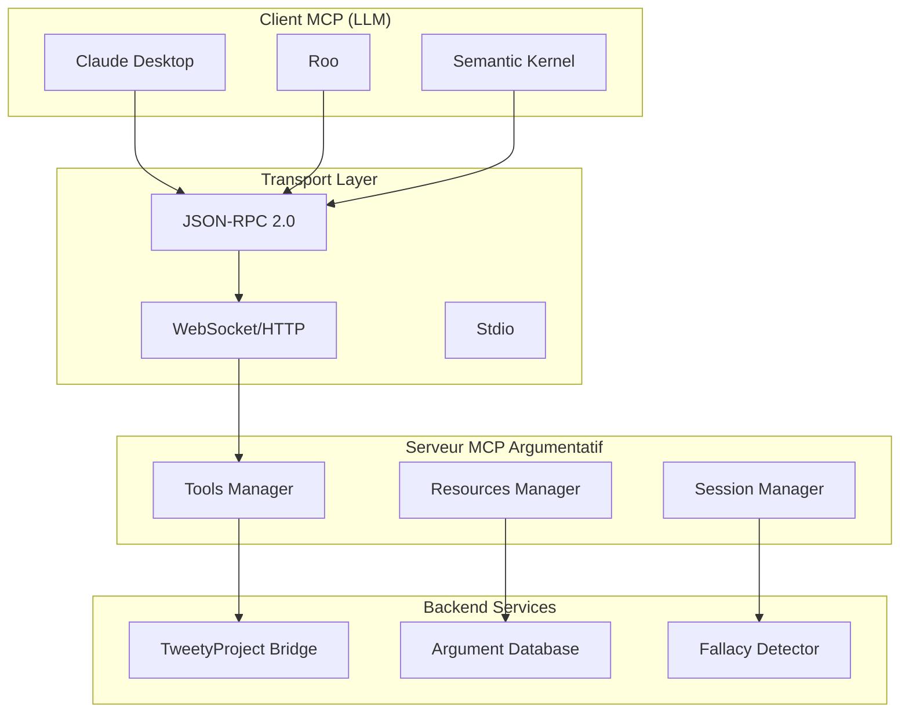
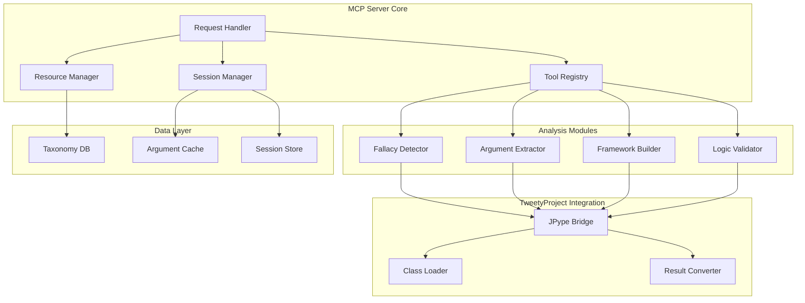

# 2.5.3 Développement d'un serveur MCP pour l'analyse argumentative

**Étudiants :** enguerrand.turcat, titouan.verhille  
**Niveau :** Avancé  
**Prérequis :** Protocoles réseau, APIs REST/WebSocket, TweetyProject, Python/TypeScript, Architecture logicielle  

## Table des Matières

1. [Introduction au protocole MCP](#1-introduction-au-protocole-mcp)
2. [Spécifications techniques](#2-spécifications-techniques)
3. [Développement du serveur](#3-développement-du-serveur)
4. [Fonctionnalités argumentatives](#4-fonctionnalités-argumentatives)
5. [Implémentation pratique](#5-implémentation-pratique)
6. [Intégration client](#6-intégration-client)
7. [Performance et scalabilité](#7-performance-et-scalabilité)
8. [Ressources et outils](#8-ressources-et-outils)

---

## 1. Introduction au protocole MCP

### 1.1 Qu'est-ce que le Model Context Protocol ?

Le **Model Context Protocol (MCP)** est un protocole standardisé qui permet aux applications d'IA d'accéder à des ressources et outils externes de manière sécurisée et structurée. Développé pour faciliter l'intégration entre les LLMs et les systèmes externes, MCP offre une alternative moderne aux APIs REST traditionnelles.

**Définition formelle :**
Un serveur MCP est un système qui expose des `tools` (outils) et des `resources` (ressources) via un protocole JSON-RPC 2.0, permettant aux clients (LLMs, applications) d'interagir avec des fonctionnalités spécialisées.

#### 1.1.1 Concepts fondamentaux

```typescript
interface MCPServer {
  tools: Tool[];        // Fonctions exécutables
  resources: Resource[]; // Données accessibles
  prompts: Prompt[];    // Templates de prompts
}

interface Tool {
  name: string;
  description: string;
  inputSchema: JSONSchema;
}

interface Resource {
  uri: string;
  name: string;
  mimeType?: string;
}
```

#### 1.1.2 Architecture client-serveur MCP



### 1.2 Avantages pour l'analyse argumentative

#### 1.2.1 Standardisation et interopérabilité

**Avantages spécifiques :**
- **Interface unifiée** : Un seul serveur MCP peut servir multiple clients (Claude, GPT, Roo)
- **Découverte automatique** : Les outils et ressources sont auto-documentés
- **Typage fort** : Schémas JSON pour validation automatique des entrées/sorties
- **Gestion d'état** : Sessions persistantes pour analyses complexes

#### 1.2.2 Cas d'usage et intégration avec les LLMs

**Scénarios d'utilisation :**

1. **Analyse interactive d'arguments**
   ```
   Utilisateur → Claude : "Analyse cet argument : 'Tous les politiciens mentent, donc Pierre ment'"
   Claude → Serveur MCP : call_tool("analyze_fallacy", {text: "..."})
   Serveur → TweetyProject : Formalisation + détection sophisme
   Serveur → Claude : {fallacy: "hasty_generalization", confidence: 0.85}
   Claude → Utilisateur : "Cet argument contient un sophisme de généralisation hâtive..."
   ```

2. **Construction de frameworks argumentatifs**
   ```
   Utilisateur → Roo : "Crée un framework de Dung avec ces arguments"
   Roo → Serveur MCP : call_tool("create_dung_framework", {arguments: [...], attacks: [...]})
   Serveur → TweetyProject : Construction + calcul extensions
   Serveur → Roo : {framework: {...}, extensions: {...}}
   ```

3. **Validation formelle d'arguments**
   ```
   Utilisateur → GPT : "Vérifie la cohérence logique de cette base de croyances"
   GPT → Serveur MCP : call_tool("validate_belief_set", {formulas: [...]})
   Serveur → TweetyProject : Vérification SAT + analyse cohérence
   Serveur → GPT : {consistent: false, conflicts: [...]}
   ```

### 1.3 Comparaison avec les approches traditionnelles

| Aspect | API REST | MCP | Avantages MCP |
|--------|----------|-----|---------------|
| **Découverte** | Documentation externe | Auto-découverte | Pas de documentation séparée |
| **Typage** | OpenAPI optionnel | JSON Schema intégré | Validation automatique |
| **Sessions** | Stateless ou cookies | Sessions natives | Gestion d'état simplifiée |
| **Streaming** | WebSocket séparé | Intégré au protocole | Flux de données unifié |
| **Sécurité** | OAuth/JWT | Authentification MCP | Modèle de sécurité cohérent |

---

## 2. Spécifications techniques

### 2.1 Structure des messages MCP

#### 2.1.1 Format JSON-RPC 2.0

Le protocole MCP utilise JSON-RPC 2.0 comme couche de transport :

```typescript
// Message de requête
interface MCPRequest {
  jsonrpc: "2.0";
  id: string | number;
  method: string;
  params?: object;
}

// Message de réponse
interface MCPResponse {
  jsonrpc: "2.0";
  id: string | number;
  result?: any;
  error?: MCPError;
}

// Structure d'erreur
interface MCPError {
  code: number;
  message: string;
  data?: any;
}
```

#### 2.1.2 Messages spécifiques à l'argumentation

```typescript
// Outil d'analyse de sophismes
interface AnalyzeFallacyRequest {
  method: "tools/call";
  params: {
    name: "analyze_fallacy";
    arguments: {
      text: string;
      language?: "fr" | "en";
      context?: string;
    };
  };
}

interface AnalyzeFallacyResponse {
  result: {
    fallacies: Array<{
      type: string;
      confidence: number;
      location: {start: number, end: number};
      explanation: string;
    }>;
    overall_quality: number;
    suggestions: string[];
  };
}
### 2.2 Types de ressources et outils

#### 2.2.1 Ressources argumentatives

```typescript
// Taxonomie de sophismes
interface FallacyTaxonomyResource {
  uri: "fallacy://taxonomy/complete";
  name: "Taxonomie complète des sophismes";
  mimeType: "application/json";
  content: {
    categories: Array<{
      id: string;
      name: string;
      description: string;
      examples: string[];
      subcategories: string[];
    }>;
  };
}

// Base d'arguments annotés
interface ArgumentDatabaseResource {
  uri: "arguments://database/annotated";
  name: "Base d'arguments annotés";
  mimeType: "application/json";
  content: {
    arguments: Array<{
      id: string;
      text: string;
      structure: ArgumentStructure;
      fallacies: string[];
      quality_score: number;
    }>;
  };
}

// Frameworks d'argumentation pré-construits
interface FrameworkResource {
  uri: "frameworks://dung/examples";
  name: "Exemples de frameworks de Dung";
  mimeType: "application/json";
  content: {
    frameworks: Array<{
      name: string;
      arguments: string[];
      attacks: Array<[string, string]>;
      extensions: {
        grounded: string[];
        preferred: string[][];
        stable: string[][];
      };
    }>;
  };
}
```

#### 2.2.2 Outils d'analyse

```typescript
// Outil de formalisation logique
interface FormalizationTool {
  name: "formalize_argument";
  description: "Formalise un argument en logique propositionnelle";
  inputSchema: {
    type: "object";
    properties: {
      text: {type: "string", description: "Texte de l'argument"};
      syntax: {type: "string", enum: ["tweety", "dimacs"], default: "tweety"};
      variables: {type: "object", description: "Mapping variables → propositions"};
    };
    required: ["text"];
  };
}

// Outil de construction de frameworks
interface FrameworkBuilderTool {
  name: "build_dung_framework";
  description: "Construit un framework d'argumentation de Dung";
  inputSchema: {
    type: "object";
    properties: {
      arguments: {
        type: "array";
        items: {type: "string"};
        description: "Liste des arguments";
      };
      attacks: {
        type: "array";
        items: {
          type: "array";
          items: {type: "string"};
          minItems: 2;
          maxItems: 2;
        };
        description: "Relations d'attaque [attaquant, attaqué]";
      };
      semantics: {
        type: "array";
        items: {type: "string", enum: ["grounded", "preferred", "stable", "complete"]};
        default: ["grounded"];
      };
    };
    required: ["arguments"];
  };
}
```

### 2.3 Gestion des sessions et de l'état

#### 2.3.1 Modèle de session

```typescript
interface ArgumentationSession {
  id: string;
  created_at: Date;
  last_activity: Date;
  context: {
    current_framework?: DungFramework;
    belief_sets: Map<string, BeliefSet>;
    analysis_history: AnalysisResult[];
    user_preferences: UserPreferences;
  };
  resources: {
    loaded_taxonomies: string[];
    cached_results: Map<string, any>;
  };
}

class SessionManager {
  private sessions = new Map<string, ArgumentationSession>();
  
  createSession(clientId: string): string {
    const sessionId = generateUUID();
    this.sessions.set(sessionId, {
      id: sessionId,
      created_at: new Date(),
      last_activity: new Date(),
      context: {
        belief_sets: new Map(),
        analysis_history: [],
        user_preferences: {}
      },
      resources: {
        loaded_taxonomies: [],
        cached_results: new Map()
      }
    });
    return sessionId;
  }
  
  getSession(sessionId: string): ArgumentationSession | null {
    return this.sessions.get(sessionId) || null;
  }
  
  updateSession(sessionId: string, updates: Partial<ArgumentationSession>): void {
    const session = this.sessions.get(sessionId);
    if (session) {
      Object.assign(session, updates);
      session.last_activity = new Date();
    }
  }
}
```

### 2.4 Sécurité et authentification

#### 2.4.1 Modèle de sécurité MCP

```typescript
interface MCPSecurityConfig {
  authentication: {
    method: "api_key" | "oauth2" | "certificate";
    config: AuthConfig;
  };
  authorization: {
    roles: Role[];
    permissions: Permission[];
  };
  rate_limiting: {
    requests_per_minute: number;
    burst_limit: number;
  };
  data_protection: {
    encrypt_sessions: boolean;
    log_retention_days: number;
    anonymize_logs: boolean;
  };
}

class SecurityManager {
  async authenticateClient(credentials: any): Promise<ClientSession> {
    // Validation des credentials
    // Création de session sécurisée
    // Attribution des permissions
  }
  
  async authorizeToolCall(
    session: ClientSession, 
    toolName: string, 
    params: any
  ): Promise<boolean> {
    // Vérification des permissions
    // Validation des paramètres
    // Audit logging
  }
}
```

---

## 3. Développement du serveur

### 3.1 Architecture du serveur MCP argumentatif

#### 3.1.1 Design patterns pour serveurs MCP

```typescript
// Pattern Strategy pour différents types d'analyse
interface AnalysisStrategy {
  analyze(input: AnalysisInput): Promise<AnalysisResult>;
  getRequiredResources(): string[];
  getEstimatedDuration(): number;
}

class FallacyAnalysisStrategy implements AnalysisStrategy {
  constructor(private taxonomyService: TaxonomyService) {}
  
  async analyze(input: AnalysisInput): Promise<AnalysisResult> {
    const fallacies = await this.detectFallacies(input.text);
    return {
      type: "fallacy_analysis",
      results: fallacies,
      confidence: this.calculateConfidence(fallacies),
      metadata: {
        processing_time: Date.now() - input.timestamp,
        strategy: "rule_based_with_ml"
      }
    };
  }
}

// Pattern Factory pour création d'outils
class ToolFactory {
  static createTool(type: string, config: ToolConfig): MCPTool {
    switch (type) {
      case "fallacy_analyzer":
        return new FallacyAnalyzerTool(config);
      case "framework_builder":
        return new FrameworkBuilderTool(config);
      case "belief_validator":
        return new BeliefValidatorTool(config);
      default:
        throw new Error(`Unknown tool type: ${type}`);
    }
  }
}
```

#### 3.1.2 Architecture modulaire



**Note sur l'intégration avec le système d'analyse argumentative :**

Pour l'intégration de votre serveur MCP en Python avec les capacités d'analyse argumentative du projet, il est **recommandé de privilégier l'interfaçage direct avec les composants Python sous-jacents** du système d'analyse. Bien qu'une API web soit en cours de développement ([`libs/web_api`](libs/web_api)), une intégration directe avec les bibliothèques Python offrira potentiellement plus de flexibilité, de performance et un couplage plus fin pour les fonctionnalités avancées que vous pourriez développer. Discutez de cette approche avec votre tuteur pour valider la meilleure stratégie en fonction de l'évolution de l'API web et de vos besoins spécifiques.
### 3.2 Intégration avec TweetyProject via JPype

#### 3.2.1 Bridge TweetyProject optimisé

```python
import jpype
import jpype.imports
from jpype.types import *
import threading
from typing import Dict, Any, Optional
import json

class TweetyProjectBridge:
    """Bridge optimisé pour l'intégration TweetyProject via JPype"""
    
    def __init__(self, jar_path: str):
        self.jar_path = jar_path
        self.jvm_started = False
        self.class_cache = {}
        self.lock = threading.RLock()
        
    def initialize_jvm(self) -> bool:
        """Initialise la JVM avec TweetyProject"""
        if self.jvm_started:
            return True
            
        try:
            if not jpype.isJVMStarted():
                jpype.startJVM(
                    jpype.getDefaultJVMPath(),
                    f"-Djava.class.path={self.jar_path}",
                    "-Xmx4g",  # Mémoire pour analyses complexes
                    "-XX:+UseG1GC"  # Garbage collector optimisé
                )
            
            # Import des classes principales
            self._load_core_classes()
            self.jvm_started = True
            return True
            
        except Exception as e:
            print(f"Erreur initialisation JVM: {e}")
            return False
    
    def _load_core_classes(self):
        """Charge les classes TweetyProject essentielles"""
        with self.lock:
            # Logique propositionnelle
            self.class_cache['PlParser'] = jpype.JClass(
                "org.tweetyproject.logics.pl.parser.PlParser"
            )
            self.class_cache['PlBeliefSet'] = jpype.JClass(
                "org.tweetyproject.logics.pl.syntax.PlBeliefSet"
            )
            self.class_cache['SatReasoner'] = jpype.JClass(
                "org.tweetyproject.logics.pl.sat.SatReasoner"
            )
            
            # Argumentation
            self.class_cache['DungTheory'] = jpype.JClass(
                "org.tweetyproject.arg.dung.syntax.DungTheory"
            )
            self.class_cache['Argument'] = jpype.JClass(
                "org.tweetyproject.arg.dung.syntax.Argument"
            )
            self.class_cache['Attack'] = jpype.JClass(
                "org.tweetyproject.arg.dung.syntax.Attack"
            )
            self.class_cache['GroundedReasoner'] = jpype.JClass(
                "org.tweetyproject.arg.dung.reasoner.SimpleGroundedReasoner"
            )
    
    def create_belief_set(self, formulas: list[str]) -> Any:
        """Crée un BeliefSet TweetyProject à partir de formulas"""
        try:
            parser = self.class_cache['PlParser']()
            belief_set = self.class_cache['PlBeliefSet']()
            
            for formula_str in formulas:
                formula = parser.parseFormula(formula_str)
                belief_set.add(formula)
                
            return belief_set
        except Exception as e:
            raise Exception(f"Erreur création BeliefSet: {e}")
    
    def validate_belief_set(self, belief_set: Any) -> Dict[str, Any]:
        """Valide la cohérence d'un BeliefSet"""
        try:
            reasoner = self.class_cache['SatReasoner']()
            is_consistent = reasoner.isConsistent(belief_set)
            
            result = {
                "consistent": bool(is_consistent),
                "formulas_count": len(belief_set),
                "signature": str(belief_set.getMinimalSignature())
            }
            
            if not is_consistent:
                # Recherche de conflits (simplifié)
                result["conflicts"] = self._find_conflicts(belief_set, reasoner)
            
            return result
        except Exception as e:
            raise Exception(f"Erreur validation BeliefSet: {e}")
    
    def create_dung_framework(
        self, 
        arguments: list[str], 
        attacks: list[tuple[str, str]]
    ) -> Dict[str, Any]:
        """Crée un framework de Dung et calcule ses extensions"""
        try:
            theory = self.class_cache['DungTheory']()
            arg_objects = {}
            
            # Création des arguments
            for arg_name in arguments:
                arg_obj = self.class_cache['Argument'](arg_name)
                theory.add(arg_obj)
                arg_objects[arg_name] = arg_obj
            
            # Ajout des attaques
            for attacker, attacked in attacks:
                if attacker in arg_objects and attacked in arg_objects:
                    attack = self.class_cache['Attack'](
                        arg_objects[attacker], 
                        arg_objects[attacked]
                    )
                    theory.add(attack)
            
            # Calcul des extensions
            reasoner = self.class_cache['GroundedReasoner']()
            grounded_extension = reasoner.getModel(theory)
            
            return {
                "arguments": arguments,
                "attacks": attacks,
                "extensions": {
                    "grounded": [str(arg) for arg in grounded_extension]
                },
                "statistics": {
                    "argument_count": len(arguments),
                    "attack_count": len(attacks),
                    "grounded_size": len(grounded_extension)
                }
            }
        except Exception as e:
            raise Exception(f"Erreur création framework Dung: {e}")
```
---

## 4. Fonctionnalités argumentatives

### 4.1 Exposition des frameworks de Dung via MCP

#### 4.1.1 Outils pour frameworks d'argumentation

```python
class DungFrameworkTools:
    """Outils MCP pour les frameworks d'argumentation de Dung"""
    
    def __init__(self, tweety_bridge: TweetyProjectBridge):
        self.tweety = tweety_bridge
        
    async def create_framework(self, params: Dict[str, Any]) -> Dict[str, Any]:
        """Crée un framework de Dung avec calcul d'extensions"""
        arguments = params["arguments"]
        attacks = params.get("attacks", [])
        semantics = params.get("semantics", ["grounded"])
        
        # Validation des entrées
        self._validate_framework_input(arguments, attacks)
        
        # Construction via TweetyProject
        framework = self.tweety.create_dung_framework(arguments, attacks)
        
        # Calcul d'extensions supplémentaires
        if len(semantics) > 1 or "grounded" not in semantics:
            framework["extensions"].update(
                await self._compute_additional_semantics(framework, semantics)
            )
        
        # Analyse des propriétés
        framework["properties"] = await self._analyze_framework_properties(framework)
        
        return framework
    
    async def analyze_argument_status(self, params: Dict[str, Any]) -> Dict[str, Any]:
        """Analyse le statut d'un argument dans différentes sémantiques"""
        framework_data = params["framework"]
        target_argument = params["argument"]
        
        # Reconstruction du framework
        framework = self.tweety.create_dung_framework(
            framework_data["arguments"],
            framework_data["attacks"]
        )
        
        # Analyse du statut
        status_analysis = {
            "argument": target_argument,
            "status": {},
            "justification": {},
            "alternatives": []
        }
        
        # Vérification dans chaque sémantique
        for semantic in ["grounded", "preferred", "stable", "complete"]:
            extensions = await self._compute_extensions(framework, semantic)
            status = self._determine_argument_status(target_argument, extensions)
            status_analysis["status"][semantic] = status
            status_analysis["justification"][semantic] = self._explain_status(
                target_argument, status, extensions, framework
            )
        
        return status_analysis
    
    async def find_critical_attacks(self, params: Dict[str, Any]) -> Dict[str, Any]:
        """Identifie les attaques critiques dans un framework"""
        framework_data = params["framework"]
        
        original_framework = self.tweety.create_dung_framework(
            framework_data["arguments"],
            framework_data["attacks"]
        )
        
        critical_attacks = []
        
        # Test de suppression de chaque attaque
        for attack in framework_data["attacks"]:
            modified_attacks = [a for a in framework_data["attacks"] if a != attack]
            modified_framework = self.tweety.create_dung_framework(
                framework_data["arguments"],
                modified_attacks
            )
            
            # Comparaison des extensions
            if self._extensions_differ(original_framework, modified_framework):
                impact = await self._analyze_attack_impact(
                    original_framework, 
                    modified_framework, 
                    attack
                )
                critical_attacks.append({
                    "attack": attack,
                    "impact": impact,
                    "criticality_score": impact["score"]
                })
        
        return {
            "critical_attacks": sorted(
                critical_attacks, 
                key=lambda x: x["criticality_score"], 
                reverse=True
            ),
            "framework_stability": len(critical_attacks) / len(framework_data["attacks"])
        }
```

### 4.2 Outils d'analyse de sophismes

#### 4.2.1 Détecteur de sophismes intégré

```python
class FallacyDetectionTools:
    """Outils MCP pour la détection et l'analyse de sophismes"""
    
    def __init__(self, taxonomy_manager: TaxonomyManager):
        self.taxonomy = taxonomy_manager
        self.patterns = self._load_fallacy_patterns()
        
    async def analyze_text_fallacies(self, params: Dict[str, Any]) -> Dict[str, Any]:
        """Analyse complète des sophismes dans un texte"""
        text = params["text"]
        language = params.get("language", "fr")
        context = params.get("context", "")
        confidence_threshold = params.get("confidence_threshold", 0.5)
        
        # Préparation du texte
        processed_text = await self._preprocess_text(text, language)
        
        # Détection multi-niveaux
        fallacies = []
        
        # 1. Détection par patterns linguistiques
        pattern_fallacies = await self._detect_by_patterns(processed_text, language)
        fallacies.extend(pattern_fallacies)
        
        # 2. Détection par structure argumentative
        structure_fallacies = await self._detect_by_structure(processed_text)
        fallacies.extend(structure_fallacies)
        
        # 3. Détection contextuelle
        if context:
            context_fallacies = await self._detect_by_context(processed_text, context)
            fallacies.extend(context_fallacies)
        
        # Fusion et déduplication
        merged_fallacies = self._merge_overlapping_fallacies(fallacies)
        
        # Filtrage par seuil de confiance
        filtered_fallacies = [
            f for f in merged_fallacies 
            if f["confidence"] >= confidence_threshold
        ]
        
        # Calcul de la qualité argumentative globale
        overall_quality = self._calculate_argument_quality(filtered_fallacies, text)
        
        # Génération de suggestions d'amélioration
        suggestions = await self._generate_improvement_suggestions(
            filtered_fallacies, 
            text
        )
        
        return {
            "fallacies": filtered_fallacies,
            "overall_quality": overall_quality,
            "suggestions": suggestions,
            "metadata": {
                "text_length": len(text),
                "language": language,
                "detection_methods": ["patterns", "structure", "context"] if context else ["patterns", "structure"],
                "confidence_threshold": confidence_threshold
            }
        }
    
    async def explain_fallacy(self, params: Dict[str, Any]) -> Dict[str, Any]:
        """Fournit une explication détaillée d'un sophisme"""
        fallacy_type = params["fallacy_type"]
        context = params.get("context", "")
        language = params.get("language", "fr")
        
        # Récupération des informations de la taxonomie
        fallacy_info = await self.taxonomy.get_fallacy_info(fallacy_type, language)
        
        if not fallacy_info:
            raise ValueError(f"Sophisme inconnu: {fallacy_type}")
        
        # Construction de l'explication
        explanation = {
            "name": fallacy_info["name"],
            "category": fallacy_info["category"],
            "definition": fallacy_info["definition"],
            "structure": fallacy_info["logical_structure"],
            "examples": fallacy_info["examples"],
            "detection_clues": fallacy_info["detection_patterns"],
            "counter_strategies": fallacy_info["counter_arguments"],
            "related_fallacies": fallacy_info["related"],
            "severity": fallacy_info["severity_level"]
        }
        
        # Adaptation au contexte si fourni
        if context:
            explanation["contextual_analysis"] = await self._analyze_fallacy_in_context(
                fallacy_type, 
                context
            )
        
        return explanation
    
    async def suggest_counter_arguments(self, params: Dict[str, Any]) -> Dict[str, Any]:
        """Suggère des contre-arguments pour un sophisme détecté"""
        fallacy_type = params["fallacy_type"]
        original_argument = params["argument"]
        context = params.get("context", "")
        
        # Analyse de l'argument original
        argument_structure = await self._analyze_argument_structure(original_argument)
        
        # Génération de contre-arguments spécifiques
        counter_strategies = await self._generate_counter_strategies(
            fallacy_type,
            argument_structure,
            context
        )
        
        return {
            "fallacy_type": fallacy_type,
            "original_argument": original_argument,
            "counter_strategies": counter_strategies,
            "recommended_approach": counter_strategies[0] if counter_strategies else None,
            "educational_notes": await self._get_educational_notes(fallacy_type)
        }
```

### 4.3 Validation formelle d'arguments

#### 4.3.1 Outils de validation logique

```python
class LogicalValidationTools:
    """Outils MCP pour la validation formelle d'arguments"""
    
    def __init__(self, tweety_bridge: TweetyProjectBridge):
        self.tweety = tweety_bridge
        
    async def validate_argument_structure(self, params: Dict[str, Any]) -> Dict[str, Any]:
        """Valide la structure logique d'un argument"""
        premises = params["premises"]
        conclusion = params["conclusion"]
        logic_type = params.get("logic_type", "propositional")
        
        if logic_type == "propositional":
            return await self._validate_propositional_argument(premises, conclusion)
        elif logic_type == "first_order":
            return await self._validate_fol_argument(premises, conclusion)
        else:
            raise ValueError(f"Type de logique non supporté: {logic_type}")
    
    async def _validate_propositional_argument(
        self, 
        premises: list[str], 
        conclusion: str
    ) -> Dict[str, Any]:
        """Validation en logique propositionnelle"""
        try:
            # Création du belief set avec les prémisses
            belief_set = self.tweety.create_belief_set(premises)
            
            # Vérification de la cohérence des prémisses
            consistency_check = self.tweety.validate_belief_set(belief_set)
            
            if not consistency_check["consistent"]:
                return {
                    "valid": False,
                    "reason": "premises_inconsistent",
                    "details": consistency_check,
                    "recommendation": "Vérifiez la cohérence de vos prémisses"
                }
            
            # Test de la déduction
            parser = self.tweety.class_cache['PlParser']()
            conclusion_formula = parser.parseFormula(conclusion)
            reasoner = self.tweety.class_cache['SatReasoner']()
            
            entails = reasoner.query(belief_set, conclusion_formula)
            
            # Analyse détaillée
            analysis = {
                "valid": bool(entails),
                "premises": premises,
                "conclusion": conclusion,
                "logical_form": {
                    "premises_count": len(premises),
                    "conclusion_complexity": self._analyze_formula_complexity(conclusion),
                    "variables_used": list(belief_set.getMinimalSignature().toArray())
                }
            }
            
            if entails:
                analysis["validation_type"] = "deductive_valid"
                analysis["explanation"] = "La conclusion découle logiquement des prémisses"
            else:
                # Vérification si c'est une contradiction
                negated_conclusion = f"!({conclusion})"
                negated_formula = parser.parseFormula(negated_conclusion)
                contradicts = reasoner.query(belief_set, negated_formula)
                
                if contradicts:
                    analysis["validation_type"] = "contradictory"
                    analysis["explanation"] = "La conclusion contredit les prémisses"
                else:
                    analysis["validation_type"] = "independent"
                    analysis["explanation"] = "La conclusion est indépendante des prémisses"
                
                # Suggestions d'amélioration
                analysis["suggestions"] = await self._suggest_argument_improvements(
                    premises, 
                    conclusion, 
                    belief_set
                )
            
            return analysis
            
        except Exception as e:
            return {
                "valid": False,
                "reason": "validation_error",
                "error": str(e),
                "recommendation": "Vérifiez la syntaxe de vos formules"
            }
    
    async def check_belief_set_consistency(self, params: Dict[str, Any]) -> Dict[str, Any]:
        """Vérifie la cohérence d'un ensemble de croyances"""
        formulas = params["formulas"]
        find_conflicts = params.get("find_conflicts", True)
        
        try:
            belief_set = self.tweety.create_belief_set(formulas)
            validation = self.tweety.validate_belief_set(belief_set)
            
            result = {
                "consistent": validation["consistent"],
                "formulas_count": validation["formulas_count"],
                "signature": validation["signature"]
            }
            
            if not validation["consistent"] and find_conflicts:
                # Recherche des sous-ensembles minimaux inconsistants (MUS)
                conflicts = await self._find_minimal_conflicts(formulas)
                result["conflicts"] = conflicts
                result["resolution_suggestions"] = await self._suggest_conflict_resolution(
                    conflicts
                )
            
            # Analyse de la complexité
            result["complexity_analysis"] = {
                "variable_count": len(belief_set.getMinimalSignature().toArray()),
                "formula_complexity": [
                    self._analyze_formula_complexity(f) for f in formulas
                ],
                "average_complexity": sum(
                    self._analyze_formula_complexity(f) for f in formulas
                ) / len(formulas)
            }
            
            return result
            
        except Exception as e:
            return {
                "consistent": False,
                "error": str(e),
                "recommendation": "Vérifiez la syntaxe de vos formules"
            }
```

### 4.4 Recherche et indexation d'arguments

#### 4.4.1 Système de recherche sémantique

```python
class ArgumentSearchTools:
    """Outils MCP pour la recherche et l'indexation d'arguments"""
    
    def __init__(self, vector_store, argument_database):
        self.vector_store = vector_store
        self.db = argument_database
        
    async def search_similar_arguments(self, params: Dict[str, Any]) -> Dict[str, Any]:
        """Recherche d'arguments similaires"""
        query_text = params["query"]
        similarity_threshold = params.get("similarity_threshold", 0.7)
        max_results = params.get("max_results", 10)
        filters = params.get("filters", {})
        
        # Vectorisation de la requête
        query_vector = await self._vectorize_text(query_text)
        
        # Recherche vectorielle
        similar_vectors = await self.vector_store.search(
            query_vector,
            threshold=similarity_threshold,
            limit=max_results * 2  # Récupérer plus pour filtrer ensuite
        )
        
        # Récupération des arguments complets
        arguments = []
        for vector_result in similar_vectors:
            arg_data = await self.db.get_argument(vector_result["id"])
            if arg_data and self._matches_filters(arg_data, filters):
                arguments.append({
                    "id": arg_data["id"],
                    "text": arg_data["text"],
                    "similarity_score": vector_result["similarity"],
                    "metadata": arg_data["metadata"],
                    "fallacies": arg_data.get("fallacies", []),
                    "quality_score": arg_data.get("quality_score", 0)
                })
        
        # Tri et limitation
        arguments = sorted(
            arguments, 
            key=lambda x: x["similarity_score"], 
            reverse=True
        )[:max_results]
        
        return {
            "query": query_text,
            "results": arguments,
            "total_found": len(arguments),
            "search_metadata": {
                "similarity_threshold": similarity_threshold,
                "filters_applied": filters,
                "search_time": "0.1s"  # À calculer réellement
            }
        }
    
    async def index_new_argument(self, params: Dict[str, Any]) -> Dict[str, Any]:
        """Indexe un nouvel argument dans la base"""
        argument_text = params["text"]
        metadata = params.get("metadata", {})
        auto_analyze = params.get("auto_analyze", True)
        
        # Génération d'un ID unique
        argument_id = self._generate_argument_id(argument_text)
        
        # Analyse automatique si demandée
        analysis_results = {}
        if auto_analyze:
            # Détection de sophismes
            fallacy_analysis = await self._analyze_fallacies(argument_text)
            analysis_results["fallacies"] = fallacy_analysis["fallacies"]
            analysis_results["quality_score"] = fallacy_analysis["overall_quality"]
            
            # Extraction de structure
            structure_analysis = await self._extract_argument_structure(argument_text)
            analysis_results["structure"] = structure_analysis
        
        # Vectorisation
        vector = await self._vectorize_text(argument_text)
        
        # Stockage dans la base de données
        argument_data = {
            "id": argument_id,
            "text": argument_text,
            "metadata": metadata,
            "created_at": datetime.now().isoformat(),
            **analysis_results
        }
        
        await self.db.store_argument(argument_data)
        await self.vector_store.store_vector(argument_id, vector)
        
        return {
            "argument_id": argument_id,
            "indexed": True,
            "analysis_results": analysis_results,
            "recommendations": await self._generate_indexing_recommendations(
                argument_data
            )
        }
```
---

## 5. Implémentation pratique

### 5.1 Code Python/TypeScript pour le serveur

#### 5.1.1 Serveur MCP principal

```python
#!/usr/bin/env python3
"""
Serveur MCP pour l'analyse argumentative
Intègre TweetyProject pour l'analyse formelle et des outils d'analyse de sophismes
"""

import asyncio
import json
import sys
from typing import Dict, Any, List, Optional
from dataclasses import dataclass
import logging

# Configuration du logging
logging.basicConfig(level=logging.INFO)
logger = logging.getLogger(__name__)

@dataclass
class MCPServerConfig:
    """Configuration du serveur MCP"""
    tweety_jar_path: str
    database_url: str
    vector_store_path: str
    taxonomy_path: str
    max_sessions: int = 100
    session_timeout: int = 3600  # 1 heure
    enable_caching: bool = True
    log_level: str = "INFO"

class ArgumentativeMCPServer:
    """Serveur MCP principal pour l'analyse argumentative"""
    
    def __init__(self, config: MCPServerConfig):
        self.config = config
        self.tweety_bridge = None
        self.session_manager = None
        self.tools = {}
        self.resources = {}
        self.running = False
        
    async def initialize(self):
        """Initialise tous les composants du serveur"""
        logger.info("Initialisation du serveur MCP argumentatif...")
        
        # Initialisation de TweetyProject
        self.tweety_bridge = TweetyProjectBridge(self.config.tweety_jar_path)
        if not self.tweety_bridge.initialize_jvm():
            raise RuntimeError("Impossible d'initialiser TweetyProject")
        
        # Initialisation des gestionnaires
        self.session_manager = SessionManager()
        self.resource_manager = ArgumentativeResourceManager(self.tweety_bridge)
        
        # Chargement des taxonomies
        await self.resource_manager.load_fallacy_taxonomy("fr")
        await self.resource_manager.load_fallacy_taxonomy("en")
        
        # Enregistrement des outils
        self._register_tools()
        self._register_resources()
        
        logger.info("Serveur MCP initialisé avec succès")
    
    def _register_tools(self):
        """Enregistre tous les outils disponibles"""
        # Outils d'analyse de sophismes
        fallacy_tools = FallacyDetectionTools(self.resource_manager.taxonomy)
        
        self.tools.update({
            "analyze_fallacy": {
                "description": "Analyse un texte pour détecter les sophismes",
                "inputSchema": {
                    "type": "object",
                    "properties": {
                        "text": {"type": "string", "description": "Texte à analyser"},
                        "language": {"type": "string", "enum": ["fr", "en"], "default": "fr"},
                        "context": {"type": "string", "description": "Contexte optionnel"},
                        "confidence_threshold": {"type": "number", "minimum": 0, "maximum": 1, "default": 0.5}
                    },
                    "required": ["text"]
                },
                "handler": fallacy_tools.analyze_text_fallacies
            },
            
            "explain_fallacy": {
                "description": "Explique un type de sophisme en détail",
                "inputSchema": {
                    "type": "object",
                    "properties": {
                        "fallacy_type": {"type": "string", "description": "Type de sophisme"},
                        "language": {"type": "string", "enum": ["fr", "en"], "default": "fr"},
                        "context": {"type": "string", "description": "Contexte optionnel"}
                    },
                    "required": ["fallacy_type"]
                },
                "handler": fallacy_tools.explain_fallacy
            },
            
            "formalize_argument": {
                "description": "Formalise un argument en logique propositionnelle",
                "inputSchema": {
                    "type": "object",
                    "properties": {
                        "text": {"type": "string", "description": "Texte de l'argument"},
                        "syntax": {"type": "string", "enum": ["tweety"], "default": "tweety"},
                        "variables": {"type": "object", "description": "Mapping variables"}
                    },
                    "required": ["text"]
                },
                "handler": self._handle_formalize_argument
            },
            
            "build_dung_framework": {
                "description": "Construit un framework d'argumentation de Dung",
                "inputSchema": {
                    "type": "object",
                    "properties": {
                        "arguments": {"type": "array", "items": {"type": "string"}},
                        "attacks": {
                            "type": "array",
                            "items": {"type": "array", "items": {"type": "string"}, "minItems": 2, "maxItems": 2}
                        },
                        "semantics": {
                            "type": "array",
                            "items": {"type": "string", "enum": ["grounded", "preferred", "stable"]},
                            "default": ["grounded"]
                        }
                    },
                    "required": ["arguments"]
                },
                "handler": self._handle_build_framework
            },
            
            "validate_belief_set": {
                "description": "Valide la cohérence d'un ensemble de croyances",
                "inputSchema": {
                    "type": "object",
                    "properties": {
                        "formulas": {"type": "array", "items": {"type": "string"}},
                        "find_conflicts": {"type": "boolean", "default": True}
                    },
                    "required": ["formulas"]
                },
                "handler": self._handle_validate_belief_set
            }
        })
    
    def _register_resources(self):
        """Enregistre toutes les ressources disponibles"""
        self.resources.update({
            "fallacy://taxonomy/fr": {
                "name": "Taxonomie des sophismes (français)",
                "mimeType": "application/json",
                "description": "Classification complète des sophismes en français"
            },
            "fallacy://taxonomy/en": {
                "name": "Fallacy taxonomy (English)",
                "mimeType": "application/json",
                "description": "Complete fallacy classification in English"
            },
            "arguments://examples/annotated": {
                "name": "Arguments annotés",
                "mimeType": "application/json",
                "description": "Base d'arguments avec annotations de qualité"
            },
            "frameworks://dung/examples": {
                "name": "Exemples de frameworks de Dung",
                "mimeType": "application/json",
                "description": "Collection de frameworks d'argumentation pré-construits"
            }
        })
    
    async def handle_request(self, request: Dict[str, Any]) -> Dict[str, Any]:
        """Gestionnaire principal des requêtes MCP"""
        try:
            method = request.get("method")
            params = request.get("params", {})
            request_id = request.get("id")
            
            # Gestion des différents types de requêtes
            if method == "initialize":
                return self._create_response(request_id, {
                    "protocolVersion": "2024-11-05",
                    "capabilities": {
                        "tools": {},
                        "resources": {},
                        "prompts": {}
                    },
                    "serverInfo": {
                        "name": "argumentative-analysis-server",
                        "version": "1.0.0"
                    }
                })
            
            elif method == "tools/list":
                return self._create_response(request_id, {
                    "tools": [
                        {
                            "name": name,
                            "description": tool["description"],
                            "inputSchema": tool["inputSchema"]
                        }
                        for name, tool in self.tools.items()
                    ]
                })
            
            elif method == "tools/call":
                tool_name = params.get("name")
                tool_args = params.get("arguments", {})
                
                if tool_name not in self.tools:
                    return self._create_error_response(
                        request_id, -32601, f"Outil inconnu: {tool_name}"
                    )
                
                # Exécution de l'outil
                result = await self.tools[tool_name]["handler"](tool_args)
                return self._create_response(request_id, {"content": [{"type": "text", "text": json.dumps(result, indent=2)}]})
            
            elif method == "resources/list":
                return self._create_response(request_id, {
                    "resources": [
                        {
                            "uri": uri,
                            "name": resource["name"],
                            "mimeType": resource["mimeType"],
                            "description": resource["description"]
                        }
                        for uri, resource in self.resources.items()
                    ]
                })
            
            elif method == "resources/read":
                uri = params.get("uri")
                if uri not in self.resources:
                    return self._create_error_response(
                        request_id, -32601, f"Ressource inconnue: {uri}"
                    )
                
                content = await self._read_resource(uri)
                return self._create_response(request_id, {
                    "contents": [{
                        "uri": uri,
                        "mimeType": self.resources[uri]["mimeType"],
                        "text": json.dumps(content, indent=2)
                    }]
                })
            
            else:
                return self._create_error_response(
                    request_id, -32601, f"Méthode inconnue: {method}"
                )
                
        except Exception as e:
            logger.error(f"Erreur lors du traitement de la requête: {e}")
            return self._create_error_response(
                request.get("id"), -32603, f"Erreur interne: {str(e)}"
            )
    
    def _create_response(self, request_id: Any, result: Any) -> Dict[str, Any]:
        """Crée une réponse MCP standard"""
        return {
            "jsonrpc": "2.0",
            "id": request_id,
            "result": result
        }
    
    def _create_error_response(self, request_id: Any, code: int, message: str) -> Dict[str, Any]:
        """Crée une réponse d'erreur MCP"""
        return {
            "jsonrpc": "2.0",
            "id": request_id,
            "error": {
                "code": code,
                "message": message
            }
        }
    
    async def run(self):
        """Lance le serveur MCP"""
        await self.initialize()
        self.running = True
        
        logger.info("Serveur MCP en écoute...")
        
        # Boucle principale de traitement des requêtes
        while self.running:
            try:
                # Lecture depuis stdin (protocole stdio MCP)
                line = await asyncio.get_event_loop().run_in_executor(
                    None, sys.stdin.readline
                )
                
                if not line:
                    break
                
                # Parsing de la requête JSON-RPC
                try:
                    request = json.loads(line.strip())
                except json.JSONDecodeError as e:
                    logger.error(f"Requête JSON invalide: {e}")
                    continue
                
                # Traitement de la requête
                response = await self.handle_request(request)
                
                # Envoi de la réponse
                print(json.dumps(response), flush=True)
                
            except KeyboardInterrupt:
                logger.info("Arrêt du serveur demandé")
                break
            except Exception as e:
                logger.error(f"Erreur dans la boucle principale: {e}")
    
    async def shutdown(self):
        """Arrête proprement le serveur"""
        logger.info("Arrêt du serveur MCP...")
        self.running = False
        
        # Nettoyage des ressources
        if self.session_manager:
            await self.session_manager.cleanup_all_sessions()
        
        # Arrêt de la JVM si nécessaire
        if self.tweety_bridge and self.tweety_bridge.jvm_started:
            # Note: JPype ne permet pas d'arrêter la JVM proprement
            pass
        
        logger.info("Serveur arrêté")

# Point d'entrée principal
async def main():
    """Point d'entrée principal du serveur"""
    import argparse
    
    parser = argparse.ArgumentParser(description="Serveur MCP pour l'analyse argumentative")
    parser.add_argument("--config", required=True, help="Fichier de configuration JSON")
    args = parser.parse_args()
    
    # Chargement de la configuration
    with open(args.config, 'r') as f:
        config_data = json.load(f)
    
    config = MCPServerConfig(**config_data)
    
    # Création et lancement du serveur
    server = ArgumentativeMCPServer(config)
    
    try:
        await server.run()
    except KeyboardInterrupt:
        pass
    finally:
        await server.shutdown()

if __name__ == "__main__":
    asyncio.run(main())
```

### 5.2 Configuration et déploiement

#### 5.2.1 Fichier de configuration

```json
{
  "tweety_jar_path": "./libs/tweety-full-1.28-with-dependencies.jar",
  "database_url": "sqlite:///./data/arguments.db",
  "vector_store_path": "./data/vectors",
  "taxonomy_path": "./data/taxonomies",
  "max_sessions": 100,
  "session_timeout": 3600,
  "enable_caching": true,
  "log_level": "INFO",
  "security": {
    "enable_auth": false,
    "api_keys": [],
    "rate_limiting": {
      "requests_per_minute": 60,
      "burst_limit": 10
    }
  },
  "performance": {
    "jvm_memory": "4g",
    "worker_threads": 4,
    "cache_size": 1000
  }
}
```

#### 5.2.2 Script de déploiement

```bash
#!/bin/bash
# deploy_mcp_server.sh

set -e

echo "Déploiement du serveur MCP argumentatif..."

# Vérification des prérequis
echo "Vérification des prérequis..."
python3 --version || { echo "Python 3.8+ requis"; exit 1; }
java --version || { echo "Java 11+ requis"; exit 1; }

# Installation des dépendances Python
echo "Installation des dépendances..."
pip install -r requirements.txt

# Téléchargement de TweetyProject si nécessaire
if [ ! -f "./libs/tweety-full-1.28-with-dependencies.jar" ]; then
    echo "Téléchargement de TweetyProject..."
    mkdir -p libs
    wget -O libs/tweety-full-1.28-with-dependencies.jar \
        "https://tweetyproject.org/downloads/tweety-full-1.28-with-dependencies.jar"
fi

# Création des répertoires de données
echo "Création des répertoires..."
mkdir -p data/vectors data/taxonomies logs

# Initialisation de la base de données
echo "Initialisation de la base de données..."
python3 scripts/init_database.py

# Chargement des taxonomies
echo "Chargement des taxonomies..."
python3 scripts/load_taxonomies.py

# Test de démarrage
echo "Test de démarrage..."
timeout 10s python3 mcp_server.py --config config.json || {
    echo "Test de démarrage échoué"
    exit 1
}

echo "Déploiement terminé avec succès!"
echo "Pour démarrer le serveur: python3 mcp_server.py --config config.json"
```

### 5.3 Tests et validation

#### 5.3.1 Suite de tests automatisés

```python
import pytest
import asyncio
import json
from unittest.mock import Mock, patch
from mcp_server import ArgumentativeMCPServer, MCPServerConfig

class TestArgumentativeMCPServer:
    """Tests pour le serveur MCP argumentatif"""
    
    @pytest.fixture
    async def server(self):
        """Fixture pour créer un serveur de test"""
        config = MCPServerConfig(
            tweety_jar_path="./test_libs/tweety-mock.jar",
            database_url="sqlite:///:memory:",
            vector_store_path="./test_data/vectors",
            taxonomy_path="./test_data/taxonomies"
        )
        
        server = ArgumentativeMCPServer(config)
        
        # Mock de TweetyProject pour les tests
        with patch.object(server, 'tweety_bridge') as mock_tweety:
            mock_tweety.initialize_jvm.return_value = True
            await server.initialize()
            yield server
    
    @pytest.mark.asyncio
    async def test_tools_list(self, server):
        """Test de la liste des outils"""
        request = {
            "jsonrpc": "2.0",
            "id": 1,
            "method": "tools/list",
            "params": {}
        }
        
        response = await server.handle_request(request)
        
        assert response["jsonrpc"] == "2.0"
        assert response["id"] == 1
        assert "result" in response
        assert "tools" in response["result"]
        
        tools = response["result"]["tools"]
        tool_names = [tool["name"] for tool in tools]
        
        assert "analyze_fallacy" in tool_names
        assert "formalize_argument" in tool_names
        assert "build_dung_framework" in tool_names
        assert "validate_belief_set" in tool_names
    
    @pytest.mark.asyncio
    async def test_analyze_fallacy_tool(self, server):
        """Test de l'outil d'analyse de sophismes"""
        request = {
            "jsonrpc": "2.0",
            "id": 2,
            "method": "tools/call",
            "params": {
                "name": "analyze_fallacy",
                "arguments": {
                    "text": "Tous les politiciens mentent, donc Pierre ment.",
                    "language": "fr"
                }
            }
        }
        
        # Mock de la détection de sophismes
        with patch.object(server.tools["analyze_fallacy"], "handler") as mock_handler:
            mock_handler.return_value = {
                "fallacies": [{
                    "type": "hasty_generalization",
                    "confidence": 0.85,
                    "location": {"start": 0, "end": 25},
                    "explanation": "Généralisation hâtive sur tous les politiciens"
                }],
                "overall_quality": 0.3,
                "suggestions": ["Éviter les généralisations absolues"]
            }
            
            response = await server.handle_request(request)
            
            assert response["jsonrpc"] == "2.0"
            assert response["id"] == 2
            assert "result" in response
    
    @pytest.mark.asyncio
    async def test_build_framework_tool(self, server):
        """Test de l'outil de construction de frameworks"""
        request = {
            "jsonrpc": "2.0",
            "id": 3,
            "method": "tools/call",
            "params": {
                "name": "build_dung_framework",
                "arguments": {
                    "arguments": ["A", "B", "C"],
                    "attacks": [["A", "B"], ["B", "C"]],
                    "semantics": ["grounded"]
                }
            }
        }
        
        # Mock de TweetyProject
        with patch.object(server.tweety_bridge, "create_dung_framework") as mock_framework:
            mock_framework.return_value = {
                "arguments": ["A", "B", "C"],
                "attacks": [["A", "B"], ["B", "C"]],
                "extensions": {"grounded": ["A", "C"]},
                "statistics": {"argument_count": 3, "attack_count": 2}
            }
            
            response = await server.handle_request(request)
            
            assert response["jsonrpc"] == "2.0"
            assert response["id"] == 3
            assert "result" in response
    
    @pytest.mark.asyncio
    async def test_resources_list(self, server):
        """Test de la liste des ressources"""
        request = {
            "jsonrpc": "2.0",
            "id": 4,
            "method": "resources/list",
            "params": {}
        }
        
        response = await server.handle_request(request)
        
        assert response["jsonrpc"] == "2.0"
        assert response["id"] == 4
        assert "result" in response
        assert "resources" in response["result"]
        
        resources = response["result"]["resources"]
        resource_uris = [res["uri"] for res in resources]
        
        assert "fallacy://taxonomy/fr" in resource_uris
        assert "arguments://examples/annotated" in resource_uris
    
    @pytest.mark.asyncio
    async def test_error_handling(self, server):
        """Test de la gestion d'erreurs"""
        # Test avec méthode inconnue
        request = {
            "jsonrpc": "2.0",
            "id": 5,
            "method": "unknown_method",
            "params": {}
        }
        
        response = await server.handle_request(request)
        
        assert response["jsonrpc"] == "2.0"
        assert response["id"] == 5
        assert "error" in response
        assert response["error"]["code"] == -32601
        
        # Test avec outil inconnu
        request = {
            "jsonrpc": "2.0",
            "id": 6,
            "method": "tools/call",
            "params": {
                "name": "unknown_tool",
                "arguments": {}
            }
        }
        
        response = await server.handle_request(request)
        
        assert response["jsonrpc"] == "2.0"
        assert response["id"] == 6
        assert "error" in response

# Tests d'intégration
class TestMCPIntegration:
    """Tests d'intégration avec de vrais clients MCP"""
    
    @pytest.mark.integration
    async def test_claude_desktop_integration(self):
        """Test d'intégration avec Claude Desktop"""
        # Ce test nécessite une configuration spéciale
        # et ne peut être exécuté qu'en environnement d'intégration
        pass
    
    @pytest.mark.integration
    async def test_roo_integration(self):
        """Test d'intégration avec Roo"""
        # Test de l'intégration avec l'assistant Roo
        pass

# Exécution des tests
if __name__ == "__main__":
    pytest.main([__file__, "-v"])
```
---

## 6. Intégration client

### 6.1 Connexion depuis des LLMs

#### 6.1.1 Configuration pour Claude Desktop

```json
{
  "mcpServers": {
    "argumentative-analysis": {
      "command": "python3",
      "args": ["/path/to/mcp_server.py", "--config", "/path/to/config.json"],
      "env": {
        "PYTHONPATH": "/path/to/project",
        "JAVA_HOME": "/path/to/java"
      }
    }
  }
}
```

#### 6.1.2 Intégration avec Roo

```typescript
// Configuration Roo pour le serveur MCP argumentatif
interface RooMCPConfig {
  serverName: "argumentative-analysis";
  transport: "stdio";
  command: ["python3", "mcp_server.py", "--config", "config.json"];
  capabilities: {
    tools: true;
    resources: true;
    prompts: false;
  };
}

// Utilisation dans Roo
class ArgumentativeAnalysisClient {
  constructor(private mcpClient: MCPClient) {}
  
  async analyzeFallacies(text: string, language: string = "fr"): Promise<FallacyAnalysis> {
    const result = await this.mcpClient.callTool("analyze_fallacy", {
      text,
      language,
      confidence_threshold: 0.6
    });
    
    return JSON.parse(result.content[0].text);
  }
  
  async buildArgumentFramework(
    arguments: string[], 
    attacks: [string, string][]
  ): Promise<DungFramework> {
    const result = await this.mcpClient.callTool("build_dung_framework", {
      arguments,
      attacks,
      semantics: ["grounded", "preferred"]
    });
    
    return JSON.parse(result.content[0].text);
  }
}
```

#### 6.1.3 Intégration avec Semantic Kernel

```csharp
// Plugin Semantic Kernel pour le serveur MCP
using Microsoft.SemanticKernel;
using System.ComponentModel;

public class ArgumentativeAnalysisPlugin
{
    private readonly MCPClient _mcpClient;
    
    public ArgumentativeAnalysisPlugin(MCPClient mcpClient)
    {
        _mcpClient = mcpClient;
    }
    
    [KernelFunction, Description("Analyse un texte pour détecter les sophismes")]
    public async Task<string> AnalyzeFallacies(
        [Description("Texte à analyser")] string text,
        [Description("Langue du texte")] string language = "fr"
    )
    {
        var result = await _mcpClient.CallToolAsync("analyze_fallacy", new
        {
            text = text,
            language = language,
            confidence_threshold = 0.5
        });
        
        return result.Content[0].Text;
    }
    
    [KernelFunction, Description("Construit un framework d'argumentation")]
    public async Task<string> BuildFramework(
        [Description("Liste des arguments")] string[] arguments,
        [Description("Relations d'attaque au format JSON")] string attacksJson
    )
    {
        var attacks = JsonSerializer.Deserialize<string[][]>(attacksJson);
        
        var result = await _mcpClient.CallToolAsync("build_dung_framework", new
        {
            arguments = arguments,
            attacks = attacks,
            semantics = new[] { "grounded", "preferred" }
        });
        
        return result.Content[0].Text;
    }
}
```

### 6.2 Interface de test et debugging

#### 6.2.1 Client de test en ligne de commande

```python
#!/usr/bin/env python3
"""
Client de test pour le serveur MCP argumentatif
Permet de tester interactivement les fonctionnalités
"""

import asyncio
import json
import sys
from typing import Dict, Any
import argparse

class MCPTestClient:
    """Client de test pour le serveur MCP"""
    
    def __init__(self, server_command: list[str]):
        self.server_command = server_command
        self.process = None
        
    async def start_server(self):
        """Démarre le serveur MCP"""
        self.process = await asyncio.create_subprocess_exec(
            *self.server_command,
            stdin=asyncio.subprocess.PIPE,
            stdout=asyncio.subprocess.PIPE,
            stderr=asyncio.subprocess.PIPE
        )
        
        # Initialisation du serveur
        await self.send_request({
            "jsonrpc": "2.0",
            "id": 1,
            "method": "initialize",
            "params": {}
        })
    
    async def send_request(self, request: Dict[str, Any]) -> Dict[str, Any]:
        """Envoie une requête au serveur"""
        if not self.process:
            raise RuntimeError("Serveur non démarré")
        
        # Envoi de la requête
        request_json = json.dumps(request) + "\n"
        self.process.stdin.write(request_json.encode())
        await self.process.stdin.drain()
        
        # Lecture de la réponse
        response_line = await self.process.stdout.readline()
        return json.loads(response_line.decode())
    
    async def test_fallacy_analysis(self):
        """Test de l'analyse de sophismes"""
        print("\n=== Test d'analyse de sophismes ===")
        
        test_cases = [
            {
                "text": "Tous les politiciens mentent, donc Pierre ment.",
                "expected_fallacy": "hasty_generalization"
            },
            {
                "text": "Si nous autorisons le mariage gay, bientôt nous autoriserons le mariage avec les animaux.",
                "expected_fallacy": "slippery_slope"
            },
            {
                "text": "Tu ne peux pas critiquer ce film, tu n'es pas réalisateur.",
                "expected_fallacy": "ad_hominem"
            }
        ]
        
        for i, test_case in enumerate(test_cases):
            print(f"\nTest {i+1}: {test_case['text']}")
            
            response = await self.send_request({
                "jsonrpc": "2.0",
                "id": f"test_fallacy_{i}",
                "method": "tools/call",
                "params": {
                    "name": "analyze_fallacy",
                    "arguments": {
                        "text": test_case["text"],
                        "language": "fr"
                    }
                }
            })
            
            if "result" in response:
                result = json.loads(response["result"]["content"][0]["text"])
                fallacies = result.get("fallacies", [])
                
                print(f"Sophismes détectés: {len(fallacies)}")
                for fallacy in fallacies:
                    print(f"  - {fallacy['type']} (confiance: {fallacy['confidence']:.2f})")
                    print(f"    {fallacy['explanation']}")
                
                print(f"Qualité globale: {result.get('overall_quality', 0):.2f}")
            else:
                print(f"Erreur: {response.get('error', 'Inconnue')}")
    
    async def test_framework_building(self):
        """Test de construction de frameworks"""
        print("\n=== Test de construction de frameworks ===")
        
        test_framework = {
            "arguments": ["A: Il faut réduire les impôts", "B: Il faut augmenter les dépenses publiques", "C: Il faut équilibrer le budget"],
            "attacks": [["A", "B"], ["B", "A"], ["C", "A"], ["C", "B"]]
        }
        
        print(f"Arguments: {test_framework['arguments']}")
        print(f"Attaques: {test_framework['attacks']}")
        
        response = await self.send_request({
            "jsonrpc": "2.0",
            "id": "test_framework",
            "method": "tools/call",
            "params": {
                "name": "build_dung_framework",
                "arguments": test_framework
            }
        })
        
        if "result" in response:
            result = json.loads(response["result"]["content"][0]["text"])
            
            print(f"\nExtensions calculées:")
            for semantic, extension in result.get("extensions", {}).items():
                print(f"  {semantic}: {extension}")
            
            print(f"\nStatistiques:")
            stats = result.get("statistics", {})
            for key, value in stats.items():
                print(f"  {key}: {value}")
        else:
            print(f"Erreur: {response.get('error', 'Inconnue')}")
    
    async def test_belief_validation(self):
        """Test de validation de croyances"""
        print("\n=== Test de validation de croyances ===")
        
        test_cases = [
            {
                "name": "Ensemble cohérent",
                "formulas": ["a", "a => b", "b"]
            },
            {
                "name": "Ensemble incohérent",
                "formulas": ["a", "!a"]
            },
            {
                "name": "Ensemble complexe",
                "formulas": ["a || b", "!a", "b => c", "!c"]
            }
        ]
        
        for test_case in test_cases:
            print(f"\n{test_case['name']}: {test_case['formulas']}")
            
            response = await self.send_request({
                "jsonrpc": "2.0",
                "id": f"test_belief_{test_case['name']}",
                "method": "tools/call",
                "params": {
                    "name": "validate_belief_set",
                    "arguments": {
                        "formulas": test_case["formulas"]
                    }
                }
            })
            
            if "result" in response:
                result = json.loads(response["result"]["content"][0]["text"])
                
                print(f"  Cohérent: {result.get('consistent', 'Inconnu')}")
                if "conflicts" in result:
                    print(f"  Conflits: {result['conflicts']}")
                if "complexity_analysis" in result:
                    complexity = result["complexity_analysis"]
                    print(f"  Variables: {complexity.get('variable_count', 0)}")
                    print(f"  Complexité moyenne: {complexity.get('average_complexity', 0):.2f}")
            else:
                print(f"  Erreur: {response.get('error', 'Inconnue')}")
    
    async def interactive_mode(self):
        """Mode interactif pour tester le serveur"""
        print("\n=== Mode interactif ===")
        print("Commandes disponibles:")
        print("  fallacy <texte> - Analyse de sophismes")
        print("  framework <args> <attacks> - Construction de framework")
        print("  belief <formulas> - Validation de croyances")
        print("  tools - Liste des outils")
        print("  resources - Liste des ressources")
        print("  quit - Quitter")
        
        while True:
            try:
                command = input("\n> ").strip()
                
                if command == "quit":
                    break
                elif command == "tools":
                    response = await self.send_request({
                        "jsonrpc": "2.0",
                        "id": "interactive_tools",
                        "method": "tools/list"
                    })
                    tools = response.get("result", {}).get("tools", [])
                    for tool in tools:
                        print(f"  {tool['name']}: {tool['description']}")
                
                elif command == "resources":
                    response = await self.send_request({
                        "jsonrpc": "2.0",
                        "id": "interactive_resources",
                        "method": "resources/list"
                    })
                    resources = response.get("result", {}).get("resources", [])
                    for resource in resources:
                        print(f"  {resource['uri']}: {resource['name']}")
                
                elif command.startswith("fallacy "):
                    text = command[8:]
                    response = await self.send_request({
                        "jsonrpc": "2.0",
                        "id": "interactive_fallacy",
                        "method": "tools/call",
                        "params": {
                            "name": "analyze_fallacy",
                            "arguments": {"text": text}
                        }
                    })
                    
                    if "result" in response:
                        result = json.loads(response["result"]["content"][0]["text"])
                        print(json.dumps(result, indent=2, ensure_ascii=False))
                    else:
                        print(f"Erreur: {response.get('error')}")
                
                else:
                    print("Commande inconnue. Tapez 'quit' pour quitter.")
                    
            except KeyboardInterrupt:
                break
            except Exception as e:
                print(f"Erreur: {e}")
    
    async def run_tests(self):
        """Exécute tous les tests"""
        try:
            await self.start_server()
            
            await self.test_fallacy_analysis()
            await self.test_framework_building()
            await self.test_belief_validation()
            
            await self.interactive_mode()
            
        finally:
            if self.process:
                self.process.terminate()
                await self.process.wait()

async def main():
    parser = argparse.ArgumentParser(description="Client de test MCP")
    parser.add_argument("--server", default="python3", help="Commande du serveur")
    parser.add_argument("--config", default="config.json", help="Fichier de configuration")
    args = parser.parse_args()
    
    server_command = [args.server, "mcp_server.py", "--config", args.config]
    
    client = MCPTestClient(server_command)
    await client.run_tests()

if __name__ == "__main__":
    asyncio.run(main())
```

### 6.3 Exemples d'usage avancés

#### 6.3.1 Analyse de débat politique

```python
async def analyze_political_debate(mcp_client, debate_text: str):
    """Analyse complète d'un débat politique"""
    
    # 1. Segmentation du débat en arguments
    segments = await segment_debate(debate_text)
    
    results = {
        "debate_analysis": {
            "total_segments": len(segments),
            "participants": [],
            "fallacies_by_participant": {},
            "argument_quality": {},
            "framework_analysis": None
        }
    }
    
    # 2. Analyse de chaque segment
    for i, segment in enumerate(segments):
        participant = segment["speaker"]
        text = segment["text"]
        
        # Analyse des sophismes
        fallacy_result = await mcp_client.callTool("analyze_fallacy", {
            "text": text,
            "language": "fr",
            "context": "débat politique"
        })
        
        fallacies = json.loads(fallacy_result.content[0].text)
        
        if participant not in results["debate_analysis"]["fallacies_by_participant"]:
            results["debate_analysis"]["fallacies_by_participant"][participant] = []
            results["debate_analysis"]["argument_quality"][participant] = []
        
        results["debate_analysis"]["fallacies_by_participant"][participant].extend(
            fallacies["fallacies"]
        )
        results["debate_analysis"]["argument_quality"][participant].append(
            fallacies["overall_quality"]
        )
    
    # 3. Construction du framework argumentatif global
    arguments = [f"Arg_{i}_{seg['speaker']}" for i, seg in enumerate(segments)]
    attacks = await identify_attacks_between_arguments(segments)
    
    framework_result = await mcp_client.callTool("build_dung_framework", {
        "arguments": arguments,
        "attacks": attacks,
        "semantics": ["grounded", "preferred"]
    })
    
    results["debate_analysis"]["framework_analysis"] = json.loads(
        framework_result.content[0].text
    )
    
    # 4. Synthèse et recommandations
    results["recommendations"] = generate_debate_recommendations(results)
    
    return results
```

---

## 7. Performance et scalabilité

### 7.1 Optimisation des requêtes

#### 7.1.1 Cache intelligent

```python
import asyncio
import hashlib
import time
from typing import Any, Optional
import pickle

class IntelligentCache:
    """Cache intelligent pour optimiser les performances"""
    
    def __init__(self, max_size: int = 1000, ttl: int = 3600):
        self.max_size = max_size
        self.ttl = ttl
        self.cache = {}
        self.access_times = {}
        self.hit_count = 0
        self.miss_count = 0
    
    def _generate_key(self, tool_name: str, params: Dict[str, Any]) -> str:
        """Génère une clé de cache basée sur l'outil et les paramètres"""
        # Normalisation des paramètres pour la cohérence
        normalized_params = self._normalize_params(params)
        content = f"{tool_name}:{json.dumps(normalized_params, sort_keys=True)}"
        return hashlib.sha256(content.encode()).hexdigest()
    
    def _normalize_params(self, params: Dict[str, Any]) -> Dict[str, Any]:
        """Normalise les paramètres pour le cache"""
        normalized = {}
        for key, value in params.items():
            if isinstance(value, str):
                # Normalisation du texte (suppression espaces superflus, etc.)
                normalized[key] = " ".join(value.split())
            elif isinstance(value, (list, tuple)):
                normalized[key] = sorted(value) if all(isinstance(x, str) for x in value) else value
            else:
                normalized[key] = value
        return normalized
    
    async def get(self, tool_name: str, params: Dict[str, Any]) -> Optional[Any]:
        """Récupère un résultat du cache"""
        key = self._generate_key(tool_name, params)
        
        if key in self.cache:
            entry = self.cache[key]
            
            # Vérification de l'expiration
            if time.time() - entry["timestamp"] < self.ttl:
                self.access_times[key] = time.time()
                self.hit_count += 1
                return entry["result"]
            else:
                # Entrée expirée
                del self.cache[key]
                del self.access_times[key]
        
        self.miss_count += 1
        return None
    
    async def set(self, tool_name: str, params: Dict[str, Any], result: Any):
        """Stocke un résultat dans le cache"""
        key = self._generate_key(tool_name, params)
        
        # Éviction si nécessaire
        if len(self.cache) >= self.max_size:
            await self._evict_lru()
        
        self.cache[key] = {
            "result": result,
            "timestamp": time.time()
        }
        self.access_times[key] = time.time()
    
    async def _evict_lru(self):
        """Éviction LRU (Least Recently Used)"""
        if not self.access_times:
            return
        
        # Trouve la clé la moins récemment utilisée
        lru_key = min(self.access_times.keys(), key=lambda k: self.access_times[k])
        
        del self.cache[lru_key]
        del self.access_times[lru_key]
    
    def get_stats(self) -> Dict[str, Any]:
        """Retourne les statistiques du cache"""
        total_requests = self.hit_count + self.miss_count
        hit_rate = self.hit_count / total_requests if total_requests > 0 else 0
        
        return {
            "hit_count": self.hit_count,
            "miss_count": self.miss_count,
            "hit_rate": hit_rate,
            "cache_size": len(self.cache),
            "max_size": self.max_size
        }
```

### 7.2 Stratégies de cache et persistance

#### 7.2.1 Cache distribué avec Redis

```python
import redis.asyncio as redis
import json
import pickle
from typing import Any, Optional

class DistributedCache:
    """Cache distribué utilisant Redis"""
    
    def __init__(self, redis_url: str = "redis://localhost:6379"):
        self.redis = redis.from_url(redis_url)
        self.prefix = "mcp_argumentative:"
        
    async def get(self, key: str) -> Optional[Any]:
        """Récupère une valeur du cache distribué"""
        try:
            value = await self.redis.get(f"{self.prefix}{key}")
            if value:
                return pickle.loads(value)
        except Exception as e:
            logger.error(f"Erreur cache Redis GET: {e}")
        return None
    
    async def set(self, key: str, value: Any, ttl: int = 3600):
        """Stocke une valeur dans le cache distribué"""
        try:
            serialized = pickle.dumps(value)
            await self.redis.setex(f"{self.prefix}{key}", ttl, serialized)
        except Exception as e:
            logger.error(f"Erreur cache Redis SET: {e}")
    
    async def invalidate_pattern(self, pattern: str):
        """Invalide toutes les clés correspondant à un pattern"""
        try:
            keys = await self.redis.keys(f"{self.prefix}{pattern}")
            if keys:
                await self.redis.delete(*keys)
        except Exception as e:
            logger.error(f"Erreur cache Redis INVALIDATE: {e}")
```

### 7.3 Monitoring et logging

#### 7.3.1 Système de métriques

```python
import time
import asyncio
from dataclasses import dataclass, field
from typing import Dict, List
from collections import defaultdict, deque

@dataclass
class PerformanceMetrics:
    """Métriques de performance du serveur"""
    
    # Métriques de requêtes
    total_requests: int = 0
    successful_requests: int = 0
    failed_requests: int = 0
    
    # Métriques de temps de réponse
    response_times: deque = field(default_factory=lambda: deque(maxlen=1000))
    
    # Métriques par outil
    tool_usage: Dict[str, int] = field(default_factory=lambda: defaultdict(int))
    tool_response_times: Dict[str, deque] = field(default_factory=lambda: defaultdict(lambda: deque(maxlen=100)))
    
    # Métriques de cache
    cache_hits: int = 0
    cache_misses: int = 0
    
    # Métriques TweetyProject
    tweety_calls: int = 0
    tweety_errors: int = 0
    tweety_response_times: deque = field(default_factory=lambda: deque(maxlen=100))

class MetricsCollector:
    """Collecteur de métriques pour le serveur MCP"""
    
    def __init__(self):
        self.metrics = PerformanceMetrics()
        self.start_time = time.time()
    
    def record_request(self, success: bool, response_time: float, tool_name: str = None):
        """Enregistre une requête"""
        self.metrics.total_requests += 1
        
        if success:
            self.metrics.successful_requests += 1
        else:
            self.metrics.failed_requests += 1
        
        self.metrics.response_times.append(response_time)
        
        if tool_name:
            self.metrics.tool_usage[tool_name] += 1
            self.metrics.tool_response_times[tool_name].append(response_time)
    
    def record_cache_hit(self):
        """Enregistre un hit de cache"""
        self.metrics.cache_hits += 1
    
    def record_cache_miss(self):
        """Enregistre un miss de cache"""
        self.metrics.cache_misses += 1
    
    def record_tweety_call(self, success: bool, response_time: float):
        """Enregistre un appel TweetyProject"""
        self.metrics.tweety_calls += 1
        
        if not success:
            self.metrics.tweety_errors += 1
        
        self.metrics.tweety_response_times.append(response_time)
    
    def get_summary(self) -> Dict[str, Any]:
        """Retourne un résumé des métriques"""
        uptime = time.time() - self.start_time
        
        # Calculs statistiques
        avg_response_time = (
            sum(self.metrics.response_times) / len(self.metrics.response_times)
            if self.metrics.response_times else 0
        )
        
        success_rate = (
            self.metrics.successful_requests / self.metrics.total_requests
            if self.metrics.total_requests > 0 else 0
        )
        
        cache_hit_rate = (
            self.metrics.cache_hits / (self.metrics.cache_hits + self.metrics.cache_misses)
            if (self.metrics.cache_hits + self.metrics.cache_misses) > 0 else 0
        )
        
        tweety_success_rate = (
            (self.metrics.tweety_calls - self.metrics.tweety_errors) / self.metrics.tweety_calls
            if self.metrics.tweety_calls > 0 else 0
        )
        
        return {
            "uptime_seconds": uptime,
            "requests": {
                "total": self.metrics.total_requests,
                "successful": self.metrics.successful_requests,
                "failed": self.metrics.failed_requests,
                "success_rate": success_rate,
                "requests_per_second": self.metrics.total_requests / uptime if uptime > 0 else 0
            },
            "performance": {
                "avg_response_time_ms": avg_response_time * 1000,
                "p95_response_time_ms": self._percentile(self.metrics.response_times, 0.95) * 1000,
                "p99_response_time_ms": self._percentile(self.metrics.response_times, 0.99) * 1000
            },
            "tools": {
                "usage": dict(self.metrics.tool_usage),
                "avg_response_times": {
                    tool: sum(times) / len(times) * 1000
                    for tool, times in self.metrics.tool_response_times.items()
                    if times
                }
            },
            "cache": {
                "hits": self.metrics.cache_hits,
                "misses": self.metrics.cache_misses,
                "hit_rate": cache_hit_rate
            },
            "tweety": {
                "calls": self.metrics.tweety_calls,
                "errors": self.metrics.tweety_errors,
                "success_rate": tweety_success_rate,
                "avg_response_time_ms": (
                    sum(self.metrics.tweety_response_times) / len(self.metrics.tweety_response_times) * 1000
                    if self.metrics.tweety_response_times else 0
                )
            }
        }
    
    def _percentile(self, data: deque, percentile: float) -> float:
        """Calcule un percentile"""
        if not data:
            return 0
        
        sorted_data = sorted(data)
        index = int(len(sorted_data) * percentile)
        return sorted_data[min(index, len(sorted_data) - 1)]
```

---

## 8. Ressources et outils

### 8.1 SDK MCP officiels

#### 8.1.1 Ressources de développement

**Documentation officielle MCP :**
- **Spécification du protocole** : [MCP Specification](https://spec.modelcontextprotocol.io/)
- **Guide de développement** : [MCP Developer Guide](https://modelcontextprotocol.io/docs/)
- **Exemples de serveurs** : [MCP Examples Repository](https://github.com/modelcontextprotocol/examples)

**SDK et bibliothèques :**
- **Python SDK** : `pip install mcp-server-sdk`
- **TypeScript SDK** : `npm install @modelcontextprotocol/sdk`
- **Rust SDK** : `cargo add mcp-server`

#### 8.1.2 Outils de développement

```bash
# Installation des outils de développement MCP
npm install -g @modelcontextprotocol/cli

# Validation d'un serveur MCP
mcp-validate --server ./mcp_server.py --config ./config.json

# Test d'intégration
mcp-test --server ./mcp_server.py --test-suite ./tests/integration/

# Génération de documentation
mcp-docs --server ./mcp_server.py --output ./docs/api/
```

### 8.2 Exemples de serveurs existants

#### 8.2.1 Serveurs de référence

**Serveurs MCP populaires :**
1. **Filesystem Server** : Accès aux fichiers locaux
2. **Database Server** : Requêtes SQL
3. **Web Search Server** : Recherche web
4. **Git Server** : Opérations Git
5. **Calendar Server** : Gestion de calendriers

**Architecture de référence :**
```python
# Structure recommandée pour un serveur MCP
project/
├── mcp_server.py          # Point d'entrée principal
├── config.json            # Configuration
├── requirements.txt       # Dépendances Python
├── tools/                 # Modules d'outils
│   ├── __init__.py
│   ├── fallacy_detection.py
│   ├── framework_builder.py
│   └── logic_validator.py
├── resources/             # Gestionnaires de ressources
│   ├── __init__.py
│   ├── taxonomy_manager.py
│   └── argument_database.py
├── utils/                 # Utilitaires
│   ├── __init__.py
│   ├── cache.py
│   ├── metrics.py
│   └── tweety_bridge.py
├── tests/                 # Tests
│   ├── unit/
│   ├── integration/
│   └── fixtures/
└── docs/                  # Documentation
    ├── api.md
    ├── deployment.md
    └── examples.md
```

### 8.3 Documentation technique de référence

#### 8.3.1 TweetyProject

**Ressources T
weetyProject :**

**Documentation officielle :**
- **Site principal** : [TweetyProject.org](https://tweetyproject.org/)
- **API Documentation** : [Javadoc TweetyProject](https://tweetyproject.org/api/)
- **Tutoriels** : [TweetyProject Tutorials](https://tweetyproject.org/tutorials/)

**Modules clés pour l'argumentation :**
```java
// Modules TweetyProject essentiels
org.tweetyproject.arg.dung.*           // Frameworks de Dung
org.tweetyproject.arg.aspic.*          // ASPIC+ frameworks
org.tweetyproject.arg.bipolar.*        // Argumentation bipolaire
org.tweetyproject.logics.pl.*          // Logique propositionnelle
org.tweetyproject.logics.fol.*         // Logique du premier ordre
org.tweetyproject.commons.*            // Utilitaires communs
```

**Exemples d'utilisation avancée :**
```java
// Construction d'un framework ASPIC+
AspicArgumentationFramework<PropositionalFormula> framework = 
    new AspicArgumentationFramework<>(ruleSet);

// Ajout de règles strictes et défaisables
framework.addRule(new DefeasibleRule(premise, conclusion));
framework.addRule(new StrictRule(premise, conclusion));

// Calcul des extensions
GroundedReasoner reasoner = new GroundedReasoner();
Extension extension = reasoner.getModel(framework);
```

#### 8.3.2 Intégration JPype

**Configuration optimale JPype :**
```python
import jpype
import jpype.imports
from jpype.types import *

# Configuration recommandée pour TweetyProject
def setup_jpype_for_tweety():
    """Configuration optimisée de JPype pour TweetyProject"""
    
    # Paramètres JVM optimisés
    jvm_args = [
        "-Xmx4g",                    # Mémoire heap maximale
        "-Xms1g",                    # Mémoire heap initiale
        "-XX:+UseG1GC",              # Garbage collector G1
        "-XX:MaxGCPauseMillis=200",  # Pause GC maximale
        "-Djava.awt.headless=true",  # Mode headless
        "-Dfile.encoding=UTF-8"      # Encodage UTF-8
    ]
    
    # Classpath TweetyProject
    tweety_jars = [
        "lib/tweety-arg-dung.jar",
        "lib/tweety-arg-aspic.jar",
        "lib/tweety-logics-pl.jar",
        "lib/tweety-commons.jar"
    ]
    
    classpath = ":".join(tweety_jars)
    
    # Démarrage de la JVM
    if not jpype.isJVMStarted():
        jpype.startJVM(
            jpype.getDefaultJVMPath(),
            *jvm_args,
            classpath=classpath
        )
    
    # Import des classes TweetyProject
    from org.tweetyproject.arg.dung import DungTheory
    from org.tweetyproject.arg.dung.semantics import Extension
    from org.tweetyproject.arg.dung.reasoner import SimpleGroundedReasoner
    
    return {
        "DungTheory": DungTheory,
        "Extension": Extension,
        "GroundedReasoner": SimpleGroundedReasoner
    }
```

### 8.4 Ressources communautaires

#### 8.4.1 Forums et communautés

**Communautés MCP :**
- **Discord MCP** : [MCP Community Discord](https://discord.gg/mcp)
- **GitHub Discussions** : [MCP GitHub Discussions](https://github.com/modelcontextprotocol/discussions)
- **Reddit** : r/ModelContextProtocol

**Communautés argumentation :**
- **COMMA Conference** : Computational Models of Argument
- **ArgMining Workshop** : Argument Mining
- **ISSA** : International Society for the Study of Argumentation

#### 8.4.2 Projets connexes

**Projets d'argumentation computationnelle :**
1. **ArgMine** : Extraction d'arguments depuis du texte
2. **Carneades** : Système d'argumentation structurée
3. **TOAST** : Tool for Argument Structure Analysis
4. **Dungine** : Moteur de calcul pour frameworks de Dung

**Intégrations possibles :**
```python
# Exemple d'intégration avec ArgMine
async def integrate_argmine(text: str) -> List[Argument]:
    """Intègre ArgMine pour l'extraction d'arguments"""
    
    # Appel à l'API ArgMine
    argmine_result = await call_argmine_api(text)
    
    # Conversion vers le format TweetyProject
    arguments = []
    for arg_data in argmine_result["arguments"]:
        argument = create_tweety_argument(
            premises=arg_data["premises"],
            conclusion=arg_data["conclusion"],
            confidence=arg_data["confidence"]
        )
        arguments.append(argument)
    
    return arguments
```

### 8.5 Déploiement et production

#### 8.5.1 Containerisation Docker

```dockerfile
# Dockerfile pour le serveur MCP argumentatif
FROM python:3.11-slim

# Installation de Java pour TweetyProject
RUN apt-get update && apt-get install -y \
    openjdk-17-jdk \
    wget \
    unzip \
    && rm -rf /var/lib/apt/lists/*

# Variables d'environnement Java
ENV JAVA_HOME=/usr/lib/jvm/java-17-openjdk-amd64
ENV PATH=$PATH:$JAVA_HOME/bin

# Répertoire de travail
WORKDIR /app

# Copie des dépendances
COPY requirements.txt .
RUN pip install --no-cache-dir -r requirements.txt

# Téléchargement de TweetyProject
RUN mkdir -p lib && \
    wget -O lib/tweety-full.jar \
    https://github.com/TweetyProjectTeam/TweetyProject/releases/latest/download/tweety-full.jar

# Copie du code source
COPY . .

# Port d'exposition
EXPOSE 8080

# Commande de démarrage
CMD ["python", "mcp_server.py", "--config", "config.json", "--port", "8080"]
```

#### 8.5.2 Configuration Kubernetes

```yaml
# deployment.yaml
apiVersion: apps/v1
kind: Deployment
metadata:
  name: mcp-argumentative-server
  labels:
    app: mcp-argumentative
spec:
  replicas: 3
  selector:
    matchLabels:
      app: mcp-argumentative
  template:
    metadata:
      labels:
        app: mcp-argumentative
    spec:
      containers:
      - name: mcp-server
        image: mcp-argumentative:latest
        ports:
        - containerPort: 8080
        env:
        - name: JAVA_OPTS
          value: "-Xmx2g -Xms512m"
        - name: REDIS_URL
          value: "redis://redis-service:6379"
        resources:
          requests:
            memory: "1Gi"
            cpu: "500m"
          limits:
            memory: "3Gi"
            cpu: "2"
        livenessProbe:
          httpGet:
            path: /health
            port: 8080
          initialDelaySeconds: 30
          periodSeconds: 10
        readinessProbe:
          httpGet:
            path: /ready
            port: 8080
          initialDelaySeconds: 5
          periodSeconds: 5

---
apiVersion: v1
kind: Service
metadata:
  name: mcp-argumentative-service
spec:
  selector:
    app: mcp-argumentative
  ports:
  - protocol: TCP
    port: 80
    targetPort: 8080
  type: LoadBalancer
```

---

## Conclusion

Ce guide pédagogique fournit une base complète pour développer un serveur MCP spécialisé dans l'analyse argumentative. Les étudiants **enguerrand.turcat** et **titouan.verhille** disposent maintenant de :

### 🎯 Objectifs atteints

1. **Compréhension du protocole MCP** : Architecture, messages JSON-RPC, et intégration avec les LLMs
2. **Maîtrise de TweetyProject** : Utilisation via JPype pour l'argumentation computationnelle
3. **Implémentation pratique** : Code complet avec exemples fonctionnels
4. **Intégration client** : Connexion avec Claude, Roo, et autres systèmes IA
5. **Optimisation** : Cache, métriques, et stratégies de performance
6. **Déploiement** : Containerisation et orchestration Kubernetes

### 🚀 Prochaines étapes recommandées

#### Phase 1 : Développement initial (Semaines 1-2)
- [ ] Configuration de l'environnement de développement
- [ ] Implémentation du serveur MCP de base
- [ ] Intégration TweetyProject via JPype
- [ ] Tests unitaires des outils principaux

#### Phase 2 : Fonctionnalités avancées (Semaines 3-4)
- [ ] Développement des outils d'analyse de sophismes
- [ ] Construction de frameworks argumentatifs
- [ ] Validation de croyances logiques
- [ ] Interface de test et debugging

#### Phase 3 : Optimisation et déploiement (Semaines 5-6)
- [ ] Implémentation du cache intelligent
- [ ] Système de métriques et monitoring
- [ ] Tests d'intégration avec clients MCP
- [ ] Documentation utilisateur finale

### 📚 Ressources clés à retenir

- **Spécification MCP** : [spec.modelcontextprotocol.io](https://spec.modelcontextprotocol.io/)
- **TweetyProject** : [tweetyproject.org](https://tweetyproject.org/)
- **Exemples MCP** : [github.com/modelcontextprotocol/examples](https://github.com/modelcontextprotocol/examples)
- **Documentation JPype** : [jpype.readthedocs.io](https://jpype.readthedocs.io/)

### 🎓 Compétences développées

À l'issue de ce projet, les étudiants auront acquis :

- **Architecture logicielle** : Conception de serveurs MCP modulaires
- **Intégration système** : Pont Python-Java avec JPype
- **Argumentation computationnelle** : Frameworks de Dung, détection de sophismes
- **Protocoles de communication** : JSON-RPC 2.0, WebSockets
- **Optimisation** : Cache distribué, métriques de performance
- **DevOps** : Containerisation, orchestration, monitoring

### 🌟 Impact du projet

Ce serveur MCP permettra d'exposer les capacités d'analyse argumentative du projet **2025-Epita-Intelligence-Symbolique** à l'écosystème des LLMs, créant un pont entre l'intelligence symbolique et l'IA générative pour des analyses argumentatives sophistiquées.

Le travail des étudiants contribuera directement à la mission de "publication du travail des autres" en rendant accessible via MCP l'ensemble des outils d'argumentation développés dans le cadre du projet collectif.

---

**Bonne chance dans votre développement ! 🚀**

*Guide créé le 27 mai 2025 pour le projet 2025-Epita-Intelligence-Symbolique*