# 3.1.1 Interface Web pour l'Analyse Argumentative

**Étudiants :** erwin.rodrigues, robin.de-bastos
**Niveau :** Avancé
**Prérequis :** JavaScript/TypeScript, React/Vue/Angular, UX/UI Design, APIs REST, TweetyProject, Visualisation de données

## 🚀 Démarrage Rapide

**Temps estimé : 50 minutes** | **Objectif : Interface fonctionnelle avec l'API**

### Étapes Essentielles

1. **⚡ API en 5 minutes**
   ```bash
   cd services/web_api
   pip install -r requirements.txt
   python app.py
   # ✅ API disponible sur http://localhost:5000
   ```

2. **⚡ Interface React en 15 minutes**
   ```bash
   npx create-react-app mon-interface-argumentative
   cd mon-interface-argumentative
   npm install axios
   npm start
   # ✅ Interface sur http://localhost:3000
   ```

3. **⚡ Connexion API-Interface en 10 minutes**
   - Copiez le code du service API depuis [`aide/interface-web/DEMARRAGE_RAPIDE.md`](./aide/interface-web/DEMARRAGE_RAPIDE.md)
   - Testez avec : "Tous les chats sont des animaux. Félix est un chat. Donc Félix est un animal."
   - ✅ Résultats d'analyse affichés

4. **⚡ Composants avancés en 20 minutes**
   - Intégrez les composants React depuis [`aide/interface-web/exemples-react/`](./aide/interface-web/exemples-react/)
   - Ajoutez la détection de sophismes et la visualisation
   - ✅ Interface complète opérationnelle

### 🎯 Ressources Pratiques Immédiates

- **[📋 Checklist Complète](./aide/interface-web/DEMARRAGE_RAPIDE.md)** - Guide étape par étape détaillé
- **[🔧 API Web dans `services/web_api/`](../../../services/web_api/)** - API REST Flask prête à l'emploi
- **[⚛️ Composants React](./aide/interface-web/exemples-react/)** - Code prêt à copier-coller
- **[🆘 Dépannage](./aide/interface-web/TROUBLESHOOTING.md)** - Solutions aux problèmes courants

### 🔗 Lien Théorie ↔ Pratique

Ce guide détaillé ci-dessous explique **pourquoi** et **comment** construire une interface argumentative robuste. L'API dans `services/web_api/` implémente concrètement ces concepts théoriques, vous permettant de vous concentrer sur l'interface utilisateur.

---

## Table des Matières

1. [Architecture d'interface argumentative](#1-architecture-dinterface-argumentative)
2. [Technologies frontend](#2-technologies-frontend)
3. [Backend et API](#3-backend-et-api)
4. [Fonctionnalités argumentatives](#4-fonctionnalités-argumentatives)
5. [Implémentation pratique](#5-implémentation-pratique)
6. [Visualisation avancée](#6-visualisation-avancée)
7. [Expérience utilisateur](#7-expérience-utilisateur)
8. [Déploiement et production](#8-déploiement-et-production)

---

## 1. Architecture d'interface argumentative

### 1.1 Principes UX/UI pour l'argumentation

#### 1.1.1 Défis spécifiques de l'interface argumentative

L'analyse argumentative présente des défis uniques en termes d'interface utilisateur :

**Complexité cognitive :**
- Visualisation de structures logiques complexes
- Représentation de relations abstraites (attaques, supports)
- Gestion de multiples niveaux d'abstraction

**Interactivité avancée :**
- Manipulation directe de graphes d'arguments
- Édition collaborative en temps réel
- Feedback immédiat sur la validité logique

#### 1.1.2 Principes de design pour l'argumentation

```mermaid
graph TB
    subgraph "Principes UX Argumentatifs"
        A[Clarté Cognitive]
        B[Feedback Immédiat]
        C[Navigation Intuitive]
        D[Collaboration]
    end
    
    A --> A1[Hiérarchie visuelle claire]
    A --> A2[Codage couleur cohérent]
    A --> A3[Typographie lisible]
    
    B --> B1[Validation en temps réel]
    B --> B2[Indicateurs de qualité]
    B --> B3[Suggestions contextuelles]
    
    C --> C1[Breadcrumbs argumentatifs]
    C --> C2[Zoom sémantique]
    C --> C3[Filtrage intelligent]
    
    D --> D1[Annotations partagées]
    D --> D2[Historique des modifications]
    D --> D3[Résolution de conflits]
```



**1. Principe de Clarté Cognitive**
```css
/* Système de couleurs pour l'argumentation */
:root {
  --argument-valid: #22c55e;
  --argument-invalid: #ef4444;
  --argument-uncertain: #f59e0b;
  --attack-relation: #dc2626;
  --support-relation: #16a34a;
  --neutral-relation: #6b7280;
  --fallacy-highlight: #f97316;
  --premise-color: #3b82f6;
  --conclusion-color: #8b5cf6;
}

.argument-node {
  border-radius: 8px;
  padding: 12px;
  box-shadow: 0 2px 8px rgba(0, 0, 0, 0.1);
  transition: all 0.3s ease;
}

.argument-node.valid {
  border-left: 4px solid var(--argument-valid);
  background: linear-gradient(135deg, #f0fdf4, #ffffff);
}

.argument-node.invalid {
  border-left: 4px solid var(--argument-invalid);
  background: linear-gradient(135deg, #fef2f2, #ffffff);
}
```

**2. Principe de Feedback Immédiat**
```typescript
interface ArgumentValidationFeedback {
  isValid: boolean;
  confidence: number;
  issues: ValidationIssue[];
  suggestions: string[];
  qualityScore: number;
}

interface ValidationIssue {
  type: 'logical' | 'fallacy' | 'structure' | 'clarity';
  severity: 'error' | 'warning' | 'info';
  message: string;
  location?: TextRange;
  suggestedFix?: string;
}
```

### 1.2 Visualisation de graphes d'arguments

#### 1.2.1 Représentations visuelles des frameworks de Dung

```mermaid
graph LR
    subgraph "Framework de Dung Visuel"
        A[Argument A<br/>Les voitures polluent]
        B[Argument B<br/>Les voitures électriques<br/>ne polluent pas]
        C[Argument C<br/>L'électricité peut être<br/>produite proprement]
        D[Argument D<br/>Les batteries polluent<br/>lors de leur fabrication]
    end
    
    B -->|attaque| A
    C -->|supporte| B
    D -->|attaque| B
    
    style A fill:#ffebee
    style B fill:#e8f5e8
    style C fill:#e3f2fd
    style D fill:#fff3e0
```



**Types de visualisations supportées :**

1. **Vue Graphe Classique**
   - Nœuds = Arguments
   - Arêtes = Relations d'attaque/support
   - Couleurs = Statut (accepté/rejeté/indéterminé)

2. **Vue Hiérarchique**
   - Structure en arbre des arguments
   - Niveaux de profondeur argumentative
   - Expansion/contraction des branches

3. **Vue Matricielle**
   - Matrice d'adjacence interactive
   - Visualisation des patterns d'attaque
   - Analyse de densité argumentative

#### 1.2.2 Layouts adaptatifs pour l'argumentation

```typescript
interface ArgumentLayoutConfig {
  type: 'force-directed' | 'hierarchical' | 'circular' | 'grid';
  spacing: {
    nodeDistance: number;
    levelHeight: number;
    clusterSeparation: number;
  };
  animation: {
    duration: number;
    easing: string;
    stagger: boolean;
  };
  constraints: {
    preserveHierarchy: boolean;
    minimizeCrossings: boolean;
    balanceLoad: boolean;
  };
}

class ArgumentLayoutEngine {
  private config: ArgumentLayoutConfig;
  
  constructor(config: ArgumentLayoutConfig) {
    this.config = config;
  }
  
  computeLayout(framework: DungFramework): LayoutResult {
    switch (this.config.type) {
      case 'force-directed':
        return this.computeForceDirectedLayout(framework);
      case 'hierarchical':
        return this.computeHierarchicalLayout(framework);
      case 'circular':
        return this.computeCircularLayout(framework);
      default:
        return this.computeGridLayout(framework);
    }
  }
  
  private computeForceDirectedLayout(framework: DungFramework): LayoutResult {
    // Algorithme de force dirigée adapté à l'argumentation
    const simulation = d3.forceSimulation(framework.arguments)
      .force('link', d3.forceLink(framework.attacks)
        .id(d => d.id)
        .distance(this.config.spacing.nodeDistance))
      .force('charge', d3.forceManyBody()
        .strength(-300))
      .force('center', d3.forceCenter(width / 2, height / 2))
      .force('collision', d3.forceCollide()
        .radius(d => d.radius + 10));
    
    return {
      nodes: simulation.nodes(),
      links: simulation.force('link').links(),
      metadata: {
        iterations: simulation.alpha(),
        stability: this.calculateStability(simulation)
      }
    };
  }
}
```

### 1.3 Design patterns pour l'analyse logique

#### 1.3.1 Pattern Compositeur pour arguments complexes

```typescript
// Pattern Composite pour structures argumentatives
abstract class ArgumentComponent {
  abstract render(): JSX.Element;
  abstract validate(): ValidationResult;
  abstract getComplexity(): number;
}

class SimpleArgument extends ArgumentComponent {
  constructor(
    private premise: string,
    private conclusion: string,
    private confidence: number
  ) {
    super();
  }
  
  render(): JSX.Element {
    return (
      <div className="simple-argument">
        <div className="premise">{this.premise}</div>
        <div className="inference-arrow">→</div>
        <div className="conclusion">{this.conclusion}</div>
        <div className="confidence-meter">
          <ConfidenceMeter value={this.confidence} />
        </div>
      </div>
    );
  }
  
  validate(): ValidationResult {
    return {
      isValid: this.confidence > 0.5,
      issues: this.detectLogicalIssues(),
      suggestions: this.generateSuggestions()
    };
  }
}

class CompositeArgument extends ArgumentComponent {
  private subArguments: ArgumentComponent[] = [];
  private combinator: 'AND' | 'OR' | 'SEQUENCE';
  
  addArgument(arg: ArgumentComponent): void {
    this.subArguments.push(arg);
  }
  
  render(): JSX.Element {
    return (
      <div className="composite-argument">
        <div className="combinator-indicator">{this.combinator}</div>
        <div className="sub-arguments">
          {this.subArguments.map((arg, index) => (
            <div key={index} className="sub-argument">
              {arg.render()}
            </div>
          ))}
        </div>
      </div>
    );
  }
  
  validate(): ValidationResult {
    const subResults = this.subArguments.map(arg => arg.validate());
    return this.combineValidationResults(subResults);
  }
}
```

### 1.4 Accessibilité et ergonomie cognitive

#### 1.4.1 Standards d'accessibilité pour l'argumentation

```typescript
// Configuration d'accessibilité spécialisée
interface ArgumentAccessibilityConfig {
  screenReader: {
    announceValidation: boolean;
    describeFallacies: boolean;
    narrateGraphStructure: boolean;
  };
  visual: {
    highContrast: boolean;
    reducedMotion: boolean;
    largeText: boolean;
    colorBlindFriendly: boolean;
  };
  cognitive: {
    simplifiedLanguage: boolean;
    stepByStepGuidance: boolean;
    progressIndicators: boolean;
    contextualHelp: boolean;
  };
  motor: {
    keyboardNavigation: boolean;
    voiceControl: boolean;
    gestureAlternatives: boolean;
  };
}

class AccessibleArgumentComponent extends React.Component {
  render() {
    return (
      <div 
        className="argument-container"
        role="region"
        aria-label="Argument analysis workspace"
        aria-describedby="argument-help"
      >
        <div 
          className="argument-text"
          role="textbox"
          aria-multiline="true"
          aria-label="Enter your argument here"
          onFocus={this.announceContext}
          onChange={this.handleTextChange}
        >
          {this.props.argumentText}
        </div>
        
        <div 
          className="validation-results"
          role="status"
          aria-live="polite"
          aria-atomic="true"
        >
          {this.renderValidationResults()}
        </div>
        
        <div 
          className="fallacy-indicators"
          role="alert"
          aria-live="assertive"
        >
          {this.renderFallacyAlerts()}
        </div>
        
        <div 
          id="argument-help"
          className="sr-only"
        >
          This workspace allows you to analyze arguments for logical validity 
          and detect common fallacies. Use Tab to navigate between elements.
        </div>
      </div>
    );
  }
  
  private announceContext = () => {
    // Annonce vocale du contexte pour les lecteurs d'écran
    const announcement = `
      Argument editor focused. 
      Current validation status: ${this.getValidationStatus()}.
      ${this.getFallacyCount()} fallacies detected.
      Press F1 for help.
    `;
    this.announceToScreenReader(announcement);
  };
}
```

---

## 2. Technologies frontend

### 2.1 Framework moderne (React/Vue/Angular)

#### 2.1.1 Architecture React pour l'analyse argumentative

```typescript
// Structure de projet React optimisée pour l'argumentation
src/
├── components/
│   ├── argument/
│   │   ├── ArgumentEditor.tsx
│   │   ├── ArgumentViewer.tsx
│   │   ├── ArgumentValidator.tsx
│   │   └── ArgumentComposer.tsx
│   ├── visualization/
│   │   ├── ArgumentGraph.tsx
│   │   ├── FallacyHighlighter.tsx
│   │   ├── LogicFlowDiagram.tsx
│   │   └── InteractiveFramework.tsx
│   ├── analysis/
│   │   ├── FallacyDetector.tsx
│   │   ├── QualityAssessment.tsx
│   │   ├── StructureAnalyzer.tsx
│   │   └── ValidationPanel.tsx
│   └── ui/
│       ├── ConfidenceMeter.tsx
│       ├── ProgressIndicator.tsx
│       └── AccessibleTooltip.tsx
├── hooks/
│   ├── useArgumentValidation.ts
│   ├── useFallacyDetection.ts
│   ├── useVisualization.ts
│   └── useCollaboration.ts
├── services/
│   ├── argumentAPI.ts
│   ├── tweetyIntegration.ts
│   ├── validationEngine.ts
│   └── collaborationService.ts
├── types/
│   ├── argument.types.ts
│   ├── validation.types.ts
│   ├── visualization.types.ts
│   └── api.types.ts
└── utils/
    ├── argumentParser.ts
    ├── logicValidator.ts
    └── accessibilityHelpers.ts
```

**Hook personnalisé pour validation d'arguments :**

```typescript
// hooks/useArgumentValidation.ts
import { useState, useEffect, useCallback } from 'react';
import { ValidationEngine } from '../services/validationEngine';
import { debounce } from 'lodash';

interface UseArgumentValidationProps {
  argument: string;
  validationConfig?: ValidationConfig;
  debounceMs?: number;
}

interface ValidationState {
  isValidating: boolean;
  result: ValidationResult | null;
  error: string | null;
}

export const useArgumentValidation = ({
  argument,
  validationConfig = {},
  debounceMs = 500
}: UseArgumentValidationProps) => {
  const [state, setState] = useState<ValidationState>({
    isValidating: false,
    result: null,
    error: null
  });
  
  const validationEngine = useMemo(() => new ValidationEngine(validationConfig), [validationConfig]);
  
  const validateArgument = useCallback(async (text: string) => {
    if (!text.trim()) {
      setState(prev => ({ ...prev, result: null, isValidating: false }));
      return;
    }
    
    setState(prev => ({ ...prev, isValidating: true, error: null }));
    
    try {
      const result = await validationEngine.validate(text);
      setState(prev => ({ ...prev, result, isValidating: false }));
    } catch (error) {
      setState(prev => ({ 
        ...prev, 
        error: error.message, 
        isValidating: false 
      }));
    }
  }, [validationEngine]);
  
  const debouncedValidate = useMemo(
    () => debounce(validateArgument, debounceMs),
    [validateArgument, debounceMs]
  );
  
  useEffect(() => {
    debouncedValidate(argument);
    return () => debouncedValidate.cancel();
  }, [argument, debouncedValidate]);
  
  const revalidate = useCallback(() => {
    validateArgument(argument);
  }, [argument, validateArgument]);
  
  return {
    ...state,
    revalidate,
    isValid: state.result?.isValid ?? false,
    confidence: state.result?.confidence ?? 0,
    issues: state.result?.issues ?? [],
    suggestions: state.result?.suggestions ?? []
  };
};
#### 2.1.2 Composants React spécialisés

```typescript
// components/argument/ArgumentEditor.tsx
import React, { useState, useRef, useEffect } from 'react';
import { useArgumentValidation } from '../../hooks/useArgumentValidation';
import { useFallacyDetection } from '../../hooks/useFallacyDetection';
import { ValidationPanel } from '../analysis/ValidationPanel';
import { FallacyHighlighter } from '../visualization/FallacyHighlighter';

interface ArgumentEditorProps {
  initialArgument?: string;
  onArgumentChange?: (argument: string) => void;
  onValidationChange?: (result: ValidationResult) => void;
  collaborative?: boolean;
  readOnly?: boolean;
}

export const ArgumentEditor: React.FC<ArgumentEditorProps> = ({
  initialArgument = '',
  onArgumentChange,
  onValidationChange,
  collaborative = false,
  readOnly = false
}) => {
  const [argument, setArgument] = useState(initialArgument);
  const [selectedText, setSelectedText] = useState('');
  const editorRef = useRef<HTMLTextAreaElement>(null);
  
  // Hooks personnalisés pour validation et détection
  const validation = useArgumentValidation({ 
    argument,
    validationConfig: { realTime: true, strictMode: false }
  });
  
  const fallacyDetection = useFallacyDetection({
    text: argument,
    language: 'fr',
    confidence: 0.6
  });
  
  // Gestion des changements de texte
  const handleTextChange = (event: React.ChangeEvent<HTMLTextAreaElement>) => {
    const newArgument = event.target.value;
    setArgument(newArgument);
    onArgumentChange?.(newArgument);
  };
  
  // Gestion de la sélection de texte
  const handleTextSelection = () => {
    const selection = window.getSelection()?.toString() || '';
    setSelectedText(selection);
  };
  
  // Notification des changements de validation
  useEffect(() => {
    if (validation.result) {
      onValidationChange?.(validation.result);
    }
  }, [validation.result, onValidationChange]);
  
  // Insertion de suggestions
  const insertSuggestion = (suggestion: string, position: number) => {
    const newArgument = 
      argument.slice(0, position) + 
      suggestion + 
      argument.slice(position);
    setArgument(newArgument);
  };
  
  return (
    <div className="argument-editor">
      <div className="editor-header">
        <h3>Éditeur d'Arguments</h3>
        <div className="editor-controls">
          <button 
            onClick={validation.revalidate}
            disabled={validation.isValidating}
            className="btn-revalidate"
          >
            {validation.isValidating ? 'Validation...' : 'Revalider'}
          </button>
          {collaborative && (
            <CollaborationIndicator />
          )}
        </div>
      </div>
      
      <div className="editor-content">
        <div className="text-editor-container">
          <textarea
            ref={editorRef}
            value={argument}
            onChange={handleTextChange}
            onSelect={handleTextSelection}
            placeholder="Saisissez votre argument ici..."
            className={`argument-textarea ${validation.isValid ? 'valid' : 'invalid'}`}
            readOnly={readOnly}
            aria-label="Éditeur d'argument"
            aria-describedby="validation-status"
          />
          
          <FallacyHighlighter 
            text={argument}
            fallacies={fallacyDetection.fallacies}
            onFallacyClick={(fallacy) => showFallacyExplanation(fallacy)}
          />
        </div>
        
        <ValidationPanel 
          validation={validation}
          fallacies={fallacyDetection.fallacies}
          onSuggestionApply={insertSuggestion}
        />
      </div>
      
      <div className="editor-footer">
        <div className="argument-stats">
          <span>Mots: {argument.split(/\s+/).length}</span>
          <span>Caractères: {argument.length}</span>
          <span>Qualité: {Math.round(validation.confidence * 100)}%</span>
        </div>
        
        <div id="validation-status" className="sr-only">
          {validation.isValidating ? 'Validation en cours' : 
           validation.isValid ? 'Argument valide' : 'Argument invalide'}
        </div>
      </div>
    </div>
  );
};
```

### 2.2 Bibliothèques de visualisation (D3.js, Cytoscape.js)

#### 2.2.1 Intégration D3.js pour visualisations argumentatives

```typescript
// components/visualization/ArgumentGraph.tsx
import React, { useRef, useEffect, useState } from 'react';
import * as d3 from 'd3';
import { DungFramework, Argument, Attack } from '../../types/argument.types';

interface ArgumentGraphProps {
  framework: DungFramework;
  onNodeClick?: (argument: Argument) => void;
  onEdgeClick?: (attack: Attack) => void;
  layout?: 'force' | 'hierarchical' | 'circular';
  interactive?: boolean;
  width?: number;
  height?: number;
}

export const ArgumentGraph: React.FC<ArgumentGraphProps> = ({
  framework,
  onNodeClick,
  onEdgeClick,
  layout = 'force',
  interactive = true,
  width = 800,
  height = 600
}) => {
  const svgRef = useRef<SVGSVGElement>(null);
  const [selectedNode, setSelectedNode] = useState<string | null>(null);
  
  useEffect(() => {
    if (!svgRef.current || !framework) return;
    
    const svg = d3.select(svgRef.current);
    svg.selectAll('*').remove(); // Nettoyage
    
    // Configuration de la simulation de force
    const simulation = d3.forceSimulation(framework.arguments)
      .force('link', d3.forceLink(framework.attacks)
        .id((d: any) => d.id)
        .distance(100)
        .strength(0.5))
      .force('charge', d3.forceManyBody()
        .strength(-300))
      .force('center', d3.forceCenter(width / 2, height / 2))
      .force('collision', d3.forceCollide()
        .radius(30));
    
    // Création des groupes
    const g = svg.append('g')
      .attr('class', 'graph-container');
    
    // Zoom et pan
    const zoom = d3.zoom()
      .scaleExtent([0.1, 4])
      .on('zoom', (event) => {
        g.attr('transform', event.transform);
      });
    
    if (interactive) {
      svg.call(zoom as any);
    }
    
    // Création des liens (attaques)
    const links = g.append('g')
      .attr('class', 'links')
      .selectAll('line')
      .data(framework.attacks)
      .enter().append('line')
      .attr('class', 'attack-link')
      .attr('stroke', '#dc2626')
      .attr('stroke-width', 2)
      .attr('marker-end', 'url(#arrowhead)')
      .style('cursor', interactive ? 'pointer' : 'default')
      .on('click', (event, d) => {
        if (interactive && onEdgeClick) {
          event.stopPropagation();
          onEdgeClick(d);
        }
      });
    
    // Définition des marqueurs de flèche
    svg.append('defs').append('marker')
      .attr('id', 'arrowhead')
      .attr('viewBox', '0 -5 10 10')
      .attr('refX', 25)
      .attr('refY', 0)
      .attr('markerWidth', 6)
      .attr('markerHeight', 6)
      .attr('orient', 'auto')
      .append('path')
      .attr('d', 'M0,-5L10,0L0,5')
      .attr('fill', '#dc2626');
    
    // Création des nœuds (arguments)
    const nodes = g.append('g')
      .attr('class', 'nodes')
      .selectAll('g')
      .data(framework.arguments)
      .enter().append('g')
      .attr('class', 'argument-node')
      .style('cursor', interactive ? 'pointer' : 'default');
    
    // Cercles des nœuds
    nodes.append('circle')
      .attr('r', 20)
      .attr('fill', (d: Argument) => getArgumentColor(d))
      .attr('stroke', (d: Argument) => selectedNode === d.id ? '#000' : '#fff')
      .attr('stroke-width', (d: Argument) => selectedNode === d.id ? 3 : 2)
      .on('click', (event, d) => {
        if (interactive) {
          event.stopPropagation();
          setSelectedNode(d.id);
          onNodeClick?.(d);
        }
      });
    
    // Labels des nœuds
    nodes.append('text')
      .attr('dy', '.35em')
      .attr('text-anchor', 'middle')
      .attr('fill', '#fff')
      .attr('font-size', '12px')
      .attr('font-weight', 'bold')
      .text((d: Argument) => d.id);
    
    // Tooltips
    if (interactive) {
      nodes.append('title')
        .text((d: Argument) => `${d.id}: ${d.content?.substring(0, 100)}...`);
    }
    
    // Mise à jour des positions
    simulation.on('tick', () => {
      links
        .attr('x1', (d: any) => d.source.x)
        .attr('y1', (d: any) => d.source.y)
        .attr('x2', (d: any) => d.target.x)
        .attr('y2', (d: any) => d.target.y);
      
      nodes
        .attr('transform', (d: any) => `translate(${d.x},${d.y})`);
    });
    
    // Drag behavior
    if (interactive) {
      const drag = d3.drag()
        .on('start', (event, d: any) => {
          if (!event.active) simulation.alphaTarget(0.3).restart();
          d.fx = d.x;
          d.fy = d.y;
        })
        .on('drag', (event, d: any) => {
          d.fx = event.x;
          d.fy = event.y;
        })
        .on('end', (event, d: any) => {
          if (!event.active) simulation.alphaTarget(0);
          d.fx = null;
          d.fy = null;
        });
      
      nodes.call(drag as any);
    }
    
  }, [framework, layout, interactive, width, height, selectedNode]);
  
  const getArgumentColor = (argument: Argument): string => {
    switch (argument.status) {
      case 'accepted': return '#22c55e';
      case 'rejected': return '#ef4444';
      case 'undecided': return '#f59e0b';
      default: return '#6b7280';
    }
  };
  
  return (
    <div className="argument-graph-container">
      <svg
        ref={svgRef}
        width={width}
        height={height}
        className="argument-graph"
      />
      <div className="graph-controls">
        <button onClick={() => resetZoom()}>Reset Zoom</button>
        <button onClick={() => centerGraph()}>Center</button>
        <button onClick={() => exportGraph()}>Export</button>
      </div>
    </div>
  );
};
```

#### 2.2.2 Intégration Cytoscape.js pour graphes complexes

```typescript
// components/visualization/CytoscapeArgumentGraph.tsx
import React, { useEffect, useRef } from 'react';
import cytoscape from 'cytoscape';
import dagre from 'cytoscape-dagre';
import { DungFramework } from '../../types/argument.types';

// Enregistrement des extensions
cytoscape.use(dagre);

interface CytoscapeArgumentGraphProps {
  framework: DungFramework;
  layout?: 'dagre' | 'circle' | 'grid' | 'random';
  style?: cytoscape.Stylesheet[];
  onNodeSelect?: (nodeId: string) => void;
  onEdgeSelect?: (edgeId: string) => void;
}

export const CytoscapeArgumentGraph: React.FC<CytoscapeArgumentGraphProps> = ({
  framework,
  layout = 'dagre',
  style,
  onNodeSelect,
  onEdgeSelect
}) => {
  const containerRef = useRef<HTMLDivElement>(null);
  const cyRef = useRef<cytoscape.Core | null>(null);
  
  useEffect(() => {
    if (!containerRef.current || !framework) return;
    
    // Préparation des données pour Cytoscape
    const elements = [
      // Nœuds (arguments)
      ...framework.arguments.map(arg => ({
        data: {
          id: arg.id,
          label: arg.id,
          content: arg.content,
          status: arg.status,
          type: 'argument'
        }
      })),
      // Arêtes (attaques)
      ...framework.attacks.map((attack, index) => ({
        data: {
          id: `attack-${index}`,
          source: attack.attacker,
          target: attack.attacked,
          type: 'attack'
        }
      }))
    ];
    
    // Style par défaut
    const defaultStyle: cytoscape.Stylesheet[] = [
      {
        selector: 'node[type="argument"]',
        style: {
          'background-color': (ele: any) => {
            switch (ele.data('status')) {
              case 'accepted': return '#22c55e';
              case 'rejected': return '#ef4444';
              case 'undecided': return '#f59e0b';
              default: return '#6b7280';
            }
          },
          'label': 'data(label)',
          'text-valign': 'center',
          'text-halign': 'center',
          'color': '#ffffff',
          'font-size': '12px',
          'font-weight': 'bold',
          'width': '60px',
          'height': '60px',
          'border-width': '2px',
          'border-color': '#ffffff'
        }
      },
      {
        selector: 'edge[type="attack"]',
        style: {
          'width': 3,
          'line-color': '#dc2626',
          'target-arrow-color': '#dc2626',
          'target-arrow-shape': 'triangle',
          'curve-style': 'bezier',
          'arrow-scale': 1.5
        }
      },
      {
        selector: 'node:selected',
        style: {
          'border-width': '4px',
          'border-color': '#000000'
        }
      },
      {
        selector: 'edge:selected',
        style: {
          'width': 5,
          'line-color': '#000000',
          'target-arrow-color': '#000000'
        }
      }
    ];
    
    // Initialisation de Cytoscape
    cyRef.current = cytoscape({
      container: containerRef.current,
      elements,
      style: style || defaultStyle,
      layout: {
        name: layout,
        ...(layout === 'dagre' && {
          rankDir: 'TB',
          nodeSep: 50,
          rankSep: 100,
          spacingFactor: 1.2
        })
      },
      userZoomingEnabled: true,
      userPanningEnabled: true,
      boxSelectionEnabled: true,
      selectionType: 'single'
    });
    
    // Gestionnaires d'événements
    cyRef.current.on('tap', 'node', (event) => {
      const nodeId = event.target.id();
      onNodeSelect?.(nodeId);
    });
    
    cyRef.current.on('tap', 'edge', (event) => {
      const edgeId = event.target.id();
      onEdgeSelect?.(edgeId);
    });
    
    // Nettoyage
    return () => {
      if (cyRef.current) {
        cyRef.current.destroy();
        cyRef.current = null;
      }
    };
  }, [framework, layout, style, onNodeSelect, onEdgeSelect]);
  
  // Méthodes utilitaires
  const centerGraph = () => {
    cyRef.current?.center();
  };
  
  const fitGraph = () => {
    cyRef.current?.fit();
  };
  
  const exportPNG = () => {
    if (cyRef.current) {
      const png = cyRef.current.png({ scale: 2, full: true });
      const link = document.createElement('a');
      link.download = 'argument-graph.png';
      link.href = png;
      link.click();
    }
  };
  
  const changeLayout = (newLayout: string) => {
    cyRef.current?.layout({ name: newLayout }).run();
  };
  
  return (
    <div className="cytoscape-container">
      <div className="graph-toolbar">
        <button onClick={centerGraph}>Center</button>
        <button onClick={fitGraph}>Fit</button>
        <button onClick={exportPNG}>Export PNG</button>
        <select onChange={(e) => changeLayout(e.target.value)} value={layout}>
          <option value="dagre">Hierarchical</option>
          <option value="circle">Circle</option>
          <option value="grid">Grid</option>
          <option value="random">Random</option>
        </select>
      </div>
      <div 
        ref={containerRef} 
        className="cytoscape-graph"
        style={{ width: '100%', height: '500px' }}
      />
    </div>
  );
};
```

### 2.3 Composants UI spécialisés

#### 2.3.1 Composant de mesure de confiance

```typescript
// components/ui/ConfidenceMeter.tsx
import React from 'react';
import './ConfidenceMeter.css';

interface ConfidenceMeterProps {
  value: number; // 0-1
  size?: 'small' | 'medium' | 'large';
  showLabel?: boolean;
  showPercentage?: boolean;
  animated?: boolean;
  threshold?: {
    low: number;
    medium: number;
    high: number;
  };
}

export const ConfidenceMeter: React.FC<ConfidenceMeterProps> = ({
  value,
  size = 'medium',
  showLabel = true,
  showPercentage = true,
  animated = true,
  threshold = { low: 0.3, medium: 0.6, high: 0.8 }
}) => {
  const percentage = Math.round(value * 100);
  
  const getConfidenceLevel = (): 'low' | 'medium' | 'high' | 'very-high' => {
    if (value < threshold.low) return 'low';
    if (value < threshold.medium) return 'medium';
    if (value < threshold.high) return 'high';
    return 'very-high';
  };
  
  const getColor = (): string => {
    const level = getConfidenceLevel();
    switch (level) {
      case 'low': return '#ef4444';
      case 'medium': return '#f59e0b';
      case 'high': return '#22c55e';
      case 'very-high': return '#16a34a';
    }
  };
  
  const getLabel = (): string => {
    const level = getConfidenceLevel();
    switch (level) {
      case 'low': return 'Faible';
      case 'medium': return 'Moyen';
      case 'high': return 'Élevé';
      case 'very-high': return 'Très élevé';
    }
  };
  
  return (
    <div className={`confidence-meter ${size}`}>
      {showLabel && (
        <div className="confidence-label">
          Confiance: {getLabel()}
        </div>
      )}
      
      <div className="confidence-bar-container">
        <div 
          className={`confidence-bar ${animated ? 'animated' : ''}`}
          style={{
            width: `${percentage}%`,
            backgroundColor: getColor(),
            transition: animated ? 'width 0.3s ease, background-color 0.3s ease' : 'none'
          }}
        />
        <div className="confidence-background" />
      </div>
      
      {showPercentage && (
        <div className="confidence-percentage">
          {percentage}%
        </div>
      )}
      
      <div className="confidence-thresholds">
        <div 
          className="threshold-marker low"
          style={{ left: `${threshold.low * 100}%` }}
        />
        <div 
          className="threshold-marker medium"
          style={{ left: `${threshold.medium * 100}%` }}
        />
        <div 
          className="threshold-marker high"
          style={{ left: `${threshold.high * 100}%` }}
        />
      </div>
    </div>
  );
};
```

#### 2.3.2 Panneau de validation interactif

```typescript
// components/analysis/ValidationPanel.tsx
import React, { useState } from 'react';
import { ValidationResult, ValidationIssue } from '../../types/validation.types';
import { ConfidenceMeter } from '../ui/ConfidenceMeter';

interface ValidationPanelProps {
  validation: {
    result: ValidationResult | null;
    isValidating: boolean;
    error: string | null;
  };
  fallacies: Fallacy[];
  onSuggestionApply?: (suggestion: string, position: number) => void;
  onIssueClick?: (issue: ValidationIssue) => void;
}

export const ValidationPanel: React.FC<ValidationPanelProps> = ({
  validation,
  fallacies,
  onSuggestionApply,
  onIssueClick
}) => {
  const [activeTab, setActiveTab] = useState<'validation' | 'fallacies' | 'suggestions'>('validation');
  const [expandedIssues, setExpandedIssues] = useState<Set<string>>(new Set());
  
  const toggleIssueExpansion = (issueId: string) => {
    const newExpanded = new Set(expandedIssues);
    if (newExpanded.has(issueId)) {
      newExpanded.delete(issueId);
    } else {
      newExpanded.add(issueId);
    }
    setExpandedIssues(newExpanded);
  };
  
  const getSeverityIcon = (severity: string): string => {
    switch (severity) {
      case 'error': return '❌';
      case 'warning': return '⚠️';
      case 'info': return 'ℹ️';
      default: return '📝';
    }
  };
  
  const getSeverityColor = (severity: string): string => {
    switch (severity) {
      case 'error': return '#ef4444';
      case 'warning': return '#f59e0b';
      case 'info': return '#3b82f6';
      default: return '#6b7280';
    }
  };
  
  if (validation.isValidating) {
    return (
      <div className="validation-panel loading">
        <div className="loading-spinner" />
        <p>Validation en cours...</p>
      </div>
    );
  }
  
  if (validation.error) {
    return (
      <div className="validation-panel error">
        <h3>Erreur de validation</h3>
        <p>{validation.error}</p>
      </div>
    );
  }
  
  if (!validation.result) {
    return (
      <div className="validation-panel empty">
        <p>Saisissez un argument pour commencer l'analyse</p>
      </div>
    );
  }
  
  const { result } = validation;
  
  return (
    <div className="validation-panel">
      <div className="panel-header">
        <h3>Analyse de l'Argument</h3>
        <ConfidenceMeter 
          value={result.confidence} 
          size="small" 
          showLabel={false}
        />
      </div>
      
      <div className="panel-tabs">
        <button 
          className={`tab ${activeTab === 'validation' ? 'active' : ''}`}
          onClick={() => setActiveTab('validation')}
        >
          Validation ({result.issues.length})
        </button>
        <button 
          className={`tab ${activeTab === 'fallacies' ? 'active' : ''}`}
          onClick={() => setActiveTab('fallacies')}
        >
          Sophismes ({fallacies.length})
        </button>
        <button 
          className={`tab ${activeTab === 'suggestions' ? 'active' : ''}`}
          onClick={() => setActiveTab('suggestions')}
        >
          Suggestions ({result.suggestions.length})
        </button>
      </div>
      
      <div className="panel-content">
        {activeTab === 'validation' && (
          <div className="validation-tab">
            <div className="validation-summary">
              <div className={`status-indicator ${result.isValid ? 'valid' : 'invalid'}`}>
                {result.isValid ? '✅ Argument valide' : '❌ Argument invalide'}
              </div>
              <div className="quality-score">
                Score de qualité: {Math.round(result.qualityScore * 100)}%
              </div>
            </div>
            
            {result.issues.length > 0 && (
              <div className="issues-list">
                <h4>Problèmes détectés:</h4>
                {result.issues.map((issue, index) => (
                  <div 
                    key={index} 
                    className={`issue-item ${issue.severity}`}
                    onClick={() => onIssueClick?.(issue)}
                  >
                    <div className="issue-header">
                      <span className="severity-icon">
                        {getSeverityIcon(issue.severity)}
                      </span>
                      <span className="issue-message">{issue.message}</span>
                      <button 
                        className="expand-button"
                        onClick={(e) => {
                          e.stopPropagation();
                          toggleIssueExpansion(`issue-${index}`);
                        }}
                      >
                        {expandedIssues.has(`issue-${index}`) ? '▼' : '▶'}
                      </button>
                    </div>
                    
                    {expandedIssues.has(`issue-${index}`) && (
                      <div className="issue-details">
                        <p><strong>Type:</strong> {issue.type}</p>
                        {issue.location && (
                          <p><strong>Position:</strong> {issue.location.start}-{issue.location.end}</p>
                        )}
                        {issue.suggestedFix && (
                          <div className="suggested-fix">
                            <p><strong>Correction suggérée:</strong></p>
                            <code>{issue.suggestedFix}</code>
                            <button 
                              onClick={() => onSuggestionApply?.(issue.suggestedFix!, issue.location?.start || 0)}
                              className="apply-fix-button"
                            >
                              Appliquer
                            </button>
                          </div>
                        )}
                      </div>
                    )}
                  </div>
                ))}
              </div>
            )}
          </div>
        )}
        
        {activeTab === 'fallacies' && (
          <div className="fallacies-tab">
            {fallacies.length === 0 ? (
              <p className="no-fallacies">Aucun sophisme détecté 🎉</p>
            ) : (
              <div className="fallacies-list">
                {fallacies.map((fallacy, index) => (
                  <div key={index} className="fallacy-item">
                    <div className="fallacy-header">
                      <h4>{fallacy.name}</h4>
                      <span className="confidence-badge">
                        {Math.round(fallacy.confidence * 100)}%
                      </span>
                    </div>
                    <p className="fallacy-description">{fallacy.description}</p>
                    <div className="fallacy-location">
                      Position: {fallacy.location.start}-{fallacy.location.end}
                    </div>
                    <button 
                      className="explain-button"
                      onClick={() => showFallacyExplanation(fallacy)}
                    >
                      Expliquer ce sophisme
                    </button>
                  </div>
                ))}
              </div>
            )}
          </div>
        )}
        
        {activeTab === 'suggestions' && (
          <div className="suggestions-tab">
            {result.suggestions.length === 0 ? (
              <p className="no-suggestions">Aucune suggestion disponible</p>
            ) : (
              <div className="suggestions-list">
                {result.suggestions.map((suggestion, index) => (
                  <div key={index} className="suggestion-item">
                    <p>{suggestion}</p>
                    <button 
                      onClick={() => onSuggestionApply?.(suggestion, 0)}
                      className="apply-suggestion-button"
                    >
                      Appliquer
                    </button>
                  </div>
                ))}
              </div>
            )}
          </div>
        )}
      </div>
    </div>
  );
};
```

### 2.4 Gestion d'état et réactivité

#### 2.4.1 Store Redux pour l'analyse argumentative

```typescript
// store/argumentSlice.ts
import { createSlice, createAsyncThunk, PayloadAction } from '@reduxjs/toolkit';
import { ArgumentAPI } from '../services/argumentAPI';
import { ValidationEngine } from '../services/validationEngine';

interface ArgumentState {
  currentArgument: string;
  validation: {
    result: ValidationResult | null;
    isValidating: boolean;
    error: string | null;
  };
  fallacies: Fallacy[];
  framework: DungFramework | null;
  history: ArgumentHistory
[];
  collaboration: {
    activeUsers: User[];
    changes: Change[];
    conflicts: Conflict[];
  };
  ui: {
    selectedNode: string | null;
    activePanel: 'editor' | 'validation' | 'visualization';
    theme: 'light' | 'dark';
    accessibility: AccessibilitySettings;
  };
}

// Actions asynchrones
export const validateArgument = createAsyncThunk(
  'argument/validate',
  async (argument: string, { rejectWithValue }) => {
    try {
      const validationEngine = new ValidationEngine();
      const result = await validationEngine.validate(argument);
      return result;
    } catch (error) {
      return rejectWithValue(error.message);
    }
  }
);

export const detectFallacies = createAsyncThunk(
  'argument/detectFallacies',
  async (argument: string, { rejectWithValue }) => {
    try {
      const api = new ArgumentAPI();
      const fallacies = await api.detectFallacies(argument);
      return fallacies;
    } catch (error) {
      return rejectWithValue(error.message);
    }
  }
);

export const buildFramework = createAsyncThunk(
  'argument/buildFramework',
  async (params: { arguments: string[], attacks: [string, string][] }, { rejectWithValue }) => {
    try {
      const api = new ArgumentAPI();
      const framework = await api.buildDungFramework(params.arguments, params.attacks);
      return framework;
    } catch (error) {
      return rejectWithValue(error.message);
    }
  }
);

const argumentSlice = createSlice({
  name: 'argument',
  initialState: {
    currentArgument: '',
    validation: {
      result: null,
      isValidating: false,
      error: null
    },
    fallacies: [],
    framework: null,
    history: [],
    collaboration: {
      activeUsers: [],
      changes: [],
      conflicts: []
    },
    ui: {
      selectedNode: null,
      activePanel: 'editor',
      theme: 'light',
      accessibility: {
        highContrast: false,
        reducedMotion: false,
        screenReader: false
      }
    }
  } as ArgumentState,
  reducers: {
    setCurrentArgument: (state, action: PayloadAction<string>) => {
      state.currentArgument = action.payload;
      // Ajouter à l'historique
      state.history.push({
        id: Date.now().toString(),
        argument: action.payload,
        timestamp: new Date().toISOString(),
        type: 'edit'
      });
    },
    
    setSelectedNode: (state, action: PayloadAction<string | null>) => {
      state.ui.selectedNode = action.payload;
    },
    
    setActivePanel: (state, action: PayloadAction<'editor' | 'validation' | 'visualization'>) => {
      state.ui.activePanel = action.payload;
    },
    
    updateAccessibilitySettings: (state, action: PayloadAction<Partial<AccessibilitySettings>>) => {
      state.ui.accessibility = { ...state.ui.accessibility, ...action.payload };
    },
    
    addCollaborativeChange: (state, action: PayloadAction<Change>) => {
      state.collaboration.changes.push(action.payload);
    },
    
    resolveConflict: (state, action: PayloadAction<string>) => {
      state.collaboration.conflicts = state.collaboration.conflicts.filter(
        conflict => conflict.id !== action.payload
      );
    }
  },
  extraReducers: (builder) => {
    // Validation d'argument
    builder
      .addCase(validateArgument.pending, (state) => {
        state.validation.isValidating = true;
        state.validation.error = null;
      })
      .addCase(validateArgument.fulfilled, (state, action) => {
        state.validation.isValidating = false;
        state.validation.result = action.payload;
      })
      .addCase(validateArgument.rejected, (state, action) => {
        state.validation.isValidating = false;
        state.validation.error = action.payload as string;
      });
    
    // Détection de sophismes
    builder
      .addCase(detectFallacies.fulfilled, (state, action) => {
        state.fallacies = action.payload;
      });
    
    // Construction de framework
    builder
      .addCase(buildFramework.fulfilled, (state, action) => {
        state.framework = action.payload;
      });
  }
});

export const {
  setCurrentArgument,
  setSelectedNode,
  setActivePanel,
  updateAccessibilitySettings,
  addCollaborativeChange,
  resolveConflict
} = argumentSlice.actions;

export default argumentSlice.reducer;
```

#### 2.4.2 Hooks personnalisés pour la réactivité

```typescript
// hooks/useCollaboration.ts
import { useEffect, useCallback } from 'react';
import { useDispatch, useSelector } from 'react-redux';
import { io, Socket } from 'socket.io-client';
import { addCollaborativeChange, resolveConflict } from '../store/argumentSlice';

interface UseCollaborationProps {
  documentId: string;
  userId: string;
  enabled?: boolean;
}

export const useCollaboration = ({ documentId, userId, enabled = true }: UseCollaborationProps) => {
  const dispatch = useDispatch();
  const collaboration = useSelector((state: RootState) => state.argument.collaboration);
  const socketRef = useRef<Socket | null>(null);
  
  useEffect(() => {
    if (!enabled) return;
    
    // Connexion WebSocket
    socketRef.current = io('/collaboration', {
      query: { documentId, userId }
    });
    
    const socket = socketRef.current;
    
    // Écoute des changements collaboratifs
    socket.on('change', (change: Change) => {
      if (change.userId !== userId) {
        dispatch(addCollaborativeChange(change));
      }
    });
    
    // Écoute des conflits
    socket.on('conflict', (conflict: Conflict) => {
      // Gérer les conflits automatiquement ou manuellement
      if (conflict.autoResolvable) {
        dispatch(resolveConflict(conflict.id));
      }
    });
    
    // Écoute des utilisateurs actifs
    socket.on('users_updated', (users: User[]) => {
      // Mettre à jour la liste des utilisateurs actifs
    });
    
    return () => {
      socket.disconnect();
    };
  }, [documentId, userId, enabled, dispatch]);
  
  const sendChange = useCallback((change: Omit<Change, 'id' | 'timestamp' | 'userId'>) => {
    if (socketRef.current) {
      const fullChange: Change = {
        ...change,
        id: generateId(),
        timestamp: new Date().toISOString(),
        userId
      };
      
      socketRef.current.emit('change', fullChange);
      dispatch(addCollaborativeChange(fullChange));
    }
  }, [userId, dispatch]);
  
  const resolveConflictManually = useCallback((conflictId: string, resolution: any) => {
    if (socketRef.current) {
      socketRef.current.emit('resolve_conflict', { conflictId, resolution });
      dispatch(resolveConflict(conflictId));
    }
  }, [dispatch]);
  
  return {
    activeUsers: collaboration.activeUsers,
    changes: collaboration.changes,
    conflicts: collaboration.conflicts,
    sendChange,
    resolveConflict: resolveConflictManually,
    isConnected: socketRef.current?.connected || false
  };
};
```

---

## 3. Backend et API

### 🔗 API Web Intégrée

Le projet fournit une **API REST complète** dans [`services/web_api/`](../../../services/web_api/) qui implémente tous les concepts décrits dans cette section. Cette API expose :

- **Analyse argumentative complète** via `/api/analyze`
- **Validation logique** via `/api/validate`
- **Détection de sophismes** via `/api/fallacies`
- **Construction de frameworks de Dung** via `/api/framework`

**💡 Conseil pratique** : Utilisez cette API existante plutôt que de réimplémenter le backend depuis zéro. Elle gère déjà l'intégration avec le moteur multi-agents et fournit des réponses JSON structurées.

```bash
# Démarrer l'API existante
cd services/web_api
python app.py
# API disponible sur http://localhost:5000
```

### 📚 Exemples d'Intégration

Des exemples pratiques d'utilisation de l'API sont disponibles dans [`aide/interface-web/exemples-react/`](./aide/interface-web/exemples-react/) :

- **[`hooks/useArgumentationAPI.js`](./aide/interface-web/exemples-react/hooks/useArgumentationAPI.js)** - Hook React pour l'API
- **[`ArgumentAnalyzer.jsx`](./aide/interface-web/exemples-react/ArgumentAnalyzer.jsx)** - Composant d'analyse complète
- **[`FallacyDetector.jsx`](./aide/interface-web/exemples-react/FallacyDetector.jsx)** - Détecteur de sophismes
- **[`FrameworkBuilder.jsx`](./aide/interface-web/exemples-react/FrameworkBuilder.jsx)** - Constructeur de frameworks

### 3.1 Architecture REST/GraphQL (Concepts Théoriques)

#### 3.1.1 API REST pour l'analyse argumentative

```typescript
// server/routes/argumentRoutes.ts
import express from 'express';
import { body, param, query, validationResult } from 'express-validator';
import { ArgumentController } from '../controllers/ArgumentController';
import { authMiddleware } from '../middleware/auth';
import { rateLimitMiddleware } from '../middleware/rateLimit';

const router = express.Router();
const argumentController = new ArgumentController();

// Validation d'argument
router.post('/validate',
  authMiddleware,
  rateLimitMiddleware({ windowMs: 60000, max: 100 }),
  [
    body('text').isString().isLength({ min: 1, max: 10000 }),
    body('language').optional().isIn(['fr', 'en']),
    body('strictMode').optional().isBoolean()
  ],
  async (req, res) => {
    const errors = validationResult(req);
    if (!errors.isEmpty()) {
      return res.status(400).json({ errors: errors.array() });
    }
    
    try {
      const result = await argumentController.validateArgument(req.body);
      res.json(result);
    } catch (error) {
      res.status(500).json({ error: error.message });
    }
  }
);

// Détection de sophismes
router.post('/fallacies/detect',
  authMiddleware,
  rateLimitMiddleware({ windowMs: 60000, max: 50 }),
  [
    body('text').isString().isLength({ min: 1, max: 10000 }),
    body('language').optional().isIn(['fr', 'en']),
    body('confidence').optional().isFloat({ min: 0, max: 1 })
  ],
  async (req, res) => {
    try {
      const fallacies = await argumentController.detectFallacies(req.body);
      res.json({ fallacies });
    } catch (error) {
      res.status(500).json({ error: error.message });
    }
  }
);

// Construction de framework de Dung
router.post('/framework/build',
  authMiddleware,
  rateLimitMiddleware({ windowMs: 60000, max: 20 }),
  [
    body('arguments').isArray().custom((value) => {
      return value.every((arg: any) => typeof arg === 'string' && arg.length > 0);
    }),
    body('attacks').isArray().custom((value) => {
      return value.every((attack: any) => 
        Array.isArray(attack) && attack.length === 2 && 
        attack.every((item: any) => typeof item === 'string')
      );
    }),
    body('semantics').optional().isArray()
  ],
  async (req, res) => {
    try {
      const framework = await argumentController.buildFramework(req.body);
      res.json(framework);
    } catch (error) {
      res.status(500).json({ error: error.message });
    }
  }
);

// Analyse de framework existant
router.post('/framework/analyze',
  authMiddleware,
  [
    body('framework').isObject(),
    body('analysisType').isIn(['extensions', 'stability', 'properties'])
  ],
  async (req, res) => {
    try {
      const analysis = await argumentController.analyzeFramework(req.body);
      res.json(analysis);
    } catch (error) {
      res.status(500).json({ error: error.message });
    }
  }
);

// Recherche d'arguments similaires
router.get('/search',
  authMiddleware,
  [
    query('q').isString().isLength({ min: 1, max: 1000 }),
    query('limit').optional().isInt({ min: 1, max: 100 }),
    query('similarity').optional().isFloat({ min: 0, max: 1 })
  ],
  async (req, res) => {
    try {
      const results = await argumentController.searchArguments(req.query);
      res.json(results);
    } catch (error) {
      res.status(500).json({ error: error.message });
    }
  }
);

// Sauvegarde d'argument
router.post('/save',
  authMiddleware,
  [
    body('text').isString(),
    body('metadata').optional().isObject(),
    body('tags').optional().isArray()
  ],
  async (req, res) => {
    try {
      const saved = await argumentController.saveArgument({
        ...req.body,
        userId: req.user.id
      });
      res.status(201).json(saved);
    } catch (error) {
      res.status(500).json({ error: error.message });
    }
  }
);

// Récupération des arguments de l'utilisateur
router.get('/user/:userId',
  authMiddleware,
  [
    param('userId').isString(),
    query('page').optional().isInt({ min: 1 }),
    query('limit').optional().isInt({ min: 1, max: 50 })
  ],
  async (req, res) => {
    try {
      const arguments = await argumentController.getUserArguments(req.params.userId, req.query);
      res.json(arguments);
    } catch (error) {
      res.status(500).json({ error: error.message });
    }
  }
);

export default router;
```

#### 3.1.2 Schema GraphQL pour requêtes complexes

```graphql
# schema.graphql
type Query {
  # Récupération d'arguments
  argument(id: ID!): Argument
  arguments(filter: ArgumentFilter, pagination: Pagination): ArgumentConnection
  
  # Recherche et analyse
  searchArguments(query: String!, similarity: Float = 0.7): [ArgumentSearchResult!]!
  validateArgument(text: String!, options: ValidationOptions): ValidationResult!
  detectFallacies(text: String!, options: FallacyDetectionOptions): [Fallacy!]!
  
  # Frameworks d'argumentation
  framework(id: ID!): DungFramework
  frameworks(filter: FrameworkFilter): [DungFramework!]!
  analyzeFramework(framework: FrameworkInput!, analysisType: AnalysisType!): FrameworkAnalysis!
  
  # Collaboration
  collaborativeSession(documentId: ID!): CollaborativeSession
  userActivity(userId: ID!, timeRange: TimeRange): [Activity!]!
}

type Mutation {
  # Gestion d'arguments
  createArgument(input: CreateArgumentInput!): Argument!
  updateArgument(id: ID!, input: UpdateArgumentInput!): Argument!
  deleteArgument(id: ID!): Boolean!
  
  # Construction de frameworks
  buildFramework(input: BuildFrameworkInput!): DungFramework!
  updateFramework(id: ID!, input: UpdateFrameworkInput!): DungFramework!
  
  # Collaboration
  joinCollaborativeSession(documentId: ID!): CollaborativeSession!
  leaveCollaborativeSession(documentId: ID!): Boolean!
  applyChange(documentId: ID!, change: ChangeInput!): ChangeResult!
  resolveConflict(conflictId: ID!, resolution: ConflictResolution!): Boolean!
  
  # Annotations et commentaires
  addAnnotation(argumentId: ID!, annotation: AnnotationInput!): Annotation!
  addComment(targetId: ID!, targetType: CommentTargetType!, comment: CommentInput!): Comment!
}

type Subscription {
  # Collaboration temps réel
  collaborativeChanges(documentId: ID!): Change!
  userJoined(documentId: ID!): User!
  userLeft(documentId: ID!): User!
  conflictDetected(documentId: ID!): Conflict!
  
  # Notifications
  validationCompleted(argumentId: ID!): ValidationResult!
  fallacyDetected(argumentId: ID!): Fallacy!
}

# Types principaux
type Argument {
  id: ID!
  text: String!
  author: User!
  createdAt: DateTime!
  updatedAt: DateTime!
  metadata: ArgumentMetadata
  validation: ValidationResult
  fallacies: [Fallacy!]!
  annotations: [Annotation!]!
  comments: [Comment!]!
  tags: [String!]!
  isPublic: Boolean!
}

type ValidationResult {
  isValid: Boolean!
  confidence: Float!
  qualityScore: Float!
  issues: [ValidationIssue!]!
  suggestions: [String!]!
  processingTime: Int!
  timestamp: DateTime!
}

type ValidationIssue {
  type: ValidationIssueType!
  severity: Severity!
  message: String!
  location: TextRange
  suggestedFix: String
  explanation: String
}

type Fallacy {
  id: ID!
  name: String!
  type: FallacyType!
  description: String!
  confidence: Float!
  location: TextRange!
  explanation: String!
  examples: [String!]!
  counterStrategies: [String!]!
}

type DungFramework {
  id: ID!
  name: String
  arguments: [FrameworkArgument!]!
  attacks: [Attack!]!
  extensions: Extensions!
  properties: FrameworkProperties!
  visualization: VisualizationData
  createdAt: DateTime!
  updatedAt: DateTime!
}

type FrameworkArgument {
  id: String!
  content: String!
  status: ArgumentStatus!
  position: Position
  metadata: JSON
}

type Attack {
  id: ID!
  attacker: String!
  attacked: String!
  strength: Float
  type: AttackType
}

type Extensions {
  grounded: [String!]!
  preferred: [[String!]!]!
  stable: [[String!]!]!
  complete: [[String!]!]!
}

# Inputs
input CreateArgumentInput {
  text: String!
  metadata: ArgumentMetadataInput
  tags: [String!]
  isPublic: Boolean = false
}

input BuildFrameworkInput {
  name: String
  arguments: [String!]!
  attacks: [AttackInput!]!
  semantics: [SemanticType!] = [GROUNDED]
  options: FrameworkOptions
}

input AttackInput {
  attacker: String!
  attacked: String!
  strength: Float = 1.0
  type: AttackType = DEFEAT
}

input ValidationOptions {
  language: Language = FR
  strictMode: Boolean = false
  includeExplanations: Boolean = true
  customRules: [ValidationRuleInput!]
}

input FallacyDetectionOptions {
  language: Language = FR
  confidence: Float = 0.6
  categories: [FallacyCategory!]
  includeExamples: Boolean = true
}

# Enums
enum ValidationIssueType {
  LOGICAL_ERROR
  STRUCTURAL_ISSUE
  CLARITY_PROBLEM
  FALLACY_DETECTED
  INCONSISTENCY
}

enum Severity {
  ERROR
  WARNING
  INFO
}

enum FallacyType {
  AD_HOMINEM
  STRAW_MAN
  FALSE_DILEMMA
  SLIPPERY_SLOPE
  HASTY_GENERALIZATION
  APPEAL_TO_AUTHORITY
  CIRCULAR_REASONING
  # ... autres types
}

enum ArgumentStatus {
  ACCEPTED
  REJECTED
  UNDECIDED
}

enum AttackType {
  DEFEAT
  UNDERCUT
  REBUT
}

enum SemanticType {
  GROUNDED
  PREFERRED
  STABLE
  COMPLETE
}

enum Language {
  FR
  EN
}

# Types utilitaires
type TextRange {
  start: Int!
  end: Int!
}

type Position {
  x: Float!
  y: Float!
}

scalar DateTime
scalar JSON
```

### 3.2 Intégration avec TweetyProject via API

#### 3.2.1 Service d'intégration TweetyProject

```typescript
// services/TweetyProjectService.ts
import { spawn, ChildProcess } from 'child_process';
import { EventEmitter } from 'events';
import { Queue } from 'bull';
import Redis from 'ioredis';

interface TweetyProjectConfig {
  jarPath: string;
  javaPath: string;
  maxMemory: string;
  timeout: number;
  maxConcurrentJobs: number;
  redisUrl: string;
}

export class TweetyProjectService extends EventEmitter {
  private config: TweetyProjectConfig;
  private jobQueue: Queue;
  private redis: Redis;
  private activeProcesses: Map<string, ChildProcess> = new Map();
  
  constructor(config: TweetyProjectConfig) {
    super();
    this.config = config;
    this.redis = new Redis(config.redisUrl);
    this.jobQueue = new Queue('tweety-jobs', config.redisUrl);
    this.setupJobProcessing();
  }
  
  private setupJobProcessing(): void {
    this.jobQueue.process('validate-argument', this.config.maxConcurrentJobs, async (job) => {
      return this.processValidationJob(job.data);
    });
    
    this.jobQueue.process('build-framework', this.config.maxConcurrentJobs, async (job) => {
      return this.processFrameworkJob(job.data);
    });
    
    this.jobQueue.process('analyze-framework', this.config.maxConcurrentJobs, async (job) => {
      return this.processAnalysisJob(job.data);
    });
  }
  
  async validateArgument(premises: string[], conclusion: string): Promise<ValidationResult> {
    const jobId = `validation-${Date.now()}-${Math.random()}`;
    
    // Vérifier le cache
    const cacheKey = `validation:${this.hashInput(premises, conclusion)}`;
    const cached = await this.redis.get(cacheKey);
    if (cached) {
      return JSON.parse(cached);
    }
    
    // Ajouter à la queue
    const job = await this.jobQueue.add('validate-argument', {
      jobId,
      premises,
      conclusion,
      timestamp: Date.now()
    }, {
      attempts: 3,
      backoff: 'exponential',
      removeOnComplete: 10,
      removeOnFail: 5
    });
    
    // Attendre le résultat
    const result = await job.finished();
    
    // Mettre en cache
    await this.redis.setex(cacheKey, 3600, JSON.stringify(result));
    
    return result;
  }
  
  private async processValidationJob(data: any): Promise<ValidationResult> {
    const { jobId, premises, conclusion } = data;
    
    return new Promise((resolve, reject) => {
      const javaProcess = spawn(this.config.javaPath, [
        `-Xmx${this.config.maxMemory}`,
        '-jar',
        this.config.jarPath,
        'validate',
        '--premises', JSON.stringify(premises),
        '--conclusion', conclusion,
        '--format', 'json'
      ]);
      
      this.activeProcesses.set(jobId, javaProcess);
      
      let stdout = '';
      let stderr = '';
      
      javaProcess.stdout.on('data', (data) => {
        stdout += data.toString();
      });
      
      javaProcess.stderr.on('data', (data) => {
        stderr += data.toString();
      });
      
      javaProcess.on('close', (code) => {
        this.activeProcesses.delete(jobId);
        
        if (code === 0) {
          try {
            const result = JSON.parse(stdout);
            resolve(this.transformValidationResult(result));
          } catch (error) {
            reject(new Error(`Failed to parse TweetyProject output: ${error.message}`));
          }
        } else {
          reject(new Error(`TweetyProject process failed with code ${code}: ${stderr}`));
        }
      });
      
      javaProcess.on('error', (error) => {
        this.activeProcesses.delete(jobId);
        reject(new Error(`Failed to start TweetyProject process: ${error.message}`));
      });
      
      // Timeout
      setTimeout(() => {
        if (this.activeProcesses.has(jobId)) {
          javaProcess.kill('SIGTERM');
          this.activeProcesses.delete(jobId);
          reject(new Error('TweetyProject process timeout'));
        }
      }, this.config.timeout);
    });
  }
  
  async buildDungFramework(
    arguments: string[], 
    attacks: [string, string][], 
    semantics: string[] = ['grounded']
  ): Promise<DungFramework> {
    const jobId = `framework-${Date.now()}-${Math.random()}`;
    
    const job = await this.jobQueue.add('build-framework', {
      jobId,
      arguments,
      attacks,
      semantics,
      timestamp: Date.now()
    });
    
    return job.finished();
  }
  
  private async processFrameworkJob(data: any): Promise<DungFramework> {
    const { jobId, arguments: args, attacks, semantics } = data;
    
    return new Promise((resolve, reject) => {
      const javaProcess = spawn(this.config.javaPath, [
        `-Xmx${this.config.maxMemory}`,
        '-jar',
        this.config.jarPath,
        'framework',
        '--arguments', JSON.stringify(args),
        '--attacks', JSON.stringify(attacks),
        '--semantics', JSON.stringify(semantics),
        '--format', 'json'
      ]);
      
      this.activeProcesses.set(jobId, javaProcess);
      
      let stdout = '';
      let stderr = '';
      
      javaProcess.stdout.on('data', (data) => {
        stdout += data.toString();
      });
      
      javaProcess.stderr.on('data', (data) => {
        stderr += data.toString();
      });
      
      javaProcess.on('close', (code) => {
        this.activeProcesses.delete(jobId);
        
        if (code === 0) {
          try {
            const result = JSON.parse(stdout);
            resolve(this.transformFrameworkResult(result));
          } catch (error) {
            reject(new Error(`Failed to parse TweetyProject output: ${error.message}`));
          }
        } else {
          reject(new Error(`TweetyProject process failed with code ${code}: ${stderr}`));
        }
      });
      
      javaProcess.on('error', (error) => {
        this.activeProcesses.delete(jobId);
        reject(new Error(`Failed to start TweetyProject process: ${error.message}`));
      });
      
      setTimeout(() => {
        if (this.activeProcesses.has(jobId)) {
          javaProcess.kill('SIGTERM');
          this.activeProcesses.delete(jobId);
          reject(new Error('TweetyProject process timeout'));
        }
      }, this.config.timeout);
    });
  }
  
  private transformValidationResult(tweetyResult: any): ValidationResult {
    return {
      isValid: tweetyResult.valid,
      confidence: tweetyResult.confidence || 1.0,
      qualityScore: this.calculateQualityScore(tweetyResult),
      issues: this.extractIssues(tweetyResult),
      suggestions: this.generateSuggestions(tweetyResult),
      processingTime: tweetyResult.processingTime || 0,
      timestamp: new Date().toISOString(),
      metadata: {
        tweetyVersion: tweetyResult.version,
        reasoner: tweetyResult.reasoner,
        complexity: tweetyResult.complexity
      }
    };
  }
  
  private transformFrameworkResult(tweetyResult: any): DungFramework {
    return {
      id: `framework-${Date.now()}`,
      arguments: tweetyResult.arguments.map((arg: any) => ({
        id: arg.name,
        content: arg.content || arg.name,
        status: this.determineArgumentStatus(arg, tweetyResult.extensions),
        metadata: arg.metadata || {}
      })),
      attacks: tweetyResult.attacks.map((attack: any, index: number) => ({
        id: `attack-${index}`,
        attacker: attack.attacker,
        attacked: attack.attacked,
        strength: attack.strength || 1.0,
        type: attack.type || 'defeat'
      })),
      extensions: {
        grounded: tweetyResult.extensions.grounded || [],
        preferred: tweetyResult.extensions.preferred || [],
        stable: tweetyResult.extensions.stable || [],
        complete: tweetyResult.extensions.complete || []
      },
      properties: this.analyzeFrameworkProperties(tweetyResult),
      createdAt: new Date().toISOString(),
      updatedAt: new Date().toISOString()
    };
  }
  
  private calculateQualityScore(result: any): number {
    // Algorithme de calcul de qualité basé sur plusieurs facteurs
    let score = 0.5; // Score de base
    
    if (result.valid) score += 0.3;
    if (result.consistent) score += 0.2;
    if (result.complexity && result.complexity < 0.5) score += 0.1;
    if (result.fallacies && result.fallacies.length === 0) score += 0.1;
    
    return Math.min(1.0, Math.max(0.0, score));
  }
  
  private extractIssues(result: any): ValidationIssue[] {
    const issues: ValidationIssue[] = [];
    
    if (result.inconsistencies) {
      result.inconsistencies.forEach((inconsistency: any) => {
        issues.push({
          type: 'INCONSISTENCY',
          severity: 'ERROR',
          message: inconsistency.message,
          location: inconsistency.location,
          explanation: inconsistency.explanation
        });
      });
    }
    
    if (result.logicalErrors) {
      result.logicalErrors.forEach((error: any) => {
        issues.push({
          type: 'LOGICAL_ERROR',
          severity: 'ERROR',
          message: error.message,
          location: error.location,
          suggestedFix: error.suggestedFix
        });
      });
    }
    
    return issues;
  }
  
  private generateSuggestions(result: any): string[] {
    const suggestions: string[] = [];
    
    if (!result.valid) {
      suggestions.push("Vérifiez la logique de votre argument");
      suggestions.push("Assurez-vous que vos prémisses supportent votre conclusion");
    }
    
    if (result.complexity && result.complexity > 0.8) {
      suggestions.push("Considérez simplifier votre argument");
      suggestions.push("Divisez votre argument en parties plus petites");
    }
    
    if (result.fallacies && result.fallacies.length > 0) {
      suggestions.push("Corrigez les sophismes détectés");
      suggestions.push("Reformulez pour éviter les erreurs logiques");
    }
    
    return suggestions;
  }
  
  private hashInput(...inputs: any[]): string {
    const crypto = require('crypto
');
    return crypto.createHash('sha256').update(JSON.stringify(inputs)).digest('hex');
  }
  
  async shutdown(): Promise<void> {
    // Arrêter tous les processus actifs
    for (const [jobId, process] of this.activeProcesses) {
      process.kill('SIGTERM');
    }
    this.activeProcesses.clear();
    
    // Fermer la queue et Redis
    await this.jobQueue.close();
    await this.redis.quit();
  }
}
```

### 3.3 Gestion des sessions utilisateur

#### 3.3.1 Système de sessions avec WebSocket

```typescript
// services/SessionManager.ts
import { Server as SocketIOServer } from 'socket.io';
import { Redis } from 'ioredis';
import { v4 as uuidv4 } from 'uuid';

interface UserSession {
  id: string;
  userId: string;
  documentId: string;
  joinedAt: Date;
  lastActivity: Date;
  cursor: {
    position: number;
    selection: { start: number; end: number } | null;
  };
  permissions: SessionPermission[];
}

interface SessionPermission {
  type: 'read' | 'write' | 'comment' | 'admin';
  scope: 'document' | 'section' | 'argument';
  resourceId?: string;
}

export class SessionManager {
  private io: SocketIOServer;
  private redis: Redis;
  private activeSessions: Map<string, UserSession> = new Map();
  private documentSessions: Map<string, Set<string>> = new Map();
  
  constructor(io: SocketIOServer, redis: Redis) {
    this.io = io;
    this.redis = redis;
    this.setupSocketHandlers();
    this.startCleanupInterval();
  }
  
  private setupSocketHandlers(): void {
    this.io.on('connection', (socket) => {
      console.log(`Client connected: ${socket.id}`);
      
      socket.on('join_document', async (data) => {
        await this.handleJoinDocument(socket, data);
      });
      
      socket.on('leave_document', async (data) => {
        await this.handleLeaveDocument(socket, data);
      });
      
      socket.on('cursor_update', async (data) => {
        await this.handleCursorUpdate(socket, data);
      });
      
      socket.on('text_change', async (data) => {
        await this.handleTextChange(socket, data);
      });
      
      socket.on('argument_select', async (data) => {
        await this.handleArgumentSelect(socket, data);
      });
      
      socket.on('disconnect', () => {
        this.handleDisconnect(socket);
      });
    });
  }
  
  private async handleJoinDocument(socket: any, data: { documentId: string; userId: string; token: string }): Promise<void> {
    try {
      // Vérifier l'authentification
      const user = await this.verifyToken(data.token);
      if (!user || user.id !== data.userId) {
        socket.emit('error', { message: 'Authentication failed' });
        return;
      }
      
      // Vérifier les permissions
      const permissions = await this.getDocumentPermissions(data.documentId, data.userId);
      if (!permissions.includes('read')) {
        socket.emit('error', { message: 'Insufficient permissions' });
        return;
      }
      
      // Créer la session
      const session: UserSession = {
        id: uuidv4(),
        userId: data.userId,
        documentId: data.documentId,
        joinedAt: new Date(),
        lastActivity: new Date(),
        cursor: { position: 0, selection: null },
        permissions: await this.getUserPermissions(data.documentId, data.userId)
      };
      
      // Enregistrer la session
      this.activeSessions.set(socket.id, session);
      
      if (!this.documentSessions.has(data.documentId)) {
        this.documentSessions.set(data.documentId, new Set());
      }
      this.documentSessions.get(data.documentId)!.add(socket.id);
      
      // Joindre la room Socket.IO
      socket.join(data.documentId);
      
      // Notifier les autres utilisateurs
      socket.to(data.documentId).emit('user_joined', {
        userId: data.userId,
        sessionId: session.id,
        permissions: session.permissions
      });
      
      // Envoyer l'état actuel du document
      const documentState = await this.getDocumentState(data.documentId);
      const activeUsers = await this.getActiveUsers(data.documentId);
      
      socket.emit('document_joined', {
        sessionId: session.id,
        documentState,
        activeUsers,
        permissions: session.permissions
      });
      
      // Sauvegarder en Redis
      await this.redis.setex(
        `session:${session.id}`,
        3600, // 1 heure
        JSON.stringify(session)
      );
      
    } catch (error) {
      console.error('Error joining document:', error);
      socket.emit('error', { message: 'Failed to join document' });
    }
  }
  
  private async handleTextChange(socket: any, data: { change: TextChange; documentId: string }): Promise<void> {
    const session = this.activeSessions.get(socket.id);
    if (!session || session.documentId !== data.documentId) {
      socket.emit('error', { message: 'Invalid session' });
      return;
    }
    
    // Vérifier les permissions d'écriture
    if (!session.permissions.some(p => p.type === 'write')) {
      socket.emit('error', { message: 'No write permission' });
      return;
    }
    
    try {
      // Appliquer le changement avec transformation opérationnelle
      const transformedChange = await this.applyOperationalTransform(data.change, data.documentId);
      
      // Sauvegarder le changement
      await this.saveDocumentChange(data.documentId, transformedChange, session.userId);
      
      // Diffuser aux autres utilisateurs
      socket.to(data.documentId).emit('text_changed', {
        change: transformedChange,
        userId: session.userId,
        timestamp: new Date().toISOString()
      });
      
      // Mettre à jour l'activité de la session
      session.lastActivity = new Date();
      
      // Déclencher la revalidation si nécessaire
      if (this.shouldTriggerValidation(transformedChange)) {
        this.triggerArgumentValidation(data.documentId, transformedChange);
      }
      
    } catch (error) {
      console.error('Error handling text change:', error);
      socket.emit('error', { message: 'Failed to apply change' });
    }
  }
  
  private async applyOperationalTransform(change: TextChange, documentId: string): Promise<TextChange> {
    // Récupérer les changements concurrents
    const concurrentChanges = await this.getConcurrentChanges(documentId, change.timestamp);
    
    // Appliquer la transformation opérationnelle
    let transformedChange = { ...change };
    
    for (const concurrentChange of concurrentChanges) {
      transformedChange = this.transformChange(transformedChange, concurrentChange);
    }
    
    return transformedChange;
  }
  
  private transformChange(change1: TextChange, change2: TextChange): TextChange {
    // Algorithme de transformation opérationnelle simplifié
    // En production, utiliser une bibliothèque comme ShareJS ou Y.js
    
    if (change1.position <= change2.position) {
      return change1; // Pas de transformation nécessaire
    }
    
    // Ajuster la position en fonction du changement concurrent
    const adjustedPosition = change1.position + change2.length - change2.deletedLength;
    
    return {
      ...change1,
      position: Math.max(0, adjustedPosition)
    };
  }
  
  private async handleCursorUpdate(socket: any, data: { position: number; selection?: { start: number; end: number } }): Promise<void> {
    const session = this.activeSessions.get(socket.id);
    if (!session) return;
    
    // Mettre à jour la position du curseur
    session.cursor.position = data.position;
    session.cursor.selection = data.selection || null;
    session.lastActivity = new Date();
    
    // Diffuser aux autres utilisateurs
    socket.to(session.documentId).emit('cursor_updated', {
      userId: session.userId,
      position: data.position,
      selection: data.selection
    });
  }
  
  private async getActiveUsers(documentId: string): Promise<ActiveUser[]> {
    const sessionIds = this.documentSessions.get(documentId) || new Set();
    const activeUsers: ActiveUser[] = [];
    
    for (const sessionId of sessionIds) {
      const session = this.activeSessions.get(sessionId);
      if (session) {
        const user = await this.getUserInfo(session.userId);
        activeUsers.push({
          id: session.userId,
          name: user.name,
          avatar: user.avatar,
          cursor: session.cursor,
          permissions: session.permissions,
          lastActivity: session.lastActivity
        });
      }
    }
    
    return activeUsers;
  }
  
  private startCleanupInterval(): void {
    setInterval(async () => {
      const now = new Date();
      const expiredSessions: string[] = [];
      
      for (const [socketId, session] of this.activeSessions) {
        const inactiveTime = now.getTime() - session.lastActivity.getTime();
        if (inactiveTime > 30 * 60 * 1000) { // 30 minutes
          expiredSessions.push(socketId);
        }
      }
      
      for (const socketId of expiredSessions) {
        await this.cleanupSession(socketId);
      }
    }, 5 * 60 * 1000); // Vérifier toutes les 5 minutes
  }
  
  private async cleanupSession(socketId: string): Promise<void> {
    const session = this.activeSessions.get(socketId);
    if (!session) return;
    
    // Supprimer de la map des sessions actives
    this.activeSessions.delete(socketId);
    
    // Supprimer de la map des sessions de document
    const documentSessions = this.documentSessions.get(session.documentId);
    if (documentSessions) {
      documentSessions.delete(socketId);
      if (documentSessions.size === 0) {
        this.documentSessions.delete(session.documentId);
      }
    }
    
    // Supprimer de Redis
    await this.redis.del(`session:${session.id}`);
    
    // Notifier les autres utilisateurs
    this.io.to(session.documentId).emit('user_left', {
      userId: session.userId,
      sessionId: session.id
    });
  }
}
```

### 3.4 Cache et optimisation des requêtes

#### 3.4.1 Système de cache multi-niveaux

```typescript
// services/CacheManager.ts
import { Redis } from 'ioredis';
import LRU from 'lru-cache';

interface CacheConfig {
  redis: {
    url: string;
    keyPrefix: string;
    defaultTTL: number;
  };
  memory: {
    maxSize: number;
    maxAge: number;
  };
  strategies: {
    validation: CacheStrategy;
    fallacyDetection: CacheStrategy;
    frameworks: CacheStrategy;
    search: CacheStrategy;
  };
}

interface CacheStrategy {
  level: 'memory' | 'redis' | 'both';
  ttl: number;
  invalidateOn: string[];
  compression: boolean;
}

export class CacheManager {
  private redis: Redis;
  private memoryCache: LRU<string, any>;
  private config: CacheConfig;
  
  constructor(config: CacheConfig) {
    this.config = config;
    this.redis = new Redis(config.redis.url);
    this.memoryCache = new LRU({
      max: config.memory.maxSize,
      maxAge: config.memory.maxAge
    });
  }
  
  async get<T>(key: string, strategy: keyof CacheConfig['strategies']): Promise<T | null> {
    const cacheStrategy = this.config.strategies[strategy];
    const fullKey = `${this.config.redis.keyPrefix}:${strategy}:${key}`;
    
    try {
      // Vérifier le cache mémoire d'abord
      if (cacheStrategy.level === 'memory' || cacheStrategy.level === 'both') {
        const memoryResult = this.memoryCache.get(fullKey);
        if (memoryResult !== undefined) {
          return memoryResult;
        }
      }
      
      // Vérifier Redis
      if (cacheStrategy.level === 'redis' || cacheStrategy.level === 'both') {
        const redisResult = await this.redis.get(fullKey);
        if (redisResult) {
          const parsed = cacheStrategy.compression 
            ? this.decompress(redisResult)
            : JSON.parse(redisResult);
          
          // Mettre en cache mémoire si stratégie both
          if (cacheStrategy.level === 'both') {
            this.memoryCache.set(fullKey, parsed);
          }
          
          return parsed;
        }
      }
      
      return null;
    } catch (error) {
      console.error(`Cache get error for key ${fullKey}:`, error);
      return null;
    }
  }
  
  async set<T>(
    key: string, 
    value: T, 
    strategy: keyof CacheConfig['strategies'],
    customTTL?: number
  ): Promise<void> {
    const cacheStrategy = this.config.strategies[strategy];
    const fullKey = `${this.config.redis.keyPrefix}:${strategy}:${key}`;
    const ttl = customTTL || cacheStrategy.ttl;
    
    try {
      // Sérialiser la valeur
      const serialized = cacheStrategy.compression 
        ? this.compress(JSON.stringify(value))
        : JSON.stringify(value);
      
      // Mettre en cache mémoire
      if (cacheStrategy.level === 'memory' || cacheStrategy.level === 'both') {
        this.memoryCache.set(fullKey, value);
      }
      
      // Mettre en cache Redis
      if (cacheStrategy.level === 'redis' || cacheStrategy.level === 'both') {
        if (ttl > 0) {
          await this.redis.setex(fullKey, ttl, serialized);
        } else {
          await this.redis.set(fullKey, serialized);
        }
      }
      
      // Enregistrer les métadonnées pour l'invalidation
      await this.registerCacheEntry(fullKey, strategy, cacheStrategy.invalidateOn);
      
    } catch (error) {
      console.error(`Cache set error for key ${fullKey}:`, error);
    }
  }
  
  async invalidate(pattern: string, reason?: string): Promise<number> {
    try {
      // Invalider le cache mémoire
      const memoryKeys = Array.from(this.memoryCache.keys()).filter(key => 
        key.includes(pattern)
      );
      memoryKeys.forEach(key => this.memoryCache.del(key));
      
      // Invalider Redis
      const redisKeys = await this.redis.keys(`${this.config.redis.keyPrefix}:*${pattern}*`);
      if (redisKeys.length > 0) {
        await this.redis.del(...redisKeys);
      }
      
      console.log(`Cache invalidated: ${memoryKeys.length + redisKeys.length} keys (reason: ${reason})`);
      return memoryKeys.length + redisKeys.length;
      
    } catch (error) {
      console.error(`Cache invalidation error for pattern ${pattern}:`, error);
      return 0;
    }
  }
  
  async invalidateByTags(tags: string[]): Promise<number> {
    let totalInvalidated = 0;
    
    for (const tag of tags) {
      const taggedKeys = await this.redis.smembers(`${this.config.redis.keyPrefix}:tags:${tag}`);
      
      if (taggedKeys.length > 0) {
        // Supprimer les clés taguées
        await this.redis.del(...taggedKeys);
        
        // Supprimer du cache mémoire
        taggedKeys.forEach(key => this.memoryCache.del(key));
        
        // Nettoyer le set de tags
        await this.redis.del(`${this.config.redis.keyPrefix}:tags:${tag}`);
        
        totalInvalidated += taggedKeys.length;
      }
    }
    
    return totalInvalidated;
  }
  
  private async registerCacheEntry(
    key: string, 
    strategy: string, 
    invalidateOn: string[]
  ): Promise<void> {
    // Enregistrer les tags pour l'invalidation
    for (const tag of invalidateOn) {
      await this.redis.sadd(`${this.config.redis.keyPrefix}:tags:${tag}`, key);
    }
    
    // Enregistrer les métadonnées
    await this.redis.hset(`${this.config.redis.keyPrefix}:meta:${key}`, {
      strategy,
      createdAt: Date.now(),
      tags: JSON.stringify(invalidateOn)
    });
  }
  
  private compress(data: string): string {
    const zlib = require('zlib');
    return zlib.gzipSync(data).toString('base64');
  }
  
  private decompress(data: string): any {
    const zlib = require('zlib');
    const buffer = Buffer.from(data, 'base64');
    const decompressed = zlib.gunzipSync(buffer).toString();
    return JSON.parse(decompressed);
  }
  
  async getStats(): Promise<CacheStats> {
    const memoryStats = {
      size: this.memoryCache.length,
      maxSize: this.memoryCache.max,
      hitRate: this.calculateHitRate('memory')
    };
    
    const redisInfo = await this.redis.info('memory');
    const redisStats = {
      usedMemory: this.parseRedisInfo(redisInfo, 'used_memory'),
      hitRate: this.calculateHitRate('redis')
    };
    
    return {
      memory: memoryStats,
      redis: redisStats,
      strategies: await this.getStrategyStats()
    };
  }
  
  private calculateHitRate(level: 'memory' | 'redis'): number {
    // Implémentation simplifiée - en production, utiliser des compteurs
    return 0.85; // Placeholder
  }
  
  private async getStrategyStats(): Promise<Record<string, any>> {
    const stats: Record<string, any> = {};
    
    for (const strategy of Object.keys(this.config.strategies)) {
      const pattern = `${this.config.redis.keyPrefix}:${strategy}:*`;
      const keys = await this.redis.keys(pattern);
      stats[strategy] = {
        keyCount: keys.length,
        estimatedSize: keys.length * 1024 // Estimation
      };
    }
    
    return stats;
  }
}

// Service d'optimisation des requêtes
export class QueryOptimizer {
  private cacheManager: CacheManager;
  private queryStats: Map<string, QueryStats> = new Map();
  
  constructor(cacheManager: CacheManager) {
    this.cacheManager = cacheManager;
  }
  
  async optimizeValidationQuery(argument: string): Promise<string> {
    const queryHash = this.hashQuery('validation', argument);
    
    // Vérifier le cache
    const cached = await this.cacheManager.get(queryHash, 'validation');
    if (cached) {
      this.recordCacheHit('validation');
      return cached;
    }
    
    // Optimiser la requête
    const optimizedArgument = this.preprocessArgument(argument);
    
    // Enregistrer les statistiques
    this.recordQuery('validation', argument.length);
    
    return optimizedArgument;
  }
  
  async batchValidationQueries(arguments: string[]): Promise<BatchResult[]> {
    const results: BatchResult[] = [];
    const uncachedQueries: { index: number; argument: string }[] = [];
    
    // Vérifier le cache pour chaque argument
    for (let i = 0; i < arguments.length; i++) {
      const queryHash = this.hashQuery('validation', arguments[i]);
      const cached = await this.cacheManager.get(queryHash, 'validation');
      
      if (cached) {
        results[i] = { cached: true, result: cached };
      } else {
        uncachedQueries.push({ index: i, argument: arguments[i] });
      }
    }
    
    // Traiter les requêtes non mises en cache en lot
    if (uncachedQueries.length > 0) {
      const batchResults = await this.processBatchValidation(
        uncachedQueries.map(q => q.argument)
      );
      
      // Mettre en cache et assigner les résultats
      for (let i = 0; i < uncachedQueries.length; i++) {
        const { index, argument } = uncachedQueries[i];
        const result = batchResults[i];
        
        const queryHash = this.hashQuery('validation', argument);
        await this.cacheManager.set(queryHash, result, 'validation');
        
        results[index] = { cached: false, result };
      }
    }
    
    return results;
  }
  
  private preprocessArgument(argument: string): string {
    // Normalisation du texte
    let processed = argument.trim();
    
    // Suppression des caractères inutiles
    processed = processed.replace(/\s+/g, ' ');
    
    // Normalisation de la ponctuation
    processed = processed.replace(/[""]/g, '"');
    processed = processed.replace(/['']/g, "'");
    
    return processed;
  }
  
  private hashQuery(type: string, content: string): string {
    const crypto = require('crypto');
    return crypto.createHash('sha256')
      .update(`${type}:${content}`)
      .digest('hex');
  }
  
  private recordQuery(type: string, size: number): void {
    const stats = this.queryStats.get(type) || {
      count: 0,
      totalSize: 0,
      averageSize: 0,
      cacheHits: 0,
      cacheMisses: 0
    };
    
    stats.count++;
    stats.totalSize += size;
    stats.averageSize = stats.totalSize / stats.count;
    stats.cacheMisses++;
    
    this.queryStats.set(type, stats);
  }
  
  private recordCacheHit(type: string): void {
    const stats = this.queryStats.get(type);
    if (stats) {
      stats.cacheHits++;
    }
  }
  
  getQueryStats(): Record<string, QueryStats> {
    return Object.fromEntries(this.queryStats);
  }
}
```

---

## 4. Fonctionnalités argumentatives

### 4.1 Éditeur d'arguments interactif

#### 4.1.1 Éditeur avec validation temps réel

```typescript
// components/argument/InteractiveArgumentEditor.tsx
import React, { useState, useRef, useEffect, useCallback } from 'react';
import { debounce } from 'lodash';
import { useArgumentValidation } from '../../hooks/useArgumentValidation';
import { useFallacyDetection } from '../../hooks/useFallacyDetection';
import { ArgumentStructureAnalyzer } from '../../services/ArgumentStructureAnalyzer';

interface InteractiveArgumentEditorProps {
  initialArgument?: string;
  onArgumentChange?: (argument: string, analysis: ArgumentAnalysis) => void;
  realTimeValidation?: boolean;
  collaborativeMode?: boolean;
  guidedMode?: boolean;
}

export const InteractiveArgumentEditor: React.FC<InteractiveArgumentEditorProps> = ({
  initialArgument = '',
  onArgumentChange,
  realTimeValidation = true,
  collaborativeMode = false,
  guidedMode = false
}) => {
  const [argument, setArgument] = useState(initialArgument);
  const [cursorPosition, setCursorPosition] = useState(0);
  const [selectedText, setSelectedText] = useState('');
  const [showSuggestions, setShowSuggestions] = useState(false);
  const [structureAnalysis, setStructureAnalysis] = useState<ArgumentStructure | null>(null);
  
  const editorRef = useRef<HTMLTextAreaElement>(null);
  const structureAnalyzer = useRef(new ArgumentStructureAnalyzer());
  
  // Hooks pour validation et détection
  const validation = useArgumentValidation({
    argument,
    validationConfig: { 
      realTime: realTimeValidation,
      strictMode: false,
      includeStructureAnalysis: true
    }
  });
  
  const fallacyDetection = useFallacyDetection({
    text: argument,
    language: 'fr',
    confidence: 0.6,
    realTime: realTimeValidation
  });
  
  // Analyse de structure en temps réel
  const analyzeStructure = useCallback(
    debounce(async (text: string) => {
      if (text.trim().length > 10) {
        const analysis = await structureAnalyzer.current.analyze(text);
        setStructureAnalysis(analysis);
      }
    }, 1000),
    []
  );
  
  useEffect(() => {
    analyzeStructure(argument);
  }, [argument, analyzeStructure]);
  
  // Gestion des changements de texte
  const handleTextChange = (event: React.ChangeEvent<HTMLTextAreaElement>) => {
    const newArgument = event.target.value;
    const newCursorPosition = event.target.selectionStart;
    
    setArgument(newArgument);
    setCursorPosition(newCursorPosition);
    
    // Notifier le parent avec l'analyse complète
    if (onArgumentChange) {
      const analysis: ArgumentAnalysis = {
        text: newArgument,
        structure: structureAnalysis,
        validation: validation.result,
        fallacies: fallacyDetection.fallacies,
        suggestions: generateContextualSuggestions(newArgument, newCursorPosition)
      };
      onArgumentChange(newArgument, analysis);
    }
  };
  
  // Gestion de la sélection de texte
  const handleTextSelection = () => {
    if (editorRef.current) {
      const start = editorRef.current.selectionStart;
      const end = editorRef.current.selectionEnd;
      const selected = argument.substring(start, end);
      
      setSelectedText(selected);
      setCursorPosition(start);
      
      // Afficher les suggestions contextuelles si du texte est sélectionné
      if (selected.length > 0) {
        setShowSuggestions(true);
      }
    }
  };
  
  // Génération de suggestions contextuelles
  const generateContextualSuggestions = (text: string, position: number): Suggestion[] => {
    const suggestions: Suggestion[] = [];
    
    // Analyser le contexte autour du curseur
    const context = getTextContext(text, position, 50);
    
    // Suggestions basées sur la structure
    if (structureAnalysis) {
      if (structureAnalysis.missingPremises) {
        suggestions.push({
          type: 'structure',
          message: 'Ajouter une prémisse pour renforcer l\'argument',
          action: 'insert',
          content: 'De plus, ',
          position: position
        });
      }
      
      if (structureAnalysis.weakConclusion) {
        suggestions.push({
          type: 'structure',
          message: 'Reformuler la conclusion pour plus de clarté',
          action: 'replace',
          content: 'Par conséquent, ',
          position: structureAnalysis.conclusionPosition
        });
      }
    }
    
    // Suggestions basées sur les sophismes détectés
    fallacyDetection.fallacies.forEach(fallacy => {
      if (position >= fallacy.location.start && position <= fallacy.location.end) {
        suggestions.push({
          type: 'fallacy',
          message: `Corriger le sophisme: ${fallacy.name}`,
          action: 'replace',
          content: fallacy.suggestedFix || '',
          position: fallacy.location.start,
          length: fallacy.location.end - fallacy.location.start
        });
      }
    });
    
    // Suggestions de connecteurs logiques
    if (context.needsConnector) {
      suggestions.push({
        type: 'connector',
        message: 'Ajouter un connecteur logique',
        action: 'insert',
        content: 'Cependant, ',
        position: position
      });
    }
    
    return suggestions;
  };
  
  // Application d'une suggestion
  const applySuggestion = (suggestion: Suggestion) => {
    let newArgument = argument;
    
    switch (suggestion.action) {
      case 'insert':
        newArgument = 
          argument.slice(0, suggestion.position) +
          suggestion.content +
          argument.slice(suggestion.position);
        break;
        
      case 'replace':
        const endPos = suggestion.position + (suggestion.length || 0);
        newArgument = 
          argument.slice(0, suggestion.position) +
          suggestion.content +
          argument.slice(endPos);
        break;
        
      case 'delete':
        const deleteEnd = suggestion.position + (suggestion.length || 0);
        newArgument = 
          argument.slice(0, suggestion.position) +
          argument.slice(deleteEnd);
        break;
    }
    
    setArgument(newArgument);
    setShowSuggestions(false);
    
    // Repositionner le curseur
    setTimeout(() => {
      if (editorRef.current) {
        const newPosition = suggestion.position + suggestion.content.length;
        editorRef.current.setSelectionRange(newPosition, newPosition);
        editorRef.current.focus();
      }
    }, 0);
  };
  
  // Mode guidé - assistance pas à pas
  const renderGuidedMode = () => {
    if (!guidedMode) return null;
    
    return
(
      <div className="guided-mode-panel">
        <h4>Assistant d'Argumentation</h4>
        <div className="guided-steps">
          {getGuidedSteps().map((step, index) => (
            <div key={index} className={`guided-step ${step.completed ? 'completed' : ''}`}>
              <div className="step-number">{index + 1}</div>
              <div className="step-content">
                <h5>{step.title}</h5>
                <p>{step.description}</p>
                {step.action && (
                  <button onClick={() => executeGuidedAction(step.action)}>
                    {step.actionLabel}
                  </button>
                )}
              </div>
            </div>
          ))}
        </div>
      </div>
    );
  };
  
  return (
    <div className="interactive-argument-editor">
      <div className="editor-container">
        <div className="editor-main">
          <textarea
            ref={editorRef}
            value={argument}
            onChange={handleTextChange}
            onSelect={handleTextSelection}
            placeholder="Commencez à saisir votre argument..."
            className={`argument-textarea ${validation.isValid ? 'valid' : 'invalid'}`}
            aria-label="Éditeur d'argument interactif"
          />
          
          {/* Overlay pour les annotations visuelles */}
          <div className="editor-overlay">
            <ArgumentStructureOverlay 
              structure={structureAnalysis}
              fallacies={fallacyDetection.fallacies}
            />
          </div>
          
          {/* Suggestions contextuelles */}
          {showSuggestions && (
            <SuggestionPopover
              suggestions={generateContextualSuggestions(argument, cursorPosition)}
              position={cursorPosition}
              onApply={applySuggestion}
              onClose={() => setShowSuggestions(false)}
            />
          )}
        </div>
        
        {/* Panneau latéral d'analyse */}
        <div className="analysis-panel">
          <ArgumentAnalysisPanel
            validation={validation}
            fallacies={fallacyDetection.fallacies}
            structure={structureAnalysis}
          />
        </div>
      </div>
      
      {/* Mode guidé */}
      {renderGuidedMode()}
      
      {/* Barre d'outils */}
      <div className="editor-toolbar">
        <button onClick={() => setShowSuggestions(!showSuggestions)}>
          💡 Suggestions
        </button>
        <button onClick={() => exportArgument()}>
          📤 Exporter
        </button>
        <button onClick={() => shareArgument()}>
          🔗 Partager
        </button>
      </div>
    </div>
  );
};
```

### 4.2 Visualisation des frameworks de Dung

#### 4.2.1 Composant de visualisation interactive

```typescript
// components/visualization/InteractiveFramework.tsx
import React, { useState, useEffect, useRef } from 'react';
import { DungFramework, Argument, Attack } from '../../types/argument.types';
import { FrameworkAnalyzer } from '../../services/FrameworkAnalyzer';

interface InteractiveFrameworkProps {
  framework: DungFramework;
  onArgumentClick?: (argument: Argument) => void;
  onAttackClick?: (attack: Attack) => void;
  onFrameworkChange?: (framework: DungFramework) => void;
  editMode?: boolean;
  showExtensions?: boolean;
  animateChanges?: boolean;
}

export const InteractiveFramework: React.FC<InteractiveFrameworkProps> = ({
  framework,
  onArgumentClick,
  onAttackClick,
  onFrameworkChange,
  editMode = false,
  showExtensions = true,
  animateChanges = true
}) => {
  const [selectedArgument, setSelectedArgument] = useState<string | null>(null);
  const [selectedExtension, setSelectedExtension] = useState<'grounded' | 'preferred' | 'stable'>('grounded');
  const [draggedArgument, setDraggedArgument] = useState<string | null>(null);
  const [isAddingAttack, setIsAddingAttack] = useState(false);
  const [attackSource, setAttackSource] = useState<string | null>(null);
  
  const frameworkRef = useRef<HTMLDivElement>(null);
  const analyzer = useRef(new FrameworkAnalyzer());
  
  // Calcul des extensions en temps réel
  const [extensions, setExtensions] = useState(framework.extensions);
  
  useEffect(() => {
    const computeExtensions = async () => {
      const newExtensions = await analyzer.current.computeExtensions(framework);
      setExtensions(newExtensions);
    };
    
    computeExtensions();
  }, [framework]);
  
  // Gestion du clic sur un argument
  const handleArgumentClick = (argument: Argument) => {
    if (isAddingAttack) {
      if (attackSource === null) {
        setAttackSource(argument.id);
      } else if (attackSource !== argument.id) {
        // Créer une nouvelle attaque
        addAttack(attackSource, argument.id);
        setAttackSource(null);
        setIsAddingAttack(false);
      }
    } else {
      setSelectedArgument(argument.id);
      onArgumentClick?.(argument);
    }
  };
  
  // Ajout d'une nouvelle attaque
  const addAttack = (attacker: string, attacked: string) => {
    if (!editMode) return;
    
    const newAttack: Attack = {
      id: `attack-${Date.now()}`,
      attacker,
      attacked,
      strength: 1.0,
      type: 'defeat'
    };
    
    const updatedFramework = {
      ...framework,
      attacks: [...framework.attacks, newAttack]
    };
    
    onFrameworkChange?.(updatedFramework);
  };
  
  // Suppression d'une attaque
  const removeAttack = (attackId: string) => {
    if (!editMode) return;
    
    const updatedFramework = {
      ...framework,
      attacks: framework.attacks.filter(attack => attack.id !== attackId)
    };
    
    onFrameworkChange?.(updatedFramework);
  };
  
  // Ajout d'un nouvel argument
  const addArgument = (content: string) => {
    if (!editMode) return;
    
    const newArgument: Argument = {
      id: `arg-${Date.now()}`,
      content,
      status: 'undecided',
      position: {
        x: Math.random() * 400 + 100,
        y: Math.random() * 300 + 100
      }
    };
    
    const updatedFramework = {
      ...framework,
      arguments: [...framework.arguments, newArgument]
    };
    
    onFrameworkChange?.(updatedFramework);
  };
  
  // Détermination du statut d'un argument dans l'extension sélectionnée
  const getArgumentStatus = (argumentId: string): 'accepted' | 'rejected' | 'undecided' => {
    const extension = extensions[selectedExtension];
    
    if (Array.isArray(extension[0])) {
      // Extensions multiples (preferred, stable)
      const inSomeExtension = extension.some((ext: string[]) => ext.includes(argumentId));
      const inAllExtensions = extension.every((ext: string[]) => ext.includes(argumentId));
      
      if (inAllExtensions) return 'accepted';
      if (inSomeExtension) return 'undecided';
      return 'rejected';
    } else {
      // Extension unique (grounded)
      return extension.includes(argumentId) ? 'accepted' : 'rejected';
    }
  };
  
  // Rendu des arguments
  const renderArguments = () => {
    return framework.arguments.map(argument => {
      const status = showExtensions ? getArgumentStatus(argument.id) : argument.status;
      const isSelected = selectedArgument === argument.id;
      const isAttackSource = attackSource === argument.id;
      
      return (
        <div
          key={argument.id}
          className={`framework-argument ${status} ${isSelected ? 'selected' : ''} ${isAttackSource ? 'attack-source' : ''}`}
          style={{
            left: argument.position?.x || 0,
            top: argument.position?.y || 0
          }}
          onClick={() => handleArgumentClick(argument)}
          draggable={editMode}
          onDragStart={() => setDraggedArgument(argument.id)}
          onDragEnd={() => setDraggedArgument(null)}
        >
          <div className="argument-id">{argument.id}</div>
          <div className="argument-content">{argument.content}</div>
          
          {editMode && (
            <div className="argument-controls">
              <button 
                onClick={(e) => {
                  e.stopPropagation();
                  removeArgument(argument.id);
                }}
                className="remove-button"
              >
                ×
              </button>
            </div>
          )}
          
          {/* Indicateur de statut */}
          <div className={`status-indicator ${status}`} />
        </div>
      );
    });
  };
  
  // Rendu des attaques
  const renderAttacks = () => {
    return framework.attacks.map(attack => {
      const sourceArg = framework.arguments.find(arg => arg.id === attack.attacker);
      const targetArg = framework.arguments.find(arg => arg.id === attack.attacked);
      
      if (!sourceArg || !targetArg) return null;
      
      const sourcePos = sourceArg.position || { x: 0, y: 0 };
      const targetPos = targetArg.position || { x: 0, y: 0 };
      
      return (
        <svg
          key={attack.id}
          className="attack-arrow"
          style={{
            position: 'absolute',
            left: 0,
            top: 0,
            width: '100%',
            height: '100%',
            pointerEvents: 'none'
          }}
        >
          <defs>
            <marker
              id={`arrowhead-${attack.id}`}
              markerWidth="10"
              markerHeight="7"
              refX="9"
              refY="3.5"
              orient="auto"
            >
              <polygon
                points="0 0, 10 3.5, 0 7"
                fill="#dc2626"
              />
            </marker>
          </defs>
          
          <line
            x1={sourcePos.x + 30}
            y1={sourcePos.y + 30}
            x2={targetPos.x + 30}
            y2={targetPos.y + 30}
            stroke="#dc2626"
            strokeWidth="2"
            markerEnd={`url(#arrowhead-${attack.id})`}
            style={{ pointerEvents: 'stroke' }}
            onClick={() => editMode && removeAttack(attack.id)}
          />
          
          {/* Label de force d'attaque */}
          {attack.strength !== 1.0 && (
            <text
              x={(sourcePos.x + targetPos.x) / 2 + 30}
              y={(sourcePos.y + targetPos.y) / 2 + 25}
              fill="#dc2626"
              fontSize="12"
              textAnchor="middle"
            >
              {attack.strength.toFixed(1)}
            </text>
          )}
        </svg>
      );
    });
  };
  
  // Panneau de contrôle des extensions
  const renderExtensionControls = () => {
    if (!showExtensions) return null;
    
    return (
      <div className="extension-controls">
        <h4>Extensions</h4>
        <div className="extension-tabs">
          {(['grounded', 'preferred', 'stable'] as const).map(ext => (
            <button
              key={ext}
              className={`extension-tab ${selectedExtension === ext ? 'active' : ''}`}
              onClick={() => setSelectedExtension(ext)}
            >
              {ext.charAt(0).toUpperCase() + ext.slice(1)}
            </button>
          ))}
        </div>
        
        <div className="extension-details">
          <h5>Extension {selectedExtension}</h5>
          <div className="extension-content">
            {renderExtensionContent()}
          </div>
        </div>
      </div>
    );
  };
  
  const renderExtensionContent = () => {
    const extension = extensions[selectedExtension];
    
    if (Array.isArray(extension[0])) {
      // Extensions multiples
      return (
        <div className="multiple-extensions">
          {extension.map((ext: string[], index: number) => (
            <div key={index} className="extension-set">
              <strong>Extension {index + 1}:</strong> {ext.join(', ') || 'Ø'}
            </div>
          ))}
        </div>
      );
    } else {
      // Extension unique
      return (
        <div className="single-extension">
          <strong>Arguments acceptés:</strong> {extension.join(', ') || 'Ø'}
        </div>
      );
    }
  };
  
  return (
    <div className="interactive-framework" ref={frameworkRef}>
      <div className="framework-header">
        <h3>Framework d'Argumentation</h3>
        
        {editMode && (
          <div className="edit-controls">
            <button
              className={`add-attack-btn ${isAddingAttack ? 'active' : ''}`}
              onClick={() => setIsAddingAttack(!isAddingAttack)}
            >
              {isAddingAttack ? 'Annuler' : 'Ajouter Attaque'}
            </button>
            
            <button onClick={() => addArgument('Nouvel argument')}>
              Ajouter Argument
            </button>
            
            <button onClick={() => resetFramework()}>
              Réinitialiser
            </button>
          </div>
        )}
      </div>
      
      <div className="framework-workspace">
        <div className="framework-canvas">
          {renderArguments()}
          {renderAttacks()}
          
          {isAddingAttack && attackSource && (
            <div className="attack-preview">
              Cliquez sur l'argument cible pour créer l'attaque
            </div>
          )}
        </div>
        
        {showExtensions && (
          <div className="framework-sidebar">
            {renderExtensionControls()}
            
            <div className="framework-stats">
              <h4>Statistiques</h4>
              <div className="stat-item">
                <span>Arguments:</span> {framework.arguments.length}
              </div>
              <div className="stat-item">
                <span>Attaques:</span> {framework.attacks.length}
              </div>
              <div className="stat-item">
                <span>Densité:</span> {calculateDensity().toFixed(2)}
              </div>
            </div>
          </div>
        )}
      </div>
    </div>
  );
};
```

### 4.3 Détection de sophismes en temps réel

#### 4.3.1 Moteur de détection avancé

```typescript
// services/AdvancedFallacyDetector.ts
import { NaturalLanguageProcessor } from './NaturalLanguageProcessor';
import { PatternMatcher } from './PatternMatcher';
import { ContextAnalyzer } from './ContextAnalyzer';

interface FallacyPattern {
  id: string;
  name: string;
  category: FallacyCategory;
  patterns: {
    linguistic: RegExp[];
    structural: StructuralPattern[];
    semantic: SemanticPattern[];
  };
  confidence: {
    base: number;
    modifiers: ConfidenceModifier[];
  };
  examples: string[];
  counterExamples: string[];
}

export class AdvancedFallacyDetector {
  private nlp: NaturalLanguageProcessor;
  private patternMatcher: PatternMatcher;
  private contextAnalyzer: ContextAnalyzer;
  private fallacyPatterns: Map<string, FallacyPattern> = new Map();
  
  constructor() {
    this.nlp = new NaturalLanguageProcessor();
    this.patternMatcher = new PatternMatcher();
    this.contextAnalyzer = new ContextAnalyzer();
    this.loadFallacyPatterns();
  }
  
  async detectFallacies(text: string, options: DetectionOptions = {}): Promise<FallacyDetection[]> {
    const detections: FallacyDetection[] = [];
    
    // Préprocessing du texte
    const processedText = await this.nlp.process(text, {
      tokenize: true,
      lemmatize: true,
      posTag: true,
      parseTree: true
    });
    
    // Analyse contextuelle
    const context = await this.contextAnalyzer.analyze(processedText);
    
    // Détection par patterns linguistiques
    const linguisticDetections = await this.detectByLinguisticPatterns(processedText, context);
    detections.push(...linguisticDetections);
    
    // Détection par structure argumentative
    const structuralDetections = await this.detectByStructuralPatterns(processedText, context);
    detections.push(...structuralDetections);
    
    // Détection par analyse sémantique
    const semanticDetections = await this.detectBySemanticPatterns(processedText, context);
    detections.push(...semanticDetections);
    
    // Fusion et déduplication
    const mergedDetections = this.mergeOverlappingDetections(detections);
    
    // Filtrage par seuil de confiance
    const filteredDetections = mergedDetections.filter(
      detection => detection.confidence >= (options.confidenceThreshold || 0.6)
    );
    
    // Tri par confiance décroissante
    return filteredDetections.sort((a, b) => b.confidence - a.confidence);
  }
  
  private async detectByLinguisticPatterns(
    processedText: ProcessedText, 
    context: TextContext
  ): Promise<FallacyDetection[]> {
    const detections: FallacyDetection[] = [];
    
    for (const [fallacyId, pattern] of this.fallacyPatterns) {
      for (const linguisticPattern of pattern.patterns.linguistic) {
        const matches = processedText.text.matchAll(linguisticPattern);
        
        for (const match of matches) {
          if (match.index !== undefined) {
            const confidence = this.calculateConfidence(pattern, match, context, 'linguistic');
            
            detections.push({
              id: `${fallacyId}-${match.index}`,
              fallacyId,
              name: pattern.name,
              category: pattern.category,
              confidence,
              location: {
                start: match.index,
                end: match.index + match[0].length
              },
              evidence: {
                matchedText: match[0],
                pattern: linguisticPattern.source,
                type: 'linguistic'
              },
              explanation: this.generateExplanation(pattern, match, context),
              suggestions: this.generateSuggestions(pattern, match, context)
            });
          }
        }
      }
    }
    
    return detections;
  }
  
  private async detectByStructuralPatterns(
    processedText: ProcessedText, 
    context: TextContext
  ): Promise<FallacyDetection[]> {
    const detections: FallacyDetection[] = [];
    
    // Analyser la structure argumentative
    const argumentStructure = await this.analyzeArgumentStructure(processedText);
    
    for (const [fallacyId, pattern] of this.fallacyPatterns) {
      for (const structuralPattern of pattern.patterns.structural) {
        const matches = this.matchStructuralPattern(argumentStructure, structuralPattern);
        
        for (const match of matches) {
          const confidence = this.calculateConfidence(pattern, match, context, 'structural');
          
          detections.push({
            id: `${fallacyId}-structural-${match.position}`,
            fallacyId,
            name: pattern.name,
            category: pattern.category,
            confidence,
            location: match.location,
            evidence: {
              structuralElement: match.element,
              pattern: structuralPattern.description,
              type: 'structural'
            },
            explanation: this.generateStructuralExplanation(pattern, match),
            suggestions: this.generateStructuralSuggestions(pattern, match)
          });
        }
      }
    }
    
    return detections;
  }
  
  private async detectBySemanticPatterns(
    processedText: ProcessedText, 
    context: TextContext
  ): Promise<FallacyDetection[]> {
    const detections: FallacyDetection[] = [];
    
    // Analyse sémantique avec embeddings
    const semanticAnalysis = await this.nlp.analyzeSemantics(processedText);
    
    for (const [fallacyId, pattern] of this.fallacyPatterns) {
      for (const semanticPattern of pattern.patterns.semantic) {
        const similarity = await this.calculateSemanticSimilarity(
          semanticAnalysis,
          semanticPattern
        );
        
        if (similarity > semanticPattern.threshold) {
          const confidence = this.calculateSemanticConfidence(
            pattern,
            similarity,
            semanticPattern,
            context
          );
          
          detections.push({
            id: `${fallacyId}-semantic-${Date.now()}`,
            fallacyId,
            name: pattern.name,
            category: pattern.category,
            confidence,
            location: semanticPattern.location || { start: 0, end: processedText.text.length },
            evidence: {
              semanticSimilarity: similarity,
              pattern: semanticPattern.description,
              type: 'semantic'
            },
            explanation: this.generateSemanticExplanation(pattern, similarity, semanticPattern),
            suggestions: this.generateSemanticSuggestions(pattern, semanticPattern)
          });
        }
      }
    }
    
    return detections;
  }
  
  private calculateConfidence(
    pattern: FallacyPattern,
    match: any,
    context: TextContext,
    detectionType: 'linguistic' | 'structural' | 'semantic'
  ): number {
    let confidence = pattern.confidence.base;
    
    // Appliquer les modificateurs de confiance
    for (const modifier of pattern.confidence.modifiers) {
      if (this.modifierApplies(modifier, match, context, detectionType)) {
        confidence *= modifier.factor;
      }
    }
    
    // Ajustements contextuels
    if (context.argumentativeContext) {
      confidence *= 1.1; // Bonus pour contexte argumentatif
    }
    
    if (context.formalLanguage) {
      confidence *= 0.9; // Réduction pour langage formel
    }
    
    // Normaliser entre 0 et 1
    return Math.min(1.0, Math.max(0.0, confidence));
  }
  
  private generateExplanation(
    pattern: FallacyPattern,
    match: RegExpMatchArray,
    context: TextContext
  ): string {
    const baseExplanation = `Ce passage contient un ${pattern.name.toLowerCase()}.`;
    
    const specificExplanation = this.getSpecificExplanation(pattern.id, match[0]);
    
    const contextualNote = context.argumentativeContext 
      ? " Dans le contexte d'un argument, cela affaiblit la validité du raisonnement."
      : "";
    
    return baseExplanation + " " + specificExplanation + contextualNote;
  }
  
  private generateSuggestions(
    pattern: FallacyPattern,
    match: RegExpMatchArray,
    context: TextContext
  ): string[] {
    const suggestions: string[] = [];
    
    // Suggestions génériques basées sur le type de sophisme
    switch (pattern.category) {
      case 'ad_hominem':
        suggestions.push("Concentrez-vous sur l'argument plutôt que sur la personne");
        suggestions.push("Reformulez en attaquant les idées, pas l'individu");
        break;
        
      case 'false_dilemma':
        suggestions.push("Considérez d'autres alternatives possibles");
        suggestions.push("Évitez de présenter seulement deux options");
        break;
        
      case 'hasty_generalization':
        suggestions.push("Utilisez des quantificateurs plus précis");
        suggestions.push("Ajoutez des nuances à votre affirmation");
        break;
        
      case 'slippery_slope':
        suggestions.push("Justifiez chaque étape de la chaîne causale");
        suggestions.push("Évitez les prédictions extrêmes non fondées");
        break;
    }
    
    // Suggestions spécifiques au contexte
    if (context.academicContext) {
      suggestions.push("Appuyez votre argument avec des sources fiables");
    }
    
    return suggestions;
  }
  
  private loadFallacyPatterns(): void {
    // Chargement des patterns de sophismes depuis une base de données ou fichier
    const patterns: FallacyPattern[] = [
      {
        id: 'ad_hominem',
        name: 'Attaque ad hominem',
        category: 'ad_hominem',
        patterns: {
          linguistic: [
            /\b(tu es|vous êtes|il est|elle est)\s+(stupide|idiot|incompétent|ignorant)/gi,
            /\b(coming from|venant de)\s+quelqu'un qui/gi
          ],
          structural: [
            {
              type: 'personal_attack',
              description: 'Attaque personnelle au lieu de réfuter l\'argument',
              indicators: ['personal_reference', 'negative_attribute']
            }
          ],
          semantic: [
            {
              description: 'Détournement vers la personne',
              threshold: 0.7,
              embeddings: ['personal_attack_vectors']
            }
          ]
        },
        confidence: {
          base: 0.8,
          modifiers: [
            { condition: 'contains_insult', factor: 1.2 },
            { condition: 'formal_context', factor: 0.8 }
          ]
        },
        examples: [
          "Tu ne peux pas critiquer ce film, tu n'es même pas réalisateur.",
          "Cette théorie vient de quelqu'un qui a échoué à l'université."
        ],
        counterExamples: [
          "Cette théorie présente des failles logiques importantes.",
          "L'auteur n'a pas fourni de preuves suffisantes."
        ]
      },
      
      {
        id: 'false_dilemma',
        name: 'Faux dilemme',
        category: 'false_dilemma',
        patterns: {
          linguistic: [
            /\b(soit|ou bien).*\b(soit|ou bien)/gi,
            /\b(il n'y a que|seulement) (deux|2) (options|choix|possibilités)/gi,
            /\b(avec nous ou contre nous)/gi
          ],
          structural: [
            {
              type: 'binary_choice',
              description: 'Présentation de seulement deux alternatives',
              indicators: ['exclusive_or', 'limited_options']
            }
          ],
          semantic: [
            {
              description: 'Réduction artificielle des options',
              threshold: 0.75,
              embeddings: ['binary_choice_vectors']
            }
          ]
        },
        confidence: {
          base: 0.7,
          modifiers: [
            { condition: 'explicit_binary', factor: 1.3 },
            { condition: 'complex_topic', factor: 1.1 }
          ]
        },
        examples: [
          "Soit tu es avec nous, soit tu es contre nous.",
          "Il n'y a que deux options : accepter ou démissionner."
        ],
        counterExamples: [
          "Parmi les plusieurs options disponibles, deux se distinguent.",
          "Bien qu'il existe d'autres alternatives, ces deux choix sont les plus viables."
        ]
      }
      
      // Ajouter d'autres patterns...
    ];
    
    patterns.forEach(pattern => {
      this.fallacyPatterns.set(pattern.id, pattern);
    });
  }
}
```

### 4.4 Validation formelle interactive

#### 4.4.1 Interface de validation pas à pas

```typescript
// components/validation/InteractiveValidation.tsx
import React, { useState, useEffect } from 'react';
import { ValidationStep, ValidationResult } from '../../types/validation.types';
import { LogicalValidator } from '../../services/LogicalValidator';

interface InteractiveValidationProps {
  argument: string;
  onValidationComplete?: (result: ValidationResult) => void;
  stepByStep?: boolean;
  showExplanations?: boolean;
}

export const InteractiveValidation: React.FC<InteractiveValidationProps> = ({
  argument,
  onValidationComplete,
  stepByStep = true,
  showExplanations = true
}) => {
  const [currentStep, setCurrentStep] = useState(0);
  const [validationSteps, setValidationSteps] = useState<ValidationStep[]>([]);
  const [isValidating, setIsValidating] = useState(false);
  const [finalResult, setFinalResult] = useState<ValidationResult | null>(null);
  
  const validator = new LogicalValidator();
  
  useEffect(() => {
    if (argument.trim()) {
      initializeValidation();
    }
  }, [argument]);
  
  const initializeValidation = async () => {
    setIsValidating(true);
    
    try {
      const steps = await validator.generateValidationSteps(argument);
      setValidationSteps(steps);
      setCurrentStep(0);
      
      if (!stepByStep) {
        // Exécuter toutes les étapes automatiquement
        await executeAllSteps(steps);
      }
    } catch (error) {
      console.error('Erreur lors de l\'initialisation de la validation:', error);
    } finally {
      setIsValidating(false);
    }
  };
  
  const executeAllSteps = async (steps: ValidationStep[]) => {
    for (let i = 0; i < steps.length; i++) {
      await executeStep(i);
    }
  };
  
  const executeStep = async (stepIndex: number) => {
    const step = validationSteps[stepIndex];
if (!step) return;
    
    setIsValidating(true);
    
    try {
      const result = await validator.executeValidationStep(step, argument);
      
      // Mettre à jour l'étape avec le résultat
      const updatedSteps = [...validationSteps];
      updatedSteps[stepIndex] = {
        ...step,
        result,
        completed: true,
        timestamp: new Date().toISOString()
      };
      setValidationSteps(updatedSteps);
      
      // Vérifier si c'est la dernière étape
      if (stepIndex === validationSteps.length - 1) {
        const finalResult = await validator.compileFinalResult(updatedSteps);
        setFinalResult(finalResult);
        onValidationComplete?.(finalResult);
      }
      
    } catch (error) {
      console.error(`Erreur lors de l'exécution de l'étape ${stepIndex}:`, error);
      
      // Marquer l'étape comme échouée
      const updatedSteps = [...validationSteps];
      updatedSteps[stepIndex] = {
        ...step,
        error: error.message,
        completed: false,
        timestamp: new Date().toISOString()
      };
      setValidationSteps(updatedSteps);
    } finally {
      setIsValidating(false);
    }
  };
  
  const nextStep = async () => {
    if (currentStep < validationSteps.length - 1) {
      await executeStep(currentStep);
      setCurrentStep(currentStep + 1);
    } else {
      await executeStep(currentStep);
    }
  };
  
  const previousStep = () => {
    if (currentStep > 0) {
      setCurrentStep(currentStep - 1);
    }
  };
  
  const renderStepContent = (step: ValidationStep) => {
    return (
      <div className="validation-step-content">
        <h4>{step.title}</h4>
        <p className="step-description">{step.description}</p>
        
        {step.input && (
          <div className="step-input">
            <h5>Entrée:</h5>
            <pre>{JSON.stringify(step.input, null, 2)}</pre>
          </div>
        )}
        
        {step.result && (
          <div className="step-result">
            <h5>Résultat:</h5>
            <div className={`result-status ${step.result.success ? 'success' : 'failure'}`}>
              {step.result.success ? '✅ Succès' : '❌ Échec'}
            </div>
            
            {showExplanations && step.result.explanation && (
              <div className="result-explanation">
                <h6>Explication:</h6>
                <p>{step.result.explanation}</p>
              </div>
            )}
            
            {step.result.details && (
              <div className="result-details">
                <h6>Détails:</h6>
                <pre>{JSON.stringify(step.result.details, null, 2)}</pre>
              </div>
            )}
          </div>
        )}
        
        {step.error && (
          <div className="step-error">
            <h5>Erreur:</h5>
            <p className="error-message">{step.error}</p>
          </div>
        )}
      </div>
    );
  };
  
  if (isValidating && validationSteps.length === 0) {
    return (
      <div className="interactive-validation loading">
        <div className="loading-spinner" />
        <p>Préparation de la validation...</p>
      </div>
    );
  }
  
  return (
    <div className="interactive-validation">
      <div className="validation-header">
        <h3>Validation Interactive</h3>
        <div className="progress-indicator">
          <div className="progress-bar">
            <div 
              className="progress-fill"
              style={{ 
                width: `${((currentStep + 1) / validationSteps.length) * 100}%` 
              }}
            />
          </div>
          <span className="progress-text">
            Étape {currentStep + 1} sur {validationSteps.length}
          </span>
        </div>
      </div>
      
      <div className="validation-content">
        {/* Liste des étapes */}
        <div className="steps-sidebar">
          <h4>Étapes de validation</h4>
          <div className="steps-list">
            {validationSteps.map((step, index) => (
              <div 
                key={index}
                className={`step-item ${index === currentStep ? 'active' : ''} ${step.completed ? 'completed' : ''} ${step.error ? 'error' : ''}`}
                onClick={() => setCurrentStep(index)}
              >
                <div className="step-number">{index + 1}</div>
                <div className="step-info">
                  <div className="step-title">{step.title}</div>
                  <div className="step-status">
                    {step.completed && !step.error && '✅'}
                    {step.error && '❌'}
                    {!step.completed && !step.error && index === currentStep && isValidating && '⏳'}
                  </div>
                </div>
              </div>
            ))}
          </div>
        </div>
        
        {/* Contenu de l'étape actuelle */}
        <div className="step-content">
          {validationSteps[currentStep] && renderStepContent(validationSteps[currentStep])}
          
          {stepByStep && (
            <div className="step-controls">
              <button 
                onClick={previousStep}
                disabled={currentStep === 0}
                className="btn-previous"
              >
                ← Précédent
              </button>
              
              <button 
                onClick={nextStep}
                disabled={isValidating}
                className="btn-next"
              >
                {isValidating ? 'Validation...' : 
                 currentStep === validationSteps.length - 1 ? 'Terminer' : 'Suivant →'}
              </button>
            </div>
          )}
        </div>
      </div>
      
      {/* Résultat final */}
      {finalResult && (
        <div className="final-result">
          <h3>Résultat Final</h3>
          <div className={`result-summary ${finalResult.isValid ? 'valid' : 'invalid'}`}>
            <div className="result-status">
              {finalResult.isValid ? '✅ Argument Valide' : '❌ Argument Invalide'}
            </div>
            <div className="result-confidence">
              Confiance: {Math.round(finalResult.confidence * 100)}%
            </div>
          </div>
          
          {finalResult.issues.length > 0 && (
            <div className="result-issues">
              <h4>Problèmes détectés:</h4>
              <ul>
                {finalResult.issues.map((issue, index) => (
                  <li key={index} className={`issue-${issue.severity}`}>
                    {issue.message}
                  </li>
                ))}
              </ul>
            </div>
          )}
          
          {finalResult.suggestions.length > 0 && (
            <div className="result-suggestions">
              <h4>Suggestions d'amélioration:</h4>
              <ul>
                {finalResult.suggestions.map((suggestion, index) => (
                  <li key={index}>{suggestion}</li>
                ))}
              </ul>
            </div>
          )}
        </div>
      )}
    </div>
  );
};
```

---

## 5. Implémentation pratique

### 5.1 Code React/TypeScript complet

#### 5.1.1 Application principale

```typescript
// src/App.tsx
import React, { useState, useEffect } from 'react';
import { Provider } from 'react-redux';
import { BrowserRouter as Router, Routes, Route } from 'react-router-dom';
import { store } from './store/store';
import { ThemeProvider } from './contexts/ThemeContext';
import { AccessibilityProvider } from './contexts/AccessibilityContext';
import { CollaborationProvider } from './contexts/CollaborationContext';

// Composants principaux
import { Header } from './components/layout/Header';
import { Sidebar } from './components/layout/Sidebar';
import { ArgumentWorkspace } from './components/workspace/ArgumentWorkspace';
import { FrameworkVisualization } from './components/visualization/FrameworkVisualization';
import { ValidationDashboard } from './components/validation/ValidationDashboard';
import { CollaborationPanel } from './components/collaboration/CollaborationPanel';

// Pages
import { HomePage } from './pages/HomePage';
import { ArgumentEditorPage } from './pages/ArgumentEditorPage';
import { FrameworkBuilderPage } from './pages/FrameworkBuilderPage';
import { AnalysisPage } from './pages/AnalysisPage';
import { SettingsPage } from './pages/SettingsPage';

// Styles
import './App.css';
import './styles/themes.css';
import './styles/accessibility.css';

const App: React.FC = () => {
  const [isLoading, setIsLoading] = useState(true);
  const [error, setError] = useState<string | null>(null);
  
  useEffect(() => {
    // Initialisation de l'application
    const initializeApp = async () => {
      try {
        // Charger les configurations
        await loadConfiguration();
        
        // Initialiser les services
        await initializeServices();
        
        // Vérifier la connectivité
        await checkConnectivity();
        
        setIsLoading(false);
      } catch (error) {
        console.error('Erreur lors de l\'initialisation:', error);
        setError(error.message);
        setIsLoading(false);
      }
    };
    
    initializeApp();
  }, []);
  
  if (isLoading) {
    return (
      <div className="app-loading">
        <div className="loading-spinner" />
        <p>Chargement de l'application...</p>
      </div>
    );
  }
  
  if (error) {
    return (
      <div className="app-error">
        <h2>Erreur de chargement</h2>
        <p>{error}</p>
        <button onClick={() => window.location.reload()}>
          Recharger
        </button>
      </div>
    );
  }
  
  return (
    <Provider store={store}>
      <ThemeProvider>
        <AccessibilityProvider>
          <CollaborationProvider>
            <Router>
              <div className="app">
                <Header />
                
                <div className="app-body">
                  <Sidebar />
                  
                  <main className="app-main">
                    <Routes>
                      <Route path="/" element={<HomePage />} />
                      <Route path="/editor" element={<ArgumentEditorPage />} />
                      <Route path="/framework" element={<FrameworkBuilderPage />} />
                      <Route path="/analysis" element={<AnalysisPage />} />
                      <Route path="/settings" element={<SettingsPage />} />
                    </Routes>
                  </main>
                  
                  <CollaborationPanel />
                </div>
              </div>
            </Router>
          </CollaborationProvider>
        </AccessibilityProvider>
      </ThemeProvider>
    </Provider>
  );
};

// Fonctions d'initialisation
const loadConfiguration = async (): Promise<void> => {
  // Charger la configuration depuis l'API ou localStorage
  const config = await fetch('/api/config').then(res => res.json());
  
  // Stocker la configuration globalement
  window.APP_CONFIG = config;
};

const initializeServices = async (): Promise<void> => {
  // Initialiser les services nécessaires
  const { ValidationEngine } = await import('./services/ValidationEngine');
  const { FallacyDetector } = await import('./services/FallacyDetector');
  const { TweetyIntegration } = await import('./services/TweetyIntegration');
  
  // Créer les instances globales
  window.SERVICES = {
    validation: new ValidationEngine(),
    fallacyDetection: new FallacyDetector(),
    tweety: new TweetyIntegration()
  };
};

const checkConnectivity = async (): Promise<void> => {
  try {
    const response = await fetch('/api/health');
    if (!response.ok) {
      throw new Error('Service indisponible');
    }
  } catch (error) {
    console.warn('Connexion au backend limitée:', error);
    // Mode hors ligne ou dégradé
  }
};

export default App;
```

#### 5.1.2 Page d'édition d'arguments

```typescript
// src/pages/ArgumentEditorPage.tsx
import React, { useState, useEffect } from 'react';
import { useDispatch, useSelector } from 'react-redux';
import { useParams, useNavigate } from 'react-router-dom';
import { 
  setCurrentArgument, 
  validateArgument, 
  detectFallacies 
} from '../store/argumentSlice';

import { InteractiveArgumentEditor } from '../components/argument/InteractiveArgumentEditor';
import { ValidationPanel } from '../components/analysis/ValidationPanel';
import { FallacyHighlighter } from '../components/visualization/FallacyHighlighter';
import { ArgumentStructureView } from '../components/analysis/ArgumentStructureView';
import { CollaborationIndicator } from '../components/collaboration/CollaborationIndicator';

export const ArgumentEditorPage: React.FC = () => {
  const { argumentId } = useParams<{ argumentId?: string }>();
  const navigate = useNavigate();
  const dispatch = useDispatch();
  
  const {
    currentArgument,
    validation,
    fallacies,
    ui
  } = useSelector((state: RootState) => state.argument);
  
  const [activeView, setActiveView] = useState<'editor' | 'analysis' | 'structure'>('editor');
  const [isCollaborating, setIsCollaborating] = useState(false);
  const [documentId, setDocumentId] = useState<string | null>(null);
  
  useEffect(() => {
    // Charger l'argument si un ID est fourni
    if (argumentId) {
      loadArgument(argumentId);
    }
  }, [argumentId]);
  
  const loadArgument = async (id: string) => {
    try {
      const response = await fetch(`/api/arguments/${id}`);
      const argument = await response.json();
      
      dispatch(setCurrentArgument(argument.text));
      setDocumentId(id);
      
      // Activer la collaboration si l'argument est partagé
      if (argument.collaborative) {
        setIsCollaborating(true);
      }
    } catch (error) {
      console.error('Erreur lors du chargement de l\'argument:', error);
    }
  };
  
  const handleArgumentChange = (argument: string, analysis: ArgumentAnalysis) => {
    dispatch(setCurrentArgument(argument));
    
    // Déclencher la validation automatique
    if (argument.trim().length > 10) {
      dispatch(validateArgument(argument));
      dispatch(detectFallacies(argument));
    }
  };
  
  const handleSaveArgument = async () => {
    try {
      const argumentData = {
        text: currentArgument,
        validation: validation.result,
        fallacies,
        metadata: {
          createdAt: new Date().toISOString(),
          version: '1.0'
        }
      };
      
      const response = await fetch('/api/arguments', {
        method: 'POST',
        headers: { 'Content-Type': 'application/json' },
        body: JSON.stringify(argumentData)
      });
      
      const saved = await response.json();
      navigate(`/editor/${saved.id}`);
    } catch (error) {
      console.error('Erreur lors de la sauvegarde:', error);
    }
  };
  
  const handleExportArgument = () => {
    const exportData = {
      argument: currentArgument,
      validation: validation.result,
      fallacies,
      timestamp: new Date().toISOString()
    };
    
    const blob = new Blob([JSON.stringify(exportData, null, 2)], {
      type: 'application/json'
    });
    
    const url = URL.createObjectURL(blob);
    const a = document.createElement('a');
    a.href = url;
    a.download = `argument-${Date.now()}.json`;
    a.click();
    
    URL.revokeObjectURL(url);
  };
  
  const renderMainContent = () => {
    switch (activeView) {
      case 'editor':
        return (
          <div className="editor-layout">
            <div className="editor-main">
              <InteractiveArgumentEditor
                initialArgument={currentArgument}
                onArgumentChange={handleArgumentChange}
                collaborativeMode={isCollaborating}
                guidedMode={ui.accessibility.stepByStepGuidance}
              />
            </div>
            
            <div className="editor-sidebar">
              <ValidationPanel
                validation={validation}
                fallacies={fallacies}
                onSuggestionApply={(suggestion, position) => {
                  // Appliquer la suggestion
                  const newArgument = 
                    currentArgument.slice(0, position) +
                    suggestion +
                    currentArgument.slice(position);
                  dispatch(setCurrentArgument(newArgument));
                }}
              />
            </div>
          </div>
        );
        
      case 'analysis':
        return (
          <div className="analysis-layout">
            <div className="analysis-main">
              <FallacyHighlighter
                text={currentArgument}
                fallacies={fallacies}
                interactive={true}
              />
            </div>
            
            <div className="analysis-details">
              <h3>Analyse détaillée</h3>
              {/* Composants d'analyse détaillée */}
            </div>
          </div>
        );
        
      case 'structure':
        return (
          <ArgumentStructureView
            argument={currentArgument}
            validation={validation.result}
          />
        );
        
      default:
        return null;
    }
  };
  
  return (
    <div className="argument-editor-page">
      <div className="page-header">
        <div className="page-title">
          <h1>Éditeur d'Arguments</h1>
          {isCollaborating && (
            <CollaborationIndicator documentId={documentId} />
          )}
        </div>
        
        <div className="page-actions">
          <button onClick={handleSaveArgument} className="btn-primary">
            💾 Sauvegarder
          </button>
          <button onClick={handleExportArgument} className="btn-secondary">
            📤 Exporter
          </button>
        </div>
      </div>
      
      <div className="page-nav">
        <div className="view-tabs">
          <button 
            className={`tab ${activeView === 'editor' ? 'active' : ''}`}
            onClick={() => setActiveView('editor')}
          >
            ✏️ Édition
          </button>
          <button 
            className={`tab ${activeView === 'analysis' ? 'active' : ''}`}
            onClick={() => setActiveView('analysis')}
          >
            🔍 Analyse
          </button>
          <button 
            className={`tab ${activeView === 'structure' ? 'active' : ''}`}
            onClick={() => setActiveView('structure')}
          >
            🏗️ Structure
          </button>
        </div>
        
        <div className="page-stats">
          <span>Mots: {currentArgument.split(/\s+/).length}</span>
          <span>Qualité: {validation.result ? Math.round(validation.result.confidence * 100) : 0}%</span>
          <span>Sophismes: {fallacies.length}</span>
        </div>
      </div>
      
      <div className="page-content">
        {renderMainContent()}
      </div>
    </div>
  );
};
```

### 5.2 Composants réutilisables

#### 5.2.1 Système de composants UI

```typescript
// src/components/ui/index.ts
export { Button } from './Button';
export { Input } from './Input';
export { Modal } from './Modal';
export { Tooltip } from './Tooltip';
export { ProgressBar } from './ProgressBar';
export { ConfidenceMeter } from './ConfidenceMeter';
export { LoadingSpinner } from './LoadingSpinner';
export { ErrorBoundary } from './ErrorBoundary';
export { AccessibleIcon } from './AccessibleIcon';
export { ThemeToggle } from './ThemeToggle';

// src/components/ui/Button.tsx
import React from 'react';
import { AccessibleIcon } from './AccessibleIcon';

interface ButtonProps extends React.ButtonHTMLAttributes<HTMLButtonElement> {
  variant?: 'primary' | 'secondary' | 'danger' | 'ghost';
  size?: 'small' | 'medium' | 'large';
  icon?: string;
  iconPosition?: 'left' | 'right';
  loading?: boolean;
  fullWidth?: boolean;
}

export const Button: React.FC<ButtonProps> = ({
  children,
  variant = 'primary',
  size = 'medium',
  icon,
  iconPosition = 'left',
  loading = false,
  fullWidth = false,
  disabled,
  className = '',
  ...props
}) => {
  const baseClasses = 'btn';
  const variantClass = `btn-${variant}`;
  const sizeClass = `btn-${size}`;
  const fullWidthClass = fullWidth ? 'btn-full-width' : '';
  const loadingClass = loading ? 'btn-loading' : '';
  
  const classes = [
    baseClasses,
    variantClass,
    sizeClass,
    fullWidthClass,
    loadingClass,
    className
  ].filter(Boolean).join(' ');
  
  return (
    <button
      className={classes}
      disabled={disabled || loading}
      aria-busy={loading}
      {...props}
    >
      {loading && <LoadingSpinner size="small" />}
      
      {icon && iconPosition === 'left' && !loading && (
        <AccessibleIcon name={icon} />
      )}
      
      {children}
      
      {icon && iconPosition === 'right' && !loading && (
        <AccessibleIcon name={icon} />
      )}
    </button>
  );
};
```

### 5.3 Tests unitaires et d'intégration

#### 5.3.1 Tests des composants React

```typescript
// src/components/__tests__/ArgumentEditor.test.tsx
import React from 'react';
import { render, screen, fireEvent, waitFor } from '@testing-library/react';
import userEvent from '@testing-library/user-event';
import { Provider } from 'react-redux';
import { configureStore } from '@reduxjs/toolkit';
import { InteractiveArgumentEditor } from '../argument/InteractiveArgumentEditor';
import argumentReducer from '../../store/argumentSlice';

// Mock des services
jest.mock('../../services/ValidationEngine');
jest.mock('../../services/FallacyDetector');

const createTestStore = (initialState = {}) => {
  return configureStore({
    reducer: {
      argument: argumentReducer
    },
    preloadedState: {
      argument: {
        currentArgument: '',
        validation: { result: null, isValidating: false, error: null },
        fallacies: [],
        ...initialState
      }
    }
  });
};

const renderWithStore = (component: React.ReactElement, initialState = {}) => {
  const store = createTestStore(initialState);
  return {
    ...render(
      <Provider store={store}>
        {component}
      </Provider>
    ),
    store
  };
};

describe('InteractiveArgumentEditor', () => {
  beforeEach(() => {
    jest.clearAllMocks();
  });
  
  test('renders editor with placeholder text', () => {
    renderWithStore(<InteractiveArgumentEditor />);
    
    expect(screen.getByPlaceholderText(/commencez à saisir/i)).toBeInTheDocument();
  });
  
  test('updates argument text on input', async () => {
    const user = userEvent.setup();
    const onArgumentChange = jest.fn();
    
    renderWithStore(
      <InteractiveArgumentEditor onArgumentChange={onArgumentChange} />
    );
    
    const textarea = screen.getByRole('textbox');
    await user.type(textarea, 'Test argument');
    
    expect(textarea).toHaveValue('Test argument');
    expect(onArgumentChange).toHaveBeenCalledWith(
      'Test argument',
      expect.any(Object)
    );
  });
  
  test('triggers validation on text change', async () => {
    const user = userEvent.setup();
    
    renderWithStore(<InteractiveArgumentEditor realTimeValidation={true} />);
    
    const textarea = screen.getByRole('textbox');
    await user.type(textarea, 'Tous les politiciens mentent');
    
    // Attendre que la validation soit déclenchée
    await waitFor(() => {
      expect(screen.getByText(/validation/i)).toBeInTheDocument();
    });
  });
  
  test('displays fallacy highlights', async () => {
    const fallacies = [
      {
        id: 'fallacy-1',
        name: 'Généralisation hâtive',
        confidence: 0.8,
        location: { start: 0, end: 25 }
      }
    ];
    
    renderWithStore(
      <InteractiveArgumentEditor />,
      { fallacies }
    );
    
    expect(screen.getByText(/généralisation hâtive/i)).toBeInTheDocument();
  });
  
  test('applies suggestions correctly', async () => {
    const user = userEvent.setup();
    const onArgumentChange = jest.fn();
    
    renderWithStore(
      <InteractiveArgumentEditor onArgumentChange={onArgumentChange} />
    );
    
    const textarea = screen.getByRole('textbox');
    await user.type(textarea, 'Argument incomplet');
    
    // Simuler l'application d'une suggestion
    const suggestionButton = screen.getByText(/ajouter une prémisse/i);
    await user.click(suggestionButton);
    
    expect(onArgumentChange).toHaveBeenCalledWith(
      expect.stringContaining('De plus,'),
      expect.any(Object)
    );
  });
  
  test('handles collaborative mode', () => {
    renderWithStore(
      <InteractiveArgumentEditor collaborativeMode={true} />
    );
    
    expect(screen.getByTestId('collaboration-indicator')).toBeInTheDocument();
  });
  
  test('supports accessibility features', () => {
    renderWithStore(<InteractiveArgumentEditor />);
    
    const textarea = screen.getByRole('textbox');
    expect(textarea).toHaveAttribute('aria-label');
    expect(textarea).toHaveAttribute('aria-describedby');
  });
});

// Tests d'intégration
describe('ArgumentEditor Integration', () => {
  test('full argument analysis workflow', async () => {
    const user = userEvent.setup();
    
    renderWithStore(<InteractiveArgumentEditor realTimeValidation={true} />);
    
    // Saisir un argument
    const textarea = screen.getByRole('textbox');
    await user.type(textarea, 'Tous les politiciens mentent, donc Pierre ment.');
    
    // Vérifier que la validation est déclenchée
    await waitFor(() => {
      expect(screen.getByText(/validation en cours/i)).toBeInTheDocument();
    });
    
    // Attendre les résultats
    await waitFor(() => {
      expect(screen.getByText(/sophisme détecté/i)).toBeInTheDocument();
    }, { timeout: 5000 });
    
    // Vérifier les suggestions
    expect(screen.getByText(/éviter les généralisations/i)).toBeInTheDocument();
    
    // Appliquer une suggestion
    const applyButton = screen.getByText(/appliquer/i);
    await user.click(applyButton);
    
    // Vérifier que le texte a été modifié
    expect(textarea.value).toContain('Certains politiciens');
  });
});
```

---

## 6. Visualisation avancée

### 6.1 Graphes interactifs d'arguments

#### 6.1.1 Composant de graphe avec D3.js

```typescript
// src/components/visualization/AdvancedArgumentGraph.tsx
import React, { useRef, useEffect, useState, useCallback } from 'react';
import * as d3 from 'd3';
import { DungFramework, Argument, Attack } from '../../types/argument.types';

interface AdvancedArgumentGraphProps {
  framework: DungFramework;
  width?: number;
  height?: number;
  interactive?: boolean;
  showLabels?: boolean;
  showExtensions?: boolean;
  animationDuration?: number;
  onNodeClick?: (argument: Argument) => void;
  onEdgeClick?: (attack: Attack) => void;
}

export const AdvancedArgumentGraph: React.FC<AdvancedArgumentGraphProps> = ({
  framework,
  width = 800,
  height = 600,
  interactive = true,
  showLabels = true,
  showExtensions = true,
  animationDuration = 1000,
  onNodeClick,
  onEdgeClick
}) => {
  const svgRef = useRef<SVGSVGElement>(null);
  const [selectedExtension, setSelectedExtension] = useState<'grounded' | 'preferred' | 'stable'>('grounded');
  const [hoveredNode, setHoveredNode] = useState<string | null>(null);
  
  const createVisualization = useCallback(() => {
    if (!svgRef.current || !framework) return;
    
    const svg = d3.select(svgRef.current);
    svg.selectAll('*').remove();
    
    // Configuration
    const margin = { top: 20, right: 20, bottom: 20, left: 20 };
    const innerWidth = width - margin.left - margin.right;
    const innerHeight = height - margin.top - margin.bottom;
    
    // Conteneur principal
    const container = svg.append('g')
      .attr('transform', `translate(${margin.left},${margin.top})`);
    
    // Définition des gradients et filtres
    const defs = svg.append('defs');
// Gradient pour les nœuds acceptés
    const acceptedGradient = defs.append('radialGradient')
      .attr('id', 'accepted-gradient')
      .attr('cx', '30%')
      .attr('cy', '30%');
    acceptedGradient.append('stop')
      .attr('offset', '0%')
      .attr('stop-color', '#4ade80');
    acceptedGradient.append('stop')
      .attr('offset', '100%')
      .attr('stop-color', '#16a34a');
    
    // Filtre d'ombre
    const dropShadow = defs.append('filter')
      .attr('id', 'drop-shadow')
      .attr('x', '-50%')
      .attr('y', '-50%')
      .attr('width', '200%')
      .attr('height', '200%');
    
    dropShadow.append('feDropShadow')
      .attr('dx', 2)
      .attr('dy', 2)
      .attr('stdDeviation', 3)
      .attr('flood-opacity', 0.3);
    
    // Simulation de force
    const simulation = d3.forceSimulation(framework.arguments)
      .force('link', d3.forceLink(framework.attacks)
        .id((d: any) => d.id)
        .distance(120)
        .strength(0.6))
      .force('charge', d3.forceManyBody()
        .strength(-400)
        .distanceMax(300))
      .force('center', d3.forceCenter(innerWidth / 2, innerHeight / 2))
      .force('collision', d3.forceCollide()
        .radius(35));
    
    // Création des liens
    const links = container.append('g')
      .attr('class', 'links')
      .selectAll('path')
      .data(framework.attacks)
      .enter().append('path')
      .attr('class', 'attack-link')
      .attr('fill', 'none')
      .attr('stroke', '#dc2626')
      .attr('stroke-width', 3)
      .attr('marker-end', 'url(#arrowhead)')
      .style('cursor', interactive ? 'pointer' : 'default')
      .on('click', (event, d) => {
        if (interactive && onEdgeClick) {
          event.stopPropagation();
          onEdgeClick(d);
        }
      })
      .on('mouseover', function() {
        if (interactive) {
          d3.select(this).attr('stroke-width', 5);
        }
      })
      .on('mouseout', function() {
        if (interactive) {
          d3.select(this).attr('stroke-width', 3);
        }
      });
    
    // Marqueur de flèche
    defs.append('marker')
      .attr('id', 'arrowhead')
      .attr('viewBox', '0 -5 10 10')
      .attr('refX', 25)
      .attr('refY', 0)
      .attr('markerWidth', 8)
      .attr('markerHeight', 8)
      .attr('orient', 'auto')
      .append('path')
      .attr('d', 'M0,-5L10,0L0,5')
      .attr('fill', '#dc2626');
    
    // Création des nœuds
    const nodes = container.append('g')
      .attr('class', 'nodes')
      .selectAll('g')
      .data(framework.arguments)
      .enter().append('g')
      .attr('class', 'argument-node')
      .style('cursor', interactive ? 'pointer' : 'default');
    
    // Cercles des nœuds
    nodes.append('circle')
      .attr('r', 25)
      .attr('fill', (d: Argument) => getNodeColor(d))
      .attr('stroke', '#ffffff')
      .attr('stroke-width', 3)
      .attr('filter', 'url(#drop-shadow)')
      .on('click', (event, d) => {
        if (interactive && onNodeClick) {
          event.stopPropagation();
          onNodeClick(d);
        }
      })
      .on('mouseover', (event, d) => {
        if (interactive) {
          setHoveredNode(d.id);
          d3.select(event.target)
            .transition()
            .duration(200)
            .attr('r', 30);
        }
      })
      .on('mouseout', (event, d) => {
        if (interactive) {
          setHoveredNode(null);
          d3.select(event.target)
            .transition()
            .duration(200)
            .attr('r', 25);
        }
      });
    
    // Labels des nœuds
    if (showLabels) {
      nodes.append('text')
        .attr('dy', '.35em')
        .attr('text-anchor', 'middle')
        .attr('fill', '#ffffff')
        .attr('font-size', '12px')
        .attr('font-weight', 'bold')
        .attr('pointer-events', 'none')
        .text((d: Argument) => d.id);
    }
    
    // Tooltips
    if (interactive) {
      nodes.append('title')
        .text((d: Argument) => `${d.id}: ${d.content?.substring(0, 100)}...`);
    }
    
    // Drag behavior
    if (interactive) {
      const drag = d3.drag()
        .on('start', (event, d: any) => {
          if (!event.active) simulation.alphaTarget(0.3).restart();
          d.fx = d.x;
          d.fy = d.y;
        })
        .on('drag', (event, d: any) => {
          d.fx = event.x;
          d.fy = event.y;
        })
        .on('end', (event, d: any) => {
          if (!event.active) simulation.alphaTarget(0);
          d.fx = null;
          d.fy = null;
        });
      
      nodes.call(drag as any);
    }
    
    // Mise à jour des positions
    simulation.on('tick', () => {
      // Mise à jour des liens avec courbes
      links.attr('d', (d: any) => {
        const dx = d.target.x - d.source.x;
        const dy = d.target.y - d.source.y;
        const dr = Math.sqrt(dx * dx + dy * dy) * 0.3;
        
        return `M${d.source.x},${d.source.y}A${dr},${dr} 0 0,1 ${d.target.x},${d.target.y}`;
      });
      
      // Mise à jour des nœuds
      nodes.attr('transform', (d: any) => `translate(${d.x},${d.y})`);
    });
    
    // Animation d'entrée
    nodes.selectAll('circle')
      .attr('r', 0)
      .transition()
      .duration(animationDuration)
      .attr('r', 25);
    
    links
      .attr('stroke-dasharray', function() {
        return this.getTotalLength();
      })
      .attr('stroke-dashoffset', function() {
        return this.getTotalLength();
      })
      .transition()
      .duration(animationDuration)
      .attr('stroke-dashoffset', 0);
    
  }, [framework, width, height, interactive, showLabels, animationDuration, selectedExtension]);
  
  const getNodeColor = (argument: Argument): string => {
    if (!showExtensions) {
      return argument.status === 'accepted' ? '#22c55e' :
             argument.status === 'rejected' ? '#ef4444' : '#f59e0b';
    }
    
    const extension = framework.extensions[selectedExtension];
    const isAccepted = Array.isArray(extension[0]) 
      ? extension.some((ext: string[]) => ext.includes(argument.id))
      : extension.includes(argument.id);
    
    return isAccepted ? 'url(#accepted-gradient)' : '#6b7280';
  };
  
  useEffect(() => {
    createVisualization();
  }, [createVisualization]);
  
  return (
    <div className="advanced-argument-graph">
      {showExtensions && (
        <div className="extension-selector">
          <label>Extension: </label>
          <select 
            value={selectedExtension} 
            onChange={(e) => setSelectedExtension(e.target.value as any)}
          >
            <option value="grounded">Grounded</option>
            <option value="preferred">Preferred</option>
            <option value="stable">Stable</option>
          </select>
        </div>
      )}
      
      <svg
        ref={svgRef}
        width={width}
        height={height}
        className="argument-graph-svg"
      />
      
      {hoveredNode && (
        <div className="node-tooltip">
          Argument: {hoveredNode}
        </div>
      )}
    </div>
  );
};
```

---

## 7. Expérience utilisateur

### 7.1 Workflows d'analyse guidée

#### 7.1.1 Assistant d'argumentation pas à pas

```typescript
// src/components/guidance/ArgumentationWizard.tsx
import React, { useState, useEffect } from 'react';
import { Step, StepContent, StepActions } from './WizardComponents';

interface ArgumentationWizardProps {
  onComplete?: (result: ArgumentationResult) => void;
  initialStep?: number;
  mode?: 'beginner' | 'intermediate' | 'advanced';
}

export const ArgumentationWizard: React.FC<ArgumentationWizardProps> = ({
  onComplete,
  initialStep = 0,
  mode = 'beginner'
}) => {
  const [currentStep, setCurrentStep] = useState(initialStep);
  const [wizardData, setWizardData] = useState<WizardData>({
    topic: '',
    position: '',
    premises: [],
    conclusion: '',
    counterarguments: [],
    evidence: []
  });
  
  const steps = getStepsForMode(mode);
  
  const handleStepComplete = (stepData: any) => {
    setWizardData(prev => ({ ...prev, ...stepData }));
    
    if (currentStep < steps.length - 1) {
      setCurrentStep(currentStep + 1);
    } else {
      // Finaliser l'assistant
      const result = compileArgumentationResult(wizardData);
      onComplete?.(result);
    }
  };
  
  const handleStepBack = () => {
    if (currentStep > 0) {
      setCurrentStep(currentStep - 1);
    }
  };
  
  const renderStep = () => {
    const step = steps[currentStep];
    
    switch (step.id) {
      case 'topic_selection':
        return (
          <TopicSelectionStep
            data={wizardData}
            onComplete={handleStepComplete}
            mode={mode}
          />
        );
        
      case 'position_definition':
        return (
          <PositionDefinitionStep
            data={wizardData}
            onComplete={handleStepComplete}
            mode={mode}
          />
        );
        
      case 'premise_building':
        return (
          <PremiseBuildingStep
            data={wizardData}
            onComplete={handleStepComplete}
            mode={mode}
          />
        );
        
      case 'evidence_gathering':
        return (
          <EvidenceGatheringStep
            data={wizardData}
            onComplete={handleStepComplete}
            mode={mode}
          />
        );
        
      case 'counterargument_analysis':
        return (
          <CounterargumentAnalysisStep
            data={wizardData}
            onComplete={handleStepComplete}
            mode={mode}
          />
        );
        
      case 'argument_assembly':
        return (
          <ArgumentAssemblyStep
            data={wizardData}
            onComplete={handleStepComplete}
            mode={mode}
          />
        );
        
      default:
        return null;
    }
  };
  
  return (
    <div className="argumentation-wizard">
      <div className="wizard-header">
        <h2>Assistant d'Argumentation</h2>
        <div className="progress-indicator">
          <div className="progress-bar">
            <div 
              className="progress-fill"
              style={{ width: `${((currentStep + 1) / steps.length) * 100}%` }}
            />
          </div>
          <span>{currentStep + 1} / {steps.length}</span>
        </div>
      </div>
      
      <div className="wizard-content">
        <div className="step-navigation">
          {steps.map((step, index) => (
            <div 
              key={step.id}
              className={`nav-step ${index === currentStep ? 'active' : ''} ${index < currentStep ? 'completed' : ''}`}
            >
              <div className="step-number">{index + 1}</div>
              <div className="step-title">{step.title}</div>
            </div>
          ))}
        </div>
        
        <div className="step-content">
          {renderStep()}
        </div>
        
        <div className="wizard-actions">
          <button 
            onClick={handleStepBack}
            disabled={currentStep === 0}
            className="btn-secondary"
          >
            ← Précédent
          </button>
          
          <button 
            onClick={() => setCurrentStep(currentStep + 1)}
            disabled={currentStep === steps.length - 1}
            className="btn-primary"
          >
            Suivant →
          </button>
        </div>
      </div>
    </div>
  );
};

// Composant d'étape pour la construction de prémisses
const PremiseBuildingStep: React.FC<StepProps> = ({ data, onComplete, mode }) => {
  const [premises, setPremises] = useState<string[]>(data.premises || []);
  const [currentPremise, setCurrentPremise] = useState('');
  const [suggestions, setSuggestions] = useState<string[]>([]);
  
  useEffect(() => {
    // Générer des suggestions basées sur le sujet et la position
    generatePremiseSuggestions(data.topic, data.position)
      .then(setSuggestions);
  }, [data.topic, data.position]);
  
  const addPremise = () => {
    if (currentPremise.trim()) {
      setPremises([...premises, currentPremise.trim()]);
      setCurrentPremise('');
    }
  };
  
  const removePremise = (index: number) => {
    setPremises(premises.filter((_, i) => i !== index));
  };
  
  const handleComplete = () => {
    onComplete({ premises });
  };
  
  return (
    <div className="premise-building-step">
      <h3>Construction des Prémisses</h3>
      <p>
        Ajoutez les prémisses qui soutiennent votre position : "{data.position}"
      </p>
      
      <div className="premise-input">
        <textarea
          value={currentPremise}
          onChange={(e) => setCurrentPremise(e.target.value)}
          placeholder="Saisissez une prémisse..."
          rows={3}
        />
        <button onClick={addPremise} disabled={!currentPremise.trim()}>
          Ajouter Prémisse
        </button>
      </div>
      
      {suggestions.length > 0 && (
        <div className="suggestions">
          <h4>Suggestions :</h4>
          {suggestions.map((suggestion, index) => (
            <div key={index} className="suggestion-item">
              <span>{suggestion}</span>
              <button onClick={() => setCurrentPremise(suggestion)}>
                Utiliser
              </button>
            </div>
          ))}
        </div>
      )}
      
      <div className="premises-list">
        <h4>Prémisses ajoutées :</h4>
        {premises.map((premise, index) => (
          <div key={index} className="premise-item">
            <span>{premise}</span>
            <button onClick={() => removePremise(index)}>×</button>
          </div>
        ))}
      </div>
      
      <div className="step-validation">
        {premises.length < 2 && (
          <p className="warning">
            Il est recommandé d'avoir au moins 2 prémisses pour un argument solide.
          </p>
        )}
        
        <button 
          onClick={handleComplete}
          disabled={premises.length === 0}
          className="btn-primary"
        >
          Continuer avec {premises.length} prémisse{premises.length > 1 ? 's' : ''}
        </button>
      </div>
    </div>
  );
};
```

### 7.2 Tutoriels interactifs

#### 7.2.1 Système de tutoriels contextuels

```typescript
// src/components/tutorials/InteractiveTutorial.tsx
import React, { useState, useEffect } from 'react';
import { TutorialStep, TutorialConfig } from '../../types/tutorial.types';

interface InteractiveTutorialProps {
  tutorialId: string;
  onComplete?: () => void;
  onSkip?: () => void;
  autoStart?: boolean;
}

export const InteractiveTutorial: React.FC<InteractiveTutorialProps> = ({
  tutorialId,
  onComplete,
  onSkip,
  autoStart = false
}) => {
  const [isActive, setIsActive] = useState(autoStart);
  const [currentStep, setCurrentStep] = useState(0);
  const [tutorial, setTutorial] = useState<TutorialConfig | null>(null);
  const [highlightedElement, setHighlightedElement] = useState<string | null>(null);
  
  useEffect(() => {
    loadTutorial(tutorialId).then(setTutorial);
  }, [tutorialId]);
  
  useEffect(() => {
    if (isActive && tutorial) {
      startTutorial();
    }
  }, [isActive, tutorial]);
  
  const startTutorial = () => {
    // Créer l'overlay
    createTutorialOverlay();
    
    // Commencer la première étape
    executeStep(0);
  };
  
  const executeStep = (stepIndex: number) => {
    if (!tutorial || stepIndex >= tutorial.steps.length) {
      completeTutorial();
      return;
    }
    
    const step = tutorial.steps[stepIndex];
    setCurrentStep(stepIndex);
    
    // Mettre en évidence l'élément cible
    if (step.target) {
      highlightElement(step.target);
    }
    
    // Afficher le contenu de l'étape
    showStepContent(step);
    
    // Configurer les interactions
    setupStepInteractions(step);
  };
  
  const highlightElement = (selector: string) => {
    // Supprimer les anciens highlights
    removeHighlights();
    
    const element = document.querySelector(selector);
    if (element) {
      element.classList.add('tutorial-highlight');
      setHighlightedElement(selector);
      
      // Faire défiler vers l'élément
      element.scrollIntoView({ 
        behavior: 'smooth', 
        block: 'center' 
      });
    }
  };
  
  const showStepContent = (step: TutorialStep) => {
    const tooltip = createTooltip(step);
    positionTooltip(tooltip, step.target);
  };
  
  const createTooltip = (step: TutorialStep): HTMLElement => {
    const tooltip = document.createElement('div');
    tooltip.className = 'tutorial-tooltip';
    tooltip.innerHTML = `
      <div class="tooltip-header">
        <h4>${step.title}</h4>
        <button class="close-btn" onclick="this.closest('.tutorial-tooltip').remove()">×</button>
      </div>
      <div class="tooltip-content">
        <p>${step.content}</p>
        ${step.image ? `` : ''}
        ${step.code ? `<pre><code>${step.code}</code></pre>` : ''}
      </div>
      <div class="tooltip-actions">
        ${currentStep > 0 ? '<button class="btn-secondary" onclick="previousStep()">Précédent</button>' : ''}
        <button class="btn-primary" onclick="nextStep()">
          ${currentStep === tutorial!.steps.length - 1 ? 'Terminer' : 'Suivant'}
        </button>
        <button class="btn-ghost" onclick="skipTutorial()">Ignorer</button>
      </div>
      <div class="tooltip-progress">
        <div class="progress-bar">
          <div class="progress-fill" style="width: ${((currentStep + 1) / tutorial!.steps.length) * 100}%"></div>
        </div>
        <span>${currentStep + 1} / ${tutorial!.steps.length}</span>
      </div>
    `;
    
    document.body.appendChild(tooltip);
    return tooltip;
  };
  
  const nextStep = () => {
    removeTooltips();
    executeStep(currentStep + 1);
  };
  
  const previousStep = () => {
    if (currentStep > 0) {
      removeTooltips();
      executeStep(currentStep - 1);
    }
  };
  
  const skipTutorial = () => {
    cleanup();
    onSkip?.();
  };
  
  const completeTutorial = () => {
    cleanup();
    
    // Marquer le tutoriel comme terminé
    markTutorialCompleted(tutorialId);
    
    onComplete?.();
  };
  
  const cleanup = () => {
    removeHighlights();
    removeTooltips();
    removeTutorialOverlay();
    setIsActive(false);
  };
  
  // Exposer les fonctions globalement pour les boutons
  useEffect(() => {
    (window as any).nextStep = nextStep;
    (window as any).previousStep = previousStep;
    (window as any).skipTutorial = skipTutorial;
    
    return () => {
      delete (window as any).nextStep;
      delete (window as any).previousStep;
      delete (window as any).skipTutorial;
    };
  }, [currentStep]);
  
  if (!isActive || !tutorial) {
    return null;
  }
  
  return (
    <div className="tutorial-container">
      {/* Le tutoriel est rendu via DOM manipulation pour plus de flexibilité */}
    </div>
  );
};

// Configuration des tutoriels
const tutorialConfigs: Record<string, TutorialConfig> = {
  'argument-editor-basics': {
    id: 'argument-editor-basics',
    title: 'Bases de l\'Éditeur d\'Arguments',
    description: 'Apprenez à utiliser l\'éditeur d\'arguments interactif',
    steps: [
      {
        id: 'welcome',
        title: 'Bienvenue !',
        content: 'Ce tutoriel vous guidera dans l\'utilisation de l\'éditeur d\'arguments.',
        target: '.argument-editor',
        position: 'center'
      },
      {
        id: 'text-input',
        title: 'Saisie de Texte',
        content: 'Commencez par saisir votre argument dans cette zone de texte.',
        target: '.argument-textarea',
        position: 'bottom',
        action: {
          type: 'highlight',
          element: '.argument-textarea'
        }
      },
      {
        id: 'real-time-validation',
        title: 'Validation en Temps Réel',
        content: 'Pendant que vous tapez, l\'argument est automatiquement validé.',
        target: '.validation-panel',
        position: 'left',
        trigger: 'text-change'
      },
      {
        id: 'fallacy-detection',
        title: 'Détection de Sophismes',
        content: 'Les sophismes sont automatiquement détectés et surlignés.',
        target: '.fallacy-highlighter',
        position: 'right'
      },
      {
        id: 'suggestions',
        title: 'Suggestions d\'Amélioration',
        content: 'Cliquez sur les suggestions pour améliorer votre argument.',
        target: '.suggestions-list',
        position: 'top'
      }
    ]
  },
  
  'framework-builder': {
    id: 'framework-builder',
    title: 'Constructeur de Frameworks',
    description: 'Créez des frameworks d\'argumentation de Dung',
    steps: [
      {
        id: 'add-argument',
        title: 'Ajouter un Argument',
        content: 'Cliquez ici pour ajouter un nouvel argument au framework.',
        target: '.add-argument-btn',
        position: 'bottom'
      },
      {
        id: 'create-attack',
        title: 'Créer une Attaque',
        content: 'Cliquez sur ce bouton puis sur deux arguments pour créer une relation d\'attaque.',
        target: '.add-attack-btn',
        position: 'bottom'
      },
      {
        id: 'view-extensions',
        title: 'Voir les Extensions',
        content: 'Les extensions sont calculées automatiquement et affichées ici.',
        target: '.extension-controls',
        position: 'left'
      }
    ]
  }
};
```

---

## 8. Déploiement et production

### 8.1 Build et optimisation

#### 8.1.1 Configuration de build optimisée

```typescript
// webpack.config.js
const path = require('path');
const HtmlWebpackPlugin = require('html-webpack-plugin');
const MiniCssExtractPlugin = require('mini-css-extract-plugin');
const TerserPlugin = require('terser-webpack-plugin');
const OptimizeCSSAssetsPlugin = require('optimize-css-assets-webpack-plugin');
const { BundleAnalyzerPlugin } = require('webpack-bundle-analyzer');
const CompressionPlugin = require('compression-webpack-plugin');

module.exports = (env, argv) => {
  const isProduction = argv.mode === 'production';
  
  return {
    entry: {
      main: './src/index.tsx',
      vendor: ['react', 'react-dom', 'd3', 'cytoscape']
    },
    
    output: {
      path: path.resolve(__dirname, 'dist'),
      filename: isProduction 
        ? '[name].[contenthash:8].js' 
        : '[name].js',
      chunkFilename: isProduction 
        ? '[name].[contenthash:8].chunk.js' 
        : '[name].chunk.js',
      publicPath: '/',
      clean: true
    },
    
    optimization: {
      minimize: isProduction,
      minimizer: [
        new TerserPlugin({
          terserOptions: {
            compress: {
              drop_console: isProduction,
              drop_debugger: isProduction
            }
          }
        }),
        new OptimizeCSSAssetsPlugin()
      ],
      
      splitChunks: {
        chunks: 'all',
        cacheGroups: {
          vendor: {
            test: /[\\/]node_modules[\\/]/,
            name: 'vendors',
            chunks: 'all',
            priority: 10
          },
          visualization: {
            test: /[\\/]node_modules[\\/](d3|cytoscape)/,
            name: 'visualization',
            chunks: 'all',
            priority: 20
          },
          common: {
            name: 'common',
            minChunks: 2,
            chunks: 'all',
            priority: 5,
            reuseExistingChunk: true
          }
        }
      }
    },
    
    module: {
      rules: [
        {
          test: /\.(ts|tsx)$/,
          use: [
            {
              loader: 'ts-loader',
              options: {
                transpileOnly: true,
                configFile: 'tsconfig.json'
              }
            }
          ],
          exclude: /node_modules/
        },
        
        {
          test: /\.css$/,
          use: [
            isProduction ? MiniCssExtractPlugin.loader : 'style-loader',
            {
              loader: 'css-loader',
              options: {
                modules: {
                  auto: true,
                  localIdentName: isProduction 
                    ? '[hash:base64:8]' 
                    : '[name]__[local]--[hash:base64:5]'
                }
              }
            },
            'postcss-loader'
          ]
        },
        
        {
          test: /\.(png|jpg|jpeg|gif|svg)$/,
          type: 'asset',
          parser: {
            dataUrlCondition: {
              maxSize: 8 * 1024 // 8kb
            }
          },
          generator: {
            filename: 'images/[name].[hash:8][ext]'
          }
        },
        
        {
          test: /\.(woff|woff2|eot|ttf|otf)$/,
          type: 'asset/resource',
          generator: {
            filename: 'fonts/[name].[hash:8][ext]'
          }
        }
      ]
    },
    
    plugins: [
      new HtmlWebpackPlugin({
        template: './public/index.html',
        minify: isProduction ? {
          removeComments: true,
          collapseWhitespace: true,
          removeRedundantAttributes: true,
          useShortDoctype: true,
          removeEmptyAttributes: true,
          removeStyleLinkTypeAttributes: true,
          keepClosingSlash: true,
          minifyJS: true,
          minifyCSS: true,
          minifyURLs: true
        } : false
      }),
      
      ...(isProduction ? [
        new MiniCssExtractPlugin({
          filename: '[name].[contenthash:8].css',
          chunkFilename: '[name].[contenthash:8].chunk.css'
        }),
        
        new CompressionPlugin({
          algorithm: 'gzip',
          test: /\.(js|css|html|svg)$/,
          threshold: 8192,
          minRatio: 0.8
        })
      ] : []),
      
      ...(process.env.ANALYZE ? [new BundleAnalyzerPlugin()]
: [])
    ],
    
    resolve: {
      extensions: ['.tsx', '.ts', '.js', '.jsx'],
      alias: {
        '@': path.resolve(__dirname, 'src'),
        '@components': path.resolve(__dirname, 'src/components'),
        '@services': path.resolve(__dirname, 'src/services'),
        '@utils': path.resolve(__dirname, 'src/utils'),
        '@types': path.resolve(__dirname, 'src/types')
      }
    },
    
    devServer: {
      port: 3000,
      hot: true,
      historyApiFallback: true,
      proxy: {
        '/api': {
          target: 'http://localhost:8000',
          changeOrigin: true,
          secure: false
        }
      }
    }
  };
};
```

### 8.2 Déploiement cloud (Vercel, Netlify)

#### 8.2.1 Configuration Vercel

```json
// vercel.json
{
  "version": 2,
  "name": "interface-web-analyse-argumentative",
  "builds": [
    {
      "src": "package.json",
      "use": "@vercel/static-build",
      "config": {
        "distDir": "dist"
      }
    }
  ],
  "routes": [
    {
      "src": "/api/(.*)",
      "dest": "/api/$1"
    },
    {
      "src": "/(.*)",
      "dest": "/index.html"
    }
  ],
  "env": {
    "NODE_ENV": "production",
    "REACT_APP_API_URL": "@api_url",
    "REACT_APP_TWEETY_ENDPOINT": "@tweety_endpoint"
  },
  "build": {
    "env": {
      "NODE_ENV": "production"
    }
  },
  "functions": {
    "app/api/**/*.js": {
      "runtime": "nodejs18.x"
    }
  }
}
```

#### 8.2.2 Script de déploiement automatisé

```bash
#!/bin/bash
# deploy.sh

set -e

echo "🚀 Déploiement de l'Interface Web d'Analyse Argumentative"

# Vérification des prérequis
echo "📋 Vérification des prérequis..."
node --version
npm --version

# Installation des dépendances
echo "📦 Installation des dépendances..."
npm ci --production=false

# Tests
echo "🧪 Exécution des tests..."
npm run test:ci

# Audit de sécurité
echo "🔒 Audit de sécurité..."
npm audit --audit-level moderate

# Build de production
echo "🏗️ Build de production..."
npm run build

# Optimisation des images
echo "🖼️ Optimisation des images..."
npm run optimize:images

# Analyse du bundle
echo "📊 Analyse du bundle..."
npm run analyze

# Vérification de la taille du bundle
echo "📏 Vérification de la taille..."
BUNDLE_SIZE=$(du -sh dist | cut -f1)
echo "Taille du bundle: $BUNDLE_SIZE"

# Tests E2E sur le build
echo "🎭 Tests E2E..."
npm run test:e2e:prod

# Déploiement
echo "🌐 Déploiement..."
if [ "$1" = "vercel" ]; then
    vercel --prod
elif [ "$1" = "netlify" ]; then
    netlify deploy --prod --dir=dist
else
    echo "Plateforme non spécifiée. Usage: ./deploy.sh [vercel|netlify]"
    exit 1
fi

echo "✅ Déploiement terminé avec succès!"
```

### 8.3 Monitoring et analytics

#### 8.3.1 Configuration de monitoring

```typescript
// src/services/MonitoringService.ts
import { Analytics } from '@vercel/analytics';
import { SpeedInsights } from '@vercel/speed-insights';

interface MonitoringConfig {
  analytics: {
    enabled: boolean;
    trackingId?: string;
  };
  performance: {
    enabled: boolean;
    sampleRate: number;
  };
  errors: {
    enabled: boolean;
    endpoint?: string;
  };
  userBehavior: {
    enabled: boolean;
    heatmaps: boolean;
    recordings: boolean;
  };
}

export class MonitoringService {
  private config: MonitoringConfig;
  
  constructor(config: MonitoringConfig) {
    this.config = config;
    this.initialize();
  }
  
  private initialize(): void {
    // Analytics
    if (this.config.analytics.enabled) {
      Analytics.track('app_initialized');
    }
    
    // Performance monitoring
    if (this.config.performance.enabled) {
      this.initializePerformanceMonitoring();
    }
    
    // Error tracking
    if (this.config.errors.enabled) {
      this.initializeErrorTracking();
    }
    
    // User behavior tracking
    if (this.config.userBehavior.enabled) {
      this.initializeUserBehaviorTracking();
    }
  }
  
  // Suivi des événements d'argumentation
  trackArgumentEvent(event: string, data: any): void {
    if (this.config.analytics.enabled) {
      Analytics.track(`argument_${event}`, {
        ...data,
        timestamp: new Date().toISOString()
      });
    }
  }
  
  // Suivi des performances de validation
  trackValidationPerformance(duration: number, argumentLength: number): void {
    if (this.config.performance.enabled) {
      Analytics.track('validation_performance', {
        duration,
        argumentLength,
        performance_score: this.calculatePerformanceScore(duration, argumentLength)
      });
    }
  }
  
  // Suivi des erreurs
  trackError(error: Error, context?: any): void {
    if (this.config.errors.enabled) {
      console.error('Application Error:', error);
      
      // Envoyer à un service de monitoring externe
      fetch('/api/errors', {
        method: 'POST',
        headers: { 'Content-Type': 'application/json' },
        body: JSON.stringify({
          message: error.message,
          stack: error.stack,
          context,
          timestamp: new Date().toISOString(),
          userAgent: navigator.userAgent,
          url: window.location.href
        })
      }).catch(console.error);
    }
  }
  
  private calculatePerformanceScore(duration: number, argumentLength: number): number {
    // Score basé sur la vitesse de validation
    const baseScore = Math.max(0, 100 - (duration / 100));
    const lengthFactor = Math.min(1, argumentLength / 1000);
    return Math.round(baseScore * (1 + lengthFactor));
  }
}

// Hook pour le monitoring
export const useMonitoring = () => {
  const monitoring = new MonitoringService({
    analytics: { enabled: true },
    performance: { enabled: true, sampleRate: 0.1 },
    errors: { enabled: true },
    userBehavior: { enabled: true, heatmaps: false, recordings: false }
  });
  
  return {
    trackArgumentCreated: (argument: string) => 
      monitoring.trackArgumentEvent('created', { length: argument.length }),
    
    trackFallacyDetected: (fallacy: string, confidence: number) =>
      monitoring.trackArgumentEvent('fallacy_detected', { fallacy, confidence }),
    
    trackFrameworkBuilt: (argumentCount: number, attackCount: number) =>
      monitoring.trackArgumentEvent('framework_built', { argumentCount, attackCount }),
    
    trackValidationTime: (duration: number, argumentLength: number) =>
      monitoring.trackValidationPerformance(duration, argumentLength),
    
    trackError: (error: Error, context?: any) =>
      monitoring.trackError(error, context)
  };
};
```

### 8.4 Maintenance et mises à jour

#### 8.4.1 Système de mise à jour automatique

```typescript
// src/services/UpdateService.ts
interface UpdateInfo {
  version: string;
  releaseNotes: string;
  critical: boolean;
  downloadUrl: string;
  size: number;
}

export class UpdateService {
  private currentVersion: string;
  private checkInterval: number;
  private updateAvailable: boolean = false;
  
  constructor() {
    this.currentVersion = process.env.REACT_APP_VERSION || '1.0.0';
    this.checkInterval = 30 * 60 * 1000; // 30 minutes
    this.startUpdateCheck();
  }
  
  private startUpdateCheck(): void {
    // Vérification immédiate
    this.checkForUpdates();
    
    // Vérification périodique
    setInterval(() => {
      this.checkForUpdates();
    }, this.checkInterval);
  }
  
  async checkForUpdates(): Promise<UpdateInfo | null> {
    try {
      const response = await fetch('/api/version/latest');
      const updateInfo: UpdateInfo = await response.json();
      
      if (this.isNewerVersion(updateInfo.version, this.currentVersion)) {
        this.updateAvailable = true;
        this.notifyUpdateAvailable(updateInfo);
        return updateInfo;
      }
      
      return null;
    } catch (error) {
      console.error('Erreur lors de la vérification des mises à jour:', error);
      return null;
    }
  }
  
  private isNewerVersion(newVersion: string, currentVersion: string): boolean {
    const parseVersion = (version: string) => 
      version.split('.').map(num => parseInt(num, 10));
    
    const newParts = parseVersion(newVersion);
    const currentParts = parseVersion(currentVersion);
    
    for (let i = 0; i < Math.max(newParts.length, currentParts.length); i++) {
      const newPart = newParts[i] || 0;
      const currentPart = currentParts[i] || 0;
      
      if (newPart > currentPart) return true;
      if (newPart < currentPart) return false;
    }
    
    return false;
  }
  
  private notifyUpdateAvailable(updateInfo: UpdateInfo): void {
    // Notification utilisateur
    const notification = new Notification('Mise à jour disponible', {
      body: `Version ${updateInfo.version} disponible`,
      icon: '/favicon.ico'
    });
    
    // Affichage dans l'interface
    this.showUpdateBanner(updateInfo);
  }
  
  private showUpdateBanner(updateInfo: UpdateInfo): void {
    const banner = document.createElement('div');
    banner.className = 'update-banner';
    banner.innerHTML = `
      <div class="update-content">
        <span>🚀 Nouvelle version ${updateInfo.version} disponible</span>
        <button onclick="window.location.reload()" class="update-btn">
          Mettre à jour
        </button>
        <button onclick="this.parentElement.parentElement.remove()" class="dismiss-btn">
          ×
        </button>
      </div>
    `;
    
    document.body.insertBefore(banner, document.body.firstChild);
  }
}
```

---

## Ressources et Références

### Documentation technique

**Frameworks et bibliothèques :**
- [React Documentation](https://react.dev/) - Documentation officielle React 18+
- [TypeScript Handbook](https://www.typescriptlang.org/docs/) - Guide complet TypeScript
- [D3.js Documentation](https://d3js.org/) - Visualisation de données
- [Cytoscape.js Documentation](https://js.cytoscape.org/) - Graphes interactifs
- [Redux Toolkit](https://redux-toolkit.js.org/) - Gestion d'état moderne

**Argumentation et logique :**
- [TweetyProject](http://tweetyproject.org/) - Bibliothèque Java pour l'argumentation
- [Handbook of Argumentation Theory](https://link.springer.com/referencework/10.1007/978-90-481-9473-5) - Référence académique
- [Stanford Encyclopedia of Philosophy - Argumentation](https://plato.stanford.edu/entries/argumentation/) - Fondements théoriques

### Outils de développement

**Build et déploiement :**
- [Webpack](https://webpack.js.org/) - Bundler moderne
- [Vercel](https://vercel.com/docs) - Plateforme de déploiement
- [Netlify](https://docs.netlify.com/) - Alternative de déploiement

**Tests et qualité :**
- [Jest](https://jestjs.io/) - Framework de tests
- [React Testing Library](https://testing-library.com/docs/react-testing-library/intro/) - Tests de composants
- [Playwright](https://playwright.dev/) - Tests E2E

### Standards et accessibilité

**Accessibilité web :**
- [WCAG 2.1 Guidelines](https://www.w3.org/WAI/WCAG21/quickref/) - Standards d'accessibilité
- [ARIA Authoring Practices](https://www.w3.org/WAI/ARIA/apg/) - Bonnes pratiques ARIA
- [WebAIM](https://webaim.org/) - Ressources d'accessibilité

**Performance :**
- [Web Vitals](https://web.dev/vitals/) - Métriques de performance
- [Lighthouse](https://developers.google.com/web/tools/lighthouse) - Audit de performance

### Exemples et inspiration

**Interfaces d'argumentation existantes :**
- [Argdown](https://argdown.org/) - Langage de markup pour arguments
- [Kialo](https://www.kialo.com/) - Plateforme de débat structuré
- [Debatemap](https://debatemap.app/) - Cartographie de débats

**Visualisations argumentatives :**
- [Argument Web](http://argument.dmi.unict.it/) - Recherche en visualisation d'arguments
- [OVA (Online Visualization of Arguments)](http://ova.arg-tech.org/) - Outils de visualisation

### Configuration recommandée

**Environnement de développement :**
```json
{
  "recommendations": [
    "ms-vscode.vscode-typescript-next",
    "bradlc.vscode-tailwindcss",
    "esbenp.prettier-vscode",
    "ms-vscode.vscode-eslint",
    "formulahendry.auto-rename-tag",
    "christian-kohler.path-intellisense"
  ]
}
```

**Scripts package.json :**
```json
{
  "scripts": {
    "dev": "webpack serve --mode development",
    "build": "webpack --mode production",
    "test": "jest",
    "test:watch": "jest --watch",
    "test:e2e": "playwright test",
    "lint": "eslint src --ext .ts,.tsx",
    "type-check": "tsc --noEmit",
    "analyze": "webpack-bundle-analyzer dist/static/js/*.js"
  }
}
```

### Conclusion

Ce guide pédagogique fournit une base complète pour développer une interface web moderne d'analyse argumentative. Les étudiants **erwin.rodrigues** et **robin.de-bastos** disposent maintenant de :

1. **Fondements théoriques** solides sur l'UX/UI argumentative
2. **Architecture technique** moderne avec React/TypeScript
3. **Intégration backend** robuste avec TweetyProject
4. **Composants réutilisables** pour l'analyse argumentative
5. **Visualisations avancées** avec D3.js et Cytoscape.js
6. **Expérience utilisateur** optimisée et accessible
7. **Pipeline de déploiement** professionnel

L'implémentation de cette interface permettra aux utilisateurs d'analyser des arguments de manière interactive, de détecter des sophismes en temps réel, et de construire des frameworks d'argumentation visuels. Le projet combine recherche académique en argumentation et technologies web modernes pour créer un outil pédagogique innovant.

**Prochaines étapes recommandées :**
1. Prototypage rapide des composants principaux
2. Intégration progressive avec TweetyProject
3. Tests utilisateur pour valider l'UX
4. Optimisation des performances de visualisation
5. Déploiement et collecte de feedback

---

*Ce document constitue un guide de référence pour le développement d'interfaces web d'analyse argumentative. Il peut être adapté selon les besoins spécifiques du projet et les retours d'expérience des utilisateurs.*