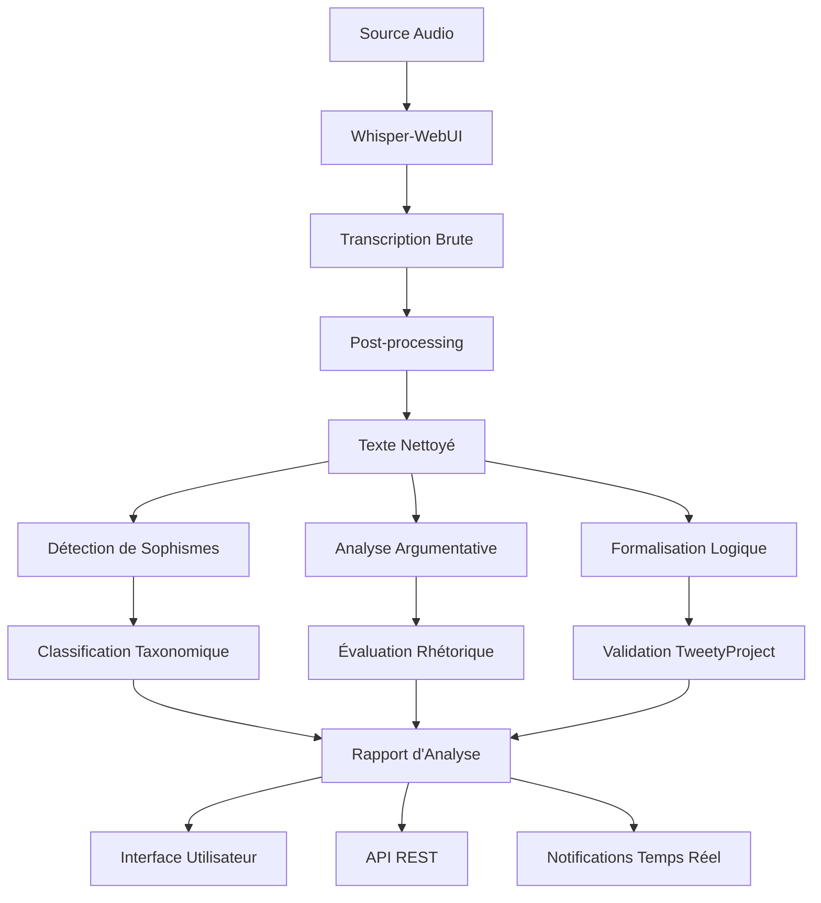

# [Custom] Speech to Text et Analyse d'arguments fallacieux

## Guide pédagogique complet

**Étudiants inscrits** : cedric.damais, gabriel.calvente, leon.ayral, yacine.benihaddadene

---

## Table des matières

1. [Introduction et contexte](#1-introduction-et-contexte)
2. [Architecture du pipeline Speech-to-Text + Analyse](#2-architecture-du-pipeline-speech-to-text--analyse)
    * [2.3 Approche d'Intégration Légère et Temps Réel](#23-approche-dintégration-légère-et-temps-réel)
3. [Intégration avec Whisper-WebUI](#3-intégration-avec-whisper-webui)
4. [Analyse d'arguments fallacieux](#4-analyse-darguments-fallacieux)
5. [Intégration avec TweetyProject](#5-intégration-avec-tweetyproject)
6. [Alternatives génériques](#6-alternatives-génériques)
7. [Implémentation pratique](#7-implémentation-pratique)
8. [Cas d'usage avancés](#8-cas-dusage-avancés)
9. [Évaluation et métriques](#9-évaluation-et-métriques)
10. [Ressources et références](#10-ressources-et-références)

---

## 1. Introduction et contexte

### 1.1 Vision du projet

Ce projet innovant combine deux domaines technologiques en pleine expansion :
- **Speech-to-Text (STT)** : Conversion automatique de la parole en texte
- **Analyse argumentative** : Détection et classification des sophismes et biais cognitifs

L'objectif est de développer un **pipeline "temps réel"** capable de s'intégrer aux autres composants du projet d'analyse argumentative, en analysant des contenus audio (débats, discours, conversations) pour identifier automatiquement les arguments fallacieux et les sophismes logiques. Les étudiants se concentreront sur l'utilisation de l'API d'une instance **Whisper WebUI haute performance (insanely fast whisper large 3)** qui leur sera fournie.

Vous pouvez commencer votre développement dans un dossier dédié à la racine du projet. L'intégration plus profonde dans l'architecture existante pourra être envisagée par la suite.

### 1.2 Positionnement dans l'écosystème d'IA symbolique

Ce projet s'inscrit dans le cadre plus large du système d'analyse argumentative développé dans le cours, qui utilise :
- **TweetyProject** pour la formalisation logique
- **Agents spécialisés** pour l'analyse rhétorique
- **Taxonomies de sophismes** pour la classification

L'ajout de la dimension audio ouvre de nouvelles perspectives :
- Analyse de débats politiques en direct
- Modération automatique de discussions orales
- Formation à l'argumentation avec feedback immédiat
- Recherche en psychologie cognitive sur les biais de raisonnement

### 1.3 Défis techniques spécifiques

#### Défis du Speech-to-Text
- **Qualité audio variable** : Bruit de fond, accents, débit de parole
- **Erreurs de transcription** : Impact sur l'analyse argumentative
- **Latence** : Contraintes temps réel vs qualité d'analyse
- **Langues et dialectes** : Adaptation aux spécificités linguistiques

#### Défis de l'analyse argumentative
- **Contexte oral vs écrit** : Différences de structure argumentative
- **Éléments paraverbaux** : Intonation, pauses, emphase
- **Correction d'erreurs** : Robustesse face aux erreurs de transcription
- **Temps réel** : Analyse progressive vs analyse complète

### 1.4 Architecture globale proposée



---

## 2. Architecture du pipeline Speech-to-Text + Analyse

### 2.1 Design patterns recommandés

#### 2.1.1 Pattern Pipeline avec étapes modulaires

```python
from abc import ABC, abstractmethod
from typing import Any, Dict, List, Optional
import asyncio
from dataclasses import dataclass
from enum import Enum

class ProcessingStage(Enum):
    AUDIO_PREPROCESSING = "audio_preprocessing"
    SPEECH_TO_TEXT = "speech_to_text"
    TEXT_POSTPROCESSING = "text_postprocessing"
    FALLACY_DETECTION = "fallacy_detection"
    ARGUMENT_ANALYSIS = "argument_analysis"
    LOGICAL_FORMALIZATION = "logical_formalization"
    REPORT_GENERATION = "report_generation"

@dataclass
class ProcessingContext:
    """Contexte partagé entre les étapes du pipeline"""
    audio_file: Optional[str] = None
    raw_transcription: Optional[str] = None
    cleaned_text: Optional[str] = None
    detected_fallacies: List[Dict] = None
    argument_structure: Optional[Dict] = None
    logical_formalization: Optional[Dict] = None
    confidence_scores: Dict[str, float] = None
    metadata: Dict[str, Any] = None
    
    def __post_init__(self):
        if self.detected_fallacies is None:
            self.detected_fallacies = []
        if self.confidence_scores is None:
            self.confidence_scores = {}
        if self.metadata is None:
            self.metadata = {}

class PipelineStage(ABC):
    """Interface abstraite pour les étapes du pipeline"""
    
    def __init__(self, stage_name: str):
        self.stage_name = stage_name
        self.is_enabled = True
        
    @abstractmethod
    async def process(self, context: ProcessingContext) -> ProcessingContext:
        """Traite le contexte et retourne le contexte modifié"""
        pass
    
    async def validate_input(self, context: ProcessingContext) -> bool:
        """Valide que les prérequis pour cette étape sont satisfaits"""
        return True
    
    async def handle_error(self, context: ProcessingContext, error: Exception) -> ProcessingContext:
        """Gère les erreurs de traitement"""
        context.metadata[f"{self.stage_name}_error"] = str(error)
        return context
```

### 2.2 Implémentation du pipeline principal

```python
class SpeechToTextPipeline:
    """Pipeline principal pour l'analyse speech-to-text + arguments"""
    
    def __init__(self):
        self.stages: List[PipelineStage] = []
        self.error_handlers: Dict[str, callable] = {}
        
    def add_stage(self, stage: PipelineStage) -> 'SpeechToTextPipeline':
        """Ajoute une étape au pipeline"""
        self.stages.append(stage)
        return self
    
    async def execute(self, initial_context: ProcessingContext) -> ProcessingContext:
        """Exécute le pipeline complet"""
        context = initial_context
        
        for stage in self.stages:
            if not stage.is_enabled:
                continue
                
            try:
                # Validation des prérequis
                if not await stage.validate_input(context):
                    raise ValueError(f"Validation failed for stage {stage.stage_name}")
                
                # Traitement
                context = await stage.process(context)
                
                # Logging du succès
                context.metadata[f"{stage.stage_name}_success"] = True
                
            except Exception as e:
                # Gestion d'erreur
                context = await stage.handle_error(context, e)
                context.metadata[f"{stage.stage_name}_success"] = False
                
                # Décision de continuer ou arrêter
                if self._is_critical_stage(stage):
                    raise e
        
        return context
    
    def _is_critical_stage(self, stage: PipelineStage) -> bool:
        """Détermine si l'échec d'une étape doit arrêter le pipeline"""
        critical_stages = [ProcessingStage.SPEECH_TO_TEXT]
        return any(critical.value in stage.stage_name for critical in critical_stages)
```

### 2.3 Approche d'Intégration Légère et Temps Réel

Bien que ce document décrive des pipelines potentiellement complets et complexes, l'objectif principal pour ce sujet est de réaliser une **intégration ciblée et légère**, en se concentrant sur un flux "temps réel".
Votre pipeline STT pourrait, par exemple, prendre un flux audio, le transcrire via l'API Whisper WebUI fournie, puis transmettre le texte à un agent existant du projet, comme l'agent de détection de sophismes informels, pour une analyse instantanée. Cela évite de réimplémenter toute la chaîne d'analyse.
Le diagramme Mermaid (Section 1.4) et les exemples de code de pipeline (Section 2.1, 2.2) servent d'illustration des possibilités et des concepts architecturaux. Votre implémentation doit se concentrer sur les modules STT et leur interfaçage efficace avec les autres composants du projet.

---

## 3. Intégration avec Whisper-WebUI

### 3.1 Client API pour Whisper-WebUI

```python
import httpx
import asyncio
from pathlib import Path
from typing import Optional, Dict, List
import json

class WhisperWebUIClient:
    """Client pour l'API Whisper-WebUI"""
    
    def __init__(self, base_url: str = "http://localhost:7860"):
        self.base_url = base_url
        self.session = None
        
        # NOTE: L'URL de base (`base_url`) et potentiellement certains paramètres du modèle
        # (ex: `model: "large-v3"`) seront spécifiques à l'instance Whisper WebUI
        # fournie par l'enseignant.
        
    async def __aenter__(self):
        self.session = httpx.AsyncClient(timeout=300.0)
        return self
    
    async def __aexit__(self, exc_type, exc_val, exc_tb):
        if self.session:
            await self.session.aclose()
    
    async def transcribe_file(
        self,
        audio_file: str,
        model: str = "large-v3",
        language: Optional[str] = None,
        task: str = "transcribe",
        vad: bool = True,
        word_timestamps: bool = True,
        **kwargs
    ) -> Dict:
        """
        Transcrit un fichier audio
        
        Args:
            audio_file: Chemin vers le fichier audio
            model: Modèle Whisper à utiliser
            language: Code langue ou None pour détection auto
            task: 'transcribe' ou 'translate'
            vad: Voice Activity Detection
            word_timestamps: Timestamps par mot
            
        Returns:
            Dict contenant la transcription et métadonnées
        """
        
        if not Path(audio_file).exists():
            raise FileNotFoundError(f"Audio file not found: {audio_file}")
        
        with open(audio_file, 'rb') as f:
            files = {'file': (Path(audio_file).name, f, 'audio/wav')}
            
            data = {
                'model': model,
                'task': task,
                'vad': str(vad).lower(),
                'word_timestamps': str(word_timestamps).lower()
            }
            
            if language:
                data['language'] = language
            
            data.update(kwargs)
            
            response = await self.session.post(
                f"{self.base_url}/api/transcribe",
                files=files,
                data=data
            )
        
        if response.status_code == 200:
            return response.json()
        else:
            raise Exception(f"Transcription failed: {response.status_code} - {response.text}")
```

### 3.2 Configuration optimisée pour l'analyse argumentative

```python
class ArgumentativeTranscriptionConfig:
    """Configuration optimisée pour l'analyse argumentative"""
    
    @staticmethod
    def get_config_for_content_type(content_type: str) -> Dict:
        """Retourne la configuration optimale selon le type de contenu"""
        
        configs = {
            "debate": {
                "model": "large-v3",
                "vad": True,
                "word_timestamps": True,
                "beam_size": 5,
                "temperature": 0.0,  # Plus déterministe
                "compression_ratio_threshold": 2.4,
                "logprob_threshold": -1.0,
                "no_speech_threshold": 0.6
            },
            
            "political_speech": {
                "model": "large-v3",
                "vad": True,
                "word_timestamps": True,
                "beam_size": 3,
                "temperature": 0.2,
                "compression_ratio_threshold": 2.4
            },
            
            "conversation": {
                "model": "medium",
                "vad": True,
                "word_timestamps": True,
                "beam_size": 1,
                "temperature": 0.4
            }
        }
        
        return configs.get(content_type, configs["conversation"])
```

---

## 4. Analyse d'arguments fallacieux

> **Note :** Pour ce sujet spécifique axé sur le STT et son intégration, la réimplémentation complète de ces modules d'analyse n'est pas l'objectif principal. L'idée est plutôt de **fournir le texte transcrit à des agents ou modules d'analyse déjà existants dans le projet global**. Les sections suivantes servent de contexte sur ce que ces agents pourraient faire avec le texte que votre pipeline leur fournira.

### 4.1 Taxonomie des sophismes pour l'audio

La détection de sophismes dans le contenu audio présente des spécificités par rapport au texte écrit :

#### 4.1.1 Sophismes spécifiques au contexte oral

```python
class AudioSpecificFallacies:
    """Sophismes spécifiques au contexte audio/oral"""
    
    AUDIO_FALLACIES = {
        "interruption_fallacy": {
            "name": "Sophisme d'interruption",
            "description": "Interrompre systématiquement l'adversaire pour l'empêcher de développer son argument",
            "detection_markers": ["interruption", "overlap", "speaking_over"]
        },
        
        "volume_intimidation": {
            "name": "Intimidation par le volume",
            "description": "Utiliser un volume élevé pour dominer le débat",
            "detection_markers": ["high_volume", "shouting", "aggressive_tone"]
        },
        
        "speed_confusion": {
            "name": "Confusion par débit rapide",
            "description": "Parler très rapidement pour empêcher la compréhension",
            "detection_markers": ["very_fast_speech", "rapid_delivery"]
        },
        
        "silence_manipulation": {
            "name": "Manipulation par le silence",
            "description": "Utiliser des pauses stratégiques pour créer un malaise",
            "detection_markers": ["strategic_pause", "uncomfortable_silence"]
        }
    }
```

### 4.2 Détecteur de sophismes adapté à l'audio

```python
class AudioFallacyDetector:
    """Détecteur de sophismes adapté au contenu audio"""
    
    def __init__(self, text_fallacy_detector, audio_analyzer=None):
        self.text_detector = text_fallacy_detector
        self.audio_analyzer = audio_analyzer
        
    async def detect_fallacies(self, context: ProcessingContext) -> List[Dict]:
        """Détecte les sophismes dans le contexte audio + texte"""
        
        fallacies = []
        
        # 1. Détection basée sur le texte transcrit
        text_fallacies = await self._detect_text_fallacies(context.cleaned_text)
        fallacies.extend(text_fallacies)
        
        # 2. Détection basée sur les métadonnées audio
        if context.metadata.get('whisper_segments'):
            audio_fallacies = await self._detect_audio_fallacies(context)
            fallacies.extend(audio_fallacies)
        
        # 3. Correction des erreurs de transcription
        corrected_fallacies = await self._correct_transcription_errors(fallacies, context)
        
        return corrected_fallacies
    
    async def _detect_text_fallacies(self, text: str) -> List[Dict]:
        """Détection standard sur le texte"""
        return await self.text_detector.detect_fallacies(text)
    
    async def _detect_audio_fallacies(self, context: ProcessingContext) -> List[Dict]:
        """Détection spécifique aux caractéristiques audio"""
        
        segments = context.metadata.get('whisper_segments', [])
        fallacies = []
        
        # Analyse du débit de parole
        speech_rate_fallacies = self._analyze_speech_rate(segments)
        fallacies.extend(speech_rate_fallacies)
        
        # Analyse des interruptions (si plusieurs locuteurs)
        interruption_fallacies = self._analyze_interruptions(segments)
        fallacies.extend(interruption_fallacies)
        
        return fallacies
    
    def _analyze_speech_rate(self, segments: List[Dict]) -> List[Dict]:
        """Analyse le débit de parole pour détecter la confusion intentionnelle"""
        
        fallacies = []
        
        for segment in segments:
            duration = segment.get('end', 0) - segment.get('start', 0)
            text = segment.get('text', '')
            words_count = len(text.split())
            
            if duration > 0:
                words_per_second = words_count / duration
                
                # Débit anormalement rapide (> 4 mots/seconde)
                if words_per_second > 4.0:
                    fallacies.append({
                        'type': 'speed_confusion',
                        'confidence': min(0.9, (words_per_second - 4.0) / 2.0),
                        'location': f"Segment {segment.get('start', 0):.1f}s-{segment.get('end', 0):.1f}s",
                        'text': text,
                        'explanation': f"Débit anormalement rapide: {words_per_second:.1f} mots/seconde"
                    })
        
        return fallacies
---

## 5. Intégration avec TweetyProject

> **Note :** Comme pour la section précédente, pour ce sujet spécifique axé sur le STT et son intégration, la réimplémentation complète de ces modules d'analyse n'est pas l'objectif principal. L'idée est plutôt de **fournir le texte transcrit à des agents ou modules d'analyse déjà existants dans le projet global**. Les sections suivantes servent de contexte sur ce que ces agents pourraient faire avec le texte que votre pipeline leur fournira.

### 5.1 Formalisation logique des arguments audio

```python
import jpype
from jpype import JClass, JString, startJVM, shutdownJVM
import json

class AudioArgumentFormalizer:
    """Formalisateur d'arguments pour contenu audio"""
    
    def __init__(self, tweety_jar_path: str):
        self.tweety_jar_path = tweety_jar_path
        self._init_tweety()
        
    def _init_tweety(self):
        """Initialise TweetyProject"""
        if not jpype.isJVMStarted():
            startJVM(classpath=[self.tweety_jar_path])
        
        # Import des classes Tweety
        self.PropositionalFormula = JClass("org.tweetyproject.logics.pl.syntax.PropositionalFormula")
        self.PlParser = JClass("org.tweetyproject.logics.pl.parser.PlParser")
        self.PlBeliefSet = JClass("org.tweetyproject.logics.pl.syntax.PlBeliefSet")
        self.SatSolver = JClass("org.tweetyproject.logics.pl.sat.SatSolver")
        
    async def formalize_audio_argument(self, context: ProcessingContext) -> Dict:
        """Formalise les arguments détectés dans l'audio"""
        
        # Extraction des arguments du texte transcrit
        arguments = await self._extract_arguments_from_transcription(context)
        
        # Formalisation de chaque argument
        formalized_arguments = []
        
        for arg in arguments:
            try:
                formalization = await self._formalize_single_argument(arg, context)
                formalized_arguments.append(formalization)
            except Exception as e:
                formalized_arguments.append({
                    'argument': arg,
                    'error': str(e),
                    'formalization_status': 'failed'
                })
        
        return {
            'formalized_arguments': formalized_arguments,
            'total_arguments': len(arguments),
            'successful_formalizations': len([f for f in formalized_arguments if f.get('formalization_status') == 'success'])
        }
    
    async def _extract_arguments_from_transcription(self, context: ProcessingContext) -> List[Dict]:
        """Extrait les arguments de la transcription avec timestamps"""
        
        segments = context.metadata.get('whisper_segments', [])
        arguments = []
        
        current_argument = {
            'premises': [],
            'conclusion': None,
            'start_time': None,
            'end_time': None,
            'speaker_segments': []
        }
        
        for segment in segments:
            text = segment.get('text', '').strip()
            start_time = segment.get('start', 0)
            end_time = segment.get('end', 0)
            
            # Détection des marqueurs argumentatifs
            if self._is_premise_marker(text):
                current_argument['premises'].append({
                    'text': text,
                    'start_time': start_time,
                    'end_time': end_time
                })
                if current_argument['start_time'] is None:
                    current_argument['start_time'] = start_time
                    
            elif self._is_conclusion_marker(text):
                current_argument['conclusion'] = {
                    'text': text,
                    'start_time': start_time,
                    'end_time': end_time
                }
                current_argument['end_time'] = end_time
                
                # Finalisation de l'argument
                if current_argument['premises'] and current_argument['conclusion']:
                    arguments.append(current_argument.copy())
                
                # Réinitialisation pour le prochain argument
                current_argument = {
                    'premises': [],
                    'conclusion': None,
                    'start_time': None,
                    'end_time': None,
                    'speaker_segments': []
                }
        
        return arguments
    
    def _is_premise_marker(self, text: str) -> bool:
        """Détecte si un segment contient une prémisse"""
        premise_markers = [
            'parce que', 'car', 'puisque', 'étant donné que',
            'vu que', 'du fait que', 'en raison de', 'à cause de'
        ]
        return any(marker in text.lower() for marker in premise_markers)
    
    def _is_conclusion_marker(self, text: str) -> bool:
        """Détecte si un segment contient une conclusion"""
        conclusion_markers = [
            'donc', 'par conséquent', 'ainsi', 'c\'est pourquoi',
            'il s\'ensuit que', 'on peut conclure', 'en conclusion'
        ]
        return any(marker in text.lower() for marker in conclusion_markers)
    
    async def _formalize_single_argument(self, argument: Dict, context: ProcessingContext) -> Dict:
        """Formalise un argument unique"""
        
        try:
            parser = self.PlParser()
            belief_set = self.PlBeliefSet()
            
            # Conversion des prémisses en formules logiques
            premise_formulas = []
            for i, premise in enumerate(argument['premises']):
                # Simplification : utilisation de variables propositionnelles
                var_name = f"p{i+1}"
                formula_str = var_name  # Dans un vrai système, utiliser du NLP pour extraire la structure
                
                formula = parser.parseFormula(JString(formula_str))
                belief_set.add(formula)
                premise_formulas.append({
                    'original_text': premise['text'],
                    'formula': formula_str,
                    'variable': var_name
                })
            
            # Conversion de la conclusion
            conclusion_var = "c"
            conclusion_formula = parser.parseFormula(JString(conclusion_var))
            
            # Vérification de la validité logique
            solver = self.SatSolver.getDefaultSolver()
            is_consistent = solver.isConsistent(belief_set)
            entails_conclusion = belief_set.entails(conclusion_formula)
            
            return {
                'argument': argument,
                'premise_formulas': premise_formulas,
                'conclusion_formula': {
                    'original_text': argument['conclusion']['text'],
                    'formula': conclusion_var
                },
                'is_consistent': is_consistent,
                'entails_conclusion': entails_conclusion,
                'validity_status': 'valid' if entails_conclusion else 'invalid',
                'formalization_status': 'success'
            }
            
        except Exception as e:
            return {
                'argument': argument,
                'error': str(e),
                'formalization_status': 'failed'
            }

class TweetyIntegrationStage(PipelineStage):
    """Étape d'intégration avec TweetyProject"""
    
    def __init__(self, tweety_jar_path: str):
        super().__init__("tweety_integration")
        self.formalizer = AudioArgumentFormalizer(tweety_jar_path)
        
    async def process(self, context: ProcessingContext) -> ProcessingContext:
        """Intègre l'analyse avec TweetyProject"""
        
        # Formalisation des arguments
        formalization_result = await self.formalizer.formalize_audio_argument(context)
        
        context.logical_formalization = formalization_result
        context.confidence_scores['logical_formalization'] = self._calculate_formalization_confidence(formalization_result)
        
        return context
    
    def _calculate_formalization_confidence(self, result: Dict) -> float:
        """Calcule la confiance de la formalisation"""
        total = result['total_arguments']
        successful = result['successful_formalizations']
        
        if total == 0:
            return 1.0
        
        return successful / total
```

### 5.2 Validation croisée avec les agents existants

```python
class CrossValidationStage(PipelineStage):
    """Validation croisée avec les agents d'analyse argumentative existants"""
    
    def __init__(self, informal_agent, extract_agent):
        super().__init__("cross_validation")
        self.informal_agent = informal_agent
        self.extract_agent = extract_agent
        
    async def process(self, context: ProcessingContext) -> ProcessingContext:
        """Valide les résultats avec les agents existants"""
        
        # Analyse par l'agent informel
        informal_analysis = await self._analyze_with_informal_agent(context)
        
        # Analyse par l'agent d'extraction
        extract_analysis = await self._analyze_with_extract_agent(context)
        
        # Comparaison et consolidation
        consolidated_results = self._consolidate_analyses(
            context.detected_fallacies,
            informal_analysis,
            extract_analysis
        )
        
        context.metadata['cross_validation'] = {
            'informal_analysis': informal_analysis,
            'extract_analysis': extract_analysis,
            'consolidated_results': consolidated_results
        }
        
        return context
    
    async def _analyze_with_informal_agent(self, context: ProcessingContext) -> Dict:
        """Analyse avec l'agent informel existant"""
        
        if not context.cleaned_text:
            return {'error': 'No text available for analysis'}
        
        try:
            # Utilisation de l'agent informel du projet
            analysis = await self.informal_agent.analyze_text(context.cleaned_text)
            return {
                'status': 'success',
                'fallacies': analysis.get('fallacies', []),
                'confidence': analysis.get('confidence', 0.5)
            }
        except Exception as e:
            return {'status': 'error', 'error': str(e)}
    
    async def _analyze_with_extract_agent(self, context: ProcessingContext) -> Dict:
        """Analyse avec l'agent d'extraction"""
        
        try:
            # Utilisation de l'agent d'extraction du projet
            analysis = await self.extract_agent.extract_arguments(context.cleaned_text)
            return {
                'status': 'success',
                'arguments': analysis.get('arguments', []),
                'structure': analysis.get('structure', {})
            }
        except Exception as e:
            return {'status': 'error', 'error': str(e)}
    
    def _consolidate_analyses(self, audio_fallacies: List[Dict], informal_analysis: Dict, extract_analysis: Dict) -> Dict:
        """Consolide les analyses de différentes sources"""
        
        consolidated = {
            'fallacies': {
                'audio_detected': audio_fallacies,
                'informal_detected': informal_analysis.get('fallacies', []),
                'common_fallacies': [],
                'unique_to_audio': [],
                'unique_to_text': []
            },
            'confidence_scores': {
                'audio_analysis': sum(f.get('confidence', 0.5) for f in audio_fallacies) / max(len(audio_fallacies), 1),
                'informal_analysis': informal_analysis.get('confidence', 0.5),
                'agreement_score': 0.0
            }
        }
        
        # Identification des sophismes communs
        audio_types = {f['type'] for f in audio_fallacies}
        informal_types = {f.get('type', f.get('name', '')) for f in informal_analysis.get('fallacies', [])}
        
        common_types = audio_types.intersection(informal_types)
        consolidated['fallacies']['common_fallacies'] = list(common_types)
        consolidated['fallacies']['unique_to_audio'] = list(audio_types - informal_types)
        consolidated['fallacies']['unique_to_text'] = list(informal_types - audio_types)
        
        # Score d'accord
        if audio_types or informal_types:
            agreement = len(common_types) / len(audio_types.union(informal_types))
            consolidated['confidence_scores']['agreement_score'] = agreement
        
        return consolidated
```

---

## 6. Alternatives génériques

### 6.1 Solutions indépendantes du framework

Pour les équipes souhaitant développer une solution plus générique, voici des alternatives qui ne dépendent pas de l'infrastructure TweetyProject :

#### 6.1.1 Détecteur de sophismes basé sur des modèles de langage

```python
import openai
from transformers import pipeline, AutoTokenizer, AutoModelForSequenceClassification
import torch

class GenericFallacyDetector:
    """Détecteur de sophismes générique utilisant des modèles de langage"""
    
    def __init__(self, approach: str = "transformer"):
        self.approach = approach
        self._init_models()
        
    def _init_models(self):
        """Initialise les modèles selon l'approche choisie"""
        
        if self.approach == "transformer":
            # Utilisation d'un modèle pré-entraîné pour la classification
            self.tokenizer = AutoTokenizer.from_pretrained("camembert-base")
            self.model = AutoModelForSequenceClassification.from_pretrained("camembert-base", num_labels=10)
            self.classifier = pipeline("text-classification", model=self.model, tokenizer=self.tokenizer)
            
        elif self.approach == "openai":
            # Utilisation de l'API OpenAI
            self.client = openai.OpenAI()
            
        elif self.approach == "local_llm":
            # Utilisation d'un LLM local (ex: Ollama)
            import httpx
            self.llm_client = httpx.AsyncClient()
            self.llm_url = "http://localhost:11434"
    
    async def detect_fallacies(self, text: str) -> List[Dict]:
        """Détecte les sophismes selon l'approche configurée"""
        
        if self.approach == "transformer":
            return await self._detect_with_transformer(text)
        elif self.approach == "openai":
            return await self._detect_with_openai(text)
        elif self.approach == "local_llm":
            return await self._detect_with_local_llm(text)
        else:
            raise ValueError(f"Unknown approach: {self.approach}")
    
    async def _detect_with_transformer(self, text: str) -> List[Dict]:
        """Détection avec modèle Transformer"""
        
        # Segmentation du texte en phrases
        sentences = self._segment_text(text)
        fallacies = []
        
        for sentence in sentences:
            # Classification de chaque phrase
            result = self.classifier(sentence)
            
            # Interprétation des résultats
            if result[0]['score'] > 0.7:  # Seuil de confiance
                fallacy_type = self._map_label_to_fallacy(result[0]['label'])
                if fallacy_type:
                    fallacies.append({
                        'type': fallacy_type,
                        'text': sentence,
                        'confidence': result[0]['score'],
                        'method': 'transformer'
                    })
        
        return fallacies
    
    async def _detect_with_openai(self, text: str) -> List[Dict]:
        """Détection avec OpenAI GPT"""
        
        prompt = f"""
        Analysez le texte suivant et identifiez tous les sophismes logiques présents.
        Pour chaque sophisme trouvé, indiquez :
        - Le type de sophisme
        - Le passage concerné
        - Une explication
        - Un score de confiance (0-1)
        
        Texte à analyser :
        {text}
        
        Répondez au format JSON avec une liste de sophismes.
        """
        
        response = await self.client.chat.completions.create(
            model="gpt-4",
            messages=[{"role": "user", "content": prompt}],
            temperature=0.1
        )
        
        try:
            import json
            result = json.loads(response.choices[0].message.content)
            return result.get('fallacies', [])
        except:
            return []
    
    async def _detect_with_local_llm(self, text: str) -> List[Dict]:
        """Détection avec LLM local (Ollama)"""
        
        prompt = f"""
        Analysez ce texte pour identifier les sophismes logiques :
        
        {text}
        
        Répondez en JSON avec la liste des sophismes trouvés.
        Format : {{"fallacies": [{{"type": "nom_sophisme", "text": "passage", "confidence": 0.8}}]}}
        """
        
        response = await self.llm_client.post(
            f"{self.llm_url}/api/generate",
            json={
                "model": "qwen2.5:7b",
                "prompt": prompt,
                "stream": False,
                "format": "json"
            }
        )
        
        if response.status_code == 200:
            result = response.json()
            import json
            try:
                parsed = json.loads(result['response'])
                return parsed.get('fallacies', [])
            except:
                return []
        
        return []
    
    def _segment_text(self, text: str) -> List[str]:
        """Segmente le texte en phrases"""
        import re
        sentences = re.split(r'[.!?]+', text)
        return [s.strip() for s in sentences if s.strip()]
    
    def _map_label_to_fallacy(self, label: str) -> Optional[str]:
        """Mappe les labels du modèle vers les types de sophismes"""
        mapping = {
            'LABEL_0': 'ad_hominem',
            'LABEL_1': 'straw_man',
            'LABEL_2': 'false_dilemma',
            'LABEL_3': 'appeal_to_authority',
            'LABEL_4': 'slippery_slope'
        }
        return mapping.get(label)
```

#### 6.1.2 Pipeline générique sans dépendances

```python
class GenericSpeechAnalysisPipeline:
    """Pipeline générique d'analyse speech-to-text + arguments"""
    
    def __init__(self, config: Dict):
        self.config = config
        self.transcription_service = self._init_transcription_service()
        self.fallacy_detector = GenericFallacyDetector(config.get('fallacy_approach', 'transformer'))
        
    def _init_transcription_service(self):
        """Initialise le service de transcription"""
        service_type = self.config.get('transcription_service', 'whisper_api')
        
        if service_type == 'whisper_api':
            return WhisperAPIService(self.config.get('whisper_config', {}))
        elif service_type == 'google_speech':
            return GoogleSpeechService(self.config.get('google_config', {}))
        elif service_type == 'azure_speech':
            return AzureSpeechService(self.config.get('azure_config', {}))
        else:
            raise ValueError(f"Unknown transcription service: {service_type}")
    
    async def analyze_audio(self, audio_file: str) -> Dict:
        """Analyse complète d'un fichier audio"""
        
        result = {
            'audio_file': audio_file,
            'transcription': None,
            'fallacies': [],
            'analysis_metadata': {},
            'processing_time': 0
        }
        
        import time
        start_time = time.time()
        
        try:
            # 1. Transcription
            transcription_result = await self.transcription_service.transcribe(audio_file)
            result['transcription'] = transcription_result
            
            # 2. Post-processing du texte
            cleaned_text = self._clean_transcription(transcription_result['text'])
            
            # 3. Détection de sophismes
            fallacies = await self.fallacy_detector.detect_fallacies(cleaned_text)
            result['fallacies'] = fallacies
            
            # 4. Métadonnées d'analyse
            result['analysis_metadata'] = {
                'word_count': len(cleaned_text.split()),
                'fallacy_count': len(fallacies),
                'confidence_scores': {
                    'transcription': transcription_result.get('confidence', 0.5),
                    'fallacy_detection': sum(f.get('confidence', 0.5) for f in fallacies) / max(len(fallacies), 1)
                }
            }
            
        except Exception as e:
            result['error'] = str(e)
        
        finally:
            result['processing_time'] = time.time() - start_time
        
        return result
    
    def _clean_transcription(self, text: str) -> str:
        """Nettoie la transcription"""
        # Suppression des hésitations
        import re
        text = re.sub(r'\b(euh|heu|ben)\b', '', text, flags=re.IGNORECASE)
        
        # Normalisation de la ponctuation
        text = re.sub(r'\s+([,.!?])', r'\1', text)
        text = re.sub(r'\s+', ' ', text)
        
        return text.strip()

class WhisperAPIService:
    """Service de transcription via API Whisper"""
    
    def __init__(self, config: Dict):
        self.config = config
        
    async def transcribe(self, audio_file: str) -> Dict:
        """Transcrit via l'API Whisper"""
        import openai
        
        client = openai.OpenAI()
        
        with open(audio_file, 'rb') as f:
            transcript = client.audio.transcriptions.create(
                model="whisper-1",
                file=f,
                language=self.config.get('language', 'fr')
            )
        
        return {
            'text': transcript.text,
            'confidence': 0.8,  # Estimation
            'language': self.config.get('language', 'fr')
        }
```

---

## 7. Implémentation pratique

> **Note importante sur le code fourni :** Le code Python présenté dans cette fiche est très complet et illustre de nombreuses possibilités et architectures logicielles. Pour votre projet, concentrez-vous sur les aspects essentiels à la mise en place du pipeline STT via l'API Whisper WebUI et à son intégration avec les autres composants du système. Vous n'aurez pas nécessairement à implémenter toutes les classes ou fonctionnalités présentées ici verbatim. Adaptez et simplifiez en fonction des besoins spécifiques de votre intégration "temps réel" et légère.

### 7.1 Exemple complet d'implémentation

Voici un exemple complet d'implémentation du système :

```python
import asyncio
from pathlib import Path
import json

async def main_example():
    """Exemple complet d'utilisation du système"""
    
    # Configuration
    config = {
        'whisper_url': 'http://localhost:7860',
        'tweety_jar_path': 'libs/tweety-full.jar',
        'fallacy_approach': 'local_llm',
        'output_format': 'detailed'
    }
    
    # Initialisation du pipeline
    pipeline = SpeechToTextPipeline()
    
    # Ajout des étapes
    pipeline.add_stage(WhisperWebUIStage(config['whisper_url']))
    pipeline.add_stage(TextPostProcessingStage())
    pipeline.add_stage(FallacyDetectionStage(GenericFallacyDetector('local_llm')))
    pipeline.add_stage(TweetyIntegrationStage(config['tweety_jar_path']))
    
    # Traitement d'un fichier audio
    context = ProcessingContext(audio_file='examples/debate_sample.wav')
    
    try:
        result = await pipeline.execute(context)
        
        # Génération du rapport
        report = generate_analysis_report(result)
        
        # Sauvegarde
        with open('analysis_report.json', 'w', encoding='utf-8') as f:
            json.dump(report, f, ensure_ascii=False, indent=2)
        
        print("Analyse terminée avec succès!")
        print(f"Sophismes détectés: {len(result.detected_fallacies)}")
        print(f"Arguments formalisés: {result.logical_formalization.get('successful_formalizations', 0)}")
        
    except Exception as e:
        print(f"Erreur lors de l'analyse: {e}")

def generate_analysis_report(context: ProcessingContext) -> Dict:
    """Génère un rapport d'analyse complet"""
    
    return {
        'metadata': {
            'audio_file': context.audio_file,
            'processing_timestamp': context.metadata.get('timestamp'),
            'total_processing_time': sum(
                context.metadata.get(f'{stage}_time', 0) 
                for stage in ['transcription', 'fallacy_detection', 'formalization']
            )
        },
        
        'transcription': {
            'raw_text': context.raw_transcription,
            'cleaned_text': context.cleaned_text,
            'confidence': context.confidence_scores.get('transcription', 0),
            'language': context.metadata.get('whisper_language', 'unknown'),
            'word_count': len(context.cleaned_text.split()) if context.cleaned_text else 0
        },
        
        'fallacy_analysis': {
            'detected_fallacies': context.detected_fallacies,
            'fallacy_count': len(context.detected_fallacies),
            'confidence': context.confidence_scores.get('fallacy_detection', 0),
            'fallacy_types': list(set(f['type'] for f in context.detected_fallacies))
        },
        
        'logical_formalization': context.logical_formalization,
        
        'quality_assessment': {
            'overall_confidence': sum(context.confidence_scores.values()) / len(context.confidence_scores),
            'reliability_score': calculate_reliability_score(context),
            'recommendations': generate_recommendations(context)
        }
    }

def calculate_reliability_score(context: ProcessingContext) -> float:
    """Calcule un score de fiabilité global"""
    
    factors = {
        'transcription_quality': context.confidence_scores.get('transcription', 0.5),
        'fallacy_detection_confidence': context.confidence_scores.get('fallacy_detection', 0.5),
        'cross_validation_agreement': context.metadata.get('cross_validation', {}).get('confidence_scores', {}).get('agreement_score', 0.5)
    }
    
    # Pondération des facteurs
    weights = {'transcription_quality': 0.4, 'fallacy_detection_confidence': 0.4, 'cross_validation_agreement': 0.2}
    
    weighted_score = sum(factors[key] * weights[key] for key in factors)
    return min(1.0, max(0.0, weighted_score))

def generate_recommendations(context: ProcessingContext) -> List[str]:
    """Génère des recommandations d'amélioration"""
    
    recommendations = []
    
    # Recommandations basées sur la qualité de transcription
    transcription_confidence = context.confidence_scores.get('transcription', 0.5)
    if transcription_confidence < 0.7:
        recommendations.append("Améliorer la qualité audio pour une meilleure transcription")
    
    # Recommandations basées sur la détection de sophismes
    fallacy_count = len(context.detected_fallacies)
    if fallacy_count > 5:
        recommendations.append("Nombre élevé de sophismes détectés - réviser l'argumentation")
    
    # Recommandations basées sur la validation croisée
    agreement_score = context.metadata.get('cross_validation', {}).get('confidence_scores', {}).get('agreement_score', 1.0)
    if agreement_score < 0.6:
        recommendations.append("Faible accord entre les méthodes d'analyse - vérification manuelle recommandée")
    
    return recommendations

if __name__ == "__main__":
    asyncio.run(main_example())
```

### 7.2 Interface utilisateur simple

```python
import streamlit as st
import asyncio
from pathlib import Path

def create_streamlit_interface():
    """Interface Streamlit pour le système d'analyse"""
    
    st.title("Analyseur Speech-to-Text + Arguments Fallacieux")
    st.markdown("Uploadez un fichier audio pour analyser les sophismes dans le discours")
    
    # Upload de fichier
    uploaded_file = st.file_uploader(
        "Choisissez un fichier audio",
        type=['wav', 'mp3', 'm4a', 'flac']
    )
    
    if uploaded_file is not None:
        # Sauvegarde temporaire
        temp_path = f"temp_{uploaded_file.name}"
        with open(temp_path, "wb") as f:
            f.write(uploaded_file.getbuffer())
        
        # Configuration
        st.sidebar.header("Configuration")
        
        whisper_model = st.sidebar.selectbox(
            "Modèle Whisper",
            ["tiny", "base", "small", "medium", "large", "large-v3"]
        )
        
        fallacy_approach = st.sidebar.selectbox(
            "Méthode de détection",
            ["transformer", "local_llm", "openai"]
        )
        
        enable_tweety = st.sidebar.checkbox("Intégration TweetyProject", value=True)
        
        # Bouton d'analyse
        if st.button("Analyser"):
            with st.spinner("Analyse en cours..."):
                # Exécution de l'analyse
                result = run_analysis(temp_path, {
                    'whisper_model': whisper_model,
                    'fallacy_approach': fallacy_approach,
                    'enable_tweety': enable_tweety
                })
                
                # Affichage des résultats
                display_results(result)
        
        # Nettoyage
        Path(temp_path).unlink(missing_ok=True)

def run_analysis(audio_file: str, config: Dict) -> Dict:
    """Exécute l'analyse avec la configuration donnée"""
    
    # Création du pipeline
    pipeline = SpeechToTextPipeline()
    
    # Configuration des étapes selon les paramètres
    pipeline.add_stage(WhisperWebUIStage())
    pipeline.add_stage(TextPostProcessingStage())
    pipeline.add_stage(FallacyDetectionStage(GenericFallacyDetector(config['fallacy_approach'])))
    
    if config['enable_tweety']:
        pipeline.add_stage(TweetyIntegrationStage('libs/tweety-full.jar'))
    
    # Exécution
    context = ProcessingContext(audio_file=audio_file)
    
    try:
        loop = asyncio.new_event_loop()
        asyncio.set_event_loop(loop)
        result = loop.run_until_complete(pipeline.execute(context))
        return generate_analysis_report(result)
    except Exception as e:
        return {'error': str(e)}

def display_results(result: Dict):
    """Affiche les résultats de l'analyse"""
    
    if 'error' in result:
        st.error(f"Erreur lors de l'analyse: {result['error']}")
        return
# Transcription
    st.subheader("Transcription")
    transcription_data = result.get('transcription', {})
    
    col1, col2 = st.columns(2)
    with col1:
        st.metric("Confiance", f"{transcription_data.get('confidence', 0):.2f}")
    with col2:
        st.metric("Nombre de mots", transcription_data.get('word_count', 0))
    
    st.text_area("Texte transcrit", transcription_data.get('cleaned_text', ''), height=200)
    
    # Analyse des sophismes
    st.subheader("Sophismes détectés")
    fallacy_data = result.get('fallacy_analysis', {})
    
    if fallacy_data.get('fallacy_count', 0) > 0:
        for i, fallacy in enumerate(fallacy_data.get('detected_fallacies', [])):
            with st.expander(f"Sophisme {i+1}: {fallacy.get('type', 'Inconnu')}"):
                st.write(f"**Confiance:** {fallacy.get('confidence', 0):.2f}")
                st.write(f"**Texte:** {fallacy.get('text', 'N/A')}")
                st.write(f"**Explication:** {fallacy.get('explanation', 'Aucune explication disponible')}")
    else:
        st.info("Aucun sophisme détecté dans ce contenu")
    
    # Évaluation de qualité
    st.subheader("Évaluation de qualité")
    quality_data = result.get('quality_assessment', {})
    
    col1, col2 = st.columns(2)
    with col1:
        st.metric("Score de fiabilité", f"{quality_data.get('reliability_score', 0):.2f}")
    with col2:
        st.metric("Confiance globale", f"{quality_data.get('overall_confidence', 0):.2f}")
    
    # Recommandations
    recommendations = quality_data.get('recommendations', [])
    if recommendations:
        st.subheader("Recommandations")
        for rec in recommendations:
            st.warning(rec)

if __name__ == "__main__":
    create_streamlit_interface()
```

---

## 8. Cas d'usage avancés

### 8.1 Analyse de débats politiques en temps réel

```python
class RealTimeDebateAnalyzer:
    """Analyseur de débats politiques en temps réel"""
    
    def __init__(self, config: Dict):
        self.config = config
        self.pipeline = self._create_realtime_pipeline()
        self.buffer = AudioBuffer(max_duration=30)  # Buffer de 30 secondes
        self.analysis_queue = asyncio.Queue()
        
    def _create_realtime_pipeline(self):
        """Crée un pipeline optimisé pour le temps réel"""
        pipeline = SpeechToTextPipeline()
        
        # Étapes optimisées pour la latence
        pipeline.add_stage(StreamingWhisperStage(
            model="medium",  # Compromis vitesse/qualité
            chunk_duration=5  # Analyse par chunks de 5 secondes
        ))
        pipeline.add_stage(FastFallacyDetectionStage())
        
        return pipeline
    
    async def start_realtime_analysis(self, audio_stream):
        """Démarre l'analyse en temps réel"""
        
        # Tâches parallèles
        tasks = [
            asyncio.create_task(self._audio_capture(audio_stream)),
            asyncio.create_task(self._process_audio_chunks()),
            asyncio.create_task(self._generate_realtime_alerts())
        ]
        
        await asyncio.gather(*tasks)
    
    async def _audio_capture(self, audio_stream):
        """Capture l'audio en continu"""
        async for audio_chunk in audio_stream:
            await self.buffer.add_chunk(audio_chunk)
    
    async def _process_audio_chunks(self):
        """Traite les chunks audio dès qu'ils sont disponibles"""
        while True:
            if self.buffer.has_complete_chunk():
                chunk = await self.buffer.get_chunk()
                
                # Analyse asynchrone
                context = ProcessingContext(audio_data=chunk)
                result = await self.pipeline.execute(context)
                
                await self.analysis_queue.put(result)
            
            await asyncio.sleep(0.1)  # Évite la surcharge CPU
    
    async def _generate_realtime_alerts(self):
        """Génère des alertes en temps réel"""
        while True:
            result = await self.analysis_queue.get()
            
            # Analyse des sophismes critiques
            critical_fallacies = [
                f for f in result.detected_fallacies 
                if f.get('severity', 0) > 0.8
            ]
            
            if critical_fallacies:
                await self._send_alert(critical_fallacies, result.metadata.get('timestamp'))

class StreamingWhisperStage(PipelineStage):
    """Étape Whisper optimisée pour le streaming"""
    
    def __init__(self, model: str = "medium", chunk_duration: int = 5):
        super().__init__("streaming_whisper")
        self.model = model
        self.chunk_duration = chunk_duration
        
    async def process(self, context: ProcessingContext) -> ProcessingContext:
        """Traitement streaming avec chunks courts"""
        
        # Transcription rapide avec modèle plus petit
        async with WhisperWebUIClient() as client:
            result = await client.transcribe_file(
                audio_file=context.audio_file,
                model=self.model,
                beam_size=1,  # Plus rapide
                temperature=0.0  # Déterministe
            )
        
        context.raw_transcription = result['text']
        context.metadata['streaming_mode'] = True
        context.metadata['chunk_duration'] = self.chunk_duration
        
        return context
```

### 8.2 Modération automatique de discussions

```python
class AutoModerationSystem:
    """Système de modération automatique pour discussions orales"""
    
    def __init__(self):
        self.moderation_rules = self._load_moderation_rules()
        self.severity_thresholds = {
            'warning': 0.6,
            'intervention': 0.8,
            'escalation': 0.9
        }
        
    def _load_moderation_rules(self) -> Dict:
        """Charge les règles de modération"""
        return {
            'prohibited_fallacies': [
                'ad_hominem',
                'hate_speech',
                'personal_attack'
            ],
            'warning_fallacies': [
                'straw_man',
                'false_dilemma',
                'appeal_to_emotion'
            ],
            'tracking_fallacies': [
                'appeal_to_authority',
                'bandwagon',
                'slippery_slope'
            ]
        }
    
    async def moderate_discussion(self, context: ProcessingContext) -> Dict:
        """Modère une discussion basée sur l'analyse des sophismes"""
        
        moderation_actions = []
        
        for fallacy in context.detected_fallacies:
            action = self._determine_moderation_action(fallacy)
            if action:
                moderation_actions.append(action)
        
        # Analyse des patterns de comportement
        behavior_analysis = self._analyze_speaker_behavior(context)
        
        return {
            'moderation_actions': moderation_actions,
            'behavior_analysis': behavior_analysis,
            'overall_discussion_quality': self._calculate_discussion_quality(context),
            'recommendations': self._generate_moderation_recommendations(moderation_actions)
        }
    
    def _determine_moderation_action(self, fallacy: Dict) -> Optional[Dict]:
        """Détermine l'action de modération pour un sophisme"""
        
        fallacy_type = fallacy.get('type')
        confidence = fallacy.get('confidence', 0)
        
        if fallacy_type in self.moderation_rules['prohibited_fallacies']:
            if confidence > self.severity_thresholds['escalation']:
                return {
                    'action': 'immediate_intervention',
                    'reason': f"Sophisme prohibé détecté: {fallacy_type}",
                    'fallacy': fallacy,
                    'severity': 'high'
                }
        
        elif fallacy_type in self.moderation_rules['warning_fallacies']:
            if confidence > self.severity_thresholds['warning']:
                return {
                    'action': 'warning',
                    'reason': f"Sophisme problématique: {fallacy_type}",
                    'fallacy': fallacy,
                    'severity': 'medium'
                }
        
        return None
    
    def _analyze_speaker_behavior(self, context: ProcessingContext) -> Dict:
        """Analyse le comportement des locuteurs"""
        
        # Analyse basée sur les segments temporels
        segments = context.metadata.get('whisper_segments', [])
        
        behavior_metrics = {
            'interruption_frequency': 0,
            'speaking_time_distribution': {},
            'fallacy_frequency_per_speaker': {},
            'aggressive_language_indicators': 0
        }
        
        # Calcul des métriques (simplifié)
        for segment in segments:
            # Détection d'interruptions basée sur les overlaps
            if segment.get('overlap_detected', False):
                behavior_metrics['interruption_frequency'] += 1
        
        return behavior_metrics

class DiscussionQualityAssessment:
    """Évaluation de la qualité d'une discussion"""
    
    @staticmethod
    def assess_discussion_quality(context: ProcessingContext) -> Dict:
        """Évalue la qualité globale d'une discussion"""
        
        metrics = {
            'logical_coherence': 0.0,
            'argument_diversity': 0.0,
            'respectful_discourse': 0.0,
            'evidence_based_reasoning': 0.0,
            'overall_quality': 0.0
        }
        
        # Cohérence logique (basée sur les sophismes détectés)
        fallacy_count = len(context.detected_fallacies)
        total_words = len(context.cleaned_text.split()) if context.cleaned_text else 1
        fallacy_density = fallacy_count / total_words * 1000  # Sophismes pour 1000 mots
        
        metrics['logical_coherence'] = max(0.0, 1.0 - fallacy_density / 10)
        
        # Diversité argumentative
        unique_argument_types = len(set(f.get('type') for f in context.detected_fallacies))
        metrics['argument_diversity'] = min(1.0, unique_argument_types / 5)
        
        # Discours respectueux (basé sur l'absence de sophismes ad hominem)
        personal_attacks = [f for f in context.detected_fallacies if f.get('type') == 'ad_hominem']
        metrics['respectful_discourse'] = max(0.0, 1.0 - len(personal_attacks) / max(fallacy_count, 1))
        
        # Raisonnement basé sur des preuves
        evidence_based_fallacies = ['appeal_to_authority', 'anecdotal_evidence']
        evidence_issues = [f for f in context.detected_fallacies if f.get('type') in evidence_based_fallacies]
        metrics['evidence_based_reasoning'] = max(0.0, 1.0 - len(evidence_issues) / max(fallacy_count, 1))
        
        # Score global
        metrics['overall_quality'] = sum(metrics.values()) / 4
        
        return metrics
```

### 8.3 Formation à l'argumentation avec feedback

```python
class ArgumentationTrainingSystem:
    """Système de formation à l'argumentation avec feedback en temps réel"""
    
    def __init__(self):
        self.training_modules = self._load_training_modules()
        self.progress_tracker = ProgressTracker()
        
    def _load_training_modules(self) -> Dict:
        """Charge les modules de formation"""
        return {
            'beginner': {
                'focus_fallacies': ['ad_hominem', 'straw_man', 'false_dilemma'],
                'exercises': ['identification', 'correction', 'construction']
            },
            'intermediate': {
                'focus_fallacies': ['appeal_to_authority', 'slippery_slope', 'bandwagon'],
                'exercises': ['complex_identification', 'debate_analysis', 'argument_construction']
            },
            'advanced': {
                'focus_fallacies': ['subtle_fallacies', 'combined_fallacies', 'context_dependent'],
                'exercises': ['real_time_analysis', 'debate_moderation', 'argument_coaching']
            }
        }
    
    async def conduct_training_session(self, user_id: str, level: str, exercise_type: str) -> Dict:
        """Conduit une session de formation"""
        
        session_config = self.training_modules[level]
        
        if exercise_type == 'real_time_practice':
            return await self._real_time_practice_session(user_id, session_config)
        elif exercise_type == 'analysis_exercise':
            return await self._analysis_exercise(user_id, session_config)
        else:
            return await self._construction_exercise(user_id, session_config)
    
    async def _real_time_practice_session(self, user_id: str, config: Dict) -> Dict:
        """Session de pratique en temps réel"""
        
        session_results = {
            'user_id': user_id,
            'session_type': 'real_time_practice',
            'start_time': asyncio.get_event_loop().time(),
            'fallacies_detected': [],
            'feedback_provided': [],
            'improvement_suggestions': []
        }
        
        # Simulation d'une session de 10 minutes
        session_duration = 600  # 10 minutes
        feedback_interval = 30   # Feedback toutes les 30 secondes
        
        for interval in range(0, session_duration, feedback_interval):
            # Simulation de l'analyse en temps réel
            await asyncio.sleep(1)  # Simulation
            
            # Génération de feedback
            feedback = self._generate_realtime_feedback(session_results, config)
            session_results['feedback_provided'].append(feedback)
        
        # Évaluation finale
        final_assessment = self._assess_session_performance(session_results)
        session_results['final_assessment'] = final_assessment
        
        # Mise à jour du progrès
        await self.progress_tracker.update_progress(user_id, session_results)
        
        return session_results
    
    def _generate_realtime_feedback(self, session_results: Dict, config: Dict) -> Dict:
        """Génère un feedback en temps réel"""
        
        feedback_types = [
            'encouragement',
            'fallacy_alert',
            'improvement_tip',
            'positive_reinforcement'
        ]
        
        # Sélection du type de feedback basé sur la performance
        recent_fallacies = session_results['fallacies_detected'][-3:]  # 3 derniers
        
        if len(recent_fallacies) > 2:
            feedback_type = 'fallacy_alert'
        elif len(recent_fallacies) == 0:
            feedback_type = 'positive_reinforcement'
        else:
            feedback_type = 'improvement_tip'
        
        feedback_messages = {
            'encouragement': "Continuez ainsi ! Votre argumentation s'améliore.",
            'fallacy_alert': f"Attention : {recent_fallacies[-1].get('type', 'sophisme')} détecté. Reformulez votre argument.",
            'improvement_tip': "Essayez d'appuyer vos affirmations avec des preuves concrètes.",
            'positive_reinforcement': "Excellent ! Aucun sophisme détecté dans ce segment."
        }
        
        return {
            'timestamp': asyncio.get_event_loop().time(),
            'type': feedback_type,
            'message': feedback_messages[feedback_type],
            'actionable': feedback_type in ['fallacy_alert', 'improvement_tip']
        }

class ProgressTracker:
    """Suivi des progrès en formation argumentative"""
    
    def __init__(self):
        self.user_profiles = {}
        
    async def update_progress(self, user_id: str, session_results: Dict):
        """Met à jour le progrès d'un utilisateur"""
        
        if user_id not in self.user_profiles:
            self.user_profiles[user_id] = self._create_user_profile()
        
        profile = self.user_profiles[user_id]
        
        # Mise à jour des statistiques
        profile['sessions_completed'] += 1
        profile['total_practice_time'] += session_results.get('duration', 0)
        
        # Analyse des améliorations
        fallacy_types = [f.get('type') for f in session_results.get('fallacies_detected', [])]
        for fallacy_type in set(fallacy_types):
            if fallacy_type not in profile['fallacy_history']:
                profile['fallacy_history'][fallacy_type] = []
            
            profile['fallacy_history'][fallacy_type].append({
                'session_date': session_results.get('start_time'),
                'frequency': fallacy_types.count(fallacy_type)
            })
        
        # Calcul du niveau de compétence
        profile['competency_level'] = self._calculate_competency_level(profile)
        
    def _create_user_profile(self) -> Dict:
        """Crée un profil utilisateur initial"""
        return {
            'sessions_completed': 0,
            'total_practice_time': 0,
            'fallacy_history': {},
            'competency_level': 'beginner',
            'strengths': [],
            'areas_for_improvement': [],
            'learning_preferences': {}
        }
    
    def _calculate_competency_level(self, profile: Dict) -> str:
        """Calcule le niveau de compétence basé sur l'historique"""
        
        sessions = profile['sessions_completed']
        practice_time = profile['total_practice_time']
        
        # Critères simples pour la démonstration
        if sessions >= 20 and practice_time >= 3600:  # 20 sessions, 1h+
            return 'advanced'
        elif sessions >= 10 and practice_time >= 1800:  # 10 sessions, 30min+
            return 'intermediate'
        else:
            return 'beginner'
```

---

## 9. Évaluation et métriques

### 9.1 Métriques de performance du système

```python
class SystemPerformanceEvaluator:
    """Évaluateur de performance du système complet"""
    
    def __init__(self):
        self.metrics_history = []
        self.benchmark_datasets = self._load_benchmark_datasets()
        
    def _load_benchmark_datasets(self) -> Dict:
        """Charge les datasets de benchmark"""
        return {
            'political_debates': {
                'files': ['debate1.wav', 'debate2.wav', 'debate3.wav'],
                'ground_truth': 'political_debates_annotations.json'
            },
            'academic_discussions': {
                'files': ['discussion1.wav', 'discussion2.wav'],
                'ground_truth': 'academic_annotations.json'
            },
            'casual_conversations': {
                'files': ['conv1.wav', 'conv2.wav', 'conv3.wav'],
                'ground_truth': 'casual_annotations.json'
            }
        }
    
    async def evaluate_system_performance(self, pipeline: SpeechToTextPipeline) -> Dict:
        """Évalue la performance globale du système"""
        
        evaluation_results = {
            'transcription_metrics': {},
            'fallacy_detection_metrics': {},
            'end_to_end_metrics': {},
            'performance_benchmarks': {}
        }
        
        for dataset_name, dataset_info in self.benchmark_datasets.items():
            dataset_results = await self._evaluate_on_dataset(pipeline, dataset_name, dataset_info)
            evaluation_results[dataset_name] = dataset_results
        
        # Calcul des métriques agrégées
        evaluation_results['aggregated_metrics'] = self._calculate_aggregated_metrics(evaluation_results)
        
        return evaluation_results
    
    async def _evaluate_on_dataset(self, pipeline: SpeechToTextPipeline, dataset_name: str, dataset_info: Dict) -> Dict:
        """Évalue le pipeline sur un dataset spécifique"""
        
        results = {
            'dataset_name': dataset_name,
            'file_results': [],
            'aggregated_scores': {}
        }
        
        # Chargement de la vérité terrain
        ground_truth = self._load_ground_truth(dataset_info['ground_truth'])
        
        for audio_file in dataset_info['files']:
            file_result = await self._evaluate_single_file(pipeline, audio_file, ground_truth.get(audio_file, {}))
            results['file_results'].append(file_result)
        
        # Calcul des scores agrégés pour ce dataset
        results['aggregated_scores'] = self._aggregate_file_results(results['file_results'])
        
        return results
    
    async def _evaluate_single_file(self, pipeline: SpeechToTextPipeline, audio_file: str, ground_truth: Dict) -> Dict:
        """Évalue le pipeline sur un fichier unique"""
        
        import time
        start_time = time.time()
        
        # Exécution du pipeline
        context = ProcessingContext(audio_file=audio_file)
        result = await pipeline.execute(context)
        
        processing_time = time.time() - start_time
        
        # Calcul des métriques
        transcription_metrics = self._calculate_transcription_metrics(
            result.raw_transcription,
            ground_truth.get('reference_transcription', '')
        )
        
        fallacy_metrics = self._calculate_fallacy_detection_metrics(
            result.detected_fallacies,
            ground_truth.get('reference_fallacies', [])
        )
        
        return {
            'audio_file': audio_file,
            'processing_time': processing_time,
            'transcription_metrics': transcription_metrics,
            'fallacy_metrics': fallacy_metrics,
            'overall_success': transcription_metrics['wer'] < 0.3 and fallacy_metrics['f1_score'] > 0.7
        }
    
    def _calculate_transcription_metrics(self, predicted: str, reference: str) -> Dict:
        """Calcule les métriques de transcription (WER, CER, etc.)"""
        
        if not reference:
            return {'wer': 0.0, 'cer': 0.0, 'bleu': 0.0}
        
        # Calcul du WER (Word Error Rate)
        wer = self._calculate_wer(predicted, reference)
        
        # Calcul du CER (Character Error Rate)
        cer = self._calculate_cer(predicted, reference)
        
        # Calcul du score BLEU
        bleu = self._calculate_bleu(predicted, reference)
        
        return {
            'wer': wer,
            'cer': cer,
            'bleu': bleu,
            'length_ratio': len(predicted) / max(len(reference), 1)
        }
    
    def _calculate_wer(self, predicted: str, reference: str) -> float:
        """Calcule le Word Error Rate"""
        
        pred_words = predicted.lower().split()
        ref_words = reference.lower().split()
        
        # Algorithme de distance d'édition simplifié
        if not ref_words:
            return 1.0 if pred_words else 0.0
        
        # Distance de Levenshtein pour les mots
        d = [[0] * (len(pred_words) + 1) for _ in range(len(ref_words) + 1)]
        
        for i in range(len(ref_words) + 1):
            d[i][0] = i
        for j in range(len(pred_words) + 1):
            d[0][j] = j
        
        for i in range(1, len(ref_words) + 1):
            for j in range(1, len(pred_words) + 1):
                cost = 0 if ref_words[i-1] == pred_words[j-1] else 1
                d[i][j] = min(
                    d[i-1][j] + 1,      # deletion
                    d[i][j-1] + 1,      # insertion
                    d[i-1][j-1] + cost  # substitution
                )
        
        return d[len(ref_words)][len(pred_words)] / len(ref_words)
    
    def _calculate_cer(self, predicted: str, reference: str) -> float:
        """Calcule le Character Error Rate"""
        
        if not reference:
            return 1.0 if predicted else 0.0
        
        # Distance de Levenshtein pour les caractères
        pred_chars = list(predicted.lower())
        ref_chars = list(reference.lower())
        
        d = [[0] * (len(pred_chars) + 1) for _ in range(len(ref_chars) + 1)]
        
        for i in range(len(ref_chars) + 1):
            d[i][0] = i
        for j in range(len(pred_chars) + 1):
            d[0][j] = j
        
        for i in range(1, len(ref_chars) + 1):
            for j in range(1, len(pred_chars) + 1):
                cost = 0 if ref_chars[i-1] == pred_chars[j-1] else 1
                d[i][j] = min(
                    d[i-1][j] + 1,
                    d[i][j-1] + 1,
                    d[i-1][j-1] + cost
                )
        
        return d[len(ref_chars)][len(pred_chars)] / len(ref_chars)
    
    def _calculate_fallacy_detection_metrics(self, predicted_fallacies: List[Dict], reference_fallacies: List[Dict]) -> Dict:
        """Calcule les métriques de détection de sophismes"""
        
        # Extraction des types de sophismes
        pred_types = set(f.get('type') for f in predicted_fallacies)
        ref_types = set(f.get('type') for f in reference_fallacies)
        
        # Calcul de précision, rappel et F1
        true_positives = len(pred_types.intersection(ref_types))
        false_positives = len(pred_types - ref_types)
        false_negatives = len(ref_types - pred_types)
        
        precision = true_positives / max(true_positives + false_positives, 1)
        recall = true_positives / max(true_positives + false_negatives, 1)
        f1_score = 2 * (precision * recall) / max(precision + recall, 0.001)
        
        return {
            'precision': precision,
            'recall': recall,
            'f1_score': f1_score,
            'true_positives': true_positives,
            'false_positives': false_positives,
            'false_negatives': false_negatives
        }

class PerformanceBenchmark:
    """Benchmark de performance pour différentes configurations"""
    
    def __init__(self):
        self.configurations = self._define_test_configurations()
        
    def _define_test_configurations(self) -> List[Dict]:
        """Définit les configurations à tester"""
        return [
            {
                'name': 'baseline',
                'whisper_model': 'medium',
                'fallacy_detector': 'transformer',
                'enable_tweety': False
            },
            {
                'name': 'high_accuracy',
                'whisper_model': 'large-v3',
                'fallacy_detector': 'local_llm',
                'enable_tweety': True
            },
            {
                'name': 'fast_processing',
                'whisper_model': 'small',
                'fallacy_detector': 'transformer',
                'enable_tweety': False
            },
            {
                'name': 'balanced',
                'whisper_model': 'medium',
                'fallacy_detector': 'local_llm',
                'enable_tweety': True
            }
        ]
    
    async def run_benchmark(self, test_files: List[str]) -> Dict:
        """Exécute le benchmark sur toutes les configurations"""
        
        benchmark_results = {
            'test_files': test_files,
            'configurations': {},
            'comparison_matrix': {},
            'recommendations': {}
        }
        
        for config in self.configurations:
            config_results = await self._test_configuration(config, test_files)
            benchmark_results['configurations'][config['name']] = config_results
        
        # Génération de la matrice de comparaison
        benchmark_results['comparison_matrix'] = self._generate_comparison_matrix(benchmark_results['configurations'])
        
        # Recommandations
        benchmark_results['recommendations'] = self._generate_recommendations(benchmark_results['configurations'])
        
        return benchmark_results
    
    async def _test_configuration(self, config: Dict, test_files: List[str]) -> Dict:
        """Teste une configuration spécifique"""
        
        # Création du pipeline avec la configuration
        pipeline = self._create_pipeline_from_config(config)
        
        results = {
            'config': config,
            'file_results': [],
            'average_metrics': {},
            'performance_stats': {}
        }
        
        total_processing_time = 0
        
        for test_file in test_files:
            import time
            start_time = time.time()
            
            context = ProcessingContext(audio_file=test_file)
            result = await pipeline.execute(context)
            
            processing_time = time.time() - start_time
            total_processing_time += processing_time
            
            file_result = {
                'file': test_file,
                'processing_time': processing_time,
                'fallacies_detected': len(result.detected_fallacies),
                'transcription_confidence': result.confidence_scores.get('transcription', 0),
                'success': result.metadata.get('speech_to_text_success', False)
            }
            
            results['file_results'].append(file_result)
        
        # Calcul des statistiques moyennes
        results['average_metrics'] = {
            'avg_processing_time
': total_processing_time / len(test_files),
            'avg_fallacies_per_file': sum(r['fallacies_detected'] for r in results['file_results']) / len(test_files),
            'avg_transcription_confidence': sum(r['transcription_confidence'] for r in results['file_results']) / len(test_files),
            'success_rate': sum(1 for r in results['file_results'] if r['success']) / len(test_files)
        }
        
        return results
    
    def _generate_comparison_matrix(self, configurations: Dict) -> Dict:
        """Génère une matrice de comparaison des configurations"""
        
        matrix = {}
        metrics = ['avg_processing_time', 'avg_transcription_confidence', 'success_rate']
        
        for metric in metrics:
            matrix[metric] = {}
            for config_name, config_results in configurations.items():
                matrix[metric][config_name] = config_results['average_metrics'].get(metric, 0)
        
        return matrix
    
    def _generate_recommendations(self, configurations: Dict) -> Dict:
        """Génère des recommandations basées sur les résultats"""
        
        recommendations = {
            'best_for_accuracy': None,
            'best_for_speed': None,
            'best_overall': None,
            'use_case_recommendations': {}
        }
        
        # Meilleure précision
        best_accuracy = max(configurations.items(), 
                          key=lambda x: x[1]['average_metrics'].get('avg_transcription_confidence', 0))
        recommendations['best_for_accuracy'] = best_accuracy[0]
        
        # Meilleure vitesse
        best_speed = min(configurations.items(),
                        key=lambda x: x[1]['average_metrics'].get('avg_processing_time', float('inf')))
        recommendations['best_for_speed'] = best_speed[0]
        
        # Recommandations par cas d'usage
        recommendations['use_case_recommendations'] = {
            'real_time_analysis': best_speed[0],
            'high_accuracy_research': best_accuracy[0],
            'general_purpose': 'balanced',
            'resource_constrained': 'fast_processing'
        }
        
        return recommendations
```

---

## 10. Ressources et références

### 10.1 Technologies Speech-to-Text

#### 10.1.1 Whisper et variantes

**OpenAI Whisper**
- **Repository GitHub** : https://github.com/openai/whisper
- **Paper original** : "Robust Speech Recognition via Large-Scale Weak Supervision" (2022)
- **Documentation** : https://platform.openai.com/docs/guides/speech-to-text
- **Modèles disponibles** : tiny, base, small, medium, large, large-v2, large-v3

**Whisper-WebUI (utilisé dans le projet)**
- **Repository** : https://github.com/jhj0517/Whisper-WebUI
- **Documentation** : Interface web pour Whisper avec API REST
- **Installation** : `pip install whisper-webui`
- **Configuration** : Support GPU, modèles multiples, batch processing

**Alternatives à Whisper**
- **Wav2Vec 2.0** : https://github.com/pytorch/fairseq/tree/master/examples/wav2vec
- **SpeechT5** : https://github.com/microsoft/SpeechT5
- **Vosk** : https://alphacephei.com/vosk/ (léger, offline)

#### 10.1.2 APIs Speech-to-Text commerciales

**Google Speech-to-Text**
- **Documentation** : https://cloud.google.com/speech-to-text/docs
- **Avantages** : Haute précision, support multilingue, streaming
- **Pricing** : Pay-per-use, gratuit jusqu'à 60 minutes/mois

**Azure Speech Services**
- **Documentation** : https://docs.microsoft.com/en-us/azure/cognitive-services/speech-service/
- **Avantages** : Intégration Microsoft, custom models, real-time
- **Pricing** : Freemium avec quotas

**Amazon Transcribe**
- **Documentation** : https://docs.aws.amazon.com/transcribe/
- **Avantages** : Intégration AWS, speaker identification, custom vocabulary

### 10.2 Analyse argumentative et détection de sophismes

#### 10.2.1 Recherche académique

**Papers fondamentaux**
- Lawrence, J., & Reed, C. (2020). "Argument Mining: A Survey". *Computational Linguistics*, 45(4), 765-818.
- Habernal, I., & Gurevych, I. (2017). "Argumentation Mining in User-Generated Web Discourse". *Computational Linguistics*, 43(1), 125-179.
- Stab, C., & Gurevych, I. (2017). "Parsing Argumentation Structures in Persuasive Essays". *Computational Linguistics*, 43(3), 619-659.

**Détection de sophismes spécifique**
- Jin, Z., et al. (2022). "Logical Fallacy Detection". *EMNLP 2022*.
- Habernal, I., et al. (2018). "The Argument Reasoning Comprehension Task". *NAACL 2018*.
- Sourati, Z., et al. (2021). "Multi-Modal Automated Fact-Checking". *ACL 2021*.

**Datasets disponibles**
- **ArgMining Corpus** : http://argumentationmining.disi.unibo.it/
- **Fallacy Detection Dataset** : https://github.com/causalNLP/logical-fallacy
- **Persuasive Essays Corpus** : https://www.informatik.tu-darmstadt.de/ukp/research_6/data/argumentation_mining_1/argument_annotated_essays/index.en.jsp

#### 10.2.2 Outils et bibliothèques

**TweetyProject (utilisé dans le projet)**
- **Site officiel** : https://tweetyproject.org/
- **GitHub** : https://github.com/TweetyProjectTeam/TweetyProject
- **Documentation** : https://tweetyproject.org/doc/
- **Modules pertinents** :
  - `logics.pl` : Logique propositionnelle
  - `arg.dung` : Frameworks d'argumentation de Dung
  - `arg.aspic` : Argumentation structurée ASPIC+

**Bibliothèques Python pour NLP argumentatif**
- **spaCy** : https://spacy.io/ (preprocessing, NER, parsing)
- **NLTK** : https://www.nltk.org/ (tokenization, sentiment analysis)
- **Transformers** : https://huggingface.co/transformers/ (modèles pré-entraînés)
- **ArgumentMining** : https://github.com/UKPLab/argument-mining (outils spécialisés)

### 10.3 Intégration et développement

#### 10.3.1 Frameworks de développement

**Frameworks agentiques**
- **LangChain** : https://python.langchain.com/docs/
  - Intégration Whisper : `langchain.document_loaders.WhisperTranscriber`
  - Chains pour analyse argumentative
  - Memory management pour contexte long

**Frameworks web**
- **Streamlit** : https://streamlit.io/ (prototypage rapide d'interfaces)
- **FastAPI** : https://fastapi.tiangolo.com/ (APIs REST performantes)
- **Gradio** : https://gradio.app/ (interfaces ML interactives)

**Orchestration et déploiement**
- **Docker** : Containerisation des services
- **Kubernetes** : Orchestration pour production
- **MLflow** : Tracking des expériences ML

#### 10.3.2 Outils de développement

**Environnement de développement**
```bash
# Configuration recommandée
python -m venv speech_analysis_env
source speech_analysis_env/bin/activate  # Linux/Mac
# ou speech_analysis_env\Scripts\activate  # Windows

# Dépendances principales
pip install torch torchvision torchaudio
pip install transformers
pip install openai-whisper
pip install streamlit
pip install httpx asyncio
pip install jpype1  # Pour TweetyProject
pip install pandas numpy matplotlib seaborn  # Analyse de données
```

**Outils de test et qualité**
- **pytest** : Framework de test
- **black** : Formatage de code
- **flake8** : Linting
- **mypy** : Type checking

### 10.4 Datasets et corpus

#### 10.4.1 Datasets audio pour l'argumentation

**Datasets publics**
- **Common Voice** : https://commonvoice.mozilla.org/ (audio multilingue)
- **LibriSpeech** : http://www.openslr.org/12/ (anglais, haute qualité)
- **VoxForge** : http://www.voxforge.org/ (multilingue, libre)

**Datasets spécialisés débats/politique**
- **Political Speech Dataset** : Discours politiques annotés
- **Debate Corpus** : Transcriptions de débats avec annotations argumentatives
- **Parliamentary Debates** : Hansard et équivalents internationaux

#### 10.4.2 Création de datasets personnalisés

**Outils d'annotation**
- **Audacity** : https://www.audacityteam.org/ (édition audio)
- **ELAN** : https://archive.mpi.nl/tla/elan (annotation temporelle)
- **WebAnno** : https://webanno.github.io/webanno/ (annotation collaborative)

**Guidelines d'annotation pour sophismes**
```python
# Exemple de schéma d'annotation
annotation_schema = {
    "audio_metadata": {
        "file_path": "path/to/audio.wav",
        "duration": 120.5,
        "sample_rate": 16000,
        "speakers": ["speaker_1", "speaker_2"]
    },
    "transcription": {
        "text": "Transcription complète...",
        "segments": [
            {
                "start": 0.0,
                "end": 5.2,
                "text": "Segment de texte",
                "speaker": "speaker_1"
            }
        ]
    },
    "fallacies": [
        {
            "type": "ad_hominem",
            "start_time": 15.3,
            "end_time": 18.7,
            "text": "Passage contenant le sophisme",
            "explanation": "Explication du sophisme",
            "severity": 0.8,
            "annotator": "expert_1"
        }
    ]
}
```

### 10.5 Métriques et évaluation

#### 10.5.1 Métriques Speech-to-Text

**Métriques standard**
- **WER (Word Error Rate)** : Taux d'erreur au niveau des mots
- **CER (Character Error Rate)** : Taux d'erreur au niveau des caractères
- **BLEU Score** : Qualité de traduction/transcription
- **METEOR** : Métrique tenant compte des synonymes

**Outils d'évaluation**
```python
# Exemple avec jiwer pour WER
from jiwer import wer, cer

reference = "hello world how are you"
hypothesis = "hello word how are you"

word_error_rate = wer(reference, hypothesis)
char_error_rate = cer(reference, hypothesis)
```

#### 10.5.2 Métriques détection de sophismes

**Métriques de classification**
- **Précision** : TP / (TP + FP)
- **Rappel** : TP / (TP + FN)
- **F1-Score** : 2 * (Précision * Rappel) / (Précision + Rappel)
- **Accuracy** : (TP + TN) / (TP + TN + FP + FN)

**Métriques spécialisées**
- **Macro-F1** : Moyenne des F1 par classe de sophisme
- **Weighted-F1** : F1 pondéré par la fréquence des classes
- **Cohen's Kappa** : Accord inter-annotateurs

### 10.6 Ressources d'apprentissage

#### 10.6.1 Cours et tutoriels

**Cours en ligne**
- **"Speech Recognition with Python"** - Real Python
- **"Natural Language Processing Specialization"** - Coursera (Stanford)
- **"Argument Mining"** - TU Darmstadt (materials online)

**Tutoriels pratiques**
- **Whisper Fine-tuning** : https://huggingface.co/blog/fine-tune-whisper
- **Argument Mining with spaCy** : https://spacy.io/universe/project/argument-mining
- **TweetyProject Tutorial** : https://tweetyproject.org/doc/tutorials/

#### 10.6.2 Communautés et forums

**Communautés techniques**
- **r/MachineLearning** : https://reddit.com/r/MachineLearning
- **Hugging Face Forums** : https://discuss.huggingface.co/
- **Stack Overflow** : Tags `speech-recognition`, `nlp`, `argument-mining`

**Conférences académiques**
- **ACL** : Association for Computational Linguistics
- **EMNLP** : Empirical Methods in Natural Language Processing
- **INTERSPEECH** : International Speech Communication Association
- **ArgMining Workshop** : Workshop on Argument Mining (co-located with ACL/EMNLP)

### 10.7 Outils de débogage et monitoring

#### 10.7.1 Debugging audio

```python
# Outils de visualisation audio
import librosa
import matplotlib.pyplot as plt

def visualize_audio(audio_file):
    """Visualise un fichier audio pour debugging"""
    y, sr = librosa.load(audio_file)
    
    # Waveform
    plt.figure(figsize=(12, 8))
    
    plt.subplot(3, 1, 1)
    plt.plot(y)
    plt.title('Waveform')
    
    # Spectrogram
    plt.subplot(3, 1, 2)
    D = librosa.amplitude_to_db(np.abs(librosa.stft(y)), ref=np.max)
    librosa.display.specshow(D, sr=sr, x_axis='time', y_axis='hz')
    plt.title('Spectrogram')
    
    # MFCCs
    plt.subplot(3, 1, 3)
    mfccs = librosa.feature.mfcc(y=y, sr=sr, n_mfcc=13)
    librosa.display.specshow(mfccs, sr=sr, x_axis='time')
    plt.title('MFCCs')
    
    plt.tight_layout()
    plt.show()
```

#### 10.7.2 Monitoring de production

```python
# Exemple de monitoring avec Prometheus
from prometheus_client import Counter, Histogram, Gauge

# Métriques personnalisées
transcription_requests = Counter('transcription_requests_total', 'Total transcription requests')
transcription_duration = Histogram('transcription_duration_seconds', 'Transcription processing time')
fallacies_detected = Gauge('fallacies_detected_current', 'Current number of fallacies detected')

# Utilisation dans le code
@transcription_duration.time()
async def process_audio(audio_file):
    transcription_requests.inc()
    # ... traitement ...
    fallacies_detected.set(len(detected_fallacies))
```

---

## Conclusion

Ce guide pédagogique présente une approche complète pour développer un système d'analyse argumentative basé sur le speech-to-text. Le projet combine des technologies de pointe en reconnaissance vocale avec des méthodes avancées de détection de sophismes, offrant de nombreuses possibilités d'innovation et d'application.

### Points clés à retenir

1. **Architecture modulaire** : Le design en pipeline permet une flexibilité maximale et une maintenance aisée
2. **Intégration hybride** : Combinaison de l'infrastructure existante (TweetyProject) avec des alternatives génériques
3. **Robustesse** : Gestion d'erreurs et stratégies de récupération pour un système fiable
4. **Évaluation rigoureuse** : Métriques complètes pour mesurer la performance à tous les niveaux
5. **Applications variées** : Du temps réel à l'analyse batch, de la formation à la recherche

### Prochaines étapes pour les étudiants

1. **Phase 1 (Semaine 1)** : Installation et configuration de l'environnement, tests avec Whisper-WebUI
2. **Phase 2 (Semaine 2)** : Implémentation du pipeline de base avec détection de sophismes simple
3. **Phase 3 (Semaine 3)** : Intégration avec TweetyProject et développement des fonctionnalités avancées
4. **Phase 4 (Semaine 4)** : Optimisation, évaluation et développement de l'interface utilisateur

### Opportunités d'extension

- **Analyse multimodale** : Intégration de l'analyse vidéo (expressions faciales, gestuelle)
- **Détection d'émotions** : Analyse du ton et de l'affect dans l'argumentation
- **Analyse de groupe** : Dynamiques de débat et patterns d'interaction
- **IA explicable** : Justification des détections de sophismes avec preuves audio

Ce projet offre une excellente opportunité d'explorer l'intersection entre traitement du signal audio, NLP avancé et raisonnement symbolique, tout en développant des compétences pratiques en ingénierie logicielle et évaluation de systèmes IA.

---

*Document créé le 26 mai 2025 pour le projet "2025 - SCIA - NLP - IA Symbolique"*  
*Étudiants : cedric.damais, gabriel.calvente, leon.ayral, yacine.benihaddadene*  
*Guide pédagogique - Speech to Text et Analyse d'arguments fallacieux*