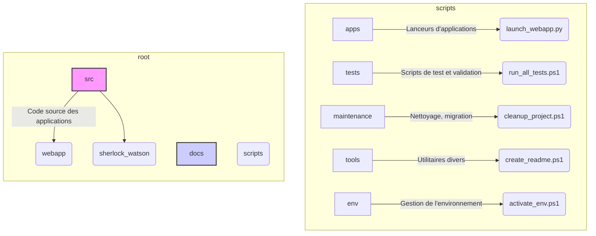

# Plan de Refactoring du Répertoire `scripts/`

## 1. Contexte et Objectifs

Ce document présente un plan de refactoring détaillé pour le répertoire `scripts/`. L'arborescence actuelle est complexe, mélange les responsabilités (code source d'applications, scripts de maintenance, tests, documentation, logs) et contient des structures redondantes.

L'objectif est de rationaliser cette structure pour la rendre :
*   **Intuitive** : Facile à naviguer pour les nouveaux comme les anciens développeurs.
*   **Logique** : Regroupement des scripts par fonctionnalité (tests, maintenance, outils...).
*   **Propre** : Exempte de fichiers temporaires, de logs et de code mort.
*   **Cohérente** : Élimination des duplications et des conventions de nommage ambiguës.

## 2. Analyse de la Structure Actuelle

L'analyse de la cartographie fournie révèle plusieurs problèmes majeurs :

*   **Mélange des genres** : Le répertoire contient à la fois des scripts d'outillage, du code source d'applications (`webapp`, `sherlock_watson`), des fichiers de documentation (`.md`), et des logs (`.log`).
*   **Redondance structurelle** : Des applications comme `webapp` et `sherlock_watson` existent à la fois à la racine de `scripts/` et dans le sous-répertoire `scripts/apps/`. C'est une source majeure de confusion.
*   **Dispersion des scripts** : Les scripts de test, de validation et d'environnement sont disséminés à plusieurs endroits (`scripts/dev/tools`, `scripts/testing`, `scripts/run_integration_tests.ps1`, etc.).
*   **Présence d'artefacts** : De nombreux répertoires `__pycache__` et fichiers `.log` polluent l'arborescence et ne devraient pas être versionnés.
*   **Documentation mal placée** : La présence d'un répertoire `docs/` à l'intérieur de `scripts/` est une mauvaise pratique.

## 3. Nouvelle Arborescence Cible

Pour résoudre ces problèmes, la nouvelle structure suivante est proposée. Elle est conçue pour être modulaire et évolutive.



**Arborescence textuelle cible :**

```
/ (project root)
├── docs/
│   ├── refactoring/
│   │   ├── 01_root_cleanup_plan.md
│   │   └── 02_scripts_cleanup_plan.md  <-- THIS FILE
│   └── scripts/  
│       └── ... (documentation des scripts déplacée ici)
├── scripts/
│   ├── apps/
│   │   └── webapp/
│   │       ├── launch_webapp_background.py
│   │       └── run_e2e_tests.bat
│   ├── env/
│   │   └── activate_project_env.ps1
│   ├── maintenance/
│   │   ├── cleanup/
│   │   └── migration/
│   ├── testing/
│   │   ├── functional/
│   │   ├── integration/
│   │   ├── e2e/
│   │   └── mcp/
│   └── tools/
│       ├── create_readme.ps1
│       └── force_stop_orchestrator.ps1
└── src/  (<-- RECOMMANDATION FORTE)
    ├── sherlock_watson/
    └── webapp/
```

**Note importante :** Idéalement, le code source des applications (`webapp`, `sherlock_watson`, etc.) devrait être déplacé dans un répertoire `src/` à la racine du projet, car `scripts/` est destiné à l'outillage et non au code applicatif. Le plan ci-dessous se concentre sur le refactoring de `scripts/` mais prépare ce mouvement.

## 4. Plan de Migration Détaillé

### Phase 1 : Création de la Nouvelle Structure

1.  `CREATE DIRECTORY`: `scripts/testing`
2.  `CREATE DIRECTORY`: `scripts/tools`
3.  `MOVE DIRECTORY`: Déplacer `scripts/env` vers `scripts/tools/env` pour clarifier qu'il s'agit d'un outillage de développement. (Alternative: le garder en `scripts/env` s'il est utilisé par la CI/CD). Pour ce plan, nous le gardons à la racine de `scripts/` pour la simplicité.

### Phase 2 : Nettoyage et Suppression

1.  `DELETE`: Tous les répertoires `__pycache__`.
2.  `DELETE`: Tous les fichiers `*.log`.
3.  `DELETE`: Le fichier `scripts/dev/fixes` (nom trop vague, contenu inconnu, à analyser avant suppression définitive).
4.  `GITIGNORE`: Mettre à jour le fichier `.gitignore` racine pour inclure `**/__pycache__/` et `*.log`.

### Phase 3 : Déplacement et Rationalisation

| Action | Chemin Source                                       | Chemin Destination                                   | Justification                                                                 |
|--------|-------------------------------------------------------|------------------------------------------------------|-------------------------------------------------------------------------------|
| **MOVE**   | `scripts/docs/`                                       | `docs/scripts_legacy/`                               | La documentation n'a pas sa place dans le répertoire de scripts.                |
| **MOVE**   | `scripts/run_integration_tests.ps1`                   | `scripts/testing/run_integration_tests.ps1`          | Centralisation des scripts de tests.                                          |
| **MOVE**   | `scripts/dev/tools/run_functional_tests.ps1`          | `scripts/testing/run_functional_tests.ps1`           | Centralisation des scripts de tests.                                          |
| **MOVE**   | `scripts/dev/tools/run_mcp_tests.ps1`                 | `scripts/testing/run_mcp_tests.ps1`                  | Centralisation des scripts de tests.                                          |
| **MOVE**   | `scripts/apps/webapp/run_e2e_tests.bat`               | `scripts/testing/run_e2e_tests.bat`                  | Centralisation des scripts de tests.                                          |
| **MOVE**   | `scripts/validate_authentic_system.py`                | `scripts/testing/validate_authentic_system.py`       | Script de validation qui est une forme de test.                               |
| **MOVE**   | `scripts/maintenance/recovered/validate_oracle_coverage.py` | `scripts/testing/validate_oracle_coverage.py` | Script de validation qui est une forme de test.                               |
| **MOVE**   | `scripts/create_readme.ps1`                           | `scripts/tools/create_readme.ps1`                    | Script utilitaire pour la documentation.                                      |
| **MOVE**   | `scripts/run_in_env.py`                               | `scripts/env/run_in_env.py`                          | Regroupement des scripts liés à l'environnement.                              |
| **MOVE**   | `scripts/dev/tools/force_stop_orchestrator.ps1`       | `scripts/tools/force_stop_orchestrator.ps1`          | Outil de développement générique.                                             |
| **MOVE**   | `scripts/dev/debugging/`                              | `scripts/tools/debugging/`                           | Les outils de débogage sont des outils de développement.                          |
| **ARCHIVE**| `scripts/webapp/`                                     | `archived_scripts/legacy/webapp/`                  | Structure redondante avec `scripts/apps/webapp`. À supprimer après vérification. |
| **ARCHIVE**| `scripts/sherlock_watson/`                            | `archived_scripts/legacy/sherlock_watson/`         | Redondant avec `scripts/apps/sherlock_watson`.                                |
| **ARCHIVE**| `scripts/dev/`                                      | `archived_scripts/legacy/dev/`                       | Le contenu a été déplacé vers `testing/` et `tools/`.                           |
| **ARCHIVE**| `scripts/main/`                                     | `archived_scripts/legacy/main/`                      | Le nom est trop générique et son contenu semble applicatif.                 |
| **CONSOLIDATE** | `scripts/maintenance/`                         | -                                                    | Fusionner les scripts non classés à la racine de `maintenance/` dans les sous-dossiers. |

### Phase 4 : Recommandations Post-Refactoring

1.  **Mettre à jour la CI/CD** : Vérifier tous les pipelines (`.github/workflows`, Jenkinsfile, etc.) pour mettre à jour les chemins des scripts qui ont été déplacés.
2.  **Mettre à jour la Documentation** : Mettre à jour le `README.md` principal et toute autre documentation qui ferait référence aux anciens emplacements de scripts.
3.  **Analyse du code applicatif** : Planifier le déplacement du code source des applications (`scripts/apps/*`) vers un répertoire `src/` à la racine du projet pour une séparation claire des préoccupations.
4.  **Consolidation des scripts** : Examiner les scripts maintenant regroupés (ex: les nombreux scripts dans `maintenance/cleanup/`) pour identifier les opportunités de fusion et de simplification.