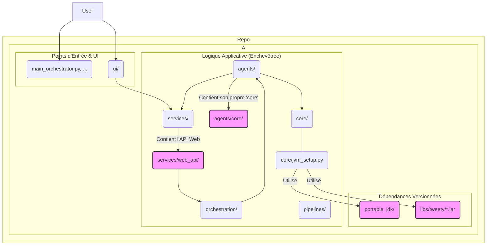
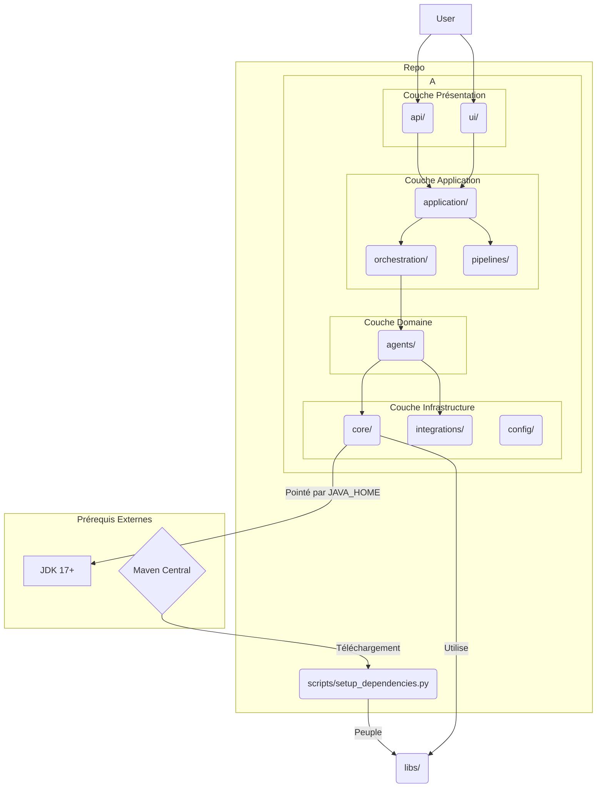

# Plan de Refactoring : `argumentation_analysis`

Ce document présente un plan détaillé pour le refactoring du répertoire `argumentation_analysis`. L'objectif est de simplifier la structure, de clarifier les responsabilités de chaque module, d'améliorer la gestion des dépendances et d'augmenter la maintenabilité globale du projet.

## 1. Analyse de la Structure Actuelle

La structure actuelle est très complexe, avec des responsabilités qui se chevauchent et une gestion des dépendances non standard.

### Diagramme de l'architecture actuelle (simplifié)

### Problèmes identifiés :

1.  **Dépendances versionnées** : La présence de `portable_jdk` et des fichiers `.jar` dans `libs` est une mauvaise pratique. Cela alourdit considérablement le dépôt, rend les mises à jour difficiles, et crée des dépendances de plateforme implicites.
2.  **Frontières floues** : Les responsabilités entre `core`, `agents`, `orchestration` et `services` ne sont pas claires.
    *   `agents` contient son propre sous-répertoire `core`, créant une confusion avec le `core` principal.
    *   `services` mélange la logique métier (ex: `jtms_service`) et la couche de présentation (`web_api`). L'API web ne devrait pas être enfouie ici.
    *   `core` contient à la fois des utilitaires bas niveau (`jvm_setup`) et de la logique qui pourrait appartenir à d'autres modules.
3.  **Structure éclatée** : Des tests, des scripts et des exemples sont disséminés à travers de multiples répertoires, rendant la navigation et la maintenance difficiles.

## 2. Proposition de Nouvelle Architecture

L'objectif est de suivre des principes de conception logicielle clairs, en séparant nettement les couches de l'application.

### Diagramme de l'architecture cible

### Description des modules cibles :

*   **`api/`** (Anciennement `services/web_api`): Point d'entrée pour les requêtes HTTP. Strictement responsable du protocole web (routage, validation des requêtes/réponses).
*   **`ui/`**: L'application Streamlit/Gradio, pour l'interaction utilisateur directe.
*   **`application/`** (Anciennement `services` et parties de `orchestration`): Contient la logique applicative qui n'est ni de l'orchestration pure ni de la présentation. Agit comme un médiateur entre la couche de présentation et la couche de domaine.
*   **`orchestration/`**: Responsable de la coordination des `agents` et de l'exécution des `pipelines`. Devrait contenir la logique de haut niveau (ex: `HierarchicalOrchestrator`).
*   **`pipelines/`**: Définit des séquences d'opérations complexes (workflows) en utilisant les orchestrateurs et les agents.
*   **`agents/`**: Les "travailleurs" de notre système. Chaque agent a une responsabilité unique et bien définie (ex: `InformalFallacyAgent`, `FOLAgent`). Le `agents/core` est éliminé.
*   **`core/`**: Code fondamental et agnostique. Utilitaires génériques (`core/utils`), configuration de bas niveau (`core/jvm_setup`), et classes de base abstraites.
*   **`integrations/`**: Code spécifique à l'intégration de services tiers (ex: `Semantic Kernel`).
*   **`config/`**: Fichiers de configuration, variables d'environnement.
*   **`libs/`**: Ne contiendra plus de binaires. Peut contenir des stubs ou des wrappers Python pour les librairies Java téléchargées.
*   **`scripts/`**: Scripts de maintenance, de déploiement, ou d'installation (`setup_dependencies.py`).
*   **`tests/`**: Un répertoire unique à la racine, qui mime la structure du code source.

## 3. Plan de Migration Étape par Étape

1.  **Étape 0 : Préparation**
    *   Créer une nouvelle branche `refactor/arg-analysis`.
    *   S'assurer que la suite de tests actuelle passe.

2.  **Étape 1 : Externaliser les Dépendances Lourdes**
    *   Supprimer le répertoire `portable_jdk/`.
    *   Supprimer le contenu de `libs/tweety/`.
    *   Mettre à jour `docs/refactoring/02_scripts_cleanup_plan.md` et le `README.md` principal pour indiquer que l'installation d'un JDK 17+ est un prérequis et que la variable `JAVA_HOME` doit être configurée.
    *   Modifier `core/jvm_setup.py` pour qu'il utilise `JAVA_HOME` pour trouver la JVM au lieu d'un chemin relatif.
    *   Créer un script `scripts/setup_dependencies.py` qui télécharge le `.jar` de Tweety depuis Maven Central et le place dans `libs/`.

3.  **Étape 2 : Réorganiser la Couche de Présentation et de Service**
    *   Créer un nouveau répertoire `api/` à la racine de `argumentation_analysis`.
    *   Déplacer le contenu de `services/web_api/` vers `api/`.
    *   Renommer `services/` en `application/`.
    *   Mettre à jour toutes les importations pour refléter ces changements.

4.  **Étape 3 : Rationaliser `core` et `agents`**
    *   Fusionner `agents/core/` dans le `core/` principal. La logique vraiment spécifique à un agent doit être déplacée dans le module de l'agent concerné.
    *   Déplacer les utilitaires spécifiques aux agents de `core/utils` vers un nouveau `agents/utils`.
    *   Passer en revue chaque agent dans `agents/` pour s'assurer qu'il a une responsabilité unique.

5.  **Étape 4 : Centraliser les Tests**
    *   Créer un répertoire `tests/` à la racine de `argumentation_analysis` s'il n'existe pas.
    *   Déplacer le contenu de tous les sous-répertoires de test (ex: `core/tests/`, `agents/test_scripts/`) dans `tests/`, en recréant une arborescence qui reflète la nouvelle structure du code source.
    *   Adapter les configurations de `pytest` et `coverage` si nécessaire.

6.  **Étape 5 : Nettoyage et Validation**
    *   Parcourir l'ensemble du projet pour corriger toutes les importations cassées.
    *   Lancer la suite de tests complète pour s'assurer qu'aucune régression n'a été introduite.
    *   Mettre à jour tous les `README.md` des sous-répertoires pour refléter leur nouveau rôle.