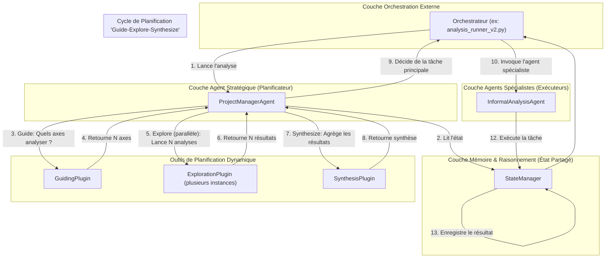

# Analyse Architecturale du Système d'Identification de Sophismes Informels

## Introduction

Ce document dresse un état des lieux exhaustif de tous les composants liés à l'identification de sophismes informels. L'analyse a révélé que l'architecture principale et la plus aboutie du système est un **modèle multi-agents "Plan-and-Execute"**, orchestré par un agent planificateur (`ProjectManagerAgent`) qui délègue des tâches à des agents spécialistes (`InformalAnalysisAgent`, etc.) via un gestionnaire d'état (`StateManager`).

D'autres architectures, comme un pipeline "multi-niveaux" et une approche "one-shot", coexistent mais semblent être des implémentations secondaires ou héritées. L'objectif de ce document est de décrire en détail l'architecture principale, tout en cataloguant les autres composants pour fournir une base solide au futur plan de consolidation.

---

## 1. Inventaire Architectural par Rôle

Voici un inventaire des composants du système, classés par leur rôle architectural.

### 1.1. Architecture Principale ("Plan-and-Execute")

Cette architecture est la plus aboutie. Elle s'articule autour d'un planificateur central qui délègue des tâches à des agents spécialistes via une mémoire partagée.

*   **Planificateur Stratégique** :
    *   `argumentation_analysis/agents/core/pm/pm_agent.py` : Le `ProjectManagerAgent`, qui décide de la prochaine étape de l'analyse.
    *   `argumentation_analysis/agents/core/pm/prompts.py` : Les prompts qui contiennent la logique de décision du planificateur.
*   **Agent Spécialiste** :
    *   `argumentation_analysis/agents/core/informal/informal_agent.py` : L'`InformalAnalysisAgent`, l'agent hybride (natif + sémantique) qui exécute les tâches d'analyse de sophismes. C'est l'implémentation de référence.
    *   `argumentation_analysis/agents/core/informal/prompts.py` : Les prompts complexes qui définissent le workflow de raisonnement de l'`InformalAnalysisAgent`.
    *   `argumentation_analysis/agents/core/informal/informal_definitions.py` : La configuration du Kernel pour l'agent, qui enregistre ses plugins natifs et sémantiques.
*   **Composants de Support** :
    *   `argumentation_analysis/orchestration/analysis_runner_v2.py` : Un exemple d'orchestrateur externe qui exécute la boucle "Plan-and-Execute".
    *   `StateManager` (conceptuel) : Le service/plugin de gestion d'état qui sert de mémoire partagée. Il est simulé dans les tests par `StateManagerMock`.
    *   `argumentation_analysis/agents/utils/informal_optimization/` : Répertoire contenant la documentation sur l'évolution et l'optimisation des prompts et de la logique de l'`InformalAnalysisAgent`.

### 1.2. Pipelines d'Orchestration et d'Analyse

Cette section regroupe les différents pipelines qui servent de points d'entrée et d'orchestrateurs pour des analyses complètes.

*   **Architecture "Pipeline d'Analyse Avancée" (Multi-niveaux)**
    *   **Rôle** : Approche sophistiquée et indépendante, fonctionnant comme un pipeline de traitement de données.
    *   `argumentation_analysis/pipelines/advanced_rhetoric.py` : Point d'entrée qui orchestre l'analyse avancée sur une liste de textes.
    *   `argumentation_analysis/orchestration/advanced_analyzer.py` : Composant qui appelle séquentiellement les outils d'analyse spécialisés.
    *   **Analyse** : Cette architecture est mature mais complexe. *Candidate à être simplifiée ou fusionnée avec le pipeline unifié.*

*   **Architecture "Pipeline Unifié"**
    *   **Rôle** : Semble être le point d'entrée le plus récent et le plus global, capable de gérer différents types d'analyses.
    *   `argumentation_analysis/pipelines/unified_text_analysis.py`: **[N'était pas documenté]** Orchestrateur textuel principal qui semble pouvoir invoquer différents agents et services en fonction de la demande.
    *   `argumentation_analysis/pipelines/analysis_pipeline.py` et `reporting_pipeline.py`: **[N'étaient pas documentés]** Pipelines de support vraisemblablement utilisés par `unified_text_analysis` pour la génération de résultats.
    *   **Analyse** : C'est un composant central, probablement le successeur des autres pipelines. *Candidat pour devenir le point d'entrée principal du système consolidé.*

### 1.3. Architectures et Composants Hérités ou Alternatifs

Ces composants représentent des approches plus anciennes ou différentes qui coexistent dans la base de code.

*   **Agent Configurable ("One-Shot")** :
    *   `argumentation_analysis/agents/concrete_agents/informal_fallacy_agent.py` : Une implémentation d'agent plus ancienne, configurable pour utiliser différents plugins, notamment le `FallacyWorkflowPlugin` pour une analyse "one-shot". À ne pas confondre avec `InformalAnalysisAgent`.
    *   `argumentation_analysis/agents/prompts/InformalFallacyAgent/` : Le prompt simple associé à cet agent.
    *   `argumentation_analysis/agents/plugins/fallacy_workflow_plugin.py` : Le plugin qui effectue une analyse rapide en un seul appel LLM.
*   **Adaptateur de Rétrocompatibilité** :
    *   `argumentation_analysis/agents/core/informal/informal_agent_adapter.py` : Une classe nommée `InformalAgent` qui sert de façade pour assurer la compatibilité des anciens tests avec la nouvelle implémentation `InformalAnalysisAgent`.

### 1.4. Outils d'Analyse Fondamentaux (Briques de base)

**[Section entièrement nouvelle]**

Cette section catalogue les briques logicielles qui effectuent le travail d'analyse de bas niveau. Elles sont les "moteurs" utilisés par les architectures de plus haut niveau.

*   **Outils d'analyse "Enhanced" (Moteurs de l'architecture Multi-niveaux)** :
    *   **Localisation** : `argumentation_analysis/agents/tools/analysis/enhanced/`
    *   `complex_fallacy_analyzer.py` : Détecte les sophismes composites et les relations complexes.
    *   `contextual_fallacy_analyzer.py` : Analyse le contexte pour affiner la détection.
    *   `fallacy_severity_evaluator.py` : Évalue la gravité des sophismes détectés.
    *   **Analyse** : Ces outils sont matures et constituent le cœur de l'analyse la plus fine. *À conserver et à généraliser comme outils de référence.*

*   **Outils d'analyse "New" (Nouvelle génération expérimentale)** :
    *   **Localisation** : `argumentation_analysis/agents/tools/analysis/new/`
    *   `contextual_fallacy_detector.py` : Semble être une nouvelle implémentation de la détection contextuelle.
    *   `argument_coherence_evaluator.py`: Évalue la cohérence logique entre les arguments.
    *   **Analyse** : Représentent une nouvelle approche. *Candidats pour remplacer les anciennes générations d'outils après évaluation comparative.*

*   **Outils d'analyse de base (Première génération)** :
    *   **Localisation** : `argumentation_analysis/agents/tools/analysis/`
    *   Les fichiers `complex_fallacy_analyzer.py` et `contextual_fallacy_analyzer.py` à ce niveau semblent être des versions plus anciennes de ceux du répertoire `enhanced/`.
    *   **Analyse** : Probablement hérités. *Candidats évidents à la suppression au profit des versions "enhanced" ou "new".*

### 1.5. Plugins et Services Partagés

Composants de bas niveau pouvant être utilisés par différentes architectures.

*   **Plugins Sémantiques Modulaires** :
    *   `argumentation_analysis/plugins/GuidingPlugin/` : Un plugin de "triage" qui identifie les grandes catégories de sophismes probables dans un texte, afin de guider l'analyse.
    *   `argumentation_analysis/plugins/ExplorationPlugin/` : Un plugin d'analyse ciblée qui recherche des sophismes dans une catégorie spécifique. Conçu pour travailler de pair avec le `GuidingPlugin`.
    *   `argumentation_analysis/plugins/SynthesisPlugin/` : **[N'était pas documenté]** Un plugin qui agrège les résultats de plusieurs `ExplorationPlugin` lancés en parallèle. Il représente l'étape de "convergence" du cycle "Guide-Explore-Synthesize".
*   **Services Fondamentaux** :
    *   `argumentation_analysis/services/fallacy_taxonomy_service.py` : Service central et essentiel pour accéder et gérer la taxonomie des sophismes. *À conserver absolument.*
    *   `argumentation_analysis/services/fallacy_family_definitions.py`: Fournit des métadonnées sur les familles de sophismes (sévérité, mots-clés, etc.). *Rôle important, à conserver.*
    *   `argumentation_analysis/services/fact_verification_service.py`: **[N'était pas documenté]** Service transverse pour la vérification des faits, utilisé par certains analyseurs. *Son rôle transverse doit être clarifié et le service potentiellement généralisé.*
    *   `argumentation_analysis/services/web_api/services/fallacy_service.py`: **[N'était pas documenté]** Service spécifique à l'API Web. Sert probablement de façade qui appelle les autres services d'analyse. *À conserver mais bien distinguer des services internes.*

### 1.5. Scripts de Validation et de Démonstration

Ces fichiers ne font pas partie d'une architecture, mais servent à la valider ou à en faire la démonstration.

*   **Tests de Performance** :
    *   `argumentation_analysis/scripts/test_performance_extraits.py` : Script de test (format `pytest`) pour valider les performances et le bon fonctionnement de l'architecture principale (`InformalAnalysisAgent`).
*   **Démonstrateurs** :
    *   `argumentation_analysis/demos/run_rhetorical_analysis_demo.py` : Point d'entrée utilisateur qui exécute un pipeline d'analyse global.
*   **Exemples d'Outils** :
    *   `argumentation_analysis/examples/rhetorical_tools/contextual_fallacy_detector_example.py` : Exemple d'utilisation isolée d'un outil d'analyse de bas niveau.

---

## 2. Architecture Principale : Modèle Multi-Agents "Plan-and-Execute"

L'architecture la plus récente et fonctionnelle est un système multi-agents qui suit un cycle "Planifier et Exécuter".

### Description du Flux (Révisée et Corrigée)

L'architecture est un système qui combine la flexibilité des LLMs pour la planification et l'exécution de tâches d'analyse complexes.

1.  **Initiation** : L'**Orchestrateur** externe lance le `ProjectManagerAgent`.
2.  **Lecture de l'État** : Le `ProjectManagerAgent` lit l'état actuel de l'analyse depuis le `StateManager`, qui agit comme une mémoire partagée.
3.  **Cycle "Guide-Explore-Synthesize"** : Pour décider de la prochaine action, le planificateur peut initier un cycle de recherche en 3 étapes :
    *   **a. Guide** : Il utilise le `GuidingPlugin` pour identifier les axes d'analyse les plus prometteurs (ex: "analyser les sophismes de pertinence").
    *   **b. Explore (Déploiement en éventail)** : Pour chaque axe, il peut lancer en parallèle une instance de `l'ExplorationPlugin`, qui effectue une analyse ciblée.
    *   **c. Synthesize (Convergence)** : Les résultats des explorations parallèles sont agrégés par le `SynthesisPlugin` en une conclusion unique.
4.  **Planification** : Sur la base de cette synthèse, le `ProjectManagerAgent` décide de la tâche principale à exécuter (ex: "Rédiger le rapport sur le sophisme X").
5.  **Délégation et Exécution** : Le `ProjectManagerAgent` retourne le plan à l'Orchestrateur, qui invoque l'agent spécialiste compétent (ex: `InformalAnalysisAgent`).
6.  **Mise à jour de l'État Final** : L'agent spécialiste exécute sa tâche et enregistre le résultat final dans le `StateManager`.
7.  **Boucle** : Le contrôle retourne à l'Orchestrateur, qui peut relancer le `ProjectManagerAgent` pour un nouveau cycle de planification si l'analyse n'est pas terminée.

---

## 3. Architectures Secondaires et Héritées

Les approches suivantes sont fonctionnelles mais ne font pas partie du flux "Plan-and-Execute" principal. Elles représentent des implémentations plus anciennes, alternatives ou spécialisées.

### 3.1. Architecture "Pipeline d'Analyse Avancée" (Multi-niveaux)

Il s'agit d'une architecture complète et indépendante qui fonctionne comme un pipeline de traitement de données, conçue pour une analyse rhétorique très détaillée.

-   **Rôle** : Fournir une analyse extrêmement riche et structurée, incluant la vérification factuelle et l'analyse stratégique.
-   **Flux** :
    1.  **Niveau 3 (Pipeline)**: Le point d'entrée `pipelines/advanced_rhetoric.py` prend en charge une liste de textes.
    2.  **Niveau 2 (Orchestrateur)**: Pour chaque texte, il délègue à `orchestration/advanced_analyzer.py`, qui orchestre les différents outils d'analyse.
    3.  **Niveau 1 (Analyseurs)**: Des outils comme `agents/tools/analysis/fallacy_family_analyzer.py` sont appelés. Ce dernier est lui-même un mini-orchestrateur qui intègre détection de sophismes et vérification factuelle (`FactVerificationService`).
-   **Cas d'usage** : Idéal pour des analyses post-mortem approfondies, du traitement par lots, ou lorsque la richesse de l'analyse prime sur la vitesse de réponse interactive.

### 3.2. Architecture "Agent Configurable" (One-Shot)

Cette architecture est incarnée par l'`InformalFallacyAgent`. C'est une approche plus ancienne mais flexible, où un unique agent peut être configuré pour effectuer une analyse complète en un seul appel.

-   **Rôle** : Permettre une analyse rapide et simple via la configuration d'un agent unique.
-   **Composants** :
    *   L'agent principal est `agents/concrete_agents/informal_fallacy_agent.py`.
    *   Le plugin clé pour le mode "one-shot" est `agents/plugins/fallacy_workflow_plugin.py`, qui effectue un appel LLM unique et massif.
    *   La logique est définie dans le prompt simple situé dans `agents/prompts/InformalFallacyAgent/`.
-   **Cas d'usage** : Utile pour des intégrations simples, des démonstrations rapides, ou lorsque la latence est critique et qu'une analyse moins détaillée est acceptable.

---

## 4. Validation, Tests et Démonstration

Le projet contient un ensemble de scripts et de documents qui ne font pas partie de l'architecture d'exécution mais qui sont essentiels pour sa validation et sa compréhension.

### 4.1. Scripts de Test et de Performance

-   **`scripts/test_performance_extraits.py`**: Suite de tests `pytest` qui cible spécifiquement l'architecture principale "Plan-and-Execute" (`InformalAnalysisAgent` et ses dépendances). C'est le principal outil de validation pour l'architecture de référence. Il utilise un `StateManagerMock` pour isoler les tests.
-   **Autres fichiers de tests** : Des tests unitaires pour des outils spécifiques (`test_complex_fallacy_analyzer.py`) et des tests d'intégration sont également présents, bien que leur couverture puisse être inégale.

### 4.2. Scripts de Démonstration et Exemples

-   **`demos/run_rhetorical_analysis_demo.py`**: Démonstrateur de haut niveau qui utilise un pipeline (`run_text_analysis_pipeline`) pour montrer les capacités globales du système. Il sert de point d'entrée pour un utilisateur final.
-   **`examples/rhetorical_tools/`**: Ce répertoire contient des scripts qui montrent comment utiliser des outils d'analyse de bas niveau de manière isolée (par exemple, `contextual_fallacy_detector_example.py`). Ils sont utiles pour comprendre le fonctionnement de briques logicielles individuelles.